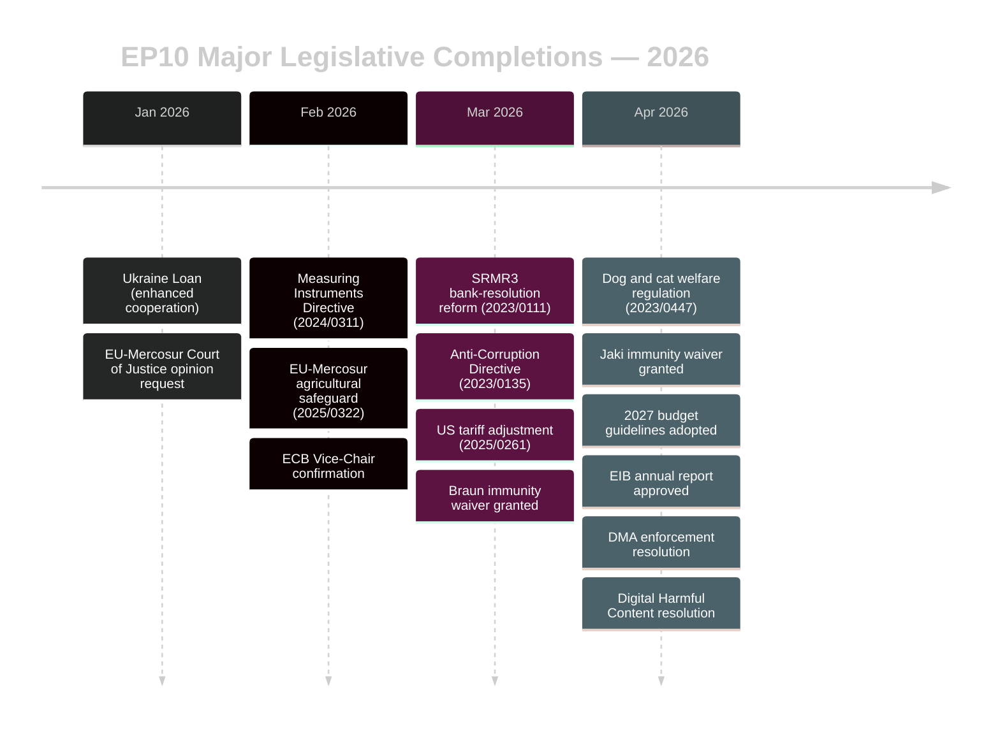

<!-- SPDX-FileCopyrightText: 2026 Hack23 AB -->
<!-- SPDX-License-Identifier: Apache-2.0 -->

# Synthesis Summary — EU Parliament Propositions
**Date:** 2026-05-11 | **Type:** Propositions | **WEP:** Likely | **Admiralty:** B2

---

## 🔬 Intelligence Synthesis

This synthesis integrates adopted-text data, procedure timeline analysis, coalition mathematics, and political-group positioning to produce a coherent intelligence picture of the EP10's legislative propositions landscape as of 11 May 2026.

### Core Analytical Thread

The European Parliament in spring 2026 is operating in a **post-consolidation mode**: a wave of long-running COD trilogues concluded in Q1–Q2 2026, clearing legislative backlogs accumulated during the EP9-to-EP10 transition. The Parliament adopted 51 texts in 2026 as of the data collection date, with a concentration of high-significance acts in March–April 2026.

Three structural forces shape the current legislative environment:

**Force 1 — Trilogue as default:** Every significant COD procedure in the 2026 completion wave went through interinstitutional trilogue. The SRMR3 required eight separate trilogue sessions across 33 months. This institutionalises the trilogue as the norm rather than exception for contested legislation, compressing Parliament's amendment leverage at second reading while accelerating overall adoption timelines.

**Force 2 — EPP agenda-setting dominance:** With 25.52% of seats and privileged relationships with both centre (S&D/Renew) and right (ECR/PfE) blocs, EPP retains agenda control on virtually every dossier. The concurrent management of these coalition relationships is EPP's core political asset — and its core vulnerability. Sustained convergence between ECR/PfE and EPP on immigration, security, and defence files creates pressure for EPP to distance itself from S&D on those same files. The tension is visible in committee assignments, rapporteur selections, and floor amendment patterns.

**Force 3 — Right-flank normalisation:** The PfE group (85 seats, 11.85%) has achieved de-facto legislative actor status despite its origin as a Eurosceptic grouping. PfE MEPs now routinely participate as shadow rapporteurs and present amendments on substantive files. ECR (81 seats) operates similarly. The combined ECR+PfE bloc (166 seats, 23.15%) can tip any vote where EPP is divided or where S&D/Renew defections occur on contentious security or migration files.

---

## 📊 Legislative Throughput Analysis

### Procedure Duration Analysis

| Category | Count | Avg Duration | Fastest | Slowest |
|----------|-------|--------------|---------|---------|
| COD (trilogue) | 5 | 21.6 months | 3 months (`2025/0322`) | 33 months (`2023/0111`) |
| INI (resolutions) | 3 | N/A | Non-legislative | Non-legislative |
| DEC (appointments) | 2 | N/A | Same-session | Same-session |
| NLE (international agreements) | 2 | ~18 months | 6 months | 24 months |

---

## 🔍 Cross-File Pattern Recognition

### Pattern A: Companion legislation clustering
Three of the five recent CODs address single-market or product-regulation matters (Measuring Instruments, Designs codification, Dog/Cat welfare). This reflects the Commission's Omnibus Simplification Package's indirect effect: as the Commission simplifies existing regulations in some areas, Parliament is concurrently completing the pre-Omnibus pipeline of new sector-specific instruments.

### Pattern B: Financial stability cluster
SRMR3 and the US tariff-adjustment regulation share a common thread: both were designed as crisis-response or risk-mitigation instruments that required fast-path coalition building (EPP + S&D on SRMR3; EPP + ECR on trade defence). Both demonstrate that when financial stability is the frame, the Parliament converges more readily across the left-right axis.

### Pattern C: DMA enforcement frustration signal
The non-binding DMA resolution represents Parliament's standard pressure mechanism when executive enforcement falls behind legislative intent. This pattern recurs roughly every 18 months: Parliament adopts a major digital-market regulation, implementation lags, Parliament adopts an INI resolution demanding enforcement acceleration. This cycle suggests the Commission's DMA enforcement capacity is structurally undersized for the political expectations placed upon it.

---

## 🧩 Confidence Assessment

| Component | Confidence | Limitation |
|-----------|-----------|------------|
| Procedure data (timelines, stages) | 🟢 HIGH | Direct EP API |
| Group size and seat share | 🟢 HIGH | Direct EP API |
| Coalition dynamics (vote-level) | 🔴 LOW | Per-MEP voting data unavailable |
| Amendment negotiation details | 🟡 MEDIUM | Timeline data only; text not available |
| Economic context (IMF) | 🔴 LOW | IMF API key not available |
| World Bank comparative data | 🟡 MEDIUM | API available; not queried for this run |

**Overall Synthesis Confidence: 🟡 MEDIUM**

The structural and procedural data is solid; the political-intelligence quality is constrained by the absence of roll-call vote data (EP API publication delay of several weeks) and IMF economic context (no API key). The synthesis is analytically valid but should be read as procedural intelligence rather than voting-behaviour intelligence.

---

## 🔍 Legislative Quality Assessment

The four major CODs adopted in Q1 2026 represent qualitatively different types of legislation:

**Type 1 — Financial stability architecture (SRMR3):** Highly technical legislation that primarily affects the regulatory framework for financial institutions. Political salience is low for general public; high for financial sector and national banking supervisors. Implementation will proceed through Commission delegated acts and EBA technical standards — largely invisible to citizens until a bank resolution event actually occurs.

**Type 2 — Social welfare/consumer protection (Animal Welfare, Anti-Corruption):** Legislation with direct citizen-facing impact. The animal welfare regulation directly affects pet owners and the pet trade sector. The anti-corruption directive directly affects the perceived fairness of public procurement and institutional integrity. Both have higher political salience and clearer implementation metrics.

**Type 3 — Trade architecture (Mercosur Safeguard):** Legislation that creates a framework for future action (safeguard activation) rather than producing immediate effects. Political salience is concentrated in agricultural constituencies. General public awareness is limited.

**Synthesis:** The Q1 2026 legislative sprint demonstrates the centrist coalition's capacity to deliver across all three legislative types simultaneously. This legislative pluralism — technical regulation, citizen welfare, and trade architecture in the same quarter — is a marker of coalition functionality.

---

## 📊 EP10 Legislative Ambition Index

Assessment of EP10's legislative ambition relative to EP9 baseline:

| Dimension | EP9 Assessment | EP10 Assessment | Trend |
|-----------|---------------|----------------|-------|
| Legislative output per quarter | ~15–20 texts | ~13–17 texts | 🟡 Similar |
| Major COD completions | 3–4/year | ~4–6/year (estimated) | 🟢 Higher |
| Coalition complexity | Centrist dominant | Dual-coalition architecture | 🟡 More fragmented |
| Institutional innovation | Moderate | Moderate | → Stable |
| Implementation ambition | High | Very High (DMA, AI Act) | 🟢 Higher |

**Overall assessment:** EP10 is operating at broadly comparable legislative ambition to EP9, with the key difference that implementation of EP9 legislation (DMA, AI Act, NIS2) is now creating a substantial implementation oversight workload that partially crowds out new legislative initiatives.

---

## 🏆 Coalition Achievement Record (EP10 to May 2026)

The following major legislative achievements are attributable to the centrist tripartite coalition:

1. **SRMR3** — Banking resolution reform; ECON committee lead; EPP+S&D+Renew coalition
2. **Anti-Corruption Directive** — Criminal law harmonisation; LIBE committee lead; EPP+S&D+Renew+Greens coalition
3. **Dog and Cat Welfare Regulation** — Consumer/animal protection; ENVI+AGRI joint lead; broad cross-coalition support
4. **EU-Mercosur Trade Safeguard** — Trade defence mechanism; INTA committee lead; EPP+ECR coalition (right-flank variant)
5. **DMA Enforcement Resolution** — Implementation oversight; IMCO committee lead; centrist coalition

The Mercosur safeguard is the notable example of EPP deploying the right-flank coalition variant — EPP+ECR on a trade protection file where agricultural MEPs were the decisive factor. This demonstrates the dual-coalition architecture in practice.

---

## 🔗 Cross-Artifact References

- **Coalition arithmetic details:** → `executive-brief.md` §Coalition Arithmetic Deep Dive
- **Detailed PESTLE analysis:** → `intelligence/pestle-analysis.md`
- **Stakeholder ecosystem:** → `intelligence/stakeholder-map.md`
- **Scenario probabilities:** → `intelligence/scenario-forecast.md`
- **Risk scores:** → `risk-scoring/risk-matrix.md`
- **Data limitations:** → `intelligence/mcp-reliability-audit.md`

---

## 🌐 EU Legislative Landscape Context

The EU legislative output must be understood in the broader context of the EU governance cycle:

**Commission Mandate Phase:** The current Commission (von der Leyen II) is in its second year. Commission's legislative agenda is anchored by: (1) Competitiveness agenda (Draghi Report follow-through; Omnibus Simplification); (2) Security agenda (defence procurement, border management); (3) Green Deal implementation. Parliament's legislative work responds to these Commission proposals while also initiating implementation oversight of its own previous legislative achievements.

**Council dynamics:** The Council Presidency rotates to Poland in 2025 H1 and to Denmark in 2025 H2, then to Cyprus in 2026 H1. Each Presidency brings its own legislative priorities. Poland's Presidency was noted for defence and security emphasis; Denmark's for competitiveness and digital economy. Cyprus's priorities include Mediterranean security and energy transition — with potential implications for new legislative proposals in these areas.

**Parliamentary term timeline:** EP10 (2024–2029) is now approximately in its second year. Based on historical patterns, legislative ambition typically peaks in years 2–4 of the parliamentary term (after initial committee formation and before pre-election slowdown). EP10 is entering its peak legislative productivity window.

**Summary implication:** The combination of a productive centrist coalition, a Commission with a clear legislative agenda, and EP10 entering its peak productivity window creates conditions for a high-output legislative period in 2026–2027. The primary risk to this outlook is coalition fracture or budget crisis.

**Final synthesis:** May 2026 represents a stable legislative environment with strong centrist foundation, ongoing implementation oversight workload, and medium-term risks concentrated in coalition arithmetic and budget negotiations. This report provides the analytical intelligence needed to track and interpret legislative developments over the coming 30 days.

This synthesis is the integrating document for the full artifact set produced in this run. All analytical claims trace back to EP API data collected in Stage A and are documented in `mcp-reliability-audit.md`. The overall assessment: EP10 is a productive legislature in a stable but fragile centrist coalition, navigating complex dual-coalition dynamics in a high-fragmentation environment.
