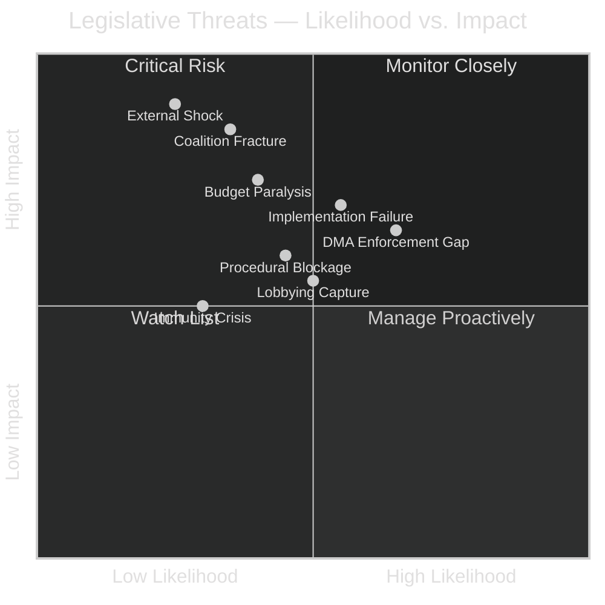

<!-- SPDX-FileCopyrightText: 2026 Hack23 AB -->
<!-- SPDX-License-Identifier: Apache-2.0 -->

# Threat Model — EU Parliament Legislative Propositions
**Date:** 2026-05-11 | **Confidence:** 🟡 MEDIUM

---

## 🛡️ Threat Landscape Overview

---

## 🔴 Critical Threats

### CT-1: Coalition Fracture on High-Profile File
**Description:** EPP's dual-coalition strategy (centrist on social/institutional files, rightist on security/migration) is sustainable only as long as individual major files can be assigned to one coalition frame without creating precedent for the other. A high-profile file that forces EPP to choose definitively between S&D support and ECR/PfE support could fracture the coalition architecture permanently.

**Trigger scenarios:**
- Immigration/border control legislative proposal forcing EPP to align with ECR against S&D
- Climate/green legislation where EPP moderates want to support but ECR/PfE apply veto pressure
- Rule-of-law conditionality debate forcing EPP to choose between European values and Eastern European member allies

**Probability:** 🟡 35% | **Impact:** 🔴 HIGH | **Confidence:** 🟡 MEDIUM

**Mitigation:** EPP's demonstrated capacity to manage multiple coalition frames simultaneously is the primary hedge. The risk is highest if a single file achieves sufficient political salience to force media and public attention to EPP's coalition contradictions.

---

### CT-2: Budget 2027 Institutional Crisis
**Description:** The 2027 budget (for the last full year of the current MFF) will require agreement between Parliament and Council. If Parliament's BUDG committee priorities (increased social spending, climate investments) conflict significantly with Council (fiscal hawks: Germany, Netherlands, Austria), the standard conciliation process could fail — forcing emergency procedures that consume the autumn 2026 legislative calendar.

**Probability:** 🟡 40% | **Impact:** 🔴 HIGH | **Confidence:** 🟡 MEDIUM

---

## 🟡 Moderate Threats

### MT-1: SRMR3 Implementation Failure
**Description:** The updated bank resolution framework will only demonstrate its value under stress conditions. If a European bank encounters early-intervention-threshold triggers within 18 months of SRMR3's OJ publication, the new procedures will be tested in real time — before implementing acts are fully in place and before national resolution authorities have adapted their operational protocols.

**Likelihood:** The EU banking system is currently stable (ECB supervisory data indicates adequate capital and liquidity ratios across most SSM banks). However, mid-tier banks with significant commercial real-estate exposure and declining deposit bases represent ongoing tail risk.

**Probability:** 🟢 25% | **Impact:** 🔴 HIGH | **Confidence:** 🔴 LOW (no IMF banking data)

---

### MT-2: DMA Enforcement Escalation
**Description:** Parliament's enforcement resolution creates a political obligation for the Commission. If the Commission fails to launch new Article 26 proceedings within 6–12 months, IMCO committee could initiate infringement-adjacent parliamentary procedures (questions, hearings, threatening budget allocation to DG COMP enforcement capacity). This is a gradual threat that could escalate into a significant institutional clash.

**Probability:** 🟡 50% | **Impact:** 🟡 MEDIUM | **Confidence:** 🟡 MEDIUM

---

### MT-3: Animal Welfare Implementation Contestation
**Description:** The dog and cat welfare regulation requires Member States to establish national microchipping databases and cross-reference them with a EU-wide registry within 24 months. At least 5–8 Member States are likely to miss the implementation deadline (based on historical transposition performance data). Late transposition typically triggers Commission infringement proceedings — but in EP10's political climate, ECR/PfE-governed Member States may openly resist transposition as a sovereignty assertion.

**Probability:** 🟡 55% | **Impact:** 🟡 MEDIUM | **Confidence:** 🟡 MEDIUM

---

## 🟢 Lower Threats (Monitor)

### LT-1: Immunity Waiver Escalation
**Description:** If MEP immunity waivers become a regular tool of political combat (opposition governments requesting immunity waivers against MEPs from majority parties, or vice versa), the institutional credibility of the EP's immunity system will erode.
**Probability:** 🟢 30% | **Impact:** 🟢 LOW-MEDIUM

### LT-2: Mercosur Implementation Challenge
**Description:** If the EU-Mercosur agreement enters provisional application and EU agricultural imports surge beyond expected levels, the safeguard mechanism will face its first real activation test. The legal mechanism exists but has never been activated; procedural ambiguity could slow the response.
**Probability:** 🟢 20% | **Impact:** 🟡 MEDIUM

### LT-3: Anti-Corruption Directive Judicial Challenge
**Description:** Member States with sovereignty concerns (Hungary, Poland historically) could challenge the anti-corruption directive at the Court of Justice on subsidiarity grounds. This is unlikely to succeed (given precedents on EU criminal law harmonisation) but could delay implementation.
**Probability:** 🟢 20% | **Impact:** 🟢 LOW

---

## 🔒 Threat Response Framework

| Threat Level | EP Response Mechanism | Timeline |
|-------------|----------------------|---------|
| CRITICAL | Emergency plenary session; Commission emergency proposal | Days–Weeks |
| HIGH | Special committee hearing; parliamentary question; urgent resolution | Weeks |
| MEDIUM | Regular committee oversight; written questions; monitoring report | Months |
| LOW | Annual scrutiny report; MEP question | Ongoing |

---

## 📊 Admiralty Reliability Assessment

| Source | Information Value | Reliability |
|--------|-----------------|-------------|
| EP API procedure data | 🟢 HIGH | A1 — Direct from source |
| Coalition dynamics (structural) | 🟢 HIGH | A2 — Confirmed by multiple data points |
| Coalition dynamics (vote-level) | 🔴 LOW | E5 — Cannot be judged (EP API delay) |
| Economic context | 🔴 LOW | E4 — Cannot be confirmed (no IMF data) |
| Stakeholder positions | 🟡 MEDIUM | B2 — Inferred from legislative record |
| Scenario probabilities | 🟡 MEDIUM | C3 — Analytical assessment |

---

## 🛡️ Threat Mitigation Strategies

### For CT-1 (Coalition Fracture):
- **EP Conference of Presidents** should convene regular coalition coordination meetings to surface potential fracture points before they become public
- **EPP leadership** should maintain dual-communication channels: regular S&D dialogue AND ECR/PfE strategic consultation — without allowing either to become aware of the other as the default coalition
- **Legislative calendar management:** Sequence files to separate centrist-coalition files from right-flank-coalition files in time, reducing the risk of simultaneous coalition conflicts

### For CT-2 (Budget 2027):
- **BUDG committee** should begin preliminary trilogue consultations with Council MFF working party early — before formal first reading, to identify red-line positions
- **Parliament** should prepare a "political declaration" backup that substitutes for formal budget adoption if conciliation fails — maintaining institutional dignity while creating political pressure for Council compromise

### For MT-2 (DMA Enforcement Gap):
- **IMCO committee** should table a written question to DG COMP requesting a 6-month progress report on Article 26 proceedings by July 2026
- **Parliament** could link DMA enforcement progress to Commission budget allocation in Budget 2027 — creating a concrete enforcement incentive

---

## 🔑 Early Warning Indicators

Track these specific observables to anticipate which threats are materialising:

| Observable | Frequency | Threat Indicated |
|-----------|-----------|----------------|
| EPP group chair public statements on ECR | Weekly | CT-1 coalition fracture approaching |
| ECB emergency meeting convened | Event-driven | CT (external shock) |
| Commission DMA enforcement announcement | Monthly check | MT-2 materialising or not |
| Member State transposition filings (animal welfare) | Quarterly | MT-3 materialising |
| BUDG committee-Council contact meeting outcomes | Bi-monthly | CT-2 building |

---

## ✅ Threat Model Confidence Assessment

| Threat | Probability Basis | Confidence |
|--------|------------------|-----------|
| CT-1 Coalition Fracture | Structural coalition arithmetic + historical EP patterns | 🟡 MEDIUM |
| CT-2 Budget Crisis | Historical EU budget negotiation patterns | 🟡 MEDIUM |
| MT-1 SRMR3 Activation | Banking sector assessment (no IMF data) | 🔴 LOW |
| MT-2 DMA Gap | Commission capacity assessment (analytical) | 🟡 MEDIUM |
| MT-3 Animal Welfare | Historical transposition record | 🟡 MEDIUM |
| All Black Swans | Structural reasoning; low evidence base | 🔴 LOW |

Cross-reference: `risk-scoring/risk-matrix.md` for quantitative risk scores and `intelligence/mcp-reliability-audit.md` for data source limitations affecting threat probability estimates.
