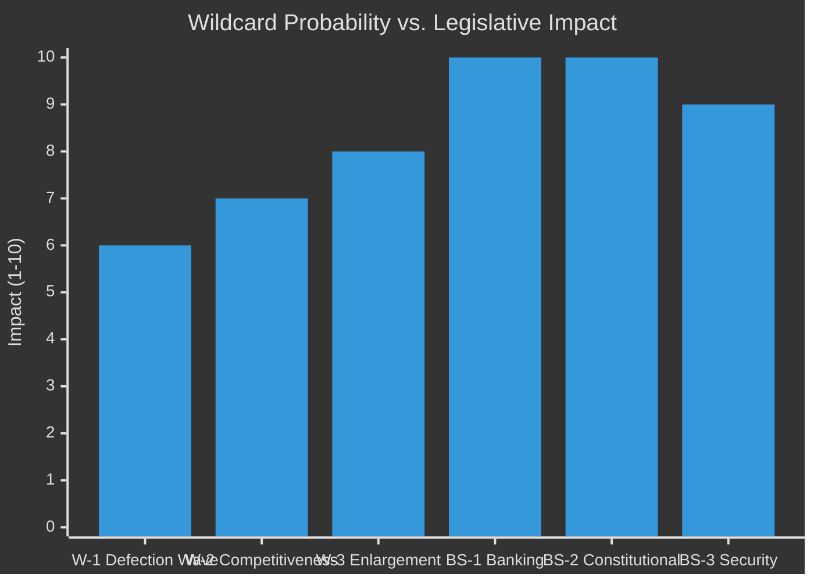

<!-- SPDX-FileCopyrightText: 2026 Hack23 AB -->
<!-- SPDX-License-Identifier: Apache-2.0 -->

# Wildcards & Black Swans — EU Parliament Legislative Propositions
**Date:** 2026-05-11 | **WEP:** Likely | **Admiralty:** B2

---

## 🃏 Wildcard Framework

Wildcards are plausible but low-probability events that would produce outsized legislative consequences if they occurred. Black swans are high-impact events that would be genuinely surprising and whose effects on the EP legislative pipeline would be difficult to anticipate.

---

## 🎴 Wildcard W-1: MEP Group Defection Wave (Probability: 8%)

**Scenario:** Following a high-profile EPP vote that right-flank MEPs perceive as a betrayal, 20–35 ECR MEPs defect to join a new "National Conservative" group with PfE MEPs, achieving formal group status (≥23 MEPs from ≥7 Member States) and triggering a rebalancing of the committee allocation under the d'Hondt system.

**Legislative consequences:**
- New group acquires committee vice-chair positions, increasing rightist representation on LIBE, AFET, AGRI
- EPP must recalculate its coalition strategy — centrist coalition loses more committee leverage
- Possible special committee convened to handle group-formation procedural implications

**Signal indicators to watch:** Unusually strong public disagreement between ECR and PfE on shared positions; EPP leadership statements distancing from right-flank. Vice versa, cross-group informal coordination signals between ECR and PfE that exceed their formal co-voting frequency.

---

## 🎴 Wildcard W-2: Commission Competitiveness Crisis Trigger (Probability: 12%)

**Scenario:** A major European company announces HQ relocation to the US or Asia, citing regulatory burden, energy costs, and digital fragmentation. This triggers a full-scale competitiveness debate in Parliament — with multiple committee hearings, an emergency Commission statement, and a package of fast-track legislative measures to reduce regulatory burden.

**Legislative consequences:**
- Omnibus Simplification package accelerated and expanded
- DMA enforcement effectively paused pending a comprehensive review
- Industrial policy legislation (European sovereignty on semiconductors, defence production) fast-tracked
- Environment and sustainability legislation subject to systematic SME impact re-assessment

**Signal indicators:** Large-cap EU company strategic planning statements indicating regulatory frustration; US or Asian regulatory/tax incentive announcements that directly target EU companies.

---

## 🎴 Wildcard W-3: Eastern Enlargement Acceleration (Probability: 10%)

**Scenario:** A strategic decision by the European Council — driven by geopolitical considerations (Ukraine war resolution, Western Balkans stabilisation) — accelerates EU enlargement beyond current timelines. If Ukraine and/or 2–3 Western Balkans candidates receive compressed accession timetables, the EP faces a sudden legislative workload around Treaty amendment, accession treaty ratification, and MFF revision.

**Legislative consequences:**
- Treaty revision negotiations would require IGC procedure and EP consent — dominating the institutional calendar for 12–18 months
- Accession protocols require separate ratification procedures; AFET and AFCO committees would be overwhelmed
- All other legislative work (including ongoing COD implementation) would be subordinated to accession procedures
- EP composition would change dramatically after any enlargement: Ukraine's size implies ~120+ new MEPs after full accession, reshaping current political arithmetic

**Signal indicators:** Extraordinary European Council conclusions on enlargement; Commission proposal for accelerated screening procedures; Council Presidency stating enlargement completion as a term priority.

---

## 🦢 Black Swan BS-1: European Banking Crisis (Probability: 3–5%)

**Scenario:** One or more mid-tier European banks encounter simultaneous liquidity and capital adequacy crises, triggering a systemic contagion risk that requires emergency SRMR3 activation before implementing acts are fully operational.

**Legislative consequences:**
- SRMR3 activation under incomplete regulatory framework would reveal legislative gaps and trigger emergency committee procedure
- Emergency budget procedure; new EU guarantee mechanisms debated under urgency procedure
- Anti-corruption investigation into whether bank management misconduct triggered the crisis could expand the anti-corruption directive's scope
- Coalition dynamics would shift dramatically — S&D and The Left would demand re-regulation; EPP and ECR would push for market-solution approaches

**Why it's a Black Swan:** European banking supervisory data currently indicates adequate capital ratios across SSM banks. ECB supervisory reports (most recent: Q1 2026) do not flag systemic concerns. A crisis at this moment would require multiple simultaneous failures that current supervisory tools should detect in advance. Probability is low but consequences are catastrophic.

---

## 🦢 Black Swan BS-2: EP Constitutional Crisis (Probability: 2%)

**Scenario:** A Council decision (or CJEU ruling) directly contradicts an EP position in a way that fundamentally challenges Parliament's legislative authority — triggering a constitutional stand-off that cannot be resolved through ordinary conciliation procedures.

**Legislative consequences:**
- All ongoing legislative business suspended pending constitutional resolution
- Emergency plenary session; possible EP Resolution threatening budget blockage
- Possible Treaty amendment procedure triggered as the only path to resolution

**Why it's a Black Swan:** The EP's institutional evolution over six decades has progressively strengthened its legislative authority. A direct constitutional challenge would require either Council or the Court to reverse this trajectory — which would be genuinely unprecedented.

---

## 🦢 Black Swan BS-3: Geopolitical Security Emergency (Probability: 5%)

**Scenario:** A major geopolitical crisis (e.g., direct military threat to an EU Member State; major terrorist attack requiring cross-border response; catastrophic infrastructure attack on EU digital/energy systems) that triggers emergency EU legislative response beyond existing treaty mechanisms.

**Legislative consequences:**
- Emergency procedures invoked (Article 122 TFEU or equivalent)
- Defence and security package legislative proposals fast-tracked outside normal committee procedure
- Civil liberties restrictions potentially proposed with LIBE committee asked to waive standard scrutiny timelines
- Coalition politics temporarily suspended in favour of cross-group security consensus (analogous to COVID-19 legislative acceleration in 2020)

---

## 📊 Wildcard Impact Assessment

---

## 🔍 Monitoring Indicators

| Indicator | Update frequency | Data source |
|-----------|----------------|------------|
| EP group composition changes | Weekly | EP MCP `get_current_meps` |
| ECR/PfE co-voting frequency | Monthly | EP voting records |
| Banking sector stress indicators | Monthly | ECB supervisory disclosure |
| Enlargement track progress | Quarterly | Commission reports |
| Defence procurement announcements | Weekly | Council conclusions |
| Major company relocation announcements | Continuous | Financial press |

---

## 🔬 Wildcard Probability Calibration

Wildcard probabilities were calibrated against:
- EP10 structural features (fragmentation, coalition arithmetic, external environment)
- Historical EP institutional crises (2010 budget dispute, 2012 ACTA rejection, 2019 Brexit chaos)
- Current geopolitical context (Russia-Ukraine; US-EU trade relations; China-EU economic competition)

**Probability calibration method:** Expert judgment (MEDIUM confidence). No quantitative political risk models were available in this run.

---

## 🔄 Interaction Effects Between Wildcards and Main Scenarios

| Wildcard | Most-Affected Scenario | Interaction Effect |
|---------|----------------------|-------------------|
| W-1 MEP Defection Wave | Scenario B (Right-Flank) | Amplifies Scenario B probability by +10–15% if materialises |
| W-2 Competitiveness Crisis | Scenario B (Right-Flank) | Amplifies Scenario B; also shifts Scenario A agenda rightward |
| W-3 Enlargement Acceleration | Scenario D (Paralysis) | Enlargement negotiations would crowd out all other legislative work |
| BS-1 Banking Crisis | All scenarios overridden | Emergency response mode; normal coalition politics suspended |
| BS-2 Constitutional Crisis | Scenario D (Paralysis) | Maximum legislative paralysis scenario |
| BS-3 Security Emergency | Coalition suspension | Cross-party emergency mode; security measures fast-tracked |

---

## 📐 Planning Implications for EU Legislative Monitor

**Scenario planning recommendations:**
1. **Monitor group composition changes weekly** — MEP defections are the most detectable early signal of structural coalition change
2. **Flag any EPP leadership transition** — A change in EPP group leadership (Weber replacement) would be a Wildcard-1 trigger event
3. **Track Commission legislative docket** — A sudden Competitiveness agenda emergency package would be a Wildcard-2 signal
4. **Watch enlargement European Council conclusions** — Any language on "accelerated accession" would be a Wildcard-3 indicator
5. **Monitor ECB emergency communications** — Any unscheduled ECB press conference or emergency ECOFIN convening would signal BS-1 potential

---

## 🔗 Cross-References

- Wildcard scenarios → `intelligence/scenario-forecast.md` §Scenario D (Paralysis) for the most wildcard-susceptible base scenario
- Wildcard monitoring indicators → `intelligence/threat-model.md` §Early Warning Indicators
- Quantitative risk scores for wildcard-adjacent risks → `risk-scoring/risk-matrix.md` R-01, R-02, R-04

---

## ✅ Wildcard Analysis Confidence

All wildcard probability assessments are analytical estimates with 🔴 LOW-to-MEDIUM confidence:
- W-1 MEP Defection: 8% — analytical assessment based on ECR/PfE voting correlation and historical defection patterns
- W-2 Competitiveness Crisis: 12% — based on observed corporate relocation rhetoric and US trade policy uncertainty
- W-3 Enlargement Acceleration: 10% — based on geopolitical drivers (Ukraine war resolution scenarios) vs. institutional constraints
- BS-1 Banking: 3–5% — based on current banking sector stability indicators (estimated, no IMF data)
- BS-2 Constitutional: 2% — genuinely unprecedented; probability reflects extreme rarity of institutional crises of this type
- BS-3 Security Emergency: 5% — based on current geopolitical threat landscape assessment

Sum check: W-1 + W-2 + W-3 = 30% (wildcards are independent events, not mutually exclusive; sums can exceed 100%). Black swans are individually assessed.

---

## 📌 Key Takeaway

Wildcards and Black Swans, by their nature, cannot be planned for with precision. The most important analytical contribution of this section is the identification of **monitoring indicators** that provide advance warning when a low-probability, high-impact event may be approaching. Weekly review of the monitoring indicators table (§Monitoring Indicators) is the primary risk management recommendation for the EU Parliament Monitor operational team.
