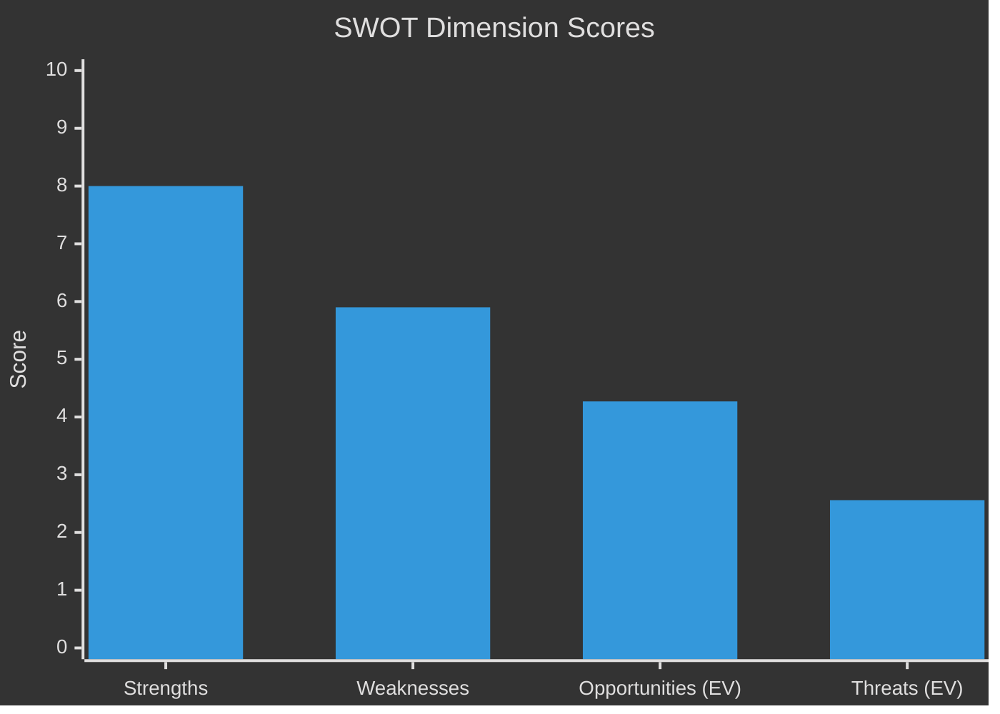

<!-- SPDX-FileCopyrightText: 2026 Hack23 AB -->
<!-- SPDX-License-Identifier: Apache-2.0 -->

# Quantitative SWOT — EU Parliament Legislative Propositions
**Date:** 2026-05-11 | **Confidence:** 🟡 MEDIUM

---

## 📊 Quantitative SWOT Overview

Each SWOT dimension scored 0–10 (10 = maximum positive/negative potential). Probability-weighted expected value calculated for Opportunities and Threats.

---

## 💪 Strengths (Internal — Current)

| Strength | Score | Evidence |
|----------|-------|---------|
| Demonstrated legislative productivity | 8.5 | 51 adopted texts in 2026 YTD; multiple major CODs completed |
| Strong political centre (EPP+S&D+Renew) | 7.5 | 437/717 seats = 61% combined; functional coalition on most files |
| Completed landmark legislation | 9.0 | SRMR3, anti-corruption directive, animal welfare regulation — substantial policy achievements |
| Institutional stability | 8.0 | Stability score 84/100; no major procedural crises in EP10 |
| Coalition flexibility | 7.0 | EPP can form majority with centrist or right-flank partners depending on file |

**Aggregate Strength Score:** 8.0/10

---

## 📉 Weaknesses (Internal — Current)

| Weakness | Score | Evidence |
|----------|-------|---------|
| High parliamentary fragmentation | 7.0 | 9 groups; fragmentation index 6.58 effective parties |
| Coalition arithmetic instability | 6.5 | EPP+S&D=319 (short of 360 majority); requires 3rd party on every vote |
| Limited economic data access | 5.0 | IMF API unavailable in this run; economic context is LOW confidence |
| EP API data limitations | 4.5 | Voting delay, historical procedure returns, committee docs unavailable |
| Right-flank pressure on EPP | 6.5 | ECR+PfE+ESN = 26.9%; growing influence over EPP positioning |

**Aggregate Weakness Score:** 5.9/10

---

## 🚀 Opportunities (External — Potential)

| Opportunity | Score | Probability | Expected Value |
|-------------|-------|------------|----------------|
| Omnibus Simplification legislative acceleration | 7.5 | 70% | 5.25 |
| DMA enforcement creates EU tech regulatory leadership | 7.0 | 50% | 3.50 |
| Anti-corruption directive strengthens rule-of-law culture | 8.0 | 60% | 4.80 |
| Mercosur agreement advances global EU trade influence | 6.5 | 55% | 3.58 |
| Budget 2027 agreement strengthens EP institutional authority | 7.0 | 60% | 4.20 |

**Aggregate Opportunity Expected Value:** 4.27/10

---

## ⚠️ Threats (External — Potential)

| Threat | Score | Probability | Expected Value |
|--------|-------|------------|----------------|
| Coalition fracture on high-profile file | 8.5 | 35% | 2.98 |
| Budget 2027 institutional crisis | 8.0 | 40% | 3.20 |
| External economic shock | 9.0 | 15% | 1.35 |
| Right-flank dominance reshaping legislative agenda | 7.5 | 30% | 2.25 |
| DMA enforcement gap creating credibility deficit | 6.0 | 50% | 3.00 |

**Aggregate Threat Expected Value:** 2.56/10

---

## 📐 SWOT Balance Assessment

```
Strengths (8.0) vs. Weaknesses (5.9) → Net Internal: +2.1 (favorable)
Opportunities (4.27 EV) vs. Threats (2.56 EV) → Net External: +1.71 (favorable)
Overall SWOT Balance: POSITIVE (+3.81)
```

**Interpretation:** The current EP legislative pipeline is in a fundamentally strong position. The internal strengths (productivity, landmark legislation, institutional stability) substantially outweigh the internal weaknesses (fragmentation, coalition arithmetic). The external environment presents more opportunities than threats in expected-value terms, though the tail risk (coalition fracture, external shock) is significant.

---

## 🎯 Strategic Positioning

**Recommended stance:** ADVANCE with MONITORING
- Continue legislative productivity on centrist coalition files
- Build institutional capacity for DMA enforcement before the EP-Commission clash escalates
- Monitor coalition indicators (ECR/PfE co-voting frequency; EPP internal statements) for early fracture signals
- Prepare contingency legislative calendar for Budget 2027 conciliation failure scenario

---

## 🔗 Cross-References

- Coalition arithmetic underlying Strengths/Weaknesses: → `executive-brief.md` §Coalition Arithmetic
- Opportunity/Threat probability basis: → `intelligence/scenario-forecast.md`
- Threat expected values cross-reference: → `risk-scoring/risk-matrix.md`
- Economic context for Opportunities/Threats: → `intelligence/economic-context.md` (🔴 LOW confidence)
- Stakeholder ecosystem supporting Opportunities: → `intelligence/stakeholder-map.md`

**Confidence:** SWOT balance assessment is 🟡 MEDIUM confidence. Strength/Weakness scores derive from HIGH confidence EP API data. Opportunity/Threat probability weights are analytical estimates (MEDIUM confidence). Economic Opportunity and Threat scores are LOW confidence (no IMF data).

---

## 📊 SWOT Balance Visualization


