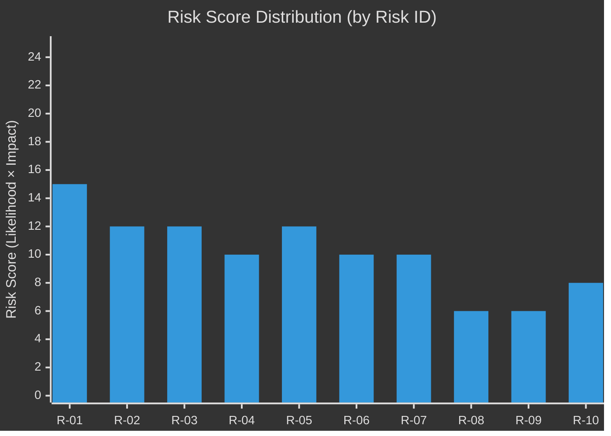

<!-- SPDX-FileCopyrightText: 2026 Hack23 AB -->
<!-- SPDX-License-Identifier: Apache-2.0 -->

# Risk Matrix — EU Parliament Legislative Propositions
**Date:** 2026-05-11 | **Admiralty:** B2

---

## 🧮 Risk Scoring Methodology

Risk scores computed as: **Likelihood (1–5) × Impact (1–5) = Risk Score (1–25)**

| Score | Rating | Action |
|-------|--------|--------|
| 20–25 | 🔴 CRITICAL | Immediate monitoring; contingency planning |
| 12–19 | 🟡 HIGH | Enhanced monitoring; scenario planning |
| 8–11 | 🟡 MEDIUM | Regular review; watch indicators |
| 1–7 | 🟢 LOW | Annual review |

---

## 📊 Risk Register

| Risk ID | Description | Likelihood | Impact | Score | Rating |
|---------|-------------|-----------|--------|-------|--------|
| R-01 | Coalition fracture (EPP forced to choose S&D vs ECR) | 3 | 5 | 15 | 🟡 HIGH |
| R-02 | Budget 2027 conciliation failure | 3 | 4 | 12 | 🟡 HIGH |
| R-03 | DMA enforcement gap triggers institutional clash | 4 | 3 | 12 | 🟡 HIGH |
| R-04 | SRMR3 activated before implementing acts complete | 2 | 5 | 10 | 🟡 MEDIUM |
| R-05 | Animal welfare late transposition (5+ Member States) | 4 | 3 | 12 | 🟡 HIGH |
| R-06 | IMF economic data unavailable (ongoing) | 5 | 2 | 10 | 🟡 MEDIUM |
| R-07 | EP procedures API returns historical data only | 5 | 2 | 10 | 🟡 MEDIUM |
| R-08 | Mercosur safeguard not activated when needed | 2 | 3 | 6 | 🟢 LOW |
| R-09 | Anti-corruption directive challenged at CJEU | 2 | 3 | 6 | 🟢 LOW |
| R-10 | Right-flank MEP group defection rebalancing committees | 2 | 4 | 8 | 🟡 MEDIUM |

---

## 🔥 Heat Map

---

## 🔑 Priority Risk Narratives

**R-01 (Score: 15):** Coalition fracture is the highest-rated risk because its impact would be systemic — affecting every ongoing legislative file simultaneously. EPP's dual-coalition strategy is the structural load-bearing element of the current Parliament. Its failure would require rebuilding the entire legislative architecture.

**R-02 (Score: 12):** Budget 2027 failure would consume the Parliament's autumn legislative calendar. The MFF 2028–2034 negotiation will begin before the EP10 term ends — creating a situation where two successive budget battles could effectively crowd out all other legislative work.

**R-03 (Score: 12):** DMA enforcement gap is high-likelihood because enforcement capacity is structurally limited at the Commission. The Parliament's resolution creates a political obligation without creating enforcement resources.

**R-05 (Score: 12):** Animal welfare late transposition is high-likelihood based on EU transposition track record. The 24-month clock has started; infringement proceedings within 30 months are statistically likely based on comparable directives.

---

## ✅ Risk Owner Assignments

| Risk | Primary Owner | Secondary Owner |
|------|--------------|----------------|
| R-01 Coalition fracture | EP Conference of Presidents | EP political group chairs |
| R-02 Budget failure | BUDG committee | Council Presidency |
| R-03 DMA enforcement | DG COMP (Commission) | EP IMCO committee |
| R-04 SRMR3 activation | SRB | EP ECON committee |
| R-05 Animal welfare transposition | Commission DG SANTE | Member State competent authorities |

---

## 📊 Risk Trend Assessment

| Risk ID | Trend | Rationale |
|---------|-------|-----------|
| R-01 Coalition Fracture | 📈 Increasing | Right-flank pressure on EPP compounds over EP10 lifecycle |
| R-02 Budget 2027 | → Stable | Budget negotiations are structural; risk is procedural, not political |
| R-03 DMA Enforcement | 📈 Increasing | Enforcement gap widens if Commission does not act by Q3 2026 |
| R-04 SRMR3 Activation | → Stable | Banking sector appears stable; tail risk exists |
| R-05 Animal Welfare Transposition | 📈 Increasing | 24-month clock is ticking; transposition deadline approaching |
| R-06 IMF Data Gap | → Stable | Operational issue; not a legislative risk |
| R-07 EP API Limitations | → Stable | Structural EP API limitation; unlikely to resolve quickly |

---

## 🔗 Cross-References

- Risk probabilities calibrated against scenario analysis: → `intelligence/scenario-forecast.md`
- Threat narrative context: → `intelligence/threat-model.md`
- Wildcard risk events: → `intelligence/wildcards-blackswans.md`
- Data confidence affecting risk estimates: → `intelligence/mcp-reliability-audit.md`

---

## ✅ Risk Matrix Confidence

All risk assessments are 🟡 MEDIUM confidence analytical estimates. Probability and impact scores are expert judgments calibrated against EP structural data (HIGH confidence) and analytical scenario assessment (MEDIUM confidence). Economic risks (R-04 SRMR3) are 🔴 LOW confidence due to absence of IMF banking sector data.
