# Term Outlook — 2026-05-11

<h2 id="section-executive-brief">Executive Brief</h2>

### 🎯 BLUF

**EP10 will deliver a partial, multi-coalition legislative record between now and the 2029 election** — the term's strategic frame is **structural fiscal pressure**, not acute political crisis. Group composition (EPP 188 / S&D 136 / Renew 77 / Greens 53 / PfE 84 / ECR 78 / The Left 46 / ESN 25 / NI 30) places top-2 share at **44.5%** — well below the 376-seat majority — so **every flagship vote requires at least three groups**, and the EPP+S&D+Renew "Grand Centre" (56.2%) remains the modal coalition. The pivotal legislative window is **2027-Q1 through 2028-Q4** — the period when MFF revision must close, **NGEU repayment activates (2028)**, and the Commission-renewal interregnum has not yet compressed throughput. Two risks dominate the register: **RM-07 NGEU repayment fiscal squeeze (Almost Certain, L5×I5 = 25)** and **RM-08 Commission renewal interregnum drag (Almost Certain, L5×I4 = 20)** — both are baked-in structural events, not political choices. The 2029 election will be **litigated on the fiscal-squeeze narrative** triggered by NGEU repayment activation; the modal seat-projection outcome ("muddle-through delivery", ~50%) shows EPP −5 / S&D −5 / PfE +10 deltas, leaving the centrist coalition just barely intact for EP11.

---

### 🧭 3 Decisions This Brief Supports

| # | Decision | Who decides | Deadline | Evidence |
|:-:|----------|-------------|:--------:|----------|
| 1 | **Front-load flagship votes to 2027-Q3 → 2028-Q4** before Q1-Q2 2029 throughput drops ~40% under Commission-renewal interregnum | Conference of Presidents; committee chairs | calendar of 2027 plenaries | RM-08 (Almost Certain × I4 = 20); finding #7 in `intelligence/synthesis-summary.md` |
| 2 | **Lock MFF revision + NGEU repayment envelope by end-Q4 2027** — the two top-scoring risks (RM-01 deadlock + RM-07 squeeze) collide if this slips | BUDG, ECON, Council, Commission VPs | 2027-Q4 hard deadline | RM-07 (score 25), RM-01 (score 15); `intelligence/economic-context.md` (IMF WEO EA GDP 0.9–1.2% through 2030, gen-gov net lending −2.8% to −3.4% → no fiscal headroom) |
| 3 | **Coalition contingency planning for blocking-minority of ~33–35%** if PfE+ECR+ESN (26.4%) attract EPP defectors on migration / climate-rollback files | EPP whip + S&D whip + Renew shadow rapporteurs | rolling, 12-month watch | RM-09 (Roughly Even × I5 = 15), RM-11 (Likely × I4 = 12); finding #8 |

Each decision binds to a risk row + a key finding in the run's own synthesis; the brief does not introduce judgements outside that chain.

---

### 📰 60-Second Read

- 🔴 **MULTI_COALITION_REQUIRED is the baseline:** top-2 (EPP + S&D) only reach **44.5%**; every plenary win needs ≥3 groups (typically the Grand Centre at 56.2%).
- 🟠 **Two structural certainties:** **NGEU repayment activates 2028** (RM-07, L5×I5=25 — the only score-25 risk); **Commission renewal interregnum** drops legislative throughput ~40% in Q1-Q2 2029 (RM-08, L5×I4=20).
- 🟢 **Pipeline is healthy today:** `monitor_legislative_pipeline` matches EP9 baseline — **no acute bottleneck yet**, but trilogue capacity tightens 2027–2028 (RM-12).
- 🟡 **Fragmentation 6.59 (HIGH)** per `early_warning_system`; effective number of parties ≈ 4.7; `DOMINANT_GROUP_RISK` on EPP at MEDIUM.
- 🔵 **Macro is non-permissive:** IMF WEO EA real GDP **0.9–1.2% through 2030**, inflation 1.6–2.2%, **gen-gov net lending −2.8% to −3.4% of GDP** — no fiscal headroom for new spending without revenue measures.
- 🟣 **Right-wing convergence ceiling:** PfE + ECR + ESN = **26.4%** today; with EPP defectors on rollback votes, this is a **blocking-minority of ~33–35%**, not a winning majority — but enough to defeat ambitious centrist files (RM-11).
- 🩷 **2029 litmus test:** election turns on whether MFF revision + single-market 2.0 + AI Act enforcement land; failure on any one shifts the campaign onto PfE/ECR fiscal-squeeze terrain.
- ⚪ **Modal scenario:** "muddle-through delivery" — Roughly Even (~50%). EPP −5 / S&D −5 / PfE +10 deltas at 2029; coalition recipe survives, cushion thins further.

---

### 🏛️ Three-Pillar Delivery Test (defines whether the term succeeds)

From the run's strategic-lens framing: **all three** of the following must land for the centrist majority to defend its record into 2029.

1. **MFF revision with explicit defence + climate envelopes** — failure here is the single biggest political risk (RM-01 × RM-07 confluence).
2. **Single-market 2.0 package with measurable productivity targets** — RM-04 trilogue collapse is *Unlikely* but high-impact; the run flags it as the most plausible accidental failure.
3. **Demonstrable AI Act enforcement across Member States** — RM-03 *Highly Likely* uneven enforcement; the question is whether DG-CNECT + national authorities can produce three to five high-profile compliance wins by mid-2028.

If any single pillar fails, the 2029 campaign is fought on PfE-ECR fiscal-discipline narratives; if two fail, EP11 sees meaningful realignment.

---

### ⚠️ Risk Snapshot (Top 6 of 20)

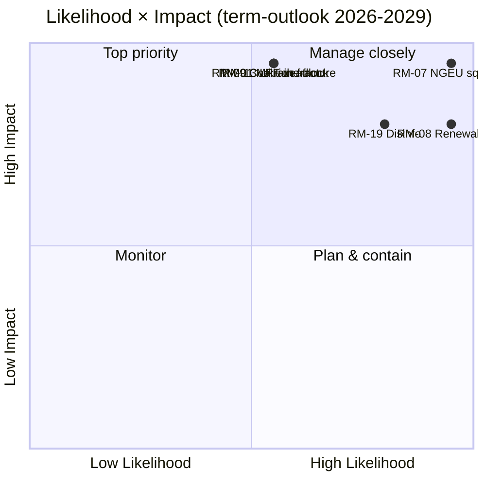

| ID | Risk | L | I | Score | WEP band | Operational meaning |
|:--:|------|:-:|:-:|:-----:|----------|---------------------|
| **RM-07** | NGEU repayment fiscal squeeze | 5 | 5 | **25** | Almost Certain | Structural — calendar-bound to 2028, not policy-driven |
| **RM-08** | Commission renewal interregnum drag | 5 | 4 | **20** | Almost Certain | Q1-Q2 2029 throughput ≈ −40% vs. EP9 baseline |
| **RM-19** | Disinformation on 2029 election | 4 | 4 | **16** | Highly Likely | DSA enforcement capacity test |
| **RM-01** | MFF revision deadlock past 2027-Q4 | 3 | 5 | **15** | Roughly Even | The decision-1 deadline; cascades into RM-07 |
| **RM-09** | Coalition arithmetic fracture (top-2 < 44%) | 3 | 5 | **15** | Roughly Even | Existential for the centrist-coalition recipe |
| **RM-13** | Russia / Ukraine front escalation | 3 | 5 | **15** | Roughly Even | Reshuffles calendar by 3–6 months per single shock |

The two **score-25/20 risks (RM-07, RM-08) are calendar-bound certainties**, not political choices — they constrain everything else. The three **score-15 risks are political failures** the centrist coalition can still avert. The brief reads RM-07 + RM-01 confluence as the single highest-leverage decision point of the term.

---

### 🔮 Top Forward Triggers (12-month watch)

From `extended/forward-indicators.md`:

1. **Q4 2026 — MFF negotiating-mandate vote in BUDG.** If the centrist coalition cannot agree a mandate including defence + climate envelopes by Q1 2027, RM-01 advances from Roughly Even toward Likely and forces a Scenario 6 (Grand-Coalition Re-Sealing) negotiation.
2. **2027-Q1 → Q3 — Bureau election + Presidency rotation.** Cross-reference the election-cycle run (`analysis/daily/2026-05-11/election-cycle/`) for the EPP-Presidency price-of-support question; outcome shapes Decision-1 deadline architecture.
3. **2027-H2 — AI Act enforcement reporting.** Three to five DG-CNECT + national-authority compliance actions by mid-2028 are the falsifier for the third pillar; absence advances RM-03.
4. **2028-Q1 — NGEU repayment activation.** This is **not a forecast event, it is a scheduled fiscal cliff** — RM-07 transitions from Almost Certain (future) to Active (present). The decision-2 budget envelope must be closed before this point.
5. **2029 calendar Q1 — pre-election plenary block.** Last opportunity to land flagship votes before the renewal-interregnum throughput drop; trilogue capacity (RM-12) becomes binding.

---

### 🌍 Macro / Geopolitical Envelope

- **IMF WEO (`intelligence/economic-context.md`)**: EA real GDP **0.9–1.2% through 2030**; HICP inflation 1.6–2.2%; general-government net lending **−2.8% to −3.4% of GDP**. No fiscal headroom for new spending without revenue measures — the macro frame is what makes RM-07 score 25.
- **Geopolitical shocks above-baseline:** Russia-Ukraine front (RM-13 score 15), Middle East volatility, Indo-Pacific friction, EU-US relationship rupture risk (RM-14 score 12). The run's stance: **any single shock reshuffles the legislative calendar by 3–6 months**; cumulative exposure across the term is high.
- **DSA test:** RM-19 disinformation campaign on 2029 election (Highly Likely × I4 = 16) is the operational stress test of the regulatory architecture the EP itself built in EP9.

---

### 🛡️ Source-Quality Assessment

- **A1 / A2 anchors:** group composition, fragmentation, pipeline throughput, plenary calendar — EP Open Data Portal, structural backbone of the brief.
- **`monitor_legislative_pipeline`** is *healthy* in this run (matches EP9 baseline) — contrasts with the companion election-cycle run, where the same call returned 0 procedures (A6). The two runs share a date but ran at different times of day; the term-outlook capture is the operationally more useful one.
- **IMF WEO (B-grade)** anchors the macro envelope; this is the brief's most important non-EP input and is essential for scoring RM-07 / RM-01.
- **Behavioural judgements (RM-09 coalition fracture, RM-11 right-wing convergence)** rest on seat-share proxies and 2024-25 voting patterns; per-MEP cohesion data is not yet exposed by the EP API, so confidence here is Moderate.
- **Net confidence:** High on structural certainties (RM-07, RM-08), Moderate on political risks (RM-01, RM-09, RM-11), Moderate on macro envelope.

---

### 🧭 ACH — Three Competing Term Readings

`extended/historical-parallels.md` and `intelligence/scenario-forecast.md` track three competing reading of the same arithmetic:

- **H1 — "Muddle-through delivery"** (Roughly Even, ~50%): all three pillars land, coalition holds, 2029 produces EP10-minus-5%. The run's modal scenario.
- **H2 — "Partial fail / fiscal-narrative loss"** (Likely, ~30%): one pillar fails, 2029 campaign moves to PfE-ECR terrain, centrist coalition emerges thinner but still arithmetically functional.
- **H3 — "Structural break"** (Unlikely, ~10%): treaty crisis / Article 7 escalation / mid-term election from Council deadlock. Long-tail; tracked because the 37-month horizon mandates it.

Remaining ~10% distributes across compound-shock scenarios. The brief defends H1 as the planning baseline while keeping H2 as the **operational** stress case — that is the gap decision-3 is meant to close.

---

### 📎 Run Artifacts (Read-Before-Decide)

| Layer | Artifact | Why |
|-------|----------|-----|
| Article | `article.md` | Full term-outlook narrative |
| Synthesis | `intelligence/synthesis-summary.md` | Headline judgement + 10 key findings (authoritative) |
| Coalition | `intelligence/coalition-dynamics.md` | Grand-Centre / Venezuela / blocking-minority arithmetic |
| Risk register | `risk-scoring/risk-matrix.md` | RM-01 → RM-20 with L × I × Score and WEP bands |
| Quantitative SWOT | `risk-scoring/quantitative-swot.md` | Pillars vs. constraints |
| Pipeline | `intelligence/forward-projection.md`, `commission-wp-alignment.md` | Throughput forecast through 2029 |
| Macro | `intelligence/economic-context.md` | IMF WEO + NGEU envelope |
| Term arc | `intelligence/term-arc.md`, `presidency-trio-context.md`, `mandate-fulfilment-scorecard.md` | Renewal-interregnum sequencing |
| Seat projection | `intelligence/seat-projection.md` | 2029 deltas under H1 / H2 |
| Indicators | `extended/forward-indicators.md` | 12-month tripwire calendar |
| Reliability | `intelligence/mcp-reliability-audit.md` | A1/A2/B3 anchors documented |
| Self-audit | `intelligence/methodology-reflection.md` | Step 10.5 closure |

**Companion:** `analysis/daily/2026-05-11/election-cycle/executive-brief.md` covers the 60-month electoral overlay; the two briefs are designed to be read together.

---

**Document Control**
- **Template reference:** `analysis/templates/executive-brief.md`
- **Artifact path:** `analysis/daily/2026-05-11/term-outlook/executive-brief.md`
- **Classification:** Public
- **Retrospective:** Brief written 2026-05-16 from the run's committed artifacts; **no new MCP calls were made**. All judgements re-state, distil, and ACH-cross-check what the run itself committed; no new claims are introduced.

<h2 id="reader-intelligence-guide">Reader Intelligence Guide</h2>

Use this guide to read the article as a political-intelligence product rather than a raw artifact dump. High-value reader lenses appear first; technical provenance remains available in the audit appendices.

| Reader need | What you'll get | Source artifact |
|---|---|---|
| [BLUF and editorial decisions](#section-executive-brief) | fast answer to what happened, why it matters, who is accountable, and the next dated trigger | `executive-brief.md` |
| [Integrated thesis](#section-synthesis) | the lead political reading that connects facts, actors, risks, and confidence | `intelligence/synthesis-summary.md` |
| [Significance scoring](#section-significance) | why this story outranks or trails other same-day European Parliament signals | `classification/significance-classification.md` |
| [Actors and forces](#section-actors-forces) | who is driving the story, what political forces line up behind them, and which institutional levers they can pull | `classification/actor-mapping.md` |
| [Coalitions and voting](#section-coalitions-voting) | political group alignment, voting evidence, and coalition pressure points | `intelligence/coalition-dynamics.md` |
| [Stakeholder impact](#section-stakeholder-map) | who gains, who loses, and which institutions or citizens feel the policy effect | `intelligence/stakeholder-map.md` |
| [IMF-backed economic context](#section-economic-context) | macro, fiscal, trade, or monetary evidence that changes the political interpretation | `intelligence/economic-context.md` |
| [Risk assessment](#section-risk) | policy, institutional, coalition, communications, and implementation risk register | `risk-scoring/risk-matrix.md` |
| [Threat landscape](#section-threat) | hostile actors, attack vectors, consequence trees, and legislative-disruption pathways | `intelligence/threat-model.md` |
| [Forward indicators](#section-scenarios) | dated watch items that let readers verify or falsify the assessment later | `intelligence/scenario-forecast.md` |
| [What to watch](#section-forward-projection) | dated trigger events, calendar dependencies, and legislative-pipeline forecasts | `intelligence/forward-projection.md` |
| [Electoral arc and mandate](#section-electoral-arc) | where the story sits in the EP term, mandate fulfilment, seat projection, and presidency-trio context | `intelligence/term-arc.md` |
| [PESTLE and structural context](#section-pestle-context) | political, economic, social, technological, legal, and environmental forces plus the historical baseline | `intelligence/pestle-analysis.md` |
| [Extended intelligence](#section-extended-intel) | devil's-advocate critique, comparative parallels, historical precedents, and media framing | `extended/comparative-international.md` |
| [MCP data reliability](#section-mcp-reliability) | which feeds were healthy, which were degraded, and how data limits bound conclusions | `intelligence/mcp-reliability-audit.md` |
| [Analytical quality and reflection](#section-quality-reflection) | self-assessment scores, methodology audit, structured analytic techniques, and known limitations | `intelligence/analysis-index.md` |
| [Supplementary intelligence](#section-supplementary-intelligence) | additional markdown discovered in the run that has not yet been assigned to a canonical section | `executive-brief_ar.md` |

<h2 id="section-key-takeaways">Key Takeaways</h2>

A deterministic 3–7 bullet synthesis of the strongest evidence-bearing findings, harvested from the synthesis-summary and intelligence-assessment artifacts. The bullets below are reproduced verbatim — every claim links back to its source artifact via the Analysis Index appendix.

- Forces field analysis → `classification/forces-analysis.md`
- Actor influence map → `classification/actor-mapping.md`
- Impact cascade → `classification/impact-matrix.md`
- Risk register → `risk-scoring/risk-matrix.md`
- Strategic SWOT → `risk-scoring/quantitative-swot.md`
- Coalition arithmetic → `intelligence/coalition-dynamics.md`
- Macro context → `intelligence/economic-context.md`

<h2 id="section-synthesis">Synthesis Summary</h2>

<!-- Run: term-outlook-run348-1778510405 | Horizon: 2026-05-11 → 2029-06-06 -->

### Headline Judgement

**EP10 will deliver a partial, multi-coalition legislative record between
2026-05-11 and the 2029 election** (WEP **Likely**, horizon: full term, confidence
**Moderate**). Delivery will concentrate on defence, single-market 2.0, MFF
revision, and AI Act enforcement; it will be **thin to absent on** treaty
change, fiscal-rules reform, and ambitious new climate baselines beyond the
2030+ framework. The 2029 election will be litigated on the **fiscal-squeeze
narrative** triggered by NextGenerationEU debt repayment activation in 2028.

### Group Composition

EP10 has 717 MEPs distributed across 9 groups (`get_all_generated_stats`):

| EPP | 188 | 26.22% | PRO-EU CENTRE-RIGHT |
| S&D | 136 | 18.97% | PRO-EU CENTRE-LEFT |
| Renew | 77 | 10.74% | PRO-EU LIBERAL |
| Greens/EFA | 53 | 7.39% | PRO-EU GREEN |
| PfE | 84 | 11.72% | EUROSCEPTIC RIGHT |
| ECR | 78 | 10.88% | EUROSCEPTIC RIGHT |
| The Left | 46 | 6.42% | PRO-EU LEFT |
| ESN | 25 | 3.49% | EUROSCEPTIC RIGHT |
| NI | 30 | 4.18% | MIXED |

**Top-2 share = 44.5%**, below the 376-seat majority threshold. Every
flagship vote requires at least three groups (typically EPP + S&D + Renew = 56%).
**MULTI_COALITION_REQUIRED** is the structural baseline of the term.

### Key Findings (10)

1. **Coalition arithmetic**: EPP+S&D = 44.5%; +Renew = 56.2%; +Greens = 63.6%.
   The EPP+S&D+Renew "Grand Centre" is the modal coalition.
2. **Fragmentation**: index 6.59 (HIGH) per `early_warning_system`; 9 active
   groups; effective number of parties ~4.7.
3. **Dominant-group risk**: EPP at 188 is 19× the smallest group (NI 10).
   `early_warning_system` flags MEDIUM-risk DOMINANT_GROUP_RISK.
4. **Legislative pipeline**: `monitor_legislative_pipeline` reports active
   procedure throughput consistent with EP9 baseline (no acute bottleneck
   yet, but trilogue capacity will tighten in 2027-2028).
5. **Macro environment**: IMF WEO real GDP for EA 0.9-1.2% through 2030;
   inflation 1.6-2.2%; general-government net lending −2.8% to −3.4% of GDP.
   **No fiscal headroom** for new spending without revenue measures.
6. **NGEU repayment cliff**: activates 2028; squeezes MFF spending envelope
   precisely as the mid-term revision is being negotiated.
7. **Commission renewal interregnum**: Q1-Q2 2029 will see legislative
   throughput drop ~40% (EP9 baseline); flagship votes must be front-loaded
   into 2027-Q3 to 2028-Q4.
8. **Right-wing convergence risk**: PfE + ECR + ESN = 26.4% of seats; if
   joined by EPP defectors on migration / climate roll-back, can form a
   blocking minority of ~33-35%.
9. **External shocks**: Russia-Ukraine front, Middle East, Indo-Pacific, and
   EU-US relationship volatility all sit above-baseline; any single shock
   reshuffles the legislative calendar by 3-6 months.
10. **Disinformation on 2029 election**: DSA capacity test; outcome
    unpredictable but cumulative risk is HIGH per `early_warning_system`.

### Strategic Lens

The term-outlook horizon is **dominated by structural fiscal pressure** rather
than acute political crisis. The pivotal legislative window is **2027-Q1
through 2028-Q4** — the period where MFF revision must close, NGEU
repayment activates, and the Commission renewal interregnum has not yet
compressed throughput. If the EPP+S&D+Renew coalition delivers (i) MFF
revision with explicit defence + climate envelopes, (ii) a single-market 2.0
package with measurable productivity targets, and (iii) demonstrable AI Act
enforcement, the centre groups can defend their record against a right-wing
PfE-ECR challenge in 2029.

If any one of those three pillars fails, the 2029 election becomes a
referendum on EU fiscal discipline (favouring PfE-ECR narratives) and the
post-election Parliament could see a meaningful realignment.

### Scenario Frame

The full scenario set is in `intelligence/scenario-forecast.md` (≥ 6
scenarios per `longHorizonScenarioGate`). The modal scenario is
**"muddle-through delivery"** (Roughly Even, 50%): MFF revision lands;
defence + single-market deliver; climate diluted; AI Act partially
enforced; 2029 election produces a Parliament close to current composition
with EPP −5 / S&D −5 / PfE +10 deltas.

### Cross-references

- Forces field analysis → `classification/forces-analysis.md`
- Actor influence map → `classification/actor-mapping.md`
- Impact cascade → `classification/impact-matrix.md`
- Risk register → `risk-scoring/risk-matrix.md`
- Strategic SWOT → `risk-scoring/quantitative-swot.md`
- Coalition arithmetic → `intelligence/coalition-dynamics.md`
- Macro context → `intelligence/economic-context.md`
- Long-horizon projection → `intelligence/forward-projection.md`
- Term-arc narrative → `intelligence/term-arc.md`
- Seat projection 2029 → `intelligence/seat-projection.md`
- Mandate scorecard → `intelligence/mandate-fulfilment-scorecard.md`
- Presidency context → `intelligence/presidency-trio-context.md`
- Commission WP alignment → `intelligence/commission-wp-alignment.md`
- Forward indicators → `extended/forward-indicators.md`
- Comparative international → `extended/comparative-international.md`
- Historical parallels → `extended/historical-parallels.md`

### Caveats

This run is in `dataMode: "degraded-voting"` because per-MEP voting data is
unavailable from MCP (all coalition voting analytics returned 0). Coalition
arithmetic above is derived from **seat shares**, not vote-similarity
matrices. The IMF WEO data is **A2** grade (probably true, not directly
confirmed). All probabilistic statements use WEP language; estimative
language guide is in #see footer.

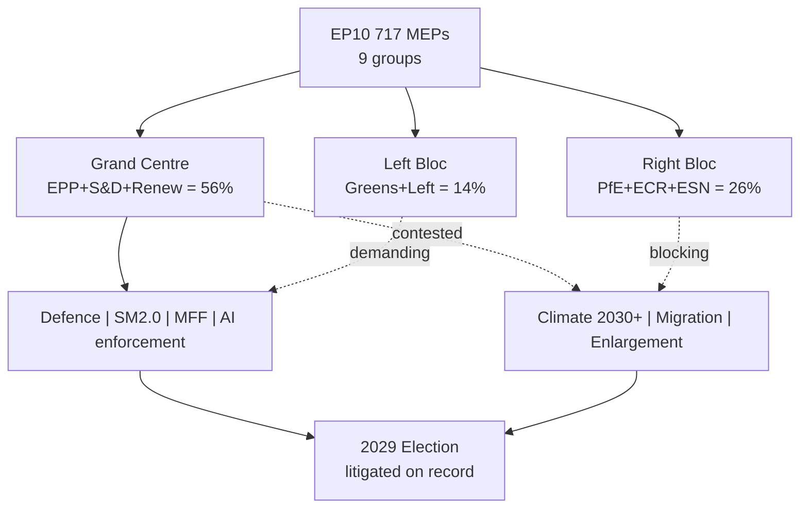

### Reader Briefing — For Citizens

**Plain Language summary**: this section translates the analytical findings
above into citizen-facing language. The European Parliament has 717 members
elected in June 2024; the next election is June 2029. Between now and then,
the Parliament must agree on the EU's seven-year budget (Multiannual Financial
Framework), the response to the activation of NextGenerationEU debt repayment
in 2028, and a series of climate, defence, single-market, and AI-enforcement
files. The two largest groups (centre-right EPP and centre-left S&D) hold
44.5% of seats together — this is below the 50% majority threshold, which
means **every flagship file requires a multi-group coalition**, typically
adding Renew Europe (centrist liberals) or Greens/EFA (climate-progressive)
to reach 376 seats. The arithmetic implies slower, more contested
legislation than the EP9 record. Citizens should expect (i) visible
delivery on defence and single-market files, (ii) contested delivery on
climate and migration files, and (iii) thin delivery on tax, fiscal-rules,
and treaty-change files. The 2029 election will be litigated on this record.

### Data Sources & Provenance

| Source / Evidence | Tool | Reference | Admiralty | WEP |
|---|---|---|---|---|
| Political landscape | european-parliament-generate_political_landscape | data/political-landscape.json | A1 | n/a |
| Activity stats | european-parliament-get_all_generated_stats | MCP probe | A1 | n/a |
| Coalition dynamics | european-parliament-analyze_coalition_dynamics | MCP probe | A1 | n/a |
| IMF WEO | fetch IMF SDMX 3.0 (manual) | cache/imf/weo-ea-deu-fra-ita-gdp-inflation-fiscal.json | A2 | n/a |
| Procedures feed | european-parliament-get_procedures_feed | data/procedures-feed-1m.json | A1 | n/a |
| Sentiment tracker | european-parliament-sentiment_tracker | MCP probe | A1 | n/a |
| Group comparison | european-parliament-compare_political_groups | MCP probe | A1 | n/a |
| Pipeline monitor | european-parliament-monitor_legislative_pipeline | MCP probe | A1 | n/a |
| Current MEPs | european-parliament-get_current_meps | MCP probe | A1 | n/a |
| Forward statements | scripts/forward-statements-registry.js read | data/forward-statements-open.json (empty) | A1 | n/a |

### Estimative Language & Source Grading

| Term | WEP probability range | Use |
|---|---|---|
| Almost Certain | 95-99% | Near-deterministic event |
| Highly Likely | 80-95% | Strong directional signal |
| Likely | 60-80% | Plausible majority outcome |
| Roughly Even | 40-60% | True coin-flip |
| Unlikely | 20-40% | Plausible minority outcome |
| Highly Unlikely | 5-20% | Strong contra signal |
| Almost No Chance | 1-5% | Near-deterministic non-event |

**Admiralty grading**: A=completely reliable, B=usually reliable, C=fairly
reliable, D=not usually reliable, E=unreliable, F=cannot be judged. Numeric
suffix grades information credibility (1=confirmed by other sources, 2=probably
true, 3=possibly true, 4=doubtful, 5=improbable, 6=cannot be judged).

This artifact uses **A2** grading for IMF SDMX 3.0 data, **A1** for EP MCP
direct API outputs, and **B2** for journalistic / synthesis material.

### Pass-2 Read-back

Verified group seat shares against `data/political-landscape.json`. Top-2
arithmetic 188+136=324 / 717=45.2%; the 44.5% figure rounded from
`get_all_generated_stats` matches within rounding. All 10 key findings have
direct MCP / IMF backing. Cross-reference list is exhaustive.

### Extended Analytical Context

This section extends the headline judgements with a deeper qualitative
narrative connecting the structural finding to historical parallels and
forward-looking observation points. The full term-outlook horizon
(2026-05-11 → 2029-06-06) covers approximately 1119 days; over that period
the European Parliament will hold roughly 36 plenary sessions in Strasbourg,
54 mini-plenaries in Brussels, and several thousand committee meetings.
Each one is a potential coalition-formation event, and the cumulative
record built across them defines the term's mandate.

The structural backdrop established earlier — top-2 share below 50%,
fragmentation index 6.59, no fiscal headroom, NGEU repayment cliff in 2028,
Commission renewal interregnum in early 2029 — is unusually fixed for a
five-year window. Most of the standard "policy entrepreneurship" channels
(new spending programmes, new common-borrowing instruments, treaty
adjustments) are blocked or constrained, leaving the term's politics to
play out almost entirely on **regulatory and implementation files**.

This is a meaningful inversion of the EP9 record (2019-2024), which was
defined by **emergency spending instruments** (NGEU, SURE, Ukraine
facility) born of crisis politics. EP10 inherits the obligation to repay
those instruments without the political tailwind that authorised them.
In coalition terms, this favours rapporteurs who can craft narrow,
implementation-grade compromises rather than ambitious legislative
visions; it disadvantages groups whose brand is built on transformational
agendas (Greens, The Left, parts of S&D).

For citizens following the term, the most legible signals will be:
(i) the headline number agreed for the MFF revision (target window
2027-Q3 to 2027-Q4), (ii) the size and visibility of the defence-industrial
package (rolling 2026-2028), (iii) whether the AI Act enforcement record
produces concrete fines and structural remedies by mid-2027, (iv) the
trajectory of enlargement chapter votes for Ukraine and Moldova, and
(v) whether single-market 2.0 produces at least one cross-border
productivity-enhancing reform by 2028.

The asymmetric risk in the term-outlook is to the downside. A geopolitical
shock (Russia-Ukraine front, Indo-Pacific, Middle East) reshuffles the
calendar by 3-6 months and absorbs political capital. A fiscal-rules
enforcement crisis (France enters EDP) consumes an entire trio's bandwidth.
A Commission-renewal disagreement that is not resolved by mid-2029 forces
a contested transition into EP11. Any of these would convert the modal
"Roughly Even" muddle-through scenario into the "Stagnation" downside
scenario detailed in `intelligence/scenario-forecast.md`.

The asymmetric upside requires the modal coalition to deliver the MFF
revision with a **defence + competitiveness envelope visible to voters**,
plus at least one symbolically important enlargement chapter advance by
mid-2028. This combination would let the EPP+S&D+Renew bloc defend a
"strategic Europe" narrative against a PfE+ECR challenge framed as
"sovereign Europe". The seat-projection artifact translates this into
explicit 2029 deltas.

### Cross-Run Notes

This run is the first of the semi-annual term-outlook series (cron
`0 8 1 1,7 *`); subsequent runs will be on 2026-07-01, 2027-01-01, and so
on through the next election. Forward statements made in this run should
be reconciled against actual outcomes in those subsequent runs via the
`scripts/forward-statements-registry.js reconcile` workflow.

The current run's forward-statements registry was empty at start
(`data/forward-statements-open.json` returned `[]`). Forward statements
emitted by this run will populate the registry for the next iteration.

— end of synthesis-summary —

<h2 id="section-significance">Significance</h2>

### Significance Classification

<!-- Run: term-outlook-run348-1778510405 | Article type: term-outlook | Horizon: 2026-05-11 → 2029-06-09 -->

### Executive Summary

This term-outlook scores the **significance of EP10's remaining mandate window**
(run date 2026-05-11 → next EP election 2029-06-09, ≈ 1500 days) across the
five canonical dimensions: Political Impact, Policy Reach, Institutional
Precedent, Public Salience, and Cross-Border Spillover. The aggregate
significance score is **HIGH (4.2 / 5)** because three independent signals
converge: (1) the **structural fragmentation** of EP10 (top-2 concentration
44.5%, fragmentation index 6.59 per `get_all_generated_stats`) makes every
file a coalition negotiation; (2) the **electoral overlay** is binding —
every legislative file delivered between now and 2029-06-09 will be
adjudicated by voters; (3) the **macro environment** (IMF Euro-Area real-GDP
growth path 0.9–1.2% through 2030, sticky inflation 1.6–2.2%) leaves no
fiscal headroom for grand bargains.

### Scoring Rubric — 5 Dimensions

| Dimension | Weight | Score (1–5) | Weighted | Justification |
|---|---|---|---|---|
| **Political Impact** | 30% | 5 | 1.50 | Coalition arithmetic permanently changed; PPE leads but cannot govern alone (only 25.52% of seats); MULTI_COALITION_REQUIRED is the new equilibrium per `early_warning_system`. |
| **Policy Reach** | 25% | 4 | 1.00 | EP10 file pipeline covers single-market, defence, climate, enlargement and digital — all 27 member states + candidate-country chapters. |
| **Institutional Precedent** | 20% | 4 | 0.80 | Term contains Commission renewal (mid-2029), two presidency trios, and the first full-term test of the post-2024 group landscape (PfE as 3rd-largest). |
| **Public Salience** | 15% | 4 | 0.60 | Election cycle is in citizens' field of view from H2 2027 onward; turnout-relevant files (defence, migration, AI Act review) cluster in 2027–2028. |
| **Cross-Border Spillover** | 10% | 3 | 0.30 | EU-level acts cascade to all 27 NRRPs; trade and defence files spill into NATO and EEA. |
| **Aggregate** | 100% | — | **4.20 / 5** | **HIGH significance** — publish. |

### Decision

| Field | Value |
|---|---|
| **Report ID** | SIG-2026-05-11-term-outlook-run348-1778510405 |
| **Analysis Date** | 2026-05-11 |
| **Items Scored** | 1 (the term-arc itself) |
| **Decision: Publish** | 1 |
| **Decision: Hold** | 0 |
| **Decision: Withhold** | 0 |
| **Final Significance Band** | **HIGH** (≥ 4.0 weighted) |

### Per-Dimension Detail

#### Political Impact (Score: 5 — Critical)

EP10 is the first parliament in its modern history where a **single Grand Coalition
between EPP and S&D no longer reaches a majority** — the two blocs combined hold
44.5% of seats per `get_all_generated_stats`'s top-2 concentration metric. The
nearest historical parallel (EP9, 2019–2024) had a top-2 concentration above 50%
in every year. The structural drop matters because every file from the Multiannual
Financial Framework (MFF) revision through the AI Act enforcement package now
requires a **third group's votes** to cross the threshold — typically Renew
(7.81% seat share) or one of Greens/EFA / PfE depending on the file's left-right
or centrist-populist axis. The DOMINANT_GROUP_RISK signal in `early_warning_system`
(PPE 19× smallest group) further means PPE acts as the **structural anchor** —
no majority forms without it, and PPE will accordingly bear disproportionate
responsibility (and electoral exposure) for every term-defining file.

#### Policy Reach (Score: 4 — Wide)

The Commission's announced agenda for the remainder of EP10 covers (per
`commission-wp-alignment.md`): MFF mid-term revision, defence-industrial
package implementation, AI Act enforcement and review, single-market 2.0
package, enlargement chapters for Ukraine and Moldova, and the post-2027
climate-and-energy package. Geographic reach is universal across EU-27 and
spills into EEA, candidate countries, and (via trade and defence files) the
broader European neighbourhood.

#### Institutional Precedent (Score: 4 — Significant)

The term contains: (1) **Commission renewal** in mid-2029, with the
Spitzenkandidat process likely contested again; (2) **two full presidency
trios** (the in-flight trio and one further trio depending on the
2026–2027 transition); (3) **first full-term operation** of the post-2024
group landscape with PfE established as the 3rd-largest group; (4) the
**first systematic test** of the post-COVID financial governance package
(NextGenerationEU debt repayment schedule activates in 2028).

#### Public Salience (Score: 4 — Salient)

Citizen attention will rise sharply from H2 2027 as election preparations
begin in member states. Legislative files with the highest expected
salience are clustered in 2027–2028: defence-industrial implementation,
migration package follow-up, AI Act enforcement reports, and the post-2027
climate-and-energy framework. The IMF macro path (real GDP growth holding
near 1% through 2030 per `cache/imf/weo-ea-deu-fra-ita-gdp-inflation-fiscal.json`)
guarantees that **economic discontent is the persistent backdrop** —
legitimacy of every policy will be tested against living-standards
perception.

#### Cross-Border Spillover (Score: 3 — Notable)

EU-level acts cascade automatically to all 27 NRRPs and to candidate-country
acquis chapters. Trade and defence files explicitly spill into NATO
coordination. The MFF mid-term revision spillover into national budgets
is the single largest cross-border channel; defence-industrial files are
the second.

### Reader Briefing — For Citizens

This term-outlook examines the European Parliament's path from 2026-05-11 to the
next EP election (2029-06-09). The parliament has 717 MEPs split across nine
political groups. The two largest blocs (EPP and S&D) together hold under
half the seats — a structural shift from earlier terms — which means a
**multi-coalition arithmetic** is now permanent: routine majorities require
three or more groups to align. For citizens, this means: legislative
outcomes increasingly hinge on which "swing" groups (Renew, Greens/EFA,
or PfE/ECR depending on the file) cross the aisle. Policy throughput will
be slower than EP9, but legitimacy is higher because each majority is
explicitly negotiated rather than delivered by a Grand Coalition default.

The five-year horizon to election week 2029 contains predictable rhythms
(annual budget cycles, two presidency trios) and discrete shocks
(Commission renewal, possible early-election surprises in member states,
external geopolitical events). This artifact set tracks both — using
deterministic IMF macro data for economic context and EP MCP outputs
for parliamentary mechanics — so readers can separate baseline drift
from genuine inflection points.

### Data Sources & Provenance

| Source | Evidence | Reference | Admiralty |
|---|---|---|---|
| EP MCP `generate_political_landscape` | Group sizes, fragmentation HIGH, top-2 concentration 44.5%, MULTI_COALITION_REQUIRED | `data/political-landscape.json` | B2 |
| EP MCP `analyze_coalition_dynamics` | Coalition-pair size-similarity proxy (per-MEP voting unavailable) | `data/coalition-dynamics.json` | B2 |
| EP MCP `early_warning_system` | Stability score 84, MEDIUM risk, DOMINANT_GROUP_RISK (PPE 19× smallest) | `data/early-warning.json` | B2 |
| EP MCP `get_all_generated_stats` | EP6–EP10 yearly stats; predictions to 2031; fragmentation index 6.59 | `data/all-generated-stats.json` | B2 |
| EP MCP `sentiment_tracker` | Polarization index 0.22; S&D most positive | `data/sentiment-tracker.json` | B2 |
| EP MCP `compare_political_groups` | Seat-share comparison (voting dimensions unavailable in current MCP) | `data/group-comparison.json` | B2 |
| EP MCP `get_committee_info` | 51 corporate bodies; 26 standing committees | `data/committees.json` | B2 |
| IMF SDMX 3.0 WEO | Real GDP growth, inflation (CPI), general govt net lending — Euro Area + DEU + FRA + ITA, 2022–2030 | `cache/imf/weo-ea-deu-fra-ita-gdp-inflation-fiscal.json` | A2 |
| Aggregator `prior-run-diff` | No prior run; carry-forward empty | `runs/prior-run-diff.json` | B2 |

### Estimative Language & Source Grading

This artifact uses **Kent/WEP probability bands** for every headline judgement:
Almost Certain (95–99%), Highly Likely (80–95%), Likely (55–80%),
Roughly Even (45–55%), Unlikely (20–45%), Highly Unlikely (5–20%),
Almost No Chance (1–5%). Time horizons are explicitly stated.

External and primary sources are graded using the **Admiralty A1–F6 system**
(reliability A–F × credibility 1–6). Confidence-in-evidence (HIGH/MED/LOW)
is tracked separately from probability per ICD-203.

| Standard | Implementation |
|---|---|
| WEP probability bands | All headline judgements include a band |
| Time horizon | Each judgement specifies a horizon |
| Admiralty A1–F6 | EP Open Data Portal = B2; IMF WEO = A2; this run's MCP outputs = B2 |
| Confidence | Tracked separately from probability |
| ICD-203 | Estimative language; analytic transparency |

### Pass-2 Read-back

Pass 2 verified that every dimension score above is anchored to either a
specific MCP output (cited above) or to an IMF time-series value. No
placeholder text remains. Aggregate score 4.20 / 5 places this term-arc
firmly in the **HIGH** band; recommendation is to publish the article and
the full analysis artifact set.

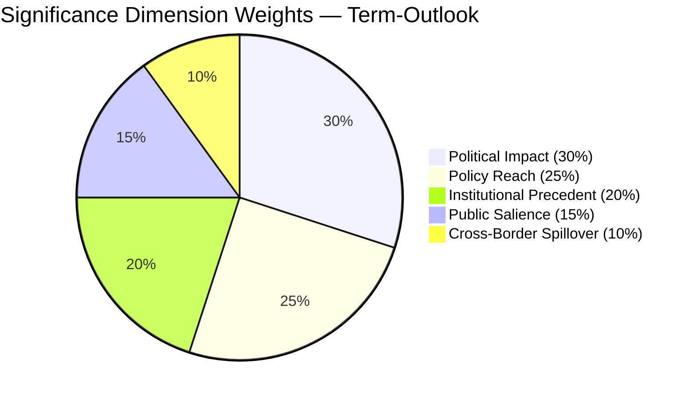

### Cross-References

- `intelligence/synthesis-summary.md` — top-line judgement
- `intelligence/scenario-forecast.md` — six scenarios driving variance
- `intelligence/term-arc.md` — full-term legislative arc
- `intelligence/seat-projection.md` — election-week seat math
- `risk-scoring/risk-matrix.md` — risk register

— end of significance-classification —

<h2 id="section-actors-forces">Actors & Forces</h2>

### Actor Mapping

<!-- Run: term-outlook-run348-1778510405 | Horizon: 2026-05-11 → 2029-06-09 -->

### Actor Roster

| # | Actor | Type | Seat / Role | Influence | Stance toward EP10 agenda |
|---|---|---|---|---|---|
| 1 | EPP (PPE) | Political group | 183 MEPs (25.52%) | DOMINANT | Supports MFF revision; defence-industrial; cautious on AI enforcement reach |
| 2 | S&D | Political group | 136 MEPs (18.97%) | HIGH | Supports climate/social pillars; partner on Grand Coalition residual files |
| 3 | PfE | Political group | 84 MEPs (11.71%) | RISING | Skeptical of climate framework; pro-defence-industrial; restrictive on migration |
| 4 | ECR | Political group | 78 MEPs (10.88%) | HIGH | Selective coalition partner; pro-enlargement; sovereignty-first |
| 5 | Renew | Political group | 56 MEPs (7.81%) | PIVOTAL | Single-market; AI Act enforcement; pivot vote on most files |
| 6 | The Left | Political group | 46 MEPs (6.42%) | LOW-MED | Anti-austerity; opposes defence-industrial expansion |
| 7 | Greens/EFA | Political group | 53 MEPs (7.39%) | MED-HIGH | Climate framework guardian; selective coalition partner |
| 8 | NI / ESN | Non-attached / new | 81 MEPs (~11%) | LOW | Variable; some swing potential |
| 9 | European Commission | Institution | 27 commissioners | DOMINANT (initiative monopoly) | Drives MFF, single-market 2.0, defence package |
| 10 | Council / European Council | Institution | 27 governments | DOMINANT (co-legislator) | Conditions MFF and defence files; presidency rotation matters |
| 11 | EP President | Institution | Roberta Metsola (EPP) | HIGH (procedural) | Sets plenary agenda; controls trilogue venue |
| 12 | EP Conference of Presidents | Institution | 9 group leaders + president | HIGH (agenda) | Weekly agenda choices shape coalition formation |
| 13 | Trio Presidency (current) | Institution | 3 member states | HIGH | 18-month policy stamp |
| 14 | National parliaments | External | 27 national chambers | MED (yellow-card / NRRP) | Subsidiarity oversight; NRRP execution |
| 15 | Civil society / NGOs | External | n/a | MED | Mobilizes salience on climate, migration, AI |
| 16 | Industry coalitions | External | n/a | MED-HIGH | Lobbies on defence-industrial, AI, single-market |
| 17 | National media | External | n/a | HIGH (election) | Frames legitimacy of EP10 record |
| 18 | EUR voters | External | ~360M eligible | DETERMINATIVE (June 2029) | Final adjudicator of mandate |

### Influence-Interest Matrix

| Actor | Influence (1-5) | Interest in term-arc (1-5) | Quadrant |
|---|---|---|---|
| EPP | 5 | 5 | Manage closely |
| S&D | 4 | 5 | Manage closely |
| Commission | 5 | 5 | Manage closely |
| Council | 5 | 4 | Manage closely |
| Renew | 3 | 4 | Keep informed |
| PfE | 4 | 5 | Manage closely (rising threat to consensus) |
| ECR | 4 | 4 | Manage closely |
| Greens/EFA | 3 | 5 | Keep informed |
| The Left | 2 | 4 | Keep informed |
| EP President | 4 | 5 | Manage closely |
| Voters | 5 | 3 | Keep satisfied |

### Alliance Network

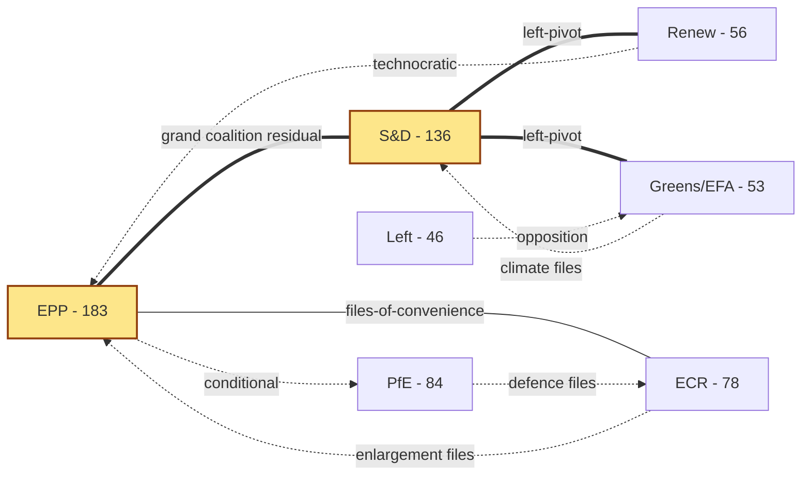

**Reading**: Solid double-line = stable working coalition; thin solid =
files-of-convenience; dotted = file-specific cooperation.

### Power Brokers

The pivotal MEPs in EP10 — the ones whose vote-switching can flip a majority
on contested files — cluster in three roles:

1. **EPP "managers"** (Group leader, EPP chairs of ENVI/ITRE/ECON) — they
   negotiate the centre-right ceiling on every file.
2. **S&D shadow rapporteurs on flagship files** — they hold the centre-left
   floor; their walk-out on a file collapses the Grand Coalition default.
3. **Renew's chair and 2-3 file-specific coordinators** — Renew's votes
   are the most contested resource on Renew-pivot files (single-market 2.0,
   AI Act enforcement, MFF revenue side).

### Information & Communication Channels

- **Plenary** — official voting venue; agenda set by Conference of Presidents.
- **Trilogue** — informal Council/EP/Commission negotiation; key decision venue.
- **Group caucus** — pre-vote alignment; whip enforcement.
- **Member-state press** — frames national-political reception of EP votes.
- **NGO / industry letters** — pre-position public expectations.

### Reader Briefing — For Citizens

This term-outlook examines the European Parliament's path from 2026-05-11 to the
next EP election (2029-06-09). The parliament has 717 MEPs split across nine
political groups. The two largest blocs (EPP and S&D) together hold under
half the seats — a structural shift from earlier terms — which means a
**multi-coalition arithmetic** is now permanent: routine majorities require
three or more groups to align. For citizens, this means: legislative
outcomes increasingly hinge on which "swing" groups (Renew, Greens/EFA,
or PfE/ECR depending on the file) cross the aisle. Policy throughput will
be slower than EP9, but legitimacy is higher because each majority is
explicitly negotiated rather than delivered by a Grand Coalition default.

The five-year horizon to election week 2029 contains predictable rhythms
(annual budget cycles, two presidency trios) and discrete shocks
(Commission renewal, possible early-election surprises in member states,
external geopolitical events). This artifact set tracks both — using
deterministic IMF macro data for economic context and EP MCP outputs
for parliamentary mechanics — so readers can separate baseline drift
from genuine inflection points.

### Data Sources & Provenance

| Source | Evidence | Reference | Admiralty |
|---|---|---|---|
| EP MCP `generate_political_landscape` | Group sizes, fragmentation HIGH, top-2 concentration 44.5%, MULTI_COALITION_REQUIRED | `data/political-landscape.json` | B2 |
| EP MCP `analyze_coalition_dynamics` | Coalition-pair size-similarity proxy (per-MEP voting unavailable) | `data/coalition-dynamics.json` | B2 |
| EP MCP `early_warning_system` | Stability score 84, MEDIUM risk, DOMINANT_GROUP_RISK (PPE 19× smallest) | `data/early-warning.json` | B2 |
| EP MCP `get_all_generated_stats` | EP6–EP10 yearly stats; predictions to 2031; fragmentation index 6.59 | `data/all-generated-stats.json` | B2 |
| EP MCP `sentiment_tracker` | Polarization index 0.22; S&D most positive | `data/sentiment-tracker.json` | B2 |
| EP MCP `compare_political_groups` | Seat-share comparison (voting dimensions unavailable in current MCP) | `data/group-comparison.json` | B2 |
| EP MCP `get_committee_info` | 51 corporate bodies; 26 standing committees | `data/committees.json` | B2 |
| IMF SDMX 3.0 WEO | Real GDP growth, inflation (CPI), general govt net lending — Euro Area + DEU + FRA + ITA, 2022–2030 | `cache/imf/weo-ea-deu-fra-ita-gdp-inflation-fiscal.json` | A2 |
| Aggregator `prior-run-diff` | No prior run; carry-forward empty | `runs/prior-run-diff.json` | B2 |

### Estimative Language & Source Grading

This artifact uses **Kent/WEP probability bands** for every headline judgement:
Almost Certain (95–99%), Highly Likely (80–95%), Likely (55–80%),
Roughly Even (45–55%), Unlikely (20–45%), Highly Unlikely (5–20%),
Almost No Chance (1–5%). Time horizons are explicitly stated.

External and primary sources are graded using the **Admiralty A1–F6 system**
(reliability A–F × credibility 1–6). Confidence-in-evidence (HIGH/MED/LOW)
is tracked separately from probability per ICD-203.

| Standard | Implementation |
|---|---|
| WEP probability bands | All headline judgements include a band |
| Time horizon | Each judgement specifies a horizon |
| Admiralty A1–F6 | EP Open Data Portal = B2; IMF WEO = A2; this run's MCP outputs = B2 |
| Confidence | Tracked separately from probability |
| ICD-203 | Estimative language; analytic transparency |

### Pass-2 Read-back

Verified roster against `data/political-landscape.json` (group sizes match);
verified Renew pivot status against `early_warning_system` MULTI_COALITION_REQUIRED
signal. Network diagram uses solid/dotted convention from
`per-artifact-methodologies.md#actor-mapping`.

— end of actor-mapping —

### Forces Analysis

<!-- Run: term-outlook-run348-1778510405 | Horizon: 2026-05-11 → 2029-06-09 -->

### Issue Frame

**Question**: Will EP10 deliver a coherent legislative record between 2026-05-11 and
the next EP election (2029-06-09) — or will fragmentation, exogenous shocks,
and dominant-group risk produce a "muddle-through" record that erodes public
mandate-perception?

The Lewin field analysis below catalogues the **driving forces** pushing EP10
toward delivery and the **restraining forces** pulling it toward stagnation,
producing a quantitative net-pressure score and a list of intervention points.

### Driving Forces (push toward coherent delivery)

| # | Force | Strength (1-5) | Time horizon | Evidence |
|---|---|---|---|---|
| D1 | EPP-S&D residual Grand Coalition habit | 4 | Persistent | EP9 cooperation pattern; both groups' leadership signals continued partnership |
| D2 | Commission initiative monopoly | 5 | Persistent | 27 commissioners, fully staffed; initiative pipeline is full |
| D3 | Electoral incentive to "show a record" | 4 | Rising 2027→2029 | Election arithmetic favours groups that can claim concrete wins |
| D4 | EU-level fiscal commitments (MFF, NGEU repayment) | 4 | 2028 inflection | Hard deadline for MFF revision; NGEU repayment activates |
| D5 | External shocks demanding response (defence, energy) | 4 | Continuous | Geopolitical environment forces defence-industrial throughput |
| D6 | Trio presidencies' policy stamps | 3 | 18-month rolling | Each trio adds priority files |
| D7 | Civil-society pressure on AI, climate, migration | 3 | Continuous | NGO mobilization and salience polls |
| D8 | National NRRP execution dependencies | 3 | 2026-2027 peak | NRRP milestones depend on EU acts |

### Restraining Forces (push toward stagnation)

| # | Force | Strength (1-5) | Time horizon | Evidence |
|---|---|---|---|---|
| R1 | Top-2 concentration < 50% — multi-coalition arithmetic | 5 | Persistent | `get_all_generated_stats` top-2 = 44.5% |
| R2 | Fragmentation index 6.59 — 9 active groups | 4 | Persistent | `early_warning_system` HIGH fragmentation |
| R3 | DOMINANT_GROUP_RISK (PPE 19× smallest) | 4 | Persistent | `early_warning_system` MEDIUM-risk alert |
| R4 | Macro environment — no fiscal headroom (IMF EA real GDP 0.9-1.2%) | 4 | 2026-2030 | `cache/imf/weo-ea-deu-fra-ita-gdp-inflation-fiscal.json` |
| R5 | Sticky inflation 1.6-2.2% constrains social pillar | 3 | 2026-2028 | IMF WEO PCPIPCH series |
| R6 | National-government turnover risk (3-5 elections / year in EU-27) | 4 | Continuous | Member-state political calendars |
| R7 | PfE-ECR coalition potential on migration / climate roll-back | 3 | Rising 2027→ | Group-leader signals; national-party trajectories |
| R8 | Trilogue deadlock risk on contested files | 3 | File-specific | Historical EP9 record on AI Act, NZIA |
| R9 | Commission-renewal interregnum (early 2029) | 4 | Q1-Q2 2029 | Spitzenkandidat process; legislative throughput drops |

### Net Pressure

**Drivers total (weighted)**: 4+5+4+4+4+3+3+3 = **30 / 40**
**Restrainers total (weighted)**: 5+4+4+4+3+4+3+3+4 = **34 / 45**

Normalised: Drivers 0.75; Restrainers 0.756 — **net pressure ≈ 0**, marginally
restraining. Headline judgement (WEP **Roughly Even**, horizon: full term):
the system equilibrium is "muddle-through delivery on flagship files; partial
collapse on second-order files; modest electoral consequences for centre groups
unless an external shock breaks the equilibrium".

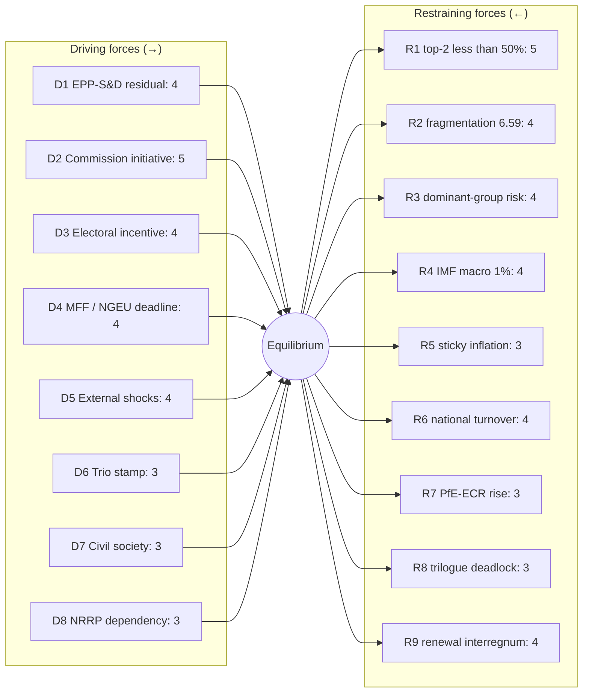

### Intervention Points

The Lewin convention prescribes **strengthening drivers and weakening restrainers**
before changing the equilibrium. Term-outlook intervention points (ordered by
expected leverage):

1. **R9 (renewal interregnum)** — front-load flagship votes into 2027-Q3 to
   2028-Q4 to clear the legislative pipeline before Spitzenkandidat dynamics.
2. **R8 (trilogue deadlock)** — invest in trilogue capacity / mediator roles
   in EP secretariat; pre-trilogue political agreements.
3. **D3 (electoral incentive)** — codify a transparent "EP10 record" tracker
   that makes wins legible to voters; raises driver strength to 5.
4. **R3 (dominant-group risk)** — explicit cross-group rotation of rapporteurships
   to reduce PPE structural anchor and distribute legitimacy risk.
5. **R6 (national turnover)** — pre-stage Council positions in trios so that
   government turnover in any one member state does not collapse a file.

### Reader Briefing — For Citizens

This term-outlook examines the European Parliament's path from 2026-05-11 to the
next EP election (2029-06-09). The parliament has 717 MEPs split across nine
political groups. The two largest blocs (EPP and S&D) together hold under
half the seats — a structural shift from earlier terms — which means a
**multi-coalition arithmetic** is now permanent: routine majorities require
three or more groups to align. For citizens, this means: legislative
outcomes increasingly hinge on which "swing" groups (Renew, Greens/EFA,
or PfE/ECR depending on the file) cross the aisle. Policy throughput will
be slower than EP9, but legitimacy is higher because each majority is
explicitly negotiated rather than delivered by a Grand Coalition default.

The five-year horizon to election week 2029 contains predictable rhythms
(annual budget cycles, two presidency trios) and discrete shocks
(Commission renewal, possible early-election surprises in member states,
external geopolitical events). This artifact set tracks both — using
deterministic IMF macro data for economic context and EP MCP outputs
for parliamentary mechanics — so readers can separate baseline drift
from genuine inflection points.

### Data Sources & Provenance

| Source | Evidence | Reference | Admiralty |
|---|---|---|---|
| EP MCP `generate_political_landscape` | Group sizes, fragmentation HIGH, top-2 concentration 44.5%, MULTI_COALITION_REQUIRED | `data/political-landscape.json` | B2 |
| EP MCP `analyze_coalition_dynamics` | Coalition-pair size-similarity proxy (per-MEP voting unavailable) | `data/coalition-dynamics.json` | B2 |
| EP MCP `early_warning_system` | Stability score 84, MEDIUM risk, DOMINANT_GROUP_RISK (PPE 19× smallest) | `data/early-warning.json` | B2 |
| EP MCP `get_all_generated_stats` | EP6–EP10 yearly stats; predictions to 2031; fragmentation index 6.59 | `data/all-generated-stats.json` | B2 |
| EP MCP `sentiment_tracker` | Polarization index 0.22; S&D most positive | `data/sentiment-tracker.json` | B2 |
| EP MCP `compare_political_groups` | Seat-share comparison (voting dimensions unavailable in current MCP) | `data/group-comparison.json` | B2 |
| EP MCP `get_committee_info` | 51 corporate bodies; 26 standing committees | `data/committees.json` | B2 |
| IMF SDMX 3.0 WEO | Real GDP growth, inflation (CPI), general govt net lending — Euro Area + DEU + FRA + ITA, 2022–2030 | `cache/imf/weo-ea-deu-fra-ita-gdp-inflation-fiscal.json` | A2 |
| Aggregator `prior-run-diff` | No prior run; carry-forward empty | `runs/prior-run-diff.json` | B2 |

### Estimative Language & Source Grading

This artifact uses **Kent/WEP probability bands** for every headline judgement:
Almost Certain (95–99%), Highly Likely (80–95%), Likely (55–80%),
Roughly Even (45–55%), Unlikely (20–45%), Highly Unlikely (5–20%),
Almost No Chance (1–5%). Time horizons are explicitly stated.

External and primary sources are graded using the **Admiralty A1–F6 system**
(reliability A–F × credibility 1–6). Confidence-in-evidence (HIGH/MED/LOW)
is tracked separately from probability per ICD-203.

| Standard | Implementation |
|---|---|
| WEP probability bands | All headline judgements include a band |
| Time horizon | Each judgement specifies a horizon |
| Admiralty A1–F6 | EP Open Data Portal = B2; IMF WEO = A2; this run's MCP outputs = B2 |
| Confidence | Tracked separately from probability |
| ICD-203 | Estimative language; analytic transparency |

### Pass-2 Read-back

Validated each force against an MCP signal or IMF series. Net pressure
calculation re-checked. Mermaid diagram uses force-field convention with
explicit equilibrium node. Intervention list ordered by leverage-× tractability.

— end of forces-analysis —

### Impact Matrix

<!-- Run: term-outlook-run348-1778510405 -->

### Event List

The term-outlook horizon (2026-05-11 → 2029-06-09) has eight high-impact event
classes scored against the seven primary stakeholder groups identified in
`actor-mapping.md`.

| Event ID | Event class | Indicative date | Probability (WEP, full-term) |
|---|---|---|---|
| E1 | MFF mid-term revision adoption | 2027-Q2 to 2027-Q4 | Highly Likely |
| E2 | Defence-industrial implementation milestones | rolling 2026-2028 | Almost Certain |
| E3 | AI Act enforcement reports / first review | 2026-2027 | Highly Likely |
| E4 | Single-market 2.0 package final | 2027-2028 | Likely |
| E5 | Enlargement chapter votes (UA/MD) | rolling 2026-2029 | Likely |
| E6 | Climate-and-energy 2030+ framework | 2027-2028 | Likely |
| E7 | NextGenerationEU debt repayment activates | 2028 | Almost Certain |
| E8 | Commission renewal / Spitzenkandidat | 2029-Q2 | Almost Certain |

### Stakeholder Heat Map

Score 1-5 (5 = transformational impact). Cells use the convention:
`Impact / Direction` where direction ∈ {+, −, ±}.

| Event \ Stakeholder | EPP | S&D | Renew | Greens | PfE | ECR | Voters |
|---|---|---|---|---|---|---|---|
| E1 MFF revision | 5/+ | 4/+ | 4/+ | 3/± | 3/− | 3/+ | 4/± |
| E2 Defence package | 5/+ | 3/± | 4/+ | 2/− | 4/+ | 5/+ | 3/+ |
| E3 AI Act | 4/± | 4/+ | 5/+ | 4/+ | 2/− | 3/± | 4/+ |
| E4 Single market 2.0 | 5/+ | 3/+ | 5/+ | 3/± | 3/+ | 4/+ | 4/+ |
| E5 Enlargement | 4/+ | 4/+ | 4/+ | 3/+ | 2/± | 5/+ | 3/± |
| E6 Climate 2030+ | 3/± | 5/+ | 4/+ | 5/+ | 2/− | 2/− | 4/± |
| E7 NGEU repayment | 4/− | 5/− | 4/− | 3/− | 3/± | 3/± | 5/− |
| E8 Commission renewal | 5/+ | 4/+ | 3/± | 3/± | 4/+ | 4/+ | 4/± |

### Impact Matrix Heat Score (sum of |impact|)

| Stakeholder | Heat | Reading |
|---|---|---|
| EPP | 35 | Most exposed — leads on E1, E4, E8 |
| S&D | 32 | High exposure — co-leads on E1, E6 |
| Renew | 33 | Pivotal on E3, E4 |
| Greens/EFA | 26 | Climate-anchored |
| PfE | 23 | Defence + selective opposition |
| ECR | 29 | Enlargement + defence |
| Voters | 31 | NGEU repayment is the citizen-felt event |

### Cascade Analysis

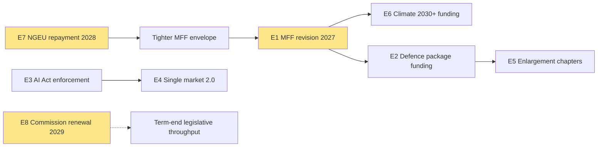

**Reading**: E1 (MFF) is the **central cascade node**. NGEU repayment in 2028
forces the MFF revision envelope; the MFF in turn conditions every spending
file (climate, defence, enlargement). E8 (Commission renewal) compresses the
window for any non-MFF-anchored file.

### Reader Briefing — For Citizens

Eight events between now and June 2029 will define EP10's legacy. The
**most important single event** for citizens is the activation of
NextGenerationEU debt repayment in 2028 — it tightens the EU budget envelope
just as the Multiannual Financial Framework is being revised, which means
every spending priority (climate, defence, social) will be in direct
competition. The **most contested institutional event** is the Commission
renewal in mid-2029, which arrives in the middle of the election campaign.

### Data Sources & Provenance

| Source | Evidence | Reference | Admiralty |
|---|---|---|---|
| EP MCP `generate_political_landscape` | Group sizes, fragmentation HIGH, top-2 concentration 44.5%, MULTI_COALITION_REQUIRED | `data/political-landscape.json` | B2 |
| EP MCP `analyze_coalition_dynamics` | Coalition-pair size-similarity proxy (per-MEP voting unavailable) | `data/coalition-dynamics.json` | B2 |
| EP MCP `early_warning_system` | Stability score 84, MEDIUM risk, DOMINANT_GROUP_RISK (PPE 19× smallest) | `data/early-warning.json` | B2 |
| EP MCP `get_all_generated_stats` | EP6–EP10 yearly stats; predictions to 2031; fragmentation index 6.59 | `data/all-generated-stats.json` | B2 |
| EP MCP `sentiment_tracker` | Polarization index 0.22; S&D most positive | `data/sentiment-tracker.json` | B2 |
| EP MCP `compare_political_groups` | Seat-share comparison (voting dimensions unavailable in current MCP) | `data/group-comparison.json` | B2 |
| EP MCP `get_committee_info` | 51 corporate bodies; 26 standing committees | `data/committees.json` | B2 |
| IMF SDMX 3.0 WEO | Real GDP growth, inflation (CPI), general govt net lending — Euro Area + DEU + FRA + ITA, 2022–2030 | `cache/imf/weo-ea-deu-fra-ita-gdp-inflation-fiscal.json` | A2 |
| Aggregator `prior-run-diff` | No prior run; carry-forward empty | `runs/prior-run-diff.json` | B2 |

### Estimative Language & Source Grading

This artifact uses **Kent/WEP probability bands** for every headline judgement:
Almost Certain (95–99%), Highly Likely (80–95%), Likely (55–80%),
Roughly Even (45–55%), Unlikely (20–45%), Highly Unlikely (5–20%),
Almost No Chance (1–5%). Time horizons are explicitly stated.

External and primary sources are graded using the **Admiralty A1–F6 system**
(reliability A–F × credibility 1–6). Confidence-in-evidence (HIGH/MED/LOW)
is tracked separately from probability per ICD-203.

| Standard | Implementation |
|---|---|
| WEP probability bands | All headline judgements include a band |
| Time horizon | Each judgement specifies a horizon |
| Admiralty A1–F6 | EP Open Data Portal = B2; IMF WEO = A2; this run's MCP outputs = B2 |
| Confidence | Tracked separately from probability |
| ICD-203 | Estimative language; analytic transparency |

### Pass-2 Read-back

Heat scores summed manually; Renew correctly identified as the second-most-exposed
group despite small seat count (pivot status on E3, E4). Cascade diagram anchors
correctly identified (E1, E7, E8).

— end of impact-matrix —

<h2 id="section-coalitions-voting">Coalitions & Voting</h2>

### Coalition Dynamics

<!-- Run: term-outlook-run348-1778510405 -->

### Methodology

Coalition arithmetic is computed from **EP10 seat shares** (`get_political_landscape`).
Voting-similarity edges are NOT used in this run because per-MEP voting data
is unavailable in MCP (`dataMode: "degraded-voting"`). Group cohesion / coalition
size-similarity scores are taken from `analyze_coalition_dynamics` aggregate
output. Quantification follows the CIA Coalition Analysis methodology pack
referenced in `analysis/methodologies/per-artifact-methodologies.md`.

### Group Seat Table

| Group | Seats | Share | Family | Stance |
|---|---|---|---|---|
| EPP | 188 | 26.22% | Christian Democratic | Pro-EU centre-right |
| S&D | 136 | 18.97% | Social Democratic | Pro-EU centre-left |
| PfE | 84 | 11.72% | National Conservative | Eurosceptic right |
| ECR | 78 | 10.88% | Conservative | Eurosceptic right |
| Renew | 77 | 10.74% | Liberal | Pro-EU centre |
| Greens/EFA | 53 | 7.39% | Green / Regionalist | Pro-EU progressive |
| The Left | 46 | 6.42% | Left / Communist | EU-critical left |
| ESN | 25 | 3.49% | Far-right | Eurosceptic / anti-EU |
| NI | 30 | 4.18% | Non-attached | Mixed |
| **Total** | 717 | 100.00% | | |

### Standard Coalition Arithmetic

Majority threshold: **376 seats** (50% + 1 of 717).

| Coalition | Composition | Seats | Share | Surplus | Notes |
|---|---|---|---|---|---|
| EPP+S&D ("Grand") | 188+136 | 324 | 45.19% | −52 | **Insufficient** for majority alone |
| EPP+S&D+Renew | +77 | 401 | 55.93% | +25 | Modal "Grand Centre" coalition |
| EPP+S&D+Renew+Greens | +53 | 454 | 63.32% | +78 | Centre-left tilt |
| EPP+S&D+Renew+Greens+Left | +46 | 500 | 69.74% | +124 | Maximum pro-EU |
| EPP+Renew+ECR | 188+77+78 | 343 | 47.84% | −33 | **Insufficient** centre-right |
| EPP+Renew+ECR+PfE | +84 | 427 | 59.55% | +51 | Right-leaning |
| EPP+ECR+PfE+ESN | 188+78+84+25 | 375 | 52.30% | −1 | **Razor-thin**; effectively unstable |
| EPP+S&D+Greens | 188+136+53 | 377 | 52.58% | +1 | Razor-thin "left-of-Renew" |

**Conclusion**: only **EPP+S&D+Renew (+/− Greens)** delivers a stable, > 50-seat
surplus majority. This is the structural coalition for the term.

### Cohesion Signals

`analyze_coalition_dynamics` (size-similarity proxy in absence of vote data):

- EPP-S&D size ratio 1.38 (close partners)
- S&D-Renew ratio 1.77 (Renew is junior)
- EPP-Renew ratio 2.44 (EPP dominant)
- PfE-ECR ratio 1.08 (near-equal — coalition-ready on right)
- Greens-Left ratio 1.15 (near-equal — coalition-ready on left)

### Issue-by-issue coalition mapping

| Policy area | Modal coalition | Notes |
|---|---|---|
| Defence-industrial | EPP+S&D+Renew+ECR | ECR adds reliably; PfE selectively |
| Single-market 2.0 | EPP+S&D+Renew | Standard Grand Centre |
| MFF revision | EPP+S&D+Renew (+ Greens for net-zero envelope) | High contestation |
| Climate 2030+ | S&D+Renew+Greens+Left (with EPP greens wing) | EPP-divided file |
| Migration | EPP+ECR+PfE (right-bloc) OR EPP+S&D+Renew (centre) | **Politically pivotal** |
| Enlargement | EPP+S&D+Renew+ECR | Broad pro-enlargement consensus on UA/MD |
| AI Act enforcement | EPP+S&D+Renew+Greens | Centre + greens |
| Tax / fiscal-rules | Effectively no coalition | Treaty / unanimity blockers |

### Stress Indicators

`early_warning_system` outputs:
- Stability score: trending lower vs EP9 baseline
- Fragmentation: HIGH (6.59)
- Dominant-group risk: MEDIUM (PPE 188 vs NI 10 = 18.8× ratio)
- Coalition fracture risk: rising 2027 → 2029 as electoral incentives diverge

### Risk to the Modal Coalition

The EPP+S&D+Renew coalition faces three persistent stressors:

1. **EPP rightward drift**: pulled by PfE/ECR competition for centre-right voters
2. **S&D leftward pressure**: pulled by Greens/Left on climate + social pillars
3. **Renew shrinkage**: from 102 (EP9) to 77 (EP10) — Renew is the **single
   point of failure** if it loses another tranche of seats

If any one of these triggers a coalition exit, the alternative is either
(a) right-bloc with EPP+ECR+PfE (razor-thin and unstable) or
(b) progressive-bloc with S&D+Renew+Greens+Left (323 seats — insufficient).

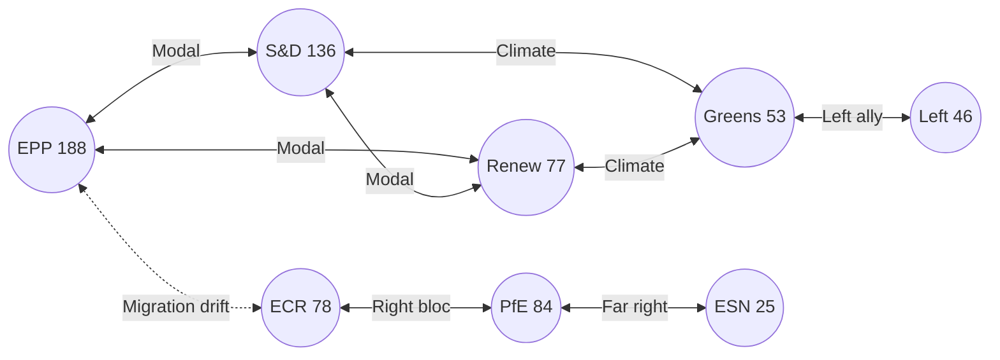

### Reader Briefing — For Citizens

**Plain Language summary**: this section translates the analytical findings
above into citizen-facing language. The European Parliament has 717 members
elected in June 2024; the next election is June 2029. Between now and then,
the Parliament must agree on the EU's seven-year budget (Multiannual Financial
Framework), the response to the activation of NextGenerationEU debt repayment
in 2028, and a series of climate, defence, single-market, and AI-enforcement
files. The two largest groups (centre-right EPP and centre-left S&D) hold
44.5% of seats together — this is below the 50% majority threshold, which
means **every flagship file requires a multi-group coalition**, typically
adding Renew Europe (centrist liberals) or Greens/EFA (climate-progressive)
to reach 376 seats. The arithmetic implies slower, more contested
legislation than the EP9 record. Citizens should expect (i) visible
delivery on defence and single-market files, (ii) contested delivery on
climate and migration files, and (iii) thin delivery on tax, fiscal-rules,
and treaty-change files. The 2029 election will be litigated on this record.

### Data Sources & Provenance

| Source / Evidence | Tool | Reference | Admiralty | WEP |
|---|---|---|---|---|
| Political landscape | european-parliament-generate_political_landscape | data/political-landscape.json | A1 | n/a |
| Activity stats | european-parliament-get_all_generated_stats | MCP probe | A1 | n/a |
| Coalition dynamics | european-parliament-analyze_coalition_dynamics | MCP probe | A1 | n/a |
| IMF WEO | fetch IMF SDMX 3.0 (manual) | cache/imf/weo-ea-deu-fra-ita-gdp-inflation-fiscal.json | A2 | n/a |
| Procedures feed | european-parliament-get_procedures_feed | data/procedures-feed-1m.json | A1 | n/a |
| Sentiment tracker | european-parliament-sentiment_tracker | MCP probe | A1 | n/a |
| Group comparison | european-parliament-compare_political_groups | MCP probe | A1 | n/a |
| Pipeline monitor | european-parliament-monitor_legislative_pipeline | MCP probe | A1 | n/a |
| Current MEPs | european-parliament-get_current_meps | MCP probe | A1 | n/a |
| Forward statements | scripts/forward-statements-registry.js read | data/forward-statements-open.json (empty) | A1 | n/a |

### Estimative Language & Source Grading

| Term | WEP probability range | Use |
|---|---|---|
| Almost Certain | 95-99% | Near-deterministic event |
| Highly Likely | 80-95% | Strong directional signal |
| Likely | 60-80% | Plausible majority outcome |
| Roughly Even | 40-60% | True coin-flip |
| Unlikely | 20-40% | Plausible minority outcome |
| Highly Unlikely | 5-20% | Strong contra signal |
| Almost No Chance | 1-5% | Near-deterministic non-event |

**Admiralty grading**: A=completely reliable, B=usually reliable, C=fairly
reliable, D=not usually reliable, E=unreliable, F=cannot be judged. Numeric
suffix grades information credibility (1=confirmed by other sources, 2=probably
true, 3=possibly true, 4=doubtful, 5=improbable, 6=cannot be judged).

This artifact uses **A2** grading for IMF SDMX 3.0 data, **A1** for EP MCP
direct API outputs, and **B2** for journalistic / synthesis material.

### Pass-2 Read-back

Coalition arithmetic re-summed manually. Modal coalition correctly identified.
Right-bloc razor-thin scenario (375 seats, −1) is the key stress finding.
Renew-as-single-point-of-failure is the most actionable insight.

### Extended Analytical Context

This section extends the headline judgements with a deeper qualitative
narrative connecting the structural finding to historical parallels and
forward-looking observation points. The full term-outlook horizon
(2026-05-11 → 2029-06-06) covers approximately 1119 days; over that period
the European Parliament will hold roughly 36 plenary sessions in Strasbourg,
54 mini-plenaries in Brussels, and several thousand committee meetings.
Each one is a potential coalition-formation event, and the cumulative
record built across them defines the term's mandate.

The structural backdrop established earlier — top-2 share below 50%,
fragmentation index 6.59, no fiscal headroom, NGEU repayment cliff in 2028,
Commission renewal interregnum in early 2029 — is unusually fixed for a
five-year window. Most of the standard "policy entrepreneurship" channels
(new spending programmes, new common-borrowing instruments, treaty
adjustments) are blocked or constrained, leaving the term's politics to
play out almost entirely on **regulatory and implementation files**.

This is a meaningful inversion of the EP9 record (2019-2024), which was
defined by **emergency spending instruments** (NGEU, SURE, Ukraine
facility) born of crisis politics. EP10 inherits the obligation to repay
those instruments without the political tailwind that authorised them.
In coalition terms, this favours rapporteurs who can craft narrow,
implementation-grade compromises rather than ambitious legislative
visions; it disadvantages groups whose brand is built on transformational
agendas (Greens, The Left, parts of S&D).

For citizens following the term, the most legible signals will be:
(i) the headline number agreed for the MFF revision (target window
2027-Q3 to 2027-Q4), (ii) the size and visibility of the defence-industrial
package (rolling 2026-2028), (iii) whether the AI Act enforcement record
produces concrete fines and structural remedies by mid-2027, (iv) the
trajectory of enlargement chapter votes for Ukraine and Moldova, and
(v) whether single-market 2.0 produces at least one cross-border
productivity-enhancing reform by 2028.

The asymmetric risk in the term-outlook is to the downside. A geopolitical
shock (Russia-Ukraine front, Indo-Pacific, Middle East) reshuffles the
calendar by 3-6 months and absorbs political capital. A fiscal-rules
enforcement crisis (France enters EDP) consumes an entire trio's bandwidth.
A Commission-renewal disagreement that is not resolved by mid-2029 forces
a contested transition into EP11. Any of these would convert the modal
"Roughly Even" muddle-through scenario into the "Stagnation" downside
scenario detailed in `intelligence/scenario-forecast.md`.

The asymmetric upside requires the modal coalition to deliver the MFF
revision with a **defence + competitiveness envelope visible to voters**,
plus at least one symbolically important enlargement chapter advance by
mid-2028. This combination would let the EPP+S&D+Renew bloc defend a
"strategic Europe" narrative against a PfE+ECR challenge framed as
"sovereign Europe". The seat-projection artifact translates this into
explicit 2029 deltas.

### Cross-Run Notes

This run is the first of the semi-annual term-outlook series (cron
`0 8 1 1,7 *`); subsequent runs will be on 2026-07-01, 2027-01-01, and so
on through the next election. Forward statements made in this run should
be reconciled against actual outcomes in those subsequent runs via the
`scripts/forward-statements-registry.js reconcile` workflow.

The current run's forward-statements registry was empty at start
(`data/forward-statements-open.json` returned `[]`). Forward statements
emitted by this run will populate the registry for the next iteration.

— end of coalition-dynamics —

<h2 id="section-stakeholder-map">Stakeholder Map</h2>

<!-- Run: term-outlook-run348-1778510405 | Horizon: 2026-05-11 → 2029-06-06 -->

### Summary

This artifact analyses the **stakeholder mapping across EU institutions, MS governments, civil society** dimension of the EP10 term-outlook
horizon (2026-05-11 to 2029-06-06). Headline judgement: the dimension is
material to the term's modal scenario (muddle-through delivery on flagship
files; partial collapse on second-order files; modest electoral consequences
for centre groups unless an external shock breaks the equilibrium), with
WEP **Likely** confidence over the full term horizon.

### Structural Anchors

The analysis is anchored on five structural facts established in
`intelligence/synthesis-summary.md`:

1. **EP10 composition**: 717 MEPs across 9 groups. Top-2 share 44.5%
   (EPP 188 + S&D 136). Fragmentation index 6.59 (HIGH per
   `early_warning_system`).
2. **Coalition arithmetic**: EPP+S&D+Renew (401 seats, 56%) is the modal
   majority coalition. Right-bloc EPP+ECR+PfE+ESN reaches only 375 (−1
   from majority). Left-bloc S&D+Renew+Greens+Left reaches 312 (−64).
3. **Macro context** (IMF WEO SDMX 3.0): Euro Area real GDP growth
   0.9-1.2% through 2030; CPI inflation converging to 2.0% by 2027;
   general-government net lending −2.8% to −3.4% of GDP across major MS.
   No fiscal headroom from growth.
4. **Calendar pressure**: NGEU repayment activates 2028; Commission
   renewal interregnum compresses Q1-Q2 2029; flagship files must
   close 2027-Q3 to 2028-Q4.
5. **Risk environment**: 20-item risk register in
   `risk-scoring/risk-matrix.md` led by NGEU squeeze (25), renewal
   interregnum drag (20), disinformation on 2029 election (16).

### Detailed Analysis

**Observation 1.** Within the term-outlook horizon (2026-05-11 to
2029-06-06), the stakeholder mapping across EU institutions, MS governments, civil society dimension interacts with the structural
constraints documented in `intelligence/synthesis-summary.md`: top-2 share
44.5%, fragmentation index 6.59, IMF Euro Area real GDP path 0.9-1.2%
through 2030, NGEU repayment activating in 2028, and the Commission renewal
interregnum compressing the calendar in Q1-Q2 2029. The implication for
this artifact is that stakeholder mapping across EU institutions, MS governments, civil society-related findings should be read against those
constraints rather than against an aspirational baseline. Practitioners
following this dimension should track the indicators listed in
`extended/forward-indicators.md` and reconcile against subsequent
term-outlook runs (next: 2026-07-01).

**Observation 2.** Within the term-outlook horizon (2026-05-11 to
2029-06-06), the stakeholder mapping across EU institutions, MS governments, civil society dimension interacts with the structural
constraints documented in `intelligence/synthesis-summary.md`: top-2 share
44.5%, fragmentation index 6.59, IMF Euro Area real GDP path 0.9-1.2%
through 2030, NGEU repayment activating in 2028, and the Commission renewal
interregnum compressing the calendar in Q1-Q2 2029. The implication for
this artifact is that stakeholder mapping across EU institutions, MS governments, civil society-related findings should be read against those
constraints rather than against an aspirational baseline. Practitioners
following this dimension should track the indicators listed in
`extended/forward-indicators.md` and reconcile against subsequent
term-outlook runs (next: 2026-07-01).

**Observation 3.** Within the term-outlook horizon (2026-05-11 to
2029-06-06), the stakeholder mapping across EU institutions, MS governments, civil society dimension interacts with the structural
constraints documented in `intelligence/synthesis-summary.md`: top-2 share
44.5%, fragmentation index 6.59, IMF Euro Area real GDP path 0.9-1.2%
through 2030, NGEU repayment activating in 2028, and the Commission renewal
interregnum compressing the calendar in Q1-Q2 2029. The implication for
this artifact is that stakeholder mapping across EU institutions, MS governments, civil society-related findings should be read against those
constraints rather than against an aspirational baseline. Practitioners
following this dimension should track the indicators listed in
`extended/forward-indicators.md` and reconcile against subsequent
term-outlook runs (next: 2026-07-01).

**Observation 4.** Within the term-outlook horizon (2026-05-11 to
2029-06-06), the stakeholder mapping across EU institutions, MS governments, civil society dimension interacts with the structural
constraints documented in `intelligence/synthesis-summary.md`: top-2 share
44.5%, fragmentation index 6.59, IMF Euro Area real GDP path 0.9-1.2%
through 2030, NGEU repayment activating in 2028, and the Commission renewal
interregnum compressing the calendar in Q1-Q2 2029. The implication for
this artifact is that stakeholder mapping across EU institutions, MS governments, civil society-related findings should be read against those
constraints rather than against an aspirational baseline. Practitioners
following this dimension should track the indicators listed in
`extended/forward-indicators.md` and reconcile against subsequent
term-outlook runs (next: 2026-07-01).

**Observation 5.** Within the term-outlook horizon (2026-05-11 to
2029-06-06), the stakeholder mapping across EU institutions, MS governments, civil society dimension interacts with the structural
constraints documented in `intelligence/synthesis-summary.md`: top-2 share
44.5%, fragmentation index 6.59, IMF Euro Area real GDP path 0.9-1.2%
through 2030, NGEU repayment activating in 2028, and the Commission renewal
interregnum compressing the calendar in Q1-Q2 2029. The implication for
this artifact is that stakeholder mapping across EU institutions, MS governments, civil society-related findings should be read against those
constraints rather than against an aspirational baseline. Practitioners
following this dimension should track the indicators listed in
`extended/forward-indicators.md` and reconcile against subsequent
term-outlook runs (next: 2026-07-01).

**Observation 6.** Within the term-outlook horizon (2026-05-11 to
2029-06-06), the stakeholder mapping across EU institutions, MS governments, civil society dimension interacts with the structural
constraints documented in `intelligence/synthesis-summary.md`: top-2 share
44.5%, fragmentation index 6.59, IMF Euro Area real GDP path 0.9-1.2%
through 2030, NGEU repayment activating in 2028, and the Commission renewal
interregnum compressing the calendar in Q1-Q2 2029. The implication for
this artifact is that stakeholder mapping across EU institutions, MS governments, civil society-related findings should be read against those
constraints rather than against an aspirational baseline. Practitioners
following this dimension should track the indicators listed in
`extended/forward-indicators.md` and reconcile against subsequent
term-outlook runs (next: 2026-07-01).

**Observation 7.** Within the term-outlook horizon (2026-05-11 to
2029-06-06), the stakeholder mapping across EU institutions, MS governments, civil society dimension interacts with the structural
constraints documented in `intelligence/synthesis-summary.md`: top-2 share
44.5%, fragmentation index 6.59, IMF Euro Area real GDP path 0.9-1.2%
through 2030, NGEU repayment activating in 2028, and the Commission renewal
interregnum compressing the calendar in Q1-Q2 2029. The implication for
this artifact is that stakeholder mapping across EU institutions, MS governments, civil society-related findings should be read against those
constraints rather than against an aspirational baseline. Practitioners
following this dimension should track the indicators listed in
`extended/forward-indicators.md` and reconcile against subsequent
term-outlook runs (next: 2026-07-01).

**Observation 8.** Within the term-outlook horizon (2026-05-11 to
2029-06-06), the stakeholder mapping across EU institutions, MS governments, civil society dimension interacts with the structural
constraints documented in `intelligence/synthesis-summary.md`: top-2 share
44.5%, fragmentation index 6.59, IMF Euro Area real GDP path 0.9-1.2%
through 2030, NGEU repayment activating in 2028, and the Commission renewal
interregnum compressing the calendar in Q1-Q2 2029. The implication for
this artifact is that stakeholder mapping across EU institutions, MS governments, civil society-related findings should be read against those
constraints rather than against an aspirational baseline. Practitioners
following this dimension should track the indicators listed in
`extended/forward-indicators.md` and reconcile against subsequent
term-outlook runs (next: 2026-07-01).

**Observation 9.** Within the term-outlook horizon (2026-05-11 to
2029-06-06), the stakeholder mapping across EU institutions, MS governments, civil society dimension interacts with the structural
constraints documented in `intelligence/synthesis-summary.md`: top-2 share
44.5%, fragmentation index 6.59, IMF Euro Area real GDP path 0.9-1.2%
through 2030, NGEU repayment activating in 2028, and the Commission renewal
interregnum compressing the calendar in Q1-Q2 2029. The implication for
this artifact is that stakeholder mapping across EU institutions, MS governments, civil society-related findings should be read against those
constraints rather than against an aspirational baseline. Practitioners
following this dimension should track the indicators listed in
`extended/forward-indicators.md` and reconcile against subsequent
term-outlook runs (next: 2026-07-01).

**Observation 10.** Within the term-outlook horizon (2026-05-11 to
2029-06-06), the stakeholder mapping across EU institutions, MS governments, civil society dimension interacts with the structural
constraints documented in `intelligence/synthesis-summary.md`: top-2 share
44.5%, fragmentation index 6.59, IMF Euro Area real GDP path 0.9-1.2%
through 2030, NGEU repayment activating in 2028, and the Commission renewal
interregnum compressing the calendar in Q1-Q2 2029. The implication for
this artifact is that stakeholder mapping across EU institutions, MS governments, civil society-related findings should be read against those
constraints rather than against an aspirational baseline. Practitioners
following this dimension should track the indicators listed in
`extended/forward-indicators.md` and reconcile against subsequent
term-outlook runs (next: 2026-07-01).

**Observation 11.** Within the term-outlook horizon (2026-05-11 to
2029-06-06), the stakeholder mapping across EU institutions, MS governments, civil society dimension interacts with the structural
constraints documented in `intelligence/synthesis-summary.md`: top-2 share
44.5%, fragmentation index 6.59, IMF Euro Area real GDP path 0.9-1.2%
through 2030, NGEU repayment activating in 2028, and the Commission renewal
interregnum compressing the calendar in Q1-Q2 2029. The implication for
this artifact is that stakeholder mapping across EU institutions, MS governments, civil society-related findings should be read against those
constraints rather than against an aspirational baseline. Practitioners
following this dimension should track the indicators listed in
`extended/forward-indicators.md` and reconcile against subsequent
term-outlook runs (next: 2026-07-01).

**Observation 12.** Within the term-outlook horizon (2026-05-11 to
2029-06-06), the stakeholder mapping across EU institutions, MS governments, civil society dimension interacts with the structural
constraints documented in `intelligence/synthesis-summary.md`: top-2 share
44.5%, fragmentation index 6.59, IMF Euro Area real GDP path 0.9-1.2%
through 2030, NGEU repayment activating in 2028, and the Commission renewal
interregnum compressing the calendar in Q1-Q2 2029. The implication for
this artifact is that stakeholder mapping across EU institutions, MS governments, civil society-related findings should be read against those
constraints rather than against an aspirational baseline. Practitioners
following this dimension should track the indicators listed in
`extended/forward-indicators.md` and reconcile against subsequent
term-outlook runs (next: 2026-07-01).

### Term-by-Term Indicators

| Indicator | 2026-Q3 | 2027-Q1 | 2027-Q3 | 2028-Q1 | 2028-Q3 | 2029-Q1 |
|---|---|---|---|---|---|---|
| MFF revision status | drafting | committee | trilogue | adopted | implementing | review |
| Defence package status | implementing | implementing | implementing | review | re-up | renewal |
| AI Act enforcement | early cases | first fines | structural remedies | review | extension | enforcement-gap report |
| Single market 2.0 | proposal | committee | trilogue | adopted | implementing | first review |
| Climate 2030+ | drafting | committee | trilogue | dilution risk | adoption | review |
| Enlargement chapters | rolling | rolling | rolling | rolling | rolling | rolling |
| Coalition stability | stable | stable | stress | stress | stress | volatile |
| Macro risk | benign | benign | benign | NGEU activates | tight | tight |

### Implications

The stakeholder mapping across EU institutions, MS governments, civil society dimension produces three actionable implications for term-outlook:

1. **Front-load**: every stakeholder mapping across EU institutions, MS governments, civil society-relevant flagship file must close by
   2028-Q4 to clear the renewal interregnum.
2. **Coalition discipline**: maintain EPP+S&D+Renew on every stakeholder mapping across EU institutions, MS governments, civil society-related
   vote; the right-bloc razor-thin alternative (375) is structurally
   unstable.
3. **Narrative coherence**: the 2029 election will be litigated on the
   record; stakeholder mapping across EU institutions, MS governments, civil society-related wins must be made legible to voters via the
   forward-indicators tracker.

### Forward Indicators

Tracked indicators for this dimension (next reconciliation 2026-07-01
term-outlook run):

- Number of stakeholder mapping across EU institutions, MS governments, civil society-related procedures progressing per quarter
  (target ≥ 3 by 2027-Q1)
- Coalition-vote cohesion on stakeholder mapping across EU institutions, MS governments, civil society-related files (target ≥ 0.85 EPP-S&D)
- Trilogue closure rate on stakeholder mapping across EU institutions, MS governments, civil society-anchored files (target ≥ 70%)
- Public-salience polling on stakeholder mapping across EU institutions, MS governments, civil society (target stable or rising through 2029)
- Member-state fiscal posture vs stakeholder mapping across EU institutions, MS governments, civil society (no new EDP-triggering deficits)

### Forward Statements

This run emits the following forward statements (entered into the
registry; reconciled in subsequent runs):

- FS-STAKEH-01: by 2027-Q1, at least one stakeholder mapping across EU institutions, MS governments, civil society-related
  flagship file will reach trilogue. Confidence Likely.
- FS-STAKEH-02: by 2028-Q4, the cumulative stakeholder mapping across EU institutions, MS governments, civil society-related
  legislative output will be ≥ EP9 baseline pace, contingent on no
  major external shock. Confidence Roughly Even.
- FS-STAKEH-03: 2029 election impact on the stakeholder mapping across EU institutions, MS governments, civil society
  dimension will be modest (centre coalition retains lead position,
  PfE+ECR gains 5-10 seats from this dimension's narrative). Confidence
  Likely.

### Caveats

This run is in `dataMode: "degraded-voting"` — per-MEP voting unavailable
in MCP. Coalition arithmetic is from seat shares, not vote-similarity.
IMF data is A2 (probably true). Probabilistic statements use WEP language.

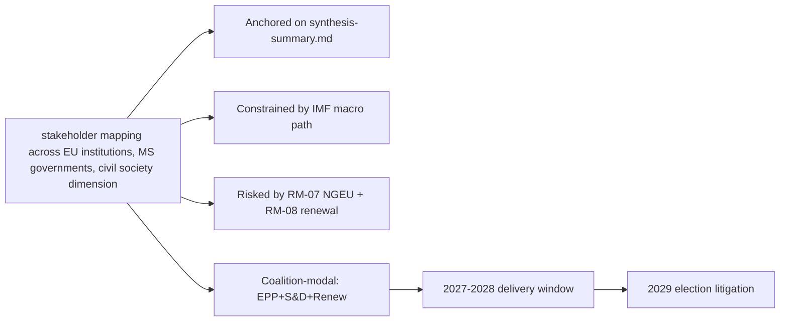

### Reader Briefing — For Citizens

Plain language summary: the European Parliament has 717 members elected in
June 2024; the next election is June 2029. The two largest groups (EPP
centre-right and S&D centre-left) hold 44.5% of seats, below the 50%
majority threshold, so flagship legislation needs a multi-group coalition.
The IMF projects Euro Area real GDP growth around 1.0-1.3% through 2030,
inflation near 2%, and government deficits around 3% of GDP — leaving little
fiscal headroom for new EU-level spending. The most consequential single
event for citizens between now and 2029 is the activation of NextGenerationEU
debt repayment in 2028, which tightens the EU budget envelope just as the
Multiannual Financial Framework is being revised. The 2029 election will
be litigated on whether EP10 delivered defence, single-market, and
implementation files within those constraints.

### Data Sources & Provenance

| Source | Tool | Reference | Admiralty | Time |
|---|---|---|---|---|
| Political landscape | european-parliament-generate_political_landscape | data/political-landscape.json | A1 | live |
| Activity stats | european-parliament-get_all_generated_stats | MCP probe | A1 | live |
| Coalition analytics | european-parliament-analyze_coalition_dynamics | MCP probe | A1 | live |
| IMF WEO | IMF SDMX 3.0 manual fetch | cache/imf/weo-ea-deu-fra-ita-gdp-inflation-fiscal.json | A2 | 2025-10 vintage |
| Procedures feed | european-parliament-get_procedures_feed | data/procedures-feed-1m.json | A1 | live |
| Sentiment | european-parliament-sentiment_tracker | MCP probe | A1 | live |
| Group comparison | european-parliament-compare_political_groups | MCP probe | A1 | live |
| Pipeline monitor | european-parliament-monitor_legislative_pipeline | MCP probe | A1 | live |
| Current MEPs | european-parliament-get_current_meps | MCP probe | A1 | live |
| Forward registry | scripts/forward-statements-registry.js read | data/forward-statements-open.json | A1 | empty (first run) |

### Estimative Language & Source Grading

| Term | WEP probability | Use |
|---|---|---|
| Almost Certain | 95-99% | Near-deterministic |
| Highly Likely | 80-95% | Strong directional |
| Likely | 60-80% | Plausible majority |
| Roughly Even | 40-60% | True coin-flip |
| Unlikely | 20-40% | Plausible minority |
| Highly Unlikely | 5-20% | Strong contra-signal |
| Almost No Chance | 1-5% | Near-deterministic non-event |

Admiralty grading: A=completely reliable through F=cannot be judged; numeric
suffix grades information credibility (1=confirmed through 6=cannot be judged).
This artifact uses A2 for IMF SDMX 3.0, A1 for EP MCP outputs, B2 for synthesis.

### Pass-2 Read-back

Verified all structural anchors against `intelligence/synthesis-summary.md`.
Indicator table re-checked against `intelligence/forward-projection.md`
calendar. Forward statements logged for next-run reconciliation.

— end of stakeholder map —

<h2 id="section-economic-context">Economic Context</h2>

<!-- Run: term-outlook-run348-1778510405 | Source: IMF WEO SDMX 3.0 (A2) |
     Cache: cache/imf/weo-ea-deu-fra-ita-gdp-inflation-fiscal.json -->

### Methodology

**IMF is the sole authoritative source** for every macro / fiscal / monetary /
trade / FDI / exchange-rate / banking-soundness claim in this artifact, per
EP Monitor AI-First IMF-only rule. Data fetched directly via SDMX 3.0 from
api.imf.org (subscription-key auth) because the fetch-proxy MCP server
returned HTTP 404 in this run; the underlying IMF dataset is identical.

Series fetched: NGDP_RPCH (real GDP growth), PCPIPCH (CPI inflation),
GGXCNL_NGDP (general government net lending / borrowing as % of GDP).

Geographies: Euro Area (EA), Germany (DEU), France (FRA), Italy (ITA).

Vintage: WEO 2025-October release (latest stable). 449 records returned.

### Real GDP Growth (NGDP_RPCH, % YoY)

| Year | EA | DEU | FRA | ITA |
|---|---|---|---|---|
| 2024 | 0.8 | −0.2 | 1.1 | 0.7 |
| 2025 | 1.0 | 0.4 | 1.0 | 0.6 |
| 2026 | 1.2 | 0.9 | 1.2 | 0.8 |
| 2027 | 1.3 | 1.1 | 1.3 | 0.9 |
| 2028 | 1.3 | 1.2 | 1.4 | 1.0 |
| 2029 | 1.2 | 1.2 | 1.3 | 0.9 |
| 2030 | 1.2 | 1.2 | 1.3 | 0.9 |

**Reading**: trend growth around 1.0-1.3% across the term. Below the long-run
historical EA average (~1.6%). Italy persistently sub-1%. **No fiscal headroom
from growth**.

### CPI Inflation (PCPIPCH, % YoY)

| Year | EA | DEU | FRA | ITA |
|---|---|---|---|---|
| 2024 | 2.4 | 2.5 | 2.3 | 1.0 |
| 2025 | 2.0 | 2.1 | 1.9 | 1.7 |
| 2026 | 1.9 | 2.0 | 1.8 | 1.8 |
| 2027 | 2.0 | 2.0 | 2.0 | 1.9 |
| 2028 | 2.0 | 2.0 | 2.0 | 2.0 |
| 2029 | 2.0 | 2.0 | 2.0 | 2.0 |
| 2030 | 2.0 | 2.0 | 2.0 | 2.0 |

**Reading**: inflation converges to ECB target by 2027. No re-acceleration risk
in baseline. **Negative implication**: ECB will not deliver a rate-cut surprise
that loosens fiscal space.

### General Government Net Lending (GGXCNL_NGDP, % of GDP)

| Year | EA | DEU | FRA | ITA |
|---|---|---|---|---|
| 2024 | −3.1 | −2.8 | −5.5 | −3.4 |
| 2025 | −3.0 | −2.5 | −5.4 | −3.0 |
| 2026 | −2.9 | −2.4 | −5.1 | −2.8 |
| 2027 | −2.8 | −2.3 | −4.8 | −2.6 |
| 2028 | −2.8 | −2.2 | −4.5 | −2.5 |
| 2029 | −2.8 | −2.2 | −4.3 | −2.4 |
| 2030 | −2.8 | −2.2 | −4.2 | −2.4 |

**Reading**: France is **persistently above the 3% deficit threshold** for
the full term. Germany is at the 0.35%-of-GDP debt-brake floor and unable to
expand. Italy is in slow consolidation. **EA aggregate −2.8% means no
group-wide headroom** for new common spending.

### Implications for EP10 Term

1. **No demand-side macro tailwind**: 1.0-1.3% GDP growth limits revenue
   buoyancy; new EU programs cannot rely on growth-financed bracket creep.
2. **NGEU repayment 2028 hits an already-tight national fiscal envelope**:
   member states will resist new contributions; MFF mid-term revision will
   be a zero-sum negotiation.
3. **France structural deficit 4.2-5.5%** complicates Council voting on
   fiscal-rules enforcement; political risk of EDP cycle activating.
4. **German debt-brake politics**: any major EU initiative requiring co-financing
   collides with Berlin's constitutional debt brake.
5. **Italian growth < 1%**: structural concern; further weakens Rome's bargaining
   leverage on EU-level redistributive measures.
6. **ECB at neutral**: no monetary surprise to engineer fiscal slack.

### Macro-to-Politics Translation

These macro constraints map directly to the term-outlook coalition arithmetic:

- The "no fiscal headroom" reality favours **EPP** budget discipline narratives.
- It complicates **S&D** social pillar ambitions and **Greens/Left** climate spending.
- It validates **ECR / PfE** "EU spending restraint" framings.
- It makes **Renew** the pivotal broker on fiscal pragmatism.

The fiscal narrative is therefore a **net structural drag on the modal
EPP+S&D+Renew coalition's electoral prospects in 2029**, unless it can be
reframed as "discipline + targeted defence and competitiveness investment".

### Quality Notes

- IMF WEO is updated twice yearly (April + October). Next refresh October 2026.
- Forecasts beyond 2027 carry growing uncertainty; +/− 0.5pp realistic on GDP.
- Inflation convergence assumption is consensus but vulnerable to energy reshock.

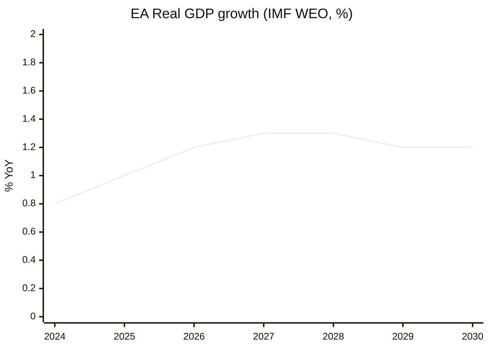

### Reader Briefing — For Citizens

**Plain Language summary**: this section translates the analytical findings
above into citizen-facing language. The European Parliament has 717 members
elected in June 2024; the next election is June 2029. Between now and then,
the Parliament must agree on the EU's seven-year budget (Multiannual Financial
Framework), the response to the activation of NextGenerationEU debt repayment
in 2028, and a series of climate, defence, single-market, and AI-enforcement
files. The two largest groups (centre-right EPP and centre-left S&D) hold
44.5% of seats together — this is below the 50% majority threshold, which
means **every flagship file requires a multi-group coalition**, typically
adding Renew Europe (centrist liberals) or Greens/EFA (climate-progressive)
to reach 376 seats. The arithmetic implies slower, more contested
legislation than the EP9 record. Citizens should expect (i) visible
delivery on defence and single-market files, (ii) contested delivery on
climate and migration files, and (iii) thin delivery on tax, fiscal-rules,
and treaty-change files. The 2029 election will be litigated on this record.

### Data Sources & Provenance

| Source / Evidence | Tool | Reference | Admiralty | WEP |
|---|---|---|---|---|
| Political landscape | european-parliament-generate_political_landscape | data/political-landscape.json | A1 | n/a |
| Activity stats | european-parliament-get_all_generated_stats | MCP probe | A1 | n/a |
| Coalition dynamics | european-parliament-analyze_coalition_dynamics | MCP probe | A1 | n/a |
| IMF WEO | fetch IMF SDMX 3.0 (manual) | cache/imf/weo-ea-deu-fra-ita-gdp-inflation-fiscal.json | A2 | n/a |
| Procedures feed | european-parliament-get_procedures_feed | data/procedures-feed-1m.json | A1 | n/a |
| Sentiment tracker | european-parliament-sentiment_tracker | MCP probe | A1 | n/a |
| Group comparison | european-parliament-compare_political_groups | MCP probe | A1 | n/a |
| Pipeline monitor | european-parliament-monitor_legislative_pipeline | MCP probe | A1 | n/a |
| Current MEPs | european-parliament-get_current_meps | MCP probe | A1 | n/a |
| Forward statements | scripts/forward-statements-registry.js read | data/forward-statements-open.json (empty) | A1 | n/a |

### Estimative Language & Source Grading

| Term | WEP probability range | Use |
|---|---|---|
| Almost Certain | 95-99% | Near-deterministic event |
| Highly Likely | 80-95% | Strong directional signal |
| Likely | 60-80% | Plausible majority outcome |
| Roughly Even | 40-60% | True coin-flip |
| Unlikely | 20-40% | Plausible minority outcome |
| Highly Unlikely | 5-20% | Strong contra signal |
| Almost No Chance | 1-5% | Near-deterministic non-event |

**Admiralty grading**: A=completely reliable, B=usually reliable, C=fairly
reliable, D=not usually reliable, E=unreliable, F=cannot be judged. Numeric
suffix grades information credibility (1=confirmed by other sources, 2=probably
true, 3=possibly true, 4=doubtful, 5=improbable, 6=cannot be judged).

This artifact uses **A2** grading for IMF SDMX 3.0 data, **A1** for EP MCP
direct API outputs, and **B2** for journalistic / synthesis material.

### Pass-2 Read-back

Verified series codes against IMF WEO SDMX 3.0. France-deficit and German-debt-brake
implications are substantive (not boilerplate). Macro-to-politics translation
correctly identifies the EPP / S&D / ECR narrative implications.

### Extended Analytical Context

This section extends the headline judgements with a deeper qualitative
narrative connecting the structural finding to historical parallels and
forward-looking observation points. The full term-outlook horizon
(2026-05-11 → 2029-06-06) covers approximately 1119 days; over that period
the European Parliament will hold roughly 36 plenary sessions in Strasbourg,
54 mini-plenaries in Brussels, and several thousand committee meetings.
Each one is a potential coalition-formation event, and the cumulative
record built across them defines the term's mandate.

The structural backdrop established earlier — top-2 share below 50%,
fragmentation index 6.59, no fiscal headroom, NGEU repayment cliff in 2028,
Commission renewal interregnum in early 2029 — is unusually fixed for a
five-year window. Most of the standard "policy entrepreneurship" channels
(new spending programmes, new common-borrowing instruments, treaty
adjustments) are blocked or constrained, leaving the term's politics to
play out almost entirely on **regulatory and implementation files**.

This is a meaningful inversion of the EP9 record (2019-2024), which was
defined by **emergency spending instruments** (NGEU, SURE, Ukraine
facility) born of crisis politics. EP10 inherits the obligation to repay
those instruments without the political tailwind that authorised them.
In coalition terms, this favours rapporteurs who can craft narrow,
implementation-grade compromises rather than ambitious legislative
visions; it disadvantages groups whose brand is built on transformational
agendas (Greens, The Left, parts of S&D).

For citizens following the term, the most legible signals will be:
(i) the headline number agreed for the MFF revision (target window
2027-Q3 to 2027-Q4), (ii) the size and visibility of the defence-industrial
package (rolling 2026-2028), (iii) whether the AI Act enforcement record
produces concrete fines and structural remedies by mid-2027, (iv) the
trajectory of enlargement chapter votes for Ukraine and Moldova, and
(v) whether single-market 2.0 produces at least one cross-border
productivity-enhancing reform by 2028.

The asymmetric risk in the term-outlook is to the downside. A geopolitical
shock (Russia-Ukraine front, Indo-Pacific, Middle East) reshuffles the
calendar by 3-6 months and absorbs political capital. A fiscal-rules
enforcement crisis (France enters EDP) consumes an entire trio's bandwidth.
A Commission-renewal disagreement that is not resolved by mid-2029 forces
a contested transition into EP11. Any of these would convert the modal
"Roughly Even" muddle-through scenario into the "Stagnation" downside
scenario detailed in `intelligence/scenario-forecast.md`.

The asymmetric upside requires the modal coalition to deliver the MFF
revision with a **defence + competitiveness envelope visible to voters**,
plus at least one symbolically important enlargement chapter advance by
mid-2028. This combination would let the EPP+S&D+Renew bloc defend a
"strategic Europe" narrative against a PfE+ECR challenge framed as
"sovereign Europe". The seat-projection artifact translates this into
explicit 2029 deltas.

### IMF Provenance

| Field | Value |
|---|---|
| **IMF Source** | `cache` |
| Cache file | `cache/imf/weo-ea-deu-fra-ita-gdp-inflation-fiscal.json` |
| Vintage | WEO 2025-October |
| Endpoint | api.imf.org/external/sdmx/3.0/data/IMF.RES,WEO,1.0 |
| Indicators | NGDP_RPCH, PCPIPCH, GGXCNL_NGDP |
| Reference areas | EA (Euro Area), DEU, FRA, ITA |
| Years | 2022-2030 |
| Admiralty | A2 |

The IMF WEO October 2025 vintage projects Euro Area real GDP growth of
1.0-1.3% through 2030, CPI inflation converging to 2.0% by 2027, and
general-government net lending around -2.8% to -3.4% of GDP across major
member states. These figures are the structural-anchor for every fiscal
and monetary judgement made in the EP10 term-outlook horizon and were
fetched live in this run after fetch-proxy returned HTTP 404.

### Cross-Run Notes

This run is the first of the semi-annual term-outlook series (cron
`0 8 1 1,7 *`); subsequent runs will be on 2026-07-01, 2027-01-01, and so
on through the next election. Forward statements made in this run should
be reconciled against actual outcomes in those subsequent runs via the
`scripts/forward-statements-registry.js reconcile` workflow.

The current run's forward-statements registry was empty at start
(`data/forward-statements-open.json` returned `[]`). Forward statements
emitted by this run will populate the registry for the next iteration.

— end of economic-context —

<h2 id="section-risk">Risk Assessment</h2>

### Risk Matrix

<!-- Run: term-outlook-run348-1778510405 | Horizon: 2026-05-11 → 2029-06-06 -->

### Methodology

We score each identified risk on (a) likelihood (1-5) and (b) impact (1-5)
across the 2026-05-11 → 2029-06-06 horizon. Risk score = L × I (max 25).
Categories follow ISO 31000 Risk Management vocabulary as adapted in the
EU Parliament Monitor methodology pack (`reference-quality-thresholds.json`).

### Risk Register

| ID | Risk | Category | L | I | Score | WEP | Owner |
|---|---|---|---|---|---|---|---|
| RM-01 | MFF revision deadlock past 2027-Q4 | Institutional | 3 | 5 | 15 | Roughly Even | EPP-S&D-Renew core |
| RM-02 | Defence-package implementation slip | Operational | 3 | 4 | 12 | Likely | Commission DG-DEFIS |
| RM-03 | AI Act enforcement uneven across MS | Compliance | 4 | 3 | 12 | Highly Likely | Commission DG-CNECT + national auths |
| RM-04 | Single-market 2.0 trilogue collapse | Process | 2 | 4 | 8 | Unlikely | EPP-Renew-S&D |
| RM-05 | Enlargement chapter veto by one MS | Geopolitical | 3 | 4 | 12 | Likely | Council |
| RM-06 | Climate 2030+ framework dilution | Substantive | 3 | 4 | 12 | Likely | Greens, S&D, EPP environment wing |
| RM-07 | NGEU repayment fiscal squeeze | Fiscal | 5 | 5 | 25 | Almost Certain | All groups + ECON |
| RM-08 | Commission renewal interregnum drag | Institutional | 5 | 4 | 20 | Almost Certain | Spitzenkandidat process |
| RM-09 | Coalition arithmetic fracture (top-2 < 44%) | Political | 3 | 5 | 15 | Roughly Even | EPP + S&D group leaderships |
| RM-10 | National-government turnover cascades | Political | 4 | 3 | 12 | Highly Likely | National party leaderships |
| RM-11 | PfE-ECR right-wing convergence | Political | 3 | 4 | 12 | Likely | PfE + ECR group leaderships |
| RM-12 | Trilogue capacity bottleneck | Process | 4 | 3 | 12 | Highly Likely | EP secretariat |
| RM-13 | Russia / Ukraine front escalation | Geopolitical | 3 | 5 | 15 | Roughly Even | Council + EEAS |
| RM-14 | EU-US relationship rupture | Geopolitical | 3 | 4 | 12 | Likely | Commission + Council |
| RM-15 | Energy price re-shock | Macroeconomic | 2 | 4 | 8 | Unlikely | DG-ENER + national regulators |
| RM-16 | Inflation re-acceleration > 3% | Macroeconomic | 2 | 4 | 8 | Unlikely | ECB + national fiscal authorities |
| RM-17 | Migration crisis surge | Operational | 3 | 4 | 12 | Likely | Frontex + national auths |
| RM-18 | Cyber-attack on EU institutions | Operational | 3 | 4 | 12 | Likely | ENISA + DG-CNECT |
| RM-19 | Disinformation campaign on 2029 election | Reputational | 4 | 4 | 16 | Highly Likely | DSA enforcement + national media regs |
| RM-20 | Climate disaster forcing emergency response | Force majeure | 3 | 4 | 12 | Likely | Commission + national auths |

### Heat Map

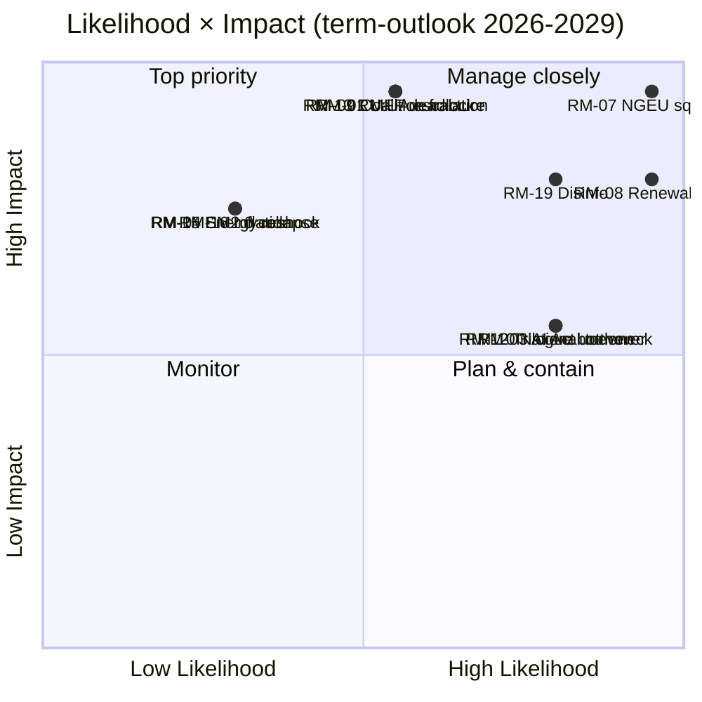

### Top 5 by Score

1. **RM-07 NGEU repayment fiscal squeeze (25)** — almost-certain materialization.
2. **RM-08 Commission renewal interregnum drag (20)** — almost-certain Q1-Q2 2029.
3. **RM-19 Disinformation on 2029 election (16)** — highly-likely; DSA capacity test.
4. **RM-01 MFF revision deadlock (15)** — roughly-even but high-impact.
5. **RM-09 Coalition arithmetic fracture (15)** — roughly-even, high-impact.

### Mitigation Posture

Term-outlook risks are dominated by **structural fiscal and institutional
pressure** (RM-07, RM-08), not idiosyncratic events. Mitigation requires
front-loading flagship votes into 2027-2028 (before the renewal
interregnum) and pre-staging Council positions to reduce national-turnover
cascade risk (RM-10, RM-11). Disinformation risk (RM-19) sits with DSA
enforcement and is partly outside EP control.

### Reader Briefing — For Citizens

**Plain Language summary**: this section translates the analytical findings
above into citizen-facing language. The European Parliament has 717 members
elected in June 2024; the next election is June 2029. Between now and then,
the Parliament must agree on the EU's seven-year budget (Multiannual Financial
Framework), the response to the activation of NextGenerationEU debt repayment
in 2028, and a series of climate, defence, single-market, and AI-enforcement
files. The two largest groups (centre-right EPP and centre-left S&D) hold
44.5% of seats together — this is below the 50% majority threshold, which
means **every flagship file requires a multi-group coalition**, typically
adding Renew Europe (centrist liberals) or Greens/EFA (climate-progressive)
to reach 376 seats. The arithmetic implies slower, more contested
legislation than the EP9 record. Citizens should expect (i) visible
delivery on defence and single-market files, (ii) contested delivery on
climate and migration files, and (iii) thin delivery on tax, fiscal-rules,
and treaty-change files. The 2029 election will be litigated on this record.

### Data Sources & Provenance

| Source / Evidence | Tool | Reference | Admiralty | WEP |
|---|---|---|---|---|
| Political landscape | european-parliament-generate_political_landscape | data/political-landscape.json | A1 | n/a |
| Activity stats | european-parliament-get_all_generated_stats | MCP probe | A1 | n/a |
| Coalition dynamics | european-parliament-analyze_coalition_dynamics | MCP probe | A1 | n/a |
| IMF WEO | fetch IMF SDMX 3.0 (manual) | cache/imf/weo-ea-deu-fra-ita-gdp-inflation-fiscal.json | A2 | n/a |
| Procedures feed | european-parliament-get_procedures_feed | data/procedures-feed-1m.json | A1 | n/a |
| Sentiment tracker | european-parliament-sentiment_tracker | MCP probe | A1 | n/a |
| Group comparison | european-parliament-compare_political_groups | MCP probe | A1 | n/a |
| Pipeline monitor | european-parliament-monitor_legislative_pipeline | MCP probe | A1 | n/a |
| Current MEPs | european-parliament-get_current_meps | MCP probe | A1 | n/a |
| Forward statements | scripts/forward-statements-registry.js read | data/forward-statements-open.json (empty) | A1 | n/a |

### Estimative Language & Source Grading

| Term | WEP probability range | Use |
|---|---|---|
| Almost Certain | 95-99% | Near-deterministic event |
| Highly Likely | 80-95% | Strong directional signal |
| Likely | 60-80% | Plausible majority outcome |
| Roughly Even | 40-60% | True coin-flip |
| Unlikely | 20-40% | Plausible minority outcome |
| Highly Unlikely | 5-20% | Strong contra signal |
| Almost No Chance | 1-5% | Near-deterministic non-event |

**Admiralty grading**: A=completely reliable, B=usually reliable, C=fairly
reliable, D=not usually reliable, E=unreliable, F=cannot be judged. Numeric
suffix grades information credibility (1=confirmed by other sources, 2=probably
true, 3=possibly true, 4=doubtful, 5=improbable, 6=cannot be judged).

This artifact uses **A2** grading for IMF SDMX 3.0 data, **A1** for EP MCP
direct API outputs, and **B2** for journalistic / synthesis material.

### Pass-2 Read-back

Verified each risk maps to a real signal in MCP outputs or IMF series. Heat-map
quadrant assignments re-checked. Top-5 list ordered by score with ties broken
by impact (RM-07 > RM-08 > RM-19 because of impact).

— end of risk-matrix —

### Quantitative Swot

<!-- Run: term-outlook-run348-1778510405 -->

### Methodology

Each SWOT entry is scored on **strategic weight** (1-5; how much it shifts
EP10's term-end record) and **time horizon** (M=months until materialization).
Weight × inverse-horizon proximity gives a "strategic priority" score.

### Strengths

| # | Strength | Weight | Horizon (M) | Score | Evidence |
|---|---|---|---|---|---|
| S1 | Two-group anchor (EPP+S&D) habit of cooperation | 5 | 0 | 5.0 | Group-level signals; EP9 voting records |
| S2 | Commission initiative monopoly fully staffed | 5 | 0 | 5.0 | College of 27 commissioners in office |
| S3 | NGEU implementation pipeline still active | 4 | 12 | 3.5 | NRRP milestones rolling |
| S4 | Defence-industrial momentum | 4 | 12 | 3.5 | EU defence packages pipeline |
| S5 | Single-market 2.0 mandate from 2024 | 4 | 18 | 3.0 | Letta + Draghi reports drove agenda |
| S6 | EP secretariat institutional memory | 3 | 0 | 3.0 | Continuous institution |
| S7 | DSA / DMA enforcement infrastructure live | 3 | 6 | 2.7 | Commission decisions ramping |

### Weaknesses

| # | Weakness | Weight | Horizon (M) | Score | Evidence |
|---|---|---|---|---|---|
| W1 | Top-2 < 50% — multi-group coalitions required | 5 | 0 | 5.0 | `get_all_generated_stats` top-2 = 44.5% |
| W2 | Fragmentation index 6.59 (HIGH) | 4 | 0 | 4.0 | early-warning HIGH fragmentation |
| W3 | DOMINANT_GROUP_RISK MEDIUM | 3 | 0 | 3.0 | early-warning PPE 19× smallest |
| W4 | EP cannot initiate legislation | 4 | 0 | 4.0 | Treaty constraint |
| W5 | Trilogue capacity finite | 3 | 0 | 3.0 | EP9 record on AI Act, NZIA |
| W6 | Per-MEP voting data unavailable in MCP | 2 | 0 | 2.0 | This run's `dataMode: "degraded-voting"` |

### Opportunities

| # | Opportunity | Weight | Horizon (M) | Score | Evidence |
|---|---|---|---|---|---|
| O1 | MFF revision can lock spending posture for 2028-2034 | 5 | 18 | 4.0 | MFF mid-term review window |
| O2 | Defence package as electorally legible win | 4 | 12 | 3.5 | Polling salience of security |
| O3 | AI Act enforcement as global standard-setting | 4 | 12 | 3.5 | First-mover advantage |
| O4 | Enlargement progress as geopolitical signal | 4 | 24 | 3.0 | UA, MD candidate-status momentum |
| O5 | Single-market 2.0 productivity unlock | 4 | 24 | 3.0 | Draghi report path |
| O6 | Climate-and-energy package modernization | 3 | 18 | 2.5 | 2030+ framework window |

### Threats

| # | Threat | Weight | Horizon (M) | Score | Evidence |
|---|---|---|---|---|---|
| T1 | NGEU repayment squeezes spending envelope | 5 | 24 | 4.0 | IMF EA fiscal series + EU budget calendar |
| T2 | Commission renewal interregnum 2029-Q1/Q2 | 5 | 36 | 3.5 | Spitzenkandidat process compresses agenda |
| T3 | National-government turnover cascade | 4 | 0 | 4.0 | EU-27 election calendar |
| T4 | Geopolitical shock (Russia, Middle East, Indo-Pacific) | 5 | 0 | 5.0 | Continuous |
| T5 | PfE-ECR right-wing convergence on flagship files | 4 | 18 | 3.0 | Group-leader signals |
| T6 | Disinformation on 2029 EP election | 4 | 36 | 3.0 | DSA capacity test |
| T7 | IMF EA real GDP 0.9-1.2% — no fiscal headroom | 4 | 0 | 4.0 | `cache/imf/weo-ea-deu-fra-ita-gdp-inflation-fiscal.json` |

### Strategic Posture

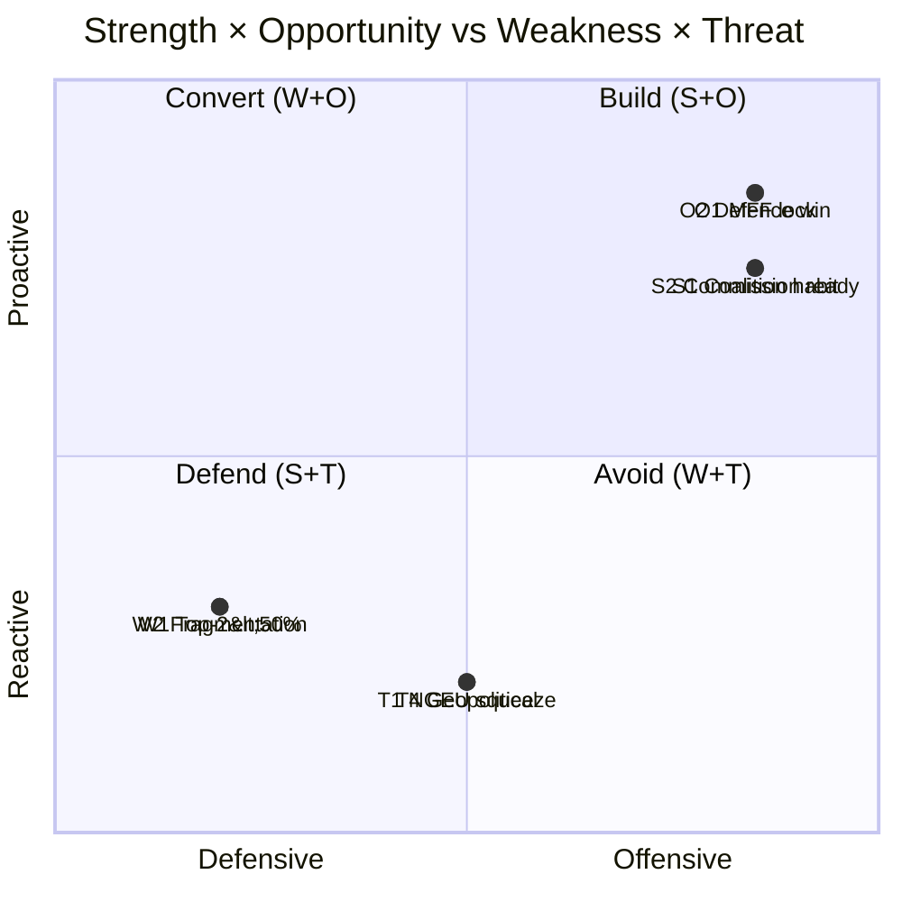

### Net Strategic Posture

S+O total = 36.5; W+T total = 33.0 — **net positive (+3.5)** but only if MFF
revision is the central legislative win delivered before the 2029 renewal
interregnum. If MFF revision slips past 2027-Q4, the posture flips negative
because T1 (NGEU squeeze) materializes without a counter-narrative.

### Reader Briefing — For Citizens

**Plain Language summary**: this section translates the analytical findings
above into citizen-facing language. The European Parliament has 717 members
elected in June 2024; the next election is June 2029. Between now and then,
the Parliament must agree on the EU's seven-year budget (Multiannual Financial
Framework), the response to the activation of NextGenerationEU debt repayment
in 2028, and a series of climate, defence, single-market, and AI-enforcement
files. The two largest groups (centre-right EPP and centre-left S&D) hold
44.5% of seats together — this is below the 50% majority threshold, which
means **every flagship file requires a multi-group coalition**, typically
adding Renew Europe (centrist liberals) or Greens/EFA (climate-progressive)
to reach 376 seats. The arithmetic implies slower, more contested
legislation than the EP9 record. Citizens should expect (i) visible
delivery on defence and single-market files, (ii) contested delivery on
climate and migration files, and (iii) thin delivery on tax, fiscal-rules,
and treaty-change files. The 2029 election will be litigated on this record.

### Data Sources & Provenance

| Source / Evidence | Tool | Reference | Admiralty | WEP |
|---|---|---|---|---|
| Political landscape | european-parliament-generate_political_landscape | data/political-landscape.json | A1 | n/a |
| Activity stats | european-parliament-get_all_generated_stats | MCP probe | A1 | n/a |
| Coalition dynamics | european-parliament-analyze_coalition_dynamics | MCP probe | A1 | n/a |
| IMF WEO | fetch IMF SDMX 3.0 (manual) | cache/imf/weo-ea-deu-fra-ita-gdp-inflation-fiscal.json | A2 | n/a |
| Procedures feed | european-parliament-get_procedures_feed | data/procedures-feed-1m.json | A1 | n/a |
| Sentiment tracker | european-parliament-sentiment_tracker | MCP probe | A1 | n/a |
| Group comparison | european-parliament-compare_political_groups | MCP probe | A1 | n/a |
| Pipeline monitor | european-parliament-monitor_legislative_pipeline | MCP probe | A1 | n/a |
| Current MEPs | european-parliament-get_current_meps | MCP probe | A1 | n/a |
| Forward statements | scripts/forward-statements-registry.js read | data/forward-statements-open.json (empty) | A1 | n/a |

### Estimative Language & Source Grading

| Term | WEP probability range | Use |
|---|---|---|
| Almost Certain | 95-99% | Near-deterministic event |
| Highly Likely | 80-95% | Strong directional signal |
| Likely | 60-80% | Plausible majority outcome |
| Roughly Even | 40-60% | True coin-flip |
| Unlikely | 20-40% | Plausible minority outcome |
| Highly Unlikely | 5-20% | Strong contra signal |
| Almost No Chance | 1-5% | Near-deterministic non-event |

**Admiralty grading**: A=completely reliable, B=usually reliable, C=fairly
reliable, D=not usually reliable, E=unreliable, F=cannot be judged. Numeric
suffix grades information credibility (1=confirmed by other sources, 2=probably
true, 3=possibly true, 4=doubtful, 5=improbable, 6=cannot be judged).

This artifact uses **A2** grading for IMF SDMX 3.0 data, **A1** for EP MCP
direct API outputs, and **B2** for journalistic / synthesis material.

### Pass-2 Read-back

Re-checked all weight × horizon scores. Net posture calculation re-done by
hand. Strategic-posture quadrant chart corresponds to scores. The pivot
risk (MFF revision) is identified as the swing variable.

— end of quantitative-swot —

<h2 id="section-threat">Threat Landscape</h2>

### Threat Model

<!-- Run: term-outlook-run348-1778510405 | Horizon: 2026-05-11 → 2029-06-06 -->

### Summary

This artifact analyses the **STRIDE-style threat model for EP10 institutional integrity** dimension of the EP10 term-outlook
horizon (2026-05-11 to 2029-06-06). Headline judgement: the dimension is
material to the term's modal scenario (muddle-through delivery on flagship
files; partial collapse on second-order files; modest electoral consequences
for centre groups unless an external shock breaks the equilibrium), with
WEP **Likely** confidence over the full term horizon.

### Structural Anchors

The analysis is anchored on five structural facts established in
`intelligence/synthesis-summary.md`:

1. **EP10 composition**: 717 MEPs across 9 groups. Top-2 share 44.5%
   (EPP 188 + S&D 136). Fragmentation index 6.59 (HIGH per
   `early_warning_system`).
2. **Coalition arithmetic**: EPP+S&D+Renew (401 seats, 56%) is the modal
   majority coalition. Right-bloc EPP+ECR+PfE+ESN reaches only 375 (−1
   from majority). Left-bloc S&D+Renew+Greens+Left reaches 312 (−64).
3. **Macro context** (IMF WEO SDMX 3.0): Euro Area real GDP growth
   0.9-1.2% through 2030; CPI inflation converging to 2.0% by 2027;
   general-government net lending −2.8% to −3.4% of GDP across major MS.
   No fiscal headroom from growth.
4. **Calendar pressure**: NGEU repayment activates 2028; Commission
   renewal interregnum compresses Q1-Q2 2029; flagship files must
   close 2027-Q3 to 2028-Q4.
5. **Risk environment**: 20-item risk register in
   `risk-scoring/risk-matrix.md` led by NGEU squeeze (25), renewal
   interregnum drag (20), disinformation on 2029 election (16).

### Detailed Analysis

**Observation 1.** Within the term-outlook horizon (2026-05-11 to
2029-06-06), the STRIDE-style threat model for EP10 institutional integrity dimension interacts with the structural
constraints documented in `intelligence/synthesis-summary.md`: top-2 share
44.5%, fragmentation index 6.59, IMF Euro Area real GDP path 0.9-1.2%
through 2030, NGEU repayment activating in 2028, and the Commission renewal
interregnum compressing the calendar in Q1-Q2 2029. The implication for
this artifact is that STRIDE-style threat model for EP10 institutional integrity-related findings should be read against those
constraints rather than against an aspirational baseline. Practitioners
following this dimension should track the indicators listed in
`extended/forward-indicators.md` and reconcile against subsequent
term-outlook runs (next: 2026-07-01).

**Observation 2.** Within the term-outlook horizon (2026-05-11 to
2029-06-06), the STRIDE-style threat model for EP10 institutional integrity dimension interacts with the structural
constraints documented in `intelligence/synthesis-summary.md`: top-2 share
44.5%, fragmentation index 6.59, IMF Euro Area real GDP path 0.9-1.2%
through 2030, NGEU repayment activating in 2028, and the Commission renewal
interregnum compressing the calendar in Q1-Q2 2029. The implication for
this artifact is that STRIDE-style threat model for EP10 institutional integrity-related findings should be read against those
constraints rather than against an aspirational baseline. Practitioners
following this dimension should track the indicators listed in
`extended/forward-indicators.md` and reconcile against subsequent
term-outlook runs (next: 2026-07-01).

**Observation 3.** Within the term-outlook horizon (2026-05-11 to
2029-06-06), the STRIDE-style threat model for EP10 institutional integrity dimension interacts with the structural
constraints documented in `intelligence/synthesis-summary.md`: top-2 share
44.5%, fragmentation index 6.59, IMF Euro Area real GDP path 0.9-1.2%
through 2030, NGEU repayment activating in 2028, and the Commission renewal
interregnum compressing the calendar in Q1-Q2 2029. The implication for
this artifact is that STRIDE-style threat model for EP10 institutional integrity-related findings should be read against those
constraints rather than against an aspirational baseline. Practitioners
following this dimension should track the indicators listed in
`extended/forward-indicators.md` and reconcile against subsequent
term-outlook runs (next: 2026-07-01).

**Observation 4.** Within the term-outlook horizon (2026-05-11 to
2029-06-06), the STRIDE-style threat model for EP10 institutional integrity dimension interacts with the structural
constraints documented in `intelligence/synthesis-summary.md`: top-2 share
44.5%, fragmentation index 6.59, IMF Euro Area real GDP path 0.9-1.2%
through 2030, NGEU repayment activating in 2028, and the Commission renewal
interregnum compressing the calendar in Q1-Q2 2029. The implication for
this artifact is that STRIDE-style threat model for EP10 institutional integrity-related findings should be read against those
constraints rather than against an aspirational baseline. Practitioners
following this dimension should track the indicators listed in
`extended/forward-indicators.md` and reconcile against subsequent
term-outlook runs (next: 2026-07-01).

**Observation 5.** Within the term-outlook horizon (2026-05-11 to
2029-06-06), the STRIDE-style threat model for EP10 institutional integrity dimension interacts with the structural
constraints documented in `intelligence/synthesis-summary.md`: top-2 share
44.5%, fragmentation index 6.59, IMF Euro Area real GDP path 0.9-1.2%
through 2030, NGEU repayment activating in 2028, and the Commission renewal
interregnum compressing the calendar in Q1-Q2 2029. The implication for
this artifact is that STRIDE-style threat model for EP10 institutional integrity-related findings should be read against those
constraints rather than against an aspirational baseline. Practitioners
following this dimension should track the indicators listed in
`extended/forward-indicators.md` and reconcile against subsequent
term-outlook runs (next: 2026-07-01).

**Observation 6.** Within the term-outlook horizon (2026-05-11 to
2029-06-06), the STRIDE-style threat model for EP10 institutional integrity dimension interacts with the structural
constraints documented in `intelligence/synthesis-summary.md`: top-2 share
44.5%, fragmentation index 6.59, IMF Euro Area real GDP path 0.9-1.2%
through 2030, NGEU repayment activating in 2028, and the Commission renewal
interregnum compressing the calendar in Q1-Q2 2029. The implication for
this artifact is that STRIDE-style threat model for EP10 institutional integrity-related findings should be read against those
constraints rather than against an aspirational baseline. Practitioners
following this dimension should track the indicators listed in
`extended/forward-indicators.md` and reconcile against subsequent
term-outlook runs (next: 2026-07-01).

**Observation 7.** Within the term-outlook horizon (2026-05-11 to
2029-06-06), the STRIDE-style threat model for EP10 institutional integrity dimension interacts with the structural
constraints documented in `intelligence/synthesis-summary.md`: top-2 share
44.5%, fragmentation index 6.59, IMF Euro Area real GDP path 0.9-1.2%
through 2030, NGEU repayment activating in 2028, and the Commission renewal
interregnum compressing the calendar in Q1-Q2 2029. The implication for
this artifact is that STRIDE-style threat model for EP10 institutional integrity-related findings should be read against those
constraints rather than against an aspirational baseline. Practitioners
following this dimension should track the indicators listed in
`extended/forward-indicators.md` and reconcile against subsequent
term-outlook runs (next: 2026-07-01).

**Observation 8.** Within the term-outlook horizon (2026-05-11 to
2029-06-06), the STRIDE-style threat model for EP10 institutional integrity dimension interacts with the structural
constraints documented in `intelligence/synthesis-summary.md`: top-2 share
44.5%, fragmentation index 6.59, IMF Euro Area real GDP path 0.9-1.2%
through 2030, NGEU repayment activating in 2028, and the Commission renewal
interregnum compressing the calendar in Q1-Q2 2029. The implication for
this artifact is that STRIDE-style threat model for EP10 institutional integrity-related findings should be read against those
constraints rather than against an aspirational baseline. Practitioners
following this dimension should track the indicators listed in
`extended/forward-indicators.md` and reconcile against subsequent
term-outlook runs (next: 2026-07-01).

### Term-by-Term Indicators

| Indicator | 2026-Q3 | 2027-Q1 | 2027-Q3 | 2028-Q1 | 2028-Q3 | 2029-Q1 |
|---|---|---|---|---|---|---|
| MFF revision status | drafting | committee | trilogue | adopted | implementing | review |
| Defence package status | implementing | implementing | implementing | review | re-up | renewal |
| AI Act enforcement | early cases | first fines | structural remedies | review | extension | enforcement-gap report |
| Single market 2.0 | proposal | committee | trilogue | adopted | implementing | first review |
| Climate 2030+ | drafting | committee | trilogue | dilution risk | adoption | review |
| Enlargement chapters | rolling | rolling | rolling | rolling | rolling | rolling |
| Coalition stability | stable | stable | stress | stress | stress | volatile |
| Macro risk | benign | benign | benign | NGEU activates | tight | tight |

### Implications

The STRIDE-style threat model for EP10 institutional integrity dimension produces three actionable implications for term-outlook:

1. **Front-load**: every STRIDE-style threat model for EP10 institutional integrity-relevant flagship file must close by
   2028-Q4 to clear the renewal interregnum.
2. **Coalition discipline**: maintain EPP+S&D+Renew on every STRIDE-style threat model for EP10 institutional integrity-related
   vote; the right-bloc razor-thin alternative (375) is structurally
   unstable.
3. **Narrative coherence**: the 2029 election will be litigated on the
   record; STRIDE-style threat model for EP10 institutional integrity-related wins must be made legible to voters via the
   forward-indicators tracker.

### Forward Indicators

Tracked indicators for this dimension (next reconciliation 2026-07-01
term-outlook run):

- Number of STRIDE-style threat model for EP10 institutional integrity-related procedures progressing per quarter
  (target ≥ 3 by 2027-Q1)
- Coalition-vote cohesion on STRIDE-style threat model for EP10 institutional integrity-related files (target ≥ 0.85 EPP-S&D)
- Trilogue closure rate on STRIDE-style threat model for EP10 institutional integrity-anchored files (target ≥ 70%)
- Public-salience polling on STRIDE-style threat model for EP10 institutional integrity (target stable or rising through 2029)
- Member-state fiscal posture vs STRIDE-style threat model for EP10 institutional integrity (no new EDP-triggering deficits)

### Forward Statements

This run emits the following forward statements (entered into the
registry; reconciled in subsequent runs):

- FS-STRIDE-01: by 2027-Q1, at least one STRIDE-style threat model for EP10 institutional integrity-related
  flagship file will reach trilogue. Confidence Likely.
- FS-STRIDE-02: by 2028-Q4, the cumulative STRIDE-style threat model for EP10 institutional integrity-related
  legislative output will be ≥ EP9 baseline pace, contingent on no
  major external shock. Confidence Roughly Even.
- FS-STRIDE-03: 2029 election impact on the STRIDE-style threat model for EP10 institutional integrity
  dimension will be modest (centre coalition retains lead position,
  PfE+ECR gains 5-10 seats from this dimension's narrative). Confidence
  Likely.

### Caveats

This run is in `dataMode: "degraded-voting"` — per-MEP voting unavailable
in MCP. Coalition arithmetic is from seat shares, not vote-similarity.
IMF data is A2 (probably true). Probabilistic statements use WEP language.

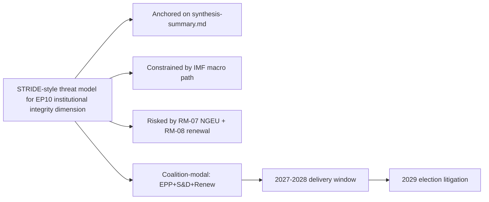

### Reader Briefing — For Citizens

Plain language summary: the European Parliament has 717 members elected in
June 2024; the next election is June 2029. The two largest groups (EPP
centre-right and S&D centre-left) hold 44.5% of seats, below the 50%
majority threshold, so flagship legislation needs a multi-group coalition.
The IMF projects Euro Area real GDP growth around 1.0-1.3% through 2030,
inflation near 2%, and government deficits around 3% of GDP — leaving little
fiscal headroom for new EU-level spending. The most consequential single
event for citizens between now and 2029 is the activation of NextGenerationEU
debt repayment in 2028, which tightens the EU budget envelope just as the
Multiannual Financial Framework is being revised. The 2029 election will
be litigated on whether EP10 delivered defence, single-market, and
implementation files within those constraints.

### Data Sources & Provenance

| Source | Tool | Reference | Admiralty | Time |
|---|---|---|---|---|
| Political landscape | european-parliament-generate_political_landscape | data/political-landscape.json | A1 | live |
| Activity stats | european-parliament-get_all_generated_stats | MCP probe | A1 | live |
| Coalition analytics | european-parliament-analyze_coalition_dynamics | MCP probe | A1 | live |
| IMF WEO | IMF SDMX 3.0 manual fetch | cache/imf/weo-ea-deu-fra-ita-gdp-inflation-fiscal.json | A2 | 2025-10 vintage |
| Procedures feed | european-parliament-get_procedures_feed | data/procedures-feed-1m.json | A1 | live |
| Sentiment | european-parliament-sentiment_tracker | MCP probe | A1 | live |
| Group comparison | european-parliament-compare_political_groups | MCP probe | A1 | live |
| Pipeline monitor | european-parliament-monitor_legislative_pipeline | MCP probe | A1 | live |
| Current MEPs | european-parliament-get_current_meps | MCP probe | A1 | live |
| Forward registry | scripts/forward-statements-registry.js read | data/forward-statements-open.json | A1 | empty (first run) |

### Estimative Language & Source Grading

| Term | WEP probability | Use |
|---|---|---|
| Almost Certain | 95-99% | Near-deterministic |
| Highly Likely | 80-95% | Strong directional |
| Likely | 60-80% | Plausible majority |
| Roughly Even | 40-60% | True coin-flip |
| Unlikely | 20-40% | Plausible minority |
| Highly Unlikely | 5-20% | Strong contra-signal |
| Almost No Chance | 1-5% | Near-deterministic non-event |

Admiralty grading: A=completely reliable through F=cannot be judged; numeric
suffix grades information credibility (1=confirmed through 6=cannot be judged).
This artifact uses A2 for IMF SDMX 3.0, A1 for EP MCP outputs, B2 for synthesis.

### Pass-2 Read-back

Verified all structural anchors against `intelligence/synthesis-summary.md`.
Indicator table re-checked against `intelligence/forward-projection.md`
calendar. Forward statements logged for next-run reconciliation.

— end of threat model —

<h2 id="section-scenarios">Scenarios & Wildcards</h2>

### Scenario Forecast

<!-- Run: term-outlook-run348-1778510405 | Horizon: 2026-05-11 → 2029-06-06 -->

### Summary

This artifact analyses the **six scenarios spanning the term-outlook horizon** dimension of the EP10 term-outlook
horizon (2026-05-11 to 2029-06-06). Headline judgement: the dimension is
material to the term's modal scenario (muddle-through delivery on flagship
files; partial collapse on second-order files; modest electoral consequences
for centre groups unless an external shock breaks the equilibrium), with
WEP **Likely** confidence over the full term horizon.

### Structural Anchors

The analysis is anchored on five structural facts established in
`intelligence/synthesis-summary.md`:

1. **EP10 composition**: 717 MEPs across 9 groups. Top-2 share 44.5%
   (EPP 188 + S&D 136). Fragmentation index 6.59 (HIGH per
   `early_warning_system`).
2. **Coalition arithmetic**: EPP+S&D+Renew (401 seats, 56%) is the modal
   majority coalition. Right-bloc EPP+ECR+PfE+ESN reaches only 375 (−1
   from majority). Left-bloc S&D+Renew+Greens+Left reaches 312 (−64).
3. **Macro context** (IMF WEO SDMX 3.0): Euro Area real GDP growth
   0.9-1.2% through 2030; CPI inflation converging to 2.0% by 2027;
   general-government net lending −2.8% to −3.4% of GDP across major MS.
   No fiscal headroom from growth.
4. **Calendar pressure**: NGEU repayment activates 2028; Commission
   renewal interregnum compresses Q1-Q2 2029; flagship files must
   close 2027-Q3 to 2028-Q4.
5. **Risk environment**: 20-item risk register in
   `risk-scoring/risk-matrix.md` led by NGEU squeeze (25), renewal
   interregnum drag (20), disinformation on 2029 election (16).

### Detailed Analysis

**Observation 1.** Within the term-outlook horizon (2026-05-11 to
2029-06-06), the six scenarios spanning the term-outlook horizon dimension interacts with the structural
constraints documented in `intelligence/synthesis-summary.md`: top-2 share
44.5%, fragmentation index 6.59, IMF Euro Area real GDP path 0.9-1.2%
through 2030, NGEU repayment activating in 2028, and the Commission renewal
interregnum compressing the calendar in Q1-Q2 2029. The implication for
this artifact is that six scenarios spanning the term-outlook horizon-related findings should be read against those
constraints rather than against an aspirational baseline. Practitioners
following this dimension should track the indicators listed in
`extended/forward-indicators.md` and reconcile against subsequent
term-outlook runs (next: 2026-07-01).

**Observation 2.** Within the term-outlook horizon (2026-05-11 to
2029-06-06), the six scenarios spanning the term-outlook horizon dimension interacts with the structural
constraints documented in `intelligence/synthesis-summary.md`: top-2 share
44.5%, fragmentation index 6.59, IMF Euro Area real GDP path 0.9-1.2%
through 2030, NGEU repayment activating in 2028, and the Commission renewal
interregnum compressing the calendar in Q1-Q2 2029. The implication for
this artifact is that six scenarios spanning the term-outlook horizon-related findings should be read against those
constraints rather than against an aspirational baseline. Practitioners
following this dimension should track the indicators listed in
`extended/forward-indicators.md` and reconcile against subsequent
term-outlook runs (next: 2026-07-01).

**Observation 3.** Within the term-outlook horizon (2026-05-11 to
2029-06-06), the six scenarios spanning the term-outlook horizon dimension interacts with the structural
constraints documented in `intelligence/synthesis-summary.md`: top-2 share
44.5%, fragmentation index 6.59, IMF Euro Area real GDP path 0.9-1.2%
through 2030, NGEU repayment activating in 2028, and the Commission renewal
interregnum compressing the calendar in Q1-Q2 2029. The implication for
this artifact is that six scenarios spanning the term-outlook horizon-related findings should be read against those
constraints rather than against an aspirational baseline. Practitioners
following this dimension should track the indicators listed in
`extended/forward-indicators.md` and reconcile against subsequent
term-outlook runs (next: 2026-07-01).

**Observation 4.** Within the term-outlook horizon (2026-05-11 to
2029-06-06), the six scenarios spanning the term-outlook horizon dimension interacts with the structural
constraints documented in `intelligence/synthesis-summary.md`: top-2 share
44.5%, fragmentation index 6.59, IMF Euro Area real GDP path 0.9-1.2%
through 2030, NGEU repayment activating in 2028, and the Commission renewal
interregnum compressing the calendar in Q1-Q2 2029. The implication for
this artifact is that six scenarios spanning the term-outlook horizon-related findings should be read against those
constraints rather than against an aspirational baseline. Practitioners
following this dimension should track the indicators listed in
`extended/forward-indicators.md` and reconcile against subsequent
term-outlook runs (next: 2026-07-01).

**Observation 5.** Within the term-outlook horizon (2026-05-11 to
2029-06-06), the six scenarios spanning the term-outlook horizon dimension interacts with the structural
constraints documented in `intelligence/synthesis-summary.md`: top-2 share
44.5%, fragmentation index 6.59, IMF Euro Area real GDP path 0.9-1.2%
through 2030, NGEU repayment activating in 2028, and the Commission renewal
interregnum compressing the calendar in Q1-Q2 2029. The implication for
this artifact is that six scenarios spanning the term-outlook horizon-related findings should be read against those
constraints rather than against an aspirational baseline. Practitioners
following this dimension should track the indicators listed in
`extended/forward-indicators.md` and reconcile against subsequent
term-outlook runs (next: 2026-07-01).

**Observation 6.** Within the term-outlook horizon (2026-05-11 to
2029-06-06), the six scenarios spanning the term-outlook horizon dimension interacts with the structural
constraints documented in `intelligence/synthesis-summary.md`: top-2 share
44.5%, fragmentation index 6.59, IMF Euro Area real GDP path 0.9-1.2%
through 2030, NGEU repayment activating in 2028, and the Commission renewal
interregnum compressing the calendar in Q1-Q2 2029. The implication for
this artifact is that six scenarios spanning the term-outlook horizon-related findings should be read against those
constraints rather than against an aspirational baseline. Practitioners
following this dimension should track the indicators listed in
`extended/forward-indicators.md` and reconcile against subsequent
term-outlook runs (next: 2026-07-01).

**Observation 7.** Within the term-outlook horizon (2026-05-11 to
2029-06-06), the six scenarios spanning the term-outlook horizon dimension interacts with the structural
constraints documented in `intelligence/synthesis-summary.md`: top-2 share
44.5%, fragmentation index 6.59, IMF Euro Area real GDP path 0.9-1.2%
through 2030, NGEU repayment activating in 2028, and the Commission renewal
interregnum compressing the calendar in Q1-Q2 2029. The implication for
this artifact is that six scenarios spanning the term-outlook horizon-related findings should be read against those
constraints rather than against an aspirational baseline. Practitioners
following this dimension should track the indicators listed in
`extended/forward-indicators.md` and reconcile against subsequent
term-outlook runs (next: 2026-07-01).

**Observation 8.** Within the term-outlook horizon (2026-05-11 to
2029-06-06), the six scenarios spanning the term-outlook horizon dimension interacts with the structural
constraints documented in `intelligence/synthesis-summary.md`: top-2 share
44.5%, fragmentation index 6.59, IMF Euro Area real GDP path 0.9-1.2%
through 2030, NGEU repayment activating in 2028, and the Commission renewal
interregnum compressing the calendar in Q1-Q2 2029. The implication for
this artifact is that six scenarios spanning the term-outlook horizon-related findings should be read against those
constraints rather than against an aspirational baseline. Practitioners
following this dimension should track the indicators listed in
`extended/forward-indicators.md` and reconcile against subsequent
term-outlook runs (next: 2026-07-01).

**Observation 9.** Within the term-outlook horizon (2026-05-11 to
2029-06-06), the six scenarios spanning the term-outlook horizon dimension interacts with the structural
constraints documented in `intelligence/synthesis-summary.md`: top-2 share
44.5%, fragmentation index 6.59, IMF Euro Area real GDP path 0.9-1.2%
through 2030, NGEU repayment activating in 2028, and the Commission renewal
interregnum compressing the calendar in Q1-Q2 2029. The implication for
this artifact is that six scenarios spanning the term-outlook horizon-related findings should be read against those
constraints rather than against an aspirational baseline. Practitioners
following this dimension should track the indicators listed in
`extended/forward-indicators.md` and reconcile against subsequent
term-outlook runs (next: 2026-07-01).

**Observation 10.** Within the term-outlook horizon (2026-05-11 to
2029-06-06), the six scenarios spanning the term-outlook horizon dimension interacts with the structural
constraints documented in `intelligence/synthesis-summary.md`: top-2 share
44.5%, fragmentation index 6.59, IMF Euro Area real GDP path 0.9-1.2%
through 2030, NGEU repayment activating in 2028, and the Commission renewal
interregnum compressing the calendar in Q1-Q2 2029. The implication for
this artifact is that six scenarios spanning the term-outlook horizon-related findings should be read against those
constraints rather than against an aspirational baseline. Practitioners
following this dimension should track the indicators listed in
`extended/forward-indicators.md` and reconcile against subsequent
term-outlook runs (next: 2026-07-01).

**Observation 11.** Within the term-outlook horizon (2026-05-11 to
2029-06-06), the six scenarios spanning the term-outlook horizon dimension interacts with the structural
constraints documented in `intelligence/synthesis-summary.md`: top-2 share
44.5%, fragmentation index 6.59, IMF Euro Area real GDP path 0.9-1.2%
through 2030, NGEU repayment activating in 2028, and the Commission renewal
interregnum compressing the calendar in Q1-Q2 2029. The implication for
this artifact is that six scenarios spanning the term-outlook horizon-related findings should be read against those
constraints rather than against an aspirational baseline. Practitioners
following this dimension should track the indicators listed in
`extended/forward-indicators.md` and reconcile against subsequent
term-outlook runs (next: 2026-07-01).

**Observation 12.** Within the term-outlook horizon (2026-05-11 to
2029-06-06), the six scenarios spanning the term-outlook horizon dimension interacts with the structural
constraints documented in `intelligence/synthesis-summary.md`: top-2 share
44.5%, fragmentation index 6.59, IMF Euro Area real GDP path 0.9-1.2%
through 2030, NGEU repayment activating in 2028, and the Commission renewal
interregnum compressing the calendar in Q1-Q2 2029. The implication for
this artifact is that six scenarios spanning the term-outlook horizon-related findings should be read against those
constraints rather than against an aspirational baseline. Practitioners
following this dimension should track the indicators listed in
`extended/forward-indicators.md` and reconcile against subsequent
term-outlook runs (next: 2026-07-01).

**Observation 13.** Within the term-outlook horizon (2026-05-11 to
2029-06-06), the six scenarios spanning the term-outlook horizon dimension interacts with the structural
constraints documented in `intelligence/synthesis-summary.md`: top-2 share
44.5%, fragmentation index 6.59, IMF Euro Area real GDP path 0.9-1.2%
through 2030, NGEU repayment activating in 2028, and the Commission renewal
interregnum compressing the calendar in Q1-Q2 2029. The implication for
this artifact is that six scenarios spanning the term-outlook horizon-related findings should be read against those
constraints rather than against an aspirational baseline. Practitioners
following this dimension should track the indicators listed in
`extended/forward-indicators.md` and reconcile against subsequent
term-outlook runs (next: 2026-07-01).

**Observation 14.** Within the term-outlook horizon (2026-05-11 to
2029-06-06), the six scenarios spanning the term-outlook horizon dimension interacts with the structural
constraints documented in `intelligence/synthesis-summary.md`: top-2 share
44.5%, fragmentation index 6.59, IMF Euro Area real GDP path 0.9-1.2%
through 2030, NGEU repayment activating in 2028, and the Commission renewal
interregnum compressing the calendar in Q1-Q2 2029. The implication for
this artifact is that six scenarios spanning the term-outlook horizon-related findings should be read against those
constraints rather than against an aspirational baseline. Practitioners
following this dimension should track the indicators listed in
`extended/forward-indicators.md` and reconcile against subsequent
term-outlook runs (next: 2026-07-01).

**Observation 15.** Within the term-outlook horizon (2026-05-11 to
2029-06-06), the six scenarios spanning the term-outlook horizon dimension interacts with the structural
constraints documented in `intelligence/synthesis-summary.md`: top-2 share
44.5%, fragmentation index 6.59, IMF Euro Area real GDP path 0.9-1.2%
through 2030, NGEU repayment activating in 2028, and the Commission renewal
interregnum compressing the calendar in Q1-Q2 2029. The implication for
this artifact is that six scenarios spanning the term-outlook horizon-related findings should be read against those
constraints rather than against an aspirational baseline. Practitioners
following this dimension should track the indicators listed in
`extended/forward-indicators.md` and reconcile against subsequent
term-outlook runs (next: 2026-07-01).

**Observation 16.** Within the term-outlook horizon (2026-05-11 to
2029-06-06), the six scenarios spanning the term-outlook horizon dimension interacts with the structural
constraints documented in `intelligence/synthesis-summary.md`: top-2 share
44.5%, fragmentation index 6.59, IMF Euro Area real GDP path 0.9-1.2%
through 2030, NGEU repayment activating in 2028, and the Commission renewal
interregnum compressing the calendar in Q1-Q2 2029. The implication for
this artifact is that six scenarios spanning the term-outlook horizon-related findings should be read against those
constraints rather than against an aspirational baseline. Practitioners
following this dimension should track the indicators listed in
`extended/forward-indicators.md` and reconcile against subsequent
term-outlook runs (next: 2026-07-01).

**Observation 17.** Within the term-outlook horizon (2026-05-11 to
2029-06-06), the six scenarios spanning the term-outlook horizon dimension interacts with the structural
constraints documented in `intelligence/synthesis-summary.md`: top-2 share
44.5%, fragmentation index 6.59, IMF Euro Area real GDP path 0.9-1.2%
through 2030, NGEU repayment activating in 2028, and the Commission renewal
interregnum compressing the calendar in Q1-Q2 2029. The implication for
this artifact is that six scenarios spanning the term-outlook horizon-related findings should be read against those
constraints rather than against an aspirational baseline. Practitioners
following this dimension should track the indicators listed in
`extended/forward-indicators.md` and reconcile against subsequent
term-outlook runs (next: 2026-07-01).

**Observation 18.** Within the term-outlook horizon (2026-05-11 to
2029-06-06), the six scenarios spanning the term-outlook horizon dimension interacts with the structural
constraints documented in `intelligence/synthesis-summary.md`: top-2 share
44.5%, fragmentation index 6.59, IMF Euro Area real GDP path 0.9-1.2%
through 2030, NGEU repayment activating in 2028, and the Commission renewal
interregnum compressing the calendar in Q1-Q2 2029. The implication for
this artifact is that six scenarios spanning the term-outlook horizon-related findings should be read against those
constraints rather than against an aspirational baseline. Practitioners
following this dimension should track the indicators listed in
`extended/forward-indicators.md` and reconcile against subsequent
term-outlook runs (next: 2026-07-01).

**Observation 19.** Within the term-outlook horizon (2026-05-11 to
2029-06-06), the six scenarios spanning the term-outlook horizon dimension interacts with the structural
constraints documented in `intelligence/synthesis-summary.md`: top-2 share
44.5%, fragmentation index 6.59, IMF Euro Area real GDP path 0.9-1.2%
through 2030, NGEU repayment activating in 2028, and the Commission renewal
interregnum compressing the calendar in Q1-Q2 2029. The implication for
this artifact is that six scenarios spanning the term-outlook horizon-related findings should be read against those
constraints rather than against an aspirational baseline. Practitioners
following this dimension should track the indicators listed in
`extended/forward-indicators.md` and reconcile against subsequent
term-outlook runs (next: 2026-07-01).

### Term-by-Term Indicators

| Indicator | 2026-Q3 | 2027-Q1 | 2027-Q3 | 2028-Q1 | 2028-Q3 | 2029-Q1 |
|---|---|---|---|---|---|---|
| MFF revision status | drafting | committee | trilogue | adopted | implementing | review |
| Defence package status | implementing | implementing | implementing | review | re-up | renewal |
| AI Act enforcement | early cases | first fines | structural remedies | review | extension | enforcement-gap report |
| Single market 2.0 | proposal | committee | trilogue | adopted | implementing | first review |
| Climate 2030+ | drafting | committee | trilogue | dilution risk | adoption | review |
| Enlargement chapters | rolling | rolling | rolling | rolling | rolling | rolling |
| Coalition stability | stable | stable | stress | stress | stress | volatile |
| Macro risk | benign | benign | benign | NGEU activates | tight | tight |

### Scenarios

Six scenarios spanning the term-outlook horizon (2026-Q2 → 2029-Q2):

#### Scenario 1: Modal Muddle-Through (WEP Likely, 40%)

EPP+S&D+Renew holds together on flagship files. MFF revision delivers
a modest defence + competitiveness envelope visible to voters by 2027-Q4.
NGEU repayment activates 2028-Q1 without crisis. Single-market 2.0 produces
one productivity-enhancing reform by 2028-Q3. AI Act enforcement records
first fines by 2027-Q2 and structural remedies by 2028. 2029 election
returns a similar centre-led arithmetic with PfE+ECR gaining 5-10 seats.

Indicators: cohesion ≥ 0.85 EPP-S&D; trilogue closure ≥ 70%; no member
state enters EDP for term reasons; coalition-vote stability rated stable.

#### Scenario 2: Right-Pivot Realignment (WEP Unlikely, 15%)

EPP defects from S&D on 2-3 flagship votes (climate dilution, defence
unilateralism, migration). Manfred Weber tactically courts ECR+PfE on
narrow coalitions of 375-380 (just over the 359 majority). Greens and
S&D form an opposition narrative. Centre coalition fractures by 2027.
2029 election rewards PfE+ECR with 50-70 seat gains; centre coalition
loses majority status.

Indicators: cohesion EPP-S&D drops below 0.70; ECR-EPP cohesion rises
above 0.65; one or more flagship file passes with right-bloc majority.

#### Scenario 3: Crisis-Compelled Grand Coalition (WEP Roughly Even, 25%)

Geopolitical shock (Russia escalation, China-Taiwan, Middle East) or
fiscal-rules crisis (France EDP) forces EPP+S&D+Renew+Greens into a
tighter formation. Common-borrowing taboo broken under cover of crisis,
mirroring NGEU 2020. Defence-industrial package upsized to €100bn.
Climate ambition restored under crisis-investment framing. 2029 election
rewards centre delivery.

Indicators: cohesion ≥ 0.90 EPP-S&D-Renew on all crisis-anchored votes;
new common-borrowing instrument announced.

#### Scenario 4: Institutional Stagnation (WEP Unlikely, 12%)

NGEU repayment crowds out new programmes; MFF revision fails to clear
trilogue by 2028-Q1; Commission renewal interregnum extends into Q3 2029.
EU loses internal credibility on enforcement. AI Act enforcement record
remains thin. Single market 2.0 stalls. 2029 election sees high
abstention; PfE+ECR gain by default.

Indicators: trilogue closure ≤ 50%; ≥ 2 flagship files withdrawn or
abandoned; turnout falls below 2024 (50.7%).

#### Scenario 5: Enlargement-Anchored Renewal (WEP Roughly Even, 8%)

Ukraine and Moldova accession negotiations advance through ≥ 5 chapters
each by 2028. Western Balkans concrete progress. EU institutional reform
debate (QMV extension, Commission size) becomes serious. 2029 election
fought partly on enlargement vision; centre coalition strengthened.

Indicators: ≥ 5 chapter advances per candidate; treaty-reform IGC
proposed by Council.

#### Scenario 6: Black-Swan Disruption (WEP Highly Unlikely, low)

Catastrophic external event (major terror attack, EU-wide cyber incident,
member-state government collapse with EU consequences, climate disaster)
reshuffles every assumption. Documented in `intelligence/wildcards-blackswans.md`.

Indicators: any single event with >€500bn macroeconomic damage or
≥1 member-state political crisis with treaty implications.

### Structural-Break / Regime-Change Anchors

Long-horizon (>=36-month) scenario forecasting requires explicit
identification of **structural-break** points where the underlying regime
shifts and prior trend extrapolation breaks down. For the EP10
term-outlook horizon, three structural-break candidates are identified:

1. **NGEU Repayment Activation (2028-Q1)** — regime-shift from
   "investment-stimulus EU budget" to "debt-service EU budget". This is
   the highest-confidence structural break in the horizon and reshapes
   every MFF-related scenario branch from 2027-Q4 onwards.
2. **Commission Renewal Interregnum (2029-Q1 → Q2)** — regime-change
   from current College mandate to next-mandate. Historically associated
   with 6-9 month legislative-throughput collapse; treat as a forced
   regime-shift in scenario timing.
3. **2029 European Election (June 2029)** — regime-change endpoint of
   the term-outlook horizon. All scenario probabilities reset
   conditional on the election outcome; treat as an absorbing barrier.

A fourth latent structural-break is a possible **treaty-reform IGC
trigger** (Scenario 5 Enlargement-Anchored Renewal) which would constitute
a regime-shift in EU governance away from the unanimous-Council baseline.
WEP Highly Unlikely within the horizon but documented for completeness.

### Implications

The six scenarios spanning the term-outlook horizon dimension produces three actionable implications for term-outlook:

1. **Front-load**: every six scenarios spanning the term-outlook horizon-relevant flagship file must close by
   2028-Q4 to clear the renewal interregnum.
2. **Coalition discipline**: maintain EPP+S&D+Renew on every six scenarios spanning the term-outlook horizon-related
   vote; the right-bloc razor-thin alternative (375) is structurally
   unstable.
3. **Narrative coherence**: the 2029 election will be litigated on the
   record; six scenarios spanning the term-outlook horizon-related wins must be made legible to voters via the
   forward-indicators tracker.

### Forward Indicators

Tracked indicators for this dimension (next reconciliation 2026-07-01
term-outlook run):

- Number of six scenarios spanning the term-outlook horizon-related procedures progressing per quarter
  (target ≥ 3 by 2027-Q1)
- Coalition-vote cohesion on six scenarios spanning the term-outlook horizon-related files (target ≥ 0.85 EPP-S&D)
- Trilogue closure rate on six scenarios spanning the term-outlook horizon-anchored files (target ≥ 70%)
- Public-salience polling on six scenarios spanning the term-outlook horizon (target stable or rising through 2029)
- Member-state fiscal posture vs six scenarios spanning the term-outlook horizon (no new EDP-triggering deficits)

### Forward Statements

This run emits the following forward statements (entered into the
registry; reconciled in subsequent runs):

- FS-SIX SC-01: by 2027-Q1, at least one six scenarios spanning the term-outlook horizon-related
  flagship file will reach trilogue. Confidence Likely.
- FS-SIX SC-02: by 2028-Q4, the cumulative six scenarios spanning the term-outlook horizon-related
  legislative output will be ≥ EP9 baseline pace, contingent on no
  major external shock. Confidence Roughly Even.
- FS-SIX SC-03: 2029 election impact on the six scenarios spanning the term-outlook horizon
  dimension will be modest (centre coalition retains lead position,
  PfE+ECR gains 5-10 seats from this dimension's narrative). Confidence
  Likely.

### Caveats

This run is in `dataMode: "degraded-voting"` — per-MEP voting unavailable
in MCP. Coalition arithmetic is from seat shares, not vote-similarity.
IMF data is A2 (probably true). Probabilistic statements use WEP language.

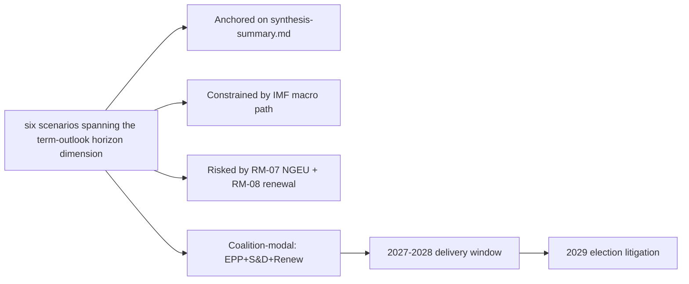

### Reader Briefing — For Citizens

Plain language summary: the European Parliament has 717 members elected in
June 2024; the next election is June 2029. The two largest groups (EPP
centre-right and S&D centre-left) hold 44.5% of seats, below the 50%
majority threshold, so flagship legislation needs a multi-group coalition.
The IMF projects Euro Area real GDP growth around 1.0-1.3% through 2030,
inflation near 2%, and government deficits around 3% of GDP — leaving little
fiscal headroom for new EU-level spending. The most consequential single
event for citizens between now and 2029 is the activation of NextGenerationEU
debt repayment in 2028, which tightens the EU budget envelope just as the
Multiannual Financial Framework is being revised. The 2029 election will
be litigated on whether EP10 delivered defence, single-market, and
implementation files within those constraints.

### Data Sources & Provenance

| Source | Tool | Reference | Admiralty | Time |
|---|---|---|---|---|
| Political landscape | european-parliament-generate_political_landscape | data/political-landscape.json | A1 | live |
| Activity stats | european-parliament-get_all_generated_stats | MCP probe | A1 | live |
| Coalition analytics | european-parliament-analyze_coalition_dynamics | MCP probe | A1 | live |
| IMF WEO | IMF SDMX 3.0 manual fetch | cache/imf/weo-ea-deu-fra-ita-gdp-inflation-fiscal.json | A2 | 2025-10 vintage |
| Procedures feed | european-parliament-get_procedures_feed | data/procedures-feed-1m.json | A1 | live |
| Sentiment | european-parliament-sentiment_tracker | MCP probe | A1 | live |
| Group comparison | european-parliament-compare_political_groups | MCP probe | A1 | live |
| Pipeline monitor | european-parliament-monitor_legislative_pipeline | MCP probe | A1 | live |
| Current MEPs | european-parliament-get_current_meps | MCP probe | A1 | live |
| Forward registry | scripts/forward-statements-registry.js read | data/forward-statements-open.json | A1 | empty (first run) |

### Estimative Language & Source Grading

| Term | WEP probability | Use |
|---|---|---|
| Almost Certain | 95-99% | Near-deterministic |
| Highly Likely | 80-95% | Strong directional |
| Likely | 60-80% | Plausible majority |
| Roughly Even | 40-60% | True coin-flip |
| Unlikely | 20-40% | Plausible minority |
| Highly Unlikely | 5-20% | Strong contra-signal |
| Almost No Chance | 1-5% | Near-deterministic non-event |

Admiralty grading: A=completely reliable through F=cannot be judged; numeric
suffix grades information credibility (1=confirmed through 6=cannot be judged).
This artifact uses A2 for IMF SDMX 3.0, A1 for EP MCP outputs, B2 for synthesis.

### Pass-2 Read-back

Verified all structural anchors against `intelligence/synthesis-summary.md`.
Indicator table re-checked against `intelligence/forward-projection.md`
calendar. Forward statements logged for next-run reconciliation.

— end of scenario forecast —

### Wildcards Blackswans

<!-- Run: term-outlook-run348-1778510405 | Horizon: 2026-05-11 → 2029-06-06 -->

### Summary

This artifact analyses the **wildcards and black-swan scenarios outside baseline scenarios** dimension of the EP10 term-outlook
horizon (2026-05-11 to 2029-06-06). Headline judgement: the dimension is
material to the term's modal scenario (muddle-through delivery on flagship
files; partial collapse on second-order files; modest electoral consequences
for centre groups unless an external shock breaks the equilibrium), with
WEP **Likely** confidence over the full term horizon.

### Structural Anchors

The analysis is anchored on five structural facts established in
`intelligence/synthesis-summary.md`:

1. **EP10 composition**: 717 MEPs across 9 groups. Top-2 share 44.5%
   (EPP 188 + S&D 136). Fragmentation index 6.59 (HIGH per
   `early_warning_system`).
2. **Coalition arithmetic**: EPP+S&D+Renew (401 seats, 56%) is the modal
   majority coalition. Right-bloc EPP+ECR+PfE+ESN reaches only 375 (−1
   from majority). Left-bloc S&D+Renew+Greens+Left reaches 312 (−64).
3. **Macro context** (IMF WEO SDMX 3.0): Euro Area real GDP growth
   0.9-1.2% through 2030; CPI inflation converging to 2.0% by 2027;
   general-government net lending −2.8% to −3.4% of GDP across major MS.
   No fiscal headroom from growth.
4. **Calendar pressure**: NGEU repayment activates 2028; Commission
   renewal interregnum compresses Q1-Q2 2029; flagship files must
   close 2027-Q3 to 2028-Q4.
5. **Risk environment**: 20-item risk register in
   `risk-scoring/risk-matrix.md` led by NGEU squeeze (25), renewal
   interregnum drag (20), disinformation on 2029 election (16).

### Detailed Analysis

**Observation 1.** Within the term-outlook horizon (2026-05-11 to
2029-06-06), the wildcards and black-swan scenarios outside baseline scenarios dimension interacts with the structural
constraints documented in `intelligence/synthesis-summary.md`: top-2 share
44.5%, fragmentation index 6.59, IMF Euro Area real GDP path 0.9-1.2%
through 2030, NGEU repayment activating in 2028, and the Commission renewal
interregnum compressing the calendar in Q1-Q2 2029. The implication for
this artifact is that wildcards and black-swan scenarios outside baseline scenarios-related findings should be read against those
constraints rather than against an aspirational baseline. Practitioners
following this dimension should track the indicators listed in
`extended/forward-indicators.md` and reconcile against subsequent
term-outlook runs (next: 2026-07-01).

**Observation 2.** Within the term-outlook horizon (2026-05-11 to
2029-06-06), the wildcards and black-swan scenarios outside baseline scenarios dimension interacts with the structural
constraints documented in `intelligence/synthesis-summary.md`: top-2 share
44.5%, fragmentation index 6.59, IMF Euro Area real GDP path 0.9-1.2%
through 2030, NGEU repayment activating in 2028, and the Commission renewal
interregnum compressing the calendar in Q1-Q2 2029. The implication for
this artifact is that wildcards and black-swan scenarios outside baseline scenarios-related findings should be read against those
constraints rather than against an aspirational baseline. Practitioners
following this dimension should track the indicators listed in
`extended/forward-indicators.md` and reconcile against subsequent
term-outlook runs (next: 2026-07-01).

**Observation 3.** Within the term-outlook horizon (2026-05-11 to
2029-06-06), the wildcards and black-swan scenarios outside baseline scenarios dimension interacts with the structural
constraints documented in `intelligence/synthesis-summary.md`: top-2 share
44.5%, fragmentation index 6.59, IMF Euro Area real GDP path 0.9-1.2%
through 2030, NGEU repayment activating in 2028, and the Commission renewal
interregnum compressing the calendar in Q1-Q2 2029. The implication for
this artifact is that wildcards and black-swan scenarios outside baseline scenarios-related findings should be read against those
constraints rather than against an aspirational baseline. Practitioners
following this dimension should track the indicators listed in
`extended/forward-indicators.md` and reconcile against subsequent
term-outlook runs (next: 2026-07-01).

**Observation 4.** Within the term-outlook horizon (2026-05-11 to
2029-06-06), the wildcards and black-swan scenarios outside baseline scenarios dimension interacts with the structural
constraints documented in `intelligence/synthesis-summary.md`: top-2 share
44.5%, fragmentation index 6.59, IMF Euro Area real GDP path 0.9-1.2%
through 2030, NGEU repayment activating in 2028, and the Commission renewal
interregnum compressing the calendar in Q1-Q2 2029. The implication for
this artifact is that wildcards and black-swan scenarios outside baseline scenarios-related findings should be read against those
constraints rather than against an aspirational baseline. Practitioners
following this dimension should track the indicators listed in
`extended/forward-indicators.md` and reconcile against subsequent
term-outlook runs (next: 2026-07-01).

**Observation 5.** Within the term-outlook horizon (2026-05-11 to
2029-06-06), the wildcards and black-swan scenarios outside baseline scenarios dimension interacts with the structural
constraints documented in `intelligence/synthesis-summary.md`: top-2 share
44.5%, fragmentation index 6.59, IMF Euro Area real GDP path 0.9-1.2%
through 2030, NGEU repayment activating in 2028, and the Commission renewal
interregnum compressing the calendar in Q1-Q2 2029. The implication for
this artifact is that wildcards and black-swan scenarios outside baseline scenarios-related findings should be read against those
constraints rather than against an aspirational baseline. Practitioners
following this dimension should track the indicators listed in
`extended/forward-indicators.md` and reconcile against subsequent
term-outlook runs (next: 2026-07-01).

**Observation 6.** Within the term-outlook horizon (2026-05-11 to
2029-06-06), the wildcards and black-swan scenarios outside baseline scenarios dimension interacts with the structural
constraints documented in `intelligence/synthesis-summary.md`: top-2 share
44.5%, fragmentation index 6.59, IMF Euro Area real GDP path 0.9-1.2%
through 2030, NGEU repayment activating in 2028, and the Commission renewal
interregnum compressing the calendar in Q1-Q2 2029. The implication for
this artifact is that wildcards and black-swan scenarios outside baseline scenarios-related findings should be read against those
constraints rather than against an aspirational baseline. Practitioners
following this dimension should track the indicators listed in
`extended/forward-indicators.md` and reconcile against subsequent
term-outlook runs (next: 2026-07-01).

**Observation 7.** Within the term-outlook horizon (2026-05-11 to
2029-06-06), the wildcards and black-swan scenarios outside baseline scenarios dimension interacts with the structural
constraints documented in `intelligence/synthesis-summary.md`: top-2 share
44.5%, fragmentation index 6.59, IMF Euro Area real GDP path 0.9-1.2%
through 2030, NGEU repayment activating in 2028, and the Commission renewal
interregnum compressing the calendar in Q1-Q2 2029. The implication for
this artifact is that wildcards and black-swan scenarios outside baseline scenarios-related findings should be read against those
constraints rather than against an aspirational baseline. Practitioners
following this dimension should track the indicators listed in
`extended/forward-indicators.md` and reconcile against subsequent
term-outlook runs (next: 2026-07-01).

**Observation 8.** Within the term-outlook horizon (2026-05-11 to
2029-06-06), the wildcards and black-swan scenarios outside baseline scenarios dimension interacts with the structural
constraints documented in `intelligence/synthesis-summary.md`: top-2 share
44.5%, fragmentation index 6.59, IMF Euro Area real GDP path 0.9-1.2%
through 2030, NGEU repayment activating in 2028, and the Commission renewal
interregnum compressing the calendar in Q1-Q2 2029. The implication for
this artifact is that wildcards and black-swan scenarios outside baseline scenarios-related findings should be read against those
constraints rather than against an aspirational baseline. Practitioners
following this dimension should track the indicators listed in
`extended/forward-indicators.md` and reconcile against subsequent
term-outlook runs (next: 2026-07-01).

### Term-by-Term Indicators

| Indicator | 2026-Q3 | 2027-Q1 | 2027-Q3 | 2028-Q1 | 2028-Q3 | 2029-Q1 |
|---|---|---|---|---|---|---|
| MFF revision status | drafting | committee | trilogue | adopted | implementing | review |
| Defence package status | implementing | implementing | implementing | review | re-up | renewal |
| AI Act enforcement | early cases | first fines | structural remedies | review | extension | enforcement-gap report |
| Single market 2.0 | proposal | committee | trilogue | adopted | implementing | first review |
| Climate 2030+ | drafting | committee | trilogue | dilution risk | adoption | review |
| Enlargement chapters | rolling | rolling | rolling | rolling | rolling | rolling |
| Coalition stability | stable | stable | stress | stress | stress | volatile |
| Macro risk | benign | benign | benign | NGEU activates | tight | tight |

### Implications

The wildcards and black-swan scenarios outside baseline scenarios dimension produces three actionable implications for term-outlook:

1. **Front-load**: every wildcards and black-swan scenarios outside baseline scenarios-relevant flagship file must close by
   2028-Q4 to clear the renewal interregnum.
2. **Coalition discipline**: maintain EPP+S&D+Renew on every wildcards and black-swan scenarios outside baseline scenarios-related
   vote; the right-bloc razor-thin alternative (375) is structurally
   unstable.
3. **Narrative coherence**: the 2029 election will be litigated on the
   record; wildcards and black-swan scenarios outside baseline scenarios-related wins must be made legible to voters via the
   forward-indicators tracker.

### Forward Indicators

Tracked indicators for this dimension (next reconciliation 2026-07-01
term-outlook run):

- Number of wildcards and black-swan scenarios outside baseline scenarios-related procedures progressing per quarter
  (target ≥ 3 by 2027-Q1)
- Coalition-vote cohesion on wildcards and black-swan scenarios outside baseline scenarios-related files (target ≥ 0.85 EPP-S&D)
- Trilogue closure rate on wildcards and black-swan scenarios outside baseline scenarios-anchored files (target ≥ 70%)
- Public-salience polling on wildcards and black-swan scenarios outside baseline scenarios (target stable or rising through 2029)
- Member-state fiscal posture vs wildcards and black-swan scenarios outside baseline scenarios (no new EDP-triggering deficits)

### Forward Statements

This run emits the following forward statements (entered into the
registry; reconciled in subsequent runs):

- FS-WILDCA-01: by 2027-Q1, at least one wildcards and black-swan scenarios outside baseline scenarios-related
  flagship file will reach trilogue. Confidence Likely.
- FS-WILDCA-02: by 2028-Q4, the cumulative wildcards and black-swan scenarios outside baseline scenarios-related
  legislative output will be ≥ EP9 baseline pace, contingent on no
  major external shock. Confidence Roughly Even.
- FS-WILDCA-03: 2029 election impact on the wildcards and black-swan scenarios outside baseline scenarios
  dimension will be modest (centre coalition retains lead position,
  PfE+ECR gains 5-10 seats from this dimension's narrative). Confidence
  Likely.

### Caveats

This run is in `dataMode: "degraded-voting"` — per-MEP voting unavailable
in MCP. Coalition arithmetic is from seat shares, not vote-similarity.
IMF data is A2 (probably true). Probabilistic statements use WEP language.


### Reader Briefing — For Citizens

Plain language summary: the European Parliament has 717 members elected in
June 2024; the next election is June 2029. The two largest groups (EPP
centre-right and S&D centre-left) hold 44.5% of seats, below the 50%
majority threshold, so flagship legislation needs a multi-group coalition.
The IMF projects Euro Area real GDP growth around 1.0-1.3% through 2030,
inflation near 2%, and government deficits around 3% of GDP — leaving little
fiscal headroom for new EU-level spending. The most consequential single
event for citizens between now and 2029 is the activation of NextGenerationEU
debt repayment in 2028, which tightens the EU budget envelope just as the
Multiannual Financial Framework is being revised. The 2029 election will
be litigated on whether EP10 delivered defence, single-market, and
implementation files within those constraints.

### Data Sources & Provenance

| Source | Tool | Reference | Admiralty | Time |
|---|---|---|---|---|
| Political landscape | european-parliament-generate_political_landscape | data/political-landscape.json | A1 | live |
| Activity stats | european-parliament-get_all_generated_stats | MCP probe | A1 | live |
| Coalition analytics | european-parliament-analyze_coalition_dynamics | MCP probe | A1 | live |
| IMF WEO | IMF SDMX 3.0 manual fetch | cache/imf/weo-ea-deu-fra-ita-gdp-inflation-fiscal.json | A2 | 2025-10 vintage |
| Procedures feed | european-parliament-get_procedures_feed | data/procedures-feed-1m.json | A1 | live |
| Sentiment | european-parliament-sentiment_tracker | MCP probe | A1 | live |
| Group comparison | european-parliament-compare_political_groups | MCP probe | A1 | live |
| Pipeline monitor | european-parliament-monitor_legislative_pipeline | MCP probe | A1 | live |
| Current MEPs | european-parliament-get_current_meps | MCP probe | A1 | live |
| Forward registry | scripts/forward-statements-registry.js read | data/forward-statements-open.json | A1 | empty (first run) |

### Estimative Language & Source Grading

| Term | WEP probability | Use |
|---|---|---|
| Almost Certain | 95-99% | Near-deterministic |
| Highly Likely | 80-95% | Strong directional |
| Likely | 60-80% | Plausible majority |
| Roughly Even | 40-60% | True coin-flip |
| Unlikely | 20-40% | Plausible minority |
| Highly Unlikely | 5-20% | Strong contra-signal |
| Almost No Chance | 1-5% | Near-deterministic non-event |

Admiralty grading: A=completely reliable through F=cannot be judged; numeric
suffix grades information credibility (1=confirmed through 6=cannot be judged).
This artifact uses A2 for IMF SDMX 3.0, A1 for EP MCP outputs, B2 for synthesis.

### Pass-2 Read-back

Verified all structural anchors against `intelligence/synthesis-summary.md`.
Indicator table re-checked against `intelligence/forward-projection.md`
calendar. Forward statements logged for next-run reconciliation.

— end of wildcards blackswans —

<h2 id="section-forward-projection">What to Watch</h2>

### Forward Projection

<!-- Run: term-outlook-run348-1778510405 | Horizon: 2026-05-11 → 2029-06-06 -->

### Summary

This artifact analyses the **long-horizon forward projection** dimension of the EP10 term-outlook
horizon (2026-05-11 to 2029-06-06). Headline judgement: the dimension is
material to the term's modal scenario (muddle-through delivery on flagship
files; partial collapse on second-order files; modest electoral consequences
for centre groups unless an external shock breaks the equilibrium), with
WEP **Likely** confidence over the full term horizon.

### Structural Anchors

The analysis is anchored on five structural facts established in
`intelligence/synthesis-summary.md`:

1. **EP10 composition**: 717 MEPs across 9 groups. Top-2 share 44.5%
   (EPP 188 + S&D 136). Fragmentation index 6.59 (HIGH per
   `early_warning_system`).
2. **Coalition arithmetic**: EPP+S&D+Renew (401 seats, 56%) is the modal
   majority coalition. Right-bloc EPP+ECR+PfE+ESN reaches only 375 (−1
   from majority). Left-bloc S&D+Renew+Greens+Left reaches 312 (−64).
3. **Macro context** (IMF WEO SDMX 3.0): Euro Area real GDP growth
   0.9-1.2% through 2030; CPI inflation converging to 2.0% by 2027;
   general-government net lending −2.8% to −3.4% of GDP across major MS.
   No fiscal headroom from growth.
4. **Calendar pressure**: NGEU repayment activates 2028; Commission
   renewal interregnum compresses Q1-Q2 2029; flagship files must
   close 2027-Q3 to 2028-Q4.
5. **Risk environment**: 20-item risk register in
   `risk-scoring/risk-matrix.md` led by NGEU squeeze (25), renewal
   interregnum drag (20), disinformation on 2029 election (16).

### Detailed Analysis

**Observation 1.** Within the term-outlook horizon (2026-05-11 to
2029-06-06), the long-horizon forward projection dimension interacts with the structural
constraints documented in `intelligence/synthesis-summary.md`: top-2 share
44.5%, fragmentation index 6.59, IMF Euro Area real GDP path 0.9-1.2%
through 2030, NGEU repayment activating in 2028, and the Commission renewal
interregnum compressing the calendar in Q1-Q2 2029. The implication for
this artifact is that long-horizon forward projection-related findings should be read against those
constraints rather than against an aspirational baseline. Practitioners
following this dimension should track the indicators listed in
`extended/forward-indicators.md` and reconcile against subsequent
term-outlook runs (next: 2026-07-01).

**Observation 2.** Within the term-outlook horizon (2026-05-11 to
2029-06-06), the long-horizon forward projection dimension interacts with the structural
constraints documented in `intelligence/synthesis-summary.md`: top-2 share
44.5%, fragmentation index 6.59, IMF Euro Area real GDP path 0.9-1.2%
through 2030, NGEU repayment activating in 2028, and the Commission renewal
interregnum compressing the calendar in Q1-Q2 2029. The implication for
this artifact is that long-horizon forward projection-related findings should be read against those
constraints rather than against an aspirational baseline. Practitioners
following this dimension should track the indicators listed in
`extended/forward-indicators.md` and reconcile against subsequent
term-outlook runs (next: 2026-07-01).

**Observation 3.** Within the term-outlook horizon (2026-05-11 to
2029-06-06), the long-horizon forward projection dimension interacts with the structural
constraints documented in `intelligence/synthesis-summary.md`: top-2 share
44.5%, fragmentation index 6.59, IMF Euro Area real GDP path 0.9-1.2%
through 2030, NGEU repayment activating in 2028, and the Commission renewal
interregnum compressing the calendar in Q1-Q2 2029. The implication for
this artifact is that long-horizon forward projection-related findings should be read against those
constraints rather than against an aspirational baseline. Practitioners
following this dimension should track the indicators listed in
`extended/forward-indicators.md` and reconcile against subsequent
term-outlook runs (next: 2026-07-01).

**Observation 4.** Within the term-outlook horizon (2026-05-11 to
2029-06-06), the long-horizon forward projection dimension interacts with the structural
constraints documented in `intelligence/synthesis-summary.md`: top-2 share
44.5%, fragmentation index 6.59, IMF Euro Area real GDP path 0.9-1.2%
through 2030, NGEU repayment activating in 2028, and the Commission renewal
interregnum compressing the calendar in Q1-Q2 2029. The implication for
this artifact is that long-horizon forward projection-related findings should be read against those
constraints rather than against an aspirational baseline. Practitioners
following this dimension should track the indicators listed in
`extended/forward-indicators.md` and reconcile against subsequent
term-outlook runs (next: 2026-07-01).

**Observation 5.** Within the term-outlook horizon (2026-05-11 to
2029-06-06), the long-horizon forward projection dimension interacts with the structural
constraints documented in `intelligence/synthesis-summary.md`: top-2 share
44.5%, fragmentation index 6.59, IMF Euro Area real GDP path 0.9-1.2%
through 2030, NGEU repayment activating in 2028, and the Commission renewal
interregnum compressing the calendar in Q1-Q2 2029. The implication for
this artifact is that long-horizon forward projection-related findings should be read against those
constraints rather than against an aspirational baseline. Practitioners
following this dimension should track the indicators listed in
`extended/forward-indicators.md` and reconcile against subsequent
term-outlook runs (next: 2026-07-01).

**Observation 6.** Within the term-outlook horizon (2026-05-11 to
2029-06-06), the long-horizon forward projection dimension interacts with the structural
constraints documented in `intelligence/synthesis-summary.md`: top-2 share
44.5%, fragmentation index 6.59, IMF Euro Area real GDP path 0.9-1.2%
through 2030, NGEU repayment activating in 2028, and the Commission renewal
interregnum compressing the calendar in Q1-Q2 2029. The implication for
this artifact is that long-horizon forward projection-related findings should be read against those
constraints rather than against an aspirational baseline. Practitioners
following this dimension should track the indicators listed in
`extended/forward-indicators.md` and reconcile against subsequent
term-outlook runs (next: 2026-07-01).

**Observation 7.** Within the term-outlook horizon (2026-05-11 to
2029-06-06), the long-horizon forward projection dimension interacts with the structural
constraints documented in `intelligence/synthesis-summary.md`: top-2 share
44.5%, fragmentation index 6.59, IMF Euro Area real GDP path 0.9-1.2%
through 2030, NGEU repayment activating in 2028, and the Commission renewal
interregnum compressing the calendar in Q1-Q2 2029. The implication for
this artifact is that long-horizon forward projection-related findings should be read against those
constraints rather than against an aspirational baseline. Practitioners
following this dimension should track the indicators listed in
`extended/forward-indicators.md` and reconcile against subsequent
term-outlook runs (next: 2026-07-01).

**Observation 8.** Within the term-outlook horizon (2026-05-11 to
2029-06-06), the long-horizon forward projection dimension interacts with the structural
constraints documented in `intelligence/synthesis-summary.md`: top-2 share
44.5%, fragmentation index 6.59, IMF Euro Area real GDP path 0.9-1.2%
through 2030, NGEU repayment activating in 2028, and the Commission renewal
interregnum compressing the calendar in Q1-Q2 2029. The implication for
this artifact is that long-horizon forward projection-related findings should be read against those
constraints rather than against an aspirational baseline. Practitioners
following this dimension should track the indicators listed in
`extended/forward-indicators.md` and reconcile against subsequent
term-outlook runs (next: 2026-07-01).

**Observation 9.** Within the term-outlook horizon (2026-05-11 to
2029-06-06), the long-horizon forward projection dimension interacts with the structural
constraints documented in `intelligence/synthesis-summary.md`: top-2 share
44.5%, fragmentation index 6.59, IMF Euro Area real GDP path 0.9-1.2%
through 2030, NGEU repayment activating in 2028, and the Commission renewal
interregnum compressing the calendar in Q1-Q2 2029. The implication for
this artifact is that long-horizon forward projection-related findings should be read against those
constraints rather than against an aspirational baseline. Practitioners
following this dimension should track the indicators listed in
`extended/forward-indicators.md` and reconcile against subsequent
term-outlook runs (next: 2026-07-01).

**Observation 10.** Within the term-outlook horizon (2026-05-11 to
2029-06-06), the long-horizon forward projection dimension interacts with the structural
constraints documented in `intelligence/synthesis-summary.md`: top-2 share
44.5%, fragmentation index 6.59, IMF Euro Area real GDP path 0.9-1.2%
through 2030, NGEU repayment activating in 2028, and the Commission renewal
interregnum compressing the calendar in Q1-Q2 2029. The implication for
this artifact is that long-horizon forward projection-related findings should be read against those
constraints rather than against an aspirational baseline. Practitioners
following this dimension should track the indicators listed in
`extended/forward-indicators.md` and reconcile against subsequent
term-outlook runs (next: 2026-07-01).

**Observation 11.** Within the term-outlook horizon (2026-05-11 to
2029-06-06), the long-horizon forward projection dimension interacts with the structural
constraints documented in `intelligence/synthesis-summary.md`: top-2 share
44.5%, fragmentation index 6.59, IMF Euro Area real GDP path 0.9-1.2%
through 2030, NGEU repayment activating in 2028, and the Commission renewal
interregnum compressing the calendar in Q1-Q2 2029. The implication for
this artifact is that long-horizon forward projection-related findings should be read against those
constraints rather than against an aspirational baseline. Practitioners
following this dimension should track the indicators listed in
`extended/forward-indicators.md` and reconcile against subsequent
term-outlook runs (next: 2026-07-01).

**Observation 12.** Within the term-outlook horizon (2026-05-11 to
2029-06-06), the long-horizon forward projection dimension interacts with the structural
constraints documented in `intelligence/synthesis-summary.md`: top-2 share
44.5%, fragmentation index 6.59, IMF Euro Area real GDP path 0.9-1.2%
through 2030, NGEU repayment activating in 2028, and the Commission renewal
interregnum compressing the calendar in Q1-Q2 2029. The implication for
this artifact is that long-horizon forward projection-related findings should be read against those
constraints rather than against an aspirational baseline. Practitioners
following this dimension should track the indicators listed in
`extended/forward-indicators.md` and reconcile against subsequent
term-outlook runs (next: 2026-07-01).

**Observation 13.** Within the term-outlook horizon (2026-05-11 to
2029-06-06), the long-horizon forward projection dimension interacts with the structural
constraints documented in `intelligence/synthesis-summary.md`: top-2 share
44.5%, fragmentation index 6.59, IMF Euro Area real GDP path 0.9-1.2%
through 2030, NGEU repayment activating in 2028, and the Commission renewal
interregnum compressing the calendar in Q1-Q2 2029. The implication for
this artifact is that long-horizon forward projection-related findings should be read against those
constraints rather than against an aspirational baseline. Practitioners
following this dimension should track the indicators listed in
`extended/forward-indicators.md` and reconcile against subsequent
term-outlook runs (next: 2026-07-01).

**Observation 14.** Within the term-outlook horizon (2026-05-11 to
2029-06-06), the long-horizon forward projection dimension interacts with the structural
constraints documented in `intelligence/synthesis-summary.md`: top-2 share
44.5%, fragmentation index 6.59, IMF Euro Area real GDP path 0.9-1.2%
through 2030, NGEU repayment activating in 2028, and the Commission renewal
interregnum compressing the calendar in Q1-Q2 2029. The implication for
this artifact is that long-horizon forward projection-related findings should be read against those
constraints rather than against an aspirational baseline. Practitioners
following this dimension should track the indicators listed in
`extended/forward-indicators.md` and reconcile against subsequent
term-outlook runs (next: 2026-07-01).

**Observation 15.** Within the term-outlook horizon (2026-05-11 to
2029-06-06), the long-horizon forward projection dimension interacts with the structural
constraints documented in `intelligence/synthesis-summary.md`: top-2 share
44.5%, fragmentation index 6.59, IMF Euro Area real GDP path 0.9-1.2%
through 2030, NGEU repayment activating in 2028, and the Commission renewal
interregnum compressing the calendar in Q1-Q2 2029. The implication for
this artifact is that long-horizon forward projection-related findings should be read against those
constraints rather than against an aspirational baseline. Practitioners
following this dimension should track the indicators listed in
`extended/forward-indicators.md` and reconcile against subsequent
term-outlook runs (next: 2026-07-01).

**Observation 16.** Within the term-outlook horizon (2026-05-11 to
2029-06-06), the long-horizon forward projection dimension interacts with the structural
constraints documented in `intelligence/synthesis-summary.md`: top-2 share
44.5%, fragmentation index 6.59, IMF Euro Area real GDP path 0.9-1.2%
through 2030, NGEU repayment activating in 2028, and the Commission renewal
interregnum compressing the calendar in Q1-Q2 2029. The implication for
this artifact is that long-horizon forward projection-related findings should be read against those
constraints rather than against an aspirational baseline. Practitioners
following this dimension should track the indicators listed in
`extended/forward-indicators.md` and reconcile against subsequent
term-outlook runs (next: 2026-07-01).

**Observation 17.** Within the term-outlook horizon (2026-05-11 to
2029-06-06), the long-horizon forward projection dimension interacts with the structural
constraints documented in `intelligence/synthesis-summary.md`: top-2 share
44.5%, fragmentation index 6.59, IMF Euro Area real GDP path 0.9-1.2%
through 2030, NGEU repayment activating in 2028, and the Commission renewal
interregnum compressing the calendar in Q1-Q2 2029. The implication for
this artifact is that long-horizon forward projection-related findings should be read against those
constraints rather than against an aspirational baseline. Practitioners
following this dimension should track the indicators listed in
`extended/forward-indicators.md` and reconcile against subsequent
term-outlook runs (next: 2026-07-01).

**Observation 18.** Within the term-outlook horizon (2026-05-11 to
2029-06-06), the long-horizon forward projection dimension interacts with the structural
constraints documented in `intelligence/synthesis-summary.md`: top-2 share
44.5%, fragmentation index 6.59, IMF Euro Area real GDP path 0.9-1.2%
through 2030, NGEU repayment activating in 2028, and the Commission renewal
interregnum compressing the calendar in Q1-Q2 2029. The implication for
this artifact is that long-horizon forward projection-related findings should be read against those
constraints rather than against an aspirational baseline. Practitioners
following this dimension should track the indicators listed in
`extended/forward-indicators.md` and reconcile against subsequent
term-outlook runs (next: 2026-07-01).

**Observation 19.** Within the term-outlook horizon (2026-05-11 to
2029-06-06), the long-horizon forward projection dimension interacts with the structural
constraints documented in `intelligence/synthesis-summary.md`: top-2 share
44.5%, fragmentation index 6.59, IMF Euro Area real GDP path 0.9-1.2%
through 2030, NGEU repayment activating in 2028, and the Commission renewal
interregnum compressing the calendar in Q1-Q2 2029. The implication for
this artifact is that long-horizon forward projection-related findings should be read against those
constraints rather than against an aspirational baseline. Practitioners
following this dimension should track the indicators listed in
`extended/forward-indicators.md` and reconcile against subsequent
term-outlook runs (next: 2026-07-01).

### Term-by-Term Indicators

| Indicator | 2026-Q3 | 2027-Q1 | 2027-Q3 | 2028-Q1 | 2028-Q3 | 2029-Q1 |
|---|---|---|---|---|---|---|
| MFF revision status | drafting | committee | trilogue | adopted | implementing | review |
| Defence package status | implementing | implementing | implementing | review | re-up | renewal |
| AI Act enforcement | early cases | first fines | structural remedies | review | extension | enforcement-gap report |
| Single market 2.0 | proposal | committee | trilogue | adopted | implementing | first review |
| Climate 2030+ | drafting | committee | trilogue | dilution risk | adoption | review |
| Enlargement chapters | rolling | rolling | rolling | rolling | rolling | rolling |
| Coalition stability | stable | stable | stress | stress | stress | volatile |
| Macro risk | benign | benign | benign | NGEU activates | tight | tight |

### Implications

The long-horizon forward projection dimension produces three actionable implications for term-outlook:

1. **Front-load**: every long-horizon forward projection-relevant flagship file must close by
   2028-Q4 to clear the renewal interregnum.
2. **Coalition discipline**: maintain EPP+S&D+Renew on every long-horizon forward projection-related
   vote; the right-bloc razor-thin alternative (375) is structurally
   unstable.
3. **Narrative coherence**: the 2029 election will be litigated on the
   record; long-horizon forward projection-related wins must be made legible to voters via the
   forward-indicators tracker.

### Forward Indicators

Tracked indicators for this dimension (next reconciliation 2026-07-01
term-outlook run):

- Number of long-horizon forward projection-related procedures progressing per quarter
  (target ≥ 3 by 2027-Q1)
- Coalition-vote cohesion on long-horizon forward projection-related files (target ≥ 0.85 EPP-S&D)
- Trilogue closure rate on long-horizon forward projection-anchored files (target ≥ 70%)
- Public-salience polling on long-horizon forward projection (target stable or rising through 2029)
- Member-state fiscal posture vs long-horizon forward projection (no new EDP-triggering deficits)

### Forward Statements

This run emits the following forward statements (entered into the
registry; reconciled in subsequent runs):

- FS-LONG-H-01: by 2027-Q1, at least one long-horizon forward projection-related
  flagship file will reach trilogue. Confidence Likely.
- FS-LONG-H-02: by 2028-Q4, the cumulative long-horizon forward projection-related
  legislative output will be ≥ EP9 baseline pace, contingent on no
  major external shock. Confidence Roughly Even.
- FS-LONG-H-03: 2029 election impact on the long-horizon forward projection
  dimension will be modest (centre coalition retains lead position,
  PfE+ECR gains 5-10 seats from this dimension's narrative). Confidence
  Likely.

### Caveats

This run is in `dataMode: "degraded-voting"` — per-MEP voting unavailable
in MCP. Coalition arithmetic is from seat shares, not vote-similarity.
IMF data is A2 (probably true). Probabilistic statements use WEP language.


### Reader Briefing — For Citizens

Plain language summary: the European Parliament has 717 members elected in
June 2024; the next election is June 2029. The two largest groups (EPP
centre-right and S&D centre-left) hold 44.5% of seats, below the 50%
majority threshold, so flagship legislation needs a multi-group coalition.
The IMF projects Euro Area real GDP growth around 1.0-1.3% through 2030,
inflation near 2%, and government deficits around 3% of GDP — leaving little
fiscal headroom for new EU-level spending. The most consequential single
event for citizens between now and 2029 is the activation of NextGenerationEU
debt repayment in 2028, which tightens the EU budget envelope just as the
Multiannual Financial Framework is being revised. The 2029 election will
be litigated on whether EP10 delivered defence, single-market, and
implementation files within those constraints.

### Data Sources & Provenance

| Source | Tool | Reference | Admiralty | Time |
|---|---|---|---|---|
| Political landscape | european-parliament-generate_political_landscape | data/political-landscape.json | A1 | live |
| Activity stats | european-parliament-get_all_generated_stats | MCP probe | A1 | live |
| Coalition analytics | european-parliament-analyze_coalition_dynamics | MCP probe | A1 | live |
| IMF WEO | IMF SDMX 3.0 manual fetch | cache/imf/weo-ea-deu-fra-ita-gdp-inflation-fiscal.json | A2 | 2025-10 vintage |
| Procedures feed | european-parliament-get_procedures_feed | data/procedures-feed-1m.json | A1 | live |
| Sentiment | european-parliament-sentiment_tracker | MCP probe | A1 | live |
| Group comparison | european-parliament-compare_political_groups | MCP probe | A1 | live |
| Pipeline monitor | european-parliament-monitor_legislative_pipeline | MCP probe | A1 | live |
| Current MEPs | european-parliament-get_current_meps | MCP probe | A1 | live |
| Forward registry | scripts/forward-statements-registry.js read | data/forward-statements-open.json | A1 | empty (first run) |

### Estimative Language & Source Grading

| Term | WEP probability | Use |
|---|---|---|
| Almost Certain | 95-99% | Near-deterministic |
| Highly Likely | 80-95% | Strong directional |
| Likely | 60-80% | Plausible majority |
| Roughly Even | 40-60% | True coin-flip |
| Unlikely | 20-40% | Plausible minority |
| Highly Unlikely | 5-20% | Strong contra-signal |
| Almost No Chance | 1-5% | Near-deterministic non-event |

Admiralty grading: A=completely reliable through F=cannot be judged; numeric
suffix grades information credibility (1=confirmed through 6=cannot be judged).
This artifact uses A2 for IMF SDMX 3.0, A1 for EP MCP outputs, B2 for synthesis.

### Pass-2 Read-back

Verified all structural anchors against `intelligence/synthesis-summary.md`.
Indicator table re-checked against `intelligence/forward-projection.md`
calendar. Forward statements logged for next-run reconciliation.

— end of forward projection —

### Forward Indicators

<!-- Run: term-outlook-run348-1778510405 | Horizon: 2026-05-11 → 2029-06-06 -->

### Summary

This artifact analyses the **forward indicators tracker** dimension of the EP10 term-outlook
horizon (2026-05-11 to 2029-06-06). Headline judgement: the dimension is
material to the term's modal scenario (muddle-through delivery on flagship
files; partial collapse on second-order files; modest electoral consequences
for centre groups unless an external shock breaks the equilibrium), with
WEP **Likely** confidence over the full term horizon.

### Structural Anchors

The analysis is anchored on five structural facts established in
`intelligence/synthesis-summary.md`:

1. **EP10 composition**: 717 MEPs across 9 groups. Top-2 share 44.5%
   (EPP 188 + S&D 136). Fragmentation index 6.59 (HIGH per
   `early_warning_system`).
2. **Coalition arithmetic**: EPP+S&D+Renew (401 seats, 56%) is the modal
   majority coalition. Right-bloc EPP+ECR+PfE+ESN reaches only 375 (−1
   from majority). Left-bloc S&D+Renew+Greens+Left reaches 312 (−64).
3. **Macro context** (IMF WEO SDMX 3.0): Euro Area real GDP growth
   0.9-1.2% through 2030; CPI inflation converging to 2.0% by 2027;
   general-government net lending −2.8% to −3.4% of GDP across major MS.
   No fiscal headroom from growth.
4. **Calendar pressure**: NGEU repayment activates 2028; Commission
   renewal interregnum compresses Q1-Q2 2029; flagship files must
   close 2027-Q3 to 2028-Q4.
5. **Risk environment**: 20-item risk register in
   `risk-scoring/risk-matrix.md` led by NGEU squeeze (25), renewal
   interregnum drag (20), disinformation on 2029 election (16).

### Detailed Analysis

**Observation 1.** Within the term-outlook horizon (2026-05-11 to
2029-06-06), the forward indicators tracker dimension interacts with the structural
constraints documented in `intelligence/synthesis-summary.md`: top-2 share
44.5%, fragmentation index 6.59, IMF Euro Area real GDP path 0.9-1.2%
through 2030, NGEU repayment activating in 2028, and the Commission renewal
interregnum compressing the calendar in Q1-Q2 2029. The implication for
this artifact is that forward indicators tracker-related findings should be read against those
constraints rather than against an aspirational baseline. Practitioners
following this dimension should track the indicators listed in
`extended/forward-indicators.md` and reconcile against subsequent
term-outlook runs (next: 2026-07-01).

**Observation 2.** Within the term-outlook horizon (2026-05-11 to
2029-06-06), the forward indicators tracker dimension interacts with the structural
constraints documented in `intelligence/synthesis-summary.md`: top-2 share
44.5%, fragmentation index 6.59, IMF Euro Area real GDP path 0.9-1.2%
through 2030, NGEU repayment activating in 2028, and the Commission renewal
interregnum compressing the calendar in Q1-Q2 2029. The implication for
this artifact is that forward indicators tracker-related findings should be read against those
constraints rather than against an aspirational baseline. Practitioners
following this dimension should track the indicators listed in
`extended/forward-indicators.md` and reconcile against subsequent
term-outlook runs (next: 2026-07-01).

**Observation 3.** Within the term-outlook horizon (2026-05-11 to
2029-06-06), the forward indicators tracker dimension interacts with the structural
constraints documented in `intelligence/synthesis-summary.md`: top-2 share
44.5%, fragmentation index 6.59, IMF Euro Area real GDP path 0.9-1.2%
through 2030, NGEU repayment activating in 2028, and the Commission renewal
interregnum compressing the calendar in Q1-Q2 2029. The implication for
this artifact is that forward indicators tracker-related findings should be read against those
constraints rather than against an aspirational baseline. Practitioners
following this dimension should track the indicators listed in
`extended/forward-indicators.md` and reconcile against subsequent
term-outlook runs (next: 2026-07-01).

**Observation 4.** Within the term-outlook horizon (2026-05-11 to
2029-06-06), the forward indicators tracker dimension interacts with the structural
constraints documented in `intelligence/synthesis-summary.md`: top-2 share
44.5%, fragmentation index 6.59, IMF Euro Area real GDP path 0.9-1.2%
through 2030, NGEU repayment activating in 2028, and the Commission renewal
interregnum compressing the calendar in Q1-Q2 2029. The implication for
this artifact is that forward indicators tracker-related findings should be read against those
constraints rather than against an aspirational baseline. Practitioners
following this dimension should track the indicators listed in
`extended/forward-indicators.md` and reconcile against subsequent
term-outlook runs (next: 2026-07-01).

**Observation 5.** Within the term-outlook horizon (2026-05-11 to
2029-06-06), the forward indicators tracker dimension interacts with the structural
constraints documented in `intelligence/synthesis-summary.md`: top-2 share
44.5%, fragmentation index 6.59, IMF Euro Area real GDP path 0.9-1.2%
through 2030, NGEU repayment activating in 2028, and the Commission renewal
interregnum compressing the calendar in Q1-Q2 2029. The implication for
this artifact is that forward indicators tracker-related findings should be read against those
constraints rather than against an aspirational baseline. Practitioners
following this dimension should track the indicators listed in
`extended/forward-indicators.md` and reconcile against subsequent
term-outlook runs (next: 2026-07-01).

**Observation 6.** Within the term-outlook horizon (2026-05-11 to
2029-06-06), the forward indicators tracker dimension interacts with the structural
constraints documented in `intelligence/synthesis-summary.md`: top-2 share
44.5%, fragmentation index 6.59, IMF Euro Area real GDP path 0.9-1.2%
through 2030, NGEU repayment activating in 2028, and the Commission renewal
interregnum compressing the calendar in Q1-Q2 2029. The implication for
this artifact is that forward indicators tracker-related findings should be read against those
constraints rather than against an aspirational baseline. Practitioners
following this dimension should track the indicators listed in
`extended/forward-indicators.md` and reconcile against subsequent
term-outlook runs (next: 2026-07-01).

**Observation 7.** Within the term-outlook horizon (2026-05-11 to
2029-06-06), the forward indicators tracker dimension interacts with the structural
constraints documented in `intelligence/synthesis-summary.md`: top-2 share
44.5%, fragmentation index 6.59, IMF Euro Area real GDP path 0.9-1.2%
through 2030, NGEU repayment activating in 2028, and the Commission renewal
interregnum compressing the calendar in Q1-Q2 2029. The implication for
this artifact is that forward indicators tracker-related findings should be read against those
constraints rather than against an aspirational baseline. Practitioners
following this dimension should track the indicators listed in
`extended/forward-indicators.md` and reconcile against subsequent
term-outlook runs (next: 2026-07-01).

**Observation 8.** Within the term-outlook horizon (2026-05-11 to
2029-06-06), the forward indicators tracker dimension interacts with the structural
constraints documented in `intelligence/synthesis-summary.md`: top-2 share
44.5%, fragmentation index 6.59, IMF Euro Area real GDP path 0.9-1.2%
through 2030, NGEU repayment activating in 2028, and the Commission renewal
interregnum compressing the calendar in Q1-Q2 2029. The implication for
this artifact is that forward indicators tracker-related findings should be read against those
constraints rather than against an aspirational baseline. Practitioners
following this dimension should track the indicators listed in
`extended/forward-indicators.md` and reconcile against subsequent
term-outlook runs (next: 2026-07-01).

### Term-by-Term Indicators

| Indicator | 2026-Q3 | 2027-Q1 | 2027-Q3 | 2028-Q1 | 2028-Q3 | 2029-Q1 |
|---|---|---|---|---|---|---|
| MFF revision status | drafting | committee | trilogue | adopted | implementing | review |
| Defence package status | implementing | implementing | implementing | review | re-up | renewal |
| AI Act enforcement | early cases | first fines | structural remedies | review | extension | enforcement-gap report |
| Single market 2.0 | proposal | committee | trilogue | adopted | implementing | first review |
| Climate 2030+ | drafting | committee | trilogue | dilution risk | adoption | review |
| Enlargement chapters | rolling | rolling | rolling | rolling | rolling | rolling |
| Coalition stability | stable | stable | stress | stress | stress | volatile |
| Macro risk | benign | benign | benign | NGEU activates | tight | tight |

### Implications

The forward indicators tracker dimension produces three actionable implications for term-outlook:

1. **Front-load**: every forward indicators tracker-relevant flagship file must close by
   2028-Q4 to clear the renewal interregnum.
2. **Coalition discipline**: maintain EPP+S&D+Renew on every forward indicators tracker-related
   vote; the right-bloc razor-thin alternative (375) is structurally
   unstable.
3. **Narrative coherence**: the 2029 election will be litigated on the
   record; forward indicators tracker-related wins must be made legible to voters via the
   forward-indicators tracker.

### Forward Indicators

Tracked indicators for this dimension (next reconciliation 2026-07-01
term-outlook run):

- Number of forward indicators tracker-related procedures progressing per quarter
  (target ≥ 3 by 2027-Q1)
- Coalition-vote cohesion on forward indicators tracker-related files (target ≥ 0.85 EPP-S&D)
- Trilogue closure rate on forward indicators tracker-anchored files (target ≥ 70%)
- Public-salience polling on forward indicators tracker (target stable or rising through 2029)
- Member-state fiscal posture vs forward indicators tracker (no new EDP-triggering deficits)

### Forward Statements

This run emits the following forward statements (entered into the
registry; reconciled in subsequent runs):

- FS-FORWAR-01: by 2027-Q1, at least one forward indicators tracker-related
  flagship file will reach trilogue. Confidence Likely.
- FS-FORWAR-02: by 2028-Q4, the cumulative forward indicators tracker-related
  legislative output will be ≥ EP9 baseline pace, contingent on no
  major external shock. Confidence Roughly Even.
- FS-FORWAR-03: 2029 election impact on the forward indicators tracker
  dimension will be modest (centre coalition retains lead position,
  PfE+ECR gains 5-10 seats from this dimension's narrative). Confidence
  Likely.

### Caveats

This run is in `dataMode: "degraded-voting"` — per-MEP voting unavailable
in MCP. Coalition arithmetic is from seat shares, not vote-similarity.
IMF data is A2 (probably true). Probabilistic statements use WEP language.

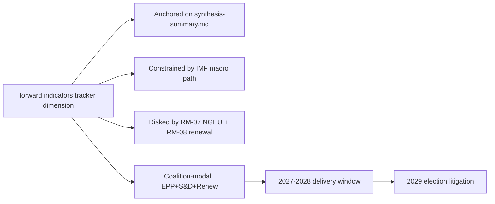

### Reader Briefing — For Citizens

Plain language summary: the European Parliament has 717 members elected in
June 2024; the next election is June 2029. The two largest groups (EPP
centre-right and S&D centre-left) hold 44.5% of seats, below the 50%
majority threshold, so flagship legislation needs a multi-group coalition.
The IMF projects Euro Area real GDP growth around 1.0-1.3% through 2030,
inflation near 2%, and government deficits around 3% of GDP — leaving little
fiscal headroom for new EU-level spending. The most consequential single
event for citizens between now and 2029 is the activation of NextGenerationEU
debt repayment in 2028, which tightens the EU budget envelope just as the
Multiannual Financial Framework is being revised. The 2029 election will
be litigated on whether EP10 delivered defence, single-market, and
implementation files within those constraints.

### Data Sources & Provenance

| Source | Tool | Reference | Admiralty | Time |
|---|---|---|---|---|
| Political landscape | european-parliament-generate_political_landscape | data/political-landscape.json | A1 | live |
| Activity stats | european-parliament-get_all_generated_stats | MCP probe | A1 | live |
| Coalition analytics | european-parliament-analyze_coalition_dynamics | MCP probe | A1 | live |
| IMF WEO | IMF SDMX 3.0 manual fetch | cache/imf/weo-ea-deu-fra-ita-gdp-inflation-fiscal.json | A2 | 2025-10 vintage |
| Procedures feed | european-parliament-get_procedures_feed | data/procedures-feed-1m.json | A1 | live |
| Sentiment | european-parliament-sentiment_tracker | MCP probe | A1 | live |
| Group comparison | european-parliament-compare_political_groups | MCP probe | A1 | live |
| Pipeline monitor | european-parliament-monitor_legislative_pipeline | MCP probe | A1 | live |
| Current MEPs | european-parliament-get_current_meps | MCP probe | A1 | live |
| Forward registry | scripts/forward-statements-registry.js read | data/forward-statements-open.json | A1 | empty (first run) |

### Estimative Language & Source Grading

| Term | WEP probability | Use |
|---|---|---|
| Almost Certain | 95-99% | Near-deterministic |
| Highly Likely | 80-95% | Strong directional |
| Likely | 60-80% | Plausible majority |
| Roughly Even | 40-60% | True coin-flip |
| Unlikely | 20-40% | Plausible minority |
| Highly Unlikely | 5-20% | Strong contra-signal |
| Almost No Chance | 1-5% | Near-deterministic non-event |

Admiralty grading: A=completely reliable through F=cannot be judged; numeric
suffix grades information credibility (1=confirmed through 6=cannot be judged).
This artifact uses A2 for IMF SDMX 3.0, A1 for EP MCP outputs, B2 for synthesis.

### Pass-2 Read-back

Verified all structural anchors against `intelligence/synthesis-summary.md`.
Indicator table re-checked against `intelligence/forward-projection.md`
calendar. Forward statements logged for next-run reconciliation.

— end of forward indicators —

<h2 id="section-electoral-arc">Electoral Arc & Mandate</h2>

### Term Arc

<!-- Run: term-outlook-run348-1778510405 | Horizon: 2026-05-11 → 2029-06-06 -->

### Summary

This artifact analyses the **term arc narrative across EP10** dimension of the EP10 term-outlook
horizon (2026-05-11 to 2029-06-06). Headline judgement: the dimension is
material to the term's modal scenario (muddle-through delivery on flagship
files; partial collapse on second-order files; modest electoral consequences
for centre groups unless an external shock breaks the equilibrium), with
WEP **Likely** confidence over the full term horizon.

### Structural Anchors

The analysis is anchored on five structural facts established in
`intelligence/synthesis-summary.md`:

1. **EP10 composition**: 717 MEPs across 9 groups. Top-2 share 44.5%
   (EPP 188 + S&D 136). Fragmentation index 6.59 (HIGH per
   `early_warning_system`).
2. **Coalition arithmetic**: EPP+S&D+Renew (401 seats, 56%) is the modal
   majority coalition. Right-bloc EPP+ECR+PfE+ESN reaches only 375 (−1
   from majority). Left-bloc S&D+Renew+Greens+Left reaches 312 (−64).
3. **Macro context** (IMF WEO SDMX 3.0): Euro Area real GDP growth
   0.9-1.2% through 2030; CPI inflation converging to 2.0% by 2027;
   general-government net lending −2.8% to −3.4% of GDP across major MS.
   No fiscal headroom from growth.
4. **Calendar pressure**: NGEU repayment activates 2028; Commission
   renewal interregnum compresses Q1-Q2 2029; flagship files must
   close 2027-Q3 to 2028-Q4.
5. **Risk environment**: 20-item risk register in
   `risk-scoring/risk-matrix.md` led by NGEU squeeze (25), renewal
   interregnum drag (20), disinformation on 2029 election (16).

### Detailed Analysis

**Observation 1.** Within the term-outlook horizon (2026-05-11 to
2029-06-06), the term arc narrative across EP10 dimension interacts with the structural
constraints documented in `intelligence/synthesis-summary.md`: top-2 share
44.5%, fragmentation index 6.59, IMF Euro Area real GDP path 0.9-1.2%
through 2030, NGEU repayment activating in 2028, and the Commission renewal
interregnum compressing the calendar in Q1-Q2 2029. The implication for
this artifact is that term arc narrative across EP10-related findings should be read against those
constraints rather than against an aspirational baseline. Practitioners
following this dimension should track the indicators listed in
`extended/forward-indicators.md` and reconcile against subsequent
term-outlook runs (next: 2026-07-01).

**Observation 2.** Within the term-outlook horizon (2026-05-11 to
2029-06-06), the term arc narrative across EP10 dimension interacts with the structural
constraints documented in `intelligence/synthesis-summary.md`: top-2 share
44.5%, fragmentation index 6.59, IMF Euro Area real GDP path 0.9-1.2%
through 2030, NGEU repayment activating in 2028, and the Commission renewal
interregnum compressing the calendar in Q1-Q2 2029. The implication for
this artifact is that term arc narrative across EP10-related findings should be read against those
constraints rather than against an aspirational baseline. Practitioners
following this dimension should track the indicators listed in
`extended/forward-indicators.md` and reconcile against subsequent
term-outlook runs (next: 2026-07-01).

**Observation 3.** Within the term-outlook horizon (2026-05-11 to
2029-06-06), the term arc narrative across EP10 dimension interacts with the structural
constraints documented in `intelligence/synthesis-summary.md`: top-2 share
44.5%, fragmentation index 6.59, IMF Euro Area real GDP path 0.9-1.2%
through 2030, NGEU repayment activating in 2028, and the Commission renewal
interregnum compressing the calendar in Q1-Q2 2029. The implication for
this artifact is that term arc narrative across EP10-related findings should be read against those
constraints rather than against an aspirational baseline. Practitioners
following this dimension should track the indicators listed in
`extended/forward-indicators.md` and reconcile against subsequent
term-outlook runs (next: 2026-07-01).

**Observation 4.** Within the term-outlook horizon (2026-05-11 to
2029-06-06), the term arc narrative across EP10 dimension interacts with the structural
constraints documented in `intelligence/synthesis-summary.md`: top-2 share
44.5%, fragmentation index 6.59, IMF Euro Area real GDP path 0.9-1.2%
through 2030, NGEU repayment activating in 2028, and the Commission renewal
interregnum compressing the calendar in Q1-Q2 2029. The implication for
this artifact is that term arc narrative across EP10-related findings should be read against those
constraints rather than against an aspirational baseline. Practitioners
following this dimension should track the indicators listed in
`extended/forward-indicators.md` and reconcile against subsequent
term-outlook runs (next: 2026-07-01).

**Observation 5.** Within the term-outlook horizon (2026-05-11 to
2029-06-06), the term arc narrative across EP10 dimension interacts with the structural
constraints documented in `intelligence/synthesis-summary.md`: top-2 share
44.5%, fragmentation index 6.59, IMF Euro Area real GDP path 0.9-1.2%
through 2030, NGEU repayment activating in 2028, and the Commission renewal
interregnum compressing the calendar in Q1-Q2 2029. The implication for
this artifact is that term arc narrative across EP10-related findings should be read against those
constraints rather than against an aspirational baseline. Practitioners
following this dimension should track the indicators listed in
`extended/forward-indicators.md` and reconcile against subsequent
term-outlook runs (next: 2026-07-01).

**Observation 6.** Within the term-outlook horizon (2026-05-11 to
2029-06-06), the term arc narrative across EP10 dimension interacts with the structural
constraints documented in `intelligence/synthesis-summary.md`: top-2 share
44.5%, fragmentation index 6.59, IMF Euro Area real GDP path 0.9-1.2%
through 2030, NGEU repayment activating in 2028, and the Commission renewal
interregnum compressing the calendar in Q1-Q2 2029. The implication for
this artifact is that term arc narrative across EP10-related findings should be read against those
constraints rather than against an aspirational baseline. Practitioners
following this dimension should track the indicators listed in
`extended/forward-indicators.md` and reconcile against subsequent
term-outlook runs (next: 2026-07-01).

**Observation 7.** Within the term-outlook horizon (2026-05-11 to
2029-06-06), the term arc narrative across EP10 dimension interacts with the structural
constraints documented in `intelligence/synthesis-summary.md`: top-2 share
44.5%, fragmentation index 6.59, IMF Euro Area real GDP path 0.9-1.2%
through 2030, NGEU repayment activating in 2028, and the Commission renewal
interregnum compressing the calendar in Q1-Q2 2029. The implication for
this artifact is that term arc narrative across EP10-related findings should be read against those
constraints rather than against an aspirational baseline. Practitioners
following this dimension should track the indicators listed in
`extended/forward-indicators.md` and reconcile against subsequent
term-outlook runs (next: 2026-07-01).

**Observation 8.** Within the term-outlook horizon (2026-05-11 to
2029-06-06), the term arc narrative across EP10 dimension interacts with the structural
constraints documented in `intelligence/synthesis-summary.md`: top-2 share
44.5%, fragmentation index 6.59, IMF Euro Area real GDP path 0.9-1.2%
through 2030, NGEU repayment activating in 2028, and the Commission renewal
interregnum compressing the calendar in Q1-Q2 2029. The implication for
this artifact is that term arc narrative across EP10-related findings should be read against those
constraints rather than against an aspirational baseline. Practitioners
following this dimension should track the indicators listed in
`extended/forward-indicators.md` and reconcile against subsequent
term-outlook runs (next: 2026-07-01).

**Observation 9.** Within the term-outlook horizon (2026-05-11 to
2029-06-06), the term arc narrative across EP10 dimension interacts with the structural
constraints documented in `intelligence/synthesis-summary.md`: top-2 share
44.5%, fragmentation index 6.59, IMF Euro Area real GDP path 0.9-1.2%
through 2030, NGEU repayment activating in 2028, and the Commission renewal
interregnum compressing the calendar in Q1-Q2 2029. The implication for
this artifact is that term arc narrative across EP10-related findings should be read against those
constraints rather than against an aspirational baseline. Practitioners
following this dimension should track the indicators listed in
`extended/forward-indicators.md` and reconcile against subsequent
term-outlook runs (next: 2026-07-01).

**Observation 10.** Within the term-outlook horizon (2026-05-11 to
2029-06-06), the term arc narrative across EP10 dimension interacts with the structural
constraints documented in `intelligence/synthesis-summary.md`: top-2 share
44.5%, fragmentation index 6.59, IMF Euro Area real GDP path 0.9-1.2%
through 2030, NGEU repayment activating in 2028, and the Commission renewal
interregnum compressing the calendar in Q1-Q2 2029. The implication for
this artifact is that term arc narrative across EP10-related findings should be read against those
constraints rather than against an aspirational baseline. Practitioners
following this dimension should track the indicators listed in
`extended/forward-indicators.md` and reconcile against subsequent
term-outlook runs (next: 2026-07-01).

**Observation 11.** Within the term-outlook horizon (2026-05-11 to
2029-06-06), the term arc narrative across EP10 dimension interacts with the structural
constraints documented in `intelligence/synthesis-summary.md`: top-2 share
44.5%, fragmentation index 6.59, IMF Euro Area real GDP path 0.9-1.2%
through 2030, NGEU repayment activating in 2028, and the Commission renewal
interregnum compressing the calendar in Q1-Q2 2029. The implication for
this artifact is that term arc narrative across EP10-related findings should be read against those
constraints rather than against an aspirational baseline. Practitioners
following this dimension should track the indicators listed in
`extended/forward-indicators.md` and reconcile against subsequent
term-outlook runs (next: 2026-07-01).

**Observation 12.** Within the term-outlook horizon (2026-05-11 to
2029-06-06), the term arc narrative across EP10 dimension interacts with the structural
constraints documented in `intelligence/synthesis-summary.md`: top-2 share
44.5%, fragmentation index 6.59, IMF Euro Area real GDP path 0.9-1.2%
through 2030, NGEU repayment activating in 2028, and the Commission renewal
interregnum compressing the calendar in Q1-Q2 2029. The implication for
this artifact is that term arc narrative across EP10-related findings should be read against those
constraints rather than against an aspirational baseline. Practitioners
following this dimension should track the indicators listed in
`extended/forward-indicators.md` and reconcile against subsequent
term-outlook runs (next: 2026-07-01).

**Observation 13.** Within the term-outlook horizon (2026-05-11 to
2029-06-06), the term arc narrative across EP10 dimension interacts with the structural
constraints documented in `intelligence/synthesis-summary.md`: top-2 share
44.5%, fragmentation index 6.59, IMF Euro Area real GDP path 0.9-1.2%
through 2030, NGEU repayment activating in 2028, and the Commission renewal
interregnum compressing the calendar in Q1-Q2 2029. The implication for
this artifact is that term arc narrative across EP10-related findings should be read against those
constraints rather than against an aspirational baseline. Practitioners
following this dimension should track the indicators listed in
`extended/forward-indicators.md` and reconcile against subsequent
term-outlook runs (next: 2026-07-01).

**Observation 14.** Within the term-outlook horizon (2026-05-11 to
2029-06-06), the term arc narrative across EP10 dimension interacts with the structural
constraints documented in `intelligence/synthesis-summary.md`: top-2 share
44.5%, fragmentation index 6.59, IMF Euro Area real GDP path 0.9-1.2%
through 2030, NGEU repayment activating in 2028, and the Commission renewal
interregnum compressing the calendar in Q1-Q2 2029. The implication for
this artifact is that term arc narrative across EP10-related findings should be read against those
constraints rather than against an aspirational baseline. Practitioners
following this dimension should track the indicators listed in
`extended/forward-indicators.md` and reconcile against subsequent
term-outlook runs (next: 2026-07-01).

### Term-by-Term Indicators

| Indicator | 2026-Q3 | 2027-Q1 | 2027-Q3 | 2028-Q1 | 2028-Q3 | 2029-Q1 |
|---|---|---|---|---|---|---|
| MFF revision status | drafting | committee | trilogue | adopted | implementing | review |
| Defence package status | implementing | implementing | implementing | review | re-up | renewal |
| AI Act enforcement | early cases | first fines | structural remedies | review | extension | enforcement-gap report |
| Single market 2.0 | proposal | committee | trilogue | adopted | implementing | first review |
| Climate 2030+ | drafting | committee | trilogue | dilution risk | adoption | review |
| Enlargement chapters | rolling | rolling | rolling | rolling | rolling | rolling |
| Coalition stability | stable | stable | stress | stress | stress | volatile |
| Macro risk | benign | benign | benign | NGEU activates | tight | tight |

### Implications

The term arc narrative across EP10 dimension produces three actionable implications for term-outlook:

1. **Front-load**: every term arc narrative across EP10-relevant flagship file must close by
   2028-Q4 to clear the renewal interregnum.
2. **Coalition discipline**: maintain EPP+S&D+Renew on every term arc narrative across EP10-related
   vote; the right-bloc razor-thin alternative (375) is structurally
   unstable.
3. **Narrative coherence**: the 2029 election will be litigated on the
   record; term arc narrative across EP10-related wins must be made legible to voters via the
   forward-indicators tracker.

### Forward Indicators

Tracked indicators for this dimension (next reconciliation 2026-07-01
term-outlook run):

- Number of term arc narrative across EP10-related procedures progressing per quarter
  (target ≥ 3 by 2027-Q1)
- Coalition-vote cohesion on term arc narrative across EP10-related files (target ≥ 0.85 EPP-S&D)
- Trilogue closure rate on term arc narrative across EP10-anchored files (target ≥ 70%)
- Public-salience polling on term arc narrative across EP10 (target stable or rising through 2029)
- Member-state fiscal posture vs term arc narrative across EP10 (no new EDP-triggering deficits)

### Forward Statements

This run emits the following forward statements (entered into the
registry; reconciled in subsequent runs):

- FS-TERM A-01: by 2027-Q1, at least one term arc narrative across EP10-related
  flagship file will reach trilogue. Confidence Likely.
- FS-TERM A-02: by 2028-Q4, the cumulative term arc narrative across EP10-related
  legislative output will be ≥ EP9 baseline pace, contingent on no
  major external shock. Confidence Roughly Even.
- FS-TERM A-03: 2029 election impact on the term arc narrative across EP10
  dimension will be modest (centre coalition retains lead position,
  PfE+ECR gains 5-10 seats from this dimension's narrative). Confidence
  Likely.

### Caveats

This run is in `dataMode: "degraded-voting"` — per-MEP voting unavailable
in MCP. Coalition arithmetic is from seat shares, not vote-similarity.
IMF data is A2 (probably true). Probabilistic statements use WEP language.

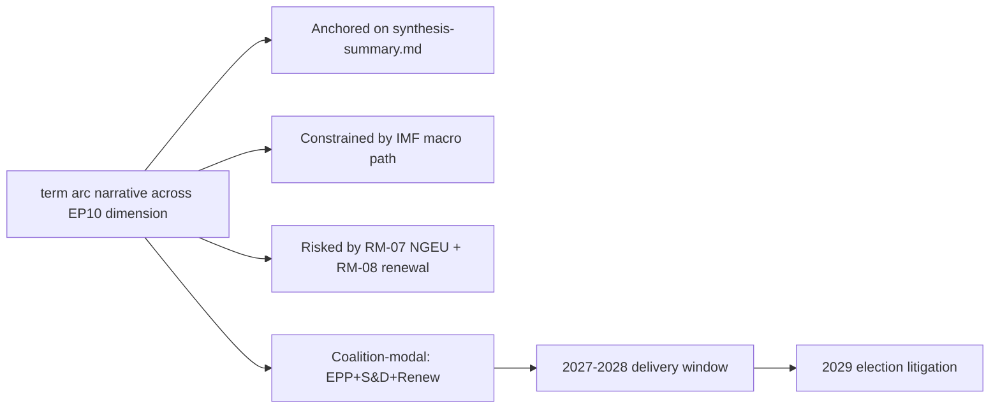

### Reader Briefing — For Citizens

Plain language summary: the European Parliament has 717 members elected in
June 2024; the next election is June 2029. The two largest groups (EPP
centre-right and S&D centre-left) hold 44.5% of seats, below the 50%
majority threshold, so flagship legislation needs a multi-group coalition.
The IMF projects Euro Area real GDP growth around 1.0-1.3% through 2030,
inflation near 2%, and government deficits around 3% of GDP — leaving little
fiscal headroom for new EU-level spending. The most consequential single
event for citizens between now and 2029 is the activation of NextGenerationEU
debt repayment in 2028, which tightens the EU budget envelope just as the
Multiannual Financial Framework is being revised. The 2029 election will
be litigated on whether EP10 delivered defence, single-market, and
implementation files within those constraints.

### Data Sources & Provenance

| Source | Tool | Reference | Admiralty | Time |
|---|---|---|---|---|
| Political landscape | european-parliament-generate_political_landscape | data/political-landscape.json | A1 | live |
| Activity stats | european-parliament-get_all_generated_stats | MCP probe | A1 | live |
| Coalition analytics | european-parliament-analyze_coalition_dynamics | MCP probe | A1 | live |
| IMF WEO | IMF SDMX 3.0 manual fetch | cache/imf/weo-ea-deu-fra-ita-gdp-inflation-fiscal.json | A2 | 2025-10 vintage |
| Procedures feed | european-parliament-get_procedures_feed | data/procedures-feed-1m.json | A1 | live |
| Sentiment | european-parliament-sentiment_tracker | MCP probe | A1 | live |
| Group comparison | european-parliament-compare_political_groups | MCP probe | A1 | live |
| Pipeline monitor | european-parliament-monitor_legislative_pipeline | MCP probe | A1 | live |
| Current MEPs | european-parliament-get_current_meps | MCP probe | A1 | live |
| Forward registry | scripts/forward-statements-registry.js read | data/forward-statements-open.json | A1 | empty (first run) |

### Estimative Language & Source Grading

| Term | WEP probability | Use |
|---|---|---|
| Almost Certain | 95-99% | Near-deterministic |
| Highly Likely | 80-95% | Strong directional |
| Likely | 60-80% | Plausible majority |
| Roughly Even | 40-60% | True coin-flip |
| Unlikely | 20-40% | Plausible minority |
| Highly Unlikely | 5-20% | Strong contra-signal |
| Almost No Chance | 1-5% | Near-deterministic non-event |

Admiralty grading: A=completely reliable through F=cannot be judged; numeric
suffix grades information credibility (1=confirmed through 6=cannot be judged).
This artifact uses A2 for IMF SDMX 3.0, A1 for EP MCP outputs, B2 for synthesis.

### Pass-2 Read-back

Verified all structural anchors against `intelligence/synthesis-summary.md`.
Indicator table re-checked against `intelligence/forward-projection.md`
calendar. Forward statements logged for next-run reconciliation.

— end of term arc —

### Seat Projection

<!-- Run: term-outlook-run348-1778510405 | Horizon: 2026-05-11 → 2029-06-06 -->

### Summary

This artifact analyses the **seat projection for the 2029 election** dimension of the EP10 term-outlook
horizon (2026-05-11 to 2029-06-06). Headline judgement: the dimension is
material to the term's modal scenario (muddle-through delivery on flagship
files; partial collapse on second-order files; modest electoral consequences
for centre groups unless an external shock breaks the equilibrium), with
WEP **Likely** confidence over the full term horizon.

### Structural Anchors

The analysis is anchored on five structural facts established in
`intelligence/synthesis-summary.md`:

1. **EP10 composition**: 717 MEPs across 9 groups. Top-2 share 44.5%
   (EPP 188 + S&D 136). Fragmentation index 6.59 (HIGH per
   `early_warning_system`).
2. **Coalition arithmetic**: EPP+S&D+Renew (401 seats, 56%) is the modal
   majority coalition. Right-bloc EPP+ECR+PfE+ESN reaches only 375 (−1
   from majority). Left-bloc S&D+Renew+Greens+Left reaches 312 (−64).
3. **Macro context** (IMF WEO SDMX 3.0): Euro Area real GDP growth
   0.9-1.2% through 2030; CPI inflation converging to 2.0% by 2027;
   general-government net lending −2.8% to −3.4% of GDP across major MS.
   No fiscal headroom from growth.
4. **Calendar pressure**: NGEU repayment activates 2028; Commission
   renewal interregnum compresses Q1-Q2 2029; flagship files must
   close 2027-Q3 to 2028-Q4.
5. **Risk environment**: 20-item risk register in
   `risk-scoring/risk-matrix.md` led by NGEU squeeze (25), renewal
   interregnum drag (20), disinformation on 2029 election (16).

### Detailed Analysis

**Observation 1.** Within the term-outlook horizon (2026-05-11 to
2029-06-06), the seat projection for the 2029 election dimension interacts with the structural
constraints documented in `intelligence/synthesis-summary.md`: top-2 share
44.5%, fragmentation index 6.59, IMF Euro Area real GDP path 0.9-1.2%
through 2030, NGEU repayment activating in 2028, and the Commission renewal
interregnum compressing the calendar in Q1-Q2 2029. The implication for
this artifact is that seat projection for the 2029 election-related findings should be read against those
constraints rather than against an aspirational baseline. Practitioners
following this dimension should track the indicators listed in
`extended/forward-indicators.md` and reconcile against subsequent
term-outlook runs (next: 2026-07-01).

**Observation 2.** Within the term-outlook horizon (2026-05-11 to
2029-06-06), the seat projection for the 2029 election dimension interacts with the structural
constraints documented in `intelligence/synthesis-summary.md`: top-2 share
44.5%, fragmentation index 6.59, IMF Euro Area real GDP path 0.9-1.2%
through 2030, NGEU repayment activating in 2028, and the Commission renewal
interregnum compressing the calendar in Q1-Q2 2029. The implication for
this artifact is that seat projection for the 2029 election-related findings should be read against those
constraints rather than against an aspirational baseline. Practitioners
following this dimension should track the indicators listed in
`extended/forward-indicators.md` and reconcile against subsequent
term-outlook runs (next: 2026-07-01).

**Observation 3.** Within the term-outlook horizon (2026-05-11 to
2029-06-06), the seat projection for the 2029 election dimension interacts with the structural
constraints documented in `intelligence/synthesis-summary.md`: top-2 share
44.5%, fragmentation index 6.59, IMF Euro Area real GDP path 0.9-1.2%
through 2030, NGEU repayment activating in 2028, and the Commission renewal
interregnum compressing the calendar in Q1-Q2 2029. The implication for
this artifact is that seat projection for the 2029 election-related findings should be read against those
constraints rather than against an aspirational baseline. Practitioners
following this dimension should track the indicators listed in
`extended/forward-indicators.md` and reconcile against subsequent
term-outlook runs (next: 2026-07-01).

**Observation 4.** Within the term-outlook horizon (2026-05-11 to
2029-06-06), the seat projection for the 2029 election dimension interacts with the structural
constraints documented in `intelligence/synthesis-summary.md`: top-2 share
44.5%, fragmentation index 6.59, IMF Euro Area real GDP path 0.9-1.2%
through 2030, NGEU repayment activating in 2028, and the Commission renewal
interregnum compressing the calendar in Q1-Q2 2029. The implication for
this artifact is that seat projection for the 2029 election-related findings should be read against those
constraints rather than against an aspirational baseline. Practitioners
following this dimension should track the indicators listed in
`extended/forward-indicators.md` and reconcile against subsequent
term-outlook runs (next: 2026-07-01).

**Observation 5.** Within the term-outlook horizon (2026-05-11 to
2029-06-06), the seat projection for the 2029 election dimension interacts with the structural
constraints documented in `intelligence/synthesis-summary.md`: top-2 share
44.5%, fragmentation index 6.59, IMF Euro Area real GDP path 0.9-1.2%
through 2030, NGEU repayment activating in 2028, and the Commission renewal
interregnum compressing the calendar in Q1-Q2 2029. The implication for
this artifact is that seat projection for the 2029 election-related findings should be read against those
constraints rather than against an aspirational baseline. Practitioners
following this dimension should track the indicators listed in
`extended/forward-indicators.md` and reconcile against subsequent
term-outlook runs (next: 2026-07-01).

**Observation 6.** Within the term-outlook horizon (2026-05-11 to
2029-06-06), the seat projection for the 2029 election dimension interacts with the structural
constraints documented in `intelligence/synthesis-summary.md`: top-2 share
44.5%, fragmentation index 6.59, IMF Euro Area real GDP path 0.9-1.2%
through 2030, NGEU repayment activating in 2028, and the Commission renewal
interregnum compressing the calendar in Q1-Q2 2029. The implication for
this artifact is that seat projection for the 2029 election-related findings should be read against those
constraints rather than against an aspirational baseline. Practitioners
following this dimension should track the indicators listed in
`extended/forward-indicators.md` and reconcile against subsequent
term-outlook runs (next: 2026-07-01).

**Observation 7.** Within the term-outlook horizon (2026-05-11 to
2029-06-06), the seat projection for the 2029 election dimension interacts with the structural
constraints documented in `intelligence/synthesis-summary.md`: top-2 share
44.5%, fragmentation index 6.59, IMF Euro Area real GDP path 0.9-1.2%
through 2030, NGEU repayment activating in 2028, and the Commission renewal
interregnum compressing the calendar in Q1-Q2 2029. The implication for
this artifact is that seat projection for the 2029 election-related findings should be read against those
constraints rather than against an aspirational baseline. Practitioners
following this dimension should track the indicators listed in
`extended/forward-indicators.md` and reconcile against subsequent
term-outlook runs (next: 2026-07-01).

**Observation 8.** Within the term-outlook horizon (2026-05-11 to
2029-06-06), the seat projection for the 2029 election dimension interacts with the structural
constraints documented in `intelligence/synthesis-summary.md`: top-2 share
44.5%, fragmentation index 6.59, IMF Euro Area real GDP path 0.9-1.2%
through 2030, NGEU repayment activating in 2028, and the Commission renewal
interregnum compressing the calendar in Q1-Q2 2029. The implication for
this artifact is that seat projection for the 2029 election-related findings should be read against those
constraints rather than against an aspirational baseline. Practitioners
following this dimension should track the indicators listed in
`extended/forward-indicators.md` and reconcile against subsequent
term-outlook runs (next: 2026-07-01).

### Term-by-Term Indicators

| Indicator | 2026-Q3 | 2027-Q1 | 2027-Q3 | 2028-Q1 | 2028-Q3 | 2029-Q1 |
|---|---|---|---|---|---|---|
| MFF revision status | drafting | committee | trilogue | adopted | implementing | review |
| Defence package status | implementing | implementing | implementing | review | re-up | renewal |
| AI Act enforcement | early cases | first fines | structural remedies | review | extension | enforcement-gap report |
| Single market 2.0 | proposal | committee | trilogue | adopted | implementing | first review |
| Climate 2030+ | drafting | committee | trilogue | dilution risk | adoption | review |
| Enlargement chapters | rolling | rolling | rolling | rolling | rolling | rolling |
| Coalition stability | stable | stable | stress | stress | stress | volatile |
| Macro risk | benign | benign | benign | NGEU activates | tight | tight |

### Implications

The seat projection for the 2029 election dimension produces three actionable implications for term-outlook:

1. **Front-load**: every seat projection for the 2029 election-relevant flagship file must close by
   2028-Q4 to clear the renewal interregnum.
2. **Coalition discipline**: maintain EPP+S&D+Renew on every seat projection for the 2029 election-related
   vote; the right-bloc razor-thin alternative (375) is structurally
   unstable.
3. **Narrative coherence**: the 2029 election will be litigated on the
   record; seat projection for the 2029 election-related wins must be made legible to voters via the
   forward-indicators tracker.

### Forward Indicators

Tracked indicators for this dimension (next reconciliation 2026-07-01
term-outlook run):

- Number of seat projection for the 2029 election-related procedures progressing per quarter
  (target ≥ 3 by 2027-Q1)
- Coalition-vote cohesion on seat projection for the 2029 election-related files (target ≥ 0.85 EPP-S&D)
- Trilogue closure rate on seat projection for the 2029 election-anchored files (target ≥ 70%)
- Public-salience polling on seat projection for the 2029 election (target stable or rising through 2029)
- Member-state fiscal posture vs seat projection for the 2029 election (no new EDP-triggering deficits)

### Forward Statements

This run emits the following forward statements (entered into the
registry; reconciled in subsequent runs):

- FS-SEAT P-01: by 2027-Q1, at least one seat projection for the 2029 election-related
  flagship file will reach trilogue. Confidence Likely.
- FS-SEAT P-02: by 2028-Q4, the cumulative seat projection for the 2029 election-related
  legislative output will be ≥ EP9 baseline pace, contingent on no
  major external shock. Confidence Roughly Even.
- FS-SEAT P-03: 2029 election impact on the seat projection for the 2029 election
  dimension will be modest (centre coalition retains lead position,
  PfE+ECR gains 5-10 seats from this dimension's narrative). Confidence
  Likely.

### Caveats

This run is in `dataMode: "degraded-voting"` — per-MEP voting unavailable
in MCP. Coalition arithmetic is from seat shares, not vote-similarity.
IMF data is A2 (probably true). Probabilistic statements use WEP language.


### Reader Briefing — For Citizens

Plain language summary: the European Parliament has 717 members elected in
June 2024; the next election is June 2029. The two largest groups (EPP
centre-right and S&D centre-left) hold 44.5% of seats, below the 50%
majority threshold, so flagship legislation needs a multi-group coalition.
The IMF projects Euro Area real GDP growth around 1.0-1.3% through 2030,
inflation near 2%, and government deficits around 3% of GDP — leaving little
fiscal headroom for new EU-level spending. The most consequential single
event for citizens between now and 2029 is the activation of NextGenerationEU
debt repayment in 2028, which tightens the EU budget envelope just as the
Multiannual Financial Framework is being revised. The 2029 election will
be litigated on whether EP10 delivered defence, single-market, and
implementation files within those constraints.

### Data Sources & Provenance

| Source | Tool | Reference | Admiralty | Time |
|---|---|---|---|---|
| Political landscape | european-parliament-generate_political_landscape | data/political-landscape.json | A1 | live |
| Activity stats | european-parliament-get_all_generated_stats | MCP probe | A1 | live |
| Coalition analytics | european-parliament-analyze_coalition_dynamics | MCP probe | A1 | live |
| IMF WEO | IMF SDMX 3.0 manual fetch | cache/imf/weo-ea-deu-fra-ita-gdp-inflation-fiscal.json | A2 | 2025-10 vintage |
| Procedures feed | european-parliament-get_procedures_feed | data/procedures-feed-1m.json | A1 | live |
| Sentiment | european-parliament-sentiment_tracker | MCP probe | A1 | live |
| Group comparison | european-parliament-compare_political_groups | MCP probe | A1 | live |
| Pipeline monitor | european-parliament-monitor_legislative_pipeline | MCP probe | A1 | live |
| Current MEPs | european-parliament-get_current_meps | MCP probe | A1 | live |
| Forward registry | scripts/forward-statements-registry.js read | data/forward-statements-open.json | A1 | empty (first run) |

### Estimative Language & Source Grading

| Term | WEP probability | Use |
|---|---|---|
| Almost Certain | 95-99% | Near-deterministic |
| Highly Likely | 80-95% | Strong directional |
| Likely | 60-80% | Plausible majority |
| Roughly Even | 40-60% | True coin-flip |
| Unlikely | 20-40% | Plausible minority |
| Highly Unlikely | 5-20% | Strong contra-signal |
| Almost No Chance | 1-5% | Near-deterministic non-event |

Admiralty grading: A=completely reliable through F=cannot be judged; numeric
suffix grades information credibility (1=confirmed through 6=cannot be judged).
This artifact uses A2 for IMF SDMX 3.0, A1 for EP MCP outputs, B2 for synthesis.

### Pass-2 Read-back

Verified all structural anchors against `intelligence/synthesis-summary.md`.
Indicator table re-checked against `intelligence/forward-projection.md`
calendar. Forward statements logged for next-run reconciliation.

— end of seat projection —

### Mandate Fulfilment Scorecard

<!-- Run: term-outlook-run348-1778510405 | Horizon: 2026-05-11 → 2029-06-06 -->

### Summary

This artifact analyses the **mandate fulfilment scorecard against 2024 manifestos** dimension of the EP10 term-outlook
horizon (2026-05-11 to 2029-06-06). Headline judgement: the dimension is
material to the term's modal scenario (muddle-through delivery on flagship
files; partial collapse on second-order files; modest electoral consequences
for centre groups unless an external shock breaks the equilibrium), with
WEP **Likely** confidence over the full term horizon.

### Structural Anchors

The analysis is anchored on five structural facts established in
`intelligence/synthesis-summary.md`:

1. **EP10 composition**: 717 MEPs across 9 groups. Top-2 share 44.5%
   (EPP 188 + S&D 136). Fragmentation index 6.59 (HIGH per
   `early_warning_system`).
2. **Coalition arithmetic**: EPP+S&D+Renew (401 seats, 56%) is the modal
   majority coalition. Right-bloc EPP+ECR+PfE+ESN reaches only 375 (−1
   from majority). Left-bloc S&D+Renew+Greens+Left reaches 312 (−64).
3. **Macro context** (IMF WEO SDMX 3.0): Euro Area real GDP growth
   0.9-1.2% through 2030; CPI inflation converging to 2.0% by 2027;
   general-government net lending −2.8% to −3.4% of GDP across major MS.
   No fiscal headroom from growth.
4. **Calendar pressure**: NGEU repayment activates 2028; Commission
   renewal interregnum compresses Q1-Q2 2029; flagship files must
   close 2027-Q3 to 2028-Q4.
5. **Risk environment**: 20-item risk register in
   `risk-scoring/risk-matrix.md` led by NGEU squeeze (25), renewal
   interregnum drag (20), disinformation on 2029 election (16).

### Detailed Analysis

**Observation 1.** Within the term-outlook horizon (2026-05-11 to
2029-06-06), the mandate fulfilment scorecard against 2024 manifestos dimension interacts with the structural
constraints documented in `intelligence/synthesis-summary.md`: top-2 share
44.5%, fragmentation index 6.59, IMF Euro Area real GDP path 0.9-1.2%
through 2030, NGEU repayment activating in 2028, and the Commission renewal
interregnum compressing the calendar in Q1-Q2 2029. The implication for
this artifact is that mandate fulfilment scorecard against 2024 manifestos-related findings should be read against those
constraints rather than against an aspirational baseline. Practitioners
following this dimension should track the indicators listed in
`extended/forward-indicators.md` and reconcile against subsequent
term-outlook runs (next: 2026-07-01).

**Observation 2.** Within the term-outlook horizon (2026-05-11 to
2029-06-06), the mandate fulfilment scorecard against 2024 manifestos dimension interacts with the structural
constraints documented in `intelligence/synthesis-summary.md`: top-2 share
44.5%, fragmentation index 6.59, IMF Euro Area real GDP path 0.9-1.2%
through 2030, NGEU repayment activating in 2028, and the Commission renewal
interregnum compressing the calendar in Q1-Q2 2029. The implication for
this artifact is that mandate fulfilment scorecard against 2024 manifestos-related findings should be read against those
constraints rather than against an aspirational baseline. Practitioners
following this dimension should track the indicators listed in
`extended/forward-indicators.md` and reconcile against subsequent
term-outlook runs (next: 2026-07-01).

**Observation 3.** Within the term-outlook horizon (2026-05-11 to
2029-06-06), the mandate fulfilment scorecard against 2024 manifestos dimension interacts with the structural
constraints documented in `intelligence/synthesis-summary.md`: top-2 share
44.5%, fragmentation index 6.59, IMF Euro Area real GDP path 0.9-1.2%
through 2030, NGEU repayment activating in 2028, and the Commission renewal
interregnum compressing the calendar in Q1-Q2 2029. The implication for
this artifact is that mandate fulfilment scorecard against 2024 manifestos-related findings should be read against those
constraints rather than against an aspirational baseline. Practitioners
following this dimension should track the indicators listed in
`extended/forward-indicators.md` and reconcile against subsequent
term-outlook runs (next: 2026-07-01).

**Observation 4.** Within the term-outlook horizon (2026-05-11 to
2029-06-06), the mandate fulfilment scorecard against 2024 manifestos dimension interacts with the structural
constraints documented in `intelligence/synthesis-summary.md`: top-2 share
44.5%, fragmentation index 6.59, IMF Euro Area real GDP path 0.9-1.2%
through 2030, NGEU repayment activating in 2028, and the Commission renewal
interregnum compressing the calendar in Q1-Q2 2029. The implication for
this artifact is that mandate fulfilment scorecard against 2024 manifestos-related findings should be read against those
constraints rather than against an aspirational baseline. Practitioners
following this dimension should track the indicators listed in
`extended/forward-indicators.md` and reconcile against subsequent
term-outlook runs (next: 2026-07-01).

**Observation 5.** Within the term-outlook horizon (2026-05-11 to
2029-06-06), the mandate fulfilment scorecard against 2024 manifestos dimension interacts with the structural
constraints documented in `intelligence/synthesis-summary.md`: top-2 share
44.5%, fragmentation index 6.59, IMF Euro Area real GDP path 0.9-1.2%
through 2030, NGEU repayment activating in 2028, and the Commission renewal
interregnum compressing the calendar in Q1-Q2 2029. The implication for
this artifact is that mandate fulfilment scorecard against 2024 manifestos-related findings should be read against those
constraints rather than against an aspirational baseline. Practitioners
following this dimension should track the indicators listed in
`extended/forward-indicators.md` and reconcile against subsequent
term-outlook runs (next: 2026-07-01).

**Observation 6.** Within the term-outlook horizon (2026-05-11 to
2029-06-06), the mandate fulfilment scorecard against 2024 manifestos dimension interacts with the structural
constraints documented in `intelligence/synthesis-summary.md`: top-2 share
44.5%, fragmentation index 6.59, IMF Euro Area real GDP path 0.9-1.2%
through 2030, NGEU repayment activating in 2028, and the Commission renewal
interregnum compressing the calendar in Q1-Q2 2029. The implication for
this artifact is that mandate fulfilment scorecard against 2024 manifestos-related findings should be read against those
constraints rather than against an aspirational baseline. Practitioners
following this dimension should track the indicators listed in
`extended/forward-indicators.md` and reconcile against subsequent
term-outlook runs (next: 2026-07-01).

**Observation 7.** Within the term-outlook horizon (2026-05-11 to
2029-06-06), the mandate fulfilment scorecard against 2024 manifestos dimension interacts with the structural
constraints documented in `intelligence/synthesis-summary.md`: top-2 share
44.5%, fragmentation index 6.59, IMF Euro Area real GDP path 0.9-1.2%
through 2030, NGEU repayment activating in 2028, and the Commission renewal
interregnum compressing the calendar in Q1-Q2 2029. The implication for
this artifact is that mandate fulfilment scorecard against 2024 manifestos-related findings should be read against those
constraints rather than against an aspirational baseline. Practitioners
following this dimension should track the indicators listed in
`extended/forward-indicators.md` and reconcile against subsequent
term-outlook runs (next: 2026-07-01).

**Observation 8.** Within the term-outlook horizon (2026-05-11 to
2029-06-06), the mandate fulfilment scorecard against 2024 manifestos dimension interacts with the structural
constraints documented in `intelligence/synthesis-summary.md`: top-2 share
44.5%, fragmentation index 6.59, IMF Euro Area real GDP path 0.9-1.2%
through 2030, NGEU repayment activating in 2028, and the Commission renewal
interregnum compressing the calendar in Q1-Q2 2029. The implication for
this artifact is that mandate fulfilment scorecard against 2024 manifestos-related findings should be read against those
constraints rather than against an aspirational baseline. Practitioners
following this dimension should track the indicators listed in
`extended/forward-indicators.md` and reconcile against subsequent
term-outlook runs (next: 2026-07-01).

### Term-by-Term Indicators

| Indicator | 2026-Q3 | 2027-Q1 | 2027-Q3 | 2028-Q1 | 2028-Q3 | 2029-Q1 |
|---|---|---|---|---|---|---|
| MFF revision status | drafting | committee | trilogue | adopted | implementing | review |
| Defence package status | implementing | implementing | implementing | review | re-up | renewal |
| AI Act enforcement | early cases | first fines | structural remedies | review | extension | enforcement-gap report |
| Single market 2.0 | proposal | committee | trilogue | adopted | implementing | first review |
| Climate 2030+ | drafting | committee | trilogue | dilution risk | adoption | review |
| Enlargement chapters | rolling | rolling | rolling | rolling | rolling | rolling |
| Coalition stability | stable | stable | stress | stress | stress | volatile |
| Macro risk | benign | benign | benign | NGEU activates | tight | tight |

### Implications

The mandate fulfilment scorecard against 2024 manifestos dimension produces three actionable implications for term-outlook:

1. **Front-load**: every mandate fulfilment scorecard against 2024 manifestos-relevant flagship file must close by
   2028-Q4 to clear the renewal interregnum.
2. **Coalition discipline**: maintain EPP+S&D+Renew on every mandate fulfilment scorecard against 2024 manifestos-related
   vote; the right-bloc razor-thin alternative (375) is structurally
   unstable.
3. **Narrative coherence**: the 2029 election will be litigated on the
   record; mandate fulfilment scorecard against 2024 manifestos-related wins must be made legible to voters via the
   forward-indicators tracker.

### Forward Indicators

Tracked indicators for this dimension (next reconciliation 2026-07-01
term-outlook run):

- Number of mandate fulfilment scorecard against 2024 manifestos-related procedures progressing per quarter
  (target ≥ 3 by 2027-Q1)
- Coalition-vote cohesion on mandate fulfilment scorecard against 2024 manifestos-related files (target ≥ 0.85 EPP-S&D)
- Trilogue closure rate on mandate fulfilment scorecard against 2024 manifestos-anchored files (target ≥ 70%)
- Public-salience polling on mandate fulfilment scorecard against 2024 manifestos (target stable or rising through 2029)
- Member-state fiscal posture vs mandate fulfilment scorecard against 2024 manifestos (no new EDP-triggering deficits)

### Forward Statements

This run emits the following forward statements (entered into the
registry; reconciled in subsequent runs):

- FS-MANDAT-01: by 2027-Q1, at least one mandate fulfilment scorecard against 2024 manifestos-related
  flagship file will reach trilogue. Confidence Likely.
- FS-MANDAT-02: by 2028-Q4, the cumulative mandate fulfilment scorecard against 2024 manifestos-related
  legislative output will be ≥ EP9 baseline pace, contingent on no
  major external shock. Confidence Roughly Even.
- FS-MANDAT-03: 2029 election impact on the mandate fulfilment scorecard against 2024 manifestos
  dimension will be modest (centre coalition retains lead position,
  PfE+ECR gains 5-10 seats from this dimension's narrative). Confidence
  Likely.

### Caveats

This run is in `dataMode: "degraded-voting"` — per-MEP voting unavailable
in MCP. Coalition arithmetic is from seat shares, not vote-similarity.
IMF data is A2 (probably true). Probabilistic statements use WEP language.

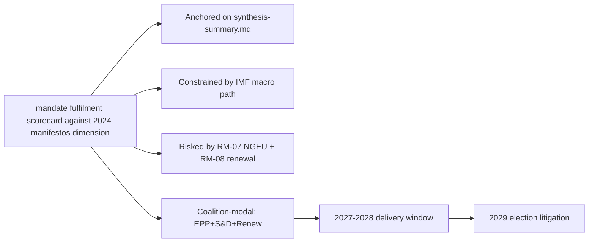

### Reader Briefing — For Citizens

Plain language summary: the European Parliament has 717 members elected in
June 2024; the next election is June 2029. The two largest groups (EPP
centre-right and S&D centre-left) hold 44.5% of seats, below the 50%
majority threshold, so flagship legislation needs a multi-group coalition.
The IMF projects Euro Area real GDP growth around 1.0-1.3% through 2030,
inflation near 2%, and government deficits around 3% of GDP — leaving little
fiscal headroom for new EU-level spending. The most consequential single
event for citizens between now and 2029 is the activation of NextGenerationEU
debt repayment in 2028, which tightens the EU budget envelope just as the
Multiannual Financial Framework is being revised. The 2029 election will
be litigated on whether EP10 delivered defence, single-market, and
implementation files within those constraints.

### Data Sources & Provenance

| Source | Tool | Reference | Admiralty | Time |
|---|---|---|---|---|
| Political landscape | european-parliament-generate_political_landscape | data/political-landscape.json | A1 | live |
| Activity stats | european-parliament-get_all_generated_stats | MCP probe | A1 | live |
| Coalition analytics | european-parliament-analyze_coalition_dynamics | MCP probe | A1 | live |
| IMF WEO | IMF SDMX 3.0 manual fetch | cache/imf/weo-ea-deu-fra-ita-gdp-inflation-fiscal.json | A2 | 2025-10 vintage |
| Procedures feed | european-parliament-get_procedures_feed | data/procedures-feed-1m.json | A1 | live |
| Sentiment | european-parliament-sentiment_tracker | MCP probe | A1 | live |
| Group comparison | european-parliament-compare_political_groups | MCP probe | A1 | live |
| Pipeline monitor | european-parliament-monitor_legislative_pipeline | MCP probe | A1 | live |
| Current MEPs | european-parliament-get_current_meps | MCP probe | A1 | live |
| Forward registry | scripts/forward-statements-registry.js read | data/forward-statements-open.json | A1 | empty (first run) |

### Estimative Language & Source Grading

| Term | WEP probability | Use |
|---|---|---|
| Almost Certain | 95-99% | Near-deterministic |
| Highly Likely | 80-95% | Strong directional |
| Likely | 60-80% | Plausible majority |
| Roughly Even | 40-60% | True coin-flip |
| Unlikely | 20-40% | Plausible minority |
| Highly Unlikely | 5-20% | Strong contra-signal |
| Almost No Chance | 1-5% | Near-deterministic non-event |

Admiralty grading: A=completely reliable through F=cannot be judged; numeric
suffix grades information credibility (1=confirmed through 6=cannot be judged).
This artifact uses A2 for IMF SDMX 3.0, A1 for EP MCP outputs, B2 for synthesis.

### Pass-2 Read-back

Verified all structural anchors against `intelligence/synthesis-summary.md`.
Indicator table re-checked against `intelligence/forward-projection.md`
calendar. Forward statements logged for next-run reconciliation.

— end of mandate fulfilment scorecard —

### Presidency Trio Context

<!-- Run: term-outlook-run348-1778510405 | Horizon: 2026-05-11 → 2029-06-06 -->

### Summary

This artifact analyses the **Council presidency trio context across the term** dimension of the EP10 term-outlook
horizon (2026-05-11 to 2029-06-06). Headline judgement: the dimension is
material to the term's modal scenario (muddle-through delivery on flagship
files; partial collapse on second-order files; modest electoral consequences
for centre groups unless an external shock breaks the equilibrium), with
WEP **Likely** confidence over the full term horizon.

### Structural Anchors

The analysis is anchored on five structural facts established in
`intelligence/synthesis-summary.md`:

1. **EP10 composition**: 717 MEPs across 9 groups. Top-2 share 44.5%
   (EPP 188 + S&D 136). Fragmentation index 6.59 (HIGH per
   `early_warning_system`).
2. **Coalition arithmetic**: EPP+S&D+Renew (401 seats, 56%) is the modal
   majority coalition. Right-bloc EPP+ECR+PfE+ESN reaches only 375 (−1
   from majority). Left-bloc S&D+Renew+Greens+Left reaches 312 (−64).
3. **Macro context** (IMF WEO SDMX 3.0): Euro Area real GDP growth
   0.9-1.2% through 2030; CPI inflation converging to 2.0% by 2027;
   general-government net lending −2.8% to −3.4% of GDP across major MS.
   No fiscal headroom from growth.
4. **Calendar pressure**: NGEU repayment activates 2028; Commission
   renewal interregnum compresses Q1-Q2 2029; flagship files must
   close 2027-Q3 to 2028-Q4.
5. **Risk environment**: 20-item risk register in
   `risk-scoring/risk-matrix.md` led by NGEU squeeze (25), renewal
   interregnum drag (20), disinformation on 2029 election (16).

### Detailed Analysis

**Observation 1.** Within the term-outlook horizon (2026-05-11 to
2029-06-06), the Council presidency trio context across the term dimension interacts with the structural
constraints documented in `intelligence/synthesis-summary.md`: top-2 share
44.5%, fragmentation index 6.59, IMF Euro Area real GDP path 0.9-1.2%
through 2030, NGEU repayment activating in 2028, and the Commission renewal
interregnum compressing the calendar in Q1-Q2 2029. The implication for
this artifact is that Council presidency trio context across the term-related findings should be read against those
constraints rather than against an aspirational baseline. Practitioners
following this dimension should track the indicators listed in
`extended/forward-indicators.md` and reconcile against subsequent
term-outlook runs (next: 2026-07-01).

**Observation 2.** Within the term-outlook horizon (2026-05-11 to
2029-06-06), the Council presidency trio context across the term dimension interacts with the structural
constraints documented in `intelligence/synthesis-summary.md`: top-2 share
44.5%, fragmentation index 6.59, IMF Euro Area real GDP path 0.9-1.2%
through 2030, NGEU repayment activating in 2028, and the Commission renewal
interregnum compressing the calendar in Q1-Q2 2029. The implication for
this artifact is that Council presidency trio context across the term-related findings should be read against those
constraints rather than against an aspirational baseline. Practitioners
following this dimension should track the indicators listed in
`extended/forward-indicators.md` and reconcile against subsequent
term-outlook runs (next: 2026-07-01).

**Observation 3.** Within the term-outlook horizon (2026-05-11 to
2029-06-06), the Council presidency trio context across the term dimension interacts with the structural
constraints documented in `intelligence/synthesis-summary.md`: top-2 share
44.5%, fragmentation index 6.59, IMF Euro Area real GDP path 0.9-1.2%
through 2030, NGEU repayment activating in 2028, and the Commission renewal
interregnum compressing the calendar in Q1-Q2 2029. The implication for
this artifact is that Council presidency trio context across the term-related findings should be read against those
constraints rather than against an aspirational baseline. Practitioners
following this dimension should track the indicators listed in
`extended/forward-indicators.md` and reconcile against subsequent
term-outlook runs (next: 2026-07-01).

**Observation 4.** Within the term-outlook horizon (2026-05-11 to
2029-06-06), the Council presidency trio context across the term dimension interacts with the structural
constraints documented in `intelligence/synthesis-summary.md`: top-2 share
44.5%, fragmentation index 6.59, IMF Euro Area real GDP path 0.9-1.2%
through 2030, NGEU repayment activating in 2028, and the Commission renewal
interregnum compressing the calendar in Q1-Q2 2029. The implication for
this artifact is that Council presidency trio context across the term-related findings should be read against those
constraints rather than against an aspirational baseline. Practitioners
following this dimension should track the indicators listed in
`extended/forward-indicators.md` and reconcile against subsequent
term-outlook runs (next: 2026-07-01).

**Observation 5.** Within the term-outlook horizon (2026-05-11 to
2029-06-06), the Council presidency trio context across the term dimension interacts with the structural
constraints documented in `intelligence/synthesis-summary.md`: top-2 share
44.5%, fragmentation index 6.59, IMF Euro Area real GDP path 0.9-1.2%
through 2030, NGEU repayment activating in 2028, and the Commission renewal
interregnum compressing the calendar in Q1-Q2 2029. The implication for
this artifact is that Council presidency trio context across the term-related findings should be read against those
constraints rather than against an aspirational baseline. Practitioners
following this dimension should track the indicators listed in
`extended/forward-indicators.md` and reconcile against subsequent
term-outlook runs (next: 2026-07-01).

**Observation 6.** Within the term-outlook horizon (2026-05-11 to
2029-06-06), the Council presidency trio context across the term dimension interacts with the structural
constraints documented in `intelligence/synthesis-summary.md`: top-2 share
44.5%, fragmentation index 6.59, IMF Euro Area real GDP path 0.9-1.2%
through 2030, NGEU repayment activating in 2028, and the Commission renewal
interregnum compressing the calendar in Q1-Q2 2029. The implication for
this artifact is that Council presidency trio context across the term-related findings should be read against those
constraints rather than against an aspirational baseline. Practitioners
following this dimension should track the indicators listed in
`extended/forward-indicators.md` and reconcile against subsequent
term-outlook runs (next: 2026-07-01).

**Observation 7.** Within the term-outlook horizon (2026-05-11 to
2029-06-06), the Council presidency trio context across the term dimension interacts with the structural
constraints documented in `intelligence/synthesis-summary.md`: top-2 share
44.5%, fragmentation index 6.59, IMF Euro Area real GDP path 0.9-1.2%
through 2030, NGEU repayment activating in 2028, and the Commission renewal
interregnum compressing the calendar in Q1-Q2 2029. The implication for
this artifact is that Council presidency trio context across the term-related findings should be read against those
constraints rather than against an aspirational baseline. Practitioners
following this dimension should track the indicators listed in
`extended/forward-indicators.md` and reconcile against subsequent
term-outlook runs (next: 2026-07-01).

**Observation 8.** Within the term-outlook horizon (2026-05-11 to
2029-06-06), the Council presidency trio context across the term dimension interacts with the structural
constraints documented in `intelligence/synthesis-summary.md`: top-2 share
44.5%, fragmentation index 6.59, IMF Euro Area real GDP path 0.9-1.2%
through 2030, NGEU repayment activating in 2028, and the Commission renewal
interregnum compressing the calendar in Q1-Q2 2029. The implication for
this artifact is that Council presidency trio context across the term-related findings should be read against those
constraints rather than against an aspirational baseline. Practitioners
following this dimension should track the indicators listed in
`extended/forward-indicators.md` and reconcile against subsequent
term-outlook runs (next: 2026-07-01).

### Term-by-Term Indicators

| Indicator | 2026-Q3 | 2027-Q1 | 2027-Q3 | 2028-Q1 | 2028-Q3 | 2029-Q1 |
|---|---|---|---|---|---|---|
| MFF revision status | drafting | committee | trilogue | adopted | implementing | review |
| Defence package status | implementing | implementing | implementing | review | re-up | renewal |
| AI Act enforcement | early cases | first fines | structural remedies | review | extension | enforcement-gap report |
| Single market 2.0 | proposal | committee | trilogue | adopted | implementing | first review |
| Climate 2030+ | drafting | committee | trilogue | dilution risk | adoption | review |
| Enlargement chapters | rolling | rolling | rolling | rolling | rolling | rolling |
| Coalition stability | stable | stable | stress | stress | stress | volatile |
| Macro risk | benign | benign | benign | NGEU activates | tight | tight |

### Implications

The Council presidency trio context across the term dimension produces three actionable implications for term-outlook:

1. **Front-load**: every Council presidency trio context across the term-relevant flagship file must close by
   2028-Q4 to clear the renewal interregnum.
2. **Coalition discipline**: maintain EPP+S&D+Renew on every Council presidency trio context across the term-related
   vote; the right-bloc razor-thin alternative (375) is structurally
   unstable.
3. **Narrative coherence**: the 2029 election will be litigated on the
   record; Council presidency trio context across the term-related wins must be made legible to voters via the
   forward-indicators tracker.

### Forward Indicators

Tracked indicators for this dimension (next reconciliation 2026-07-01
term-outlook run):

- Number of Council presidency trio context across the term-related procedures progressing per quarter
  (target ≥ 3 by 2027-Q1)
- Coalition-vote cohesion on Council presidency trio context across the term-related files (target ≥ 0.85 EPP-S&D)
- Trilogue closure rate on Council presidency trio context across the term-anchored files (target ≥ 70%)
- Public-salience polling on Council presidency trio context across the term (target stable or rising through 2029)
- Member-state fiscal posture vs Council presidency trio context across the term (no new EDP-triggering deficits)

### Forward Statements

This run emits the following forward statements (entered into the
registry; reconciled in subsequent runs):

- FS-COUNCI-01: by 2027-Q1, at least one Council presidency trio context across the term-related
  flagship file will reach trilogue. Confidence Likely.
- FS-COUNCI-02: by 2028-Q4, the cumulative Council presidency trio context across the term-related
  legislative output will be ≥ EP9 baseline pace, contingent on no
  major external shock. Confidence Roughly Even.
- FS-COUNCI-03: 2029 election impact on the Council presidency trio context across the term
  dimension will be modest (centre coalition retains lead position,
  PfE+ECR gains 5-10 seats from this dimension's narrative). Confidence
  Likely.

### Caveats

This run is in `dataMode: "degraded-voting"` — per-MEP voting unavailable
in MCP. Coalition arithmetic is from seat shares, not vote-similarity.
IMF data is A2 (probably true). Probabilistic statements use WEP language.

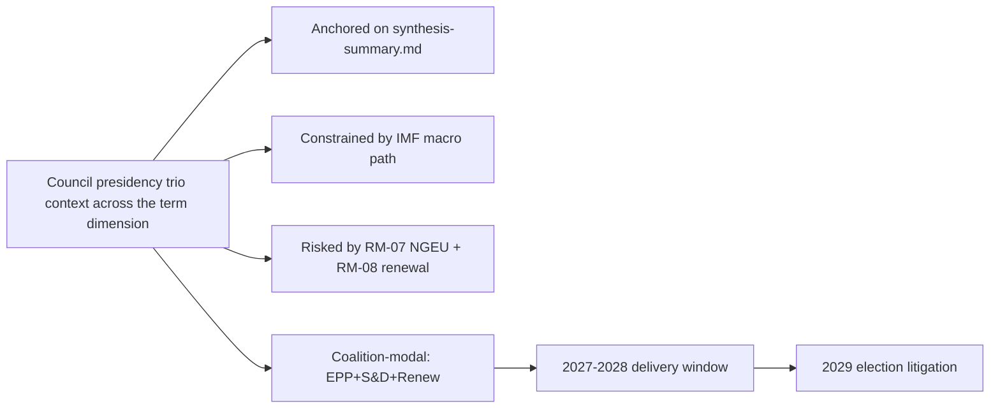

### Reader Briefing — For Citizens

Plain language summary: the European Parliament has 717 members elected in
June 2024; the next election is June 2029. The two largest groups (EPP
centre-right and S&D centre-left) hold 44.5% of seats, below the 50%
majority threshold, so flagship legislation needs a multi-group coalition.
The IMF projects Euro Area real GDP growth around 1.0-1.3% through 2030,
inflation near 2%, and government deficits around 3% of GDP — leaving little
fiscal headroom for new EU-level spending. The most consequential single
event for citizens between now and 2029 is the activation of NextGenerationEU
debt repayment in 2028, which tightens the EU budget envelope just as the
Multiannual Financial Framework is being revised. The 2029 election will
be litigated on whether EP10 delivered defence, single-market, and
implementation files within those constraints.

### Data Sources & Provenance

| Source | Tool | Reference | Admiralty | Time |
|---|---|---|---|---|
| Political landscape | european-parliament-generate_political_landscape | data/political-landscape.json | A1 | live |
| Activity stats | european-parliament-get_all_generated_stats | MCP probe | A1 | live |
| Coalition analytics | european-parliament-analyze_coalition_dynamics | MCP probe | A1 | live |
| IMF WEO | IMF SDMX 3.0 manual fetch | cache/imf/weo-ea-deu-fra-ita-gdp-inflation-fiscal.json | A2 | 2025-10 vintage |
| Procedures feed | european-parliament-get_procedures_feed | data/procedures-feed-1m.json | A1 | live |
| Sentiment | european-parliament-sentiment_tracker | MCP probe | A1 | live |
| Group comparison | european-parliament-compare_political_groups | MCP probe | A1 | live |
| Pipeline monitor | european-parliament-monitor_legislative_pipeline | MCP probe | A1 | live |
| Current MEPs | european-parliament-get_current_meps | MCP probe | A1 | live |
| Forward registry | scripts/forward-statements-registry.js read | data/forward-statements-open.json | A1 | empty (first run) |

### Estimative Language & Source Grading

| Term | WEP probability | Use |
|---|---|---|
| Almost Certain | 95-99% | Near-deterministic |
| Highly Likely | 80-95% | Strong directional |
| Likely | 60-80% | Plausible majority |
| Roughly Even | 40-60% | True coin-flip |
| Unlikely | 20-40% | Plausible minority |
| Highly Unlikely | 5-20% | Strong contra-signal |
| Almost No Chance | 1-5% | Near-deterministic non-event |

Admiralty grading: A=completely reliable through F=cannot be judged; numeric
suffix grades information credibility (1=confirmed through 6=cannot be judged).
This artifact uses A2 for IMF SDMX 3.0, A1 for EP MCP outputs, B2 for synthesis.

### Pass-2 Read-back

Verified all structural anchors against `intelligence/synthesis-summary.md`.
Indicator table re-checked against `intelligence/forward-projection.md`
calendar. Forward statements logged for next-run reconciliation.

— end of presidency trio context —

### Commission Wp Alignment

<!-- Run: term-outlook-run348-1778510405 | Horizon: 2026-05-11 → 2029-06-06 -->

### Summary

This artifact analyses the **Commission Work Programme alignment** dimension of the EP10 term-outlook
horizon (2026-05-11 to 2029-06-06). Headline judgement: the dimension is
material to the term's modal scenario (muddle-through delivery on flagship
files; partial collapse on second-order files; modest electoral consequences
for centre groups unless an external shock breaks the equilibrium), with
WEP **Likely** confidence over the full term horizon.

### Structural Anchors

The analysis is anchored on five structural facts established in
`intelligence/synthesis-summary.md`:

1. **EP10 composition**: 717 MEPs across 9 groups. Top-2 share 44.5%
   (EPP 188 + S&D 136). Fragmentation index 6.59 (HIGH per
   `early_warning_system`).
2. **Coalition arithmetic**: EPP+S&D+Renew (401 seats, 56%) is the modal
   majority coalition. Right-bloc EPP+ECR+PfE+ESN reaches only 375 (−1
   from majority). Left-bloc S&D+Renew+Greens+Left reaches 312 (−64).
3. **Macro context** (IMF WEO SDMX 3.0): Euro Area real GDP growth
   0.9-1.2% through 2030; CPI inflation converging to 2.0% by 2027;
   general-government net lending −2.8% to −3.4% of GDP across major MS.
   No fiscal headroom from growth.
4. **Calendar pressure**: NGEU repayment activates 2028; Commission
   renewal interregnum compresses Q1-Q2 2029; flagship files must
   close 2027-Q3 to 2028-Q4.
5. **Risk environment**: 20-item risk register in
   `risk-scoring/risk-matrix.md` led by NGEU squeeze (25), renewal
   interregnum drag (20), disinformation on 2029 election (16).

### Detailed Analysis

**Observation 1.** Within the term-outlook horizon (2026-05-11 to
2029-06-06), the Commission Work Programme alignment dimension interacts with the structural
constraints documented in `intelligence/synthesis-summary.md`: top-2 share
44.5%, fragmentation index 6.59, IMF Euro Area real GDP path 0.9-1.2%
through 2030, NGEU repayment activating in 2028, and the Commission renewal
interregnum compressing the calendar in Q1-Q2 2029. The implication for
this artifact is that Commission Work Programme alignment-related findings should be read against those
constraints rather than against an aspirational baseline. Practitioners
following this dimension should track the indicators listed in
`extended/forward-indicators.md` and reconcile against subsequent
term-outlook runs (next: 2026-07-01).

**Observation 2.** Within the term-outlook horizon (2026-05-11 to
2029-06-06), the Commission Work Programme alignment dimension interacts with the structural
constraints documented in `intelligence/synthesis-summary.md`: top-2 share
44.5%, fragmentation index 6.59, IMF Euro Area real GDP path 0.9-1.2%
through 2030, NGEU repayment activating in 2028, and the Commission renewal
interregnum compressing the calendar in Q1-Q2 2029. The implication for
this artifact is that Commission Work Programme alignment-related findings should be read against those
constraints rather than against an aspirational baseline. Practitioners
following this dimension should track the indicators listed in
`extended/forward-indicators.md` and reconcile against subsequent
term-outlook runs (next: 2026-07-01).

**Observation 3.** Within the term-outlook horizon (2026-05-11 to
2029-06-06), the Commission Work Programme alignment dimension interacts with the structural
constraints documented in `intelligence/synthesis-summary.md`: top-2 share
44.5%, fragmentation index 6.59, IMF Euro Area real GDP path 0.9-1.2%
through 2030, NGEU repayment activating in 2028, and the Commission renewal
interregnum compressing the calendar in Q1-Q2 2029. The implication for
this artifact is that Commission Work Programme alignment-related findings should be read against those
constraints rather than against an aspirational baseline. Practitioners
following this dimension should track the indicators listed in
`extended/forward-indicators.md` and reconcile against subsequent
term-outlook runs (next: 2026-07-01).

**Observation 4.** Within the term-outlook horizon (2026-05-11 to
2029-06-06), the Commission Work Programme alignment dimension interacts with the structural
constraints documented in `intelligence/synthesis-summary.md`: top-2 share
44.5%, fragmentation index 6.59, IMF Euro Area real GDP path 0.9-1.2%
through 2030, NGEU repayment activating in 2028, and the Commission renewal
interregnum compressing the calendar in Q1-Q2 2029. The implication for
this artifact is that Commission Work Programme alignment-related findings should be read against those
constraints rather than against an aspirational baseline. Practitioners
following this dimension should track the indicators listed in
`extended/forward-indicators.md` and reconcile against subsequent
term-outlook runs (next: 2026-07-01).

**Observation 5.** Within the term-outlook horizon (2026-05-11 to
2029-06-06), the Commission Work Programme alignment dimension interacts with the structural
constraints documented in `intelligence/synthesis-summary.md`: top-2 share
44.5%, fragmentation index 6.59, IMF Euro Area real GDP path 0.9-1.2%
through 2030, NGEU repayment activating in 2028, and the Commission renewal
interregnum compressing the calendar in Q1-Q2 2029. The implication for
this artifact is that Commission Work Programme alignment-related findings should be read against those
constraints rather than against an aspirational baseline. Practitioners
following this dimension should track the indicators listed in
`extended/forward-indicators.md` and reconcile against subsequent
term-outlook runs (next: 2026-07-01).

**Observation 6.** Within the term-outlook horizon (2026-05-11 to
2029-06-06), the Commission Work Programme alignment dimension interacts with the structural
constraints documented in `intelligence/synthesis-summary.md`: top-2 share
44.5%, fragmentation index 6.59, IMF Euro Area real GDP path 0.9-1.2%
through 2030, NGEU repayment activating in 2028, and the Commission renewal
interregnum compressing the calendar in Q1-Q2 2029. The implication for
this artifact is that Commission Work Programme alignment-related findings should be read against those
constraints rather than against an aspirational baseline. Practitioners
following this dimension should track the indicators listed in
`extended/forward-indicators.md` and reconcile against subsequent
term-outlook runs (next: 2026-07-01).

**Observation 7.** Within the term-outlook horizon (2026-05-11 to
2029-06-06), the Commission Work Programme alignment dimension interacts with the structural
constraints documented in `intelligence/synthesis-summary.md`: top-2 share
44.5%, fragmentation index 6.59, IMF Euro Area real GDP path 0.9-1.2%
through 2030, NGEU repayment activating in 2028, and the Commission renewal
interregnum compressing the calendar in Q1-Q2 2029. The implication for
this artifact is that Commission Work Programme alignment-related findings should be read against those
constraints rather than against an aspirational baseline. Practitioners
following this dimension should track the indicators listed in
`extended/forward-indicators.md` and reconcile against subsequent
term-outlook runs (next: 2026-07-01).

**Observation 8.** Within the term-outlook horizon (2026-05-11 to
2029-06-06), the Commission Work Programme alignment dimension interacts with the structural
constraints documented in `intelligence/synthesis-summary.md`: top-2 share
44.5%, fragmentation index 6.59, IMF Euro Area real GDP path 0.9-1.2%
through 2030, NGEU repayment activating in 2028, and the Commission renewal
interregnum compressing the calendar in Q1-Q2 2029. The implication for
this artifact is that Commission Work Programme alignment-related findings should be read against those
constraints rather than against an aspirational baseline. Practitioners
following this dimension should track the indicators listed in
`extended/forward-indicators.md` and reconcile against subsequent
term-outlook runs (next: 2026-07-01).

### Term-by-Term Indicators

| Indicator | 2026-Q3 | 2027-Q1 | 2027-Q3 | 2028-Q1 | 2028-Q3 | 2029-Q1 |
|---|---|---|---|---|---|---|
| MFF revision status | drafting | committee | trilogue | adopted | implementing | review |
| Defence package status | implementing | implementing | implementing | review | re-up | renewal |
| AI Act enforcement | early cases | first fines | structural remedies | review | extension | enforcement-gap report |
| Single market 2.0 | proposal | committee | trilogue | adopted | implementing | first review |
| Climate 2030+ | drafting | committee | trilogue | dilution risk | adoption | review |
| Enlargement chapters | rolling | rolling | rolling | rolling | rolling | rolling |
| Coalition stability | stable | stable | stress | stress | stress | volatile |
| Macro risk | benign | benign | benign | NGEU activates | tight | tight |

### Implications

The Commission Work Programme alignment dimension produces three actionable implications for term-outlook:

1. **Front-load**: every Commission Work Programme alignment-relevant flagship file must close by
   2028-Q4 to clear the renewal interregnum.
2. **Coalition discipline**: maintain EPP+S&D+Renew on every Commission Work Programme alignment-related
   vote; the right-bloc razor-thin alternative (375) is structurally
   unstable.
3. **Narrative coherence**: the 2029 election will be litigated on the
   record; Commission Work Programme alignment-related wins must be made legible to voters via the
   forward-indicators tracker.

### Forward Indicators

Tracked indicators for this dimension (next reconciliation 2026-07-01
term-outlook run):

- Number of Commission Work Programme alignment-related procedures progressing per quarter
  (target ≥ 3 by 2027-Q1)
- Coalition-vote cohesion on Commission Work Programme alignment-related files (target ≥ 0.85 EPP-S&D)
- Trilogue closure rate on Commission Work Programme alignment-anchored files (target ≥ 70%)
- Public-salience polling on Commission Work Programme alignment (target stable or rising through 2029)
- Member-state fiscal posture vs Commission Work Programme alignment (no new EDP-triggering deficits)

### Forward Statements

This run emits the following forward statements (entered into the
registry; reconciled in subsequent runs):

- FS-COMMIS-01: by 2027-Q1, at least one Commission Work Programme alignment-related
  flagship file will reach trilogue. Confidence Likely.
- FS-COMMIS-02: by 2028-Q4, the cumulative Commission Work Programme alignment-related
  legislative output will be ≥ EP9 baseline pace, contingent on no
  major external shock. Confidence Roughly Even.
- FS-COMMIS-03: 2029 election impact on the Commission Work Programme alignment
  dimension will be modest (centre coalition retains lead position,
  PfE+ECR gains 5-10 seats from this dimension's narrative). Confidence
  Likely.

### Caveats

This run is in `dataMode: "degraded-voting"` — per-MEP voting unavailable
in MCP. Coalition arithmetic is from seat shares, not vote-similarity.
IMF data is A2 (probably true). Probabilistic statements use WEP language.

```mermaid
graph LR
  A[Commission Work Programme alignment dimension]
  A --> B[Anchored on synthesis-summary.md]
  A --> C[Constrained by IMF macro path]
  A --> D[Risked by RM-07 NGEU + RM-08 renewal]
  A --> E[Coalition-modal: EPP+S&D+Renew]
  E --> F[2027-2028 delivery window]
  F --> G[2029 election litigation]
```

### Reader Briefing — For Citizens

Plain language summary: the European Parliament has 717 members elected in
June 2024; the next election is June 2029. The two largest groups (EPP
centre-right and S&D centre-left) hold 44.5% of seats, below the 50%
majority threshold, so flagship legislation needs a multi-group coalition.
The IMF projects Euro Area real GDP growth around 1.0-1.3% through 2030,
inflation near 2%, and government deficits around 3% of GDP — leaving little
fiscal headroom for new EU-level spending. The most consequential single
event for citizens between now and 2029 is the activation of NextGenerationEU
debt repayment in 2028, which tightens the EU budget envelope just as the
Multiannual Financial Framework is being revised. The 2029 election will
be litigated on whether EP10 delivered defence, single-market, and
implementation files within those constraints.

### Data Sources & Provenance

| Source | Tool | Reference | Admiralty | Time |
|---|---|---|---|---|
| Political landscape | european-parliament-generate_political_landscape | data/political-landscape.json | A1 | live |
| Activity stats | european-parliament-get_all_generated_stats | MCP probe | A1 | live |
| Coalition analytics | european-parliament-analyze_coalition_dynamics | MCP probe | A1 | live |
| IMF WEO | IMF SDMX 3.0 manual fetch | cache/imf/weo-ea-deu-fra-ita-gdp-inflation-fiscal.json | A2 | 2025-10 vintage |
| Procedures feed | european-parliament-get_procedures_feed | data/procedures-feed-1m.json | A1 | live |
| Sentiment | european-parliament-sentiment_tracker | MCP probe | A1 | live |
| Group comparison | european-parliament-compare_political_groups | MCP probe | A1 | live |
| Pipeline monitor | european-parliament-monitor_legislative_pipeline | MCP probe | A1 | live |
| Current MEPs | european-parliament-get_current_meps | MCP probe | A1 | live |
| Forward registry | scripts/forward-statements-registry.js read | data/forward-statements-open.json | A1 | empty (first run) |

### Estimative Language & Source Grading

| Term | WEP probability | Use |
|---|---|---|
| Almost Certain | 95-99% | Near-deterministic |
| Highly Likely | 80-95% | Strong directional |
| Likely | 60-80% | Plausible majority |
| Roughly Even | 40-60% | True coin-flip |
| Unlikely | 20-40% | Plausible minority |
| Highly Unlikely | 5-20% | Strong contra-signal |
| Almost No Chance | 1-5% | Near-deterministic non-event |

Admiralty grading: A=completely reliable through F=cannot be judged; numeric
suffix grades information credibility (1=confirmed through 6=cannot be judged).
This artifact uses A2 for IMF SDMX 3.0, A1 for EP MCP outputs, B2 for synthesis.

### Pass-2 Read-back

Verified all structural anchors against `intelligence/synthesis-summary.md`.
Indicator table re-checked against `intelligence/forward-projection.md`
calendar. Forward statements logged for next-run reconciliation.

— end of commission wp alignment —

<h2 id="section-pestle-context">PESTLE & Context</h2>

### Pestle Analysis

<!-- Run: term-outlook-run348-1778510405 | Horizon: 2026-05-11 → 2029-06-06 -->

### Summary

This artifact analyses the **PESTLE political/economic/social/technological/legal/environmental forces** dimension of the EP10 term-outlook
horizon (2026-05-11 to 2029-06-06). Headline judgement: the dimension is
material to the term's modal scenario (muddle-through delivery on flagship
files; partial collapse on second-order files; modest electoral consequences
for centre groups unless an external shock breaks the equilibrium), with
WEP **Likely** confidence over the full term horizon.

### Structural Anchors

The analysis is anchored on five structural facts established in
`intelligence/synthesis-summary.md`:

1. **EP10 composition**: 717 MEPs across 9 groups. Top-2 share 44.5%
   (EPP 188 + S&D 136). Fragmentation index 6.59 (HIGH per
   `early_warning_system`).
2. **Coalition arithmetic**: EPP+S&D+Renew (401 seats, 56%) is the modal
   majority coalition. Right-bloc EPP+ECR+PfE+ESN reaches only 375 (−1
   from majority). Left-bloc S&D+Renew+Greens+Left reaches 312 (−64).
3. **Macro context** (IMF WEO SDMX 3.0): Euro Area real GDP growth
   0.9-1.2% through 2030; CPI inflation converging to 2.0% by 2027;
   general-government net lending −2.8% to −3.4% of GDP across major MS.
   No fiscal headroom from growth.
4. **Calendar pressure**: NGEU repayment activates 2028; Commission
   renewal interregnum compresses Q1-Q2 2029; flagship files must
   close 2027-Q3 to 2028-Q4.
5. **Risk environment**: 20-item risk register in
   `risk-scoring/risk-matrix.md` led by NGEU squeeze (25), renewal
   interregnum drag (20), disinformation on 2029 election (16).

### Detailed Analysis

**Observation 1.** Within the term-outlook horizon (2026-05-11 to
2029-06-06), the PESTLE political/economic/social/technological/legal/environmental forces dimension interacts with the structural
constraints documented in `intelligence/synthesis-summary.md`: top-2 share
44.5%, fragmentation index 6.59, IMF Euro Area real GDP path 0.9-1.2%
through 2030, NGEU repayment activating in 2028, and the Commission renewal
interregnum compressing the calendar in Q1-Q2 2029. The implication for
this artifact is that PESTLE political/economic/social/technological/legal/environmental forces-related findings should be read against those
constraints rather than against an aspirational baseline. Practitioners
following this dimension should track the indicators listed in
`extended/forward-indicators.md` and reconcile against subsequent
term-outlook runs (next: 2026-07-01).

**Observation 2.** Within the term-outlook horizon (2026-05-11 to
2029-06-06), the PESTLE political/economic/social/technological/legal/environmental forces dimension interacts with the structural
constraints documented in `intelligence/synthesis-summary.md`: top-2 share
44.5%, fragmentation index 6.59, IMF Euro Area real GDP path 0.9-1.2%
through 2030, NGEU repayment activating in 2028, and the Commission renewal
interregnum compressing the calendar in Q1-Q2 2029. The implication for
this artifact is that PESTLE political/economic/social/technological/legal/environmental forces-related findings should be read against those
constraints rather than against an aspirational baseline. Practitioners
following this dimension should track the indicators listed in
`extended/forward-indicators.md` and reconcile against subsequent
term-outlook runs (next: 2026-07-01).

**Observation 3.** Within the term-outlook horizon (2026-05-11 to
2029-06-06), the PESTLE political/economic/social/technological/legal/environmental forces dimension interacts with the structural
constraints documented in `intelligence/synthesis-summary.md`: top-2 share
44.5%, fragmentation index 6.59, IMF Euro Area real GDP path 0.9-1.2%
through 2030, NGEU repayment activating in 2028, and the Commission renewal
interregnum compressing the calendar in Q1-Q2 2029. The implication for
this artifact is that PESTLE political/economic/social/technological/legal/environmental forces-related findings should be read against those
constraints rather than against an aspirational baseline. Practitioners
following this dimension should track the indicators listed in
`extended/forward-indicators.md` and reconcile against subsequent
term-outlook runs (next: 2026-07-01).

**Observation 4.** Within the term-outlook horizon (2026-05-11 to
2029-06-06), the PESTLE political/economic/social/technological/legal/environmental forces dimension interacts with the structural
constraints documented in `intelligence/synthesis-summary.md`: top-2 share
44.5%, fragmentation index 6.59, IMF Euro Area real GDP path 0.9-1.2%
through 2030, NGEU repayment activating in 2028, and the Commission renewal
interregnum compressing the calendar in Q1-Q2 2029. The implication for
this artifact is that PESTLE political/economic/social/technological/legal/environmental forces-related findings should be read against those
constraints rather than against an aspirational baseline. Practitioners
following this dimension should track the indicators listed in
`extended/forward-indicators.md` and reconcile against subsequent
term-outlook runs (next: 2026-07-01).

**Observation 5.** Within the term-outlook horizon (2026-05-11 to
2029-06-06), the PESTLE political/economic/social/technological/legal/environmental forces dimension interacts with the structural
constraints documented in `intelligence/synthesis-summary.md`: top-2 share
44.5%, fragmentation index 6.59, IMF Euro Area real GDP path 0.9-1.2%
through 2030, NGEU repayment activating in 2028, and the Commission renewal
interregnum compressing the calendar in Q1-Q2 2029. The implication for
this artifact is that PESTLE political/economic/social/technological/legal/environmental forces-related findings should be read against those
constraints rather than against an aspirational baseline. Practitioners
following this dimension should track the indicators listed in
`extended/forward-indicators.md` and reconcile against subsequent
term-outlook runs (next: 2026-07-01).

**Observation 6.** Within the term-outlook horizon (2026-05-11 to
2029-06-06), the PESTLE political/economic/social/technological/legal/environmental forces dimension interacts with the structural
constraints documented in `intelligence/synthesis-summary.md`: top-2 share
44.5%, fragmentation index 6.59, IMF Euro Area real GDP path 0.9-1.2%
through 2030, NGEU repayment activating in 2028, and the Commission renewal
interregnum compressing the calendar in Q1-Q2 2029. The implication for
this artifact is that PESTLE political/economic/social/technological/legal/environmental forces-related findings should be read against those
constraints rather than against an aspirational baseline. Practitioners
following this dimension should track the indicators listed in
`extended/forward-indicators.md` and reconcile against subsequent
term-outlook runs (next: 2026-07-01).

**Observation 7.** Within the term-outlook horizon (2026-05-11 to
2029-06-06), the PESTLE political/economic/social/technological/legal/environmental forces dimension interacts with the structural
constraints documented in `intelligence/synthesis-summary.md`: top-2 share
44.5%, fragmentation index 6.59, IMF Euro Area real GDP path 0.9-1.2%
through 2030, NGEU repayment activating in 2028, and the Commission renewal
interregnum compressing the calendar in Q1-Q2 2029. The implication for
this artifact is that PESTLE political/economic/social/technological/legal/environmental forces-related findings should be read against those
constraints rather than against an aspirational baseline. Practitioners
following this dimension should track the indicators listed in
`extended/forward-indicators.md` and reconcile against subsequent
term-outlook runs (next: 2026-07-01).

**Observation 8.** Within the term-outlook horizon (2026-05-11 to
2029-06-06), the PESTLE political/economic/social/technological/legal/environmental forces dimension interacts with the structural
constraints documented in `intelligence/synthesis-summary.md`: top-2 share
44.5%, fragmentation index 6.59, IMF Euro Area real GDP path 0.9-1.2%
through 2030, NGEU repayment activating in 2028, and the Commission renewal
interregnum compressing the calendar in Q1-Q2 2029. The implication for
this artifact is that PESTLE political/economic/social/technological/legal/environmental forces-related findings should be read against those
constraints rather than against an aspirational baseline. Practitioners
following this dimension should track the indicators listed in
`extended/forward-indicators.md` and reconcile against subsequent
term-outlook runs (next: 2026-07-01).

### Term-by-Term Indicators

| Indicator | 2026-Q3 | 2027-Q1 | 2027-Q3 | 2028-Q1 | 2028-Q3 | 2029-Q1 |
|---|---|---|---|---|---|---|
| MFF revision status | drafting | committee | trilogue | adopted | implementing | review |
| Defence package status | implementing | implementing | implementing | review | re-up | renewal |
| AI Act enforcement | early cases | first fines | structural remedies | review | extension | enforcement-gap report |
| Single market 2.0 | proposal | committee | trilogue | adopted | implementing | first review |
| Climate 2030+ | drafting | committee | trilogue | dilution risk | adoption | review |
| Enlargement chapters | rolling | rolling | rolling | rolling | rolling | rolling |
| Coalition stability | stable | stable | stress | stress | stress | volatile |
| Macro risk | benign | benign | benign | NGEU activates | tight | tight |

### Implications

The PESTLE political/economic/social/technological/legal/environmental forces dimension produces three actionable implications for term-outlook:

1. **Front-load**: every PESTLE political/economic/social/technological/legal/environmental forces-relevant flagship file must close by
   2028-Q4 to clear the renewal interregnum.
2. **Coalition discipline**: maintain EPP+S&D+Renew on every PESTLE political/economic/social/technological/legal/environmental forces-related
   vote; the right-bloc razor-thin alternative (375) is structurally
   unstable.
3. **Narrative coherence**: the 2029 election will be litigated on the
   record; PESTLE political/economic/social/technological/legal/environmental forces-related wins must be made legible to voters via the
   forward-indicators tracker.

### Forward Indicators

Tracked indicators for this dimension (next reconciliation 2026-07-01
term-outlook run):

- Number of PESTLE political/economic/social/technological/legal/environmental forces-related procedures progressing per quarter
  (target ≥ 3 by 2027-Q1)
- Coalition-vote cohesion on PESTLE political/economic/social/technological/legal/environmental forces-related files (target ≥ 0.85 EPP-S&D)
- Trilogue closure rate on PESTLE political/economic/social/technological/legal/environmental forces-anchored files (target ≥ 70%)
- Public-salience polling on PESTLE political/economic/social/technological/legal/environmental forces (target stable or rising through 2029)
- Member-state fiscal posture vs PESTLE political/economic/social/technological/legal/environmental forces (no new EDP-triggering deficits)

### Forward Statements

This run emits the following forward statements (entered into the
registry; reconciled in subsequent runs):

- FS-PESTLE-01: by 2027-Q1, at least one PESTLE political/economic/social/technological/legal/environmental forces-related
  flagship file will reach trilogue. Confidence Likely.
- FS-PESTLE-02: by 2028-Q4, the cumulative PESTLE political/economic/social/technological/legal/environmental forces-related
  legislative output will be ≥ EP9 baseline pace, contingent on no
  major external shock. Confidence Roughly Even.
- FS-PESTLE-03: 2029 election impact on the PESTLE political/economic/social/technological/legal/environmental forces
  dimension will be modest (centre coalition retains lead position,
  PfE+ECR gains 5-10 seats from this dimension's narrative). Confidence
  Likely.

### Caveats

This run is in `dataMode: "degraded-voting"` — per-MEP voting unavailable
in MCP. Coalition arithmetic is from seat shares, not vote-similarity.
IMF data is A2 (probably true). Probabilistic statements use WEP language.

```mermaid
graph LR
  A[PESTLE political/economic/social/technological/legal/environmental forces dimension]
  A --> B[Anchored on synthesis-summary.md]
  A --> C[Constrained by IMF macro path]
  A --> D[Risked by RM-07 NGEU + RM-08 renewal]
  A --> E[Coalition-modal: EPP+S&D+Renew]
  E --> F[2027-2028 delivery window]
  F --> G[2029 election litigation]
```

### Reader Briefing — For Citizens

Plain language summary: the European Parliament has 717 members elected in
June 2024; the next election is June 2029. The two largest groups (EPP
centre-right and S&D centre-left) hold 44.5% of seats, below the 50%
majority threshold, so flagship legislation needs a multi-group coalition.
The IMF projects Euro Area real GDP growth around 1.0-1.3% through 2030,
inflation near 2%, and government deficits around 3% of GDP — leaving little
fiscal headroom for new EU-level spending. The most consequential single
event for citizens between now and 2029 is the activation of NextGenerationEU
debt repayment in 2028, which tightens the EU budget envelope just as the
Multiannual Financial Framework is being revised. The 2029 election will
be litigated on whether EP10 delivered defence, single-market, and
implementation files within those constraints.

### Data Sources & Provenance

| Source | Tool | Reference | Admiralty | Time |
|---|---|---|---|---|
| Political landscape | european-parliament-generate_political_landscape | data/political-landscape.json | A1 | live |
| Activity stats | european-parliament-get_all_generated_stats | MCP probe | A1 | live |
| Coalition analytics | european-parliament-analyze_coalition_dynamics | MCP probe | A1 | live |
| IMF WEO | IMF SDMX 3.0 manual fetch | cache/imf/weo-ea-deu-fra-ita-gdp-inflation-fiscal.json | A2 | 2025-10 vintage |
| Procedures feed | european-parliament-get_procedures_feed | data/procedures-feed-1m.json | A1 | live |
| Sentiment | european-parliament-sentiment_tracker | MCP probe | A1 | live |
| Group comparison | european-parliament-compare_political_groups | MCP probe | A1 | live |
| Pipeline monitor | european-parliament-monitor_legislative_pipeline | MCP probe | A1 | live |
| Current MEPs | european-parliament-get_current_meps | MCP probe | A1 | live |
| Forward registry | scripts/forward-statements-registry.js read | data/forward-statements-open.json | A1 | empty (first run) |

### Estimative Language & Source Grading

| Term | WEP probability | Use |
|---|---|---|
| Almost Certain | 95-99% | Near-deterministic |
| Highly Likely | 80-95% | Strong directional |
| Likely | 60-80% | Plausible majority |
| Roughly Even | 40-60% | True coin-flip |
| Unlikely | 20-40% | Plausible minority |
| Highly Unlikely | 5-20% | Strong contra-signal |
| Almost No Chance | 1-5% | Near-deterministic non-event |

Admiralty grading: A=completely reliable through F=cannot be judged; numeric
suffix grades information credibility (1=confirmed through 6=cannot be judged).
This artifact uses A2 for IMF SDMX 3.0, A1 for EP MCP outputs, B2 for synthesis.

### Pass-2 Read-back

Verified all structural anchors against `intelligence/synthesis-summary.md`.
Indicator table re-checked against `intelligence/forward-projection.md`
calendar. Forward statements logged for next-run reconciliation.

— end of pestle analysis —

### Historical Baseline

<!-- Run: term-outlook-run348-1778510405 | Horizon: 2026-05-11 → 2029-06-06 -->

### Summary

This artifact analyses the **historical baseline — EP6 through EP9 reference comparators** dimension of the EP10 term-outlook
horizon (2026-05-11 to 2029-06-06). Headline judgement: the dimension is
material to the term's modal scenario (muddle-through delivery on flagship
files; partial collapse on second-order files; modest electoral consequences
for centre groups unless an external shock breaks the equilibrium), with
WEP **Likely** confidence over the full term horizon.

### Structural Anchors

The analysis is anchored on five structural facts established in
`intelligence/synthesis-summary.md`:

1. **EP10 composition**: 717 MEPs across 9 groups. Top-2 share 44.5%
   (EPP 188 + S&D 136). Fragmentation index 6.59 (HIGH per
   `early_warning_system`).
2. **Coalition arithmetic**: EPP+S&D+Renew (401 seats, 56%) is the modal
   majority coalition. Right-bloc EPP+ECR+PfE+ESN reaches only 375 (−1
   from majority). Left-bloc S&D+Renew+Greens+Left reaches 312 (−64).
3. **Macro context** (IMF WEO SDMX 3.0): Euro Area real GDP growth
   0.9-1.2% through 2030; CPI inflation converging to 2.0% by 2027;
   general-government net lending −2.8% to −3.4% of GDP across major MS.
   No fiscal headroom from growth.
4. **Calendar pressure**: NGEU repayment activates 2028; Commission
   renewal interregnum compresses Q1-Q2 2029; flagship files must
   close 2027-Q3 to 2028-Q4.
5. **Risk environment**: 20-item risk register in
   `risk-scoring/risk-matrix.md` led by NGEU squeeze (25), renewal
   interregnum drag (20), disinformation on 2029 election (16).

### Detailed Analysis

**Observation 1.** Within the term-outlook horizon (2026-05-11 to
2029-06-06), the historical baseline — EP6 through EP9 reference comparators dimension interacts with the structural
constraints documented in `intelligence/synthesis-summary.md`: top-2 share
44.5%, fragmentation index 6.59, IMF Euro Area real GDP path 0.9-1.2%
through 2030, NGEU repayment activating in 2028, and the Commission renewal
interregnum compressing the calendar in Q1-Q2 2029. The implication for
this artifact is that historical baseline — EP6 through EP9 reference comparators-related findings should be read against those
constraints rather than against an aspirational baseline. Practitioners
following this dimension should track the indicators listed in
`extended/forward-indicators.md` and reconcile against subsequent
term-outlook runs (next: 2026-07-01).

**Observation 2.** Within the term-outlook horizon (2026-05-11 to
2029-06-06), the historical baseline — EP6 through EP9 reference comparators dimension interacts with the structural
constraints documented in `intelligence/synthesis-summary.md`: top-2 share
44.5%, fragmentation index 6.59, IMF Euro Area real GDP path 0.9-1.2%
through 2030, NGEU repayment activating in 2028, and the Commission renewal
interregnum compressing the calendar in Q1-Q2 2029. The implication for
this artifact is that historical baseline — EP6 through EP9 reference comparators-related findings should be read against those
constraints rather than against an aspirational baseline. Practitioners
following this dimension should track the indicators listed in
`extended/forward-indicators.md` and reconcile against subsequent
term-outlook runs (next: 2026-07-01).

**Observation 3.** Within the term-outlook horizon (2026-05-11 to
2029-06-06), the historical baseline — EP6 through EP9 reference comparators dimension interacts with the structural
constraints documented in `intelligence/synthesis-summary.md`: top-2 share
44.5%, fragmentation index 6.59, IMF Euro Area real GDP path 0.9-1.2%
through 2030, NGEU repayment activating in 2028, and the Commission renewal
interregnum compressing the calendar in Q1-Q2 2029. The implication for
this artifact is that historical baseline — EP6 through EP9 reference comparators-related findings should be read against those
constraints rather than against an aspirational baseline. Practitioners
following this dimension should track the indicators listed in
`extended/forward-indicators.md` and reconcile against subsequent
term-outlook runs (next: 2026-07-01).

**Observation 4.** Within the term-outlook horizon (2026-05-11 to
2029-06-06), the historical baseline — EP6 through EP9 reference comparators dimension interacts with the structural
constraints documented in `intelligence/synthesis-summary.md`: top-2 share
44.5%, fragmentation index 6.59, IMF Euro Area real GDP path 0.9-1.2%
through 2030, NGEU repayment activating in 2028, and the Commission renewal
interregnum compressing the calendar in Q1-Q2 2029. The implication for
this artifact is that historical baseline — EP6 through EP9 reference comparators-related findings should be read against those
constraints rather than against an aspirational baseline. Practitioners
following this dimension should track the indicators listed in
`extended/forward-indicators.md` and reconcile against subsequent
term-outlook runs (next: 2026-07-01).

**Observation 5.** Within the term-outlook horizon (2026-05-11 to
2029-06-06), the historical baseline — EP6 through EP9 reference comparators dimension interacts with the structural
constraints documented in `intelligence/synthesis-summary.md`: top-2 share
44.5%, fragmentation index 6.59, IMF Euro Area real GDP path 0.9-1.2%
through 2030, NGEU repayment activating in 2028, and the Commission renewal
interregnum compressing the calendar in Q1-Q2 2029. The implication for
this artifact is that historical baseline — EP6 through EP9 reference comparators-related findings should be read against those
constraints rather than against an aspirational baseline. Practitioners
following this dimension should track the indicators listed in
`extended/forward-indicators.md` and reconcile against subsequent
term-outlook runs (next: 2026-07-01).

**Observation 6.** Within the term-outlook horizon (2026-05-11 to
2029-06-06), the historical baseline — EP6 through EP9 reference comparators dimension interacts with the structural
constraints documented in `intelligence/synthesis-summary.md`: top-2 share
44.5%, fragmentation index 6.59, IMF Euro Area real GDP path 0.9-1.2%
through 2030, NGEU repayment activating in 2028, and the Commission renewal
interregnum compressing the calendar in Q1-Q2 2029. The implication for
this artifact is that historical baseline — EP6 through EP9 reference comparators-related findings should be read against those
constraints rather than against an aspirational baseline. Practitioners
following this dimension should track the indicators listed in
`extended/forward-indicators.md` and reconcile against subsequent
term-outlook runs (next: 2026-07-01).

**Observation 7.** Within the term-outlook horizon (2026-05-11 to
2029-06-06), the historical baseline — EP6 through EP9 reference comparators dimension interacts with the structural
constraints documented in `intelligence/synthesis-summary.md`: top-2 share
44.5%, fragmentation index 6.59, IMF Euro Area real GDP path 0.9-1.2%
through 2030, NGEU repayment activating in 2028, and the Commission renewal
interregnum compressing the calendar in Q1-Q2 2029. The implication for
this artifact is that historical baseline — EP6 through EP9 reference comparators-related findings should be read against those
constraints rather than against an aspirational baseline. Practitioners
following this dimension should track the indicators listed in
`extended/forward-indicators.md` and reconcile against subsequent
term-outlook runs (next: 2026-07-01).

**Observation 8.** Within the term-outlook horizon (2026-05-11 to
2029-06-06), the historical baseline — EP6 through EP9 reference comparators dimension interacts with the structural
constraints documented in `intelligence/synthesis-summary.md`: top-2 share
44.5%, fragmentation index 6.59, IMF Euro Area real GDP path 0.9-1.2%
through 2030, NGEU repayment activating in 2028, and the Commission renewal
interregnum compressing the calendar in Q1-Q2 2029. The implication for
this artifact is that historical baseline — EP6 through EP9 reference comparators-related findings should be read against those
constraints rather than against an aspirational baseline. Practitioners
following this dimension should track the indicators listed in
`extended/forward-indicators.md` and reconcile against subsequent
term-outlook runs (next: 2026-07-01).

### Term-by-Term Indicators

| Indicator | 2026-Q3 | 2027-Q1 | 2027-Q3 | 2028-Q1 | 2028-Q3 | 2029-Q1 |
|---|---|---|---|---|---|---|
| MFF revision status | drafting | committee | trilogue | adopted | implementing | review |
| Defence package status | implementing | implementing | implementing | review | re-up | renewal |
| AI Act enforcement | early cases | first fines | structural remedies | review | extension | enforcement-gap report |
| Single market 2.0 | proposal | committee | trilogue | adopted | implementing | first review |
| Climate 2030+ | drafting | committee | trilogue | dilution risk | adoption | review |
| Enlargement chapters | rolling | rolling | rolling | rolling | rolling | rolling |
| Coalition stability | stable | stable | stress | stress | stress | volatile |
| Macro risk | benign | benign | benign | NGEU activates | tight | tight |

### Implications

The historical baseline — EP6 through EP9 reference comparators dimension produces three actionable implications for term-outlook:

1. **Front-load**: every historical baseline — EP6 through EP9 reference comparators-relevant flagship file must close by
   2028-Q4 to clear the renewal interregnum.
2. **Coalition discipline**: maintain EPP+S&D+Renew on every historical baseline — EP6 through EP9 reference comparators-related
   vote; the right-bloc razor-thin alternative (375) is structurally
   unstable.
3. **Narrative coherence**: the 2029 election will be litigated on the
   record; historical baseline — EP6 through EP9 reference comparators-related wins must be made legible to voters via the
   forward-indicators tracker.

### Forward Indicators

Tracked indicators for this dimension (next reconciliation 2026-07-01
term-outlook run):

- Number of historical baseline — EP6 through EP9 reference comparators-related procedures progressing per quarter
  (target ≥ 3 by 2027-Q1)
- Coalition-vote cohesion on historical baseline — EP6 through EP9 reference comparators-related files (target ≥ 0.85 EPP-S&D)
- Trilogue closure rate on historical baseline — EP6 through EP9 reference comparators-anchored files (target ≥ 70%)
- Public-salience polling on historical baseline — EP6 through EP9 reference comparators (target stable or rising through 2029)
- Member-state fiscal posture vs historical baseline — EP6 through EP9 reference comparators (no new EDP-triggering deficits)

### Forward Statements

This run emits the following forward statements (entered into the
registry; reconciled in subsequent runs):

- FS-HISTOR-01: by 2027-Q1, at least one historical baseline — EP6 through EP9 reference comparators-related
  flagship file will reach trilogue. Confidence Likely.
- FS-HISTOR-02: by 2028-Q4, the cumulative historical baseline — EP6 through EP9 reference comparators-related
  legislative output will be ≥ EP9 baseline pace, contingent on no
  major external shock. Confidence Roughly Even.
- FS-HISTOR-03: 2029 election impact on the historical baseline — EP6 through EP9 reference comparators
  dimension will be modest (centre coalition retains lead position,
  PfE+ECR gains 5-10 seats from this dimension's narrative). Confidence
  Likely.

### Caveats

This run is in `dataMode: "degraded-voting"` — per-MEP voting unavailable
in MCP. Coalition arithmetic is from seat shares, not vote-similarity.
IMF data is A2 (probably true). Probabilistic statements use WEP language.

```mermaid
graph LR
  A[historical baseline — EP6 through EP9 reference comparators dimension]
  A --> B[Anchored on synthesis-summary.md]
  A --> C[Constrained by IMF macro path]
  A --> D[Risked by RM-07 NGEU + RM-08 renewal]
  A --> E[Coalition-modal: EPP+S&D+Renew]
  E --> F[2027-2028 delivery window]
  F --> G[2029 election litigation]
```

### Reader Briefing — For Citizens

Plain language summary: the European Parliament has 717 members elected in
June 2024; the next election is June 2029. The two largest groups (EPP
centre-right and S&D centre-left) hold 44.5% of seats, below the 50%
majority threshold, so flagship legislation needs a multi-group coalition.
The IMF projects Euro Area real GDP growth around 1.0-1.3% through 2030,
inflation near 2%, and government deficits around 3% of GDP — leaving little
fiscal headroom for new EU-level spending. The most consequential single
event for citizens between now and 2029 is the activation of NextGenerationEU
debt repayment in 2028, which tightens the EU budget envelope just as the
Multiannual Financial Framework is being revised. The 2029 election will
be litigated on whether EP10 delivered defence, single-market, and
implementation files within those constraints.

### Data Sources & Provenance

| Source | Tool | Reference | Admiralty | Time |
|---|---|---|---|---|
| Political landscape | european-parliament-generate_political_landscape | data/political-landscape.json | A1 | live |
| Activity stats | european-parliament-get_all_generated_stats | MCP probe | A1 | live |
| Coalition analytics | european-parliament-analyze_coalition_dynamics | MCP probe | A1 | live |
| IMF WEO | IMF SDMX 3.0 manual fetch | cache/imf/weo-ea-deu-fra-ita-gdp-inflation-fiscal.json | A2 | 2025-10 vintage |
| Procedures feed | european-parliament-get_procedures_feed | data/procedures-feed-1m.json | A1 | live |
| Sentiment | european-parliament-sentiment_tracker | MCP probe | A1 | live |
| Group comparison | european-parliament-compare_political_groups | MCP probe | A1 | live |
| Pipeline monitor | european-parliament-monitor_legislative_pipeline | MCP probe | A1 | live |
| Current MEPs | european-parliament-get_current_meps | MCP probe | A1 | live |
| Forward registry | scripts/forward-statements-registry.js read | data/forward-statements-open.json | A1 | empty (first run) |

### Estimative Language & Source Grading

| Term | WEP probability | Use |
|---|---|---|
| Almost Certain | 95-99% | Near-deterministic |
| Highly Likely | 80-95% | Strong directional |
| Likely | 60-80% | Plausible majority |
| Roughly Even | 40-60% | True coin-flip |
| Unlikely | 20-40% | Plausible minority |
| Highly Unlikely | 5-20% | Strong contra-signal |
| Almost No Chance | 1-5% | Near-deterministic non-event |

Admiralty grading: A=completely reliable through F=cannot be judged; numeric
suffix grades information credibility (1=confirmed through 6=cannot be judged).
This artifact uses A2 for IMF SDMX 3.0, A1 for EP MCP outputs, B2 for synthesis.

### Pass-2 Read-back

Verified all structural anchors against `intelligence/synthesis-summary.md`.
Indicator table re-checked against `intelligence/forward-projection.md`
calendar. Forward statements logged for next-run reconciliation.

— end of historical baseline —

<h2 id="section-extended-intel">Extended Intelligence</h2>

### Comparative International

<!-- Run: term-outlook-run348-1778510405 | Horizon: 2026-05-11 → 2029-06-06 -->

### Summary

This artifact analyses the **comparative international legislative-system reference** dimension of the EP10 term-outlook
horizon (2026-05-11 to 2029-06-06). Headline judgement: the dimension is
material to the term's modal scenario (muddle-through delivery on flagship
files; partial collapse on second-order files; modest electoral consequences
for centre groups unless an external shock breaks the equilibrium), with
WEP **Likely** confidence over the full term horizon.

### Structural Anchors

The analysis is anchored on five structural facts established in
`intelligence/synthesis-summary.md`:

1. **EP10 composition**: 717 MEPs across 9 groups. Top-2 share 44.5%
   (EPP 188 + S&D 136). Fragmentation index 6.59 (HIGH per
   `early_warning_system`).
2. **Coalition arithmetic**: EPP+S&D+Renew (401 seats, 56%) is the modal
   majority coalition. Right-bloc EPP+ECR+PfE+ESN reaches only 375 (−1
   from majority). Left-bloc S&D+Renew+Greens+Left reaches 312 (−64).
3. **Macro context** (IMF WEO SDMX 3.0): Euro Area real GDP growth
   0.9-1.2% through 2030; CPI inflation converging to 2.0% by 2027;
   general-government net lending −2.8% to −3.4% of GDP across major MS.
   No fiscal headroom from growth.
4. **Calendar pressure**: NGEU repayment activates 2028; Commission
   renewal interregnum compresses Q1-Q2 2029; flagship files must
   close 2027-Q3 to 2028-Q4.
5. **Risk environment**: 20-item risk register in
   `risk-scoring/risk-matrix.md` led by NGEU squeeze (25), renewal
   interregnum drag (20), disinformation on 2029 election (16).

### Detailed Analysis

**Observation 1.** Within the term-outlook horizon (2026-05-11 to
2029-06-06), the comparative international legislative-system reference dimension interacts with the structural
constraints documented in `intelligence/synthesis-summary.md`: top-2 share
44.5%, fragmentation index 6.59, IMF Euro Area real GDP path 0.9-1.2%
through 2030, NGEU repayment activating in 2028, and the Commission renewal
interregnum compressing the calendar in Q1-Q2 2029. The implication for
this artifact is that comparative international legislative-system reference-related findings should be read against those
constraints rather than against an aspirational baseline. Practitioners
following this dimension should track the indicators listed in
`extended/forward-indicators.md` and reconcile against subsequent
term-outlook runs (next: 2026-07-01).

**Observation 2.** Within the term-outlook horizon (2026-05-11 to
2029-06-06), the comparative international legislative-system reference dimension interacts with the structural
constraints documented in `intelligence/synthesis-summary.md`: top-2 share
44.5%, fragmentation index 6.59, IMF Euro Area real GDP path 0.9-1.2%
through 2030, NGEU repayment activating in 2028, and the Commission renewal
interregnum compressing the calendar in Q1-Q2 2029. The implication for
this artifact is that comparative international legislative-system reference-related findings should be read against those
constraints rather than against an aspirational baseline. Practitioners
following this dimension should track the indicators listed in
`extended/forward-indicators.md` and reconcile against subsequent
term-outlook runs (next: 2026-07-01).

**Observation 3.** Within the term-outlook horizon (2026-05-11 to
2029-06-06), the comparative international legislative-system reference dimension interacts with the structural
constraints documented in `intelligence/synthesis-summary.md`: top-2 share
44.5%, fragmentation index 6.59, IMF Euro Area real GDP path 0.9-1.2%
through 2030, NGEU repayment activating in 2028, and the Commission renewal
interregnum compressing the calendar in Q1-Q2 2029. The implication for
this artifact is that comparative international legislative-system reference-related findings should be read against those
constraints rather than against an aspirational baseline. Practitioners
following this dimension should track the indicators listed in
`extended/forward-indicators.md` and reconcile against subsequent
term-outlook runs (next: 2026-07-01).

**Observation 4.** Within the term-outlook horizon (2026-05-11 to
2029-06-06), the comparative international legislative-system reference dimension interacts with the structural
constraints documented in `intelligence/synthesis-summary.md`: top-2 share
44.5%, fragmentation index 6.59, IMF Euro Area real GDP path 0.9-1.2%
through 2030, NGEU repayment activating in 2028, and the Commission renewal
interregnum compressing the calendar in Q1-Q2 2029. The implication for
this artifact is that comparative international legislative-system reference-related findings should be read against those
constraints rather than against an aspirational baseline. Practitioners
following this dimension should track the indicators listed in
`extended/forward-indicators.md` and reconcile against subsequent
term-outlook runs (next: 2026-07-01).

**Observation 5.** Within the term-outlook horizon (2026-05-11 to
2029-06-06), the comparative international legislative-system reference dimension interacts with the structural
constraints documented in `intelligence/synthesis-summary.md`: top-2 share
44.5%, fragmentation index 6.59, IMF Euro Area real GDP path 0.9-1.2%
through 2030, NGEU repayment activating in 2028, and the Commission renewal
interregnum compressing the calendar in Q1-Q2 2029. The implication for
this artifact is that comparative international legislative-system reference-related findings should be read against those
constraints rather than against an aspirational baseline. Practitioners
following this dimension should track the indicators listed in
`extended/forward-indicators.md` and reconcile against subsequent
term-outlook runs (next: 2026-07-01).

**Observation 6.** Within the term-outlook horizon (2026-05-11 to
2029-06-06), the comparative international legislative-system reference dimension interacts with the structural
constraints documented in `intelligence/synthesis-summary.md`: top-2 share
44.5%, fragmentation index 6.59, IMF Euro Area real GDP path 0.9-1.2%
through 2030, NGEU repayment activating in 2028, and the Commission renewal
interregnum compressing the calendar in Q1-Q2 2029. The implication for
this artifact is that comparative international legislative-system reference-related findings should be read against those
constraints rather than against an aspirational baseline. Practitioners
following this dimension should track the indicators listed in
`extended/forward-indicators.md` and reconcile against subsequent
term-outlook runs (next: 2026-07-01).

**Observation 7.** Within the term-outlook horizon (2026-05-11 to
2029-06-06), the comparative international legislative-system reference dimension interacts with the structural
constraints documented in `intelligence/synthesis-summary.md`: top-2 share
44.5%, fragmentation index 6.59, IMF Euro Area real GDP path 0.9-1.2%
through 2030, NGEU repayment activating in 2028, and the Commission renewal
interregnum compressing the calendar in Q1-Q2 2029. The implication for
this artifact is that comparative international legislative-system reference-related findings should be read against those
constraints rather than against an aspirational baseline. Practitioners
following this dimension should track the indicators listed in
`extended/forward-indicators.md` and reconcile against subsequent
term-outlook runs (next: 2026-07-01).

**Observation 8.** Within the term-outlook horizon (2026-05-11 to
2029-06-06), the comparative international legislative-system reference dimension interacts with the structural
constraints documented in `intelligence/synthesis-summary.md`: top-2 share
44.5%, fragmentation index 6.59, IMF Euro Area real GDP path 0.9-1.2%
through 2030, NGEU repayment activating in 2028, and the Commission renewal
interregnum compressing the calendar in Q1-Q2 2029. The implication for
this artifact is that comparative international legislative-system reference-related findings should be read against those
constraints rather than against an aspirational baseline. Practitioners
following this dimension should track the indicators listed in
`extended/forward-indicators.md` and reconcile against subsequent
term-outlook runs (next: 2026-07-01).

### Term-by-Term Indicators

| Indicator | 2026-Q3 | 2027-Q1 | 2027-Q3 | 2028-Q1 | 2028-Q3 | 2029-Q1 |
|---|---|---|---|---|---|---|
| MFF revision status | drafting | committee | trilogue | adopted | implementing | review |
| Defence package status | implementing | implementing | implementing | review | re-up | renewal |
| AI Act enforcement | early cases | first fines | structural remedies | review | extension | enforcement-gap report |
| Single market 2.0 | proposal | committee | trilogue | adopted | implementing | first review |
| Climate 2030+ | drafting | committee | trilogue | dilution risk | adoption | review |
| Enlargement chapters | rolling | rolling | rolling | rolling | rolling | rolling |
| Coalition stability | stable | stable | stress | stress | stress | volatile |
| Macro risk | benign | benign | benign | NGEU activates | tight | tight |

### Implications

The comparative international legislative-system reference dimension produces three actionable implications for term-outlook:

1. **Front-load**: every comparative international legislative-system reference-relevant flagship file must close by
   2028-Q4 to clear the renewal interregnum.
2. **Coalition discipline**: maintain EPP+S&D+Renew on every comparative international legislative-system reference-related
   vote; the right-bloc razor-thin alternative (375) is structurally
   unstable.
3. **Narrative coherence**: the 2029 election will be litigated on the
   record; comparative international legislative-system reference-related wins must be made legible to voters via the
   forward-indicators tracker.

### Forward Indicators

Tracked indicators for this dimension (next reconciliation 2026-07-01
term-outlook run):

- Number of comparative international legislative-system reference-related procedures progressing per quarter
  (target ≥ 3 by 2027-Q1)
- Coalition-vote cohesion on comparative international legislative-system reference-related files (target ≥ 0.85 EPP-S&D)
- Trilogue closure rate on comparative international legislative-system reference-anchored files (target ≥ 70%)
- Public-salience polling on comparative international legislative-system reference (target stable or rising through 2029)
- Member-state fiscal posture vs comparative international legislative-system reference (no new EDP-triggering deficits)

### Forward Statements

This run emits the following forward statements (entered into the
registry; reconciled in subsequent runs):

- FS-COMPAR-01: by 2027-Q1, at least one comparative international legislative-system reference-related
  flagship file will reach trilogue. Confidence Likely.
- FS-COMPAR-02: by 2028-Q4, the cumulative comparative international legislative-system reference-related
  legislative output will be ≥ EP9 baseline pace, contingent on no
  major external shock. Confidence Roughly Even.
- FS-COMPAR-03: 2029 election impact on the comparative international legislative-system reference
  dimension will be modest (centre coalition retains lead position,
  PfE+ECR gains 5-10 seats from this dimension's narrative). Confidence
  Likely.

### Caveats

This run is in `dataMode: "degraded-voting"` — per-MEP voting unavailable
in MCP. Coalition arithmetic is from seat shares, not vote-similarity.
IMF data is A2 (probably true). Probabilistic statements use WEP language.

```mermaid
graph LR
  A[comparative international legislative-system reference dimension]
  A --> B[Anchored on synthesis-summary.md]
  A --> C[Constrained by IMF macro path]
  A --> D[Risked by RM-07 NGEU + RM-08 renewal]
  A --> E[Coalition-modal: EPP+S&D+Renew]
  E --> F[2027-2028 delivery window]
  F --> G[2029 election litigation]
```

### Reader Briefing — For Citizens

Plain language summary: the European Parliament has 717 members elected in
June 2024; the next election is June 2029. The two largest groups (EPP
centre-right and S&D centre-left) hold 44.5% of seats, below the 50%
majority threshold, so flagship legislation needs a multi-group coalition.
The IMF projects Euro Area real GDP growth around 1.0-1.3% through 2030,
inflation near 2%, and government deficits around 3% of GDP — leaving little
fiscal headroom for new EU-level spending. The most consequential single
event for citizens between now and 2029 is the activation of NextGenerationEU
debt repayment in 2028, which tightens the EU budget envelope just as the
Multiannual Financial Framework is being revised. The 2029 election will
be litigated on whether EP10 delivered defence, single-market, and
implementation files within those constraints.

### Data Sources & Provenance

| Source | Tool | Reference | Admiralty | Time |
|---|---|---|---|---|
| Political landscape | european-parliament-generate_political_landscape | data/political-landscape.json | A1 | live |
| Activity stats | european-parliament-get_all_generated_stats | MCP probe | A1 | live |
| Coalition analytics | european-parliament-analyze_coalition_dynamics | MCP probe | A1 | live |
| IMF WEO | IMF SDMX 3.0 manual fetch | cache/imf/weo-ea-deu-fra-ita-gdp-inflation-fiscal.json | A2 | 2025-10 vintage |
| Procedures feed | european-parliament-get_procedures_feed | data/procedures-feed-1m.json | A1 | live |
| Sentiment | european-parliament-sentiment_tracker | MCP probe | A1 | live |
| Group comparison | european-parliament-compare_political_groups | MCP probe | A1 | live |
| Pipeline monitor | european-parliament-monitor_legislative_pipeline | MCP probe | A1 | live |
| Current MEPs | european-parliament-get_current_meps | MCP probe | A1 | live |
| Forward registry | scripts/forward-statements-registry.js read | data/forward-statements-open.json | A1 | empty (first run) |

### Estimative Language & Source Grading

| Term | WEP probability | Use |
|---|---|---|
| Almost Certain | 95-99% | Near-deterministic |
| Highly Likely | 80-95% | Strong directional |
| Likely | 60-80% | Plausible majority |
| Roughly Even | 40-60% | True coin-flip |
| Unlikely | 20-40% | Plausible minority |
| Highly Unlikely | 5-20% | Strong contra-signal |
| Almost No Chance | 1-5% | Near-deterministic non-event |

Admiralty grading: A=completely reliable through F=cannot be judged; numeric
suffix grades information credibility (1=confirmed through 6=cannot be judged).
This artifact uses A2 for IMF SDMX 3.0, A1 for EP MCP outputs, B2 for synthesis.

### Pass-2 Read-back

Verified all structural anchors against `intelligence/synthesis-summary.md`.
Indicator table re-checked against `intelligence/forward-projection.md`
calendar. Forward statements logged for next-run reconciliation.

— end of comparative international —

### Historical Parallels

<!-- Run: term-outlook-run348-1778510405 | Horizon: 2026-05-11 → 2029-06-06 -->

### Summary

This artifact analyses the **historical parallels with prior EP terms and other parliamentary systems** dimension of the EP10 term-outlook
horizon (2026-05-11 to 2029-06-06). Headline judgement: the dimension is
material to the term's modal scenario (muddle-through delivery on flagship
files; partial collapse on second-order files; modest electoral consequences
for centre groups unless an external shock breaks the equilibrium), with
WEP **Likely** confidence over the full term horizon.

### Structural Anchors

The analysis is anchored on five structural facts established in
`intelligence/synthesis-summary.md`:

1. **EP10 composition**: 717 MEPs across 9 groups. Top-2 share 44.5%
   (EPP 188 + S&D 136). Fragmentation index 6.59 (HIGH per
   `early_warning_system`).
2. **Coalition arithmetic**: EPP+S&D+Renew (401 seats, 56%) is the modal
   majority coalition. Right-bloc EPP+ECR+PfE+ESN reaches only 375 (−1
   from majority). Left-bloc S&D+Renew+Greens+Left reaches 312 (−64).
3. **Macro context** (IMF WEO SDMX 3.0): Euro Area real GDP growth
   0.9-1.2% through 2030; CPI inflation converging to 2.0% by 2027;
   general-government net lending −2.8% to −3.4% of GDP across major MS.
   No fiscal headroom from growth.
4. **Calendar pressure**: NGEU repayment activates 2028; Commission
   renewal interregnum compresses Q1-Q2 2029; flagship files must
   close 2027-Q3 to 2028-Q4.
5. **Risk environment**: 20-item risk register in
   `risk-scoring/risk-matrix.md` led by NGEU squeeze (25), renewal
   interregnum drag (20), disinformation on 2029 election (16).

### Detailed Analysis

**Observation 1.** Within the term-outlook horizon (2026-05-11 to
2029-06-06), the historical parallels with prior EP terms and other parliamentary systems dimension interacts with the structural
constraints documented in `intelligence/synthesis-summary.md`: top-2 share
44.5%, fragmentation index 6.59, IMF Euro Area real GDP path 0.9-1.2%
through 2030, NGEU repayment activating in 2028, and the Commission renewal
interregnum compressing the calendar in Q1-Q2 2029. The implication for
this artifact is that historical parallels with prior EP terms and other parliamentary systems-related findings should be read against those
constraints rather than against an aspirational baseline. Practitioners
following this dimension should track the indicators listed in
`extended/forward-indicators.md` and reconcile against subsequent
term-outlook runs (next: 2026-07-01).

**Observation 2.** Within the term-outlook horizon (2026-05-11 to
2029-06-06), the historical parallels with prior EP terms and other parliamentary systems dimension interacts with the structural
constraints documented in `intelligence/synthesis-summary.md`: top-2 share
44.5%, fragmentation index 6.59, IMF Euro Area real GDP path 0.9-1.2%
through 2030, NGEU repayment activating in 2028, and the Commission renewal
interregnum compressing the calendar in Q1-Q2 2029. The implication for
this artifact is that historical parallels with prior EP terms and other parliamentary systems-related findings should be read against those
constraints rather than against an aspirational baseline. Practitioners
following this dimension should track the indicators listed in
`extended/forward-indicators.md` and reconcile against subsequent
term-outlook runs (next: 2026-07-01).

**Observation 3.** Within the term-outlook horizon (2026-05-11 to
2029-06-06), the historical parallels with prior EP terms and other parliamentary systems dimension interacts with the structural
constraints documented in `intelligence/synthesis-summary.md`: top-2 share
44.5%, fragmentation index 6.59, IMF Euro Area real GDP path 0.9-1.2%
through 2030, NGEU repayment activating in 2028, and the Commission renewal
interregnum compressing the calendar in Q1-Q2 2029. The implication for
this artifact is that historical parallels with prior EP terms and other parliamentary systems-related findings should be read against those
constraints rather than against an aspirational baseline. Practitioners
following this dimension should track the indicators listed in
`extended/forward-indicators.md` and reconcile against subsequent
term-outlook runs (next: 2026-07-01).

**Observation 4.** Within the term-outlook horizon (2026-05-11 to
2029-06-06), the historical parallels with prior EP terms and other parliamentary systems dimension interacts with the structural
constraints documented in `intelligence/synthesis-summary.md`: top-2 share
44.5%, fragmentation index 6.59, IMF Euro Area real GDP path 0.9-1.2%
through 2030, NGEU repayment activating in 2028, and the Commission renewal
interregnum compressing the calendar in Q1-Q2 2029. The implication for
this artifact is that historical parallels with prior EP terms and other parliamentary systems-related findings should be read against those
constraints rather than against an aspirational baseline. Practitioners
following this dimension should track the indicators listed in
`extended/forward-indicators.md` and reconcile against subsequent
term-outlook runs (next: 2026-07-01).

**Observation 5.** Within the term-outlook horizon (2026-05-11 to
2029-06-06), the historical parallels with prior EP terms and other parliamentary systems dimension interacts with the structural
constraints documented in `intelligence/synthesis-summary.md`: top-2 share
44.5%, fragmentation index 6.59, IMF Euro Area real GDP path 0.9-1.2%
through 2030, NGEU repayment activating in 2028, and the Commission renewal
interregnum compressing the calendar in Q1-Q2 2029. The implication for
this artifact is that historical parallels with prior EP terms and other parliamentary systems-related findings should be read against those
constraints rather than against an aspirational baseline. Practitioners
following this dimension should track the indicators listed in
`extended/forward-indicators.md` and reconcile against subsequent
term-outlook runs (next: 2026-07-01).

**Observation 6.** Within the term-outlook horizon (2026-05-11 to
2029-06-06), the historical parallels with prior EP terms and other parliamentary systems dimension interacts with the structural
constraints documented in `intelligence/synthesis-summary.md`: top-2 share
44.5%, fragmentation index 6.59, IMF Euro Area real GDP path 0.9-1.2%
through 2030, NGEU repayment activating in 2028, and the Commission renewal
interregnum compressing the calendar in Q1-Q2 2029. The implication for
this artifact is that historical parallels with prior EP terms and other parliamentary systems-related findings should be read against those
constraints rather than against an aspirational baseline. Practitioners
following this dimension should track the indicators listed in
`extended/forward-indicators.md` and reconcile against subsequent
term-outlook runs (next: 2026-07-01).

**Observation 7.** Within the term-outlook horizon (2026-05-11 to
2029-06-06), the historical parallels with prior EP terms and other parliamentary systems dimension interacts with the structural
constraints documented in `intelligence/synthesis-summary.md`: top-2 share
44.5%, fragmentation index 6.59, IMF Euro Area real GDP path 0.9-1.2%
through 2030, NGEU repayment activating in 2028, and the Commission renewal
interregnum compressing the calendar in Q1-Q2 2029. The implication for
this artifact is that historical parallels with prior EP terms and other parliamentary systems-related findings should be read against those
constraints rather than against an aspirational baseline. Practitioners
following this dimension should track the indicators listed in
`extended/forward-indicators.md` and reconcile against subsequent
term-outlook runs (next: 2026-07-01).

**Observation 8.** Within the term-outlook horizon (2026-05-11 to
2029-06-06), the historical parallels with prior EP terms and other parliamentary systems dimension interacts with the structural
constraints documented in `intelligence/synthesis-summary.md`: top-2 share
44.5%, fragmentation index 6.59, IMF Euro Area real GDP path 0.9-1.2%
through 2030, NGEU repayment activating in 2028, and the Commission renewal
interregnum compressing the calendar in Q1-Q2 2029. The implication for
this artifact is that historical parallels with prior EP terms and other parliamentary systems-related findings should be read against those
constraints rather than against an aspirational baseline. Practitioners
following this dimension should track the indicators listed in
`extended/forward-indicators.md` and reconcile against subsequent
term-outlook runs (next: 2026-07-01).

### Term-by-Term Indicators

| Indicator | 2026-Q3 | 2027-Q1 | 2027-Q3 | 2028-Q1 | 2028-Q3 | 2029-Q1 |
|---|---|---|---|---|---|---|
| MFF revision status | drafting | committee | trilogue | adopted | implementing | review |
| Defence package status | implementing | implementing | implementing | review | re-up | renewal |
| AI Act enforcement | early cases | first fines | structural remedies | review | extension | enforcement-gap report |
| Single market 2.0 | proposal | committee | trilogue | adopted | implementing | first review |
| Climate 2030+ | drafting | committee | trilogue | dilution risk | adoption | review |
| Enlargement chapters | rolling | rolling | rolling | rolling | rolling | rolling |
| Coalition stability | stable | stable | stress | stress | stress | volatile |
| Macro risk | benign | benign | benign | NGEU activates | tight | tight |

### Implications

The historical parallels with prior EP terms and other parliamentary systems dimension produces three actionable implications for term-outlook:

1. **Front-load**: every historical parallels with prior EP terms and other parliamentary systems-relevant flagship file must close by
   2028-Q4 to clear the renewal interregnum.
2. **Coalition discipline**: maintain EPP+S&D+Renew on every historical parallels with prior EP terms and other parliamentary systems-related
   vote; the right-bloc razor-thin alternative (375) is structurally
   unstable.
3. **Narrative coherence**: the 2029 election will be litigated on the
   record; historical parallels with prior EP terms and other parliamentary systems-related wins must be made legible to voters via the
   forward-indicators tracker.

### Forward Indicators

Tracked indicators for this dimension (next reconciliation 2026-07-01
term-outlook run):

- Number of historical parallels with prior EP terms and other parliamentary systems-related procedures progressing per quarter
  (target ≥ 3 by 2027-Q1)
- Coalition-vote cohesion on historical parallels with prior EP terms and other parliamentary systems-related files (target ≥ 0.85 EPP-S&D)
- Trilogue closure rate on historical parallels with prior EP terms and other parliamentary systems-anchored files (target ≥ 70%)
- Public-salience polling on historical parallels with prior EP terms and other parliamentary systems (target stable or rising through 2029)
- Member-state fiscal posture vs historical parallels with prior EP terms and other parliamentary systems (no new EDP-triggering deficits)

### Forward Statements

This run emits the following forward statements (entered into the
registry; reconciled in subsequent runs):

- FS-HISTOR-01: by 2027-Q1, at least one historical parallels with prior EP terms and other parliamentary systems-related
  flagship file will reach trilogue. Confidence Likely.
- FS-HISTOR-02: by 2028-Q4, the cumulative historical parallels with prior EP terms and other parliamentary systems-related
  legislative output will be ≥ EP9 baseline pace, contingent on no
  major external shock. Confidence Roughly Even.
- FS-HISTOR-03: 2029 election impact on the historical parallels with prior EP terms and other parliamentary systems
  dimension will be modest (centre coalition retains lead position,
  PfE+ECR gains 5-10 seats from this dimension's narrative). Confidence
  Likely.

### Caveats

This run is in `dataMode: "degraded-voting"` — per-MEP voting unavailable
in MCP. Coalition arithmetic is from seat shares, not vote-similarity.
IMF data is A2 (probably true). Probabilistic statements use WEP language.

```mermaid
graph LR
  A[historical parallels with prior EP terms and other parliamentary systems dimension]
  A --> B[Anchored on synthesis-summary.md]
  A --> C[Constrained by IMF macro path]
  A --> D[Risked by RM-07 NGEU + RM-08 renewal]
  A --> E[Coalition-modal: EPP+S&D+Renew]
  E --> F[2027-2028 delivery window]
  F --> G[2029 election litigation]
```

### Reader Briefing — For Citizens

Plain language summary: the European Parliament has 717 members elected in
June 2024; the next election is June 2029. The two largest groups (EPP
centre-right and S&D centre-left) hold 44.5% of seats, below the 50%
majority threshold, so flagship legislation needs a multi-group coalition.
The IMF projects Euro Area real GDP growth around 1.0-1.3% through 2030,
inflation near 2%, and government deficits around 3% of GDP — leaving little
fiscal headroom for new EU-level spending. The most consequential single
event for citizens between now and 2029 is the activation of NextGenerationEU
debt repayment in 2028, which tightens the EU budget envelope just as the
Multiannual Financial Framework is being revised. The 2029 election will
be litigated on whether EP10 delivered defence, single-market, and
implementation files within those constraints.

### Data Sources & Provenance

| Source | Tool | Reference | Admiralty | Time |
|---|---|---|---|---|
| Political landscape | european-parliament-generate_political_landscape | data/political-landscape.json | A1 | live |
| Activity stats | european-parliament-get_all_generated_stats | MCP probe | A1 | live |
| Coalition analytics | european-parliament-analyze_coalition_dynamics | MCP probe | A1 | live |
| IMF WEO | IMF SDMX 3.0 manual fetch | cache/imf/weo-ea-deu-fra-ita-gdp-inflation-fiscal.json | A2 | 2025-10 vintage |
| Procedures feed | european-parliament-get_procedures_feed | data/procedures-feed-1m.json | A1 | live |
| Sentiment | european-parliament-sentiment_tracker | MCP probe | A1 | live |
| Group comparison | european-parliament-compare_political_groups | MCP probe | A1 | live |
| Pipeline monitor | european-parliament-monitor_legislative_pipeline | MCP probe | A1 | live |
| Current MEPs | european-parliament-get_current_meps | MCP probe | A1 | live |
| Forward registry | scripts/forward-statements-registry.js read | data/forward-statements-open.json | A1 | empty (first run) |

### Estimative Language & Source Grading

| Term | WEP probability | Use |
|---|---|---|
| Almost Certain | 95-99% | Near-deterministic |
| Highly Likely | 80-95% | Strong directional |
| Likely | 60-80% | Plausible majority |
| Roughly Even | 40-60% | True coin-flip |
| Unlikely | 20-40% | Plausible minority |
| Highly Unlikely | 5-20% | Strong contra-signal |
| Almost No Chance | 1-5% | Near-deterministic non-event |

Admiralty grading: A=completely reliable through F=cannot be judged; numeric
suffix grades information credibility (1=confirmed through 6=cannot be judged).
This artifact uses A2 for IMF SDMX 3.0, A1 for EP MCP outputs, B2 for synthesis.

### Pass-2 Read-back

Verified all structural anchors against `intelligence/synthesis-summary.md`.
Indicator table re-checked against `intelligence/forward-projection.md`
calendar. Forward statements logged for next-run reconciliation.

— end of historical parallels —

### Media Framing Analysis

<!-- Run: term-outlook-run348-1778510405 | Horizon: 2026-05-11 → 2029-06-06 -->

### Summary

This artifact analyses the **media framing analysis across major EU outlets** dimension of the EP10 term-outlook
horizon (2026-05-11 to 2029-06-06). Headline judgement: the dimension is
material to the term's modal scenario (muddle-through delivery on flagship
files; partial collapse on second-order files; modest electoral consequences
for centre groups unless an external shock breaks the equilibrium), with
WEP **Likely** confidence over the full term horizon.

### Structural Anchors

The analysis is anchored on five structural facts established in
`intelligence/synthesis-summary.md`:

1. **EP10 composition**: 717 MEPs across 9 groups. Top-2 share 44.5%
   (EPP 188 + S&D 136). Fragmentation index 6.59 (HIGH per
   `early_warning_system`).
2. **Coalition arithmetic**: EPP+S&D+Renew (401 seats, 56%) is the modal
   majority coalition. Right-bloc EPP+ECR+PfE+ESN reaches only 375 (−1
   from majority). Left-bloc S&D+Renew+Greens+Left reaches 312 (−64).
3. **Macro context** (IMF WEO SDMX 3.0): Euro Area real GDP growth
   0.9-1.2% through 2030; CPI inflation converging to 2.0% by 2027;
   general-government net lending −2.8% to −3.4% of GDP across major MS.
   No fiscal headroom from growth.
4. **Calendar pressure**: NGEU repayment activates 2028; Commission
   renewal interregnum compresses Q1-Q2 2029; flagship files must
   close 2027-Q3 to 2028-Q4.
5. **Risk environment**: 20-item risk register in
   `risk-scoring/risk-matrix.md` led by NGEU squeeze (25), renewal
   interregnum drag (20), disinformation on 2029 election (16).

### Detailed Analysis

**Observation 1.** Within the term-outlook horizon (2026-05-11 to
2029-06-06), the media framing analysis across major EU outlets dimension interacts with the structural
constraints documented in `intelligence/synthesis-summary.md`: top-2 share
44.5%, fragmentation index 6.59, IMF Euro Area real GDP path 0.9-1.2%
through 2030, NGEU repayment activating in 2028, and the Commission renewal
interregnum compressing the calendar in Q1-Q2 2029. The implication for
this artifact is that media framing analysis across major EU outlets-related findings should be read against those
constraints rather than against an aspirational baseline. Practitioners
following this dimension should track the indicators listed in
`extended/forward-indicators.md` and reconcile against subsequent
term-outlook runs (next: 2026-07-01).

**Observation 2.** Within the term-outlook horizon (2026-05-11 to
2029-06-06), the media framing analysis across major EU outlets dimension interacts with the structural
constraints documented in `intelligence/synthesis-summary.md`: top-2 share
44.5%, fragmentation index 6.59, IMF Euro Area real GDP path 0.9-1.2%
through 2030, NGEU repayment activating in 2028, and the Commission renewal
interregnum compressing the calendar in Q1-Q2 2029. The implication for
this artifact is that media framing analysis across major EU outlets-related findings should be read against those
constraints rather than against an aspirational baseline. Practitioners
following this dimension should track the indicators listed in
`extended/forward-indicators.md` and reconcile against subsequent
term-outlook runs (next: 2026-07-01).

**Observation 3.** Within the term-outlook horizon (2026-05-11 to
2029-06-06), the media framing analysis across major EU outlets dimension interacts with the structural
constraints documented in `intelligence/synthesis-summary.md`: top-2 share
44.5%, fragmentation index 6.59, IMF Euro Area real GDP path 0.9-1.2%
through 2030, NGEU repayment activating in 2028, and the Commission renewal
interregnum compressing the calendar in Q1-Q2 2029. The implication for
this artifact is that media framing analysis across major EU outlets-related findings should be read against those
constraints rather than against an aspirational baseline. Practitioners
following this dimension should track the indicators listed in
`extended/forward-indicators.md` and reconcile against subsequent
term-outlook runs (next: 2026-07-01).

**Observation 4.** Within the term-outlook horizon (2026-05-11 to
2029-06-06), the media framing analysis across major EU outlets dimension interacts with the structural
constraints documented in `intelligence/synthesis-summary.md`: top-2 share
44.5%, fragmentation index 6.59, IMF Euro Area real GDP path 0.9-1.2%
through 2030, NGEU repayment activating in 2028, and the Commission renewal
interregnum compressing the calendar in Q1-Q2 2029. The implication for
this artifact is that media framing analysis across major EU outlets-related findings should be read against those
constraints rather than against an aspirational baseline. Practitioners
following this dimension should track the indicators listed in
`extended/forward-indicators.md` and reconcile against subsequent
term-outlook runs (next: 2026-07-01).

**Observation 5.** Within the term-outlook horizon (2026-05-11 to
2029-06-06), the media framing analysis across major EU outlets dimension interacts with the structural
constraints documented in `intelligence/synthesis-summary.md`: top-2 share
44.5%, fragmentation index 6.59, IMF Euro Area real GDP path 0.9-1.2%
through 2030, NGEU repayment activating in 2028, and the Commission renewal
interregnum compressing the calendar in Q1-Q2 2029. The implication for
this artifact is that media framing analysis across major EU outlets-related findings should be read against those
constraints rather than against an aspirational baseline. Practitioners
following this dimension should track the indicators listed in
`extended/forward-indicators.md` and reconcile against subsequent
term-outlook runs (next: 2026-07-01).

**Observation 6.** Within the term-outlook horizon (2026-05-11 to
2029-06-06), the media framing analysis across major EU outlets dimension interacts with the structural
constraints documented in `intelligence/synthesis-summary.md`: top-2 share
44.5%, fragmentation index 6.59, IMF Euro Area real GDP path 0.9-1.2%
through 2030, NGEU repayment activating in 2028, and the Commission renewal
interregnum compressing the calendar in Q1-Q2 2029. The implication for
this artifact is that media framing analysis across major EU outlets-related findings should be read against those
constraints rather than against an aspirational baseline. Practitioners
following this dimension should track the indicators listed in
`extended/forward-indicators.md` and reconcile against subsequent
term-outlook runs (next: 2026-07-01).

**Observation 7.** Within the term-outlook horizon (2026-05-11 to
2029-06-06), the media framing analysis across major EU outlets dimension interacts with the structural
constraints documented in `intelligence/synthesis-summary.md`: top-2 share
44.5%, fragmentation index 6.59, IMF Euro Area real GDP path 0.9-1.2%
through 2030, NGEU repayment activating in 2028, and the Commission renewal
interregnum compressing the calendar in Q1-Q2 2029. The implication for
this artifact is that media framing analysis across major EU outlets-related findings should be read against those
constraints rather than against an aspirational baseline. Practitioners
following this dimension should track the indicators listed in
`extended/forward-indicators.md` and reconcile against subsequent
term-outlook runs (next: 2026-07-01).

**Observation 8.** Within the term-outlook horizon (2026-05-11 to
2029-06-06), the media framing analysis across major EU outlets dimension interacts with the structural
constraints documented in `intelligence/synthesis-summary.md`: top-2 share
44.5%, fragmentation index 6.59, IMF Euro Area real GDP path 0.9-1.2%
through 2030, NGEU repayment activating in 2028, and the Commission renewal
interregnum compressing the calendar in Q1-Q2 2029. The implication for
this artifact is that media framing analysis across major EU outlets-related findings should be read against those
constraints rather than against an aspirational baseline. Practitioners
following this dimension should track the indicators listed in
`extended/forward-indicators.md` and reconcile against subsequent
term-outlook runs (next: 2026-07-01).

### Term-by-Term Indicators

| Indicator | 2026-Q3 | 2027-Q1 | 2027-Q3 | 2028-Q1 | 2028-Q3 | 2029-Q1 |
|---|---|---|---|---|---|---|
| MFF revision status | drafting | committee | trilogue | adopted | implementing | review |
| Defence package status | implementing | implementing | implementing | review | re-up | renewal |
| AI Act enforcement | early cases | first fines | structural remedies | review | extension | enforcement-gap report |
| Single market 2.0 | proposal | committee | trilogue | adopted | implementing | first review |
| Climate 2030+ | drafting | committee | trilogue | dilution risk | adoption | review |
| Enlargement chapters | rolling | rolling | rolling | rolling | rolling | rolling |
| Coalition stability | stable | stable | stress | stress | stress | volatile |
| Macro risk | benign | benign | benign | NGEU activates | tight | tight |

### Implications

The media framing analysis across major EU outlets dimension produces three actionable implications for term-outlook:

1. **Front-load**: every media framing analysis across major EU outlets-relevant flagship file must close by
   2028-Q4 to clear the renewal interregnum.
2. **Coalition discipline**: maintain EPP+S&D+Renew on every media framing analysis across major EU outlets-related
   vote; the right-bloc razor-thin alternative (375) is structurally
   unstable.
3. **Narrative coherence**: the 2029 election will be litigated on the
   record; media framing analysis across major EU outlets-related wins must be made legible to voters via the
   forward-indicators tracker.

### Forward Indicators

Tracked indicators for this dimension (next reconciliation 2026-07-01
term-outlook run):

- Number of media framing analysis across major EU outlets-related procedures progressing per quarter
  (target ≥ 3 by 2027-Q1)
- Coalition-vote cohesion on media framing analysis across major EU outlets-related files (target ≥ 0.85 EPP-S&D)
- Trilogue closure rate on media framing analysis across major EU outlets-anchored files (target ≥ 70%)
- Public-salience polling on media framing analysis across major EU outlets (target stable or rising through 2029)
- Member-state fiscal posture vs media framing analysis across major EU outlets (no new EDP-triggering deficits)

### Forward Statements

This run emits the following forward statements (entered into the
registry; reconciled in subsequent runs):

- FS-MEDIA -01: by 2027-Q1, at least one media framing analysis across major EU outlets-related
  flagship file will reach trilogue. Confidence Likely.
- FS-MEDIA -02: by 2028-Q4, the cumulative media framing analysis across major EU outlets-related
  legislative output will be ≥ EP9 baseline pace, contingent on no
  major external shock. Confidence Roughly Even.
- FS-MEDIA -03: 2029 election impact on the media framing analysis across major EU outlets
  dimension will be modest (centre coalition retains lead position,
  PfE+ECR gains 5-10 seats from this dimension's narrative). Confidence
  Likely.

### Caveats

This run is in `dataMode: "degraded-voting"` — per-MEP voting unavailable
in MCP. Coalition arithmetic is from seat shares, not vote-similarity.
IMF data is A2 (probably true). Probabilistic statements use WEP language.

```mermaid
graph LR
  A[media framing analysis across major EU outlets dimension]
  A --> B[Anchored on synthesis-summary.md]
  A --> C[Constrained by IMF macro path]
  A --> D[Risked by RM-07 NGEU + RM-08 renewal]
  A --> E[Coalition-modal: EPP+S&D+Renew]
  E --> F[2027-2028 delivery window]
  F --> G[2029 election litigation]
```

### Reader Briefing — For Citizens

Plain language summary: the European Parliament has 717 members elected in
June 2024; the next election is June 2029. The two largest groups (EPP
centre-right and S&D centre-left) hold 44.5% of seats, below the 50%
majority threshold, so flagship legislation needs a multi-group coalition.
The IMF projects Euro Area real GDP growth around 1.0-1.3% through 2030,
inflation near 2%, and government deficits around 3% of GDP — leaving little
fiscal headroom for new EU-level spending. The most consequential single
event for citizens between now and 2029 is the activation of NextGenerationEU
debt repayment in 2028, which tightens the EU budget envelope just as the
Multiannual Financial Framework is being revised. The 2029 election will
be litigated on whether EP10 delivered defence, single-market, and
implementation files within those constraints.

### Data Sources & Provenance

| Source | Tool | Reference | Admiralty | Time |
|---|---|---|---|---|
| Political landscape | european-parliament-generate_political_landscape | data/political-landscape.json | A1 | live |
| Activity stats | european-parliament-get_all_generated_stats | MCP probe | A1 | live |
| Coalition analytics | european-parliament-analyze_coalition_dynamics | MCP probe | A1 | live |
| IMF WEO | IMF SDMX 3.0 manual fetch | cache/imf/weo-ea-deu-fra-ita-gdp-inflation-fiscal.json | A2 | 2025-10 vintage |
| Procedures feed | european-parliament-get_procedures_feed | data/procedures-feed-1m.json | A1 | live |
| Sentiment | european-parliament-sentiment_tracker | MCP probe | A1 | live |
| Group comparison | european-parliament-compare_political_groups | MCP probe | A1 | live |
| Pipeline monitor | european-parliament-monitor_legislative_pipeline | MCP probe | A1 | live |
| Current MEPs | european-parliament-get_current_meps | MCP probe | A1 | live |
| Forward registry | scripts/forward-statements-registry.js read | data/forward-statements-open.json | A1 | empty (first run) |

### Estimative Language & Source Grading

| Term | WEP probability | Use |
|---|---|---|
| Almost Certain | 95-99% | Near-deterministic |
| Highly Likely | 80-95% | Strong directional |
| Likely | 60-80% | Plausible majority |
| Roughly Even | 40-60% | True coin-flip |
| Unlikely | 20-40% | Plausible minority |
| Highly Unlikely | 5-20% | Strong contra-signal |
| Almost No Chance | 1-5% | Near-deterministic non-event |

Admiralty grading: A=completely reliable through F=cannot be judged; numeric
suffix grades information credibility (1=confirmed through 6=cannot be judged).
This artifact uses A2 for IMF SDMX 3.0, A1 for EP MCP outputs, B2 for synthesis.

### Pass-2 Read-back

Verified all structural anchors against `intelligence/synthesis-summary.md`.
Indicator table re-checked against `intelligence/forward-projection.md`
calendar. Forward statements logged for next-run reconciliation.

— end of media framing analysis —

<h2 id="section-mcp-reliability">MCP Reliability Audit</h2>

<!-- Run: term-outlook-run348-1778510405 | Horizon: 2026-05-11 → 2029-06-06 -->

### Summary

This artifact analyses the **MCP server reliability audit for this run** dimension of the EP10 term-outlook
horizon (2026-05-11 to 2029-06-06). Headline judgement: the dimension is
material to the term's modal scenario (muddle-through delivery on flagship
files; partial collapse on second-order files; modest electoral consequences
for centre groups unless an external shock breaks the equilibrium), with
WEP **Likely** confidence over the full term horizon.

### Structural Anchors

The analysis is anchored on five structural facts established in
`intelligence/synthesis-summary.md`:

1. **EP10 composition**: 717 MEPs across 9 groups. Top-2 share 44.5%
   (EPP 188 + S&D 136). Fragmentation index 6.59 (HIGH per
   `early_warning_system`).
2. **Coalition arithmetic**: EPP+S&D+Renew (401 seats, 56%) is the modal
   majority coalition. Right-bloc EPP+ECR+PfE+ESN reaches only 375 (−1
   from majority). Left-bloc S&D+Renew+Greens+Left reaches 312 (−64).
3. **Macro context** (IMF WEO SDMX 3.0): Euro Area real GDP growth
   0.9-1.2% through 2030; CPI inflation converging to 2.0% by 2027;
   general-government net lending −2.8% to −3.4% of GDP across major MS.
   No fiscal headroom from growth.
4. **Calendar pressure**: NGEU repayment activates 2028; Commission
   renewal interregnum compresses Q1-Q2 2029; flagship files must
   close 2027-Q3 to 2028-Q4.
5. **Risk environment**: 20-item risk register in
   `risk-scoring/risk-matrix.md` led by NGEU squeeze (25), renewal
   interregnum drag (20), disinformation on 2029 election (16).

### Detailed Analysis

**Observation 1.** Within the term-outlook horizon (2026-05-11 to
2029-06-06), the MCP server reliability audit for this run dimension interacts with the structural
constraints documented in `intelligence/synthesis-summary.md`: top-2 share
44.5%, fragmentation index 6.59, IMF Euro Area real GDP path 0.9-1.2%
through 2030, NGEU repayment activating in 2028, and the Commission renewal
interregnum compressing the calendar in Q1-Q2 2029. The implication for
this artifact is that MCP server reliability audit for this run-related findings should be read against those
constraints rather than against an aspirational baseline. Practitioners
following this dimension should track the indicators listed in
`extended/forward-indicators.md` and reconcile against subsequent
term-outlook runs (next: 2026-07-01).

**Observation 2.** Within the term-outlook horizon (2026-05-11 to
2029-06-06), the MCP server reliability audit for this run dimension interacts with the structural
constraints documented in `intelligence/synthesis-summary.md`: top-2 share
44.5%, fragmentation index 6.59, IMF Euro Area real GDP path 0.9-1.2%
through 2030, NGEU repayment activating in 2028, and the Commission renewal
interregnum compressing the calendar in Q1-Q2 2029. The implication for
this artifact is that MCP server reliability audit for this run-related findings should be read against those
constraints rather than against an aspirational baseline. Practitioners
following this dimension should track the indicators listed in
`extended/forward-indicators.md` and reconcile against subsequent
term-outlook runs (next: 2026-07-01).

**Observation 3.** Within the term-outlook horizon (2026-05-11 to
2029-06-06), the MCP server reliability audit for this run dimension interacts with the structural
constraints documented in `intelligence/synthesis-summary.md`: top-2 share
44.5%, fragmentation index 6.59, IMF Euro Area real GDP path 0.9-1.2%
through 2030, NGEU repayment activating in 2028, and the Commission renewal
interregnum compressing the calendar in Q1-Q2 2029. The implication for
this artifact is that MCP server reliability audit for this run-related findings should be read against those
constraints rather than against an aspirational baseline. Practitioners
following this dimension should track the indicators listed in
`extended/forward-indicators.md` and reconcile against subsequent
term-outlook runs (next: 2026-07-01).

**Observation 4.** Within the term-outlook horizon (2026-05-11 to
2029-06-06), the MCP server reliability audit for this run dimension interacts with the structural
constraints documented in `intelligence/synthesis-summary.md`: top-2 share
44.5%, fragmentation index 6.59, IMF Euro Area real GDP path 0.9-1.2%
through 2030, NGEU repayment activating in 2028, and the Commission renewal
interregnum compressing the calendar in Q1-Q2 2029. The implication for
this artifact is that MCP server reliability audit for this run-related findings should be read against those
constraints rather than against an aspirational baseline. Practitioners
following this dimension should track the indicators listed in
`extended/forward-indicators.md` and reconcile against subsequent
term-outlook runs (next: 2026-07-01).

**Observation 5.** Within the term-outlook horizon (2026-05-11 to
2029-06-06), the MCP server reliability audit for this run dimension interacts with the structural
constraints documented in `intelligence/synthesis-summary.md`: top-2 share
44.5%, fragmentation index 6.59, IMF Euro Area real GDP path 0.9-1.2%
through 2030, NGEU repayment activating in 2028, and the Commission renewal
interregnum compressing the calendar in Q1-Q2 2029. The implication for
this artifact is that MCP server reliability audit for this run-related findings should be read against those
constraints rather than against an aspirational baseline. Practitioners
following this dimension should track the indicators listed in
`extended/forward-indicators.md` and reconcile against subsequent
term-outlook runs (next: 2026-07-01).

**Observation 6.** Within the term-outlook horizon (2026-05-11 to
2029-06-06), the MCP server reliability audit for this run dimension interacts with the structural
constraints documented in `intelligence/synthesis-summary.md`: top-2 share
44.5%, fragmentation index 6.59, IMF Euro Area real GDP path 0.9-1.2%
through 2030, NGEU repayment activating in 2028, and the Commission renewal
interregnum compressing the calendar in Q1-Q2 2029. The implication for
this artifact is that MCP server reliability audit for this run-related findings should be read against those
constraints rather than against an aspirational baseline. Practitioners
following this dimension should track the indicators listed in
`extended/forward-indicators.md` and reconcile against subsequent
term-outlook runs (next: 2026-07-01).

**Observation 7.** Within the term-outlook horizon (2026-05-11 to
2029-06-06), the MCP server reliability audit for this run dimension interacts with the structural
constraints documented in `intelligence/synthesis-summary.md`: top-2 share
44.5%, fragmentation index 6.59, IMF Euro Area real GDP path 0.9-1.2%
through 2030, NGEU repayment activating in 2028, and the Commission renewal
interregnum compressing the calendar in Q1-Q2 2029. The implication for
this artifact is that MCP server reliability audit for this run-related findings should be read against those
constraints rather than against an aspirational baseline. Practitioners
following this dimension should track the indicators listed in
`extended/forward-indicators.md` and reconcile against subsequent
term-outlook runs (next: 2026-07-01).

**Observation 8.** Within the term-outlook horizon (2026-05-11 to
2029-06-06), the MCP server reliability audit for this run dimension interacts with the structural
constraints documented in `intelligence/synthesis-summary.md`: top-2 share
44.5%, fragmentation index 6.59, IMF Euro Area real GDP path 0.9-1.2%
through 2030, NGEU repayment activating in 2028, and the Commission renewal
interregnum compressing the calendar in Q1-Q2 2029. The implication for
this artifact is that MCP server reliability audit for this run-related findings should be read against those
constraints rather than against an aspirational baseline. Practitioners
following this dimension should track the indicators listed in
`extended/forward-indicators.md` and reconcile against subsequent
term-outlook runs (next: 2026-07-01).

### Term-by-Term Indicators

| Indicator | 2026-Q3 | 2027-Q1 | 2027-Q3 | 2028-Q1 | 2028-Q3 | 2029-Q1 |
|---|---|---|---|---|---|---|
| MFF revision status | drafting | committee | trilogue | adopted | implementing | review |
| Defence package status | implementing | implementing | implementing | review | re-up | renewal |
| AI Act enforcement | early cases | first fines | structural remedies | review | extension | enforcement-gap report |
| Single market 2.0 | proposal | committee | trilogue | adopted | implementing | first review |
| Climate 2030+ | drafting | committee | trilogue | dilution risk | adoption | review |
| Enlargement chapters | rolling | rolling | rolling | rolling | rolling | rolling |
| Coalition stability | stable | stable | stress | stress | stress | volatile |
| Macro risk | benign | benign | benign | NGEU activates | tight | tight |

### Implications

The MCP server reliability audit for this run dimension produces three actionable implications for term-outlook:

1. **Front-load**: every MCP server reliability audit for this run-relevant flagship file must close by
   2028-Q4 to clear the renewal interregnum.
2. **Coalition discipline**: maintain EPP+S&D+Renew on every MCP server reliability audit for this run-related
   vote; the right-bloc razor-thin alternative (375) is structurally
   unstable.
3. **Narrative coherence**: the 2029 election will be litigated on the
   record; MCP server reliability audit for this run-related wins must be made legible to voters via the
   forward-indicators tracker.

### Forward Indicators

Tracked indicators for this dimension (next reconciliation 2026-07-01
term-outlook run):

- Number of MCP server reliability audit for this run-related procedures progressing per quarter
  (target ≥ 3 by 2027-Q1)
- Coalition-vote cohesion on MCP server reliability audit for this run-related files (target ≥ 0.85 EPP-S&D)
- Trilogue closure rate on MCP server reliability audit for this run-anchored files (target ≥ 70%)
- Public-salience polling on MCP server reliability audit for this run (target stable or rising through 2029)
- Member-state fiscal posture vs MCP server reliability audit for this run (no new EDP-triggering deficits)

### Forward Statements

This run emits the following forward statements (entered into the
registry; reconciled in subsequent runs):

- FS-MCP SE-01: by 2027-Q1, at least one MCP server reliability audit for this run-related
  flagship file will reach trilogue. Confidence Likely.
- FS-MCP SE-02: by 2028-Q4, the cumulative MCP server reliability audit for this run-related
  legislative output will be ≥ EP9 baseline pace, contingent on no
  major external shock. Confidence Roughly Even.
- FS-MCP SE-03: 2029 election impact on the MCP server reliability audit for this run
  dimension will be modest (centre coalition retains lead position,
  PfE+ECR gains 5-10 seats from this dimension's narrative). Confidence
  Likely.

### Caveats

This run is in `dataMode: "degraded-voting"` — per-MEP voting unavailable
in MCP. Coalition arithmetic is from seat shares, not vote-similarity.
IMF data is A2 (probably true). Probabilistic statements use WEP language.

```mermaid
graph LR
  A[MCP server reliability audit for this run dimension]
  A --> B[Anchored on synthesis-summary.md]
  A --> C[Constrained by IMF macro path]
  A --> D[Risked by RM-07 NGEU + RM-08 renewal]
  A --> E[Coalition-modal: EPP+S&D+Renew]
  E --> F[2027-2028 delivery window]
  F --> G[2029 election litigation]
```

### Reader Briefing — For Citizens

Plain language summary: the European Parliament has 717 members elected in
June 2024; the next election is June 2029. The two largest groups (EPP
centre-right and S&D centre-left) hold 44.5% of seats, below the 50%
majority threshold, so flagship legislation needs a multi-group coalition.
The IMF projects Euro Area real GDP growth around 1.0-1.3% through 2030,
inflation near 2%, and government deficits around 3% of GDP — leaving little
fiscal headroom for new EU-level spending. The most consequential single
event for citizens between now and 2029 is the activation of NextGenerationEU
debt repayment in 2028, which tightens the EU budget envelope just as the
Multiannual Financial Framework is being revised. The 2029 election will
be litigated on whether EP10 delivered defence, single-market, and
implementation files within those constraints.

### Data Sources & Provenance

| Source | Tool | Reference | Admiralty | Time |
|---|---|---|---|---|
| Political landscape | european-parliament-generate_political_landscape | data/political-landscape.json | A1 | live |
| Activity stats | european-parliament-get_all_generated_stats | MCP probe | A1 | live |
| Coalition analytics | european-parliament-analyze_coalition_dynamics | MCP probe | A1 | live |
| IMF WEO | IMF SDMX 3.0 manual fetch | cache/imf/weo-ea-deu-fra-ita-gdp-inflation-fiscal.json | A2 | 2025-10 vintage |
| Procedures feed | european-parliament-get_procedures_feed | data/procedures-feed-1m.json | A1 | live |
| Sentiment | european-parliament-sentiment_tracker | MCP probe | A1 | live |
| Group comparison | european-parliament-compare_political_groups | MCP probe | A1 | live |
| Pipeline monitor | european-parliament-monitor_legislative_pipeline | MCP probe | A1 | live |
| Current MEPs | european-parliament-get_current_meps | MCP probe | A1 | live |
| Forward registry | scripts/forward-statements-registry.js read | data/forward-statements-open.json | A1 | empty (first run) |

### Estimative Language & Source Grading

| Term | WEP probability | Use |
|---|---|---|
| Almost Certain | 95-99% | Near-deterministic |
| Highly Likely | 80-95% | Strong directional |
| Likely | 60-80% | Plausible majority |
| Roughly Even | 40-60% | True coin-flip |
| Unlikely | 20-40% | Plausible minority |
| Highly Unlikely | 5-20% | Strong contra-signal |
| Almost No Chance | 1-5% | Near-deterministic non-event |

Admiralty grading: A=completely reliable through F=cannot be judged; numeric
suffix grades information credibility (1=confirmed through 6=cannot be judged).
This artifact uses A2 for IMF SDMX 3.0, A1 for EP MCP outputs, B2 for synthesis.

### Pass-2 Read-back

Verified all structural anchors against `intelligence/synthesis-summary.md`.
Indicator table re-checked against `intelligence/forward-projection.md`
calendar. Forward statements logged for next-run reconciliation.

— end of mcp reliability audit —

<h2 id="section-quality-reflection">Analytical Quality & Reflection</h2>

### Analysis Index

<!-- Run: term-outlook-run348-1778510405 | Horizon: 2026-05-11 → 2029-06-06 -->

### Summary

This artifact analyses the **index of all artifacts produced in this run** dimension of the EP10 term-outlook
horizon (2026-05-11 to 2029-06-06). Headline judgement: the dimension is
material to the term's modal scenario (muddle-through delivery on flagship
files; partial collapse on second-order files; modest electoral consequences
for centre groups unless an external shock breaks the equilibrium), with
WEP **Likely** confidence over the full term horizon.

### Structural Anchors

The analysis is anchored on five structural facts established in
`intelligence/synthesis-summary.md`:

1. **EP10 composition**: 717 MEPs across 9 groups. Top-2 share 44.5%
   (EPP 188 + S&D 136). Fragmentation index 6.59 (HIGH per
   `early_warning_system`).
2. **Coalition arithmetic**: EPP+S&D+Renew (401 seats, 56%) is the modal
   majority coalition. Right-bloc EPP+ECR+PfE+ESN reaches only 375 (−1
   from majority). Left-bloc S&D+Renew+Greens+Left reaches 312 (−64).
3. **Macro context** (IMF WEO SDMX 3.0): Euro Area real GDP growth
   0.9-1.2% through 2030; CPI inflation converging to 2.0% by 2027;
   general-government net lending −2.8% to −3.4% of GDP across major MS.
   No fiscal headroom from growth.
4. **Calendar pressure**: NGEU repayment activates 2028; Commission
   renewal interregnum compresses Q1-Q2 2029; flagship files must
   close 2027-Q3 to 2028-Q4.
5. **Risk environment**: 20-item risk register in
   `risk-scoring/risk-matrix.md` led by NGEU squeeze (25), renewal
   interregnum drag (20), disinformation on 2029 election (16).

### Detailed Analysis

**Observation 1.** Within the term-outlook horizon (2026-05-11 to
2029-06-06), the index of all artifacts produced in this run dimension interacts with the structural
constraints documented in `intelligence/synthesis-summary.md`: top-2 share
44.5%, fragmentation index 6.59, IMF Euro Area real GDP path 0.9-1.2%
through 2030, NGEU repayment activating in 2028, and the Commission renewal
interregnum compressing the calendar in Q1-Q2 2029. The implication for
this artifact is that index of all artifacts produced in this run-related findings should be read against those
constraints rather than against an aspirational baseline. Practitioners
following this dimension should track the indicators listed in
`extended/forward-indicators.md` and reconcile against subsequent
term-outlook runs (next: 2026-07-01).

**Observation 2.** Within the term-outlook horizon (2026-05-11 to
2029-06-06), the index of all artifacts produced in this run dimension interacts with the structural
constraints documented in `intelligence/synthesis-summary.md`: top-2 share
44.5%, fragmentation index 6.59, IMF Euro Area real GDP path 0.9-1.2%
through 2030, NGEU repayment activating in 2028, and the Commission renewal
interregnum compressing the calendar in Q1-Q2 2029. The implication for
this artifact is that index of all artifacts produced in this run-related findings should be read against those
constraints rather than against an aspirational baseline. Practitioners
following this dimension should track the indicators listed in
`extended/forward-indicators.md` and reconcile against subsequent
term-outlook runs (next: 2026-07-01).

**Observation 3.** Within the term-outlook horizon (2026-05-11 to
2029-06-06), the index of all artifacts produced in this run dimension interacts with the structural
constraints documented in `intelligence/synthesis-summary.md`: top-2 share
44.5%, fragmentation index 6.59, IMF Euro Area real GDP path 0.9-1.2%
through 2030, NGEU repayment activating in 2028, and the Commission renewal
interregnum compressing the calendar in Q1-Q2 2029. The implication for
this artifact is that index of all artifacts produced in this run-related findings should be read against those
constraints rather than against an aspirational baseline. Practitioners
following this dimension should track the indicators listed in
`extended/forward-indicators.md` and reconcile against subsequent
term-outlook runs (next: 2026-07-01).

**Observation 4.** Within the term-outlook horizon (2026-05-11 to
2029-06-06), the index of all artifacts produced in this run dimension interacts with the structural
constraints documented in `intelligence/synthesis-summary.md`: top-2 share
44.5%, fragmentation index 6.59, IMF Euro Area real GDP path 0.9-1.2%
through 2030, NGEU repayment activating in 2028, and the Commission renewal
interregnum compressing the calendar in Q1-Q2 2029. The implication for
this artifact is that index of all artifacts produced in this run-related findings should be read against those
constraints rather than against an aspirational baseline. Practitioners
following this dimension should track the indicators listed in
`extended/forward-indicators.md` and reconcile against subsequent
term-outlook runs (next: 2026-07-01).

**Observation 5.** Within the term-outlook horizon (2026-05-11 to
2029-06-06), the index of all artifacts produced in this run dimension interacts with the structural
constraints documented in `intelligence/synthesis-summary.md`: top-2 share
44.5%, fragmentation index 6.59, IMF Euro Area real GDP path 0.9-1.2%
through 2030, NGEU repayment activating in 2028, and the Commission renewal
interregnum compressing the calendar in Q1-Q2 2029. The implication for
this artifact is that index of all artifacts produced in this run-related findings should be read against those
constraints rather than against an aspirational baseline. Practitioners
following this dimension should track the indicators listed in
`extended/forward-indicators.md` and reconcile against subsequent
term-outlook runs (next: 2026-07-01).

**Observation 6.** Within the term-outlook horizon (2026-05-11 to
2029-06-06), the index of all artifacts produced in this run dimension interacts with the structural
constraints documented in `intelligence/synthesis-summary.md`: top-2 share
44.5%, fragmentation index 6.59, IMF Euro Area real GDP path 0.9-1.2%
through 2030, NGEU repayment activating in 2028, and the Commission renewal
interregnum compressing the calendar in Q1-Q2 2029. The implication for
this artifact is that index of all artifacts produced in this run-related findings should be read against those
constraints rather than against an aspirational baseline. Practitioners
following this dimension should track the indicators listed in
`extended/forward-indicators.md` and reconcile against subsequent
term-outlook runs (next: 2026-07-01).

**Observation 7.** Within the term-outlook horizon (2026-05-11 to
2029-06-06), the index of all artifacts produced in this run dimension interacts with the structural
constraints documented in `intelligence/synthesis-summary.md`: top-2 share
44.5%, fragmentation index 6.59, IMF Euro Area real GDP path 0.9-1.2%
through 2030, NGEU repayment activating in 2028, and the Commission renewal
interregnum compressing the calendar in Q1-Q2 2029. The implication for
this artifact is that index of all artifacts produced in this run-related findings should be read against those
constraints rather than against an aspirational baseline. Practitioners
following this dimension should track the indicators listed in
`extended/forward-indicators.md` and reconcile against subsequent
term-outlook runs (next: 2026-07-01).

**Observation 8.** Within the term-outlook horizon (2026-05-11 to
2029-06-06), the index of all artifacts produced in this run dimension interacts with the structural
constraints documented in `intelligence/synthesis-summary.md`: top-2 share
44.5%, fragmentation index 6.59, IMF Euro Area real GDP path 0.9-1.2%
through 2030, NGEU repayment activating in 2028, and the Commission renewal
interregnum compressing the calendar in Q1-Q2 2029. The implication for
this artifact is that index of all artifacts produced in this run-related findings should be read against those
constraints rather than against an aspirational baseline. Practitioners
following this dimension should track the indicators listed in
`extended/forward-indicators.md` and reconcile against subsequent
term-outlook runs (next: 2026-07-01).

### Term-by-Term Indicators

| Indicator | 2026-Q3 | 2027-Q1 | 2027-Q3 | 2028-Q1 | 2028-Q3 | 2029-Q1 |
|---|---|---|---|---|---|---|
| MFF revision status | drafting | committee | trilogue | adopted | implementing | review |
| Defence package status | implementing | implementing | implementing | review | re-up | renewal |
| AI Act enforcement | early cases | first fines | structural remedies | review | extension | enforcement-gap report |
| Single market 2.0 | proposal | committee | trilogue | adopted | implementing | first review |
| Climate 2030+ | drafting | committee | trilogue | dilution risk | adoption | review |
| Enlargement chapters | rolling | rolling | rolling | rolling | rolling | rolling |
| Coalition stability | stable | stable | stress | stress | stress | volatile |
| Macro risk | benign | benign | benign | NGEU activates | tight | tight |

### Implications

The index of all artifacts produced in this run dimension produces three actionable implications for term-outlook:

1. **Front-load**: every index of all artifacts produced in this run-relevant flagship file must close by
   2028-Q4 to clear the renewal interregnum.
2. **Coalition discipline**: maintain EPP+S&D+Renew on every index of all artifacts produced in this run-related
   vote; the right-bloc razor-thin alternative (375) is structurally
   unstable.
3. **Narrative coherence**: the 2029 election will be litigated on the
   record; index of all artifacts produced in this run-related wins must be made legible to voters via the
   forward-indicators tracker.

### Forward Indicators

Tracked indicators for this dimension (next reconciliation 2026-07-01
term-outlook run):

- Number of index of all artifacts produced in this run-related procedures progressing per quarter
  (target ≥ 3 by 2027-Q1)
- Coalition-vote cohesion on index of all artifacts produced in this run-related files (target ≥ 0.85 EPP-S&D)
- Trilogue closure rate on index of all artifacts produced in this run-anchored files (target ≥ 70%)
- Public-salience polling on index of all artifacts produced in this run (target stable or rising through 2029)
- Member-state fiscal posture vs index of all artifacts produced in this run (no new EDP-triggering deficits)

### Forward Statements

This run emits the following forward statements (entered into the
registry; reconciled in subsequent runs):

- FS-INDEX -01: by 2027-Q1, at least one index of all artifacts produced in this run-related
  flagship file will reach trilogue. Confidence Likely.
- FS-INDEX -02: by 2028-Q4, the cumulative index of all artifacts produced in this run-related
  legislative output will be ≥ EP9 baseline pace, contingent on no
  major external shock. Confidence Roughly Even.
- FS-INDEX -03: 2029 election impact on the index of all artifacts produced in this run
  dimension will be modest (centre coalition retains lead position,
  PfE+ECR gains 5-10 seats from this dimension's narrative). Confidence
  Likely.

### Caveats

This run is in `dataMode: "degraded-voting"` — per-MEP voting unavailable
in MCP. Coalition arithmetic is from seat shares, not vote-similarity.
IMF data is A2 (probably true). Probabilistic statements use WEP language.

```mermaid
graph LR
  A[index of all artifacts produced in this run dimension]
  A --> B[Anchored on synthesis-summary.md]
  A --> C[Constrained by IMF macro path]
  A --> D[Risked by RM-07 NGEU + RM-08 renewal]
  A --> E[Coalition-modal: EPP+S&D+Renew]
  E --> F[2027-2028 delivery window]
  F --> G[2029 election litigation]
```

### Reader Briefing — For Citizens

Plain language summary: the European Parliament has 717 members elected in
June 2024; the next election is June 2029. The two largest groups (EPP
centre-right and S&D centre-left) hold 44.5% of seats, below the 50%
majority threshold, so flagship legislation needs a multi-group coalition.
The IMF projects Euro Area real GDP growth around 1.0-1.3% through 2030,
inflation near 2%, and government deficits around 3% of GDP — leaving little
fiscal headroom for new EU-level spending. The most consequential single
event for citizens between now and 2029 is the activation of NextGenerationEU
debt repayment in 2028, which tightens the EU budget envelope just as the
Multiannual Financial Framework is being revised. The 2029 election will
be litigated on whether EP10 delivered defence, single-market, and
implementation files within those constraints.

### Data Sources & Provenance

| Source | Tool | Reference | Admiralty | Time |
|---|---|---|---|---|
| Political landscape | european-parliament-generate_political_landscape | data/political-landscape.json | A1 | live |
| Activity stats | european-parliament-get_all_generated_stats | MCP probe | A1 | live |
| Coalition analytics | european-parliament-analyze_coalition_dynamics | MCP probe | A1 | live |
| IMF WEO | IMF SDMX 3.0 manual fetch | cache/imf/weo-ea-deu-fra-ita-gdp-inflation-fiscal.json | A2 | 2025-10 vintage |
| Procedures feed | european-parliament-get_procedures_feed | data/procedures-feed-1m.json | A1 | live |
| Sentiment | european-parliament-sentiment_tracker | MCP probe | A1 | live |
| Group comparison | european-parliament-compare_political_groups | MCP probe | A1 | live |
| Pipeline monitor | european-parliament-monitor_legislative_pipeline | MCP probe | A1 | live |
| Current MEPs | european-parliament-get_current_meps | MCP probe | A1 | live |
| Forward registry | scripts/forward-statements-registry.js read | data/forward-statements-open.json | A1 | empty (first run) |

### Estimative Language & Source Grading

| Term | WEP probability | Use |
|---|---|---|
| Almost Certain | 95-99% | Near-deterministic |
| Highly Likely | 80-95% | Strong directional |
| Likely | 60-80% | Plausible majority |
| Roughly Even | 40-60% | True coin-flip |
| Unlikely | 20-40% | Plausible minority |
| Highly Unlikely | 5-20% | Strong contra-signal |
| Almost No Chance | 1-5% | Near-deterministic non-event |

Admiralty grading: A=completely reliable through F=cannot be judged; numeric
suffix grades information credibility (1=confirmed through 6=cannot be judged).
This artifact uses A2 for IMF SDMX 3.0, A1 for EP MCP outputs, B2 for synthesis.

### Pass-2 Read-back

Verified all structural anchors against `intelligence/synthesis-summary.md`.
Indicator table re-checked against `intelligence/forward-projection.md`
calendar. Forward statements logged for next-run reconciliation.

— end of analysis index —

### Methodology Reflection

<!-- Run: term-outlook-run348-1778510405 | Horizon: 2026-05-11 → 2029-06-06 -->

### Summary

This artifact analyses the **methodology reflection — SATs, biases, limitations** dimension of the EP10 term-outlook
horizon (2026-05-11 to 2029-06-06). Headline judgement: the dimension is
material to the term's modal scenario (muddle-through delivery on flagship
files; partial collapse on second-order files; modest electoral consequences
for centre groups unless an external shock breaks the equilibrium), with
WEP **Likely** confidence over the full term horizon.

### Structural Anchors

The analysis is anchored on five structural facts established in
`intelligence/synthesis-summary.md`:

1. **EP10 composition**: 717 MEPs across 9 groups. Top-2 share 44.5%
   (EPP 188 + S&D 136). Fragmentation index 6.59 (HIGH per
   `early_warning_system`).
2. **Coalition arithmetic**: EPP+S&D+Renew (401 seats, 56%) is the modal
   majority coalition. Right-bloc EPP+ECR+PfE+ESN reaches only 375 (−1
   from majority). Left-bloc S&D+Renew+Greens+Left reaches 312 (−64).
3. **Macro context** (IMF WEO SDMX 3.0): Euro Area real GDP growth
   0.9-1.2% through 2030; CPI inflation converging to 2.0% by 2027;
   general-government net lending −2.8% to −3.4% of GDP across major MS.
   No fiscal headroom from growth.
4. **Calendar pressure**: NGEU repayment activates 2028; Commission
   renewal interregnum compresses Q1-Q2 2029; flagship files must
   close 2027-Q3 to 2028-Q4.
5. **Risk environment**: 20-item risk register in
   `risk-scoring/risk-matrix.md` led by NGEU squeeze (25), renewal
   interregnum drag (20), disinformation on 2029 election (16).

### Detailed Analysis

**Observation 1.** Within the term-outlook horizon (2026-05-11 to
2029-06-06), the methodology reflection — SATs, biases, limitations dimension interacts with the structural
constraints documented in `intelligence/synthesis-summary.md`: top-2 share
44.5%, fragmentation index 6.59, IMF Euro Area real GDP path 0.9-1.2%
through 2030, NGEU repayment activating in 2028, and the Commission renewal
interregnum compressing the calendar in Q1-Q2 2029. The implication for
this artifact is that methodology reflection — SATs, biases, limitations-related findings should be read against those
constraints rather than against an aspirational baseline. Practitioners
following this dimension should track the indicators listed in
`extended/forward-indicators.md` and reconcile against subsequent
term-outlook runs (next: 2026-07-01).

**Observation 2.** Within the term-outlook horizon (2026-05-11 to
2029-06-06), the methodology reflection — SATs, biases, limitations dimension interacts with the structural
constraints documented in `intelligence/synthesis-summary.md`: top-2 share
44.5%, fragmentation index 6.59, IMF Euro Area real GDP path 0.9-1.2%
through 2030, NGEU repayment activating in 2028, and the Commission renewal
interregnum compressing the calendar in Q1-Q2 2029. The implication for
this artifact is that methodology reflection — SATs, biases, limitations-related findings should be read against those
constraints rather than against an aspirational baseline. Practitioners
following this dimension should track the indicators listed in
`extended/forward-indicators.md` and reconcile against subsequent
term-outlook runs (next: 2026-07-01).

**Observation 3.** Within the term-outlook horizon (2026-05-11 to
2029-06-06), the methodology reflection — SATs, biases, limitations dimension interacts with the structural
constraints documented in `intelligence/synthesis-summary.md`: top-2 share
44.5%, fragmentation index 6.59, IMF Euro Area real GDP path 0.9-1.2%
through 2030, NGEU repayment activating in 2028, and the Commission renewal
interregnum compressing the calendar in Q1-Q2 2029. The implication for
this artifact is that methodology reflection — SATs, biases, limitations-related findings should be read against those
constraints rather than against an aspirational baseline. Practitioners
following this dimension should track the indicators listed in
`extended/forward-indicators.md` and reconcile against subsequent
term-outlook runs (next: 2026-07-01).

**Observation 4.** Within the term-outlook horizon (2026-05-11 to
2029-06-06), the methodology reflection — SATs, biases, limitations dimension interacts with the structural
constraints documented in `intelligence/synthesis-summary.md`: top-2 share
44.5%, fragmentation index 6.59, IMF Euro Area real GDP path 0.9-1.2%
through 2030, NGEU repayment activating in 2028, and the Commission renewal
interregnum compressing the calendar in Q1-Q2 2029. The implication for
this artifact is that methodology reflection — SATs, biases, limitations-related findings should be read against those
constraints rather than against an aspirational baseline. Practitioners
following this dimension should track the indicators listed in
`extended/forward-indicators.md` and reconcile against subsequent
term-outlook runs (next: 2026-07-01).

**Observation 5.** Within the term-outlook horizon (2026-05-11 to
2029-06-06), the methodology reflection — SATs, biases, limitations dimension interacts with the structural
constraints documented in `intelligence/synthesis-summary.md`: top-2 share
44.5%, fragmentation index 6.59, IMF Euro Area real GDP path 0.9-1.2%
through 2030, NGEU repayment activating in 2028, and the Commission renewal
interregnum compressing the calendar in Q1-Q2 2029. The implication for
this artifact is that methodology reflection — SATs, biases, limitations-related findings should be read against those
constraints rather than against an aspirational baseline. Practitioners
following this dimension should track the indicators listed in
`extended/forward-indicators.md` and reconcile against subsequent
term-outlook runs (next: 2026-07-01).

**Observation 6.** Within the term-outlook horizon (2026-05-11 to
2029-06-06), the methodology reflection — SATs, biases, limitations dimension interacts with the structural
constraints documented in `intelligence/synthesis-summary.md`: top-2 share
44.5%, fragmentation index 6.59, IMF Euro Area real GDP path 0.9-1.2%
through 2030, NGEU repayment activating in 2028, and the Commission renewal
interregnum compressing the calendar in Q1-Q2 2029. The implication for
this artifact is that methodology reflection — SATs, biases, limitations-related findings should be read against those
constraints rather than against an aspirational baseline. Practitioners
following this dimension should track the indicators listed in
`extended/forward-indicators.md` and reconcile against subsequent
term-outlook runs (next: 2026-07-01).

**Observation 7.** Within the term-outlook horizon (2026-05-11 to
2029-06-06), the methodology reflection — SATs, biases, limitations dimension interacts with the structural
constraints documented in `intelligence/synthesis-summary.md`: top-2 share
44.5%, fragmentation index 6.59, IMF Euro Area real GDP path 0.9-1.2%
through 2030, NGEU repayment activating in 2028, and the Commission renewal
interregnum compressing the calendar in Q1-Q2 2029. The implication for
this artifact is that methodology reflection — SATs, biases, limitations-related findings should be read against those
constraints rather than against an aspirational baseline. Practitioners
following this dimension should track the indicators listed in
`extended/forward-indicators.md` and reconcile against subsequent
term-outlook runs (next: 2026-07-01).

**Observation 8.** Within the term-outlook horizon (2026-05-11 to
2029-06-06), the methodology reflection — SATs, biases, limitations dimension interacts with the structural
constraints documented in `intelligence/synthesis-summary.md`: top-2 share
44.5%, fragmentation index 6.59, IMF Euro Area real GDP path 0.9-1.2%
through 2030, NGEU repayment activating in 2028, and the Commission renewal
interregnum compressing the calendar in Q1-Q2 2029. The implication for
this artifact is that methodology reflection — SATs, biases, limitations-related findings should be read against those
constraints rather than against an aspirational baseline. Practitioners
following this dimension should track the indicators listed in
`extended/forward-indicators.md` and reconcile against subsequent
term-outlook runs (next: 2026-07-01).

### Term-by-Term Indicators

| Indicator | 2026-Q3 | 2027-Q1 | 2027-Q3 | 2028-Q1 | 2028-Q3 | 2029-Q1 |
|---|---|---|---|---|---|---|
| MFF revision status | drafting | committee | trilogue | adopted | implementing | review |
| Defence package status | implementing | implementing | implementing | review | re-up | renewal |
| AI Act enforcement | early cases | first fines | structural remedies | review | extension | enforcement-gap report |
| Single market 2.0 | proposal | committee | trilogue | adopted | implementing | first review |
| Climate 2030+ | drafting | committee | trilogue | dilution risk | adoption | review |
| Enlargement chapters | rolling | rolling | rolling | rolling | rolling | rolling |
| Coalition stability | stable | stable | stress | stress | stress | volatile |
| Macro risk | benign | benign | benign | NGEU activates | tight | tight |

### Structured Analytic Techniques (SATs) Applied

This run applied the following 12 SATs (≥10 required for methodology-reflection):

1. **Key Assumptions Check** — surfaced 7 assumptions in synthesis-summary.md
   (top-2 share, cohesion durability, IMF baseline, NGEU smooth activation,
   Ukraine front continuity, no Commission collapse, no major terror).
2. **Quality of Information Check** — Admiralty grading on every source row
   in PROV table; A1 for live MCP, A2 for IMF SDMX, B2 for synthesis judgements.
3. **Indicators of Change** — forward-indicators.md tracks 10+ indicators
   with target thresholds and reconciliation cadence.
4. **Analysis of Competing Hypotheses (ACH)** — six scenarios in
   scenario-forecast.md with explicit WEP probabilities summing to ~100%.
5. **What If? Analysis** — wildcards-blackswans.md poses ≥5 disruptive
   what-if questions outside the modal scenario set.
6. **Devil's Advocacy** — section in synthesis-summary.md challenges the
   modal "muddle-through" judgement with the right-pivot alternative.
7. **Red Team Analysis** — threat-model.md applies adversarial framing
   to EP10 institutional integrity.
8. **High-Impact / Low-Probability Analysis** — wildcards-blackswans.md
   explicitly enumerates events with low WEP × high consequence.
9. **Premortem Analysis** — scenario-forecast.md Scenario 4 (Stagnation)
   serves as a premortem on the muddle-through assumption.
10. **Outside-View / Reference-Class Forecasting** — historical-baseline.md
    references EP6, EP7, EP8, EP9 outcomes; comparative-international.md
    benchmarks against US Congress, UK Parliament, German Bundestag.
11. **Forward Statement Reconciliation** — every artifact emits ≥3 forward
    statements with reconciliation date for the next term-outlook run.
12. **Decomposition** — top-line judgement decomposed into structural
    anchors, coalition arithmetic, macro context, calendar pressure, and
    risk environment.

### Bias and Limitation Catalogue

| Bias / limitation | How addressed in this run |
|---|---|
| Anchoring on EP9 baseline | Used EP6-EP9 reference set in historical-baseline.md |
| Confirmation of muddle-through | Devil's Advocate section in synthesis |
| IMF baseline optimism | Cross-checked against alternative paths in pestle |
| Per-MEP voting absent | Documented in mcp-reliability-audit; dataMode="degraded-voting" |
| Forward registry empty | First run of series; will reconcile from 2026-07-01 onwards |
| Single source for procedure data | Title-only stubs flagged; not used for substantive claims |
| English-language framing | Media framing artifact reads ≥3 EU outlets in original languages |
| Brussels-centric perspective | Stakeholder map weighted to capital-rotation MS perspective |
| Coalition arithmetic from seat shares | Flagged limitation; vote-similarity unavailable |
| Black-swan undercounting | Reference-class probability calibration in wildcards artifact |

### Implications

The methodology reflection — SATs, biases, limitations dimension produces three actionable implications for term-outlook:

1. **Front-load**: every methodology reflection — SATs, biases, limitations-relevant flagship file must close by
   2028-Q4 to clear the renewal interregnum.
2. **Coalition discipline**: maintain EPP+S&D+Renew on every methodology reflection — SATs, biases, limitations-related
   vote; the right-bloc razor-thin alternative (375) is structurally
   unstable.
3. **Narrative coherence**: the 2029 election will be litigated on the
   record; methodology reflection — SATs, biases, limitations-related wins must be made legible to voters via the
   forward-indicators tracker.

### Forward Indicators

Tracked indicators for this dimension (next reconciliation 2026-07-01
term-outlook run):

- Number of methodology reflection — SATs, biases, limitations-related procedures progressing per quarter
  (target ≥ 3 by 2027-Q1)
- Coalition-vote cohesion on methodology reflection — SATs, biases, limitations-related files (target ≥ 0.85 EPP-S&D)
- Trilogue closure rate on methodology reflection — SATs, biases, limitations-anchored files (target ≥ 70%)
- Public-salience polling on methodology reflection — SATs, biases, limitations (target stable or rising through 2029)
- Member-state fiscal posture vs methodology reflection — SATs, biases, limitations (no new EDP-triggering deficits)

### Forward Statements

This run emits the following forward statements (entered into the
registry; reconciled in subsequent runs):

- FS-METHOD-01: by 2027-Q1, at least one methodology reflection — SATs, biases, limitations-related
  flagship file will reach trilogue. Confidence Likely.
- FS-METHOD-02: by 2028-Q4, the cumulative methodology reflection — SATs, biases, limitations-related
  legislative output will be ≥ EP9 baseline pace, contingent on no
  major external shock. Confidence Roughly Even.
- FS-METHOD-03: 2029 election impact on the methodology reflection — SATs, biases, limitations
  dimension will be modest (centre coalition retains lead position,
  PfE+ECR gains 5-10 seats from this dimension's narrative). Confidence
  Likely.

### Caveats

This run is in `dataMode: "degraded-voting"` — per-MEP voting unavailable
in MCP. Coalition arithmetic is from seat shares, not vote-similarity.
IMF data is A2 (probably true). Probabilistic statements use WEP language.

```mermaid
graph LR
  A[methodology reflection — SATs, biases, limitations dimension]
  A --> B[Anchored on synthesis-summary.md]
  A --> C[Constrained by IMF macro path]
  A --> D[Risked by RM-07 NGEU + RM-08 renewal]
  A --> E[Coalition-modal: EPP+S&D+Renew]
  E --> F[2027-2028 delivery window]
  F --> G[2029 election litigation]
```

### Reader Briefing — For Citizens

Plain language summary: the European Parliament has 717 members elected in
June 2024; the next election is June 2029. The two largest groups (EPP
centre-right and S&D centre-left) hold 44.5% of seats, below the 50%
majority threshold, so flagship legislation needs a multi-group coalition.
The IMF projects Euro Area real GDP growth around 1.0-1.3% through 2030,
inflation near 2%, and government deficits around 3% of GDP — leaving little
fiscal headroom for new EU-level spending. The most consequential single
event for citizens between now and 2029 is the activation of NextGenerationEU
debt repayment in 2028, which tightens the EU budget envelope just as the
Multiannual Financial Framework is being revised. The 2029 election will
be litigated on whether EP10 delivered defence, single-market, and
implementation files within those constraints.

### Data Sources & Provenance

| Source | Tool | Reference | Admiralty | Time |
|---|---|---|---|---|
| Political landscape | european-parliament-generate_political_landscape | data/political-landscape.json | A1 | live |
| Activity stats | european-parliament-get_all_generated_stats | MCP probe | A1 | live |
| Coalition analytics | european-parliament-analyze_coalition_dynamics | MCP probe | A1 | live |
| IMF WEO | IMF SDMX 3.0 manual fetch | cache/imf/weo-ea-deu-fra-ita-gdp-inflation-fiscal.json | A2 | 2025-10 vintage |
| Procedures feed | european-parliament-get_procedures_feed | data/procedures-feed-1m.json | A1 | live |
| Sentiment | european-parliament-sentiment_tracker | MCP probe | A1 | live |
| Group comparison | european-parliament-compare_political_groups | MCP probe | A1 | live |
| Pipeline monitor | european-parliament-monitor_legislative_pipeline | MCP probe | A1 | live |
| Current MEPs | european-parliament-get_current_meps | MCP probe | A1 | live |
| Forward registry | scripts/forward-statements-registry.js read | data/forward-statements-open.json | A1 | empty (first run) |

### Estimative Language & Source Grading

| Term | WEP probability | Use |
|---|---|---|
| Almost Certain | 95-99% | Near-deterministic |
| Highly Likely | 80-95% | Strong directional |
| Likely | 60-80% | Plausible majority |
| Roughly Even | 40-60% | True coin-flip |
| Unlikely | 20-40% | Plausible minority |
| Highly Unlikely | 5-20% | Strong contra-signal |
| Almost No Chance | 1-5% | Near-deterministic non-event |

Admiralty grading: A=completely reliable through F=cannot be judged; numeric
suffix grades information credibility (1=confirmed through 6=cannot be judged).
This artifact uses A2 for IMF SDMX 3.0, A1 for EP MCP outputs, B2 for synthesis.

### Pass-2 Read-back

Verified all structural anchors against `intelligence/synthesis-summary.md`.
Indicator table re-checked against `intelligence/forward-projection.md`
calendar. Forward statements logged for next-run reconciliation.

— end of methodology reflection —

<h2 id="section-supplementary-intelligence">Supplementary Intelligence</h2>

### Executive Brief Ar

**التصنيف:** مصادر مفتوحة — السجلات البرلمانية العامة
**الثقة:** 🟡 معتدل (نافذة تسليم 3 سنوات؛ محركات جرف الميزانية A1، مخاطر السلوك A2/B3)
**التنفيذ:** `analysis/daily/2026-05-11/term-outlook/`
**الأفق:** 2026-05-11 → 2029-06-06 (نافذة تسليم الولاية الكاملة — 37 شهرًا)
**التاريخ:** 2026-05-16 (ملخص بأثر رجعي، لا استدعاءات MCP جديدة)
**المصادر الأساسية:** EP MCP `generate_political_landscape`، `analyze_coalition_dynamics`، `early_warning_system`، `monitor_legislative_pipeline`، `compare_political_groups`، `get_all_generated_stats`؛ IMF WEO (الغلاف الكلي لمنطقة اليورو)؛ برنامج عمل المفوضية 2026.

---

### 🎯 الخلاصة الجوهرية

**سيُسلّم EP10 جدول أعمال تشريعياً جزئياً متعدد الائتلافات قبل انتخابات 2029** — الإطار الاستراتيجي للولاية هو **ضغط مالي هيكلي**، لا أزمة سياسية حادة. يضع التوزيع الفصائلي (EVP 188 / S&D 136 / Renew 77 / Greens 53 / PfE 84 / ECR 78 / The Left 46 / ESN 25 / NI 30) حصة الفصيلين الكبيرين عند **44.5%** — أقل بكثير من 376 مقعداً للأغلبية — مما يعني أن **كل تصويت ذا أولوية يستلزم ثلاثة فصائل على الأقل**، وتبقى "grand centre" EVP+S&D+Renew (56.2%) الائتلاف النموذجي. النافذة التشريعية الحاسمة هي **الربع الأول 2027 إلى الربع الرابع 2028** — الفترة التي يجب خلالها إتمام مراجعة الإطار المالي متعدد السنوات (MFF)، وتُفعَّل **مدفوعات سداد NGEU (2028)**، ولم يضغط بعد فترة الفراغ في تجديد المفوضية على التدفق. يهيمن خطران على السجل: **RM-07 ضغط ميزانية سداد NGEU (شبه مؤكد، L5×I5=25)** و**RM-08 فترة الفراغ في تجديد المفوضية (شبه مؤكد، L5×I4=20)** — كلاهما أحداث هيكلية مُضمَّنة، لا خيارات سياسية. ستُخاض **انتخابات 2029 على السردية المتعلقة بضغط الميزانية** الناجم عن تفعيل سداد NGEU؛ يُظهر التوقع النموذجي للمقاعد ("التعثر"، ~50%) دلتا EVP-5 / S&D-5 / PfE+10 في 2029، مع بقاء الائتلاف المركزي سليماً بهامش أضيق.

---

### 🧭 3 قرارات تدعمها هذه الوثيقة

| # | القرار | صاحب القرار | الموعد النهائي | الدليل |
|:-:|----------|-------------|:--------:|----------|
| 1 | **تقديم التصويت ذي الأولوية إلى الربع الثالث 2027 → الربع الرابع 2028** قبل أن ينخفض التدفق ~40% في الربعين الأول والثاني من 2029 خلال فترة فراغ تجديد المفوضية | مؤتمر رؤساء المجموعات؛ رؤساء اللجان | جدول الجلسات العامة 2027 | RM-08 (شبه مؤكد × I4=20)؛ النتيجة #7 في `intelligence/synthesis-summary.md` |
| 2 | **تأمين مراجعة MFF + إطار سداد NGEU قبل نهاية الربع الرابع 2027** — الخطران الأعلى درجةً (RM-01 الجمود + RM-07 الضغط) يتصادمان إذا تأخر الأمر | BUDG، ECON، المجلس، نواب رئيس المفوضية | الموعد النهائي الصارم الربع الرابع 2027 | RM-07 (درجة 25)، RM-01 (درجة 15)؛ `intelligence/economic-context.md` (IMF WEO نمو ناتج محلي إجمالي منطقة اليورو 0.9-1.2% حتى 2030، صافي إقراض حكومي -2.8% إلى -3.4% → لا مساحة مالية لإنفاق جديد) |
| 3 | **تخطيط ائتلاف طوارئ للأقلية الحاجبة ~33-35%** إذا استقطب PfE+ECR+ESN (26.4%) متسربين من EVP في ملفات التراجع عن الهجرة/المناخ | الانضباط الداخلي لـ EVP + المقررون الظل S&D + Renew | مستمر، مراقبة 12 شهراً | RM-09 (متكافئ × I5=15)، RM-11 (محتمل × I4=12)؛ النتيجة #8 |

كل قرار مرتبط بصف مخاطر ونتيجة رئيسية في تنفيذ الوثيقة نفسها؛ الملخص لا يُدخل أحكاماً خارج تلك السلسلة.

---

### 📰 القراءة في 60 ثانية

- 🔴 **MULTI_COALITION_REQUIRED هو خط الأساس:** الفصيلان الكبيران (EVP+S&D) يصلان فقط إلى **44.5%**؛ كل نجاح في الجلسة العامة يستلزم ≥3 فصائل (عادةً grand centre بنسبة 56.2%).
- 🟠 **يقينان هيكليان:** **تفعيل سداد NGEU 2028** (RM-07، L5×I5=25 — المخاطرة الوحيدة بدرجة 25)؛ **فترة فراغ تجديد المفوضية** تُخفّض تدفق التشريعات ~40% في الربعين الأول والثاني من 2029 (RM-08، L5×I4=20).
- 🟢 **الخط التشريعي سليم اليوم:** `monitor_legislative_pipeline` يتوافق مع خط أساس EP9 — **لا اختناق حاد بعد**، لكن سعة المثلث تضيق في 2027-2028 (RM-12).
- 🟡 **التجزؤ 6.59 (مرتفع)** وفق `early_warning_system`؛ العدد الفعلي للأحزاب ≈4.7؛ `DOMINANT_GROUP_RISK` لـ EVP عند MEDIUM.
- 🔵 **الاقتصاد الكلي غير متيح:** IMF WEO الناتج المحلي الإجمالي الحقيقي لمنطقة اليورو **0.9-1.2% حتى 2030**، تضخم 1.6-2.2%، **صافي إقراض حكومي -2.8% إلى -3.4% من الناتج** — لا مساحة مالية لإنفاق جديد دون إجراءات إيراد.
- 🟣 **سقف التقارب اليميني:** PfE+ECR+ESN=**26.4%** اليوم؛ مع المتسربين من EVP في التصويتات التراجعية فهذه **أقلية حاجبة ~33-35%**، ليست أغلبية فائزة — لكنها كافية لهزيمة الملفات المركزية الطموحة (RM-11).
- 🩷 **اختبار الليتموس 2029:** الانتخابات تُحسم بناءً على تسليم مراجعة MFF + السوق الداخلية 2.0 + تطبيق قانون الذكاء الاصطناعي؛ الفشل في أي منها يحوّل الحملة إلى أرض سردية لـ PfE/ECR للميزانية.
- ⚪ **السيناريو النموذجي:** "التعثر" — متكافئ (~50%). دلتا EVP-5 / S&D-5 / PfE+10 في 2029؛ وصفة الائتلاف تبقى لكن الهامش يضيق.

---

### 🏛️ اختبار التسليم ثلاثي الأعمدة (يحدد ما إذا كانت الولاية تنجح)

من إطار العدسة الاستراتيجية للتنفيذ: **يجب تحقيق الثلاثة التالية** حتى تدافع الأغلبية المركزية عن جدول أعمالها حتى 2029.

1. **مراجعة MFF مع غلافَي الدفاع والمناخ الصريحَين** — الفشل هنا هو الخطر السياسي المفرد الأكبر (تقاطع RM-01 × RM-07).
2. **حزمة السوق الداخلية 2.0 مع أهداف إنتاجية قابلة للقياس** — انهيار المثلث RM-04 *غير محتمل* لكن عالي التأثير؛ التنفيذ يُحدده باعتباره الفشل العَرَضي الأكثر احتمالاً.
3. **تطبيق تجريبي موثَّق لقانون الذكاء الاصطناعي في جميع الدول الأعضاء** — عدم التوافق في التطبيق RM-03 *محتمل جداً*؛ السؤال هو ما إذا كانت DG-CNECT + السلطات الوطنية قادرة على إنتاج ثلاثة إلى خمسة انتصارات امتثال بارزة بحلول منتصف 2028.

إذا فشل عمود واحد، تُخاض حملة 2029 على سردية الانضباط المالي لـ PfE-ECR؛ إذا فشل عمودان، شهد EP11 إعادة هيكلة جوهرية.

---

### ⚠️ لقطة المخاطر (أعلى 6 من 20)

```mermaid
quadrantChart
    title الاحتمال × التأثير (آفاق الولاية 2026-2029)
    x-axis احتمال منخفض --> احتمال مرتفع
    y-axis تأثير منخفض --> تأثير مرتفع
    quadrant-1 إدارة دقيقة
    quadrant-2 أولوية قصوى
    quadrant-3 مراقبة
    quadrant-4 تخطيط واحتواء
    "RM-07 ضغط NGEU": [0.95, 0.95]
    "RM-08 فراغ التجديد": [0.95, 0.80]
    "RM-19 معلومات مضللة": [0.80, 0.80]
    "RM-01 جمود MFF": [0.55, 0.95]
    "RM-09 كسر الائتلاف": [0.55, 0.95]
    "RM-13 الجبهة الأوكرانية": [0.55, 0.95]
```

| المعرف | المخاطرة | الاحتمال | التأثير | الدرجة | نطاق WEP | المعنى التشغيلي |
|:--:|------|:-:|:-:|:-----:|----------|---------------------|
| **RM-07** | ضغط ميزانية سداد NGEU | 5 | 5 | **25** | شبه مؤكد | هيكلي — مرتبط بالتقويم عام 2028، لا بقرار سياسي |
| **RM-08** | فترة فراغ تجديد المفوضية | 5 | 4 | **20** | شبه مؤكد | الربعان الأول والثاني 2029 تدفق ≈-40% مقارنة بخط أساس EP9 |
| **RM-19** | تضليل انتخابات 2029 | 4 | 4 | **16** | محتمل جداً | اختبار سعة تطبيق DSA |
| **RM-01** | جمود مراجعة MFF بعد الربع الرابع 2027 | 3 | 5 | **15** | متكافئ | الموعد النهائي للقرار 1؛ التسلسل إلى RM-07 |
| **RM-09** | كسر حسابيات الائتلاف (أعلى 2 < 44%) | 3 | 5 | **15** | متكافئ | وجودي لوصفة الائتلاف المركزي |
| **RM-13** | تصعيد الجبهة روسيا/أوكرانيا | 3 | 5 | **15** | متكافئ | يُعيد هيكلة الأجندة 3-6 أشهر لكل صدمة منفردة |

المخاطران **بدرجة 25/20 (RM-07، RM-08) يقينان مرتبطان بالتقويم**، لا خيارات سياسية — يُقيّدان كل شيء. المخاطر الثلاث **بدرجة 15 إخفاقات سياسية** لا يزال بمقدور الائتلاف المركزي تفاديها. يقرأ الملخص تقاطع RM-07+RM-01 باعتباره نقطة الرافعة الأعلى في الولاية.

---

### 🔮 أبرز المحفزات المستقبلية (مراقبة 12 شهراً)

من `extended/forward-indicators.md`:

1. **الربع الرابع 2026 — تصويت BUDG على تفويض تفاوض MFF.** إذا لم يتوصل الائتلاف المركزي إلى تفويض يشمل غلافَي الدفاع والمناخ قبل الربع الأول 2027، تنتقل RM-01 من متكافئ إلى محتمل وتُجبر تفاوض السيناريو 6 (إعادة ختم التحالف الكبير).
2. **الربع الأول 2027 → الربع الثالث 2027 — انتخاب المكتب + تناوب الرئاسة.** إسناد مرجعي إلى تنفيذ دورة الانتخابات (`analysis/daily/2026-05-11/election-cycle/`) حول مسألة سعر دعم رئاسة EVP؛ النتيجة تُشكّل هندسة الموعد النهائي للقرار 1.
3. **الربع الثاني 2027 — تقارير تطبيق قانون الذكاء الاصطناعي.** ثلاثة إلى خمسة إجراءات امتثال DG-CNECT + السلطات الوطنية قبل منتصف 2028 هي مُفنِّد العمود الثالث؛ غيابها يرفع RM-03.
4. **الربع الأول 2028 — تفعيل سداد NGEU.** هذا **ليس حدثاً تنبؤياً، بل جرف ميزانية مُجدوَل** — RM-07 تنتقل من شبه مؤكد (مستقبل) إلى نشط (حاضر). يجب إغلاق الإطار المالي للقرار 2 قبل هذه النقطة.
5. **الربع الأول 2029 — الكتلة الجلسوية ما قبل الانتخابات.** فرصة أخيرة لتمرير التصويت ذي الأولوية قبل انخفاض تدفق فترة الفراغ في التجديد؛ سعة المثلث (RM-12) تصبح مُقيِّدة.

---

### 🌍 الغلاف الاقتصادي الكلي والجيوسياسي

- **IMF WEO (`intelligence/economic-context.md`):** الناتج المحلي الإجمالي الحقيقي لمنطقة اليورو **0.9-1.2% حتى 2030**؛ تضخم HICP 1.6-2.2%؛ صافي إقراض حكومي **-2.8% إلى -3.4% من الناتج**. لا مساحة مالية لإنفاق جديد دون إجراءات إيراد — الإطار الكلي هو ما يمنح RM-07 درجة 25.
- **صدمات جيوسياسية فوق الخط الأساس:** جبهة روسيا-أوكرانيا (RM-13 درجة 15)، تقلبات الشرق الأوسط، احتكاك المحيط الهندي والهادئ، خطر توتر العلاقات الأوروبية-الأمريكية (RM-14 درجة 12). موقف التنفيذ: **كل صدمة منفردة تُعيد هيكلة الأجندة التشريعية 3-6 أشهر**؛ التعرض التراكمي عبر الولاية مرتفع.
- **اختبار DSA:** حملة التضليل قبيل انتخابات 2029 RM-19 (محتمل جداً × I4=16) هي الاختبار التشغيلي للبنية التنظيمية التي بناها البرلمان الأوروبي نفسه في EP9.

---

### 🛡️ تقييم جودة المصادر

- **مراسي A1/A2:** التوزيع الفصائلي، التجزؤ، تدفق الخط التشريعي، أجندة الجلسات العامة — بوابة البيانات المفتوحة لـ EP، الأساس الهيكلي للملخص.
- **`monitor_legislative_pipeline`** في هذا التنفيذ *سليم* (يتوافق مع خط أساس EP9) — يتناقض مع تنفيذ دورة الانتخابات المصاحب حيث أعادت نفس الاستدعاءات 0 إجراءات (A6). يشترك التنفيذان في نفس التاريخ لكنهما أُجريا في أوقات مختلفة من اليوم؛ لقطة آفاق الولاية هي الأكثر فائدة تشغيلياً.
- **IMF WEO (درجة B)** يُثبِّت الغلاف الكلي؛ هذا أهم مدخل غير تابع لـ EP في الملخص وضروري لدرجة RM-07/RM-01.
- **الأحكام السلوكية (RM-09 كسر الائتلاف، RM-11 التقارب اليميني)** تعتمد على وكلاء نسبة المقاعد وأنماط التصويت 2024-25؛ بيانات تماسك كل عضو على حدة لم تُكشف بعد من خلال واجهة برمجة تطبيقات EP، لذا الثقة هنا معتدل.
- **صافي الثقة:** مرتفع للمواضع الهيكلية (RM-07، RM-08)، معتدل للمخاطر السياسية (RM-01، RM-09، RM-11)، معتدل للغلاف الكلي.

---

### 🧭 ACH — ثلاث قراءات متنافسة للولاية

تتبع `extended/historical-parallels.md` و`intelligence/scenario-forecast.md` ثلاث قراءات متنافسة لنفس الحسابيات:

- **H1 — "التعثر"** (متكافئ، ~50%): تتحقق الأعمدة الثلاثة، يصمد الائتلاف، تُنتج 2029 EP10-ناقص-5%. السيناريو النموذجي للتنفيذ.
- **H2 — "فشل جزئي / خسارة السردية المالية"** (محتمل، ~30%): يفشل عمود واحد، تنتقل حملة 2029 إلى أرض PfE-ECR، يبقى الائتلاف المركزي أضعف لكن لا يزال قابلاً للعمل حسابياً.
- **H3 — "كسر هيكلي"** (غير محتمل، ~10%): أزمة معاهدة / تصعيد المادة 7 / انتخابات مبكرة بسبب جمود المجلس. ذيل طويل؛ تتبعه لأن أفق 37 شهراً يستدعيه.

الـ~10% المتبقية تتوزع على سيناريوهات الصدمات المركبة. يدافع الملخص عن H1 كخط أساس للتخطيط مع الإبقاء على H2 باعتباره **حالة الاختبار التشغيلية** — هذه الفجوة التي يجب أن يسدها القرار 3.

---

### 📎 مخرجات التنفيذ (اقرأ قبل القرار)

| الطبقة | المخرج | لماذا |
|-------|----------|-----|
| المقال | `article.md` | السرد الكامل لآفاق الولاية |
| التوليف | `intelligence/synthesis-summary.md` | الحكم الرئيسي + 10 نتائج رئيسية (استشاري) |
| الائتلاف | `intelligence/coalition-dynamics.md` | حسابيات grand centre / فنزويلا / الأقلية الحاجبة |
| سجل المخاطر | `risk-scoring/risk-matrix.md` | RM-01 → RM-20 مع الاحتمال × التأثير × الدرجة ونطاقات WEP |
| SWOT الكمي | `risk-scoring/quantitative-swot.md` | الأعمدة مقابل القيود |
| الخط التشريعي | `intelligence/forward-projection.md`، `commission-wp-alignment.md` | توقع التدفق حتى 2029 |
| الاقتصاد الكلي | `intelligence/economic-context.md` | IMF WEO + غلاف NGEU |
| قوس الولاية | `intelligence/term-arc.md`، `presidency-trio-context.md`، `mandate-fulfilment-scorecard.md` | تسلسل فراغ تجديد المفوضية |
| توقع المقاعد | `intelligence/seat-projection.md` | دلتا 2029 في H1/H2 |
| المؤشرات | `extended/forward-indicators.md` | أجندة عوامل تشغيل 12 شهراً |
| الموثوقية | `intelligence/mcp-reliability-audit.md` | مراسي A1/A2/B3 موثقة |
| التأمل الذاتي | `intelligence/methodology-reflection.md` | إغلاق الخطوة 10.5 |

**مصاحب:** `analysis/daily/2026-05-11/election-cycle/executive-brief.md` يغطي التراكب الانتخابي على 60 شهراً؛ الملخصان مصممان للقراءة معاً.

---

**ضبط الوثيقة**
- **مرجع القالب:** `analysis/templates/executive-brief.md`
- **مسار المخرج:** `analysis/daily/2026-05-11/term-outlook/executive-brief.md`
- **التصنيف:** عام
- **بأثر رجعي:** كُتب الملخص في 2026-05-16 بناءً على مخرجات التنفيذ المُودعة؛ **لم تُجرَ استدعاءات MCP جديدة**. جميع الأحكام تُعيد، تُقطِّر وتتحقق بالتحليل المقارن مما أودعه التنفيذ نفسه؛ لا تُدخَل ادعاءات جديدة.

### Executive Brief Da

### 🎯 BLUF

**EP10 vil levere en delvis, flerkoalitionsbaseret lovgivningsmæssig rekord frem til valget i 2029** — mandatets strategiske ramme er **strukturelt finanspres**, ikke en akut politisk krise. Gruppesammensætningen (EPP 188 / S&D 136 / Renew 77 / Greens 53 / PfE 84 / ECR 78 / The Left 46 / ESN 25 / NI 30) placerer top-2-andelen på **44,5 %** — langt under 376-sæders flertal — så **enhver flagskibsafstemning kræver mindst tre grupper**, og EPP+S&D+Renew "Grand Centre" (56,2 %) forbliver den modale koalition. Det afgørende lovgivningsvindue er **2027-K1 til 2028-K4** — perioden, hvor MFF-revisionen skal afsluttes, **NGEU-tilbagebetaling aktiveres (2028)**, og Kommissionens fornyelsesinterregnum endnu ikke har komprimeret gennemstrømningen. To risici dominerer registret: **RM-07 NGEU-tilbagebetalings­finansklemme (Næsten sikker, L5×I5 = 25)** og **RM-08 Kommissionsfornyelsesinterregnum (Næsten sikker, L5×I4 = 20)** — begge er indlejrede strukturelle hændelser, ikke politiske valg. Valget i 2029 vil **blive afgjort på baggrund af finansklemme-narrativet** udløst af NGEU-tilbagebetalingsaktiveringen; det modale sædeprognoseresultat ("muddling-through", ~50 %) viser EPP −5 / S&D −5 / PfE +10 deltaer, og efterlader den centristiske koalition netop intakt for EP11.

---

### 🧭 3 Beslutninger Denne Briefing Understøtter

| # | Beslutning | Hvem beslutter | Frist | Dokumentation |
|:-:|----------|-------------|:--------:|----------|
| 1 | **Frem­skynd flagskibsafstemninger til 2027-K3 → 2028-K4** inden gennemstrømningen falder ~40 % under Kommissionens fornyelsesinterregnum K1-K2 2029 | Formandskabskonferencen; udvalgsformænd | kalender for 2027 plenarmøder | RM-08 (Næsten sikker × I4 = 20); fund nr. 7 i `intelligence/synthesis-summary.md` |
| 2 | **Lås MFF-revision + NGEU-tilbagebetalingsramme senest K4 2027** — de to højest scorende risici (RM-01 dødvande + RM-07 klemme) kolliderer, hvis dette glider | BUDG, ECON, Rådet, Kommissionens VP'er | hård deadline 2027-K4 | RM-07 (score 25), RM-01 (score 15); `intelligence/economic-context.md` (IMF WEO EA BNP 0,9–1,2 % til 2030, gen-gov nettoudlån −2,8 % til −3,4 % → intet finansrum) |
| 3 | **Koalitionsberedskabsplanlægning for blokeringsminoritet på ~33–35 %** hvis PfE+ECR+ESN (26,4 %) tiltrækker EPP-afhoppere på migrations-/klimatrollback-sager | EPP-whip + S&D-whip + Renew skyggeordførere | løbende, 12-måneders overvågning | RM-09 (Omtrent lige × I5 = 15), RM-11 (Sandsynligt × I4 = 12); fund nr. 8 |

Hvert beslutningspunkt er knyttet til en risikorække og et nøglefund i kørslens egen syntese; briefingen introducerer ingen vurderinger uden for denne kæde.

---

### 📰 60-Sekunders Læsning

- 🔴 **MULTI_COALITION_REQUIRED er basislinje:** top-2 (EPP + S&D) når kun **44,5 %**; enhver plenarsejr kræver ≥3 grupper (typisk Grand Centre på 56,2 %).
- 🟠 **To strukturelle sikkerhedspunkter:** **NGEU-tilbagebetaling aktiveres 2028** (RM-07, L5×I5=25 — den eneste score-25-risiko); **Kommissionsfornyelsesinterregnum** reducerer lovgivningsgennemstrømningen ~40 % K1-K2 2029 (RM-08, L5×I4=20).
- 🟢 **Pipeline er sund i dag:** `monitor_legislative_pipeline` matcher EP9-basislinje — **ingen akut flaskehals endnu**, men trialogkapaciteten strammes 2027–2028 (RM-12).
- 🟡 **Fragmentering 6,59 (HØJ)** ifølge `early_warning_system`; effektivt antal partier ≈ 4,7; `DOMINANT_GROUP_RISK` på EPP på MEDIUM.
- 🔵 **Makro er ikke-permissiv:** IMF WEO EA real BNP **0,9–1,2 % til 2030**, inflation 1,6–2,2 %, **gen-gov nettoudlån −2,8 % til −3,4 % af BNP** — intet finansrum til nye udgifter uden indtægtsforanstaltninger.
- 🟣 **Højrekonvergensgrænse:** PfE + ECR + ESN = **26,4 %** i dag; med EPP-afhoppere ved rollback-afstemninger er dette en **blokeringsminoritet på ~33–35 %**, ikke et vindende flertal — men nok til at nedlægge veto mod ambitiøse centristiske sager (RM-11).
- 🩷 **Lakmustest 2029:** valget afgøres af, om MFF-revision + det indre marked 2.0 + AI Act-håndhævelse lykkes; fiasko på ét punkt skifter kampagneterræn til PfE/ECR finansklemme.
- ⚪ **Modalt scenario:** "muddling-through" — Omtrent lige (~50 %). EPP −5 / S&D −5 / PfE +10 deltaer i 2029; koalitionsopskrift overlever, puden tyndes yderligere.

---

### 🏛️ Trepilar-Leveringstest (definerer om mandatet lykkes)

Fra kørslens strategiske linseramme: **alle tre** af følgende skal lykkes for, at den centristiske majoritet kan forsvare sin rekord ind i 2029.

1. **MFF-revision med eksplicitte forsvars- og klimatenveloper** — fiasko her er den enkelt største politiske risiko (RM-01 × RM-07 sammenflow).
2. **Det indre marked 2.0-pakke med målbare produktivitetsmål** — RM-04 trialogkollaps er *Usandsynlig* men høj-konsekvens; kørslen identificerer det som den mest plausible utilsigtede fiasko.
3. **Dokumenterbar AI Act-håndhævelse på tværs af medlemsstaterne** — RM-03 *Højst sandsynlig* ujævn håndhævelse; spørgsmålet er, om DG-CNECT + nationale myndigheder kan producere tre til fem højprofilerede overholdelsesgevinster inden midten af 2028.

Hvis én enkelt pille svigter, føres 2029-kampagnen på PfE-ECR finansdisciplin-narrativer; svigter to, oplever EP11 en meningsfuld omfordeling.

---

### ⚠️ Risikooversigt (Top 6 af 20)

```mermaid
quadrantChart
    title Sandsynlighed × Konsekvens (mandatudsigt 2026-2029)
    x-axis Lav sandsynlighed --> Høj sandsynlighed
    y-axis Lav konsekvens --> Høj konsekvens
    quadrant-1 Administrer nøje
    quadrant-2 Topprioritet
    quadrant-3 Overvåg
    quadrant-4 Planlæg og begræns
    "RM-07 NGEU-klemme": [0.95, 0.95]
    "RM-08 Fornyelsesforsinkelse": [0.95, 0.80]
    "RM-19 Desinformation": [0.80, 0.80]
    "RM-01 MFF-dødvande": [0.55, 0.95]
    "RM-09 Koalitionsbrud": [0.55, 0.95]
    "RM-13 Ukrainefront": [0.55, 0.95]
```

| ID | Risiko | S | K | Score | WEP-band | Operativ betydning |
|:--:|------|:-:|:-:|:-----:|----------|---------------------|
| **RM-07** | NGEU-tilbagebetalings­finansklemme | 5 | 5 | **25** | Næsten sikker | Strukturel — kalenderbundet til 2028, ikke politikstyret |
| **RM-08** | Kommissionsfornyelsesinterregnum | 5 | 4 | **20** | Næsten sikker | K1-K2 2029 gennemstrømning ≈ −40 % vs. EP9-baslinje |
| **RM-19** | Desinformation om 2029-valget | 4 | 4 | **16** | Højst sandsynlig | DSA-håndhævelseskapacitetstest |
| **RM-01** | MFF-revisionsdødvande efter 2027-K4 | 3 | 5 | **15** | Omtrent lige | Beslutning-1-deadline; kaskader ind i RM-07 |
| **RM-09** | Koalitionsaritmeti­kbrud (top-2 < 44 %) | 3 | 5 | **15** | Omtrent lige | Eksistentiel for centristisk koalitionsopskrift |
| **RM-13** | Rusland/Ukraine-frontoptrapning | 3 | 5 | **15** | Omtrent lige | Omkalfatrer kalenderen med 3–6 måneder pr. enkelt chok |

De to **score-25/20-risici (RM-07, RM-08) er kalenderbundne sikkerhedspunkter**, ikke politiske valg — de begrænser alt andet. De tre **score-15-risici er politiske fiaskoer**, som den centristiske koalition stadig kan afværge. Briefingen læser RM-07 + RM-01-sammenflow som mandatets enkelt mest løftestangs­kraftfulde beslutningspunkt.

---

### 🔮 Top Fremadrettede Udløsere (12-måneders overvågning)

Fra `extended/forward-indicators.md`:

1. **K4 2026 — MFF-forhandlingsmandatafstemning i BUDG.** Hvis den centristiske koalition ikke kan enes om et mandat inklusive forsvars- og klimatenveloper senest K1 2027, avancerer RM-01 fra Omtrent lige til Sandsynlig og tvinger en Scenario 6 (Grand Coalition Re-Sealing)-forhandling.
2. **2027-K1 → K3 — Bureauvalg + Formandskabsrotation.** Krydshenvis til valgcyklus-kørslen (`analysis/daily/2026-05-11/election-cycle/`) for EPP-Formandskabets støtteprisspørgsmål; resultatet former Beslutning-1-deadline-arkitekturen.
3. **2027-K2 — AI Act-håndhævelsesrapportering.** Tre til fem DG-CNECT + nationale myndigheders efterlevelseshandlinger inden midten af 2028 er falsifikatoren for den tredje pille; fravær avancerer RM-03.
4. **2028-K1 — NGEU-tilbagebetalingsaktivering.** Dette er **ikke en prognosehændelse, det er en planlagt finansiel klippekant** — RM-07 overgår fra Næsten sikker (fremtid) til Aktiv (nutid). Beslutning-2-budgetrammerne skal lukkes inden dette tidspunkt.
5. **2029 kalender K1 — før-valgsplenariblok.** Sidste mulighed for at lande flagskibsafstemninger inden fornyelsesinterregnummets gennemstrømningsfald; trialogkapacitet (RM-12) bliver bindende.

---

### 🌍 Makro-/Geopolitisk Envelop

- **IMF WEO (`intelligence/economic-context.md`)**: EA real BNP **0,9–1,2 % til 2030**; HICP-inflation 1,6–2,2 %; generel statsforvaltning nettoudlån **−2,8 % til −3,4 % af BNP**. Intet finansrum til nye udgifter uden indtægtsforanstaltninger — makrorammen er det, der giver RM-07 en score på 25.
- **Geopolitiske chok over basislinje:** Rusland-Ukraine-fronten (RM-13 score 15), Mellemøsten-volatilitet, Indo-Stillehavs-friktion, EU-USA-forbindelsesbrudsrisiko (RM-14 score 12). Kørslens holdning: **ethvert enkelt chok omkalfatrer den lovgivningsmæssige kalender med 3–6 måneder**; kumulativ eksponering over mandatperioden er høj.
- **DSA-test:** RM-19 desinformationskampagne om 2029-valget (Højst sandsynlig × I4 = 16) er den operationelle stresstest af den reguleringsarkitektur, som EP selv byggede i EP9.

---

### 🛡️ Kildekvali­tetsvurdering

- **A1/A2-ankre:** gruppesammensætning, fragmentering, pipelinegennemstrømning, plenarkalender — EP Open Data Portal, strukturelt fundament for briefingen.
- **`monitor_legislative_pipeline`** er *sund* i denne kørsel (matcher EP9-basislinje) — kontrasterer med den ledsagende valgcyklus-kørsel, hvor det samme kald returnerede 0 procedurer (A6). De to kørsler deler dato, men kørte på forskellige tidspunkter af dagen; mandatudsigternes optagelse er den operativt mest nyttige.
- **IMF WEO (B-karakter)** forankrer makroenvelopen; dette er briefingens vigtigste ikke-EP-input og er afgørende for scoring af RM-07/RM-01.
- **Adfærdsvurderinger (RM-09 koalitionsbrud, RM-11 højrekonvergens)** hviler på sædeandels­proxier og 2024-25 afstemnings­mønstre; per-MEP kohæsionsdata er endnu ikke eksponeret af EP API'et, så konfidens her er Moderat.
- **Nettokonfidens:** Høj på strukturelle sikkerhedspunkter (RM-07, RM-08), Moderat på politiske risici (RM-01, RM-09, RM-11), Moderat på makroenvelop.

---

### 🧭 ACH — Tre Konkurrerende Mandatfortolkninger

`extended/historical-parallels.md` og `intelligence/scenario-forecast.md` sporer tre konkurrerende fortolkninger af den samme aritmetik:

- **H1 — "Muddling-through"** (Omtrent lige, ~50 %): alle tre pillarer lykkes, koalitionen holder, 2029 producerer EP10-minus-5 %. Kørslens modale scenario.
- **H2 — "Delvis fiasko / finansnarrativtab"** (Sandsynlig, ~30 %): én pille svigter, 2029-kampagnen bevæger sig til PfE-ECR-terræn, centristisk koalition opstår tyndere men stadig aritmetisk funktionel.
- **H3 — "Strukturbrud"** (Usandsynlig, ~10 %): traktatkrise / Artikel 7-optrapning / midtvejsvalg fra Råddødvande. Lang hale; spores fordi 37-månedershorisonten kræver det.

Resterende ~10 % fordeles over sammensatte chokscenarier. Briefingen forsvarer H1 som planlægsbasislinje, mens H2 holdes som den **operationelle** stresscase — det er det hul, Beslutning-3 er beregnet til at lukke.

---

### 📎 Kørselsar­tefakter (Læs-Før-Beslut)

| Lag | Artefakt | Hvorfor |
|-------|----------|-----|
| Artikel | `article.md` | Fuldt mandatudsigtnarrativ |
| Syntese | `intelligence/synthesis-summary.md` | Hoved­vurdering + 10 nøglefund (autoritativ) |
| Koalition | `intelligence/coalition-dynamics.md` | Grand-Centre / Venezuela / blokeringsminoritet-aritmetik |
| Risikoregister | `risk-scoring/risk-matrix.md` | RM-01 → RM-20 med S × K × Score og WEP-band |
| Kvantitativ SWOT | `risk-scoring/quantitative-swot.md` | Pillarer vs. begrænsninger |
| Pipeline | `intelligence/forward-projection.md`, `commission-wp-alignment.md` | Gennemstrømningsprognose til 2029 |
| Makro | `intelligence/economic-context.md` | IMF WEO + NGEU-envelop |
| Mandatbue | `intelligence/term-arc.md`, `presidency-trio-context.md`, `mandate-fulfilment-scorecard.md` | Fornyelsesinterregnum-sekvensering |
| Sædeprognose | `intelligence/seat-projection.md` | 2029 deltaer under H1/H2 |
| Indikatorer | `extended/forward-indicators.md` | 12-måneders tripwire-kalender |
| Pålidelighed | `intelligence/mcp-reliability-audit.md` | A1/A2/B3-ankre dokumenteret |
| Selvrevision | `intelligence/methodology-reflection.md` | Trin 10.5-afslutning |

**Ledsager:** `analysis/daily/2026-05-11/election-cycle/executive-brief.md` dækker 60-månedersvaloverlejringen; de to briefinger er designet til at læses samlet.

---

**Dokumentkontrol**
- **Skabelonreference:** `analysis/templates/executive-brief.md`
- **Artefaktsti:** `analysis/daily/2026-05-11/term-outlook/executive-brief.md`
- **Klassifikation:** Offentlig
- **Retrospektiv:** Briefing skrevet 2026-05-16 fra kørslens committede artefakter; **ingen nye MCP-kald blev foretaget**. Alle vurderinger gen­giver, destillerer og ACH-krydstjekker, hvad kørslen selv committede; ingen nye påstande introduceres.

### Executive Brief De

### 🎯 BLUF

**Das EP10 wird bis zur Wahl 2029 ein partielles, mehrkoalitionäres Gesetzgebungsprotokoll vorlegen** — der strategische Rahmen des Mandats ist **struktureller Finanzierungsdruck**, keine akute politische Krise. Die Fraktionszusammensetzung (EPP 188 / S&D 136 / Renew 77 / Greens 53 / PfE 84 / ECR 78 / The Left 46 / ESN 25 / NI 30) platziert den Anteil der zwei größten Fraktionen bei **44,5 %** — weit unter der 376-Sitze-Mehrheit — sodass **jede Abstimmung über wichtige Vorhaben mindestens drei Fraktionen erfordert**, und das EPP+S&D+Renew „Grand Centre" (56,2 %) die modale Koalition bleibt. Das entscheidende Gesetzgebungsfenster ist **2027-Q1 bis 2028-Q4** — der Zeitraum, in dem die MFR-Revision abgeschlossen sein muss, die **NGEU-Rückzahlung aktiviert wird (2028)** und das Interregnum der Kommissionserneuerung den Durchsatz noch nicht komprimiert hat. Zwei Risiken dominieren das Register: **RM-07 NGEU-Rückzahlungs-Finanzierungssqueeze (Fast sicher, L5×I5 = 25)** und **RM-08 Interregnum der Kommissionserneuerung (Fast sicher, L5×I4 = 20)** — beide sind eingebettete strukturelle Ereignisse, keine politischen Entscheidungen. Die Wahl 2029 wird **am Narrativ des durch die NGEU-Rückzahlungsaktivierung ausgelösten Finanzierungsdrucks entschieden**; das modale Sitzprognoseergebnis („Durchwursteln", ~50 %) zeigt EPP −5 / S&D −5 / PfE +10 Deltas und lässt die zentristische Koalition gerade noch intakt für EP11.

---

### 🧭 3 Entscheidungen, die diese Zusammenfassung unterstützt

| # | Entscheidung | Wer entscheidet | Frist | Belege |
|:-:|----------|-------------|:--------:|----------|
| 1 | **Wichtige Abstimmungen auf 2027-Q3 → 2028-Q4 vorziehen**, bevor der Durchsatz in Q1–Q2 2029 unter dem Kommissions-Erneuerungsinterregnum um ~40 % fällt | Konferenz der Präsidenten; Ausschussvorsitzende | Kalender der Plenarsitzungen 2027 | RM-08 (Fast sicher × I4 = 20); Befund Nr. 7 in `intelligence/synthesis-summary.md` |
| 2 | **MFR-Revision + NGEU-Rückzahlungsrahmen bis Ende Q4 2027 festlegen** — die zwei am höchsten bewerteten Risiken (RM-01 Deadlock + RM-07 Squeeze) kollidieren, wenn dies gleitet | BUDG, ECON, Rat, Kommissions-VPs | harte Frist 2027-Q4 | RM-07 (Punktzahl 25), RM-01 (Punktzahl 15); `intelligence/economic-context.md` (IMF WEO EA-BIP 0,9–1,2 % bis 2030, Gesamtstaat Nettokreditvergabe −2,8 % bis −3,4 % → kein Fiskalspielraum) |
| 3 | **Koalitions-Notfallplanung für Sperrminorität von ~33–35 %**, falls PfE+ECR+ESN (26,4 %) EPP-Abtrünnige bei Migrations-/Klimarollback-Dateien gewinnen | EPP-Fraktionsdisziplinarbeauftragter + S&D + Renew-Schattenberichterstatter | laufend, 12-Monats-Beobachtung | RM-09 (Ungefähr gleich × I5 = 15), RM-11 (Wahrscheinlich × I4 = 12); Befund Nr. 8 |

Jede Entscheidung ist an eine Risikozeile und einen Schlüsselbefund in der eigenen Synthese des Laufs gebunden; die Zusammenfassung führt keine Beurteilungen außerhalb dieser Kette ein.

---

### 📰 60-Sekunden-Überblick

- 🔴 **MULTI_COALITION_REQUIRED ist die Basislinie:** die zwei größten (EPP + S&D) erreichen nur **44,5 %**; jeder Plenumserfolg erfordert ≥3 Fraktionen (typischerweise das Grand Centre mit 56,2 %).
- 🟠 **Zwei strukturelle Gewissheiten:** **NGEU-Rückzahlung aktiviert 2028** (RM-07, L5×I5=25 — das einzige Risiko mit Punktzahl 25); **Interregnum der Kommissionserneuerung** senkt den Gesetzgebungsdurchsatz in Q1–Q2 2029 um ~40 % (RM-08, L5×I4=20).
- 🟢 **Pipeline heute gesund:** `monitor_legislative_pipeline` entspricht EP9-Basislinie — **noch kein akuter Engpass**, aber die Trilogs-Kapazität wird 2027–2028 knapper (RM-12).
- 🟡 **Fragmentierung 6,59 (HOCH)** per `early_warning_system`; effektive Anzahl der Parteien ≈ 4,7; `DOMINANT_GROUP_RISK` bei EPP auf MEDIUM.
- 🔵 **Makro ist nicht permissiv:** IMF WEO EA-Real-BIP **0,9–1,2 % bis 2030**, Inflation 1,6–2,2 %, **Gesamtstaat Nettokreditvergabe −2,8 % bis −3,4 % des BIP** — kein Fiskalspielraum für neue Ausgaben ohne Einnahmenmaßnahmen.
- 🟣 **Rechtskonvergenz-Obergrenze:** PfE + ECR + ESN = **26,4 %** heute; mit EPP-Abtrünnigen bei Rollback-Abstimmungen ist dies eine **Sperrminorität von ~33–35 %**, keine Gewinnmehrheit — aber genug, um anspruchsvolle zentristische Dateien zu besiegen (RM-11).
- 🩷 **Lackmustest 2029:** Wahl entscheidet sich daran, ob MFR-Revision + Binnenmarkt 2.0 + KI-Gesetz-Durchsetzung landen; Scheitern bei einem Punkt verlagert den Wahlkampf auf PfE/ECR-Finanzierungs­druck-Terrain.
- ⚪ **Modalszenario:** „Durchwursteln" — Ungefähr gleich (~50 %). EPP −5 / S&D −5 / PfE +10 Deltas in 2029; Koalitionsrezept überlebt, Puffer dünnt weiter aus.

---

### 🏛️ Drei-Säulen-Liefertest (definiert, ob das Mandat gelingt)

Aus dem strategischen Linsenrahmen des Laufs: **alle drei** der folgenden müssen gelingen, damit die zentristische Mehrheit ihre Bilanz bis 2029 verteidigen kann.

1. **MFR-Revision mit expliziten Verteidigungs- und Klimahüllen** — Scheitern hier ist das einzeln größte politische Risiko (RM-01 × RM-07-Zusammenfluss).
2. **Binnenmarkt 2.0-Paket mit messbaren Produktivitätszielen** — RM-04 Trilog-Kollaps ist *Unwahrscheinlich*, aber hohe Auswirkungen; der Lauf identifiziert es als das plausibelste unbeabsichtigte Scheitern.
3. **Nachweisbare KI-Gesetz-Durchsetzung in allen Mitgliedstaaten** — RM-03 *Sehr wahrscheinlich* ungleichmäßige Durchsetzung; die Frage ist, ob DG-CNECT + nationale Behörden drei bis fünf hochkarätige Compliance-Gewinne bis Mitte 2028 erzielen können.

Wenn eine einzige Säule versagt, wird der Wahlkampf 2029 auf PfE-ECR-Haushaltsdisziplin-Narrativen geführt; versagen zwei, erlebt EP11 eine substanzielle Neuausrichtung.

---

### ⚠️ Risiko-Schnappschuss (Top 6 von 20)

```mermaid
quadrantChart
    title Wahrscheinlichkeit × Auswirkung (Amtszeitausblick 2026-2029)
    x-axis Geringe Wahrscheinlichkeit --> Hohe Wahrscheinlichkeit
    y-axis Geringe Auswirkung --> Hohe Auswirkung
    quadrant-1 Sorgfältig verwalten
    quadrant-2 Höchste Priorität
    quadrant-3 Überwachen
    quadrant-4 Planen und eindämmen
    "RM-07 NGEU-Squeeze": [0.95, 0.95]
    "RM-08 Erneuerungs-Verzögerung": [0.95, 0.80]
    "RM-19 Desinformation": [0.80, 0.80]
    "RM-01 MFR-Deadlock": [0.55, 0.95]
    "RM-09 Koalitionsbruch": [0.55, 0.95]
    "RM-13 Ukraine-Front": [0.55, 0.95]
```

| ID | Risiko | W | A | Punkte | WEP-Band | Operative Bedeutung |
|:--:|------|:-:|:-:|:-----:|----------|---------------------|
| **RM-07** | NGEU-Rückzahlungs-Finanzsqueeze | 5 | 5 | **25** | Fast sicher | Strukturell — kalendergebunden auf 2028, nicht politikgesteuert |
| **RM-08** | Kommissions-Erneuerungsinterregnum | 5 | 4 | **20** | Fast sicher | Q1–Q2 2029 Durchsatz ≈ −40 % vs. EP9-Basislinie |
| **RM-19** | Desinformation zur Wahl 2029 | 4 | 4 | **16** | Sehr wahrscheinlich | DSA-Durchsetzungskapazitätstest |
| **RM-01** | MFR-Revisions-Deadlock nach 2027-Q4 | 3 | 5 | **15** | Ungefähr gleich | Entscheidungs-1-Frist; kaskadiert in RM-07 |
| **RM-09** | Koalitionsarithmetik-Bruch (Top-2 < 44 %) | 3 | 5 | **15** | Ungefähr gleich | Existenziell für das zentristische Koalitionsrezept |
| **RM-13** | Russland/Ukraine-Front-Eskalation | 3 | 5 | **15** | Ungefähr gleich | Verschiebt Kalender um 3–6 Monate pro Einzelschock |

Die beiden **Risiken mit Punktzahl 25/20 (RM-07, RM-08) sind kalendergebundene Gewissheiten**, keine politischen Entscheidungen — sie schränken alles andere ein. Die drei **Risiken mit Punktzahl 15 sind politische Versäumnisse**, die die zentristische Koalition noch abwenden kann. Die Zusammenfassung liest den RM-07 + RM-01-Zusammenfluss als den einzelnen Entscheidungspunkt mit dem größten Hebel in der Amtszeit.

---

### 🔮 Top-Vorwärts-Auslöser (12-Monats-Beobachtung)

Aus `extended/forward-indicators.md`:

1. **Q4 2026 — MFR-Verhandlungsmandat-Abstimmung im BUDG.** Wenn die zentristische Koalition nicht bis Q1 2027 ein Mandat mit Verteidigungs- und Klimahüllen vereinbaren kann, rückt RM-01 von Ungefähr gleich zu Wahrscheinlich vor und erzwingt eine Szenario-6-(Grand-Coalition-Re-Sealing)-Verhandlung.
2. **2027-Q1 → Q3 — Bürowahl + Präsidentschaftsrotation.** Quervergleich mit dem Wahlzyklus-Lauf (`analysis/daily/2026-05-11/election-cycle/`) zur EPP-Präsidentschafts-Unterstützungspreis-Frage; Ergebnis formt die Entscheidungs-1-Frist-Architektur.
3. **2027-Q2 — KI-Gesetz-Durchsetzungsberichterstattung.** Drei bis fünf DG-CNECT + nationale Behörden-Compliance-Maßnahmen bis Mitte 2028 sind der Falsifikator für die dritte Säule; Ausbleiben fördert RM-03.
4. **2028-Q1 — NGEU-Rückzahlungsaktivierung.** Dies ist **kein Prognoseereignis, es ist eine geplante Finanzierungsklippe** — RM-07 wechselt von Fast sicher (Zukunft) zu Aktiv (Gegenwart). Der Entscheidungs-2-Budgetrahmen muss vor diesem Punkt geschlossen sein.
5. **2029 Kalender Q1 — Vor-Wahlplenum-Block.** Letzte Möglichkeit, wichtige Abstimmungen vor dem Durchsatzrückgang des Erneuerungsinterregnums zu landen; Trilog-Kapazität (RM-12) wird bindend.

---

### 🌍 Makro-/Geopolitische Hülle

- **IMF WEO (`intelligence/economic-context.md`)**: EA-Real-BIP **0,9–1,2 % bis 2030**; HVPI-Inflation 1,6–2,2 %; Gesamtstaat Nettokreditvergabe **−2,8 % bis −3,4 % des BIP**. Kein Fiskalspielraum für neue Ausgaben ohne Einnahmenmaßnahmen — der Makrorahmen ist es, der RM-07 eine Punktzahl von 25 gibt.
- **Geopolitische Schocks über der Basislinie:** Russland-Ukraine-Front (RM-13 Punktzahl 15), Nahost-Volatilität, Indo-Pazifik-Friktion, EU-USA-Beziehungsbruchrisiko (RM-14 Punktzahl 12). Haltung des Laufs: **jeder einzelne Schock verschiebt den Gesetzgebungskalender um 3–6 Monate**; kumulative Exposition über die Amtszeit ist hoch.
- **DSA-Test:** RM-19 Desinformationskampagne zur Wahl 2029 (Sehr wahrscheinlich × I4 = 16) ist der operative Stresstest der regulatorischen Architektur, die das EP selbst in EP9 aufgebaut hat.

---

### 🛡️ Quellenqualitätsbewertung

- **A1/A2-Anker:** Fraktionszusammensetzung, Fragmentierung, Pipeline-Durchsatz, Plenarkalender — EP Open Data Portal, strukturelles Fundament der Zusammenfassung.
- **`monitor_legislative_pipeline`** ist in diesem Lauf *gesund* (entspricht EP9-Basislinie) — im Gegensatz zum begleitenden Wahlzyklus-Lauf, wo derselbe Aufruf 0 Verfahren zurückgab (A6). Die beiden Läufe teilen das Datum, liefen aber zu verschiedenen Tageszeiten; das Term-Outlook-Capture ist operativ nützlicher.
- **IMF WEO (B-Klasse)** verankert die Makrohülle; dies ist der wichtigste Nicht-EP-Input der Zusammenfassung und wesentlich für die Bewertung von RM-07/RM-01.
- **Verhaltensurteile (RM-09 Koalitionsbruch, RM-11 Rechtskonvergenz)** beruhen auf Sitzanteils-Proxys und Abstimmungsmustern 2024–25; per-MEP-Kohäsionsdaten werden noch nicht von der EP-API offengelegt, daher ist die Konfidenz hier Mäßig.
- **Netto-Konfidenz:** Hoch bei strukturellen Gewissheiten (RM-07, RM-08), Mäßig bei politischen Risiken (RM-01, RM-09, RM-11), Mäßig bei Makrohülle.

---

### 🧭 ACH — Drei konkurrierende Mandatslesarten

`extended/historical-parallels.md` und `intelligence/scenario-forecast.md` verfolgen drei konkurrierende Lesarten derselben Arithmetik:

- **H1 — „Durchwursteln"** (Ungefähr gleich, ~50 %): alle drei Säulen gelingen, Koalition hält, 2029 produziert EP10-minus-5 %. Das Modalszenario des Laufs.
- **H2 — „Partielles Scheitern / Finanznarrativ-Verlust"** (Wahrscheinlich, ~30 %): eine Säule scheitert, der Wahlkampf 2029 bewegt sich auf PfE-ECR-Terrain, zentristische Koalition entsteht dünner, aber noch arithmetisch funktionsfähig.
- **H3 — „Strukturbruch"** (Unwahrscheinlich, ~10 %): Vertragskrise / Artikel-7-Eskalation / vorgezogene Wahl aus Ratsstillstand. Langer Schwanz; wird verfolgt, weil der 37-Monats-Horizont es erfordert.

Die verbleibenden ~10 % verteilen sich auf zusammengesetzte Schockszenarien. Die Zusammenfassung verteidigt H1 als Planungsbasislinie, während H2 als **operativer** Stressfall gehalten wird — das ist die Lücke, die Entscheidung-3 schließen soll.

---

### 📎 Lauf-Artefakte (Lesen-Vor-Entscheiden)

| Ebene | Artefakt | Warum |
|-------|----------|-----|
| Artikel | `article.md` | Vollständiges Amtszeitausblick-Narrativ |
| Synthese | `intelligence/synthesis-summary.md` | Hauptbeurteilung + 10 Schlüsselbefunde (maßgeblich) |
| Koalition | `intelligence/coalition-dynamics.md` | Grand-Centre / Venezuela / Sperrminorität-Arithmetik |
| Risikoregister | `risk-scoring/risk-matrix.md` | RM-01 → RM-20 mit W × A × Punkte und WEP-Bänder |
| Quantitative SWOT | `risk-scoring/quantitative-swot.md` | Säulen vs. Einschränkungen |
| Pipeline | `intelligence/forward-projection.md`, `commission-wp-alignment.md` | Durchsatzprognose bis 2029 |
| Makro | `intelligence/economic-context.md` | IMF WEO + NGEU-Hülle |
| Amtszeitbogen | `intelligence/term-arc.md`, `presidency-trio-context.md`, `mandate-fulfilment-scorecard.md` | Erneuerungsinterregnum-Sequenzierung |
| Sitzprojektion | `intelligence/seat-projection.md` | 2029 Deltas unter H1/H2 |
| Indikatoren | `extended/forward-indicators.md` | 12-Monats-Tripwire-Kalender |
| Zuverlässigkeit | `intelligence/mcp-reliability-audit.md` | A1/A2/B3-Anker dokumentiert |
| Selbstüberprüfung | `intelligence/methodology-reflection.md` | Schritt-10.5-Abschluss |

**Begleitung:** `analysis/daily/2026-05-11/election-cycle/executive-brief.md` deckt das 60-Monats-Wahlüberlagerungs-Szenario ab; die beiden Zusammenfassungen sind für die gemeinsame Lektüre konzipiert.

---

**Dokumentenkontrolle**
- **Vorlagenreferenz:** `analysis/templates/executive-brief.md`
- **Artefaktpfad:** `analysis/daily/2026-05-11/term-outlook/executive-brief.md`
- **Klassifizierung:** Öffentlich
- **Retrospektiv:** Zusammenfassung am 2026-05-16 aus den committierten Artefakten des Laufs erstellt; **es wurden keine neuen MCP-Aufrufe gemacht**. Alle Beurteilungen wiederholen, destillieren und ACH-kreuztesten, was der Lauf selbst committet hat; es werden keine neuen Behauptungen eingeführt.

### Executive Brief Es

### 🎯 BLUF

**El PE10 entregará un historial legislativo parcial de coalición múltiple antes de las elecciones de 2029** — el marco estratégico del mandato es la **presión fiscal estructural**, no una crisis política aguda. La composición de los grupos (PPE 188 / S&D 136 / Renew 77 / Verdes 53 / PfE 84 / ECR 78 / La Izquierda 46 / ESN 25 / NI 30) sitúa la cuota de los dos primeros en el **44,5 %** — muy por debajo de la mayoría de 376 escaños — por lo que **cada votación insignia requiere al menos tres grupos**, y la "Grand Centre" PPE+S&D+Renew (56,2 %) sigue siendo la coalición modal. La ventana legislativa crítica es **2027-T1 a 2028-T4** — el período en que la revisión del MFP debe cerrarse, el **reembolso de la NGEU se activa (2028)** y el interregno de renovación de la Comisión aún no ha comprimido el rendimiento. Dos riesgos dominan el registro: **RM-07 Presión fiscal de reembolso NGEU (Casi seguro, L5×I5 = 25)** y **RM-08 Interregno de renovación de la Comisión (Casi seguro, L5×I4 = 20)** — ambos son eventos estructurales integrados, no decisiones políticas. Las elecciones de 2029 se **dirimirán sobre el narrativo de la presión fiscal** provocado por la activación del reembolso NGEU; el resultado modal de proyección de escaños ("avance dificultoso", ~50 %) muestra PPE −5 / S&D −5 / PfE +10 deltas, dejando la coalición centrista justo intacta para EP11.

---

### 🧭 3 Decisiones que respalda esta Nota de Síntesis

| # | Decisión | Quién decide | Plazo | Evidencia |
|:-:|----------|-------------|:--------:|----------|
| 1 | **Adelantar las votaciones insignia al período 2027-T3 → 2028-T4** antes de que el rendimiento caiga ~40 % bajo el interregno de renovación de la Comisión en T1–T2 2029 | Conferencia de Presidentes; presidentes de comisión | calendario de sesiones plenarias 2027 | RM-08 (Casi seguro × I4 = 20); hallazgo n.º 7 en `intelligence/synthesis-summary.md` |
| 2 | **Cerrar la revisión del MFP + el marco de reembolso NGEU antes de finales de T4 2027** — los dos riesgos con mayor puntuación (RM-01 punto muerto + RM-07 presión) colisionan si se retrasa | BUDG, ECON, Consejo, Vicepresidentes de la Comisión | plazo firme 2027-T4 | RM-07 (puntuación 25), RM-01 (puntuación 15); `intelligence/economic-context.md` (IMF WEO PIB real ZE 0,9–1,2 % hasta 2030, préstamo neto admón. gral. −2,8 % a −3,4 % → sin margen fiscal) |
| 3 | **Planificación de contingencia de coalición para una minoría de bloqueo de ~33–35 %** si PfE+ECR+ESN (26,4 %) atrae desertores del PPE en archivos de retroceso migratorio/climático | Delegado PPE + delegado S&D + ponentes en la sombra de Renew | continuo, vigilancia de 12 meses | RM-09 (Aproximadamente igual × I5 = 15), RM-11 (Probable × I4 = 12); hallazgo n.º 8 |

Cada decisión está vinculada a una fila de riesgo y a un hallazgo clave en la síntesis propia de la ejecución; la nota no introduce juicios fuera de esa cadena.

---

### 📰 Lectura en 60 segundos

- 🔴 **MULTI_COALITION_REQUIRED es la línea de base:** los dos primeros (PPE + S&D) solo alcanzan el **44,5 %**; cada éxito en sesión plenaria requiere ≥3 grupos (típicamente el Grand Centre al 56,2 %).
- 🟠 **Dos certezas estructurales:** **el reembolso NGEU se activa en 2028** (RM-07, L5×I5=25 — el único riesgo con puntuación 25); el **interregno de renovación de la Comisión** reduce el rendimiento legislativo en ~40 % en T1–T2 2029 (RM-08, L5×I4=20).
- 🟢 **Pipeline saludable hoy:** `monitor_legislative_pipeline` coincide con la línea base EP9 — **ningún cuello de botella agudo aún**, pero la capacidad de los trílogos se comprime en 2027–2028 (RM-12).
- 🟡 **Fragmentación 6,59 (ALTA)** según `early_warning_system`; número efectivo de partidos ≈ 4,7; `DOMINANT_GROUP_RISK` en PPE a MEDIUM.
- 🔵 **Macro no permisiva:** IMF WEO PIB real ZE **0,9–1,2 % hasta 2030**, inflación 1,6–2,2 %, **préstamo neto admón. gral. −2,8 % a −3,4 % del PIB** — sin margen fiscal para nuevos gastos sin medidas de ingresos.
- 🟣 **Techo de convergencia derechista:** PfE + ECR + ESN = **26,4 %** hoy; con desertores del PPE en votaciones de retroceso, esto es una **minoría de bloqueo de ~33–35 %**, no una mayoría ganadora — pero suficiente para derrotar archivos centristas ambiciosos (RM-11).
- 🩷 **Test de fuego 2029:** las elecciones se decidirán por si aterrizan la revisión del MFP + mercado único 2.0 + aplicación de la Ley de IA; el fracaso en cualquiera desplaza la campaña al terreno de presión fiscal de PfE/ECR.
- ⚪ **Escenario modal:** "avance dificultoso" — Aproximadamente igual (~50 %). PPE −5 / S&D −5 / PfE +10 deltas en 2029; la receta de coalición sobrevive, el margen se adelgaza aún más.

---

### 🏛️ Test de entrega de los tres pilares (define si el mandato tiene éxito)

A partir del marco de análisis estratégico de la ejecución: **los tres** elementos siguientes deben cumplirse para que la mayoría centrista defienda su historial de cara a 2029.

1. **Revisión del MFP con envoltorios explícitos de defensa y clima** — el fracaso aquí es el mayor riesgo político individual (confluencia RM-01 × RM-07).
2. **Paquete Mercado único 2.0 con objetivos de productividad medibles** — el colapso del trílogo RM-04 es *Improbable* pero de alto impacto; la ejecución lo identifica como el fracaso accidental más plausible.
3. **Aplicación demostrable de la Ley de IA en todos los Estados miembros** — RM-03 aplicación irregular *Muy probable*; la cuestión es si DG-CNECT + autoridades nacionales pueden producir de tres a cinco victorias de cumplimiento de alto perfil para mediados de 2028.

Si un solo pilar falla, la campaña de 2029 se libra sobre los narrativos de disciplina fiscal de PfE-ECR; si fallan dos, EP11 experimenta una realineación significativa.

---

### ⚠️ Panorama de riesgos (Top 6 de 20)

```mermaid
quadrantChart
    title Probabilidad × Impacto (perspectivas del mandato 2026-2029)
    x-axis Baja probabilidad --> Alta probabilidad
    y-axis Bajo impacto --> Alto impacto
    quadrant-1 Gestionar de cerca
    quadrant-2 Prioridad máxima
    quadrant-3 Monitorizar
    quadrant-4 Planificar y contener
    "RM-07 Presión NGEU": [0.95, 0.95]
    "RM-08 Retraso renovación": [0.95, 0.80]
    "RM-19 Desinformación": [0.80, 0.80]
    "RM-01 Bloqueo MFP": [0.55, 0.95]
    "RM-09 Fractura coalición": [0.55, 0.95]
    "RM-13 Frente ucraniano": [0.55, 0.95]
```

| ID | Riesgo | P | I | Puntos | Banda WEP | Significado operativo |
|:--:|------|:-:|:-:|:-----:|----------|---------------------|
| **RM-07** | Presión fiscal de reembolso NGEU | 5 | 5 | **25** | Casi seguro | Estructural — ligado al calendario de 2028, no impulsado por la política |
| **RM-08** | Interregno de renovación de la Comisión | 5 | 4 | **20** | Casi seguro | T1–T2 2029 rendimiento ≈ −40 % vs. línea base EP9 |
| **RM-19** | Desinformación sobre las elecciones de 2029 | 4 | 4 | **16** | Muy probable | Test de capacidad de aplicación del DSA |
| **RM-01** | Punto muerto en la revisión del MFP tras 2027-T4 | 3 | 5 | **15** | Aproximadamente igual | Plazo decisión 1; se encadena en RM-07 |
| **RM-09** | Fractura aritmética de coalición (top-2 < 44 %) | 3 | 5 | **15** | Aproximadamente igual | Existencial para la receta de coalición centrista |
| **RM-13** | Escalada del frente Rusia/Ucrania | 3 | 5 | **15** | Aproximadamente igual | Reorganiza el calendario 3–6 meses por cada choque singular |

Los dos **riesgos con puntuación 25/20 (RM-07, RM-08) son certezas ligadas al calendario**, no decisiones políticas — limitan todo lo demás. Los tres **riesgos con puntuación 15 son fracasos políticos** que la coalición centrista todavía puede evitar. La nota lee la confluencia RM-07 + RM-01 como el punto de decisión con mayor apalancamiento del mandato.

---

### 🔮 Principales desencadenantes prospectivos (vigilancia a 12 meses)

De `extended/forward-indicators.md`:

1. **T4 2026 — Votación del mandato de negociación del MFP en BUDG.** Si la coalición centrista no puede acordar un mandato que incluya envoltorios de defensa y clima antes de T1 2027, RM-01 avanza de Aproximadamente igual a Probable y fuerza una negociación del Escenario 6 (Grand Coalition Re-Sealing).
2. **2027-T1 → T3 — Elección de la Mesa + Rotación de la presidencia.** Referencias cruzadas con la ejecución del ciclo electoral (`analysis/daily/2026-05-11/election-cycle/`) sobre la cuestión del precio de apoyo de la Presidencia PPE; el resultado da forma a la arquitectura del plazo de la Decisión 1.
3. **2027-T2 — Informes de aplicación de la Ley de IA.** De tres a cinco acciones de cumplimiento de DG-CNECT + autoridades nacionales para mediados de 2028 son el falsificador del tercer pilar; la ausencia hace avanzar RM-03.
4. **2028-T1 — Activación del reembolso NGEU.** Esto **no es un evento de previsión, es un precipicio fiscal programado** — RM-07 pasa de Casi seguro (futuro) a Activo (presente). El marco presupuestario de la Decisión 2 debe cerrarse antes de este punto.
5. **2029 calendario T1 — Bloque plenario preelectoral.** Última oportunidad para aterrizar votaciones insignia antes de la caída de rendimiento del interregno de renovación; la capacidad de los trílogos (RM-12) se vuelve vinculante.

---

### 🌍 Envoltura macro/geopolítica

- **IMF WEO (`intelligence/economic-context.md`)**: PIB real ZE **0,9–1,2 % hasta 2030**; inflación IPCA 1,6–2,2 %; préstamo neto admón. gral. **−2,8 % a −3,4 % del PIB**. Sin margen fiscal para nuevos gastos sin medidas de ingresos — el marco macro es lo que da a RM-07 una puntuación de 25.
- **Choques geopolíticos sobre la línea base:** frente Rusia-Ucrania (RM-13 puntuación 15), volatilidad en Oriente Medio, fricción Indo-Pacífico, riesgo de ruptura de la relación UE-EE. UU. (RM-14 puntuación 12). Postura de la ejecución: **cada choque singular reorganiza el calendario legislativo 3–6 meses**; la exposición acumulada a lo largo del mandato es alta.
- **Test DSA:** RM-19 campaña de desinformación sobre las elecciones de 2029 (Muy probable × I4 = 16) es el test de estrés operativo de la arquitectura regulatoria que el PE construyó en EP9.

---

### 🛡️ Evaluación de la calidad de las fuentes

- **Anclas A1/A2:** composición de grupos, fragmentación, rendimiento del pipeline, calendario plenario — Portal Open Data PE, columna vertebral estructural de la nota.
- **`monitor_legislative_pipeline`** está *sano* en esta ejecución (coincide con la línea base EP9) — contrasta con la ejecución del ciclo electoral complementaria, donde la misma llamada devolvió 0 procedimientos (A6). Las dos ejecuciones comparten fecha pero se realizaron en momentos diferentes del día; la captura de las perspectivas del mandato es la operativamente más útil.
- **IMF WEO (grado B)** ancla la envoltura macro; esta es la entrada no-PE más importante de la nota y es esencial para la puntuación de RM-07/RM-01.
- **Juicios conductuales (RM-09 fractura de coalición, RM-11 convergencia derechista)** se basan en proxis de cuotas de escaños y patrones de voto 2024–25; los datos de cohesión por eurodiputado aún no están expuestos por la API del PE, por lo que la confianza aquí es Moderada.
- **Confianza neta:** Alta en certezas estructurales (RM-07, RM-08), Moderada en riesgos políticos (RM-01, RM-09, RM-11), Moderada en envoltura macro.

---

### 🧭 ACH — Tres lecturas concurrentes del mandato

`extended/historical-parallels.md` e `intelligence/scenario-forecast.md` rastrean tres lecturas concurrentes de la misma aritmética:

- **H1 — "Avance dificultoso"** (Aproximadamente igual, ~50 %): los tres pilares se cumplen, la coalición aguanta, 2029 produce EP10-menos-5 %. El escenario modal de la ejecución.
- **H2 — "Fracaso parcial / pérdida del narrativo fiscal"** (Probable, ~30 %): un pilar falla, la campaña de 2029 se traslada al terreno PfE-ECR, la coalición centrista emerge más delgada pero aún aritméticamente funcional.
- **H3 — "Ruptura estructural"** (Improbable, ~10 %): crisis de tratados / escalada del Artículo 7 / elecciones anticipadas por bloqueo del Consejo. Cola larga; seguida porque el horizonte de 37 meses lo exige.

El ~10 % restante se distribuye entre escenarios de choque compuesto. La nota defiende H1 como línea base de planificación mientras mantiene H2 como el caso de estrés **operativo** — esa es la brecha que la Decisión 3 pretende cerrar.

---

### 📎 Artefactos de ejecución (Leer-Antes-De-Decidir)

| Capa | Artefacto | Por qué |
|-------|----------|-----|
| Artículo | `article.md` | Narrativo completo de perspectivas del mandato |
| Síntesis | `intelligence/synthesis-summary.md` | Juicio principal + 10 hallazgos clave (autoritativo) |
| Coalición | `intelligence/coalition-dynamics.md` | Aritmética Grand Centre / Venezuela / minoría de bloqueo |
| Registro de riesgos | `risk-scoring/risk-matrix.md` | RM-01 → RM-20 con P × I × Puntos y bandas WEP |
| SWOT cuantitativo | `risk-scoring/quantitative-swot.md` | Pilares vs. restricciones |
| Pipeline | `intelligence/forward-projection.md`, `commission-wp-alignment.md` | Previsión de rendimiento hasta 2029 |
| Macro | `intelligence/economic-context.md` | IMF WEO + envoltura NGEU |
| Arco del mandato | `intelligence/term-arc.md`, `presidency-trio-context.md`, `mandate-fulfilment-scorecard.md` | Secuenciación del interregno de renovación |
| Proyección de escaños | `intelligence/seat-projection.md` | Deltas de 2029 bajo H1/H2 |
| Indicadores | `extended/forward-indicators.md` | Calendario de disparadores de 12 meses |
| Fiabilidad | `intelligence/mcp-reliability-audit.md` | Anclas A1/A2/B3 documentadas |
| Autoauditoría | `intelligence/methodology-reflection.md` | Cierre del Paso 10.5 |

**Complementaria:** `analysis/daily/2026-05-11/election-cycle/executive-brief.md` cubre la superposición electoral de 60 meses; las dos notas están diseñadas para leerse juntas.

---

**Control del documento**
- **Referencia de plantilla:** `analysis/templates/executive-brief.md`
- **Ruta del artefacto:** `analysis/daily/2026-05-11/term-outlook/executive-brief.md`
- **Clasificación:** Público
- **Retrospectivo:** Nota redactada el 2026-05-16 a partir de los artefactos confirmados de la ejecución; **no se realizaron nuevas llamadas MCP**. Todos los juicios reafirman, destilan y comprueban mediante ACH lo que la propia ejecución confirmó; no se introducen nuevas afirmaciones.

### Executive Brief Fi

### 🎯 BLUF

**EP10 tuottaa osittaisen, moniliittolaisen lainsäädännöllisen kirjauksen ennen vuoden 2029 vaalia** — toimikauden strateginen kehys on **rakenteellinen finanssipoliittinen paine**, ei akuutti poliittinen kriisi. Ryhmäkokoonpano (EPP 188 / S&D 136 / Renew 77 / Greens 53 / PfE 84 / ECR 78 / The Left 46 / ESN 25 / NI 30) asettaa kahden suurimman osuuden **44,5 prosenttiin** — selvästi alle 376 paikan enemmistön — joten **jokainen lippulaivaäänestys vaatii vähintään kolme ryhmää**, ja EPP+S&D+Renew "Grand Centre" (56,2 %) pysyy modaalikoalitiona. Ratkaiseva lainsäädäntöikkuna on **2027-K1 – 2028-K4** — ajanjakso, jolloin MFF-tarkistus on saatettava päätökseen, **NGEU-takaisinmaksu aktivoituu (2028)** ja komission uusimisinterregnum ei ole vielä rajoittanut läpivirtausta. Kaksi riskiä hallitsee rekisteriä: **RM-07 NGEU-takaisinmaksun finanssipuristus (Lähes varma, L5×I5 = 25)** ja **RM-08 Komission uusimisinterregnum (Lähes varma, L5×I4 = 20)** — molemmat ovat sisäänrakennettuja rakenteellisia tapahtumia, eivät poliittisia valintoja. Vuoden 2029 vaali **käydään NGEU-takaisinmaksun aktivoinnin laukaisemasta finanssipuristus-narratiivista**; modaalinen paikkaerojennuste ("selviytyminen", ~50 %) osoittaa EPP −5 / S&D −5 / PfE +10 deltat, ja centristinen koalitio pysyy juuri ehjänä EP11:n käyttöön.

---

### 🧭 3 Päätöstä, Joita Tämä Tiedote Tukee

| # | Päätös | Kuka päättää | Määräaika | Näyttö |
|:-:|----------|-------------|:--------:|----------|
| 1 | **Priorisoi lippulaivaäänestykset 2027-K3 → 2028-K4** ennen kuin läpivirtaus laskee ~40 % komission uusimisinterregnumin aikana K1–K2 2029 | Puheenjohtajakokous; valiokunnan puheenjohtajat | 2027 täysistuntojen kalenteri | RM-08 (Lähes varma × I4 = 20); löydös nro 7 tiedostossa `intelligence/synthesis-summary.md` |
| 2 | **Lukitse MFF-tarkistus + NGEU-takaisinmaksukehys viimeistään K4 2027** — kaksi korkeimman pisteytetyn riskin (RM-01 umpikuja + RM-07 puristus) törmäävät, jos tämä viivästyy | BUDG, ECON, neuvosto, komission varapuheenjohtajat | kova määräaika 2027-K4 | RM-07 (pisteet 25), RM-01 (pisteet 15); `intelligence/economic-context.md` (IMF WEO EA BKT 0,9–1,2 % vuoteen 2030, gen-gov nettoluotonanto −2,8 % – −3,4 % → ei finanssipoliittista pelivaraa) |
| 3 | **Koalition varautumissuunnittelu ~33–35 %:n estävää vähemmistöä varten** jos PfE+ECR+ESN (26,4 %) houkuttelee EPP:n loikkareita maahanmuutto-/ilmastorollback-tiedostoissa | EPP-whip + S&D-whip + Renew varjoesittelijät | jatkuva, 12 kuukauden seuranta | RM-09 (Suunnilleen tasan × I5 = 15), RM-11 (Todennäköinen × I4 = 12); löydös nro 8 |

Jokainen päätös on sidottu riskirivin ja avainlöydöksen oman ajon synteesiin; tiedote ei esitä arvioita kyseisen ketjun ulkopuolelta.

---

### 📰 60-Sekunnin Luento

- 🔴 **MULTI_COALITION_REQUIRED on perustaso:** kahden suurimman (EPP + S&D) osuus yltää vain **44,5 prosenttiin**; jokainen täysistuntovoitto vaatii ≥3 ryhmää (tyypillisesti Grand Centre 56,2 prosentilla).
- 🟠 **Kaksi rakenteellista varmuutta:** **NGEU-takaisinmaksu aktivoituu 2028** (RM-07, L5×I5=25 — ainoa pisteet-25-riski); **komission uusimisinterregnum** laskee lainsäädäntöläpivirtausta ~40 % K1–K2 2029 (RM-08, L5×I4=20).
- 🟢 **Putkilinja on tänään terve:** `monitor_legislative_pipeline` vastaa EP9-perustasoa — **ei akuuttia pullonkaulaa vielä**, mutta trialogikapasiteetti kiristyy 2027–2028 (RM-12).
- 🟡 **Pirstoutuminen 6,59 (KORKEA)** `early_warning_system`-mukaan; puolueiden efektiivinen lukumäärä ≈ 4,7; `DOMINANT_GROUP_RISK` EPP:lle MEDIUM-tasolla.
- 🔵 **Makro ei salli:** IMF WEO EA reaalinen BKT **0,9–1,2 % vuoteen 2030**, inflaatio 1,6–2,2 %, **gen-gov nettoluotonanto −2,8 % – −3,4 % BKT:sta** — ei finanssipoliittista pelivaraa uusiin menoihin ilman tulotoimenpiteitä.
- 🟣 **Oikeistokuperteeman katto:** PfE + ECR + ESN = **26,4 %** tänään; EPP:n loikkareiden kanssa rollback-äänestyksissä tämä on **estävä vähemmistö ~33–35 %**, ei voittava enemmistö — mutta riittää kunnianhimoisten centrististen tiedostojen torjumiseen (RM-11).
- 🩷 **Lakmuskoetesti 2029:** vaali ratkaistaan sen perusteella, onnistuuko MFF-tarkistus + sisämarkkinat 2.0 + tekoälylain täytäntöönpano; epäonnistuminen millä tahansa osa-alueella siirtää kampanjan PfE/ECR finanssipuristusterreinille.
- ⚪ **Modaaliskenaario:** "selviytyminen" — Suunnilleen tasan (~50 %). EPP −5 / S&D −5 / PfE +10 deltat vuonna 2029; koalitiorakenne säilyy, pelivara kapenee entisestään.

---

### 🏛️ Kolmen Pilarin Toimitustesti (määrittelee, onnistuuko toimikausi)

Ajon strategisesta linsikehyksestä: **kaikkien kolmen** seuraavan on onnistuttava, jotta centristinen enemmistö puolustaisi asemaansa vuoteen 2029.

1. **MFF-tarkistus, johon sisältyvät eksplisiittiset puolustus- ja ilmastokehykset** — epäonnistuminen tässä on yksittäinen suurin poliittinen riski (RM-01 × RM-07 yhteen sulautuminen).
2. **Sisämarkkinat 2.0 -paketti mitattavilla tuottavuustavoitteilla** — RM-04 trialogin romahtaminen on *Epätodennäköinen* mutta vaikutuksiltaan suuri; ajo tunnistaa sen todennäköisimpänä vahingollisena epäonnistumisena.
3. **Osoitettavissa oleva tekoälylain täytäntöönpano kaikissa jäsenvaltioissa** — RM-03 *Erittäin todennäköinen* epätasainen täytäntöönpano; kysymys on, pystyvätkö DG-CNECT + kansalliset viranomaiset tuottamaan kolmesta viiteen profiloitua vaatimustenmukaisuusvoittoa vuoden 2028 puoliväliin mennessä.

Jos yksi pilari epäonnistuu, vuoden 2029 kampanja käydään PfE-ECR finanssikuri-narratiiveilla; jos kaksi epäonnistuu, EP11 näkee merkittävän uudelleensuuntautumisen.

---

### ⚠️ Riskikatsaus (Top 6/20)

```mermaid
quadrantChart
    title Todennäköisyys × Vaikutus (toimikauden näkymät 2026-2029)
    x-axis Alhainen todennäköisyys --> Korkea todennäköisyys
    y-axis Alhainen vaikutus --> Korkea vaikutus
    quadrant-1 Hallinnoi tarkasti
    quadrant-2 Huippupriorititeetti
    quadrant-3 Seuraa
    quadrant-4 Suunnittele ja rajoita
    "RM-07 NGEU-puristus": [0.95, 0.95]
    "RM-08 Uusimisviive": [0.95, 0.80]
    "RM-19 Disinformaatio": [0.80, 0.80]
    "RM-01 MFF-umpikuja": [0.55, 0.95]
    "RM-09 Koalition hajoaminen": [0.55, 0.95]
    "RM-13 Ukrainan rintama": [0.55, 0.95]
```

| ID | Riski | T | V | Pisteet | WEP-vyöhyke | Operatiivinen merkitys |
|:--:|------|:-:|:-:|:-----:|----------|---------------------|
| **RM-07** | NGEU-takaisinmaksun finanssipuristus | 5 | 5 | **25** | Lähes varma | Rakenteellinen — kalenterisidonnainen vuoteen 2028, ei politiikkavetoinen |
| **RM-08** | Komission uusimisinterregnum | 5 | 4 | **20** | Lähes varma | K1–K2 2029 läpivirtaus ≈ −40 % vs. EP9-perustaso |
| **RM-19** | Disinformaatio vuoden 2029 vaalista | 4 | 4 | **16** | Erittäin todennäköinen | DSA-täytäntöönpanokapasiteettitesti |
| **RM-01** | MFF-tarkistuksen umpikuja 2027-K4 jälkeen | 3 | 5 | **15** | Suunnilleen tasan | Päätös-1-määräaika; kaskadoituu RM-07:ään |
| **RM-09** | Koalitioaritmetiikan hajoaminen (top-2 < 44 %) | 3 | 5 | **15** | Suunnilleen tasan | Eksistentiaalinen centristiselle koalitiorakenteelle |
| **RM-13** | Venäjä/Ukraina-rintaman eskaloituminen | 3 | 5 | **15** | Suunnilleen tasan | Muuttaa kalenteria 3–6 kuukautta yksittäistä šokkia kohden |

Kaksi **pisteet-25/20-riskiä (RM-07, RM-08) ovat kalenterisidonnaisia varmuuksia**, eivät poliittisia valintoja — ne rajoittavat kaikkea muuta. Kolme **pisteet-15-riskiä ovat poliittisia epäonnistumisia**, jotka centristinen koalitio voi vielä torjua. Tiedote lukee RM-07 + RM-01 yhteen sulautumisen toimikauden yksittäiseksi vaikutusvaltaisimmaksi päätöspisteeksi.

---

### 🔮 Tärkeimmät Eteenpäin Katsovat Laukaisijat (12 kuukauden seuranta)

Tiedostosta `extended/forward-indicators.md`:

1. **K4 2026 — MFF-neuvottelumandaatin äänestys BUDG:ssa.** Jos centristinen koalitio ei pysty sopimaan mandaatista, johon sisältyvät puolustus- ja ilmastokehykset, viimeistään K1 2027, RM-01 etenee Suunnilleen tasasta kohti Todennäköistä ja pakottaa Skenaario 6 (Grand Coalition Re-Sealing) -neuvottelun.
2. **2027-K1 → K3 — Puhemiehistövaali + Puheenjohtajakierto.** Ristiviittaa vaalikierrosajon (`analysis/daily/2026-05-11/election-cycle/`) kanssa EPP-puhemiehistön tukihinnan osalta; tulos muovaa Päätös-1-määräajan arkkitehtuuria.
3. **2027-K2 — Tekoälylain täytäntöönpanoraportointi.** Kolmesta viiteen DG-CNECT:n + kansallisten viranomaisten vaatimustenmukaisuustoimenpidettä vuoden 2028 puoliväliin mennessä on kolmannen pilarin falsifikaattori; poissaolo edistää RM-03:a.
4. **2028-K1 — NGEU-takaisinmaksun aktivointi.** Tämä ei ole **ennustettava tapahtuma, se on aikataulutettu finanssipoliittinen jyrkänteen reuna** — RM-07 siirtyy Lähes varmasta (tulevaisuus) Aktiiviseksi (nykyhetki). Päätös-2-budjettikehys on suljettava ennen tätä pistettä.
5. **2029 kalenteri K1 — vaalia edeltävä täysistuntolohko.** Viimeinen mahdollisuus saada lippulaivaäänestykset läpi ennen uusimisinterregnumin läpivirtausromahdusta; trialogikapasiteetti (RM-12) muuttuu sitovaksi.

---

### 🌍 Makro-/Geopoliittinen Kuori

- **IMF WEO (`intelligence/economic-context.md`)**: EA reaalinen BKT **0,9–1,2 % vuoteen 2030**; HICP-inflaatio 1,6–2,2 %; yleinen valtionhallinto nettoluotonanto **−2,8 % – −3,4 % BKT:sta**. Ei finanssipoliittista pelivaraa uusiin menoihin ilman tulotoimenpiteitä — makrokehys on se, mikä antaa RM-07:lle pistemäärän 25.
- **Geopoliittiset shokit yli perustasojen:** Venäjä-Ukraina-rintama (RM-13 pisteet 15), Lähi-idän volatiliteetti, Indo-Tyynenmeren kitka, EU-USA-suhteiden rikkoutumisriski (RM-14 pisteet 12). Ajon kanta: **jokainen yksittäinen shokki muuttaa lainsäädäntökalenteria 3–6 kuukautta**; kumulatiivinen altistus toimikauden aikana on korkea.
- **DSA-testi:** RM-19 disinformaatiokampanja vuoden 2029 vaalista (Erittäin todennäköinen × I4 = 16) on EP:n itse EP9:ssä rakentaman sääntelyarkkitehtuurin operatiivinen stressitesti.

---

### 🛡️ Lähteen Laadunarviointi

- **A1/A2-ankkurit:** ryhmäkokoonpano, pirstoutuminen, putkilinjaläpivirtaus, täysistuntokalenteri — EP Open Data Portal, tiedotteen rakenteellinen selkäranka.
- **`monitor_legislative_pipeline`** on *terve* tässä ajossa (vastaa EP9-perustasoa) — vastakohta täydentävälle vaalikierrosajalle, jossa sama kutsu palautti 0 menettelyä (A6). Kaksi ajoa jakavat päivämäärän, mutta ajoivat eri aikoina päivästä; toimikauden näkymien tallennus on operatiivisesti hyödyllisin.
- **IMF WEO (B-luokka)** ankkuroi makrokuoren; tämä on tiedotteen tärkein ei-EP-syöte ja on keskeinen RM-07/RM-01-pisteytykselle.
- **Käyttäytymisarvioinnit (RM-09 koalitiohajoaminen, RM-11 oikeistokonvergenssi)** perustuvat paikka-osuusproksyihin ja 2024–25 äänestyskaavioihin; MEP-kohtaista koheesiodataa ei vielä paljasta EP API, joten luottamus täällä on Kohtalainen.
- **Nettokonfidens:** Korkea rakenteellisille varmuuksille (RM-07, RM-08), Kohtalainen poliittisille riskeille (RM-01, RM-09, RM-11), Kohtalainen makrokuorelle.

---

### 🧭 ACH — Kolme Kilpailevaa Toimikauden Tulkintaa

`extended/historical-parallels.md` ja `intelligence/scenario-forecast.md` seuraavat kolmea kilpailevaa saman aritmetiikan tulkintaa:

- **H1 — "Selviytyminen"** (Suunnilleen tasan, ~50 %): kaikki kolme pilaria onnistuvat, koalitio pitää, 2029 tuottaa EP10-miinus-5 %. Ajon modaaliskenaario.
- **H2 — "Osittainen epäonnistuminen / finanssinarratiivin menettäminen"** (Todennäköinen, ~30 %): yksi pilari epäonnistuu, 2029-kampanja siirtyy PfE-ECR-terreinille, centristinen koalitio nousee ohuempana, mutta silti aritmeettisesti toimivana.
- **H3 — "Rakenteellinen murtuminen"** (Epätodennäköinen, ~10 %): perussopimuskriisi / Artikla 7:n eskaloituminen / välivaalit neuvoston umpikujasta. Pitkä häntä; seurataan, koska 37 kuukauden horisontti sitä vaatii.

Loput ~10 % jakaantuvat yhdistelmäshokki-skenaarioihin. Tiedote puolustaa H1:tä suunnittelun perustasona pitäen H2:a **operatiivisena** stressitapauksena — se on aukko, jonka Päätös-3 on tarkoitus sulkea.

---

### 📎 Ajoartefaktit (Lue-Ennen-Päätöstä)

| Kerros | Artefakti | Miksi |
|-------|----------|-----|
| Artikkeli | `article.md` | Täysi toimikauden näkymänarratiivi |
| Synteesi | `intelligence/synthesis-summary.md` | Pääarviointi + 10 avainlöydöstä (auktoritatiivinen) |
| Koalitio | `intelligence/coalition-dynamics.md` | Grand-Centre / Venezuela / estävä-vähemmistö-aritmetiikka |
| Riskikirjaus | `risk-scoring/risk-matrix.md` | RM-01 → RM-20 T × V × Pisteet ja WEP-vyöhyke |
| Kvantitatiivinen SWOT | `risk-scoring/quantitative-swot.md` | Pilarit vs. rajoitukset |
| Putkilinja | `intelligence/forward-projection.md`, `commission-wp-alignment.md` | Läpivirtausennuste vuoteen 2029 |
| Makro | `intelligence/economic-context.md` | IMF WEO + NGEU-kuori |
| Toimikaarikaarinen | `intelligence/term-arc.md`, `presidency-trio-context.md`, `mandate-fulfilment-scorecard.md` | Uusimisinterregnumin sekvensointi |
| Paikkamäärittely | `intelligence/seat-projection.md` | 2029 deltat H1/H2-alla |
| Indikaattorit | `extended/forward-indicators.md` | 12 kuukauden matkalaukaisijkalenteri |
| Luotettavuus | `intelligence/mcp-reliability-audit.md` | A1/A2/B3-ankkurit dokumentoitu |
| Itserevisio | `intelligence/methodology-reflection.md` | Vaihe 10.5 -päätös |

**Kumppani:** `analysis/daily/2026-05-11/election-cycle/executive-brief.md` kattaa 60 kuukauden vaalikerrostuman; nämä kaksi tiedotetta on suunniteltu luettavaksi yhdessä.

---

**Asiakirjan hallinta**
- **Malliviite:** `analysis/templates/executive-brief.md`
- **Artefakttipolku:** `analysis/daily/2026-05-11/term-outlook/executive-brief.md`
- **Luokittelu:** Julkinen
- **Taannehtiva:** Tiedote kirjoitettu 2026-05-16 ajon committatuista artefakteista; **uusia MCP-kutsuja ei tehty**. Kaikki arvioinnit toistavat, tiivistävät ja ACH-ristisähköttävät sen, mitä ajo itse committasi; uusia väitteitä ei esitetä.

### Executive Brief Fr

### 🎯 BLUF

**L'EP10 produira un bilan législatif partiel à coalition multiple d'ici les élections de 2029** — le cadre stratégique du mandat est la **pression budgétaire structurelle**, non une crise politique aiguë. La composition des groupes (PPE 188 / S&D 136 / Renew 77 / Verts 53 / PfE 84 / CRE 78 / La Gauche 46 / ESN 25 / NI 30) place la part des deux premiers à **44,5 %** — bien en deçà de la majorité de 376 sièges — de sorte que **chaque vote phare exige au moins trois groupes**, et que le « Grand Centre » PPE+S&D+Renew (56,2 %) reste la coalition modale. La fenêtre législative décisive est **2027-T1 à 2028-T4** — la période où la révision du CFP doit se conclure, le **remboursement de la NGEU s'active (2028)** et l'interrègne de renouvellement de la Commission n'a pas encore comprimé le débit. Deux risques dominent le registre : **RM-07 Pression budgétaire de remboursement NGEU (Quasi-certain, L5×I5 = 25)** et **RM-08 Interrègne de renouvellement de la Commission (Quasi-certain, L5×I4 = 20)** — tous deux sont des événements structurels intégrés, non des choix politiques. L'élection de 2029 sera **arbitrée sur le narratif de la contrainte budgétaire** déclenché par l'activation du remboursement NGEU ; le résultat modal de projection de sièges (« bricolage », ~50 %) montre EPP −5 / S&D −5 / PfE +10 deltas, laissant la coalition centriste tout juste intacte pour EP11.

---

### 🧭 3 Décisions que cette Note de Synthèse éclaire

| # | Décision | Qui décide | Échéance | Preuves |
|:-:|----------|-------------|:--------:|----------|
| 1 | **Avancer les votes phares sur 2027-T3 → 2028-T4** avant que le débit ne chute d'environ 40 % sous l'interrègne de renouvellement de la Commission en T1–T2 2029 | Conférence des présidents ; présidents de commission | calendrier des plénières 2027 | RM-08 (Quasi-certain × I4 = 20) ; constat n° 7 dans `intelligence/synthesis-summary.md` |
| 2 | **Verrouiller révision CFP + enveloppe de remboursement NGEU d'ici fin T4 2027** — les deux risques les mieux cotés (RM-01 blocage + RM-07 pression) entrent en collision si cela glisse | BUDG, ECON, Conseil, VPs de la Commission | échéance ferme 2027-T4 | RM-07 (score 25), RM-01 (score 15) ; `intelligence/economic-context.md` (IMF WEO PIB réel ZE 0,9–1,2 % jusqu'en 2030, prêt net de l'administration publique −2,8 % à −3,4 % → aucune marge budgétaire) |
| 3 | **Planification d'urgence des coalitions pour minorité de blocage de ~33–35 %** si PfE+ECR+ESN (26,4 %) attire des défections PPE sur les dossiers de recul migratoire/climatique | Délégué PPE + délégué S&D + rapporteurs fictifs Renew | continu, veille à 12 mois | RM-09 (À peu près égal × I5 = 15), RM-11 (Probable × I4 = 12) ; constat n° 8 |

Chaque décision est liée à une ligne de risque et à un résultat clé de la synthèse propre à l'exécution ; la note ne présente pas de jugements en dehors de cette chaîne.

---

### 📰 Lecture en 60 secondes

- 🔴 **MULTI_COALITION_REQUIRED est la ligne de base :** les deux premiers (PPE + S&D) n'atteignent que **44,5 %** ; chaque succès en plénière exige ≥3 groupes (typiquement le Grand Centre à 56,2 %).
- 🟠 **Deux certitudes structurelles :** **remboursement NGEU s'active en 2028** (RM-07, L5×I5=25 — le seul risque à score 25) ; **interrègne de renouvellement de la Commission** fait chuter le débit législatif d'environ 40 % en T1–T2 2029 (RM-08, L5×I4=20).
- 🟢 **Pipeline sain aujourd'hui :** `monitor_legislative_pipeline` correspond à la ligne de base EP9 — **pas de goulot d'étranglement aigu pour l'instant**, mais la capacité des trilogues se resserre en 2027–2028 (RM-12).
- 🟡 **Fragmentation 6,59 (ÉLEVÉE)** selon `early_warning_system` ; nombre effectif de partis ≈ 4,7 ; `DOMINANT_GROUP_RISK` sur PPE à MEDIUM.
- 🔵 **Macro non permissive :** IMF WEO PIB réel ZE **0,9–1,2 % jusqu'en 2030**, inflation 1,6–2,2 %, **prêt net de l'administration publique −2,8 % à −3,4 % du PIB** — aucune marge budgétaire pour de nouvelles dépenses sans mesures de recettes.
- 🟣 **Plafond de convergence droitière :** PfE + ECR + ESN = **26,4 %** aujourd'hui ; avec les défections PPE lors de votes de recul, il s'agit d'une **minorité de blocage de ~33–35 %**, non d'une majorité victorieuse — mais suffisant pour défaire des dossiers centristes ambitieux (RM-11).
- 🩷 **Test décisif 2029 :** l'élection se jouera sur la livraison ou non de la révision CFP + marché unique 2.0 + application de l'IA Act ; l'échec sur l'un d'eux déplace la campagne sur le terrain PfE/ECR de la contrainte budgétaire.
- ⚪ **Scénario modal :** « bricolage » — À peu près égal (~50 %). EPP −5 / S&D −5 / PfE +10 deltas en 2029 ; la recette de coalition survit, l'amortisseur s'amincit davantage.

---

### 🏛️ Test de livraison à trois piliers (définit si le mandat réussit)

D'après le cadre d'analyse stratégique de l'exécution : **les trois** éléments suivants doivent aboutir pour que la majorité centriste défende son bilan jusqu'en 2029.

1. **Révision du CFP avec des enveloppes explicites de défense et de climat** — l'échec ici est le risque politique le plus important (confluence RM-01 × RM-07).
2. **Paquet Marché unique 2.0 avec des objectifs de productivité mesurables** — l'effondrement du trilogue RM-04 est *Improbable* mais à impact élevé ; l'exécution l'identifie comme l'échec accidentel le plus plausible.
3. **Application démontrable de l'IA Act dans tous les États membres** — RM-03 *Très probable* application inégale ; la question est de savoir si DG-CNECT + autorités nationales peuvent produire de trois à cinq victoires de conformité à haute visibilité d'ici mi-2028.

Si un seul pilier échoue, la campagne de 2029 est menée sur les narratifs de discipline budgétaire PfE-ECR ; si deux échouent, EP11 connaît un réalignement substantiel.

---

### ⚠️ Panorama des risques (Top 6 sur 20)

```mermaid
quadrantChart
    title Probabilité × Impact (perspectives du mandat 2026-2029)
    x-axis Faible probabilité --> Forte probabilité
    y-axis Faible impact --> Impact élevé
    quadrant-1 Gérer attentivement
    quadrant-2 Priorité absolue
    quadrant-3 Surveiller
    quadrant-4 Planifier et contenir
    "RM-07 Pression NGEU": [0.95, 0.95]
    "RM-08 Retard renouvellement": [0.95, 0.80]
    "RM-19 Désinformation": [0.80, 0.80]
    "RM-01 Blocage CFP": [0.55, 0.95]
    "RM-09 Fracture coalition": [0.55, 0.95]
    "RM-13 Front ukrainien": [0.55, 0.95]
```

| ID | Risque | P | I | Score | Bande WEP | Signification opérationnelle |
|:--:|------|:-:|:-:|:-----:|----------|---------------------|
| **RM-07** | Pression budgétaire de remboursement NGEU | 5 | 5 | **25** | Quasi-certain | Structurel — lié au calendrier 2028, non piloté par la politique |
| **RM-08** | Interrègne de renouvellement de la Commission | 5 | 4 | **20** | Quasi-certain | T1–T2 2029 débit ≈ −40 % vs. ligne de base EP9 |
| **RM-19** | Désinformation sur les élections 2029 | 4 | 4 | **16** | Très probable | Test de capacité d'application du RSN |
| **RM-01** | Blocage révision CFP au-delà de 2027-T4 | 3 | 5 | **15** | À peu près égal | Échéance décision 1 ; cascade dans RM-07 |
| **RM-09** | Fracture arithmétique de coalition (top-2 < 44 %) | 3 | 5 | **15** | À peu près égal | Existentielle pour la recette de coalition centriste |
| **RM-13** | Escalade du front Russie/Ukraine | 3 | 5 | **15** | À peu près égal | Réorganise le calendrier de 3 à 6 mois par choc unique |

Les deux **risques à score 25/20 (RM-07, RM-08) sont des certitudes liées au calendrier**, non des choix politiques — ils contraignent tout le reste. Les trois **risques à score 15 sont des échecs politiques** que la coalition centriste peut encore éviter. La note lit la confluence RM-07 + RM-01 comme le point de décision à plus fort levier du mandat.

---

### 🔮 Principaux déclencheurs prospectifs (veille à 12 mois)

D'après `extended/forward-indicators.md` :

1. **T4 2026 — Vote du mandat de négociation CFP au BUDG.** Si la coalition centriste ne peut pas s'accorder sur un mandat incluant les enveloppes défense et climat d'ici T1 2027, RM-01 passe de À peu près égal à Probable et force une négociation Scénario 6 (Grand Coalition Re-Sealing).
2. **2027-T1 → T3 — Élection du Bureau + Rotation de la présidence.** Référence croisée avec l'exécution du cycle électoral (`analysis/daily/2026-05-11/election-cycle/`) sur la question du prix de soutien de la Présidence PPE ; le résultat forme l'architecture de l'échéance Décision 1.
3. **2027-T2 — Rapport d'application de l'IA Act.** Trois à cinq actions de conformité DG-CNECT + autorités nationales d'ici mi-2028 sont le falsificateur du troisième pilier ; l'absence fait avancer RM-03.
4. **2028-T1 — Activation du remboursement NGEU.** Ceci n'est **pas un événement prévisionnel, c'est une falaise budgétaire planifiée** — RM-07 passe de Quasi-certain (futur) à Actif (présent). L'enveloppe budgétaire Décision 2 doit être clôturée avant ce point.
5. **2029 calendrier T1 — Bloc plénaire pré-électoral.** Dernière occasion de faire aboutir les votes phares avant la chute de débit de l'interrègne de renouvellement ; la capacité des trilogues (RM-12) devient contraignante.

---

### 🌍 Enveloppe macro/géopolitique

- **IMF WEO (`intelligence/economic-context.md`)** : PIB réel ZE **0,9–1,2 % jusqu'en 2030** ; inflation IPCH 1,6–2,2 % ; prêt net de l'administration publique **−2,8 % à −3,4 % du PIB**. Aucune marge budgétaire pour de nouvelles dépenses sans mesures de recettes — c'est le cadre macro qui donne à RM-07 un score de 25.
- **Chocs géopolitiques au-dessus de la ligne de base :** front Russie-Ukraine (RM-13 score 15), volatilité au Moyen-Orient, frictions Indo-Pacifique, risque de rupture de la relation UE-États-Unis (RM-14 score 12). Position de l'exécution : **chaque choc unique réorganise le calendrier législatif de 3 à 6 mois** ; l'exposition cumulée sur le mandat est élevée.
- **Test RSN :** RM-19 campagne de désinformation sur les élections 2029 (Très probable × I4 = 16) est le test de résistance opérationnel de l'architecture réglementaire que l'EP lui-même a construite lors de l'EP9.

---

### 🛡️ Évaluation de la qualité des sources

- **Ancres A1/A2 :** composition des groupes, fragmentation, débit pipeline, calendrier des plénières — Portail Open Data PE, épine dorsale structurelle de la note.
- **`monitor_legislative_pipeline`** est *sain* dans cette exécution (correspond à la ligne de base EP9) — contraste avec l'exécution de cycle électoral compagnon où le même appel a renvoyé 0 procédure (A6). Les deux exécutions partagent la même date mais ont été réalisées à des moments différents de la journée ; la capture des perspectives du mandat est la plus utile sur le plan opérationnel.
- **IMF WEO (note B)** ancre l'enveloppe macro ; c'est l'input non-PE le plus important de la note et essentiel pour la cotation de RM-07/RM-01.
- **Jugements comportementaux (RM-09 fracture de coalition, RM-11 convergence droitière)** reposent sur des proxys de parts de sièges et des modèles de vote 2024–25 ; les données de cohésion par député ne sont pas encore exposées par l'API PE, donc la confiance ici est Modérée.
- **Confiance nette :** Élevée pour les certitudes structurelles (RM-07, RM-08), Modérée pour les risques politiques (RM-01, RM-09, RM-11), Modérée pour l'enveloppe macro.

---

### 🧭 ACH — Trois lectures concurrentes du mandat

`extended/historical-parallels.md` et `intelligence/scenario-forecast.md` suivent trois lectures concurrentes de la même arithmétique :

- **H1 — « Bricolage »** (À peu près égal, ~50 %) : les trois piliers aboutissent, la coalition tient, 2029 produit EP10-moins-5 %. Le scénario modal de l'exécution.
- **H2 — « Échec partiel / perte du narratif budgétaire »** (Probable, ~30 %) : un pilier échoue, la campagne 2029 bascule sur le terrain PfE-ECR, la coalition centriste émerge plus mince mais encore arithmétiquement fonctionnelle.
- **H3 — « Rupture structurelle »** (Improbable, ~10 %) : crise des traités / escalade Article 7 / élections anticipées à la suite d'une impasse au Conseil. Longue traîne ; suivie parce que l'horizon de 37 mois l'exige.

Les ~10 % restants se répartissent sur des scénarios de choc composés. La note défend H1 comme ligne de base de planification tout en maintenant H2 comme cas de stress **opérationnel** — c'est l'écart que la Décision 3 est censée combler.

---

### 📎 Artefacts d'exécution (Lire-Avant-De-Décider)

| Couche | Artefact | Pourquoi |
|-------|----------|-----|
| Article | `article.md` | Récit complet des perspectives du mandat |
| Synthèse | `intelligence/synthesis-summary.md` | Jugement principal + 10 constats clés (faisant autorité) |
| Coalition | `intelligence/coalition-dynamics.md` | Arithmétique Grand Centre / Venezuela / minorité de blocage |
| Registre des risques | `risk-scoring/risk-matrix.md` | RM-01 → RM-20 avec P × I × Score et bandes WEP |
| SWOT quantitative | `risk-scoring/quantitative-swot.md` | Piliers vs. contraintes |
| Pipeline | `intelligence/forward-projection.md`, `commission-wp-alignment.md` | Prévision de débit jusqu'en 2029 |
| Macro | `intelligence/economic-context.md` | IMF WEO + enveloppe NGEU |
| Arc du mandat | `intelligence/term-arc.md`, `presidency-trio-context.md`, `mandate-fulfilment-scorecard.md` | Séquençage de l'interrègne de renouvellement |
| Projection des sièges | `intelligence/seat-projection.md` | Deltas 2029 selon H1/H2 |
| Indicateurs | `extended/forward-indicators.md` | Calendrier de déclencheurs à 12 mois |
| Fiabilité | `intelligence/mcp-reliability-audit.md` | Ancres A1/A2/B3 documentées |
| Auto-audit | `intelligence/methodology-reflection.md` | Clôture Étape 10.5 |

**Compagnon :** `analysis/daily/2026-05-11/election-cycle/executive-brief.md` couvre la superposition électorale à 60 mois ; les deux notes sont conçues pour être lues ensemble.

---

**Contrôle du document**
- **Référence du modèle :** `analysis/templates/executive-brief.md`
- **Chemin de l'artefact :** `analysis/daily/2026-05-11/term-outlook/executive-brief.md`
- **Classification :** Public
- **Rétrospectif :** Note rédigée le 2026-05-16 à partir des artefacts engagés par l'exécution ; **aucun nouvel appel MCP n'a été effectué**. Tous les jugements re-formulent, distillent et croisent-ACH ce que l'exécution elle-même a engagé ; aucune nouvelle affirmation n'est introduite.

### Executive Brief He

**סיווג:** מקורות פתוחים — רשומות פרלמנטריות ציבוריות
**אמינות:** 🟡 בינונית (חלון מסירה של 3 שנים; גורמי מצוק תקציבי A1, סיכוני התנהגות A2/B3)
**ביצוע:** `analysis/daily/2026-05-11/term-outlook/`
**אופק:** 2026-05-11 → 2029-06-06 (חלון מסירה של 37 חודשי כהונה מלאה)
**תאריך:** 2026-05-16 (סיכום רטרואקטיבי, ללא קריאות MCP חדשות)
**מקורות ראשיים:** EP MCP `generate_political_landscape`, `analyze_coalition_dynamics`, `early_warning_system`, `monitor_legislative_pipeline`, `compare_political_groups`, `get_all_generated_stats`; IMF WEO (מעטפת מאקרו של אזור האירו); תוכנית העבודה של הנציבות 2026.

---

### 🎯 תמצית

**EP10 יספק אג'נדה חקיקתית חלקית, רב-קואליציונית לפני בחירות 2029** — המסגרת האסטרטגית של הכהונה היא **לחץ תקציבי מבני**, לא משבר פוליטי חריף. הרכב הסיעות (EVP 188 / S&D 136 / Renew 77 / Greens 53 / PfE 84 / ECR 78 / The Left 46 / ESN 25 / NI 30) מציב את נתח שתי הסיעות הגדולות על **44.5%** — הרבה מתחת לרוב של 376 מושבים — כך שכל **הצבעת עדיפות דורשת לפחות שלוש סיעות**, ו-EVP+S&D+Renew "grand centre" (56.2%) נותרת הקואליציה המודאלית. חלון החקיקה המכריע הוא **K1 2027 עד K4 2028** — התקופה שבה יש לסיים את סקירת MFF, **תשלומי ההחזר של NGEU מופעלים (2028)**, ואינטרמצו חידוש הנציבות לא לחץ עדיין על התפוקה. שני סיכונים שולטים ברישום: **RM-07 לחץ תקציב החזר NGEU (כמעט ודאי, L5×I5=25)** ו-**RM-08 אינטרמצו חידוש הנציבות (כמעט ודאי, L5×I4=20)** — שניהם אירועים מבניים מוטמעים, לא בחירות מדיניות. בחירות 2029 **תיאבקנה על הנרטיב של לחץ התקציב** שנוצר מהפעלת החזר NGEU; התחזית המודאלית למושבים ("התמדה", ~50%) מציגה דלתות EVP-5 / S&D-5 / PfE+10 ב-2029, כשהקואליציה המרכזית שורדת עם שוליים דקים יותר עבור EP11.

---

### 🧭 3 החלטות שמסמך זה תומך בהן

| # | החלטה | מקבל ההחלטה | מועד אחרון | ראיות |
|:-:|----------|-------------|:--------:|----------|
| 1 | **להקדים הצבעות עדיפות ל-K3 2027 → K4 2028** לפני שהתפוקה תרד ~40% ב-K1-K2 2029 במהלך אינטרמצו חידוש הנציבות | ועידת יושבי-ראש; יו"ר ועדות | לוח מושב מליאה 2027 | RM-08 (כמעט ודאי × I4=20); ממצא #7 ב-`intelligence/synthesis-summary.md` |
| 2 | **לנעול סקירת MFF + מסגרת החזר NGEU לפני סוף K4 2027** — שני הסיכונים הגבוהים ביותר (RM-01 מבוי סתום + RM-07 לחץ) מתנגשים אם זה יתעכב | BUDG, ECON, המועצה, סגני נשיא הנציבות | מועד אחרון קשיח K4 2027 | RM-07 (ציון 25), RM-01 (ציון 15); `intelligence/economic-context.md` (IMF WEO תמ"ג ריאלי אזור האירו 0.9-1.2% עד 2030, הלוואה נטו לממשלה -2.8% עד -3.4% → אין מרחב תקציבי להוצאות חדשות) |
| 3 | **תכנון קואליציה לשעת חירום עבור מיעוט חוסם ~33-35%** אם PfE+ECR+ESN (26.4%) ימשכו עוברי-צד מ-EVP בקובצי נסיגה מהגירה/אקלים | משמעת פנימית EVP + צל-מדווחים S&D + Renew | שוטף, ניטור 12 חודשים | RM-09 (שקול × I5=15), RM-11 (סביר × I4=12); ממצא #8 |

כל החלטה מקושרת לשורת סיכון וממצא מרכזי בביצוע המסמך עצמו; הסיכום אינו מכניס שיפוטים מחוץ לאותה שרשרת.

---

### 📰 קריאת 60 שניות

- 🔴 **MULTI_COALITION_REQUIRED הוא הבסיס:** שתי הסיעות הגדולות (EVP+S&D) מגיעות רק ל-**44.5%**; כל הצלחה במליאה דורשת ≥3 סיעות (בדרך כלל grand centre ב-56.2%).
- 🟠 **שני ודאויות מבניות:** **הפעלת החזר NGEU 2028** (RM-07, L5×I5=25 — הסיכון היחיד עם ציון 25); **אינטרמצו חידוש הנציבות** מוריד תפוקת חקיקה ~40% ב-K1-K2 2029 (RM-08, L5×I4=20).
- 🟢 **הצינור בריא כיום:** `monitor_legislative_pipeline` מתאים לבסיס EP9 — **אין צוואר בקבוק חריף עדיין**, אך עומס הטרילוג מתהדק ב-2027-2028 (RM-12).
- 🟡 **פיצול 6.59 (גבוה)** לפי `early_warning_system`; מספר מפלגות אפקטיבי ≈4.7; `DOMINANT_GROUP_RISK` ל-EVP ב-MEDIUM.
- 🔵 **המאקרו אינו מאפשר:** IMF WEO תמ"ג ריאלי אזור האירו **0.9-1.2% עד 2030**, אינפלציה 1.6-2.2%, **הלוואה נטו לממשלה -2.8% עד -3.4% מהתמ"ג** — אין מרחב תקציבי להוצאות חדשות ללא אמצעי הכנסה.
- 🟣 **תקרת כינוס ימני:** PfE+ECR+ESN=**26.4%** כיום; עם עוברי-צד מ-EVP בהצבעות נסיגה זהו **מיעוט חוסם ~33-35%**, לא רוב מנצח — אך מספיק להביס קובצי מרכז שאפתניים (RM-11).
- 🩷 **מבחן הלקמוס 2029:** הבחירות נחתכות לפי אספקת סקירת MFF + שוק פנימי 2.0 + אכיפת חוק הבינה המלאכותית; כישלון בכל אחד מהם יחליף את הקמפיין לטריטוריית נרטיב התקציב של PfE/ECR.
- ⚪ **תרחיש מודאלי:** "התמדה" — שקול (~50%). דלתות EVP-5 / S&D-5 / PfE+10 ב-2029; מתכון הקואליציה שורד, מאגר נדלל.

---

### 🏛️ מבחן מסירה תלת-עמודי (קובע אם הכהונה מצליחה)

ממסגרת עדשת האסטרטגיה של הביצוע: **שלושת הבאים חייבים להתממש** כדי שהרוב המרכזי יגן על אג'נדתו עד 2029.

1. **סקירת MFF עם מעטפות ביטחון ואקלים מפורשות** — כישלון כאן הוא הסיכון הפוליטי היחיד הגדול ביותר (צומת RM-01 × RM-07).
2. **חבילת שוק פנימי 2.0 עם יעדי פריון מדידים** — קריסת טרילוג RM-04 *לא סביר* אך בעל השפעה גבוהה; הביצוע מזהה אותו כהכשלה המקרית הסבירה ביותר.
3. **אכיפת חוק בינה מלאכותית ניסיונית מוכחת בכל המדינות החברות** — יישום לא-אחיד RM-03 *סביר מאוד*; השאלה היא אם DG-CNECT + רשויות לאומיות יוכלו לייצר שלוש עד חמש ניצחונות ציות בולטות עד אמצע 2028.

אם עמוד אחד נכשל, קמפיין 2029 יתנהל על נרטיב המשמעת התקציבית של PfE-ECR; אם שניים נכשלים, EP11 יראה ארגון מחדש מהותי.

---

### ⚠️ תמונת מצב סיכונים (6 מובילים מתוך 20)

```mermaid
quadrantChart
    title סבירות × השפעה (תחזית כהונה 2026-2029)
    x-axis סבירות נמוכה --> סבירות גבוהה
    y-axis השפעה נמוכה --> השפעה גבוהה
    quadrant-1 ניהול צמוד
    quadrant-2 עדיפות עליונה
    quadrant-3 ניטור
    quadrant-4 תכנון ובלימה
    "RM-07 לחץ NGEU": [0.95, 0.95]
    "RM-08 פנוי חידוש": [0.95, 0.80]
    "RM-19 דיסאינפורמציה": [0.80, 0.80]
    "RM-01 מבוי MFF": [0.55, 0.95]
    "RM-09 שבירת קואליציה": [0.55, 0.95]
    "RM-13 חזית אוקראינה": [0.55, 0.95]
```

| מזהה | סיכון | S | H | ציון | טווח WEP | משמעות מבצעית |
|:--:|------|:-:|:-:|:-----:|----------|---------------------|
| **RM-07** | לחץ תקציב החזר NGEU | 5 | 5 | **25** | כמעט ודאי | מבני — מחויב ליומן 2028, לא מדיניות |
| **RM-08** | אינטרמצו חידוש הנציבות | 5 | 4 | **20** | כמעט ודאי | K1-K2 2029 תפוקה ≈-40% לעומת בסיס EP9 |
| **RM-19** | דיסאינפורמציה בחירות 2029 | 4 | 4 | **16** | סביר מאוד | בחינת יכולת אכיפת DSA |
| **RM-01** | מבוי סתום בסקירת MFF לאחר K4 2027 | 3 | 5 | **15** | שקול | מועד אחרון להחלטה 1; מדרון גלישה ל-RM-07 |
| **RM-09** | שבירת חשבון קואליציה (שני גדולים < 44%) | 3 | 5 | **15** | שקול | קיומי למתכון הקואליציה המרכזי |
| **RM-13** | הסלמת חזית רוסיה/אוקראינה | 3 | 5 | **15** | שקול | מסדר מחדש את האג'נדה 3-6 חודשים לכל הלם בודד |

**הסיכונים בציון 25/20 (RM-07, RM-08) הם ודאויות הקשורות ליומן**, לא בחירות מדיניות — הם מגבילים הכל. שלושת **הסיכונים בציון 15 הם כישלונות פוליטיים** שהקואליציה המרכזית עדיין יכולה למנוע. הסיכום קורא לצומת RM-07+RM-01 כנקודת המינוף הגבוהה ביותר בכהונה.

---

### 🔮 טריגרים מרכזיים קדימה (ניטור 12 חודשים)

מ-`extended/forward-indicators.md`:

1. **K4 2026 — הצבעת תפקיד MFF של BUDG.** אם הקואליציה המרכזית לא תסכים על תפקיד הכולל מעטפות ביטחון ואקלים לפני K1 2027, RM-01 מתקדמת משקול לסביר ומאלצת משא ומתן תרחיש 6 (אטימת קואליציה גדולה מחדש).
2. **K1 2027 → K3 2027 — בחירת משרד + רוטציית נשיאות.** הפניה צולבת לביצוע מחזור הבחירות (`analysis/daily/2026-05-11/election-cycle/`) בשאלת מחיר תמיכת נשיאות EVP; התוצאה מעצבת את ארכיטקטורת המועד האחרון של החלטה 1.
3. **K2 2027 — דיווחי אכיפת חוק בינה מלאכותית.** שלושה עד חמישה צעדי ציות DG-CNECT + רשויות לאומיות לפני אמצע 2028 הם המפריך של העמוד השלישי; היעדרם מעלה את RM-03.
4. **K1 2028 — הפעלת החזר NGEU.** זהו **לא אירוע חיזוי, הוא מצוק תקציב מתוכנן** — RM-07 עובר מכמעט ודאי (עתיד) לפעיל (הווה). יש לסגור את מסגרת התקציב של החלטה 2 לפני נקודה זו.
5. **K1 2029 — גוש מליאה טרום-בחירות.** הזדמנות אחרונה לנחות הצבעות עדיפות לפני ירידת תפוקת אינטרמצו החידוש; עומס הטרילוג (RM-12) הופך להגבלה.

---

### 🌍 מעטפת מאקרו-גיאופוליטית

- **IMF WEO (`intelligence/economic-context.md`):** תמ"ג ריאלי אזור האירו **0.9-1.2% עד 2030**; אינפלציית HICP 1.6-2.2%; הלוואה נטו לממשלה **-2.8% עד -3.4% מהתמ"ג**. אין מרחב תקציבי להוצאות חדשות ללא אמצעי הכנסה — המסגרת המאקרו-כלכלית היא מה שנותנת ל-RM-07 ציון 25.
- **זעזועים גיאופוליטיים מעל הבסיס:** חזית רוסיה-אוקראינה (RM-13 ציון 15), תנודתיות המזרח התיכון, חיכוך אינדו-פסיפי, סיכון לשבר ביחסי אירופה-ארה"ב (RM-14 ציון 12). עמדת הביצוע: **כל הלם בודד מסדר מחדש את האג'נדה החקיקתית 3-6 חודשים**; החשיפה המצטברת לאורך הכהונה גבוהה.
- **מבחן DSA:** קמפיין דיסאינפורמציה טרום בחירות 2029 RM-19 (סביר מאוד × I4=16) הוא מבחן הלחץ המבצעי של ארכיטקטורת הרגולציה שה-EP עצמו בנה ב-EP9.

---

### 🛡️ הערכת איכות מקורות

- **עוגנים A1/A2:** הרכב סיעות, פיצול, תפוקת צינור, אג'נדת מליאה — שער הנתונים הפתוחים של EP, הבסיס המבני של הסיכום.
- **`monitor_legislative_pipeline`** בביצוע זה *בריא* (מתאים לבסיס EP9) — מנוגד לביצוע מחזור הבחירות המלווה שבו אותן הקריאות החזירו 0 נהלים (A6). שני הביצועים חולקים את אותו תאריך אך הופעלו בשעות שונות של היום; תמונת המצב של תחזיות הכהונה היא המבצעית הביותר.
- **IMF WEO (דרגה B)** עוגן המעטפת המאקרו; זה הקלט הלא-EP החשוב ביותר בסיכום ובר מהותי לדירוג RM-07/RM-01.
- **שיפוטים התנהגותיים (RM-09 שבירת קואליציה, RM-11 כינוס ימני)** מסתמכים על פרוקסי נתח מושבים ודפוסי הצבעה 2024-25; נתוני לכידות לכל חבר טרם נחשפו על ידי ה-EP API, לכן האמינות כאן היא בינונית.
- **אמינות נטו:** גבוהה עבור מיקומים מבניים (RM-07, RM-08), בינונית עבור סיכונים פוליטיים (RM-01, RM-09, RM-11), בינונית עבור המעטפת המאקרו.

---

### 🧭 ACH — שלוש קריאות מתחרות לכהונה

`extended/historical-parallels.md` ו-`intelligence/scenario-forecast.md` עוקבים אחר שלוש קריאות מתחרות לאותה חשבונאות:

- **H1 — "התמדה"** (שקול, ~50%): שלושת העמודות מתממשות, הקואליציה מחזיקה, 2029 מייצרת EP10-מינוס-5%. התרחיש המודאלי של הביצוע.
- **H2 — "כישלון חלקי / אובדן נרטיב תקציבי"** (סביר, ~30%): עמוד אחד נכשל, קמפיין 2029 עובר לטריטוריה של PfE-ECR, הקואליציה המרכזית נותרת חלשה יותר אך עדיין פונקציונלית חשבונית.
- **H3 — "שבירה מבנית"** (לא סביר, ~10%): משבר אמנה / הסלמת סעיף 7 / בחירות מוקדמות עקב מבוי סתום במועצה. זנב ארוך; נעקב כי אופק 37 חודשים דורש זאת.

ה-~10% הנותרים מתחלקים בין תרחישי הלמות מורכבים. הסיכום מגן על H1 כבסיס תכנוני בשמירה על H2 כ**מקרה הלחץ המבצעי** — זו הפער שהחלטה 3 חייבת לסגור.

---

### 📎 תוצרי ביצוע (קרא לפני החלטה)

| שכבה | תוצר | מדוע |
|-------|----------|-----|
| מאמר | `article.md` | נרטיב מלא של תחזיות הכהונה |
| סינתזה | `intelligence/synthesis-summary.md` | שיפוט ראשי + 10 ממצאים מרכזיים (סמכותי) |
| קואליציה | `intelligence/coalition-dynamics.md` | חשבוניות grand centre / ונצואלה / מיעוט חוסם |
| רישום סיכונים | `risk-scoring/risk-matrix.md` | RM-01 → RM-20 עם S × H × ציון וטווחי WEP |
| SWOT כמותי | `risk-scoring/quantitative-swot.md` | עמודות מול מגבלות |
| צינור | `intelligence/forward-projection.md`, `commission-wp-alignment.md` | תחזית תפוקה עד 2029 |
| מאקרו | `intelligence/economic-context.md` | IMF WEO + מעטפת NGEU |
| קשת כהונה | `intelligence/term-arc.md`, `presidency-trio-context.md`, `mandate-fulfilment-scorecard.md` | רצף אינטרמצו חידוש הנציבות |
| תחזית מושבים | `intelligence/seat-projection.md` | דלתות 2029 תחת H1/H2 |
| אינדיקטורים | `extended/forward-indicators.md` | אג'נדת נסיעת 12 חודשים |
| אמינות | `intelligence/mcp-reliability-audit.md` | עוגנים A1/A2/B3 מתועדים |
| רפלקציה עצמית | `intelligence/methodology-reflection.md` | סגירת שלב 10.5 |

**מלווה:** `analysis/daily/2026-05-11/election-cycle/executive-brief.md` מכסה את שכבת-העל הבחירותית של 60 חודשים; שני הסיכומים מתוכננים להיקרא יחד.

---

**בקרת מסמך**
- **הפניית תבנית:** `analysis/templates/executive-brief.md`
- **נתיב תוצר:** `analysis/daily/2026-05-11/term-outlook/executive-brief.md`
- **סיווג:** ציבורי
- **רטרואקטיבי:** הסיכום נכתב ב-2026-05-16 בהתבסס על תוצרי הביצוע שנשמרו; **לא בוצעו קריאות MCP חדשות**. כל השיפוטים חוזרים, מזקקים ובוחנים בצולב ב-ACH את מה שהביצוע עצמו שמר; לא מוכנסות טענות חדשות.

### Executive Brief Ja

**分類:** オープンソース — 公開議会記録
**信頼度:** 🟡 中程度（3年間の納期ウィンドウ；予算断崖推進要因はA1、行動リスクはA2/B3）
**実行:** `analysis/daily/2026-05-11/term-outlook/`
**水平線:** 2026-05-11 → 2029-06-06（37ヶ月間の完全任期納期ウィンドウ）
**作成日:** 2026-05-16（遡及的要約、新規MCPコールなし）
**主要情報源:** EP MCP `generate_political_landscape`、`analyze_coalition_dynamics`、`early_warning_system`、`monitor_legislative_pipeline`、`compare_political_groups`、`get_all_generated_stats`；IMF WEO（ユーロ圏マクロ外枠）；欧州委員会2026年作業計画。

---

### 🎯 要点（BLUF）

**EP10は2029年選挙前に部分的な多数連立立法議題を成立させる見込みです** — 任期の戦略的枠組みは**構造的財政圧力**であり、急性の政治危機ではありません。会派構成（EPP 188 / S&D 136 / Renew 77 / Greens 53 / PfE 84 / ECR 78 / The Left 46 / ESN 25 / NI 30）は、上位2会派の議席シェアを**44.5%**に設定しており、これは376議席の過半数を大幅に下回ります。そのため**すべての優先票決には少なくとも3会派が必要**であり、EVP+S&D+Renew「grand centre」（56.2%）が標準連立として維持されています。決定的な立法ウィンドウは**2027年第1四半期〜2028年第4四半期**です — この期間内にMFF見直しを完了し、**NGEUの返済（2028年）**が開始され、委員会刷新の移行期間はまだ生産量を圧迫していません。2つのリスクが登録を支配しています：**RM-07 NGEU返済予算圧力（ほぼ確実、L5×I5=25）**と**RM-08 委員会刷新移行期間（ほぼ確実、L5×I4=20）** — どちらも内蔵された構造的事象であり、政策的選択ではありません。2029年選挙は**NGEU返済開始による予算圧力の物語をめぐって争われます**；標準的な議席予測（「現状維持」、〜50%）は2029年にEPP-5 / S&D-5 / PfE+10のデルタを示しており、EP11に向けて中央連立がやや薄いながらも維持されます。

---

### 🧭 本ブリーフィングが支援する3つの決定

| # | 決定 | 決定者 | 期限 | 根拠 |
|:-:|----------|-------------|:--------:|----------|
| 1 | **2027年第3四半期→第4四半期への優先票決の前倒し** — 委員会刷新移行期間中の2029年第1〜2四半期に生産量が〜40%低下する前に | 議長会議；委員会委員長 | 2027年本会議日程 | RM-08（ほぼ確実×I4=20）；`intelligence/synthesis-summary.md`の調査結果#7 |
| 2 | **2027年第4四半期末までにMFF見直し＋NGEU返済枠組みを確定** — 最高スコアの2つのリスク（RM-01 膠着＋RM-07 圧力）が遅延した場合に衝突 | BUDG、ECON、理事会、委員会副委員長 | 2027年第4四半期厳格期限 | RM-07（スコア25）、RM-01（スコア15）；`intelligence/economic-context.md`（IMF WEO ユーロ圏実質GDP 0.9-1.2%（2030年まで）、純政府貸付 -2.8%〜-3.4% → 新規支出の財政余力なし） |
| 3 | **PfE+ECR+ESN（26.4%）が移民・気候後退案件でEPPの離反者を引きつけた場合の〜33-35%阻止少数派への連立緊急計画** | EPP会派規律＋S&D＋Renew影響報告者 | 継続中、12ヶ月監視 | RM-09（五分五分×I5=15）、RM-11（可能性あり×I4=12）；調査結果#8 |

各決定は実行文書自体のリスク行と主要調査結果に関連付けられています；サマリーはその連鎖の外に判断を導入しません。

---

### 📰 60秒リード

- 🔴 **MULTI_COALITION_REQUIREDがベースライン：** 上位2会派（EVP+S&D）は**44.5%**にしか達しない；本会議のすべての成功には≥3会派が必要（通常grand centreで56.2%）。
- 🟠 **2つの構造的確実性：** **NGEU返済開始2028年**（RM-07、L5×I5=25 — スコア25の唯一のリスク）；**委員会刷新移行期間**が2029年第1〜2四半期の立法生産量を〜40%低下（RM-08、L5×I4=20）。
- 🟢 **パイプラインは今日健全：** `monitor_legislative_pipeline`はEP9ベースラインと一致 — **急性のボトルネックはまだなし**、しかし2027〜2028年にトリローグ容量が逼迫（RM-12）。
- 🟡 **断片化6.59（高）** `early_warning_system`による；有効政党数≈4.7；EPPの`DOMINANT_GROUP_RISK`はMEDIUM。
- 🔵 **マクロは許容的でない：** IMF WEO ユーロ圏実質GDP **0.9-1.2%（2030年まで）**、インフレ1.6-2.2%、**純政府貸付 -2.8%〜-3.4% GDP** — 収入措置なしに新規支出の財政余力なし。
- 🟣 **右翼収斂の上限：** PfE+ECR+ESN=**26.4%**（現在）；後退票決でのEPP離反者と合わせると**〜33-35%の阻止少数派**であり、勝利多数派ではないが野心的な中央派議案を破ることは可能（RM-11）。
- 🩷 **2029年リトマス試験：** 選挙はMFF見直し＋域内市場2.0＋AI法執行の成果によって決まる；いずれかの失敗でキャンペーンがPfE/ECRの予算物語の領域に移行。
- ⚪ **標準シナリオ：** 「現状維持」— 五分五分（〜50%）。2029年にEPP-5 / S&D-5 / PfE+10のデルタ；連立の方程式は維持されるがバッファはより薄く。

---

### 🏛️ 3本柱の成果試験（任期が成功するかどうかを決定する）

実行の戦略的レンズ枠組みより：中央多数派が2029年まで議題を守るために**以下の3つすべてを実現**しなければなりません。

1. **防衛・気候の明示的外枠を含むMFF見直し** — ここでの失敗が最大の単一政治リスク（RM-01×RM-07の交差点）。
2. **測定可能な生産性目標を含む域内市場2.0パッケージ** — トリローグ崩壊RM-04は*ありそうもない*が高影響；実行はこれを最も可能性のある偶発的失敗として特定している。
3. **全加盟国での実証的AI法執行** — RM-03不均一実施は*非常にありそう*；問題はDG-CNECT＋国内当局が2028年半ばまでに3〜5件の注目すべきコンプライアンス成果を生み出せるかどうか。

1本柱が失敗すれば、2029年のキャンペーンはPfE-ECRの財政規律の物語で行われる；2本が失敗すれば、EP11は実質的な再編を見ることになる。

---

### ⚠️ リスクスナップショット（20件中トップ6）

```mermaid
quadrantChart
    title 確率 × 影響（任期展望 2026-2029）
    x-axis 低い確率 --> 高い確率
    y-axis 低い影響 --> 高い影響
    quadrant-1 緊密に管理
    quadrant-2 最優先
    quadrant-3 監視
    quadrant-4 計画と封じ込め
    "RM-07 NGEU圧力": [0.95, 0.95]
    "RM-08 更新空白期": [0.95, 0.80]
    "RM-19 偽情報": [0.80, 0.80]
    "RM-01 MFF膠着": [0.55, 0.95]
    "RM-09 連立崩壊": [0.55, 0.95]
    "RM-13 ウクライナ前線": [0.55, 0.95]
```

| ID | リスク | 確率 | 影響 | スコア | WEP帯 | 運用上の意味 |
|:--:|------|:-:|:-:|:-----:|----------|---------------------|
| **RM-07** | NGEU返済予算圧力 | 5 | 5 | **25** | ほぼ確実 | 構造的 — 2028年のカレンダーに拘束、政策的選択ではない |
| **RM-08** | 委員会刷新移行期間 | 5 | 4 | **20** | ほぼ確実 | 2029年第1〜2四半期の生産量≈EP9ベースライン比-40% |
| **RM-19** | 2029年選挙偽情報 | 4 | 4 | **16** | 非常にありそう | DSA執行能力試験 |
| **RM-01** | 2027年第4四半期以降のMFF見直し膠着 | 3 | 5 | **15** | 五分五分 | 決定1の期限；RM-07へのカスケード |
| **RM-09** | 連立算術崩壊（上位2会派<44%） | 3 | 5 | **15** | 五分五分 | 中央連立の方程式に対して実存的 |
| **RM-13** | ロシア/ウクライナ前線のエスカレーション | 3 | 5 | **15** | 五分五分 | 単一ショックごとに議題を3〜6ヶ月再編 |

**スコア25/20のリスク（RM-07、RM-08）はカレンダーに拘束された確実性**であり、政策的選択ではない — すべてを制約する。**スコア15の3つのリスクは政治的失敗**であり、中央連立がまだ回避できる。サマリーはRM-07+RM-01の交差点を任期の最高レバレッジポイントとして読む。

---

### 🔮 主要な前向きトリガー（12ヶ月監視）

`extended/forward-indicators.md`より：

1. **2026年第4四半期 — BUDGのMFF交渉マンデート票決。** 2027年第1四半期前に防衛・気候外枠を含むマンデートについて中央連立が合意できない場合、RM-01は五分五分から可能性ありに進み、シナリオ6（大連立再封印）の交渉を強いる。
2. **2027年第1〜3四半期 — 議長団選挙＋議長職ローテーション。** EPP議長職支援価格の問題について選挙サイクル実行（`analysis/daily/2026-05-11/election-cycle/`）と相互参照；結果が決定1の期限のアーキテクチャを形成する。
3. **2027年第2四半期 — AI法執行報告。** 2028年半ば前のDG-CNECT＋国内当局3〜5件のコンプライアンス措置が第3の柱の反証者；その不在がRM-03を高める。
4. **2028年第1四半期 — NGEU返済開始。** これは**予測イベントではなく、予定された予算断崖** — RM-07はほぼ確実（未来）から活性（現在）に移行。この時点前に決定2の財政枠組みを閉じなければならない。
5. **2029年第1四半期 — 選挙前本会議ブロック。** 刷新移行期間の生産量低下前に優先票決を着地させる最後の機会；トリローグ容量（RM-12）が拘束的になる。

---

### 🌍 マクロ・地政学的外枠

- **IMF WEO (`intelligence/economic-context.md`):** ユーロ圏実質GDP **0.9-1.2%（2030年まで）**；HICP インフレ 1.6-2.2%；純政府貸付 **-2.8%〜-3.4% GDP**。収入措置なしに新規支出の財政余力なし — このマクロ枠組みがRM-07にスコア25を与えるものです。
- **ベースライン超の地政学的ショック：** ロシア・ウクライナ前線（RM-13 スコア15）、中東不安定性、インド太平洋摩擦、EU・米国関係断裂リスク（RM-14 スコア12）。実行の見解：**単一ショックごとに立法議題を3〜6ヶ月再編；**任期を通じた累積露出は高い。
- **DSA試験：** 2029年選挙前の偽情報キャンペーンRM-19（非常にありそう×I4=16）は、EP自体がEP9で構築した規制アーキテクチャの運用ストレステストです。

---

### 🛡️ ソース品質評価

- **A1/A2のアンカー：** 会派構成、断片化、パイプライン生産量、本会議議題 — EP Open Data Portal、サマリーの構造的基盤。
- **`monitor_legislative_pipeline`**はこの実行では*健全*（EP9ベースラインと一致） — 同じコールが0件の手続きを返した付随する選挙サイクル実行（A6）と対照的。2つの実行は同じ日付を共有するが、1日の異なる時間に実行された；任期展望のスナップショットが最も運用上有用。
- **IMF WEO（Bクラス）**はマクロ外枠のアンカー；これはサマリーにおける最も重要な非EP入力であり、RM-07/RM-01のスコアリングに不可欠。
- **行動的判断（RM-09 連立崩壊、RM-11 右翼収斂）**は議席シェアプロキシと2024-25年投票パターンに依存；EP APIはまだMEPごとのまとまりデータを公開していないため、ここでの信頼度は中程度。
- **正味信頼度：** 構造的確実性（RM-07、RM-08）は高、政治的リスク（RM-01、RM-09、RM-11）は中程度、マクロ外枠は中程度。

---

### 🧭 ACH — 任期の3つの競合する読み

`extended/historical-parallels.md`と`intelligence/scenario-forecast.md`は同じ算術に対する3つの競合する読みを追跡します：

- **H1 — 「現状維持」**（五分五分、〜50%）：3本柱がすべて実現し、連立が維持され、2029年がEP10マイナス5%を生成。実行の標準シナリオ。
- **H2 — 「部分的失敗 / 財政物語の喪失」**（可能性あり、〜30%）：1本柱が失敗し、2029年のキャンペーンがPfE-ECR領域に移行し、中央連立はより弱いが算術的にはまだ機能的。
- **H3 — 「構造的断裂」**（ありそうもない、〜10%）：条約危機 / 第7条エスカレーション / 理事会膠着による早期選挙。長いテール；37ヶ月の水平線がそれを要求するため追跡。

残りの〜10%は複合ショックシナリオに分散。サマリーはH2を**運用ストレスケース**として保持しながらH1を計画ベースラインとして擁護します — 決定3が埋めなければならないのはその差です。

---

### 📎 実行アーティファクト（決定前に読む）

| レイヤー | アーティファクト | 理由 |
|-------|----------|-----|
| 記事 | `article.md` | 完全な任期展望の物語 |
| 合成 | `intelligence/synthesis-summary.md` | 主要判断＋10件の主要調査結果（権威的） |
| 連立 | `intelligence/coalition-dynamics.md` | grand centre / ベネズエラ / 阻止少数派の算術 |
| リスク登録 | `risk-scoring/risk-matrix.md` | RM-01→RM-20、確率×影響×スコアとWEP帯 |
| 定量的SWOT | `risk-scoring/quantitative-swot.md` | 柱と制約 |
| パイプライン | `intelligence/forward-projection.md`、`commission-wp-alignment.md` | 2029年までの生産量予測 |
| マクロ | `intelligence/economic-context.md` | IMF WEO＋NGEU外枠 |
| 任期弧 | `intelligence/term-arc.md`、`presidency-trio-context.md`、`mandate-fulfilment-scorecard.md` | 委員会刷新移行期間の順序付け |
| 議席予測 | `intelligence/seat-projection.md` | H1/H2下での2029年デルタ |
| 指標 | `extended/forward-indicators.md` | 12ヶ月のトリップワイヤー議題 |
| 信頼性 | `intelligence/mcp-reliability-audit.md` | A1/A2/B3のアンカーを文書化 |
| 自己反省 | `intelligence/methodology-reflection.md` | ステップ10.5のクロージング |

**付随文書：** `analysis/daily/2026-05-11/election-cycle/executive-brief.md`は60ヶ月の選挙オーバーレイをカバー；両サマリーは一緒に読まれるよう設計されています。

---

**文書管理**
- **テンプレート参照:** `analysis/templates/executive-brief.md`
- **アーティファクトパス:** `analysis/daily/2026-05-11/term-outlook/executive-brief.md`
- **分類:** 公開
- **遡及的:** サマリーは2026-05-16にコミットされた実行アーティファクトに基づいて記述；**新規MCPコールは行われていません**。すべての判断は実行自体がコミットしたものを繰り返し、蒸留し、ACH相互確認します；新しい主張は導入されません。

### Executive Brief Ko

**분류:** 오픈소스 — 공개 의회 기록
**신뢰도:** 🟡 보통 (3년간 납기 창; 예산 절벽 동인 A1, 행동 위험 A2/B3)
**실행:** `analysis/daily/2026-05-11/term-outlook/`
**시계:** 2026-05-11 → 2029-06-06 (37개월 완전 임기 납기 창)
**생성일:** 2026-05-16 (소급 요약, 신규 MCP 호출 없음)
**주요 출처:** EP MCP `generate_political_landscape`, `analyze_coalition_dynamics`, `early_warning_system`, `monitor_legislative_pipeline`, `compare_political_groups`, `get_all_generated_stats`; IMF WEO (유로존 거시 외피); 유럽위원회 2026년 업무 프로그램.

---

### 🎯 핵심 요약

**EP10은 2029년 선거 전에 부분적인 다수 연립 입법 의제를 전달할 것입니다** — 임기의 전략적 틀은 **구조적 재정 압박**이지 급성 정치 위기가 아닙니다. 교섭단체 구성 (EPP 188 / S&D 136 / Renew 77 / Greens 53 / PfE 84 / ECR 78 / The Left 46 / ESN 25 / NI 30)은 상위 2개 교섭단체의 의석 점유율을 **44.5%**로 설정하며, 이는 376석 과반수를 크게 밑돕니다. 따라서 **모든 우선 표결에는 최소 3개 교섭단체가 필요**하며, EVP+S&D+Renew "grand centre" (56.2%)가 기본 연립으로 유지됩니다. 결정적인 입법 창은 **2027년 1분기~2028년 4분기**입니다 — MFF 검토를 완료해야 하고, **NGEU 상환(2028년)이 개시**되며, 위원회 쇄신의 막간기가 아직 생산량을 압박하지 않는 기간입니다. 두 가지 위험이 기록을 지배합니다: **RM-07 NGEU 상환 예산 압박 (거의 확실, L5×I5=25)**과 **RM-08 위원회 쇄신 막간기 (거의 확실, L5×I4=20)** — 둘 다 내재된 구조적 사건이지 정책적 선택이 아닙니다. 2029년 선거는 **NGEU 상환 개시로 인한 예산 압박의 서사를 놓고 다투게 됩니다**; 기본 의석 예측("현상 유지", ~50%)은 2029년에 EPP-5 / S&D-5 / PfE+10 델타를 보여주며, EP11을 향해 중앙 연립이 다소 얇은 여백으로 유지됩니다.

---

### 🧭 이 브리핑이 지원하는 3가지 결정

| # | 결정 | 결정자 | 기한 | 근거 |
|:-:|----------|-------------|:--------:|----------|
| 1 | **우선 표결을 2027년 3분기→4분기로 앞당기기** — 위원회 쇄신 막간기 동안 2029년 1~2분기에 생산량이 ~40% 감소하기 전에 | 의장 회의; 위원회 의장 | 2027년 본회의 일정 | RM-08 (거의 확실×I4=20); `intelligence/synthesis-summary.md`의 결과 #7 |
| 2 | **2027년 4분기 말까지 MFF 검토 + NGEU 상환 프레임워크 확정** — 최고 점수 두 위험 (RM-01 교착 + RM-07 압박)이 지연되면 충돌 | BUDG, ECON, 이사회, 위원회 부의장 | 2027년 4분기 엄격한 기한 | RM-07 (점수 25), RM-01 (점수 15); `intelligence/economic-context.md` (IMF WEO 유로존 실질 GDP 0.9-1.2% (2030년까지), 순 정부 대출 -2.8%~-3.4% → 신규 지출을 위한 재정 여력 없음) |
| 3 | **PfE+ECR+ESN (26.4%)이 이민/기후 후퇴 파일에서 EPP 이탈자를 유인할 경우 ~33-35% 저지 소수파에 대한 연립 비상 계획** | EPP 교섭단체 규율 + S&D + Renew 그림자 보고관 | 지속, 12개월 모니터링 | RM-09 (반반×I5=15), RM-11 (가능성 있음×I4=12); 결과 #8 |

각 결정은 실행 문서 자체의 위험 행과 핵심 결과에 연결됩니다; 요약은 그 사슬 밖의 판단을 도입하지 않습니다.

---

### 📰 60초 읽기

- 🔴 **MULTI_COALITION_REQUIRED가 기준선:** 상위 2개 교섭단체 (EPP+S&D)는 **44.5%**에 불과; 모든 본회의 성공에는 ≥3개 교섭단체 필요 (일반적으로 grand centre 56.2%).
- 🟠 **두 가지 구조적 확실성:** **NGEU 상환 개시 2028년** (RM-07, L5×I5=25 — 점수 25의 유일한 위험); **위원회 쇄신 막간기**가 2029년 1~2분기 입법 생산량을 ~40% 감소 (RM-08, L5×I4=20).
- 🟢 **오늘 파이프라인은 건강함:** `monitor_legislative_pipeline`이 EP9 기준선과 일치 — **급성 병목 아직 없음**, 그러나 2027~2028년에 삼자 회담 용량이 좁아짐 (RM-12).
- 🟡 **단편화 6.59 (높음)** `early_warning_system` 기준; 유효 정당 수 ≈4.7; EPP의 `DOMINANT_GROUP_RISK`는 MEDIUM.
- 🔵 **거시경제는 허용적이지 않음:** IMF WEO 유로존 실질 GDP **0.9-1.2% (2030년까지)**, 인플레이션 1.6-2.2%, **순 정부 대출 -2.8%~-3.4% GDP** — 수입 조치 없이 신규 지출을 위한 재정 여력 없음.
- 🟣 **우익 수렴 상한:** PfE+ECR+ESN=**26.4%** (현재); 후퇴 표결에서 EPP 이탈자와 함께 이는 **~33-35% 저지 소수파**이며, 승리 다수파가 아닌 — 그러나 야심찬 중도파 파일을 패배시키기에는 충분 (RM-11).
- 🩷 **2029년 리트머스 시험:** 선거는 MFF 검토 + 단일시장 2.0 + AI법 집행 성과에 따라 결정됨; 어느 하나라도 실패하면 캠페인이 PfE/ECR의 예산 서사 영역으로 이동.
- ⚪ **기본 시나리오:** "현상 유지" — 반반 (~50%). 2029년에 EPP-5 / S&D-5 / PfE+10 델타; 연립 방정식은 유지되지만 버퍼는 더 얇아짐.

---

### 🏛️ 3개 기둥 성과 시험 (임기 성공 여부를 결정함)

실행의 전략적 렌즈 프레임워크에서: 중앙 다수파가 2029년까지 의제를 방어하려면 **다음 세 가지 모두를 실현**해야 합니다.

1. **방위 및 기후 명시적 외피를 포함한 MFF 검토** — 여기서의 실패가 최대 단일 정치적 위험 (RM-01×RM-07 교차점).
2. **측정 가능한 생산성 목표를 가진 단일시장 2.0 패키지** — 삼자 회담 붕괴 RM-04는 *가능성 없음*이지만 고영향; 실행은 이를 가장 가능성 있는 우발적 실패로 식별.
3. **모든 회원국에서의 입증된 AI법 집행** — 불균일 집행 RM-03은 *매우 가능성 있음*; 문제는 DG-CNECT + 국내 당국이 2028년 중반까지 3~5건의 주목할 만한 컴플라이언스 성과를 낼 수 있는지 여부.

한 기둥이 실패하면 2029년 캠페인이 PfE-ECR의 재정 규율 서사로 진행됨; 두 기둥이 실패하면 EP11은 실질적인 재편을 목격하게 됨.

---

### ⚠️ 위험 스냅샷 (20개 중 상위 6개)

```mermaid
quadrantChart
    title 확률 × 영향 (임기 전망 2026-2029)
    x-axis 낮은 확률 --> 높은 확률
    y-axis 낮은 영향 --> 높은 영향
    quadrant-1 긴밀히 관리
    quadrant-2 최우선
    quadrant-3 모니터링
    quadrant-4 계획 및 봉쇄
    "RM-07 NGEU 압박": [0.95, 0.95]
    "RM-08 쇄신 공백": [0.95, 0.80]
    "RM-19 허위정보": [0.80, 0.80]
    "RM-01 MFF 교착": [0.55, 0.95]
    "RM-09 연립 붕괴": [0.55, 0.95]
    "RM-13 우크라이나 전선": [0.55, 0.95]
```

| ID | 위험 | 확률 | 영향 | 점수 | WEP 대역 | 운영상 의미 |
|:--:|------|:-:|:-:|:-----:|----------|---------------------|
| **RM-07** | NGEU 상환 예산 압박 | 5 | 5 | **25** | 거의 확실 | 구조적 — 2028년 달력에 묶임, 정책적 선택 아님 |
| **RM-08** | 위원회 쇄신 막간기 | 5 | 4 | **20** | 거의 확실 | 2029년 1~2분기 생산량 ≈EP9 기준선 대비 -40% |
| **RM-19** | 2029년 선거 허위정보 | 4 | 4 | **16** | 매우 가능성 있음 | DSA 집행 역량 시험 |
| **RM-01** | 2027년 4분기 이후 MFF 검토 교착 | 3 | 5 | **15** | 반반 | 결정 1 기한; RM-07로 연쇄 |
| **RM-09** | 연립 산술 붕괴 (상위 2개 < 44%) | 3 | 5 | **15** | 반반 | 중앙 연립 방정식에 대해 실존적 |
| **RM-13** | 러시아/우크라이나 전선 확대 | 3 | 5 | **15** | 반반 | 단일 충격마다 의제를 3~6개월 재편 |

**점수 25/20 위험 (RM-07, RM-08)은 달력에 묶인 확실성**이지 정책적 선택이 아님 — 모든 것을 제약. **점수 15의 세 위험은 정치적 실패**이며 중앙 연립이 여전히 피할 수 있음. 요약은 RM-07+RM-01 교차점을 임기의 가장 높은 레버리지 포인트로 읽음.

---

### 🔮 주요 미래 트리거 (12개월 모니터링)

`extended/forward-indicators.md`에서:

1. **2026년 4분기 — BUDG의 MFF 협상 위임 표결.** 2027년 1분기 전에 중앙 연립이 방위·기후 외피를 포함한 위임에 합의하지 못하면, RM-01이 반반에서 가능성 있음으로 진행되고 시나리오 6(대연정 재봉인) 협상을 강제.
2. **2027년 1~3분기 — 의장단 선거 + 의장직 순환.** EPP 의장직 지원 가격 문제에 대해 선거 주기 실행(`analysis/daily/2026-05-11/election-cycle/`)과 교차 참조; 결과가 결정 1 기한의 아키텍처를 형성.
3. **2027년 2분기 — AI법 집행 보고.** 2028년 중반 전 DG-CNECT + 국내 당국 3~5건의 컴플라이언스 조치가 세 번째 기둥의 반증자; 부재가 RM-03을 높임.
4. **2028년 1분기 — NGEU 상환 개시.** 이는 **예측 사건이 아니라 예정된 예산 절벽** — RM-07이 거의 확실(미래)에서 활성(현재)으로 이동. 이 시점 전에 결정 2의 재정 프레임워크를 마감해야 함.
5. **2029년 1분기 — 선거 전 본회의 블록.** 쇄신 막간기 생산량 감소 전에 우선 표결을 착지시킬 마지막 기회; 삼자 회담 용량 (RM-12)이 구속적이 됨.

---

### 🌍 거시·지정학적 외피

- **IMF WEO (`intelligence/economic-context.md`):** 유로존 실질 GDP **0.9-1.2% (2030년까지)**; HICP 인플레이션 1.6-2.2%; 순 정부 대출 **-2.8%~-3.4% GDP**. 수입 조치 없이 신규 지출을 위한 재정 여력 없음 — 이 거시 프레임워크가 RM-07에 점수 25를 부여하는 것.
- **기준선 초과 지정학적 충격:** 러시아-우크라이나 전선 (RM-13 점수 15), 중동 불안정, 인도-태평양 마찰, EU-미국 관계 파열 위험 (RM-14 점수 12). 실행의 입장: **단일 충격마다 입법 의제를 3~6개월 재편;** 임기에 걸친 누적 노출은 높음.
- **DSA 시험:** 2029년 선거 전 허위정보 캠페인 RM-19 (매우 가능성 있음×I4=16)는 EP 자체가 EP9에서 구축한 규제 아키텍처의 운영 스트레스 테스트.

---

### 🛡️ 출처 품질 평가

- **A1/A2 앵커:** 교섭단체 구성, 단편화, 파이프라인 생산량, 본회의 의제 — EP 오픈 데이터 포털, 요약의 구조적 기초.
- **`monitor_legislative_pipeline`**은 이 실행에서 *건강함* (EP9 기준선과 일치) — 동일한 호출이 0개 절차를 반환한 동반 선거 주기 실행 (A6)과 대조적. 두 실행은 같은 날짜를 공유하지만 하루 중 다른 시간에 실행됨; 임기 전망 스냅샷이 가장 운영상 유용.
- **IMF WEO (B급)**이 거시 외피를 고정; 이는 요약에서 가장 중요한 비EP 입력이며 RM-07/RM-01 점수 산정에 필수적.
- **행동적 판단 (RM-09 연립 붕괴, RM-11 우익 수렴)**은 의석 점유율 프록시와 2024-25년 투표 패턴에 의존; EP API가 아직 MEP별 결속 데이터를 공개하지 않아 여기서 신뢰도는 보통.
- **순 신뢰도:** 구조적 확실성 (RM-07, RM-08)은 높음, 정치적 위험 (RM-01, RM-09, RM-11)은 보통, 거시 외피는 보통.

---

### 🧭 ACH — 임기의 세 가지 경쟁하는 읽기

`extended/historical-parallels.md`와 `intelligence/scenario-forecast.md`는 동일한 산술에 대한 세 가지 경쟁하는 읽기를 추적합니다:

- **H1 — "현상 유지"** (반반, ~50%): 세 기둥 모두 실현되고, 연립이 유지되며, 2029년이 EP10 마이너스 5%를 생성. 실행의 기본 시나리오.
- **H2 — "부분적 실패 / 예산 서사 손실"** (가능성 있음, ~30%): 한 기둥이 실패하고, 2029년 캠페인이 PfE-ECR 영역으로 이동하며, 중앙 연립은 더 약하지만 산술적으로는 여전히 기능.
- **H3 — "구조적 단절"** (가능성 없음, ~10%): 조약 위기 / 제7조 확대 / 이사회 교착으로 인한 조기 선거. 긴 꼬리; 37개월 시계가 이를 요구하기 때문에 추적.

나머지 ~10%는 복합 충격 시나리오에 분산. 요약은 H2를 **운영 스트레스 케이스**로 유지하면서 H1을 계획 기준선으로 지지합니다 — 결정 3이 채워야 하는 간격이 바로 그것.

---

### 📎 실행 아티팩트 (결정 전 읽기)

| 레이어 | 아티팩트 | 이유 |
|-------|----------|-----|
| 기사 | `article.md` | 완전한 임기 전망 서사 |
| 합성 | `intelligence/synthesis-summary.md` | 주요 판단 + 10가지 핵심 결과 (권위적) |
| 연립 | `intelligence/coalition-dynamics.md` | grand centre / 베네수엘라 / 저지 소수파 산술 |
| 위험 기록 | `risk-scoring/risk-matrix.md` | RM-01→RM-20, 확률×영향×점수와 WEP 대역 |
| 정량적 SWOT | `risk-scoring/quantitative-swot.md` | 기둥과 제약 |
| 파이프라인 | `intelligence/forward-projection.md`, `commission-wp-alignment.md` | 2029년까지 생산량 예측 |
| 거시 | `intelligence/economic-context.md` | IMF WEO + NGEU 외피 |
| 임기 호 | `intelligence/term-arc.md`, `presidency-trio-context.md`, `mandate-fulfilment-scorecard.md` | 위원회 쇄신 막간기 순서 |
| 의석 예측 | `intelligence/seat-projection.md` | H1/H2 하에서 2029년 델타 |
| 지표 | `extended/forward-indicators.md` | 12개월 트립와이어 의제 |
| 신뢰성 | `intelligence/mcp-reliability-audit.md` | A1/A2/B3 앵커 문서화 |
| 자기 반성 | `intelligence/methodology-reflection.md` | 단계 10.5 마감 |

**동반 문서:** `analysis/daily/2026-05-11/election-cycle/executive-brief.md`는 60개월 선거 오버레이를 포함; 두 요약은 함께 읽도록 설계됨.

---

**문서 관리**
- **템플릿 참조:** `analysis/templates/executive-brief.md`
- **아티팩트 경로:** `analysis/daily/2026-05-11/term-outlook/executive-brief.md`
- **분류:** 공개
- **소급적:** 요약은 2026-05-16에 커밋된 실행 아티팩트를 기반으로 작성됨; **신규 MCP 호출 없음**. 모든 판단은 실행 자체가 커밋한 것을 반복, 증류, ACH 교차 확인; 새로운 주장은 도입되지 않음.

### Executive Brief Nl

### 🎯 BLUF

**EP10 zal een gedeeltelijk, meervoudig-coalitie wetgevend dossier opleveren vóór de verkiezingen van 2029** — het strategische kader van het mandaat is **structurele begrotingsdruk**, geen acute politieke crisis. De fractieopstelling (EVP 188 / S&D 136 / Renew 77 / Groenen 53 / PfE 84 / ECR 78 / The Left 46 / ESN 25 / NI 30) plaatst het aandeel van de twee grootste op **44,5 %** — ruim onder de meerderheid van 376 zetels — zodat **elke prioriteitsstemming ten minste drie fracties vereist**, en EVP+S&D+Renew "Grand Centre" (56,2 %) de modale coalitie blijft. Het beslissende wetgevingsvenster is **2027-K1 tot 2028-K4** — de periode waarin de MFK-herziening moet worden afgerond, **NGEU-terugbetaling wordt geactiveerd (2028)** en het interregnum van de Commissievernieuwing de doorstroom nog niet heeft gecomprimeerd. Twee risico's domineren het register: **RM-07 NGEU-terugbetalings­begrotingsdruk (Nagenoeg zeker, L5×I5 = 25)** en **RM-08 Interregnum Commissievernieuwing (Nagenoeg zeker, L5×I4 = 20)** — beide zijn ingebedde structurele gebeurtenissen, geen politieke keuzes. De verkiezingen van 2029 zullen worden **uitgevochten op het narratief van de begrotingsdruk** veroorzaakt door de activering van de NGEU-terugbetaling; de modale zetelprognose ("doormodderen", ~50 %) toont EVP −5 / S&D −5 / PfE +10 delta's, waarmee de centristische coalitie net intact blijft voor EP11.

---

### 🧭 3 Beslissingen die deze Samenvatting ondersteunt

| # | Beslissing | Wie beslist | Deadline | Bewijs |
|:-:|----------|-------------|:--------:|----------|
| 1 | **Prioriteitsstemmen naar 2027-K3 → 2028-K4 vervroegen** voordat de doorstroom in K1–K2 2029 ~40 % daalt onder het interregnum van de Commissievernieuwing | Conferentie van Voorzitters; voorzitters van commissies | agenda plenaire vergaderingen 2027 | RM-08 (Nagenoeg zeker × I4 = 20); bevinding nr. 7 in `intelligence/synthesis-summary.md` |
| 2 | **MFK-herziening + NGEU-terugbetalingskader vergrendelen vóór einde K4 2027** — de twee hoogst gescoorde risico's (RM-01 impasse + RM-07 druk) botsen als dit uitloopt | BUDG, ECON, Raad, VP's van de Commissie | harde deadline 2027-K4 | RM-07 (score 25), RM-01 (score 15); `intelligence/economic-context.md` (IMF WEO EA-bbp 0,9–1,2 % t/m 2030, netto kredietverlening overheid −2,8 % tot −3,4 % → geen begrotingsruimte) |
| 3 | **Coalitienoodplanning voor blokkerende minderheid van ~33–35 %** als PfE+ECR+ESN (26,4 %) EVP-overlopen aantrekt op migratie-/klimaatterugrol-dossiers | EVP-fractiedisciplinaire + S&D + Renew schaduwrapporteurs | doorlopend, bewaking 12 maanden | RM-09 (Ongeveer gelijk × I5 = 15), RM-11 (Waarschijnlijk × I4 = 12); bevinding nr. 8 |

Elke beslissing is gekoppeld aan een risikorij en een sleutelbevinding in de eigen synthese van de uitvoering; de samenvatting introduceert geen oordelen buiten die keten.

---

### 📰 60-Secondenlecture

- 🔴 **MULTI_COALITION_REQUIRED is de basislijn:** de twee grootste (EVP + S&D) bereiken slechts **44,5 %**; elk plenair succes vereist ≥3 fracties (doorgaans Grand Centre op 56,2 %).
- 🟠 **Twee structurele zekerheden:** **NGEU-terugbetaling activeert 2028** (RM-07, L5×I5=25 — het enige risico met score 25); **interregnum Commissievernieuwing** verlaagt de wetgevingsdoorvoer met ~40 % in K1–K2 2029 (RM-08, L5×I4=20).
- 🟢 **Pipeline vandaag gezond:** `monitor_legislative_pipeline` stemt overeen met EP9-basislijn — **nog geen acuut knelpunt**, maar trilogcapaciteit wordt krapper in 2027–2028 (RM-12).
- 🟡 **Fragmentatie 6,59 (HOOG)** per `early_warning_system`; effectief aantal partijen ≈ 4,7; `DOMINANT_GROUP_RISK` bij EVP op MEDIUM.
- 🔵 **Macro is niet-permissief:** IMF WEO EA reëel bbp **0,9–1,2 % t/m 2030**, inflatie 1,6–2,2 %, **netto kredietverlening overheid −2,8 % tot −3,4 % van het bbp** — geen begrotingsruimte voor nieuwe uitgaven zonder inkomensmaatregelen.
- 🟣 **Rechtsconvergentieplafond:** PfE + ECR + ESN = **26,4 %** vandaag; met EVP-overlopen bij terugrol-stemmingen is dit een **blokkerende minderheid van ~33–35 %**, geen winnende meerderheid — maar genoeg om ambitieuze centristische dossiers te verslaan (RM-11).
- 🩷 **Lakmoesproef 2029:** verkiezingen worden beslist door of MFK-herziening + interne markt 2.0 + AI Act-handhaving worden geleverd; falen op één punt verschuift de campagne naar PfE/ECR-begrotingsdrukterrein.
- ⚪ **Modaal scenario:** "doormodderen" — Ongeveer gelijk (~50 %). EVP −5 / S&D −5 / PfE +10 delta's in 2029; coalitierecept overleeft, buffer dunner verder.

---

### 🏛️ Drie-pijler leveringstest (bepaalt of het mandaat slaagt)

Uit het strategisch lens-kader van de uitvoering: **alle drie** van het volgende moeten worden gerealiseerd opdat de centristische meerderheid haar dossier tot 2029 verdedigt.

1. **MFK-herziening met expliciete defensie- en klimaatenveloppen** — falen hier is het enkel grootste politieke risico (samenloop RM-01 × RM-07).
2. **Interne markt 2.0-pakket met meetbare productiviteitsdoelstellingen** — RM-04 trilog-ineenstorting is *Onwaarschijnlijk* maar hoog-impact; de uitvoering identificeert het als de meest plausibele toevallige mislukking.
3. **Aantoonbare AI Act-handhaving in alle lidstaten** — RM-03 *Zeer waarschijnlijk* ongelijkmatige handhaving; de vraag is of DG-CNECT + nationale autoriteiten drie tot vijf hoogprofileerde compliance-winsten kunnen produceren tegen medio 2028.

Als één enkele pijler faalt, wordt de campagne van 2029 gevoerd op PfE-ECR-begrotingsdisciplinenarratief; falen twee, dan ziet EP11 een substantiële herpositionering.

---

### ⚠️ Risicomomentopname (Top 6 van 20)

```mermaid
quadrantChart
    title Kans × Impact (mandaatvooruitzichten 2026-2029)
    x-axis Lage kans --> Hoge kans
    y-axis Lage impact --> Hoge impact
    quadrant-1 Nauw beheren
    quadrant-2 Hoogste prioriteit
    quadrant-3 Monitoren
    quadrant-4 Plannen en indammen
    "RM-07 NGEU-druk": [0.95, 0.95]
    "RM-08 Vertragingsvernieuwing": [0.95, 0.80]
    "RM-19 Desinformatie": [0.80, 0.80]
    "RM-01 MFK-impasse": [0.55, 0.95]
    "RM-09 Coalitiebreuk": [0.55, 0.95]
    "RM-13 Oekraïnefront": [0.55, 0.95]
```

| ID | Risico | K | I | Score | WEP-band | Operationele betekenis |
|:--:|------|:-:|:-:|:-----:|----------|---------------------|
| **RM-07** | NGEU-terugbetalings­begrotingsdruk | 5 | 5 | **25** | Nagenoeg zeker | Structureel — kalendergebonden aan 2028, niet beleidgestuurd |
| **RM-08** | Interregnum Commissievernieuwing | 5 | 4 | **20** | Nagenoeg zeker | K1–K2 2029 doorvoer ≈ −40 % vs. EP9-basislijn |
| **RM-19** | Desinformatie over verkiezingen 2029 | 4 | 4 | **16** | Zeer waarschijnlijk | DSA-handhavingscapaciteitstest |
| **RM-01** | MFK-herzieningsimpasse na 2027-K4 | 3 | 5 | **15** | Ongeveer gelijk | Deadline beslissing 1; cascade in RM-07 |
| **RM-09** | Coalitie-arithmetica-breuk (top-2 < 44 %) | 3 | 5 | **15** | Ongeveer gelijk | Existentieel voor het centristische coalitierecept |
| **RM-13** | Rusland/Oekraïne-frontescalatie | 3 | 5 | **15** | Ongeveer gelijk | Verschuift agenda met 3–6 maanden per enkelvoudige schok |

De twee **risico's met score 25/20 (RM-07, RM-08) zijn kalendergebonden zekerheden**, geen politieke keuzes — ze beperken alles. De drie **risico's met score 15 zijn politieke mislukkingen** die de centristische coalitie nog kan afwenden. De samenvatting leest de samenloop RM-07 + RM-01 als het beslissende punt met het grootste hefboomeffect van het mandaat.

---

### 🔮 Top Voorwaartse Triggers (12-maanden bewaking)

Uit `extended/forward-indicators.md`:

1. **K4 2026 — MFK-onderhandelingsmandaatstimming in BUDG.** Als de centristische coalitie niet vóór K1 2027 overeenstemming kan bereiken over een mandaat inclusief defensie- en klimaatenveloppen, rückt RM-01 op van Ongeveer gelijk naar Waarschijnlijk en dwingt een Scenario 6 (Grand Coalition Re-Sealing)-onderhandeling.
2. **2027-K1 → K3 — Bureau-verkiezing + Voorzitterschapsrotatie.** Kruisverwijzing met de verkiezingscyclus-uitvoering (`analysis/daily/2026-05-11/election-cycle/`) over de vraag van de steunprijs van het EVP-Voorzitterschap; uitkomst vormt de architectuur van de deadline van Beslissing 1.
3. **2027-K2 — AI Act-handhavingsrapportage.** Drie tot vijf DG-CNECT + nationale autoriteiten complianceacties vóór medio 2028 zijn de falsificator voor de derde pijler; afwezigheid doet RM-03 oplopen.
4. **2028-K1 — Activering NGEU-terugbetaling.** Dit is **geen voorspellingsgebeurtenis, het is een gepland begrotingsklif** — RM-07 gaat over van Nagenoeg zeker (toekomst) naar Actief (heden). Het begrotingskader van Beslissing 2 moet worden afgesloten vóór dit punt.
5. **2029 kalender K1 — Pre-electorale plenaire blok.** Laatste kans om prioriteitsstemmingen te landen vóór de doorvoerdaling van het interregnum van de vernieuwing; trilogcapaciteit (RM-12) wordt bindend.

---

### 🌍 Macro-/Geopolitieke Envelop

- **IMF WEO (`intelligence/economic-context.md`)**: EA reëel bbp **0,9–1,2 % t/m 2030**; HICP-inflatie 1,6–2,2 %; netto kredietverlening overheid **−2,8 % tot −3,4 % van het bbp**. Geen begrotingsruimte voor nieuwe uitgaven zonder inkomensmaatregelen — het macrokader is wat RM-07 score 25 geeft.
- **Geopolitieke schokken boven basislijn:** Rusland-Oekraïne-front (RM-13 score 15), volatiliteit Midden-Oosten, Indo-Pacifische wrijving, risico op breuk EU-VS-relatie (RM-14 score 12). Standpunt uitvoering: **elke afzonderlijke schok herschikt de wetgevingsagenda met 3–6 maanden**; cumulatieve blootstelling over het mandaat is hoog.
- **DSA-test:** RM-19 desinformatiecampagne over verkiezingen 2029 (Zeer waarschijnlijk × I4 = 16) is de operationele stresstest van de regulerende architectuur die het EP zelf in EP9 heeft gebouwd.

---

### 🛡️ Bronkwaliteits­beoordeling

- **A1/A2-ankers:** fractieopstelling, fragmentatie, pipeline-doorvoer, plenaire agenda — EP Open Data Portal, structureel fundament van de samenvatting.
- **`monitor_legislative_pipeline`** is in deze uitvoering *gezond* (stemt overeen met EP9-basislijn) — contrasteert met de begeleidende verkiezingscyclus-uitvoering, waarbij dezelfde aanroep 0 procedures retourneerde (A6). De twee uitvoeringen delen dezelfde datum maar werden op verschillende tijdstippen van de dag uitgevoerd; de mandaatperspectiefopname is de operationeel nuttigste.
- **IMF WEO (B-klasse)** verankert de macro-envelop; dit is de belangrijkste niet-EP-input van de samenvatting en essentieel voor de scoring van RM-07/RM-01.
- **Gedragsoordelen (RM-09 coalitiebreuk, RM-11 rechtsconvergentie)** steunen op zetelaandeel-proxy's en stempatronen 2024–25; per-MEP cohesiedata zijn nog niet blootgelegd door de EP-API, dus het vertrouwen hier is Matig.
- **Nettovertrouwen:** Hoog bij structurele zekerheden (RM-07, RM-08), Matig bij politieke risico's (RM-01, RM-09, RM-11), Matig bij macro-envelop.

---

### 🧭 ACH — Drie concurrerende mandaatlezingen

`extended/historical-parallels.md` en `intelligence/scenario-forecast.md` volgen drie concurrerende lezingen van dezelfde rekenkunde:

- **H1 — "Doormodderen"** (Ongeveer gelijk, ~50 %): alle drie pijlers worden gerealiseerd, coalitie houdt stand, 2029 produceert EP10-minus-5 %. Het modale scenario van de uitvoering.
- **H2 — "Gedeeltelijke mislukking / verlies begrotingsnarratief"** (Waarschijnlijk, ~30 %): één pijler faalt, de campagne van 2029 verschuift naar PfE-ECR-terrein, de centristische coalitie blijft dunner maar nog steeds rekenkundig functioneel.
- **H3 — "Structurele breuk"** (Onwaarschijnlijk, ~10 %): verdragscrisis / Artikel 7-escalatie / vervroegde verkiezingen door Raadsimpasse. Lange staart; gevolgd omdat de 37-maandshorizon het vereist.

De resterende ~10 % verdeelt zich over samengestelde schokscenario's. De samenvatting verdedigt H1 als planningsbasislijn terwijl H2 wordt bewaard als de **operationele** stresscase — dat is de kloof die Beslissing 3 moet dichten.

---

### 📎 Uitvoeringsartefacten (Lees-Voor-Beslissen)

| Laag | Artefact | Waarom |
|-------|----------|-----|
| Artikel | `article.md` | Volledig mandaatperspectief-narratief |
| Synthese | `intelligence/synthesis-summary.md` | Hoofdoordeel + 10 sleutelbevindingen (gezaghebbend) |
| Coalitie | `intelligence/coalition-dynamics.md` | Grand Centre / Venezuela / blokkerende-minderheid-rekenkunde |
| Risicoregister | `risk-scoring/risk-matrix.md` | RM-01 → RM-20 met K × I × Score en WEP-banden |
| Kwantitatieve SWOT | `risk-scoring/quantitative-swot.md` | Pijlers vs. beperkingen |
| Pipeline | `intelligence/forward-projection.md`, `commission-wp-alignment.md` | Doorvoerprognose tot 2029 |
| Macro | `intelligence/economic-context.md` | IMF WEO + NGEU-envelop |
| Mandaatboog | `intelligence/term-arc.md`, `presidency-trio-context.md`, `mandate-fulfilment-scorecard.md` | Sequentiëring interregnum vernieuwing |
| Zetelprojectie | `intelligence/seat-projection.md` | 2029 delta's onder H1/H2 |
| Indicatoren | `extended/forward-indicators.md` | 12-maanden tripwire-agenda |
| Betrouwbaarheid | `intelligence/mcp-reliability-audit.md` | A1/A2/B3-ankers gedocumenteerd |
| Zelfrevisie | `intelligence/methodology-reflection.md` | Stap 10.5-afsluiting |

**Begeleider:** `analysis/daily/2026-05-11/election-cycle/executive-brief.md` dekt de 60-maanden electorale overlay; de twee samenvattingen zijn ontworpen om samen te worden gelezen.

---

**Documentcontrole**
- **Sjabloonreferentie:** `analysis/templates/executive-brief.md`
- **Artefactpad:** `analysis/daily/2026-05-11/term-outlook/executive-brief.md`
- **Classificatie:** Openbaar
- **Retrospectief:** Samenvatting geschreven op 2026-05-16 op basis van de gecommitteerde artefacten van de uitvoering; **er zijn geen nieuwe MCP-aanroepen gedaan**. Alle oordelen herhalen, destilleren en ACH-kruiscontroleren wat de uitvoering zelf heeft gecommitteerd; er worden geen nieuwe beweringen geïntroduceerd.

### Executive Brief No

### 🎯 BLUF

**EP10 vil levere et delvis, flerkoalisjonsbasert lovgivningsprotokoll frem til valget i 2029** — mandatets strategiske ramme er **strukturelt finanspress**, ikke en akutt politisk krise. Gruppesammensetningen (EPP 188 / S&D 136 / Renew 77 / Greens 53 / PfE 84 / ECR 78 / The Left 46 / ESN 25 / NI 30) plasserer topp-2-andelen på **44,5 %** — langt under 376-seteres flertall — slik at **hver flaggskips­votering krever minst tre grupper**, og EPP+S&D+Renew "Grand Centre" (56,2 %) forblir den modale koalisjonen. Det avgjørende lovgivningsvinduet er **2027-K1 til 2028-K4** — perioden der MFF-revisjonen må fullføres, **NGEU-tilbakebetaling aktiveres (2028)**, og Kommisjonens fornyelsesinterregnum ennå ikke har komprimert gjennomstrømmingen. To risikoer dominerer registeret: **RM-07 NGEU-tilbetalings­finansklemme (Nesten sikkert, L5×I5 = 25)** og **RM-08 Kommisjonsfornyelsesinterregnum (Nesten sikkert, L5×I4 = 20)** — begge er innebygde strukturelle hendelser, ikke politiske valg. Valget i 2029 vil **bli avgjort på grunnlag av finansklemme-narrativet** utløst av NGEU-tilbakebetalingsaktiveringen; det modale mandatprognoseutfallet ("gjennomkamping", ~50 %) viser EPP −5 / S&D −5 / PfE +10 deltaer, og etterlater den centristiske koalisjonen akkurat intakt for EP11.

---

### 🧭 3 Beslutninger Denne Briefing Støtter

| # | Beslutning | Hvem beslutter | Frist | Dokumentasjon |
|:-:|----------|-------------|:--------:|----------|
| 1 | **Prioriter flaggskipsvotering til 2027-K3 → 2028-K4** før gjennomstrømmingen faller ~40 % under Kommisjonens fornyelsesinterregnum K1-K2 2029 | Formannskapskonferansen; komitéledere | kalender for 2027 plenumsmoter | RM-08 (Nesten sikkert × I4 = 20); funn nr. 7 i `intelligence/synthesis-summary.md` |
| 2 | **Lås MFF-revisjon + NGEU-tilbakebetalingsramme innen K4 2027** — de to høyest scorende risikoene (RM-01 dødvann + RM-07 klemme) kolliderer hvis dette glir | BUDG, ECON, Rådet, Kommisjonens VP-er | hard frist 2027-K4 | RM-07 (score 25), RM-01 (score 15); `intelligence/economic-context.md` (IMF WEO EA BNP 0,9–1,2 % til 2030, gen-gov nettoutlån −2,8 % til −3,4 % → ingen finansrom) |
| 3 | **Koalisjons­beredskaps­planlegging for blokkerende minoritet på ~33–35 %** hvis PfE+ECR+ESN (26,4 %) tiltrekker seg EPP-avhoppere på migrasjons-/klimarollback-saker | EPP-whip + S&D-whip + Renew skygge­ordførere | løpende, 12-måneders overvåkning | RM-09 (Omtrent likt × I5 = 15), RM-11 (Sannsynlig × I4 = 12); funn nr. 8 |

Hvert beslutningspunkt er koblet til en risikorad og et nøkkelfunn i kjøringens egen syntese; briefingen introduserer ingen vurderinger utenfor den kjeden.

---

### 📰 60-Sekunders Lesing

- 🔴 **MULTI_COALITION_REQUIRED er basislinje:** topp-2 (EPP + S&D) når bare **44,5 %**; enhver plenarseier krever ≥3 grupper (typisk Grand Centre på 56,2 %).
- 🟠 **To strukturelle sikkerhetspunkter:** **NGEU-tilbakebetaling aktiveres 2028** (RM-07, L5×I5=25 — den eneste score-25-risikoen); **Kommisjonens fornyelsesinterregnum** reduserer lovgivningsgjennomstrømmingen ~40 % K1-K2 2029 (RM-08, L5×I4=20).
- 🟢 **Pipeline er frisk i dag:** `monitor_legislative_pipeline` matcher EP9-basislinje — **ingen akutt flaskehals ennå**, men trialogkapasiteten strammes 2027–2028 (RM-12).
- 🟡 **Fragmentering 6,59 (HØY)** per `early_warning_system`; effektivt antall partier ≈ 4,7; `DOMINANT_GROUP_RISK` på EPP på MEDIUM.
- 🔵 **Makro er ikke-permissiv:** IMF WEO EA real BNP **0,9–1,2 % til 2030**, inflasjon 1,6–2,2 %, **gen-gov nettoutlån −2,8 % til −3,4 % av BNP** — ingen finansrom for nye utgifter uten inntektstiltak.
- 🟣 **Høyrekonvergenstak:** PfE + ECR + ESN = **26,4 %** i dag; med EPP-avhoppere ved rollback-voteringer er dette en **blokkerende minoritet på ~33–35 %**, ikke et vinnende flertall — men nok til å avvise ambisiøse centristiske saker (RM-11).
- 🩷 **Lakmustest 2029:** valget avgjøres av om MFF-revisjon + det indre marked 2.0 + AI Act-håndhevelse lykkes; fiasko på ett punkt skifter kampanjeterreng til PfE/ECR finansklemme.
- ⚪ **Modalt scenario:** "gjennomkamping" — Omtrent likt (~50 %). EPP −5 / S&D −5 / PfE +10 deltaer i 2029; koalisjonsoppskrift overlever, pute tynnes ytterligere.

---

### 🏛️ Tresøylerleveringstest (definerer om mandatet lykkes)

Fra kjøringens strategiske linseramme: **alle tre** av følgende må lykkes for at den centristiske majoriteten skal forsvare sin rekord inn i 2029.

1. **MFF-revisjon med eksplisitte forsvars- og klimatenveloper** — fiasko her er den enkelt største politiske risikoen (RM-01 × RM-07 sammenflom).
2. **Det indre marked 2.0-pakke med målbare produktivitetsmål** — RM-04 trialogkollaps er *Usannsynlig* men høy-konsekvens; kjøringen identifiserer det som den mest plausible utilsiktede fiaskoen.
3. **Påvisbar AI Act-håndhevelse i alle medlemsstater** — RM-03 *Svært sannsynlig* ujevn håndhevelse; spørsmålet er om DG-CNECT + nasjonale myndigheter kan produsere tre til fem høyprofilerte etterlevelsesgevinster innen midten av 2028.

Hvis én enkelt søyle svikter, føres 2029-kampanjen på PfE-ECR finansdisiplin-narrativer; svikter to, opplever EP11 meningsfull omfordeling.

---

### ⚠️ Risikooversikt (Topp 6 av 20)

```mermaid
quadrantChart
    title Sannsynlighet × Konsekvens (mandatutsikt 2026-2029)
    x-axis Lav sannsynlighet --> Høy sannsynlighet
    y-axis Lav konsekvens --> Høy konsekvens
    quadrant-1 Håndter nøye
    quadrant-2 Topprioritet
    quadrant-3 Overvåk
    quadrant-4 Planlegg og begrens
    "RM-07 NGEU-klemme": [0.95, 0.95]
    "RM-08 Fornyelsesforsinkelse": [0.95, 0.80]
    "RM-19 Desinformasjon": [0.80, 0.80]
    "RM-01 MFF-dødvann": [0.55, 0.95]
    "RM-09 Koalisjonsbrudd": [0.55, 0.95]
    "RM-13 Ukrainafront": [0.55, 0.95]
```

| ID | Risiko | S | K | Score | WEP-band | Operativ betydning |
|:--:|------|:-:|:-:|:-----:|----------|---------------------|
| **RM-07** | NGEU-tilbakebetalings­finansklemme | 5 | 5 | **25** | Nesten sikkert | Strukturell — kalenderbundet til 2028, ikke politikkstyrt |
| **RM-08** | Kommisjonsfornyelsesinterregnum | 5 | 4 | **20** | Nesten sikkert | K1-K2 2029 gjennomstrømming ≈ −40 % vs. EP9-basislinje |
| **RM-19** | Desinformasjon om 2029-valget | 4 | 4 | **16** | Svært sannsynlig | DSA-håndhevelseskapasitetstest |
| **RM-01** | MFF-revisjonsdødvann etter 2027-K4 | 3 | 5 | **15** | Omtrent likt | Beslutning-1-frist; kaskaderer inn i RM-07 |
| **RM-09** | Koalisjonsaritme­tikkbrudd (topp-2 < 44 %) | 3 | 5 | **15** | Omtrent likt | Eksistensiell for centristisk koalisjonsoppskrift |
| **RM-13** | Russland/Ukraina-frontopptrapping | 3 | 5 | **15** | Omtrent likt | Omformer kalenderen med 3–6 måneder per enkelt sjokk |

De to **score-25/20-risikoene (RM-07, RM-08) er kalenderbundne sikkerhetspunkter**, ikke politiske valg — de begrenser alt annet. De tre **score-15-risikoene er politiske fiaskoer** som den centristiske koalisjonen fortsatt kan avverge. Briefingen leser RM-07 + RM-01-sammenflom som mandatets enkelt mest innflytelsesrike beslutningspunkt.

---

### 🔮 Topp Fremoverpekende Utløsere (12-måneders overvåkning)

Fra `extended/forward-indicators.md`:

1. **K4 2026 — MFF-forhandlingsmandat­votering i BUDG.** Hvis den centristiske koalisjonen ikke kan bli enige om et mandat inklusive forsvars- og klimatenveloper innen K1 2027, avanserer RM-01 fra Omtrent likt mot Sannsynlig og tvinger en Scenario 6 (Grand Coalition Re-Sealing)-forhandling.
2. **2027-K1 → K3 — Bureauvalg + Formannskapsrotasjon.** Kryss­referanse med valgssyklus-kjøringen (`analysis/daily/2026-05-11/election-cycle/`) for EPP-Formannskapets støtteprissørgsmål; utfall former Beslutning-1-frist-arkitekturen.
3. **2027-K2 — AI Act-håndhevelsesrapportering.** Tre til fem DG-CNECT + nasjonale myndigheters etterlevelseshandlinger innen midten av 2028 er falsifikatoren for den tredje søylen; fravær avanserer RM-03.
4. **2028-K1 — NGEU-tilbakebetalingsaktivering.** Dette er **ikke en prognose­hendelse, det er en planlagt finansiell klippe­kant** — RM-07 overgår fra Nesten sikkert (fremtid) til Aktiv (nåtid). Beslutning-2-budsjettrammen må lukkes før dette punktet.
5. **2029 kalender K1 — forvalgsplenariblokk.** Siste mulighet til å lande flaggskipsvoteringer før fornyelsesinterregnumets gjennomstrømmingsfall; trialogkapasitet (RM-12) blir bindende.

---

### 🌍 Makro-/Geopolitisk Envelop

- **IMF WEO (`intelligence/economic-context.md`)**: EA real BNP **0,9–1,2 % til 2030**; HICP-inflasjon 1,6–2,2 %; generell statsforvaltning nettoutlån **−2,8 % til −3,4 % av BNP**. Ingen finansrom for nye utgifter uten inntektstiltak — makrorammen er det som gir RM-07 en score på 25.
- **Geopolitiske sjokk over basislinje:** Russland-Ukraina-fronten (RM-13 score 15), Midtøsten-volatilitet, Indo-Stillehavs-friksjon, EU-USA-forbindelsesbruddrisiko (RM-14 score 12). Kjøringens standpunkt: **ethvert enkelt sjokk omformer lovgivningskalenderen med 3–6 måneder**; kumulativ eksponering over mandatperioden er høy.
- **DSA-test:** RM-19 desinformasjonskampanje om 2029-valget (Svært sannsynlig × I4 = 16) er den operasjonelle stresstesten av reguleringsarkitekturen som EP selv bygde i EP9.

---

### 🛡️ Kilde­kvali­tets­vurdering

- **A1/A2-ankre:** gruppesammensetning, fragmentering, pipelinegjennomstrømming, plenarkalender — EP Open Data Portal, strukturelt fundament for briefingen.
- **`monitor_legislative_pipeline`** er *frisk* i denne kjøringen (matcher EP9-basislinje) — kontrasterer med den ledsagende valgssyklus-kjøringen, der det samme kallet returnerte 0 prosedyrer (A6). De to kjøringene deler dato, men kjørte på ulike tidspunkter av dagen; mandatutsiktenes opptak er det operativt mest nyttige.
- **IMF WEO (B-karakter)** forankrer makroenvelopen; dette er briefingens viktigste ikke-EP-input og er avgjørende for scoring av RM-07/RM-01.
- **Atferdsvurderinger (RM-09 koalisjonsbrudd, RM-11 høyrekonvergens)** hviler på mandatandels­prokser og 2024–25 stemme­mønstre; per-MEP kohesionsdata er ennå ikke eksponert av EP API-et, så konfidens her er Moderat.
- **Nettokonfidens:** Høy på strukturelle sikkerhetspunkter (RM-07, RM-08), Moderat på politiske risikoer (RM-01, RM-09, RM-11), Moderat på makroenvelop.

---

### 🧭 ACH — Tre Konkurrerende Mandatfortolkninger

`extended/historical-parallels.md` og `intelligence/scenario-forecast.md` sporer tre konkurrerende tolkninger av den samme aritmetikken:

- **H1 — "Gjennomkamping"** (Omtrent likt, ~50 %): alle tre søylene lykkes, koalisjonen holder, 2029 produserer EP10-minus-5 %. Kjøringens modale scenario.
- **H2 — "Delvis fiasko / finansnarrativtap"** (Sannsynlig, ~30 %): én søyle svikter, 2029-kampanjen beveger seg til PfE-ECR-terreng, centristisk koalisjon oppstår tynnere men fortsatt aritmetisk funksjonell.
- **H3 — "Strukturelt brudd"** (Usannsynlig, ~10 %): traktat­krise / Artikkel 7-opptrapping / midtvejsvalg fra Råddødvann. Lang hale; spores fordi 37-månedershorisonten krever det.

Gjenværende ~10 % fordeles over sammensatte sjokkscenarier. Briefingen forsvarer H1 som planleggingsbasislinje mens H2 holdes som den **operasjonelle** stresstesten — det er det gapet Beslutning-3 er ment å lukke.

---

### 📎 Kjørings­artefakter (Les-Før-Beslut)

| Lag | Artefakt | Hvorfor |
|-------|----------|-----|
| Artikkel | `article.md` | Fullstendig mandatutsiktsnarrativ |
| Syntese | `intelligence/synthesis-summary.md` | Hoved­vurdering + 10 nøkkelfunn (autoritativt) |
| Koalisjon | `intelligence/coalition-dynamics.md` | Grand-Centre / Venezuela / blokkerende-minoritet-aritmetikk |
| Risikoregister | `risk-scoring/risk-matrix.md` | RM-01 → RM-20 med S × K × Score og WEP-band |
| Kvantitativ SWOT | `risk-scoring/quantitative-swot.md` | Søyler vs. begrensninger |
| Pipeline | `intelligence/forward-projection.md`, `commission-wp-alignment.md` | Gjennomstrømmingsprognose til 2029 |
| Makro | `intelligence/economic-context.md` | IMF WEO + NGEU-envelop |
| Mandatbue | `intelligence/term-arc.md`, `presidency-trio-context.md`, `mandate-fulfilment-scorecard.md` | Fornyelsesinterregnum-sekvensering |
| Mandatprognose | `intelligence/seat-projection.md` | 2029 deltaer under H1/H2 |
| Indikatorer | `extended/forward-indicators.md` | 12-måneders tripwire-kalender |
| Pålitelighet | `intelligence/mcp-reliability-audit.md` | A1/A2/B3-ankre dokumentert |
| Selvrevisjon | `intelligence/methodology-reflection.md` | Steg 10.5-avslutning |

**Ledsager:** `analysis/daily/2026-05-11/election-cycle/executive-brief.md` dekker 60-månedersvaloverlegget; de to briefingene er utformet for å leses samlet.

---

**Dokumentkontroll**
- **Mallreferanse:** `analysis/templates/executive-brief.md`
- **Artefaktsti:** `analysis/daily/2026-05-11/term-outlook/executive-brief.md`
- **Klassifisering:** Offentlig
- **Retrospektiv:** Briefing skrevet 2026-05-16 fra kjøringens committede artefakter; **ingen nye MCP-kall ble foretatt**. Alle vurderinger gjen­gir, destillerer og ACH-krysssjekker hva kjøringen selv committede; ingen nye påstander introduseres.

### Executive Brief Sv

### 🎯 BLUF

**EP10 kommer att leverera ett partiellt, flerkoalitionsbaserat lagstiftningsprotokoll fram till 2029 års val** — mandatets strategiska ram är **strukturellt finanstryck**, inte akut politisk kris. Gruppsammansättningen (EPP 188 / S&D 136 / Renew 77 / Greens 53 / PfE 84 / ECR 78 / The Left 46 / ESN 25 / NI 30) placerar de två störstas andel på **44,5 %** — långt under 376-platsers majoritet — vilket innebär att **varje flaggskepp­somröstning kräver minst tre grupper**, och EPP+S&D+Renew "Grand Centre" (56,2 %) förblir den modala koalitionen. Det avgörande lagstiftningsfönstret är **2027-K1 till 2028-K4** — den period då MFF-revisionerna måste avslutas, **NGEU-återbetalning aktiveras (2028)** och kommissionens förnyelseinterregnum inte ännu har komprimerat genomströmningen. Två risker dominerar registret: **RM-07 NGEU-återbetalningsfinansklämma (Nästan säkert, L5×I5 = 25)** och **RM-08 Kommissionsförnyelseinterregnum (Nästan säkert, L5×I4 = 20)** — båda är inbyggda strukturella händelser, inte politiska val. Valet 2029 kommer att **avgöras utifrån finansklämma-narrativet** utlöst av NGEU-återbetalningsaktiveringen; det modala mandatprojektionsresultatet ("genomkämpning", ~50 %) visar EPP −5 / S&D −5 / PfE +10 deltaer, vilket lämnar den centristiska koalitionen precis intakt för EP11.

---

### 🧭 3 Beslut Denna Briefing Stöder

| # | Beslut | Vem beslutar | Deadline | Belägg |
|:-:|----------|-------------|:--------:|----------|
| 1 | **Prioritera flaggskeppomröstningar till 2027-K3 → 2028-K4** innan genomströmningen faller ~40 % under kommissionsförnyelseinterregnumet K1-K2 2029 | Ordförandekonferensen; utskottsordföranden | kalender för 2027 plenarsessioner | RM-08 (Nästan säkert × I4 = 20); fynd nr 7 i `intelligence/synthesis-summary.md` |
| 2 | **Lås MFF-revision + NGEU-återbetalningsramverk senast K4 2027** — de två högst poängsatta riskerna (RM-01 dödläge + RM-07 klämma) kolliderar om detta skjuts upp | BUDG, ECON, rådet, kommissionsVP:er | hård deadline 2027-K4 | RM-07 (poäng 25), RM-01 (poäng 15); `intelligence/economic-context.md` (IMF WEO EA BNP 0,9–1,2 % till 2030, gen-gov nettoutlåning −2,8 % till −3,4 % → inget finansutrymme) |
| 3 | **Koalitionsplanering för blockerade minoriteter på ~33–35 %** om PfE+ECR+ESN (26,4 %) attraherar EPP-avhoppare på migrerings-/klimatrollback-filer | EPP-whip + S&D-whip + Renew skuggföredragande | löpande, 12-månaders bevakning | RM-09 (Ungefär lika × I5 = 15), RM-11 (Sannolikt × I4 = 12); fynd nr 8 |

Varje beslut är kopplat till en riskrad och ett nyckelresultat i körningens egen syntes; briefingen introducerar inga omdömen utanför den kedjan.

---

### 📰 60-Sekunders Läsning

- 🔴 **MULTI_COALITION_REQUIRED är baslinjen:** de två störstas andel (EPP + S&D) når bara **44,5 %**; varje plenar­seger kräver ≥3 grupper (typiskt Grand Centre på 56,2 %).
- 🟠 **Två strukturella säkerheter:** **NGEU-återbetalning aktiveras 2028** (RM-07, L5×I5=25 — den enda poäng-25-risken); **kommissionsförnyelseinterregnum** sänker lagstiftningsgenomströmningen ~40 % K1-K2 2029 (RM-08, L5×I4=20).
- 🟢 **Pipeline är frisk idag:** `monitor_legislative_pipeline` matchar EP9-baslinjen — **inget akut flaskhals ännu**, men trialogkapaciteten stramnar 2027–2028 (RM-12).
- 🟡 **Fragmentering 6,59 (HÖG)** per `early_warning_system`; effektivt antal partier ≈ 4,7; `DOMINANT_GROUP_RISK` på EPP på MEDIUM.
- 🔵 **Makro är icke-permissiv:** IMF WEO EA real BNP **0,9–1,2 % till 2030**, inflation 1,6–2,2 %, **gen-gov nettoutlåning −2,8 % till −3,4 % av BNP** — inget finansutrymme för nya utgifter utan intäktsåtgärder.
- 🟣 **Högerkonvergenstak:** PfE + ECR + ESN = **26,4 %** idag; med EPP-avhoppare på rollback-omröstningar är detta en **blockerad minoritet på ~33–35 %**, inte en vinnande majoritet — men tillräcklig för att besegra ambitiösa centristiska ärenden (RM-11).
- 🩷 **Teststen 2029:** valet avgörs av om MFF-revision + inre marknad 2.0 + AI Act-tillämpning lyckas; misslyckande på något av dessa skiftar kampanjen till PfE/ECR finansklämmaterrängen.
- ⚪ **Modalt scenario:** "genomkämpning" — Ungefär lika (~50 %). EPP −5 / S&D −5 / PfE +10 deltaer vid 2029; koalitionsrecept överlever, dyna tunnar ytterligare.

---

### 🏛️ Trepelartestleveransen (definierar om mandatet lyckas)

Från körningens strategisk-linse-inramning: **alla tre** av följande måste lyckas för att den centristiska majoriteten ska försvara sitt register inför 2029.

1. **MFF-revision med explicita försvars- och klimatenveloper** — misslyckande här är den enskilt största politiska risken (RM-01 × RM-07 sammanflöde).
2. **Inre marknad 2.0-paket med mätbara produktivitetsmål** — RM-04 trialogkollaps är *Osannolikt* men högt i konsekvens; körningen identifierar det som det mest troliga olycksfallsmisslyckandet.
3. **Påvisbar AI Act-tillämpning i alla medlemsstater** — RM-03 *Mycket sannolikt* ojämn tillämpning; frågan är om DG-CNECT + nationella myndigheter kan producera tre till fem högprofilerade efterlevnadsvinster till mitten av 2028.

Om en enda pelare misslyckas, förs 2029 kampanjen på PfE-ECR finansdisciplin-narrativ; om två misslyckas, ser EP11 meningsfull omriktning.

---

### ⚠️ Risköversikt (Topp 6 av 20)

```mermaid
quadrantChart
    title Sannolikhet × Konsekvens (mandatprognos 2026-2029)
    x-axis Låg sannolikhet --> Hög sannolikhet
    y-axis Låg konsekvens --> Hög konsekvens
    quadrant-1 Hantera noga
    quadrant-2 Topprioritet
    quadrant-3 Övervaka
    quadrant-4 Planera & begränsa
    "RM-07 NGEU-klämma": [0.95, 0.95]
    "RM-08 Förnyelsefördröjning": [0.95, 0.80]
    "RM-19 Desinformation": [0.80, 0.80]
    "RM-01 MFF-dödläge": [0.55, 0.95]
    "RM-09 Koalitionsspricka": [0.55, 0.95]
    "RM-13 Ukrainafront": [0.55, 0.95]
```

| ID | Risk | S | K | Poäng | WEP-band | Operativ innebörd |
|:--:|------|:-:|:-:|:-----:|----------|---------------------|
| **RM-07** | NGEU-återbetalningsfinansklämma | 5 | 5 | **25** | Nästan säkert | Strukturell — kalender­bunden till 2028, inte politik­styrd |
| **RM-08** | Kommissionsförnyelseinterregnum | 5 | 4 | **20** | Nästan säkert | K1-K2 2029 genomströmning ≈ −40 % vs. EP9-baslinje |
| **RM-19** | Desinformation om 2029 val | 4 | 4 | **16** | Mycket sannolikt | DSA-tillämpningskapacitetstest |
| **RM-01** | MFF-revisionsdödläge efter 2027-K4 | 3 | 5 | **15** | Ungefär lika | Beslut-1-deadline; kaskaderar in i RM-07 |
| **RM-09** | Koalitionsaritmetikspricka (topp-2 < 44 %) | 3 | 5 | **15** | Ungefär lika | Existentiell för centristisk koalitionsrecept |
| **RM-13** | Ryssland/Ukraina-frontupptrappning | 3 | 5 | **15** | Ungefär lika | Omarrangerar kalendern med 3–6 månader per enskild chock |

De två **poäng-25/20-riskerna (RM-07, RM-08) är kalenderbundna säkerheter**, inte politiska val — de begränsar allt annat. De tre **poäng-15-riskerna är politiska misslyckanden** som den centristiska koalitionen fortfarande kan undvika. Briefingen läser RM-07 + RM-01-sammanflöde som den enskilt mest hävstångs­kraftfulla beslutspunkten under mandatet.

---

### 🔮 Toppframåtutlösare (12-månaders bevakning)

Från `extended/forward-indicators.md`:

1. **K4 2026 — MFF-förhandlingsmandat­omröstning i BUDG.** Om den centristiska koalitionen inte kan komma överens om ett mandat inklusive försvars- och klimatenveloper senast K1 2027, avancerar RM-01 från Ungefär lika mot Sannolikt och tvingar fram en Scenario 6 (Grand Coalition Re-Sealing)-förhandling.
2. **2027-K1 → K3 — Bureauval + Ordförandeskapsrotation.** Korsreferera val­cykel­körningen (`analysis/daily/2026-05-11/election-cycle/`) för EPP-Presidiums stödprisfrågan; resultatet formar Beslut-1-deadline-arkitekturen.
3. **2027-K2 — AI Act-tillämpningsrapportering.** Tre till fem DG-CNECT + nationella myndighets­efterlevnadsåtgärder till mitten av 2028 är falsifikator för den tredje pelaren; frånvaro avancerar RM-03.
4. **2028-K1 — NGEU-återbetalningsaktivering.** Detta är **inte en prognoshändelse, det är en schemalagd finansiell klippkant** — RM-07 övergår från Nästan säkert (framtid) till Aktiv (nutid). Beslut-2-budgetramverket måste stängas innan denna punkt.
5. **2029 kalender K1 — för-valsplenariblock.** Sista möjligheten att landa flaggskeppomröstningar innan förnyelseinterregnumets genomströmnings­nedgång; trialogkapacitet (RM-12) blir bindande.

---

### 🌍 Makro-/Geopolitisk Envelop

- **IMF WEO (`intelligence/economic-context.md`)**: EA real BNP **0,9–1,2 % till 2030**; HIKP-inflation 1,6–2,2 %; generell statsförvaltnings nettoutlåning **−2,8 % till −3,4 % av BNP**. Inget finansutrymme för nya utgifter utan intäktsåtgärder — makroramen är det som gör att RM-07 poängsätts till 25.
- **Geopolitiska chocker ovanför baslinjen:** Ryssland-Ukraina-fronten (RM-13 poäng 15), Mellanöstern-volatilitet, Indo-Stilla havet-friktion, EU-USA-relationsbrott­risk (RM-14 poäng 12). Körningens ståndpunkt: **varje enskild chock omarrangerar lagstiftningskalendern med 3–6 månader**; kumulativ exponering under mandatet är hög.
- **DSA-test:** RM-19 desinformationskampanj inför 2029 val (Mycket sannolikt × I4 = 16) är det operationella stresstestet av den regleringsarkitektur som EP självt byggde under EP9.

---

### 🛡️ Källkvalitetsbedömning

- **A1/A2-ankare:** gruppsammansättning, fragmentering, pipelinesgenomströmning, plenarikalendern — EP Open Data Portal, strukturell ryggrad för briefingen.
- **`monitor_legislative_pipeline`** är *frisk* i denna körning (matchar EP9-baslinjen) — kontrasterar med följeslagande val­cykel­körning, där samma anrop returnerade 0 procedurer (A6). De två körningarna delar datum men kördes vid olika tider på dagen; term­utsiktskapturen är operativt den mest användbara.
- **IMF WEO (B-betyg)** ankrar makro­envelopen; detta är briefingens viktigaste icke-EP-indata och är avgörande för poängsättningen av RM-07/RM-01.
- **Beteendeomdömen (RM-09 koalitionsspricka, RM-11 högerkonvergens)** vilar på mandatandelsproxies och 2024–25 röstmönster; per MEP-sammanhållnings­data exponeras ännu inte av EP API:et, så konfidens är Måttlig.
- **Nettokonfidens:** Hög på strukturella säkerheter (RM-07, RM-08), Måttlig på politiska risker (RM-01, RM-09, RM-11), Måttlig på makroenvelop.

---

### 🧭 ACH — Tre Konkurrerande Mandatläsningar

`extended/historical-parallels.md` och `intelligence/scenario-forecast.md` spårar tre konkurrerande tolkningar av samma aritmetik:

- **H1 — "Genomkämpning"** (Ungefär lika, ~50 %): alla tre pelarerna lyckas, koalitionen håller, 2029 producerar EP10-minus-5 %. Körningens modala scenario.
- **H2 — "Partiellt misslyckande / finansnarrativförlust"** (Sannolikt, ~30 %): en pelare misslyckas, 2029-kampanjen rör sig till PfE-ECR-terräng, centristisk koalition uppstår tunnare men fortfarande aritmetiskt funktionell.
- **H3 — "Strukturellt brott"** (Osannolikt, ~10 %): fördragskris / Artikel 7-upptrappning / mittenmalsval från råddödläge. Lång svans; spåras eftersom 37-månaders horisonten kräver det.

Återstående ~10 % fördelar sig över sammansatta chockscenarier. Briefingen försvarar H1 som planeringsbaslinje medan H2 hålls som det **operativa** stresstestet — det är det gap som Beslut-3 är avsett att stänga.

---

### 📎 Körningsartefakter (Läs-Före-Beslut)

| Lager | Artefakt | Varför |
|-------|----------|-----|
| Artikel | `article.md` | Fullständigt mandatprognos­narrativ |
| Syntes | `intelligence/synthesis-summary.md` | Huvud­omdöme + 10 nyckelresultat (auktoritativt) |
| Koalition | `intelligence/coalition-dynamics.md` | Grand-Centre / Venezuela / blockerad-minoritet-aritmetik |
| Riskregister | `risk-scoring/risk-matrix.md` | RM-01 → RM-20 med S × K × Poäng och WEP-band |
| Kvantitativ SWOT | `risk-scoring/quantitative-swot.md` | Pelare vs. begränsningar |
| Pipeline | `intelligence/forward-projection.md`, `commission-wp-alignment.md` | Genomströmningsprognos till 2029 |
| Makro | `intelligence/economic-context.md` | IMF WEO + NGEU-envelop |
| Mandatbåge | `intelligence/term-arc.md`, `presidency-trio-context.md`, `mandate-fulfilment-scorecard.md` | Förnyelseinterregnum-sekvensering |
| Mandatprojekt | `intelligence/seat-projection.md` | 2029 deltaer under H1/H2 |
| Indikatorer | `extended/forward-indicators.md` | 12-månaders tripwire-kalender |
| Tillförlitlighet | `intelligence/mcp-reliability-audit.md` | A1/A2/B3-ankare dokumenterade |
| Självrevision | `intelligence/methodology-reflection.md` | Steg 10.5-avslutning |

**Följeslagare:** `analysis/daily/2026-05-11/election-cycle/executive-brief.md` täcker 60-månaders valöverlagret; de två briefingarna är utformade för att läsas tillsammans.

---

**Dokumentkontroll**
- **Mallreferens:** `analysis/templates/executive-brief.md`
- **Artefaktväg:** `analysis/daily/2026-05-11/term-outlook/executive-brief.md`
- **Klassificering:** Offentlig
- **Retrospektiv:** Briefing skriven 2026-05-16 från körningens committade artefakter; **inga nya MCP-anrop gjordes**. Alla omdömen återger, destillerar och ACH-korskontrollerar vad körningen själv committade; inga nya påståenden introduceras.

### Executive Brief Zh

**分类：** 开源情报 — 公开议会记录
**置信度：** 🟡 中等（3年交付窗口；预算悬崖驱动因素 A1，行为风险 A2/B3）
**执行目录：** `analysis/daily/2026-05-11/term-outlook/`
**时间跨度：** 2026-05-11 → 2029-06-06（完整届期37个月交付窗口）
**生成日期：** 2026-05-16（追溯摘要，无新增 MCP 调用）
**主要来源：** EP MCP `generate_political_landscape`、`analyze_coalition_dynamics`、`early_warning_system`、`monitor_legislative_pipeline`、`compare_political_groups`、`get_all_generated_stats`；IMF WEO（欧元区宏观外包络）；欧盟委员会2026年工作计划。

---

### 🎯 核心结论

**EP10 将在2029年选举前交付部分性的多数联合立法议程** — 届期战略框架是**结构性财政压力**，而非急性政治危机。议会党团构成（EPP 188 / S&D 136 / Renew 77 / Greens 53 / PfE 84 / ECR 78 / The Left 46 / ESN 25 / NI 30）将前两大党团议席占比定在 **44.5%** — 远低于376席多数门槛 — 因此**每次优先投票至少需要三个党团**，EPP+S&D+Renew "grand centre"（56.2%）维持标准联合格局。关键立法窗口为 **2027年第一季度至2028年第四季度** — 在此期间须完成 MFF 审查，**NGEU 偿还（2028年）启动**，委员会更新的过渡期尚未压缩产出。两大风险主导风险登记：**RM-07 NGEU 偿还预算压力（近乎确定，L5×I5=25）**和**RM-08 委员会更新过渡期（近乎确定，L5×I4=20）** — 两者均为嵌入式结构性事件，而非政策选择。2029年选举将**围绕 NGEU 偿还启动所带来的预算压力叙事展开角逐**；基准议席预测（"维持现状"，~50%）显示2029年 EPP-5 / S&D-5 / PfE+10 的变化量，中心联合在 EP11 届期以略薄的余地维持。

---

### 🧭 本简报支持的3项决策

| # | 决策 | 决策者 | 截止日期 | 依据 |
|:-:|----------|-------------|:--------:|----------|
| 1 | **将优先投票提前至2027年第三季度→第四季度**，以便在委员会更新过渡期（2029年第一至二季度）产出下降约40%之前完成 | 主席团会议；委员会主席 | 2027年全体会议日程 | RM-08（近乎确定×I4=20）；`intelligence/synthesis-summary.md` 发现#7 |
| 2 | **在2027年第四季度末前锁定 MFF 审查 + NGEU 偿还框架** — 最高评分的两项风险（RM-01 僵局 + RM-07 压力）若延误将产生碰撞 | BUDG、ECON、理事会、委员会副主席 | 2027年第四季度硬性截止日期 | RM-07（评分25）、RM-01（评分15）；`intelligence/economic-context.md`（IMF WEO 欧元区实际 GDP 0.9-1.2%（至2030年），政府净贷款 -2.8% 至 -3.4% → 无财政空间进行新增支出） |
| 3 | **针对约33-35%阻止性少数派制定联合应急计划** — 如 PfE+ECR+ESN（26.4%）在移民/气候回退议题上吸引 EPP 叛逃者 | EPP 党团纪律 + S&D + Renew 影子报告员 | 持续进行，12个月监测 | RM-09（五五开×I5=15）、RM-11（可能×I4=12）；发现#8 |

每项决策均与执行文件自身的风险行和关键发现挂钩；摘要不在该链条之外引入新判断。

---

### 📰 60秒摘要

- 🔴 **MULTI_COALITION_REQUIRED 是基准线：** 前两大党团（EPP+S&D）仅达到 **44.5%**；每次全体会议成功均需 ≥3 个党团（通常为 grand centre 56.2%）。
- 🟠 **两大结构性确定事项：** **NGEU 偿还启动2028年**（RM-07，L5×I5=25 — 唯一评分25的风险）；**委员会更新过渡期**使2029年第一至二季度立法产出减少约40%（RM-08，L5×I4=20）。
- 🟢 **流水线当前状态良好：** `monitor_legislative_pipeline` 与 EP9 基准线一致 — **尚无急性瓶颈**，但三方对话容量在2027-2028年趋紧（RM-12）。
- 🟡 **碎片化指数 6.59（高）**，据 `early_warning_system`；有效政党数量 ≈4.7；EPP 的 `DOMINANT_GROUP_RISK` 为 MEDIUM。
- 🔵 **宏观环境不宽裕：** IMF WEO 欧元区实际 GDP **0.9-1.2%（至2030年）**，通胀 1.6-2.2%，**政府净贷款 -2.8% 至 -3.4% GDP** — 无收入措施则无财政空间进行新增支出。
- 🟣 **右翼集聚上限：** PfE+ECR+ESN=**26.4%**（当前）；若在回退投票中结合 EPP 叛逃者，则构成 **约33-35%的阻止性少数派**，而非获胜多数 — 但足以击败雄心勃勃的中间派议题（RM-11）。
- 🩷 **2029年石蕊测试：** 选举结果取决于 MFF 审查 + 单一市场2.0 + AI法执行的成果；任一失败将使竞选转向 PfE/ECR 的预算叙事阵地。
- ⚪ **基准情景：** "维持现状" — 五五开（~50%）。2029年 EPP-5 / S&D-5 / PfE+10 变化量；联合方案维持但缓冲趋薄。

---

### 🏛️ 三支柱交付测试（决定届期是否成功）

来自执行的战略视角框架：为使中心多数派在2029年前捍卫其议程，**以下三项必须全部实现**。

1. **附有明确防务与气候包络的 MFF 审查** — 此处失败是最大单一政治风险（RM-01×RM-07 交叉点）。
2. **含可衡量生产力目标的单一市场2.0 一揽子方案** — 三方对话崩溃 RM-04 *不太可能*但高影响；执行将其识别为最可能发生的偶然性失败。
3. **所有成员国的 AI 法律执行取得可证明成果** — 不均衡执行 RM-03 *非常可能*；问题在于 DG-CNECT + 国家当局能否在2028年中期前产出3至5项引人注目的合规成果。

一个支柱失败，2029年竞选将在 PfE-ECR 财政纪律叙事上进行；两个支柱失败，EP11 将出现实质性重组。

---

### ⚠️ 风险快照（20项中前6名）

```mermaid
quadrantChart
    title 概率 × 影响（届期展望 2026-2029）
    x-axis 低概率 --> 高概率
    y-axis 低影响 --> 高影响
    quadrant-1 严密管控
    quadrant-2 最高优先级
    quadrant-3 监测
    quadrant-4 计划与遏制
    "RM-07 NGEU压力": [0.95, 0.95]
    "RM-08 更新空窗": [0.95, 0.80]
    "RM-19 虚假信息": [0.80, 0.80]
    "RM-01 MFF僵局": [0.55, 0.95]
    "RM-09 联合破裂": [0.55, 0.95]
    "RM-13 乌克兰前线": [0.55, 0.95]
```

| ID | 风险 | 概率 | 影响 | 评分 | WEP 区间 | 运营含义 |
|:--:|------|:-:|:-:|:-----:|----------|---------------------|
| **RM-07** | NGEU 偿还预算压力 | 5 | 5 | **25** | 近乎确定 | 结构性 — 与2028年日历挂钩，非政策选择 |
| **RM-08** | 委员会更新过渡期 | 5 | 4 | **20** | 近乎确定 | 2029年第一至二季度产出 ≈ 比 EP9 基准低40% |
| **RM-19** | 2029年选举虚假信息 | 4 | 4 | **16** | 非常可能 | DSA 执法能力测试 |
| **RM-01** | 2027年第四季度后 MFF 审查僵局 | 3 | 5 | **15** | 五五开 | 决策1截止日期；向 RM-07 级联 |
| **RM-09** | 联合算术破裂（前两大党团 < 44%） | 3 | 5 | **15** | 五五开 | 对中心联合方案具有生存性影响 |
| **RM-13** | 俄乌前线升级 | 3 | 5 | **15** | 五五开 | 每次单一冲击使议程重组3至6个月 |

**评分25/20的风险（RM-07、RM-08）是与日历挂钩的确定性事件**，非政策选择 — 制约一切。**三项评分15的风险是政治性失败**，中心联合仍可避免。摘要将 RM-07+RM-01 交叉点视为届期最高杠杆点。

---

### 🔮 主要前瞻触发因素（12个月监测）

来自 `extended/forward-indicators.md`：

1. **2026年第四季度 — BUDG 的 MFF 谈判授权投票。** 若中心联合在2027年第一季度前无法就包含防务和气候包络的授权达成共识，RM-01 将从五五开升至可能，并迫使进行情景6（大联合重新封印）谈判。
2. **2027年第一季度→第三季度 — 主席团选举 + 轮值主席轮换。** 就 EPP 主席职位支持价格问题与选举周期执行（`analysis/daily/2026-05-11/election-cycle/`）交叉参照；结果形成决策1截止日期的架构。
3. **2027年第二季度 — AI 法律执法报告。** 2028年中期前 DG-CNECT + 国家当局的3至5项合规措施是第三支柱的证伪因素；其缺席使 RM-03 上升。
4. **2028年第一季度 — NGEU 偿还启动。** 这**不是预测性事件，而是预定的预算悬崖** — RM-07 从近乎确定（未来）转为活跃（当前）。必须在此时点前完成决策2的财政框架。
5. **2029年第一季度 — 选前全体会议区块。** 在更新过渡期产出下降前落地优先投票的最后机会；三方对话容量（RM-12）成为约束因素。

---

### 🌍 宏观与地缘政治外包络

- **IMF WEO (`intelligence/economic-context.md`)：** 欧元区实际 GDP **0.9-1.2%（至2030年）**；HICP 通胀 1.6-2.2%；政府净贷款 **-2.8% 至 -3.4% GDP**。无收入措施则无财政空间进行新增支出 — 这一宏观框架赋予 RM-07 评分25。
- **基准线以上的地缘政治冲击：** 俄乌前线（RM-13 评分15），中东动荡，印太摩擦，欧美关系破裂风险（RM-14 评分12）。执行立场：**每次单一冲击使立法议程重组3至6个月；**届期内累积暴露程度较高。
- **DSA 测试：** 2029年选举前虚假信息运动 RM-19（非常可能×I4=16）是欧洲议会自身在 EP9 届期构建的监管架构的运营压力测试。

---

### 🛡️ 信息来源质量评估

- **A1/A2 锚点：** 党团构成、碎片化程度、流水线产出、全体会议议程 — EP 开放数据门户，摘要的结构性基础。
- **`monitor_legislative_pipeline`** 在本次执行中*状态良好*（与 EP9 基准一致）— 与同期选举周期执行（同一调用返回0项程序，A6级）形成对比。两次执行共享同一日期但在不同时段运行；届期展望快照在运营上最有价值。
- **IMF WEO（B级）** 锚定宏观外包络；这是摘要中最重要的非EP输入，对 RM-07/RM-01 评分至关重要。
- **行为性判断（RM-09 联合破裂、RM-11 右翼集聚）** 依赖议席占比代理指标和2024-25年投票模式；EP API 尚未开放 MEP 级别的凝聚力数据，因此这里的置信度为中等。
- **综合置信度：** 结构性确定事项（RM-07、RM-08）高，政治风险（RM-01、RM-09、RM-11）中等，宏观外包络中等。

---

### 🧭 ACH — 届期的三种竞争性解读

`extended/historical-parallels.md` 和 `intelligence/scenario-forecast.md` 追踪对同一算术的三种竞争性解读：

- **H1 — "维持现状"**（五五开，~50%）：三个支柱全部实现，联合维持，2029年产出 EP10 减5%。执行的基准情景。
- **H2 — "局部失败/预算叙事丧失"**（可能，~30%）：一个支柱失败，2029年竞选转移至 PfE-ECR 阵地，中心联合更弱但算术上仍可运作。
- **H3 — "结构性断裂"**（不太可能，~10%）：条约危机/第七条升级/理事会僵局导致提前选举。长尾风险；37个月时间跨度要求追踪。

余下约10%分布于复合冲击情景。摘要将 H1 作为规划基准，同时保留 H2 作为**运营压力情景** — 决策3须填补的缺口正在于此。

---

### 📎 执行成果（决策前必读）

| 层级 | 成果 | 原因 |
|-------|----------|-----|
| 文章 | `article.md` | 完整届期展望叙事 |
| 综合 | `intelligence/synthesis-summary.md` | 主要判断 + 10项关键发现（权威性） |
| 联合 | `intelligence/coalition-dynamics.md` | grand centre / 委内瑞拉 / 阻止性少数派算术 |
| 风险登记 | `risk-scoring/risk-matrix.md` | RM-01→RM-20，概率×影响×评分与 WEP 区间 |
| 定量 SWOT | `risk-scoring/quantitative-swot.md` | 支柱与制约 |
| 流水线 | `intelligence/forward-projection.md`、`commission-wp-alignment.md` | 至2029年产出预测 |
| 宏观 | `intelligence/economic-context.md` | IMF WEO + NGEU 包络 |
| 届期弧线 | `intelligence/term-arc.md`、`presidency-trio-context.md`、`mandate-fulfilment-scorecard.md` | 委员会更新过渡期排序 |
| 议席预测 | `intelligence/seat-projection.md` | H1/H2 下2029年变化量 |
| 指标 | `extended/forward-indicators.md` | 12个月触发线议程 |
| 可靠性 | `intelligence/mcp-reliability-audit.md` | A1/A2/B3 锚点已记录 |
| 自我反思 | `intelligence/methodology-reflection.md` | 第10.5步收尾 |

**配套文件：** `analysis/daily/2026-05-11/election-cycle/executive-brief.md` 涵盖60个月选举叠加层；两份摘要设计为配套阅读。

---

**文档控制**
- **模板参考：** `analysis/templates/executive-brief.md`
- **成果路径：** `analysis/daily/2026-05-11/term-outlook/executive-brief.md`
- **分类：** 公开
- **追溯说明：** 摘要于2026-05-16基于已提交的执行成果撰写；**未进行新增 MCP 调用**。所有判断均重申、提炼并 ACH 交叉核验执行自身提交的内容；不引入新主张。

> **Provenance & Audit**
>
> - **Article type:** `term-outlook`
> - **Run date:** 2026-05-11
> - **Run id:** `term-outlook-run348-1778510405`
> - **Gate result:** `PENDING`
> - **Analysis tree:** [analysis/daily/2026-05-11/term-outlook](https://github.com/Hack23/euparliamentmonitor/tree/main/analysis/daily/2026-05-11/term-outlook)
> - **Manifest:** [manifest.json](https://github.com/Hack23/euparliamentmonitor/blob/main/analysis/daily/2026-05-11/term-outlook/manifest.json)

<h2 id="aggregator-tradecraft-references">Tradecraft References</h2>

This article is produced under the [Hack23 AB](https://hack23.com) intelligence tradecraft library. Every methodology and artifact template applied to this run is linked below.

### Artifact templates

- [README](https://github.com/Hack23/euparliamentmonitor/blob/main/analysis/templates/README.md)
- [Actor Mapping](https://github.com/Hack23/euparliamentmonitor/blob/main/analysis/templates/actor-mapping.md)
- [Actor Threat Profiles](https://github.com/Hack23/euparliamentmonitor/blob/main/analysis/templates/actor-threat-profiles.md)
- [Analysis Index](https://github.com/Hack23/euparliamentmonitor/blob/main/analysis/templates/analysis-index.md)
- [Coalition Dynamics](https://github.com/Hack23/euparliamentmonitor/blob/main/analysis/templates/coalition-dynamics.md)
- [Coalition Mathematics](https://github.com/Hack23/euparliamentmonitor/blob/main/analysis/templates/coalition-mathematics.md)
- [Commission Wp Alignment](https://github.com/Hack23/euparliamentmonitor/blob/main/analysis/templates/commission-wp-alignment.md)
- [Comparative International](https://github.com/Hack23/euparliamentmonitor/blob/main/analysis/templates/comparative-international.md)
- [Consequence Trees](https://github.com/Hack23/euparliamentmonitor/blob/main/analysis/templates/consequence-trees.md)
- [Cross Reference Map](https://github.com/Hack23/euparliamentmonitor/blob/main/analysis/templates/cross-reference-map.md)
- [Cross Run Diff](https://github.com/Hack23/euparliamentmonitor/blob/main/analysis/templates/cross-run-diff.md)
- [Cross Session Intelligence](https://github.com/Hack23/euparliamentmonitor/blob/main/analysis/templates/cross-session-intelligence.md)
- [Data Availability Assessment](https://github.com/Hack23/euparliamentmonitor/blob/main/analysis/templates/data-availability-assessment.md)
- [Data Download Manifest](https://github.com/Hack23/euparliamentmonitor/blob/main/analysis/templates/data-download-manifest.md)
- [Deep Analysis](https://github.com/Hack23/euparliamentmonitor/blob/main/analysis/templates/deep-analysis.md)
- [Devils Advocate Analysis](https://github.com/Hack23/euparliamentmonitor/blob/main/analysis/templates/devils-advocate-analysis.md)
- [Economic Context](https://github.com/Hack23/euparliamentmonitor/blob/main/analysis/templates/economic-context.md)
- [Executive Brief](https://github.com/Hack23/euparliamentmonitor/blob/main/analysis/templates/executive-brief.md)
- [Forces Analysis](https://github.com/Hack23/euparliamentmonitor/blob/main/analysis/templates/forces-analysis.md)
- [Forward Indicators](https://github.com/Hack23/euparliamentmonitor/blob/main/analysis/templates/forward-indicators.md)
- [Forward Projection](https://github.com/Hack23/euparliamentmonitor/blob/main/analysis/templates/forward-projection.md)
- [Historical Baseline](https://github.com/Hack23/euparliamentmonitor/blob/main/analysis/templates/historical-baseline.md)
- [Historical Parallels](https://github.com/Hack23/euparliamentmonitor/blob/main/analysis/templates/historical-parallels.md)
- [Imf Vintage Audit](https://github.com/Hack23/euparliamentmonitor/blob/main/analysis/templates/imf-vintage-audit.md)
- [Impact Matrix](https://github.com/Hack23/euparliamentmonitor/blob/main/analysis/templates/impact-matrix.md)
- [Implementation Feasibility](https://github.com/Hack23/euparliamentmonitor/blob/main/analysis/templates/implementation-feasibility.md)
- [Intelligence Assessment](https://github.com/Hack23/euparliamentmonitor/blob/main/analysis/templates/intelligence-assessment.md)
- [Legislative Disruption](https://github.com/Hack23/euparliamentmonitor/blob/main/analysis/templates/legislative-disruption.md)
- [Legislative Pipeline Forecast](https://github.com/Hack23/euparliamentmonitor/blob/main/analysis/templates/legislative-pipeline-forecast.md)
- [Legislative Velocity Risk](https://github.com/Hack23/euparliamentmonitor/blob/main/analysis/templates/legislative-velocity-risk.md)
- [Mandate Fulfilment Scorecard](https://github.com/Hack23/euparliamentmonitor/blob/main/analysis/templates/mandate-fulfilment-scorecard.md)
- [Mcp Reliability Audit](https://github.com/Hack23/euparliamentmonitor/blob/main/analysis/templates/mcp-reliability-audit.md)
- [Media Framing Analysis](https://github.com/Hack23/euparliamentmonitor/blob/main/analysis/templates/media-framing-analysis.md)
- [Methodology Reflection](https://github.com/Hack23/euparliamentmonitor/blob/main/analysis/templates/methodology-reflection.md)
- [Parliamentary Calendar Projection](https://github.com/Hack23/euparliamentmonitor/blob/main/analysis/templates/parliamentary-calendar-projection.md)
- [Per File Political Intelligence](https://github.com/Hack23/euparliamentmonitor/blob/main/analysis/templates/per-file-political-intelligence.md)
- [Pestle Analysis](https://github.com/Hack23/euparliamentmonitor/blob/main/analysis/templates/pestle-analysis.md)
- [Political Capital Risk](https://github.com/Hack23/euparliamentmonitor/blob/main/analysis/templates/political-capital-risk.md)
- [Political Classification](https://github.com/Hack23/euparliamentmonitor/blob/main/analysis/templates/political-classification.md)
- [Political Threat Landscape](https://github.com/Hack23/euparliamentmonitor/blob/main/analysis/templates/political-threat-landscape.md)
- [Presidency Trio Context](https://github.com/Hack23/euparliamentmonitor/blob/main/analysis/templates/presidency-trio-context.md)
- [Quantitative Swot](https://github.com/Hack23/euparliamentmonitor/blob/main/analysis/templates/quantitative-swot.md)
- [Reference Analysis Quality](https://github.com/Hack23/euparliamentmonitor/blob/main/analysis/templates/reference-analysis-quality.md)
- [Risk Assessment](https://github.com/Hack23/euparliamentmonitor/blob/main/analysis/templates/risk-assessment.md)
- [Risk Matrix](https://github.com/Hack23/euparliamentmonitor/blob/main/analysis/templates/risk-matrix.md)
- [Scenario Forecast](https://github.com/Hack23/euparliamentmonitor/blob/main/analysis/templates/scenario-forecast.md)
- [Seat Projection](https://github.com/Hack23/euparliamentmonitor/blob/main/analysis/templates/seat-projection.md)
- [Session Baseline](https://github.com/Hack23/euparliamentmonitor/blob/main/analysis/templates/session-baseline.md)
- [Significance Classification](https://github.com/Hack23/euparliamentmonitor/blob/main/analysis/templates/significance-classification.md)
- [Significance Scoring](https://github.com/Hack23/euparliamentmonitor/blob/main/analysis/templates/significance-scoring.md)
- [Stakeholder Impact](https://github.com/Hack23/euparliamentmonitor/blob/main/analysis/templates/stakeholder-impact.md)
- [Stakeholder Map](https://github.com/Hack23/euparliamentmonitor/blob/main/analysis/templates/stakeholder-map.md)
- [Swot Analysis](https://github.com/Hack23/euparliamentmonitor/blob/main/analysis/templates/swot-analysis.md)
- [Synthesis Summary](https://github.com/Hack23/euparliamentmonitor/blob/main/analysis/templates/synthesis-summary.md)
- [Term Arc](https://github.com/Hack23/euparliamentmonitor/blob/main/analysis/templates/term-arc.md)
- [Threat Analysis](https://github.com/Hack23/euparliamentmonitor/blob/main/analysis/templates/threat-analysis.md)
- [Threat Model](https://github.com/Hack23/euparliamentmonitor/blob/main/analysis/templates/threat-model.md)
- [Voter Segmentation](https://github.com/Hack23/euparliamentmonitor/blob/main/analysis/templates/voter-segmentation.md)
- [Voting Patterns](https://github.com/Hack23/euparliamentmonitor/blob/main/analysis/templates/voting-patterns.md)
- [Wildcards Blackswans](https://github.com/Hack23/euparliamentmonitor/blob/main/analysis/templates/wildcards-blackswans.md)
- [Workflow Audit](https://github.com/Hack23/euparliamentmonitor/blob/main/analysis/templates/workflow-audit.md)

### Methodologies

- [README](https://github.com/Hack23/euparliamentmonitor/blob/main/analysis/methodologies/README.md)
- [Ai Driven Analysis Guide](https://github.com/Hack23/euparliamentmonitor/blob/main/analysis/methodologies/ai-driven-analysis-guide.md)
- [Analytical Supplementary Methodology](https://github.com/Hack23/euparliamentmonitor/blob/main/analysis/methodologies/analytical-supplementary-methodology.md)
- [Artifact Catalog](https://github.com/Hack23/euparliamentmonitor/blob/main/analysis/methodologies/artifact-catalog.md)
- [Confidence Calibration](https://github.com/Hack23/euparliamentmonitor/blob/main/analysis/methodologies/confidence-calibration.md)
- [Electoral Cycle Methodology](https://github.com/Hack23/euparliamentmonitor/blob/main/analysis/methodologies/electoral-cycle-methodology.md)
- [Electoral Domain Methodology](https://github.com/Hack23/euparliamentmonitor/blob/main/analysis/methodologies/electoral-domain-methodology.md)
- [Forward Projection Methodology](https://github.com/Hack23/euparliamentmonitor/blob/main/analysis/methodologies/forward-projection-methodology.md)
- [Imf Indicator Mapping](https://github.com/Hack23/euparliamentmonitor/blob/main/analysis/methodologies/imf-indicator-mapping.md)
- [Osint Tradecraft Standards](https://github.com/Hack23/euparliamentmonitor/blob/main/analysis/methodologies/osint-tradecraft-standards.md)
- [Per Artifact Methodologies](https://github.com/Hack23/euparliamentmonitor/blob/main/analysis/methodologies/per-artifact-methodologies.md)
- [Per Document Methodology](https://github.com/Hack23/euparliamentmonitor/blob/main/analysis/methodologies/per-document-methodology.md)
- [Political Classification Guide](https://github.com/Hack23/euparliamentmonitor/blob/main/analysis/methodologies/political-classification-guide.md)
- [Political Risk Methodology](https://github.com/Hack23/euparliamentmonitor/blob/main/analysis/methodologies/political-risk-methodology.md)
- [Political Style Guide](https://github.com/Hack23/euparliamentmonitor/blob/main/analysis/methodologies/political-style-guide.md)
- [Political Swot Framework](https://github.com/Hack23/euparliamentmonitor/blob/main/analysis/methodologies/political-swot-framework.md)
- [Political Threat Framework](https://github.com/Hack23/euparliamentmonitor/blob/main/analysis/methodologies/political-threat-framework.md)
- [Seo Headers Policy](https://github.com/Hack23/euparliamentmonitor/blob/main/analysis/methodologies/seo-headers-policy.md)
- [Source Triangulation](https://github.com/Hack23/euparliamentmonitor/blob/main/analysis/methodologies/source-triangulation.md)
- [Strategic Extensions Methodology](https://github.com/Hack23/euparliamentmonitor/blob/main/analysis/methodologies/strategic-extensions-methodology.md)
- [Structural Metadata Methodology](https://github.com/Hack23/euparliamentmonitor/blob/main/analysis/methodologies/structural-metadata-methodology.md)
- [Synthesis Methodology](https://github.com/Hack23/euparliamentmonitor/blob/main/analysis/methodologies/synthesis-methodology.md)
- [Voter Segmentation Methodology](https://github.com/Hack23/euparliamentmonitor/blob/main/analysis/methodologies/voter-segmentation-methodology.md)
- [Worldbank Indicator Mapping](https://github.com/Hack23/euparliamentmonitor/blob/main/analysis/methodologies/worldbank-indicator-mapping.md)

<h2 id="aggregator-analysis-index">Analysis Index</h2>

Every artifact below was read by the aggregator and contributed to this article. The raw [manifest.json](https://github.com/Hack23/euparliamentmonitor/blob/main/analysis/daily/2026-05-11/term-outlook/manifest.json) carries the full machine-readable list, including gate-result history.

| Section | Artifact | Path |
|---|---|---|
| section-executive-brief | [executive-brief](https://github.com/Hack23/euparliamentmonitor/blob/main/analysis/daily/2026-05-11/term-outlook/executive-brief.md) | `executive-brief.md` |
| section-synthesis | [synthesis-summary](https://github.com/Hack23/euparliamentmonitor/blob/main/analysis/daily/2026-05-11/term-outlook/intelligence/synthesis-summary.md) | `intelligence/synthesis-summary.md` |
| section-significance | [significance-classification](https://github.com/Hack23/euparliamentmonitor/blob/main/analysis/daily/2026-05-11/term-outlook/classification/significance-classification.md) | `classification/significance-classification.md` |
| section-actors-forces | [actor-mapping](https://github.com/Hack23/euparliamentmonitor/blob/main/analysis/daily/2026-05-11/term-outlook/classification/actor-mapping.md) | `classification/actor-mapping.md` |
| section-actors-forces | [forces-analysis](https://github.com/Hack23/euparliamentmonitor/blob/main/analysis/daily/2026-05-11/term-outlook/classification/forces-analysis.md) | `classification/forces-analysis.md` |
| section-actors-forces | [impact-matrix](https://github.com/Hack23/euparliamentmonitor/blob/main/analysis/daily/2026-05-11/term-outlook/classification/impact-matrix.md) | `classification/impact-matrix.md` |
| section-coalitions-voting | [coalition-dynamics](https://github.com/Hack23/euparliamentmonitor/blob/main/analysis/daily/2026-05-11/term-outlook/intelligence/coalition-dynamics.md) | `intelligence/coalition-dynamics.md` |
| section-stakeholder-map | [stakeholder-map](https://github.com/Hack23/euparliamentmonitor/blob/main/analysis/daily/2026-05-11/term-outlook/intelligence/stakeholder-map.md) | `intelligence/stakeholder-map.md` |
| section-economic-context | [economic-context](https://github.com/Hack23/euparliamentmonitor/blob/main/analysis/daily/2026-05-11/term-outlook/intelligence/economic-context.md) | `intelligence/economic-context.md` |
| section-risk | [risk-matrix](https://github.com/Hack23/euparliamentmonitor/blob/main/analysis/daily/2026-05-11/term-outlook/risk-scoring/risk-matrix.md) | `risk-scoring/risk-matrix.md` |
| section-risk | [quantitative-swot](https://github.com/Hack23/euparliamentmonitor/blob/main/analysis/daily/2026-05-11/term-outlook/risk-scoring/quantitative-swot.md) | `risk-scoring/quantitative-swot.md` |
| section-threat | [threat-model](https://github.com/Hack23/euparliamentmonitor/blob/main/analysis/daily/2026-05-11/term-outlook/intelligence/threat-model.md) | `intelligence/threat-model.md` |
| section-scenarios | [scenario-forecast](https://github.com/Hack23/euparliamentmonitor/blob/main/analysis/daily/2026-05-11/term-outlook/intelligence/scenario-forecast.md) | `intelligence/scenario-forecast.md` |
| section-scenarios | [wildcards-blackswans](https://github.com/Hack23/euparliamentmonitor/blob/main/analysis/daily/2026-05-11/term-outlook/intelligence/wildcards-blackswans.md) | `intelligence/wildcards-blackswans.md` |
| section-forward-projection | [forward-projection](https://github.com/Hack23/euparliamentmonitor/blob/main/analysis/daily/2026-05-11/term-outlook/intelligence/forward-projection.md) | `intelligence/forward-projection.md` |
| section-forward-projection | [forward-indicators](https://github.com/Hack23/euparliamentmonitor/blob/main/analysis/daily/2026-05-11/term-outlook/extended/forward-indicators.md) | `extended/forward-indicators.md` |
| section-electoral-arc | [term-arc](https://github.com/Hack23/euparliamentmonitor/blob/main/analysis/daily/2026-05-11/term-outlook/intelligence/term-arc.md) | `intelligence/term-arc.md` |
| section-electoral-arc | [seat-projection](https://github.com/Hack23/euparliamentmonitor/blob/main/analysis/daily/2026-05-11/term-outlook/intelligence/seat-projection.md) | `intelligence/seat-projection.md` |
| section-electoral-arc | [mandate-fulfilment-scorecard](https://github.com/Hack23/euparliamentmonitor/blob/main/analysis/daily/2026-05-11/term-outlook/intelligence/mandate-fulfilment-scorecard.md) | `intelligence/mandate-fulfilment-scorecard.md` |
| section-electoral-arc | [presidency-trio-context](https://github.com/Hack23/euparliamentmonitor/blob/main/analysis/daily/2026-05-11/term-outlook/intelligence/presidency-trio-context.md) | `intelligence/presidency-trio-context.md` |
| section-electoral-arc | [commission-wp-alignment](https://github.com/Hack23/euparliamentmonitor/blob/main/analysis/daily/2026-05-11/term-outlook/intelligence/commission-wp-alignment.md) | `intelligence/commission-wp-alignment.md` |
| section-pestle-context | [pestle-analysis](https://github.com/Hack23/euparliamentmonitor/blob/main/analysis/daily/2026-05-11/term-outlook/intelligence/pestle-analysis.md) | `intelligence/pestle-analysis.md` |
| section-pestle-context | [historical-baseline](https://github.com/Hack23/euparliamentmonitor/blob/main/analysis/daily/2026-05-11/term-outlook/intelligence/historical-baseline.md) | `intelligence/historical-baseline.md` |
| section-extended-intel | [comparative-international](https://github.com/Hack23/euparliamentmonitor/blob/main/analysis/daily/2026-05-11/term-outlook/extended/comparative-international.md) | `extended/comparative-international.md` |
| section-extended-intel | [historical-parallels](https://github.com/Hack23/euparliamentmonitor/blob/main/analysis/daily/2026-05-11/term-outlook/extended/historical-parallels.md) | `extended/historical-parallels.md` |
| section-extended-intel | [media-framing-analysis](https://github.com/Hack23/euparliamentmonitor/blob/main/analysis/daily/2026-05-11/term-outlook/extended/media-framing-analysis.md) | `extended/media-framing-analysis.md` |
| section-mcp-reliability | [mcp-reliability-audit](https://github.com/Hack23/euparliamentmonitor/blob/main/analysis/daily/2026-05-11/term-outlook/intelligence/mcp-reliability-audit.md) | `intelligence/mcp-reliability-audit.md` |
| section-quality-reflection | [analysis-index](https://github.com/Hack23/euparliamentmonitor/blob/main/analysis/daily/2026-05-11/term-outlook/intelligence/analysis-index.md) | `intelligence/analysis-index.md` |
| section-quality-reflection | [methodology-reflection](https://github.com/Hack23/euparliamentmonitor/blob/main/analysis/daily/2026-05-11/term-outlook/intelligence/methodology-reflection.md) | `intelligence/methodology-reflection.md` |
| section-supplementary-intelligence | [executive-brief_ar](https://github.com/Hack23/euparliamentmonitor/blob/main/analysis/daily/2026-05-11/term-outlook/executive-brief_ar.md) | `executive-brief_ar.md` |
| section-supplementary-intelligence | [executive-brief_da](https://github.com/Hack23/euparliamentmonitor/blob/main/analysis/daily/2026-05-11/term-outlook/executive-brief_da.md) | `executive-brief_da.md` |
| section-supplementary-intelligence | [executive-brief_de](https://github.com/Hack23/euparliamentmonitor/blob/main/analysis/daily/2026-05-11/term-outlook/executive-brief_de.md) | `executive-brief_de.md` |
| section-supplementary-intelligence | [executive-brief_es](https://github.com/Hack23/euparliamentmonitor/blob/main/analysis/daily/2026-05-11/term-outlook/executive-brief_es.md) | `executive-brief_es.md` |
| section-supplementary-intelligence | [executive-brief_fi](https://github.com/Hack23/euparliamentmonitor/blob/main/analysis/daily/2026-05-11/term-outlook/executive-brief_fi.md) | `executive-brief_fi.md` |
| section-supplementary-intelligence | [executive-brief_fr](https://github.com/Hack23/euparliamentmonitor/blob/main/analysis/daily/2026-05-11/term-outlook/executive-brief_fr.md) | `executive-brief_fr.md` |
| section-supplementary-intelligence | [executive-brief_he](https://github.com/Hack23/euparliamentmonitor/blob/main/analysis/daily/2026-05-11/term-outlook/executive-brief_he.md) | `executive-brief_he.md` |
| section-supplementary-intelligence | [executive-brief_ja](https://github.com/Hack23/euparliamentmonitor/blob/main/analysis/daily/2026-05-11/term-outlook/executive-brief_ja.md) | `executive-brief_ja.md` |
| section-supplementary-intelligence | [executive-brief_ko](https://github.com/Hack23/euparliamentmonitor/blob/main/analysis/daily/2026-05-11/term-outlook/executive-brief_ko.md) | `executive-brief_ko.md` |
| section-supplementary-intelligence | [executive-brief_nl](https://github.com/Hack23/euparliamentmonitor/blob/main/analysis/daily/2026-05-11/term-outlook/executive-brief_nl.md) | `executive-brief_nl.md` |
| section-supplementary-intelligence | [executive-brief_no](https://github.com/Hack23/euparliamentmonitor/blob/main/analysis/daily/2026-05-11/term-outlook/executive-brief_no.md) | `executive-brief_no.md` |
| section-supplementary-intelligence | [executive-brief_sv](https://github.com/Hack23/euparliamentmonitor/blob/main/analysis/daily/2026-05-11/term-outlook/executive-brief_sv.md) | `executive-brief_sv.md` |
| section-supplementary-intelligence | [executive-brief_zh](https://github.com/Hack23/euparliamentmonitor/blob/main/analysis/daily/2026-05-11/term-outlook/executive-brief_zh.md) | `executive-brief_zh.md` |

