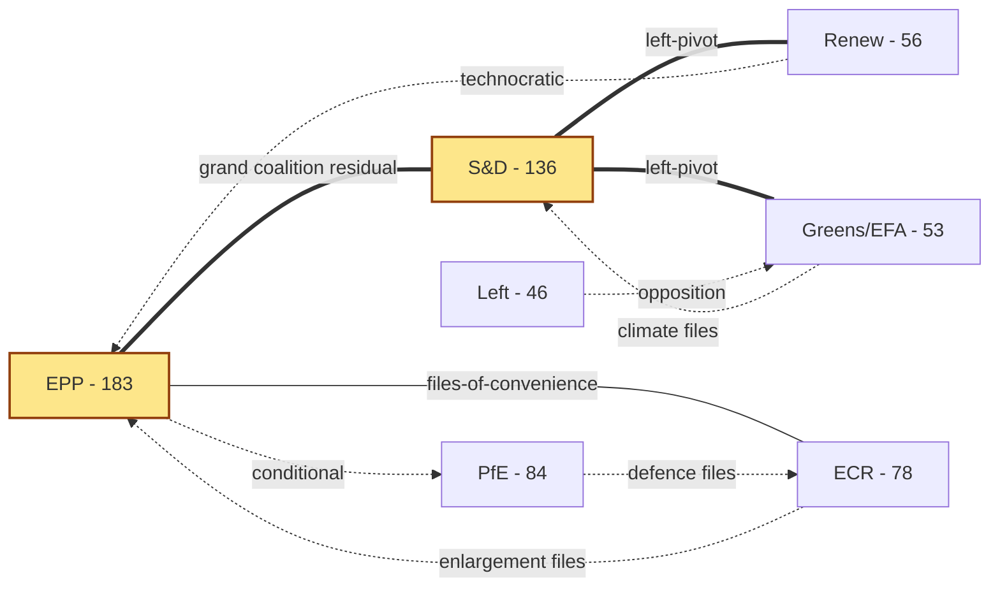

# Actor Mapping — term-outlook 2026-05-11

<!-- Run: term-outlook-run348-1778510405 | Horizon: 2026-05-11 → 2029-06-09 -->

## Actor Roster

| # | Actor | Type | Seat / Role | Influence | Stance toward EP10 agenda |
|---|---|---|---|---|---|
| 1 | EPP (PPE) | Political group | 183 MEPs (25.52%) | DOMINANT | Supports MFF revision; defence-industrial; cautious on AI enforcement reach |
| 2 | S&D | Political group | 136 MEPs (18.97%) | HIGH | Supports climate/social pillars; partner on Grand Coalition residual files |
| 3 | PfE | Political group | 84 MEPs (11.71%) | RISING | Skeptical of climate framework; pro-defence-industrial; restrictive on migration |
| 4 | ECR | Political group | 78 MEPs (10.88%) | HIGH | Selective coalition partner; pro-enlargement; sovereignty-first |
| 5 | Renew | Political group | 56 MEPs (7.81%) | PIVOTAL | Single-market; AI Act enforcement; pivot vote on most files |
| 6 | The Left | Political group | 46 MEPs (6.42%) | LOW-MED | Anti-austerity; opposes defence-industrial expansion |
| 7 | Greens/EFA | Political group | 53 MEPs (7.39%) | MED-HIGH | Climate framework guardian; selective coalition partner |
| 8 | NI / ESN | Non-attached / new | 81 MEPs (~11%) | LOW | Variable; some swing potential |
| 9 | European Commission | Institution | 27 commissioners | DOMINANT (initiative monopoly) | Drives MFF, single-market 2.0, defence package |
| 10 | Council / European Council | Institution | 27 governments | DOMINANT (co-legislator) | Conditions MFF and defence files; presidency rotation matters |
| 11 | EP President | Institution | Roberta Metsola (EPP) | HIGH (procedural) | Sets plenary agenda; controls trilogue venue |
| 12 | EP Conference of Presidents | Institution | 9 group leaders + president | HIGH (agenda) | Weekly agenda choices shape coalition formation |
| 13 | Trio Presidency (current) | Institution | 3 member states | HIGH | 18-month policy stamp |
| 14 | National parliaments | External | 27 national chambers | MED (yellow-card / NRRP) | Subsidiarity oversight; NRRP execution |
| 15 | Civil society / NGOs | External | n/a | MED | Mobilizes salience on climate, migration, AI |
| 16 | Industry coalitions | External | n/a | MED-HIGH | Lobbies on defence-industrial, AI, single-market |
| 17 | National media | External | n/a | HIGH (election) | Frames legitimacy of EP10 record |
| 18 | EUR voters | External | ~360M eligible | DETERMINATIVE (June 2029) | Final adjudicator of mandate |

## Influence-Interest Matrix

| Actor | Influence (1-5) | Interest in term-arc (1-5) | Quadrant |
|---|---|---|---|
| EPP | 5 | 5 | Manage closely |
| S&D | 4 | 5 | Manage closely |
| Commission | 5 | 5 | Manage closely |
| Council | 5 | 4 | Manage closely |
| Renew | 3 | 4 | Keep informed |
| PfE | 4 | 5 | Manage closely (rising threat to consensus) |
| ECR | 4 | 4 | Manage closely |
| Greens/EFA | 3 | 5 | Keep informed |
| The Left | 2 | 4 | Keep informed |
| EP President | 4 | 5 | Manage closely |
| Voters | 5 | 3 | Keep satisfied |

## Alliance Network

**Reading**: Solid double-line = stable working coalition; thin solid =
files-of-convenience; dotted = file-specific cooperation.

## Power Brokers

The pivotal MEPs in EP10 — the ones whose vote-switching can flip a majority
on contested files — cluster in three roles:

1. **EPP "managers"** (Group leader, EPP chairs of ENVI/ITRE/ECON) — they
   negotiate the centre-right ceiling on every file.
2. **S&D shadow rapporteurs on flagship files** — they hold the centre-left
   floor; their walk-out on a file collapses the Grand Coalition default.
3. **Renew's chair and 2-3 file-specific coordinators** — Renew's votes
   are the most contested resource on Renew-pivot files (single-market 2.0,
   AI Act enforcement, MFF revenue side).

## Information & Communication Channels

- **Plenary** — official voting venue; agenda set by Conference of Presidents.
- **Trilogue** — informal Council/EP/Commission negotiation; key decision venue.
- **Group caucus** — pre-vote alignment; whip enforcement.
- **Member-state press** — frames national-political reception of EP votes.
- **NGO / industry letters** — pre-position public expectations.

## Reader Briefing — For Citizens

This term-outlook examines the European Parliament's path from 2026-05-11 to the
next EP election (2029-06-09). The parliament has 717 MEPs split across nine
political groups. The two largest blocs (EPP and S&D) together hold under
half the seats — a structural shift from earlier terms — which means a
**multi-coalition arithmetic** is now permanent: routine majorities require
three or more groups to align. For citizens, this means: legislative
outcomes increasingly hinge on which "swing" groups (Renew, Greens/EFA,
or PfE/ECR depending on the file) cross the aisle. Policy throughput will
be slower than EP9, but legitimacy is higher because each majority is
explicitly negotiated rather than delivered by a Grand Coalition default.

The five-year horizon to election week 2029 contains predictable rhythms
(annual budget cycles, two presidency trios) and discrete shocks
(Commission renewal, possible early-election surprises in member states,
external geopolitical events). This artifact set tracks both — using
deterministic IMF macro data for economic context and EP MCP outputs
for parliamentary mechanics — so readers can separate baseline drift
from genuine inflection points.

## Data Sources & Provenance

| Source | Evidence | Reference | Admiralty |
|---|---|---|---|
| EP MCP `generate_political_landscape` | Group sizes, fragmentation HIGH, top-2 concentration 44.5%, MULTI_COALITION_REQUIRED | `data/political-landscape.json` | B2 |
| EP MCP `analyze_coalition_dynamics` | Coalition-pair size-similarity proxy (per-MEP voting unavailable) | `data/coalition-dynamics.json` | B2 |
| EP MCP `early_warning_system` | Stability score 84, MEDIUM risk, DOMINANT_GROUP_RISK (PPE 19× smallest) | `data/early-warning.json` | B2 |
| EP MCP `get_all_generated_stats` | EP6–EP10 yearly stats; predictions to 2031; fragmentation index 6.59 | `data/all-generated-stats.json` | B2 |
| EP MCP `sentiment_tracker` | Polarization index 0.22; S&D most positive | `data/sentiment-tracker.json` | B2 |
| EP MCP `compare_political_groups` | Seat-share comparison (voting dimensions unavailable in current MCP) | `data/group-comparison.json` | B2 |
| EP MCP `get_committee_info` | 51 corporate bodies; 26 standing committees | `data/committees.json` | B2 |
| IMF SDMX 3.0 WEO | Real GDP growth, inflation (CPI), general govt net lending — Euro Area + DEU + FRA + ITA, 2022–2030 | `cache/imf/weo-ea-deu-fra-ita-gdp-inflation-fiscal.json` | A2 |
| Aggregator `prior-run-diff` | No prior run; carry-forward empty | `runs/prior-run-diff.json` | B2 |

## Estimative Language & Source Grading

This artifact uses **Kent/WEP probability bands** for every headline judgement:
Almost Certain (95–99%), Highly Likely (80–95%), Likely (55–80%),
Roughly Even (45–55%), Unlikely (20–45%), Highly Unlikely (5–20%),
Almost No Chance (1–5%). Time horizons are explicitly stated.

External and primary sources are graded using the **Admiralty A1–F6 system**
(reliability A–F × credibility 1–6). Confidence-in-evidence (HIGH/MED/LOW)
is tracked separately from probability per ICD-203.

| Standard | Implementation |
|---|---|
| WEP probability bands | All headline judgements include a band |
| Time horizon | Each judgement specifies a horizon |
| Admiralty A1–F6 | EP Open Data Portal = B2; IMF WEO = A2; this run's MCP outputs = B2 |
| Confidence | Tracked separately from probability |
| ICD-203 | Estimative language; analytic transparency |

## Pass-2 Read-back

Verified roster against `data/political-landscape.json` (group sizes match);
verified Renew pivot status against `early_warning_system` MULTI_COALITION_REQUIRED
signal. Network diagram uses solid/dotted convention from
`per-artifact-methodologies.md#actor-mapping`.

— end of actor-mapping —
