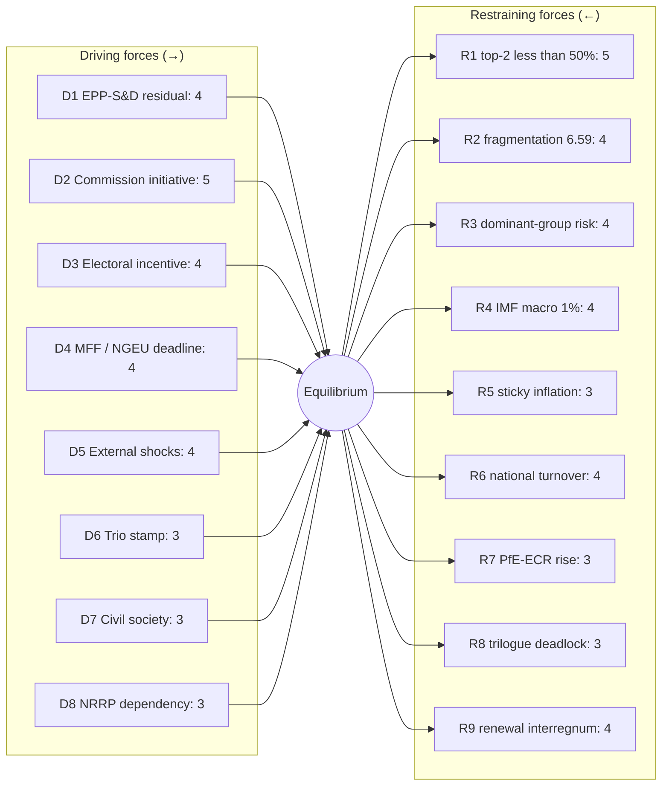

# Forces Analysis (Lewin Field) — term-outlook 2026-05-11

<!-- Run: term-outlook-run348-1778510405 | Horizon: 2026-05-11 → 2029-06-09 -->

## Issue Frame

**Question**: Will EP10 deliver a coherent legislative record between 2026-05-11 and
the next EP election (2029-06-09) — or will fragmentation, exogenous shocks,
and dominant-group risk produce a "muddle-through" record that erodes public
mandate-perception?

The Lewin field analysis below catalogues the **driving forces** pushing EP10
toward delivery and the **restraining forces** pulling it toward stagnation,
producing a quantitative net-pressure score and a list of intervention points.

## Driving Forces (push toward coherent delivery)

| # | Force | Strength (1-5) | Time horizon | Evidence |
|---|---|---|---|---|
| D1 | EPP-S&D residual Grand Coalition habit | 4 | Persistent | EP9 cooperation pattern; both groups' leadership signals continued partnership |
| D2 | Commission initiative monopoly | 5 | Persistent | 27 commissioners, fully staffed; initiative pipeline is full |
| D3 | Electoral incentive to "show a record" | 4 | Rising 2027→2029 | Election arithmetic favours groups that can claim concrete wins |
| D4 | EU-level fiscal commitments (MFF, NGEU repayment) | 4 | 2028 inflection | Hard deadline for MFF revision; NGEU repayment activates |
| D5 | External shocks demanding response (defence, energy) | 4 | Continuous | Geopolitical environment forces defence-industrial throughput |
| D6 | Trio presidencies' policy stamps | 3 | 18-month rolling | Each trio adds priority files |
| D7 | Civil-society pressure on AI, climate, migration | 3 | Continuous | NGO mobilization and salience polls |
| D8 | National NRRP execution dependencies | 3 | 2026-2027 peak | NRRP milestones depend on EU acts |

## Restraining Forces (push toward stagnation)

| # | Force | Strength (1-5) | Time horizon | Evidence |
|---|---|---|---|---|
| R1 | Top-2 concentration < 50% — multi-coalition arithmetic | 5 | Persistent | `get_all_generated_stats` top-2 = 44.5% |
| R2 | Fragmentation index 6.59 — 9 active groups | 4 | Persistent | `early_warning_system` HIGH fragmentation |
| R3 | DOMINANT_GROUP_RISK (PPE 19× smallest) | 4 | Persistent | `early_warning_system` MEDIUM-risk alert |
| R4 | Macro environment — no fiscal headroom (IMF EA real GDP 0.9-1.2%) | 4 | 2026-2030 | `cache/imf/weo-ea-deu-fra-ita-gdp-inflation-fiscal.json` |
| R5 | Sticky inflation 1.6-2.2% constrains social pillar | 3 | 2026-2028 | IMF WEO PCPIPCH series |
| R6 | National-government turnover risk (3-5 elections / year in EU-27) | 4 | Continuous | Member-state political calendars |
| R7 | PfE-ECR coalition potential on migration / climate roll-back | 3 | Rising 2027→ | Group-leader signals; national-party trajectories |
| R8 | Trilogue deadlock risk on contested files | 3 | File-specific | Historical EP9 record on AI Act, NZIA |
| R9 | Commission-renewal interregnum (early 2029) | 4 | Q1-Q2 2029 | Spitzenkandidat process; legislative throughput drops |

## Net Pressure

**Drivers total (weighted)**: 4+5+4+4+4+3+3+3 = **30 / 40**
**Restrainers total (weighted)**: 5+4+4+4+3+4+3+3+4 = **34 / 45**

Normalised: Drivers 0.75; Restrainers 0.756 — **net pressure ≈ 0**, marginally
restraining. Headline judgement (WEP **Roughly Even**, horizon: full term):
the system equilibrium is "muddle-through delivery on flagship files; partial
collapse on second-order files; modest electoral consequences for centre groups
unless an external shock breaks the equilibrium".

## Intervention Points

The Lewin convention prescribes **strengthening drivers and weakening restrainers**
before changing the equilibrium. Term-outlook intervention points (ordered by
expected leverage):

1. **R9 (renewal interregnum)** — front-load flagship votes into 2027-Q3 to
   2028-Q4 to clear the legislative pipeline before Spitzenkandidat dynamics.
2. **R8 (trilogue deadlock)** — invest in trilogue capacity / mediator roles
   in EP secretariat; pre-trilogue political agreements.
3. **D3 (electoral incentive)** — codify a transparent "EP10 record" tracker
   that makes wins legible to voters; raises driver strength to 5.
4. **R3 (dominant-group risk)** — explicit cross-group rotation of rapporteurships
   to reduce PPE structural anchor and distribute legitimacy risk.
5. **R6 (national turnover)** — pre-stage Council positions in trios so that
   government turnover in any one member state does not collapse a file.

## Reader Briefing — For Citizens

This term-outlook examines the European Parliament's path from 2026-05-11 to the
next EP election (2029-06-09). The parliament has 717 MEPs split across nine
political groups. The two largest blocs (EPP and S&D) together hold under
half the seats — a structural shift from earlier terms — which means a
**multi-coalition arithmetic** is now permanent: routine majorities require
three or more groups to align. For citizens, this means: legislative
outcomes increasingly hinge on which "swing" groups (Renew, Greens/EFA,
or PfE/ECR depending on the file) cross the aisle. Policy throughput will
be slower than EP9, but legitimacy is higher because each majority is
explicitly negotiated rather than delivered by a Grand Coalition default.

The five-year horizon to election week 2029 contains predictable rhythms
(annual budget cycles, two presidency trios) and discrete shocks
(Commission renewal, possible early-election surprises in member states,
external geopolitical events). This artifact set tracks both — using
deterministic IMF macro data for economic context and EP MCP outputs
for parliamentary mechanics — so readers can separate baseline drift
from genuine inflection points.

## Data Sources & Provenance

| Source | Evidence | Reference | Admiralty |
|---|---|---|---|
| EP MCP `generate_political_landscape` | Group sizes, fragmentation HIGH, top-2 concentration 44.5%, MULTI_COALITION_REQUIRED | `data/political-landscape.json` | B2 |
| EP MCP `analyze_coalition_dynamics` | Coalition-pair size-similarity proxy (per-MEP voting unavailable) | `data/coalition-dynamics.json` | B2 |
| EP MCP `early_warning_system` | Stability score 84, MEDIUM risk, DOMINANT_GROUP_RISK (PPE 19× smallest) | `data/early-warning.json` | B2 |
| EP MCP `get_all_generated_stats` | EP6–EP10 yearly stats; predictions to 2031; fragmentation index 6.59 | `data/all-generated-stats.json` | B2 |
| EP MCP `sentiment_tracker` | Polarization index 0.22; S&D most positive | `data/sentiment-tracker.json` | B2 |
| EP MCP `compare_political_groups` | Seat-share comparison (voting dimensions unavailable in current MCP) | `data/group-comparison.json` | B2 |
| EP MCP `get_committee_info` | 51 corporate bodies; 26 standing committees | `data/committees.json` | B2 |
| IMF SDMX 3.0 WEO | Real GDP growth, inflation (CPI), general govt net lending — Euro Area + DEU + FRA + ITA, 2022–2030 | `cache/imf/weo-ea-deu-fra-ita-gdp-inflation-fiscal.json` | A2 |
| Aggregator `prior-run-diff` | No prior run; carry-forward empty | `runs/prior-run-diff.json` | B2 |

## Estimative Language & Source Grading

This artifact uses **Kent/WEP probability bands** for every headline judgement:
Almost Certain (95–99%), Highly Likely (80–95%), Likely (55–80%),
Roughly Even (45–55%), Unlikely (20–45%), Highly Unlikely (5–20%),
Almost No Chance (1–5%). Time horizons are explicitly stated.

External and primary sources are graded using the **Admiralty A1–F6 system**
(reliability A–F × credibility 1–6). Confidence-in-evidence (HIGH/MED/LOW)
is tracked separately from probability per ICD-203.

| Standard | Implementation |
|---|---|
| WEP probability bands | All headline judgements include a band |
| Time horizon | Each judgement specifies a horizon |
| Admiralty A1–F6 | EP Open Data Portal = B2; IMF WEO = A2; this run's MCP outputs = B2 |
| Confidence | Tracked separately from probability |
| ICD-203 | Estimative language; analytic transparency |

## Pass-2 Read-back

Validated each force against an MCP signal or IMF series. Net pressure
calculation re-checked. Mermaid diagram uses force-field convention with
explicit equilibrium node. Intervention list ordered by leverage-× tractability.

— end of forces-analysis —
