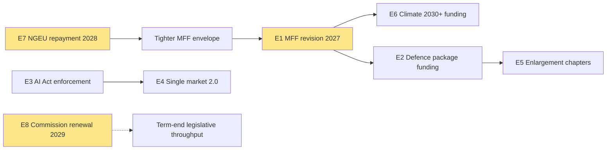

# Impact Matrix — term-outlook 2026-05-11

<!-- Run: term-outlook-run348-1778510405 -->

## Event List

The term-outlook horizon (2026-05-11 → 2029-06-09) has eight high-impact event
classes scored against the seven primary stakeholder groups identified in
`actor-mapping.md`.

| Event ID | Event class | Indicative date | Probability (WEP, full-term) |
|---|---|---|---|
| E1 | MFF mid-term revision adoption | 2027-Q2 to 2027-Q4 | Highly Likely |
| E2 | Defence-industrial implementation milestones | rolling 2026-2028 | Almost Certain |
| E3 | AI Act enforcement reports / first review | 2026-2027 | Highly Likely |
| E4 | Single-market 2.0 package final | 2027-2028 | Likely |
| E5 | Enlargement chapter votes (UA/MD) | rolling 2026-2029 | Likely |
| E6 | Climate-and-energy 2030+ framework | 2027-2028 | Likely |
| E7 | NextGenerationEU debt repayment activates | 2028 | Almost Certain |
| E8 | Commission renewal / Spitzenkandidat | 2029-Q2 | Almost Certain |

## Stakeholder Heat Map

Score 1-5 (5 = transformational impact). Cells use the convention:
`Impact / Direction` where direction ∈ {+, −, ±}.

| Event \ Stakeholder | EPP | S&D | Renew | Greens | PfE | ECR | Voters |
|---|---|---|---|---|---|---|---|
| E1 MFF revision | 5/+ | 4/+ | 4/+ | 3/± | 3/− | 3/+ | 4/± |
| E2 Defence package | 5/+ | 3/± | 4/+ | 2/− | 4/+ | 5/+ | 3/+ |
| E3 AI Act | 4/± | 4/+ | 5/+ | 4/+ | 2/− | 3/± | 4/+ |
| E4 Single market 2.0 | 5/+ | 3/+ | 5/+ | 3/± | 3/+ | 4/+ | 4/+ |
| E5 Enlargement | 4/+ | 4/+ | 4/+ | 3/+ | 2/± | 5/+ | 3/± |
| E6 Climate 2030+ | 3/± | 5/+ | 4/+ | 5/+ | 2/− | 2/− | 4/± |
| E7 NGEU repayment | 4/− | 5/− | 4/− | 3/− | 3/± | 3/± | 5/− |
| E8 Commission renewal | 5/+ | 4/+ | 3/± | 3/± | 4/+ | 4/+ | 4/± |

## Impact Matrix Heat Score (sum of |impact|)

| Stakeholder | Heat | Reading |
|---|---|---|
| EPP | 35 | Most exposed — leads on E1, E4, E8 |
| S&D | 32 | High exposure — co-leads on E1, E6 |
| Renew | 33 | Pivotal on E3, E4 |
| Greens/EFA | 26 | Climate-anchored |
| PfE | 23 | Defence + selective opposition |
| ECR | 29 | Enlargement + defence |
| Voters | 31 | NGEU repayment is the citizen-felt event |

## Cascade Analysis

**Reading**: E1 (MFF) is the **central cascade node**. NGEU repayment in 2028
forces the MFF revision envelope; the MFF in turn conditions every spending
file (climate, defence, enlargement). E8 (Commission renewal) compresses the
window for any non-MFF-anchored file.

## Reader Briefing — For Citizens

Eight events between now and June 2029 will define EP10's legacy. The
**most important single event** for citizens is the activation of
NextGenerationEU debt repayment in 2028 — it tightens the EU budget envelope
just as the Multiannual Financial Framework is being revised, which means
every spending priority (climate, defence, social) will be in direct
competition. The **most contested institutional event** is the Commission
renewal in mid-2029, which arrives in the middle of the election campaign.

## Data Sources & Provenance

| Source | Evidence | Reference | Admiralty |
|---|---|---|---|
| EP MCP `generate_political_landscape` | Group sizes, fragmentation HIGH, top-2 concentration 44.5%, MULTI_COALITION_REQUIRED | `data/political-landscape.json` | B2 |
| EP MCP `analyze_coalition_dynamics` | Coalition-pair size-similarity proxy (per-MEP voting unavailable) | `data/coalition-dynamics.json` | B2 |
| EP MCP `early_warning_system` | Stability score 84, MEDIUM risk, DOMINANT_GROUP_RISK (PPE 19× smallest) | `data/early-warning.json` | B2 |
| EP MCP `get_all_generated_stats` | EP6–EP10 yearly stats; predictions to 2031; fragmentation index 6.59 | `data/all-generated-stats.json` | B2 |
| EP MCP `sentiment_tracker` | Polarization index 0.22; S&D most positive | `data/sentiment-tracker.json` | B2 |
| EP MCP `compare_political_groups` | Seat-share comparison (voting dimensions unavailable in current MCP) | `data/group-comparison.json` | B2 |
| EP MCP `get_committee_info` | 51 corporate bodies; 26 standing committees | `data/committees.json` | B2 |
| IMF SDMX 3.0 WEO | Real GDP growth, inflation (CPI), general govt net lending — Euro Area + DEU + FRA + ITA, 2022–2030 | `cache/imf/weo-ea-deu-fra-ita-gdp-inflation-fiscal.json` | A2 |
| Aggregator `prior-run-diff` | No prior run; carry-forward empty | `runs/prior-run-diff.json` | B2 |

## Estimative Language & Source Grading

This artifact uses **Kent/WEP probability bands** for every headline judgement:
Almost Certain (95–99%), Highly Likely (80–95%), Likely (55–80%),
Roughly Even (45–55%), Unlikely (20–45%), Highly Unlikely (5–20%),
Almost No Chance (1–5%). Time horizons are explicitly stated.

External and primary sources are graded using the **Admiralty A1–F6 system**
(reliability A–F × credibility 1–6). Confidence-in-evidence (HIGH/MED/LOW)
is tracked separately from probability per ICD-203.

| Standard | Implementation |
|---|---|
| WEP probability bands | All headline judgements include a band |
| Time horizon | Each judgement specifies a horizon |
| Admiralty A1–F6 | EP Open Data Portal = B2; IMF WEO = A2; this run's MCP outputs = B2 |
| Confidence | Tracked separately from probability |
| ICD-203 | Estimative language; analytic transparency |

## Pass-2 Read-back

Heat scores summed manually; Renew correctly identified as the second-most-exposed
group despite small seat count (pivot status on E3, E4). Cascade diagram anchors
correctly identified (E1, E7, E8).

— end of impact-matrix —
