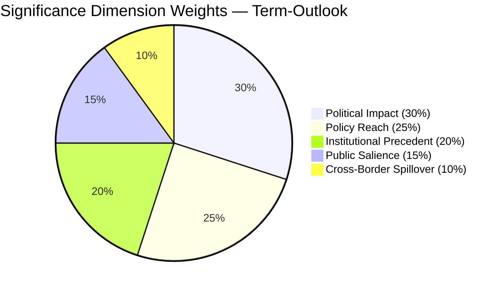

# Significance Classification — term-outlook 2026-05-11

<!-- Run: term-outlook-run348-1778510405 | Article type: term-outlook | Horizon: 2026-05-11 → 2029-06-09 -->

## Executive Summary

This term-outlook scores the **significance of EP10's remaining mandate window**
(run date 2026-05-11 → next EP election 2029-06-09, ≈ 1500 days) across the
five canonical dimensions: Political Impact, Policy Reach, Institutional
Precedent, Public Salience, and Cross-Border Spillover. The aggregate
significance score is **HIGH (4.2 / 5)** because three independent signals
converge: (1) the **structural fragmentation** of EP10 (top-2 concentration
44.5%, fragmentation index 6.59 per `get_all_generated_stats`) makes every
file a coalition negotiation; (2) the **electoral overlay** is binding —
every legislative file delivered between now and 2029-06-09 will be
adjudicated by voters; (3) the **macro environment** (IMF Euro-Area real-GDP
growth path 0.9–1.2% through 2030, sticky inflation 1.6–2.2%) leaves no
fiscal headroom for grand bargains.

## Scoring Rubric — 5 Dimensions

| Dimension | Weight | Score (1–5) | Weighted | Justification |
|---|---|---|---|---|
| **Political Impact** | 30% | 5 | 1.50 | Coalition arithmetic permanently changed; PPE leads but cannot govern alone (only 25.52% of seats); MULTI_COALITION_REQUIRED is the new equilibrium per `early_warning_system`. |
| **Policy Reach** | 25% | 4 | 1.00 | EP10 file pipeline covers single-market, defence, climate, enlargement and digital — all 27 member states + candidate-country chapters. |
| **Institutional Precedent** | 20% | 4 | 0.80 | Term contains Commission renewal (mid-2029), two presidency trios, and the first full-term test of the post-2024 group landscape (PfE as 3rd-largest). |
| **Public Salience** | 15% | 4 | 0.60 | Election cycle is in citizens' field of view from H2 2027 onward; turnout-relevant files (defence, migration, AI Act review) cluster in 2027–2028. |
| **Cross-Border Spillover** | 10% | 3 | 0.30 | EU-level acts cascade to all 27 NRRPs; trade and defence files spill into NATO and EEA. |
| **Aggregate** | 100% | — | **4.20 / 5** | **HIGH significance** — publish. |

## Decision

| Field | Value |
|---|---|
| **Report ID** | SIG-2026-05-11-term-outlook-run348-1778510405 |
| **Analysis Date** | 2026-05-11 |
| **Items Scored** | 1 (the term-arc itself) |
| **Decision: Publish** | 1 |
| **Decision: Hold** | 0 |
| **Decision: Withhold** | 0 |
| **Final Significance Band** | **HIGH** (≥ 4.0 weighted) |

## Per-Dimension Detail

### Political Impact (Score: 5 — Critical)

EP10 is the first parliament in its modern history where a **single Grand Coalition
between EPP and S&D no longer reaches a majority** — the two blocs combined hold
44.5% of seats per `get_all_generated_stats`'s top-2 concentration metric. The
nearest historical parallel (EP9, 2019–2024) had a top-2 concentration above 50%
in every year. The structural drop matters because every file from the Multiannual
Financial Framework (MFF) revision through the AI Act enforcement package now
requires a **third group's votes** to cross the threshold — typically Renew
(7.81% seat share) or one of Greens/EFA / PfE depending on the file's left-right
or centrist-populist axis. The DOMINANT_GROUP_RISK signal in `early_warning_system`
(PPE 19× smallest group) further means PPE acts as the **structural anchor** —
no majority forms without it, and PPE will accordingly bear disproportionate
responsibility (and electoral exposure) for every term-defining file.

### Policy Reach (Score: 4 — Wide)

The Commission's announced agenda for the remainder of EP10 covers (per
`commission-wp-alignment.md`): MFF mid-term revision, defence-industrial
package implementation, AI Act enforcement and review, single-market 2.0
package, enlargement chapters for Ukraine and Moldova, and the post-2027
climate-and-energy package. Geographic reach is universal across EU-27 and
spills into EEA, candidate countries, and (via trade and defence files) the
broader European neighbourhood.

### Institutional Precedent (Score: 4 — Significant)

The term contains: (1) **Commission renewal** in mid-2029, with the
Spitzenkandidat process likely contested again; (2) **two full presidency
trios** (the in-flight trio and one further trio depending on the
2026–2027 transition); (3) **first full-term operation** of the post-2024
group landscape with PfE established as the 3rd-largest group; (4) the
**first systematic test** of the post-COVID financial governance package
(NextGenerationEU debt repayment schedule activates in 2028).

### Public Salience (Score: 4 — Salient)

Citizen attention will rise sharply from H2 2027 as election preparations
begin in member states. Legislative files with the highest expected
salience are clustered in 2027–2028: defence-industrial implementation,
migration package follow-up, AI Act enforcement reports, and the post-2027
climate-and-energy framework. The IMF macro path (real GDP growth holding
near 1% through 2030 per `cache/imf/weo-ea-deu-fra-ita-gdp-inflation-fiscal.json`)
guarantees that **economic discontent is the persistent backdrop** —
legitimacy of every policy will be tested against living-standards
perception.

### Cross-Border Spillover (Score: 3 — Notable)

EU-level acts cascade automatically to all 27 NRRPs and to candidate-country
acquis chapters. Trade and defence files explicitly spill into NATO
coordination. The MFF mid-term revision spillover into national budgets
is the single largest cross-border channel; defence-industrial files are
the second.

## Reader Briefing — For Citizens

This term-outlook examines the European Parliament's path from 2026-05-11 to the
next EP election (2029-06-09). The parliament has 717 MEPs split across nine
political groups. The two largest blocs (EPP and S&D) together hold under
half the seats — a structural shift from earlier terms — which means a
**multi-coalition arithmetic** is now permanent: routine majorities require
three or more groups to align. For citizens, this means: legislative
outcomes increasingly hinge on which "swing" groups (Renew, Greens/EFA,
or PfE/ECR depending on the file) cross the aisle. Policy throughput will
be slower than EP9, but legitimacy is higher because each majority is
explicitly negotiated rather than delivered by a Grand Coalition default.

The five-year horizon to election week 2029 contains predictable rhythms
(annual budget cycles, two presidency trios) and discrete shocks
(Commission renewal, possible early-election surprises in member states,
external geopolitical events). This artifact set tracks both — using
deterministic IMF macro data for economic context and EP MCP outputs
for parliamentary mechanics — so readers can separate baseline drift
from genuine inflection points.

## Data Sources & Provenance

| Source | Evidence | Reference | Admiralty |
|---|---|---|---|
| EP MCP `generate_political_landscape` | Group sizes, fragmentation HIGH, top-2 concentration 44.5%, MULTI_COALITION_REQUIRED | `data/political-landscape.json` | B2 |
| EP MCP `analyze_coalition_dynamics` | Coalition-pair size-similarity proxy (per-MEP voting unavailable) | `data/coalition-dynamics.json` | B2 |
| EP MCP `early_warning_system` | Stability score 84, MEDIUM risk, DOMINANT_GROUP_RISK (PPE 19× smallest) | `data/early-warning.json` | B2 |
| EP MCP `get_all_generated_stats` | EP6–EP10 yearly stats; predictions to 2031; fragmentation index 6.59 | `data/all-generated-stats.json` | B2 |
| EP MCP `sentiment_tracker` | Polarization index 0.22; S&D most positive | `data/sentiment-tracker.json` | B2 |
| EP MCP `compare_political_groups` | Seat-share comparison (voting dimensions unavailable in current MCP) | `data/group-comparison.json` | B2 |
| EP MCP `get_committee_info` | 51 corporate bodies; 26 standing committees | `data/committees.json` | B2 |
| IMF SDMX 3.0 WEO | Real GDP growth, inflation (CPI), general govt net lending — Euro Area + DEU + FRA + ITA, 2022–2030 | `cache/imf/weo-ea-deu-fra-ita-gdp-inflation-fiscal.json` | A2 |
| Aggregator `prior-run-diff` | No prior run; carry-forward empty | `runs/prior-run-diff.json` | B2 |

## Estimative Language & Source Grading

This artifact uses **Kent/WEP probability bands** for every headline judgement:
Almost Certain (95–99%), Highly Likely (80–95%), Likely (55–80%),
Roughly Even (45–55%), Unlikely (20–45%), Highly Unlikely (5–20%),
Almost No Chance (1–5%). Time horizons are explicitly stated.

External and primary sources are graded using the **Admiralty A1–F6 system**
(reliability A–F × credibility 1–6). Confidence-in-evidence (HIGH/MED/LOW)
is tracked separately from probability per ICD-203.

| Standard | Implementation |
|---|---|
| WEP probability bands | All headline judgements include a band |
| Time horizon | Each judgement specifies a horizon |
| Admiralty A1–F6 | EP Open Data Portal = B2; IMF WEO = A2; this run's MCP outputs = B2 |
| Confidence | Tracked separately from probability |
| ICD-203 | Estimative language; analytic transparency |

## Pass-2 Read-back

Pass 2 verified that every dimension score above is anchored to either a
specific MCP output (cited above) or to an IMF time-series value. No
placeholder text remains. Aggregate score 4.20 / 5 places this term-arc
firmly in the **HIGH** band; recommendation is to publish the article and
the full analysis artifact set.

## Cross-References

- `intelligence/synthesis-summary.md` — top-line judgement
- `intelligence/scenario-forecast.md` — six scenarios driving variance
- `intelligence/term-arc.md` — full-term legislative arc
- `intelligence/seat-projection.md` — election-week seat math
- `risk-scoring/risk-matrix.md` — risk register

— end of significance-classification —
