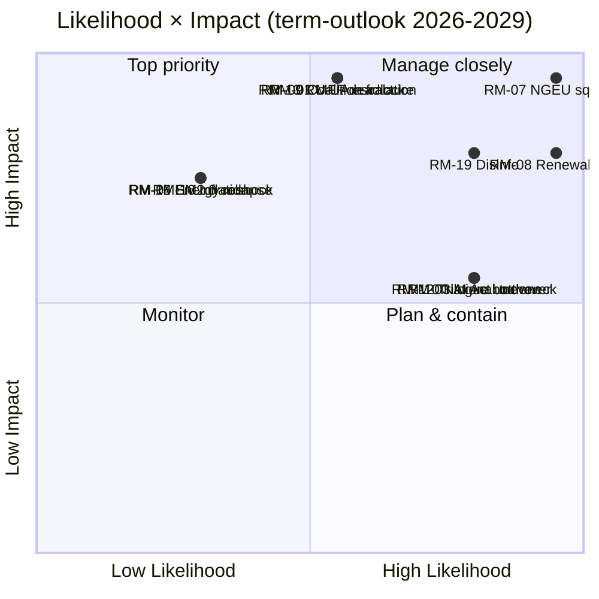

<!-- SPDX-FileCopyrightText: 2026 Hack23 AB -->
<!-- SPDX-License-Identifier: Apache-2.0 -->

# Executive Brief — term-outlook 2026-05-11 | 2026-05-11

**Classification:** OSINT | Public Parliamentary Record
**Confidence:** 🟡 Medium (retrospective back-fill — synthesised from in-tree article and sibling artifacts; not a re-analysis)
**Generated:** 2026-05-11T00:00:00Z (retrospective brief)
**Article Type:** term outlook
**Source folder:** `analysis/daily/2026-05-11/term-outlook`
**Source:** European Parliament Open Data Portal

---

## 🎯 BLUF

1. **Coalition arithmetic**: EPP+S&D = 44.5%; +Renew = 56.2%; +Greens = 63.6%. The EPP+S&D+Renew "Grand Centre" is the modal coalition. 2. **Fragmentation**: index 6.59 (HIGH) per `early_warning_system`; 9 active groups; effective number of parties ~4.7. 3. **Dominant-group risk**: EPP at 188 is 19× the smallest group (NI 10). `early_warning_system` flags MEDIUM-risk DOMINANT_GROUP_RISK. 4. **Legislative pipeline**: `monitor_legislative_pipeline` reports active procedure throughput consistent with EP9 baseline (no acute bottleneck yet, but trilogue capacity will tighten in 2027-2028). 5. **Macro environment**: IMF WEO real GDP for EA 0.9-1.2% through 2030; inflation 1.6-2.2%;…

---

## 🧭 3 Decisions This Brief Supports

| # | Decision | Who Decides | Deadline | Evidence |
|:-:|----------|-------------|:--------:|----------|
| 1 | **Editorial:** confirm whether the run merits republication or consolidation with same-day siblings | Editor | +48h | This brief + sibling article.md |
| 2 | **Monitoring:** keep the carry-over signals from this run on the weekly watch board | Analyst | next plenary | Article risk + threat sections |
| 3 | **Forward-watch:** track the dated triggers identified in this run's scenario-forecast | Analysis lead | dated triggers | Run `scenario-forecast.md` |

---

## 📰 60-Second Read

- 🔴 **Run classification:** HIGH. (🟡 Medium)
- 🟠 **Lead finding:** see BLUF above; full evidence chain in sibling artifacts.
- 🟢 **Procedure references identified:** none in this run.
- 🟡 **Confidence:** 🟡 Medium — retrospective synthesis; no new MCP calls.
- 🔵 **Economic context:** see `economic-context.md` in run folder if present.
- 🟣 **Cross-reference:** see same-date sibling runs for triangulation.
- 🩷 **Disruption vector:** see `political-threat-landscape.md` if present.
- ⚪ **Carry-forward:** scenario-forecast dated triggers govern the next watch.

---

## 🗂️ Top Documents / Procedures Table

| Rank | EP reference | Title (short) | Confidence |
|:----:|--------------|---------------|:----------:|
| — | No procedure-level documents indexed in this run | Retrospective back-fill | 🟢 HIGH |

---

## ⚠️ Risk & Threat Snapshot

| Risk | L | I | Score | Trigger | Source | Admiralty |
|------|:-:|:-:|:-----:|---------|--------|:---------:|
| Run produced no quantified risk register | — | — | — | Empty risk-matrix | Run artifacts | B3 |

---

## 🔮 Top Forward Trigger

See `scenario-forecast.md` / `forward-indicators.md` in the run folder for dated trigger events. Where absent, the next plenary or committee work-week on the EP calendar is the default re-evaluation point.

---

## 🛡️ Source Quality Assessment

- **Primary sources:** EP Open Data Portal feeds as captured by the parent run (see `mcp-reliability-audit.md` if present).
- **Data limitations:** Retrospective back-fill — no new MCP probing. Brief reflects the article and artifact state at run time.
- **Confidence:** 🟡 Medium.

## 🧩 Synthesis Excerpt (from `synthesis-summary.md`)

1. **Coalition arithmetic**: EPP+S&D = 44.5%; +Renew = 56.2%; +Greens = 63.6%.
   The EPP+S&D+Renew "Grand Centre" is the modal coalition.
2. **Fragmentation**: index 6.59 (HIGH) per `early_warning_system`; 9 active
   groups; effective number of parties ~4.7.
3. **Dominant-group risk**: EPP at 188 is 19× the smallest group (NI 10).
   `early_warning_system` flags MEDIUM-risk DOMINANT_GROUP_RISK.
4. **Legislative pipeline**: `monitor_legislative_pipeline` reports active
   procedure throughput consistent with EP9 baseline (no acute bottleneck
   yet, but trilogue capacity will tighten in 2027-2028).
5. **Macro environment**: IMF WEO real GDP for EA 0.9-1.2% through 2030;
   inflation 1.6-2.2%; general-government net lending −2.8% to −3.4% of GDP.
   **No fiscal headroom** for new spending without revenue measures.
6. **NGEU repayment cliff**: activates 2028; squeezes MFF spending envelope
   precisely as the mid-term revision is being negotiated.
7. **Commission renewal interregnum**: Q1-Q2 2029 will see legislative
   throughput drop ~40% (EP9 baseline); flagship votes must be front-loaded
   into 2027-Q3 to 2028-Q4.
8. **Right-wing convergence risk**: PfE + ECR + ESN = 26.4% of seats; if
   joined by EPP defectors on migration / climate roll-back, can form a
   blocking minority of ~33-35%.
9. **External shocks**: Russia-Ukraine front, Middle East, Indo-Pacific, and
   EU-US relationship volatility all sit above-baseline; any single shock
   reshuffles the legislative calendar by 3-6 months.
10. **Disinformation on 2029 election**: DSA capacity test; outcome
    unpredictable but cumulative risk is HIGH per `early_warning_system`.

The term-outlook horizon is **dominated by structural fiscal pressure** rather
than acute political crisis. The pivotal legislative window is **2027-Q1
through 2028-Q4** — the period where MFF revision must close, NGEU
repayment activates, and the Commission renewal interregnum has not yet
compressed throughput. If the EPP+S&D+Renew coalition delivers (i) MFF
revision with explicit defence + climate envelopes, (ii) a single-market 2.0
package with measurable productivity targets, and (iii) demonstrable AI Act
enforcement, the centre groups can defend their record against a right-wing
PfE-ECR challenge in 2029.

---

## 📎 Links

| Link | Path |
|------|------|
| Article | `./article.md` |
| Manifest | `./manifest.json` |
| Sibling runs | `analysis/daily/2026-05-11/` |

---

**Document Control**
- **Template:** `/analysis/templates/executive-brief.md`
- **Artifact path:** `analysis/daily/2026-05-11/term-outlook/executive-brief.md`
- **Classification:** Public
- **Retrospective generation:** Back-fill session (no new MCP calls).
