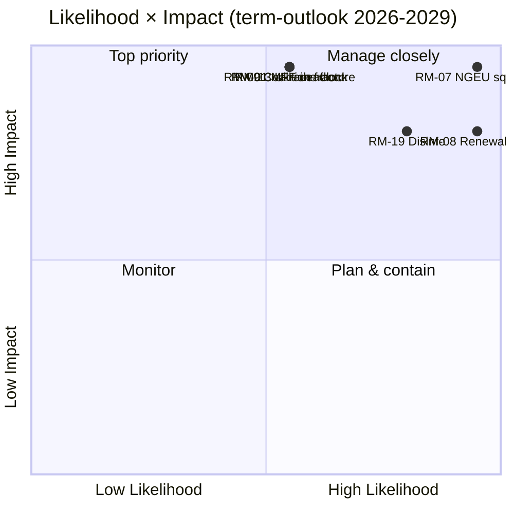

<!-- SPDX-FileCopyrightText: 2026 Hack23 AB -->
<!-- SPDX-License-Identifier: Apache-2.0 -->

# Executive Brief — EP10 Term Outlook to 2029 | 2026-05-11

**Classification:** OSINT — Public Parliamentary Record
**Confidence:** 🟡 Moderate (3-year delivery window; fiscal-cliff drivers are A1, behavioural risks are A2/B3)
**Run:** `analysis/daily/2026-05-11/term-outlook/`
**Horizon:** 2026-05-11 → 2029-06-06 (37-month full-term delivery window)
**Generated:** 2026-05-16 (retrospective brief, no new MCP calls)
**Primary sources:** EP MCP `generate_political_landscape`, `analyze_coalition_dynamics`, `early_warning_system`, `monitor_legislative_pipeline`, `compare_political_groups`, `get_all_generated_stats`; IMF WEO (EA macro envelope); Commission Work-Programme 2026.

---

## 🎯 BLUF

**EP10 will deliver a partial, multi-coalition legislative record between now and the 2029 election** — the term's strategic frame is **structural fiscal pressure**, not acute political crisis. Group composition (EPP 188 / S&D 136 / Renew 77 / Greens 53 / PfE 84 / ECR 78 / The Left 46 / ESN 25 / NI 30) places top-2 share at **44.5%** — well below the 376-seat majority — so **every flagship vote requires at least three groups**, and the EPP+S&D+Renew "Grand Centre" (56.2%) remains the modal coalition. The pivotal legislative window is **2027-Q1 through 2028-Q4** — the period when MFF revision must close, **NGEU repayment activates (2028)**, and the Commission-renewal interregnum has not yet compressed throughput. Two risks dominate the register: **RM-07 NGEU repayment fiscal squeeze (Almost Certain, L5×I5 = 25)** and **RM-08 Commission renewal interregnum drag (Almost Certain, L5×I4 = 20)** — both are baked-in structural events, not political choices. The 2029 election will be **litigated on the fiscal-squeeze narrative** triggered by NGEU repayment activation; the modal seat-projection outcome ("muddle-through delivery", ~50%) shows EPP −5 / S&D −5 / PfE +10 deltas, leaving the centrist coalition just barely intact for EP11.

---

## 🧭 3 Decisions This Brief Supports

| # | Decision | Who decides | Deadline | Evidence |
|:-:|----------|-------------|:--------:|----------|
| 1 | **Front-load flagship votes to 2027-Q3 → 2028-Q4** before Q1-Q2 2029 throughput drops ~40% under Commission-renewal interregnum | Conference of Presidents; committee chairs | calendar of 2027 plenaries | RM-08 (Almost Certain × I4 = 20); finding #7 in `intelligence/synthesis-summary.md` |
| 2 | **Lock MFF revision + NGEU repayment envelope by end-Q4 2027** — the two top-scoring risks (RM-01 deadlock + RM-07 squeeze) collide if this slips | BUDG, ECON, Council, Commission VPs | 2027-Q4 hard deadline | RM-07 (score 25), RM-01 (score 15); `intelligence/economic-context.md` (IMF WEO EA GDP 0.9–1.2% through 2030, gen-gov net lending −2.8% to −3.4% → no fiscal headroom) |
| 3 | **Coalition contingency planning for blocking-minority of ~33–35%** if PfE+ECR+ESN (26.4%) attract EPP defectors on migration / climate-rollback files | EPP whip + S&D whip + Renew shadow rapporteurs | rolling, 12-month watch | RM-09 (Roughly Even × I5 = 15), RM-11 (Likely × I4 = 12); finding #8 |

Each decision binds to a risk row + a key finding in the run's own synthesis; the brief does not introduce judgements outside that chain.

---

## 📰 60-Second Read

- 🔴 **MULTI_COALITION_REQUIRED is the baseline:** top-2 (EPP + S&D) only reach **44.5%**; every plenary win needs ≥3 groups (typically the Grand Centre at 56.2%).
- 🟠 **Two structural certainties:** **NGEU repayment activates 2028** (RM-07, L5×I5=25 — the only score-25 risk); **Commission renewal interregnum** drops legislative throughput ~40% in Q1-Q2 2029 (RM-08, L5×I4=20).
- 🟢 **Pipeline is healthy today:** `monitor_legislative_pipeline` matches EP9 baseline — **no acute bottleneck yet**, but trilogue capacity tightens 2027–2028 (RM-12).
- 🟡 **Fragmentation 6.59 (HIGH)** per `early_warning_system`; effective number of parties ≈ 4.7; `DOMINANT_GROUP_RISK` on EPP at MEDIUM.
- 🔵 **Macro is non-permissive:** IMF WEO EA real GDP **0.9–1.2% through 2030**, inflation 1.6–2.2%, **gen-gov net lending −2.8% to −3.4% of GDP** — no fiscal headroom for new spending without revenue measures.
- 🟣 **Right-wing convergence ceiling:** PfE + ECR + ESN = **26.4%** today; with EPP defectors on rollback votes, this is a **blocking-minority of ~33–35%**, not a winning majority — but enough to defeat ambitious centrist files (RM-11).
- 🩷 **2029 litmus test:** election turns on whether MFF revision + single-market 2.0 + AI Act enforcement land; failure on any one shifts the campaign onto PfE/ECR fiscal-squeeze terrain.
- ⚪ **Modal scenario:** "muddle-through delivery" — Roughly Even (~50%). EPP −5 / S&D −5 / PfE +10 deltas at 2029; coalition recipe survives, cushion thins further.

---

## 🏛️ Three-Pillar Delivery Test (defines whether the term succeeds)

From the run's strategic-lens framing: **all three** of the following must land for the centrist majority to defend its record into 2029.

1. **MFF revision with explicit defence + climate envelopes** — failure here is the single biggest political risk (RM-01 × RM-07 confluence).
2. **Single-market 2.0 package with measurable productivity targets** — RM-04 trilogue collapse is *Unlikely* but high-impact; the run flags it as the most plausible accidental failure.
3. **Demonstrable AI Act enforcement across Member States** — RM-03 *Highly Likely* uneven enforcement; the question is whether DG-CNECT + national authorities can produce three to five high-profile compliance wins by mid-2028.

If any single pillar fails, the 2029 campaign is fought on PfE-ECR fiscal-discipline narratives; if two fail, EP11 sees meaningful realignment.

---

## ⚠️ Risk Snapshot (Top 6 of 20)

| ID | Risk | L | I | Score | WEP band | Operational meaning |
|:--:|------|:-:|:-:|:-----:|----------|---------------------|
| **RM-07** | NGEU repayment fiscal squeeze | 5 | 5 | **25** | Almost Certain | Structural — calendar-bound to 2028, not policy-driven |
| **RM-08** | Commission renewal interregnum drag | 5 | 4 | **20** | Almost Certain | Q1-Q2 2029 throughput ≈ −40% vs. EP9 baseline |
| **RM-19** | Disinformation on 2029 election | 4 | 4 | **16** | Highly Likely | DSA enforcement capacity test |
| **RM-01** | MFF revision deadlock past 2027-Q4 | 3 | 5 | **15** | Roughly Even | The decision-1 deadline; cascades into RM-07 |
| **RM-09** | Coalition arithmetic fracture (top-2 < 44%) | 3 | 5 | **15** | Roughly Even | Existential for the centrist-coalition recipe |
| **RM-13** | Russia / Ukraine front escalation | 3 | 5 | **15** | Roughly Even | Reshuffles calendar by 3–6 months per single shock |

The two **score-25/20 risks (RM-07, RM-08) are calendar-bound certainties**, not political choices — they constrain everything else. The three **score-15 risks are political failures** the centrist coalition can still avert. The brief reads RM-07 + RM-01 confluence as the single highest-leverage decision point of the term.

---

## 🔮 Top Forward Triggers (12-month watch)

From `extended/forward-indicators.md`:

1. **Q4 2026 — MFF negotiating-mandate vote in BUDG.** If the centrist coalition cannot agree a mandate including defence + climate envelopes by Q1 2027, RM-01 advances from Roughly Even toward Likely and forces a Scenario 6 (Grand-Coalition Re-Sealing) negotiation.
2. **2027-Q1 → Q3 — Bureau election + Presidency rotation.** Cross-reference the election-cycle run (`analysis/daily/2026-05-11/election-cycle/`) for the EPP-Presidency price-of-support question; outcome shapes Decision-1 deadline architecture.
3. **2027-H2 — AI Act enforcement reporting.** Three to five DG-CNECT + national-authority compliance actions by mid-2028 are the falsifier for the third pillar; absence advances RM-03.
4. **2028-Q1 — NGEU repayment activation.** This is **not a forecast event, it is a scheduled fiscal cliff** — RM-07 transitions from Almost Certain (future) to Active (present). The decision-2 budget envelope must be closed before this point.
5. **2029 calendar Q1 — pre-election plenary block.** Last opportunity to land flagship votes before the renewal-interregnum throughput drop; trilogue capacity (RM-12) becomes binding.

---

## 🌍 Macro / Geopolitical Envelope

- **IMF WEO (`intelligence/economic-context.md`)**: EA real GDP **0.9–1.2% through 2030**; HICP inflation 1.6–2.2%; general-government net lending **−2.8% to −3.4% of GDP**. No fiscal headroom for new spending without revenue measures — the macro frame is what makes RM-07 score 25.
- **Geopolitical shocks above-baseline:** Russia-Ukraine front (RM-13 score 15), Middle East volatility, Indo-Pacific friction, EU-US relationship rupture risk (RM-14 score 12). The run's stance: **any single shock reshuffles the legislative calendar by 3–6 months**; cumulative exposure across the term is high.
- **DSA test:** RM-19 disinformation campaign on 2029 election (Highly Likely × I4 = 16) is the operational stress test of the regulatory architecture the EP itself built in EP9.

---

## 🛡️ Source-Quality Assessment

- **A1 / A2 anchors:** group composition, fragmentation, pipeline throughput, plenary calendar — EP Open Data Portal, structural backbone of the brief.
- **`monitor_legislative_pipeline`** is *healthy* in this run (matches EP9 baseline) — contrasts with the companion election-cycle run, where the same call returned 0 procedures (A6). The two runs share a date but ran at different times of day; the term-outlook capture is the operationally more useful one.
- **IMF WEO (B-grade)** anchors the macro envelope; this is the brief's most important non-EP input and is essential for scoring RM-07 / RM-01.
- **Behavioural judgements (RM-09 coalition fracture, RM-11 right-wing convergence)** rest on seat-share proxies and 2024-25 voting patterns; per-MEP cohesion data is not yet exposed by the EP API, so confidence here is Moderate.
- **Net confidence:** High on structural certainties (RM-07, RM-08), Moderate on political risks (RM-01, RM-09, RM-11), Moderate on macro envelope.

---

## 🧭 ACH — Three Competing Term Readings

`extended/historical-parallels.md` and `intelligence/scenario-forecast.md` track three competing reading of the same arithmetic:

- **H1 — "Muddle-through delivery"** (Roughly Even, ~50%): all three pillars land, coalition holds, 2029 produces EP10-minus-5%. The run's modal scenario.
- **H2 — "Partial fail / fiscal-narrative loss"** (Likely, ~30%): one pillar fails, 2029 campaign moves to PfE-ECR terrain, centrist coalition emerges thinner but still arithmetically functional.
- **H3 — "Structural break"** (Unlikely, ~10%): treaty crisis / Article 7 escalation / mid-term election from Council deadlock. Long-tail; tracked because the 37-month horizon mandates it.

Remaining ~10% distributes across compound-shock scenarios. The brief defends H1 as the planning baseline while keeping H2 as the **operational** stress case — that is the gap decision-3 is meant to close.

---

## 📎 Run Artifacts (Read-Before-Decide)

| Layer | Artifact | Why |
|-------|----------|-----|
| Article | `article.md` | Full term-outlook narrative |
| Synthesis | `intelligence/synthesis-summary.md` | Headline judgement + 10 key findings (authoritative) |
| Coalition | `intelligence/coalition-dynamics.md` | Grand-Centre / Venezuela / blocking-minority arithmetic |
| Risk register | `risk-scoring/risk-matrix.md` | RM-01 → RM-20 with L × I × Score and WEP bands |
| Quantitative SWOT | `risk-scoring/quantitative-swot.md` | Pillars vs. constraints |
| Pipeline | `intelligence/forward-projection.md`, `commission-wp-alignment.md` | Throughput forecast through 2029 |
| Macro | `intelligence/economic-context.md` | IMF WEO + NGEU envelope |
| Term arc | `intelligence/term-arc.md`, `presidency-trio-context.md`, `mandate-fulfilment-scorecard.md` | Renewal-interregnum sequencing |
| Seat projection | `intelligence/seat-projection.md` | 2029 deltas under H1 / H2 |
| Indicators | `extended/forward-indicators.md` | 12-month tripwire calendar |
| Reliability | `intelligence/mcp-reliability-audit.md` | A1/A2/B3 anchors documented |
| Self-audit | `intelligence/methodology-reflection.md` | Step 10.5 closure |

**Companion:** `analysis/daily/2026-05-11/election-cycle/executive-brief.md` covers the 60-month electoral overlay; the two briefs are designed to be read together.

---

**Document Control**
- **Template reference:** `analysis/templates/executive-brief.md`
- **Artifact path:** `analysis/daily/2026-05-11/term-outlook/executive-brief.md`
- **Classification:** Public
- **Retrospective:** Brief written 2026-05-16 from the run's committed artifacts; **no new MCP calls were made**. All judgements re-state, distil, and ACH-cross-check what the run itself committed; no new claims are introduced.
