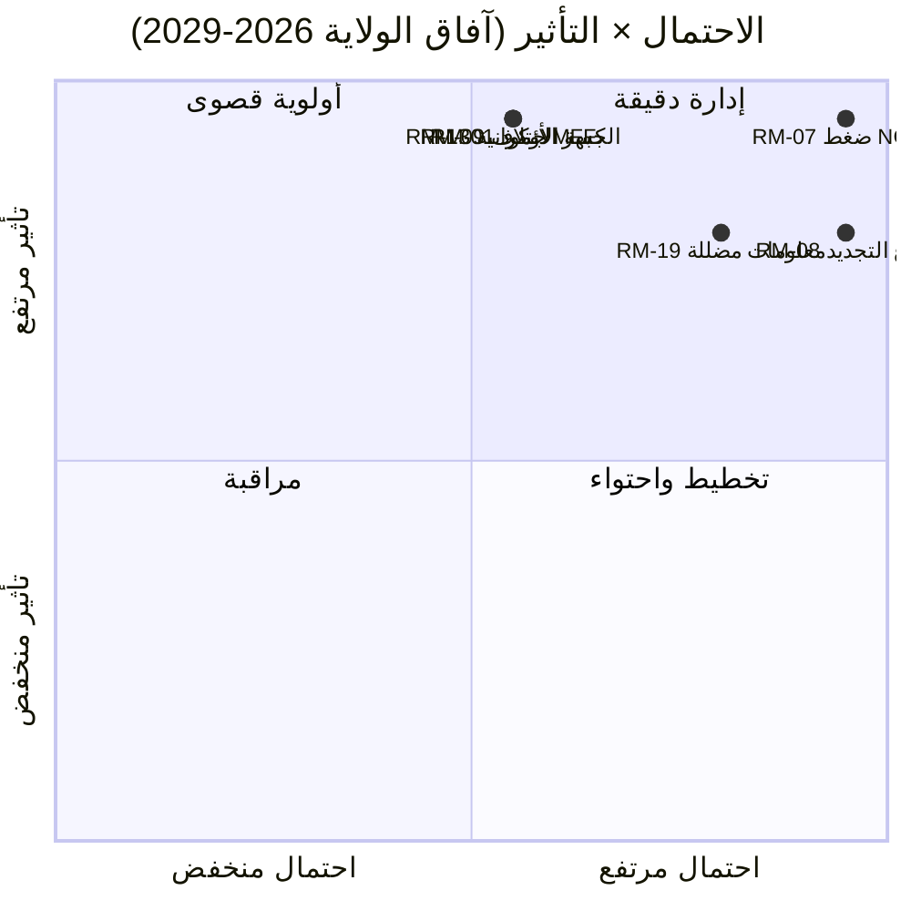

<!-- SPDX-FileCopyrightText: 2026 Hack23 AB -->
<!-- SPDX-License-Identifier: Apache-2.0 -->

# الملخص الاستخباراتي التنفيذي — آفاق ولاية البرلمان الأوروبي EP10 حتى 2029 | 2026-05-11

**التصنيف:** مصادر مفتوحة — السجلات البرلمانية العامة
**الثقة:** 🟡 معتدل (نافذة تسليم 3 سنوات؛ محركات جرف الميزانية A1، مخاطر السلوك A2/B3)
**التنفيذ:** `analysis/daily/2026-05-11/term-outlook/`
**الأفق:** 2026-05-11 → 2029-06-06 (نافذة تسليم الولاية الكاملة — 37 شهرًا)
**التاريخ:** 2026-05-16 (ملخص بأثر رجعي، لا استدعاءات MCP جديدة)
**المصادر الأساسية:** EP MCP `generate_political_landscape`، `analyze_coalition_dynamics`، `early_warning_system`، `monitor_legislative_pipeline`، `compare_political_groups`، `get_all_generated_stats`؛ IMF WEO (الغلاف الكلي لمنطقة اليورو)؛ برنامج عمل المفوضية 2026.

---

## 🎯 الخلاصة الجوهرية

**سيُسلّم EP10 جدول أعمال تشريعياً جزئياً متعدد الائتلافات قبل انتخابات 2029** — الإطار الاستراتيجي للولاية هو **ضغط مالي هيكلي**، لا أزمة سياسية حادة. يضع التوزيع الفصائلي (EVP 188 / S&D 136 / Renew 77 / Greens 53 / PfE 84 / ECR 78 / The Left 46 / ESN 25 / NI 30) حصة الفصيلين الكبيرين عند **44.5%** — أقل بكثير من 376 مقعداً للأغلبية — مما يعني أن **كل تصويت ذا أولوية يستلزم ثلاثة فصائل على الأقل**، وتبقى "grand centre" EVP+S&D+Renew (56.2%) الائتلاف النموذجي. النافذة التشريعية الحاسمة هي **الربع الأول 2027 إلى الربع الرابع 2028** — الفترة التي يجب خلالها إتمام مراجعة الإطار المالي متعدد السنوات (MFF)، وتُفعَّل **مدفوعات سداد NGEU (2028)**، ولم يضغط بعد فترة الفراغ في تجديد المفوضية على التدفق. يهيمن خطران على السجل: **RM-07 ضغط ميزانية سداد NGEU (شبه مؤكد، L5×I5=25)** و**RM-08 فترة الفراغ في تجديد المفوضية (شبه مؤكد، L5×I4=20)** — كلاهما أحداث هيكلية مُضمَّنة، لا خيارات سياسية. ستُخاض **انتخابات 2029 على السردية المتعلقة بضغط الميزانية** الناجم عن تفعيل سداد NGEU؛ يُظهر التوقع النموذجي للمقاعد ("التعثر"، ~50%) دلتا EVP-5 / S&D-5 / PfE+10 في 2029، مع بقاء الائتلاف المركزي سليماً بهامش أضيق.

---

## 🧭 3 قرارات تدعمها هذه الوثيقة

| # | القرار | صاحب القرار | الموعد النهائي | الدليل |
|:-:|----------|-------------|:--------:|----------|
| 1 | **تقديم التصويت ذي الأولوية إلى الربع الثالث 2027 → الربع الرابع 2028** قبل أن ينخفض التدفق ~40% في الربعين الأول والثاني من 2029 خلال فترة فراغ تجديد المفوضية | مؤتمر رؤساء المجموعات؛ رؤساء اللجان | جدول الجلسات العامة 2027 | RM-08 (شبه مؤكد × I4=20)؛ النتيجة #7 في `intelligence/synthesis-summary.md` |
| 2 | **تأمين مراجعة MFF + إطار سداد NGEU قبل نهاية الربع الرابع 2027** — الخطران الأعلى درجةً (RM-01 الجمود + RM-07 الضغط) يتصادمان إذا تأخر الأمر | BUDG، ECON، المجلس، نواب رئيس المفوضية | الموعد النهائي الصارم الربع الرابع 2027 | RM-07 (درجة 25)، RM-01 (درجة 15)؛ `intelligence/economic-context.md` (IMF WEO نمو ناتج محلي إجمالي منطقة اليورو 0.9-1.2% حتى 2030، صافي إقراض حكومي -2.8% إلى -3.4% → لا مساحة مالية لإنفاق جديد) |
| 3 | **تخطيط ائتلاف طوارئ للأقلية الحاجبة ~33-35%** إذا استقطب PfE+ECR+ESN (26.4%) متسربين من EVP في ملفات التراجع عن الهجرة/المناخ | الانضباط الداخلي لـ EVP + المقررون الظل S&D + Renew | مستمر، مراقبة 12 شهراً | RM-09 (متكافئ × I5=15)، RM-11 (محتمل × I4=12)؛ النتيجة #8 |

كل قرار مرتبط بصف مخاطر ونتيجة رئيسية في تنفيذ الوثيقة نفسها؛ الملخص لا يُدخل أحكاماً خارج تلك السلسلة.

---

## 📰 القراءة في 60 ثانية

- 🔴 **MULTI_COALITION_REQUIRED هو خط الأساس:** الفصيلان الكبيران (EVP+S&D) يصلان فقط إلى **44.5%**؛ كل نجاح في الجلسة العامة يستلزم ≥3 فصائل (عادةً grand centre بنسبة 56.2%).
- 🟠 **يقينان هيكليان:** **تفعيل سداد NGEU 2028** (RM-07، L5×I5=25 — المخاطرة الوحيدة بدرجة 25)؛ **فترة فراغ تجديد المفوضية** تُخفّض تدفق التشريعات ~40% في الربعين الأول والثاني من 2029 (RM-08، L5×I4=20).
- 🟢 **الخط التشريعي سليم اليوم:** `monitor_legislative_pipeline` يتوافق مع خط أساس EP9 — **لا اختناق حاد بعد**، لكن سعة المثلث تضيق في 2027-2028 (RM-12).
- 🟡 **التجزؤ 6.59 (مرتفع)** وفق `early_warning_system`؛ العدد الفعلي للأحزاب ≈4.7؛ `DOMINANT_GROUP_RISK` لـ EVP عند MEDIUM.
- 🔵 **الاقتصاد الكلي غير متيح:** IMF WEO الناتج المحلي الإجمالي الحقيقي لمنطقة اليورو **0.9-1.2% حتى 2030**، تضخم 1.6-2.2%، **صافي إقراض حكومي -2.8% إلى -3.4% من الناتج** — لا مساحة مالية لإنفاق جديد دون إجراءات إيراد.
- 🟣 **سقف التقارب اليميني:** PfE+ECR+ESN=**26.4%** اليوم؛ مع المتسربين من EVP في التصويتات التراجعية فهذه **أقلية حاجبة ~33-35%**، ليست أغلبية فائزة — لكنها كافية لهزيمة الملفات المركزية الطموحة (RM-11).
- 🩷 **اختبار الليتموس 2029:** الانتخابات تُحسم بناءً على تسليم مراجعة MFF + السوق الداخلية 2.0 + تطبيق قانون الذكاء الاصطناعي؛ الفشل في أي منها يحوّل الحملة إلى أرض سردية لـ PfE/ECR للميزانية.
- ⚪ **السيناريو النموذجي:** "التعثر" — متكافئ (~50%). دلتا EVP-5 / S&D-5 / PfE+10 في 2029؛ وصفة الائتلاف تبقى لكن الهامش يضيق.

---

## 🏛️ اختبار التسليم ثلاثي الأعمدة (يحدد ما إذا كانت الولاية تنجح)

من إطار العدسة الاستراتيجية للتنفيذ: **يجب تحقيق الثلاثة التالية** حتى تدافع الأغلبية المركزية عن جدول أعمالها حتى 2029.

1. **مراجعة MFF مع غلافَي الدفاع والمناخ الصريحَين** — الفشل هنا هو الخطر السياسي المفرد الأكبر (تقاطع RM-01 × RM-07).
2. **حزمة السوق الداخلية 2.0 مع أهداف إنتاجية قابلة للقياس** — انهيار المثلث RM-04 *غير محتمل* لكن عالي التأثير؛ التنفيذ يُحدده باعتباره الفشل العَرَضي الأكثر احتمالاً.
3. **تطبيق تجريبي موثَّق لقانون الذكاء الاصطناعي في جميع الدول الأعضاء** — عدم التوافق في التطبيق RM-03 *محتمل جداً*؛ السؤال هو ما إذا كانت DG-CNECT + السلطات الوطنية قادرة على إنتاج ثلاثة إلى خمسة انتصارات امتثال بارزة بحلول منتصف 2028.

إذا فشل عمود واحد، تُخاض حملة 2029 على سردية الانضباط المالي لـ PfE-ECR؛ إذا فشل عمودان، شهد EP11 إعادة هيكلة جوهرية.

---

## ⚠️ لقطة المخاطر (أعلى 6 من 20)

| المعرف | المخاطرة | الاحتمال | التأثير | الدرجة | نطاق WEP | المعنى التشغيلي |
|:--:|------|:-:|:-:|:-----:|----------|---------------------|
| **RM-07** | ضغط ميزانية سداد NGEU | 5 | 5 | **25** | شبه مؤكد | هيكلي — مرتبط بالتقويم عام 2028، لا بقرار سياسي |
| **RM-08** | فترة فراغ تجديد المفوضية | 5 | 4 | **20** | شبه مؤكد | الربعان الأول والثاني 2029 تدفق ≈-40% مقارنة بخط أساس EP9 |
| **RM-19** | تضليل انتخابات 2029 | 4 | 4 | **16** | محتمل جداً | اختبار سعة تطبيق DSA |
| **RM-01** | جمود مراجعة MFF بعد الربع الرابع 2027 | 3 | 5 | **15** | متكافئ | الموعد النهائي للقرار 1؛ التسلسل إلى RM-07 |
| **RM-09** | كسر حسابيات الائتلاف (أعلى 2 < 44%) | 3 | 5 | **15** | متكافئ | وجودي لوصفة الائتلاف المركزي |
| **RM-13** | تصعيد الجبهة روسيا/أوكرانيا | 3 | 5 | **15** | متكافئ | يُعيد هيكلة الأجندة 3-6 أشهر لكل صدمة منفردة |

المخاطران **بدرجة 25/20 (RM-07، RM-08) يقينان مرتبطان بالتقويم**، لا خيارات سياسية — يُقيّدان كل شيء. المخاطر الثلاث **بدرجة 15 إخفاقات سياسية** لا يزال بمقدور الائتلاف المركزي تفاديها. يقرأ الملخص تقاطع RM-07+RM-01 باعتباره نقطة الرافعة الأعلى في الولاية.

---

## 🔮 أبرز المحفزات المستقبلية (مراقبة 12 شهراً)

من `extended/forward-indicators.md`:

1. **الربع الرابع 2026 — تصويت BUDG على تفويض تفاوض MFF.** إذا لم يتوصل الائتلاف المركزي إلى تفويض يشمل غلافَي الدفاع والمناخ قبل الربع الأول 2027، تنتقل RM-01 من متكافئ إلى محتمل وتُجبر تفاوض السيناريو 6 (إعادة ختم التحالف الكبير).
2. **الربع الأول 2027 → الربع الثالث 2027 — انتخاب المكتب + تناوب الرئاسة.** إسناد مرجعي إلى تنفيذ دورة الانتخابات (`analysis/daily/2026-05-11/election-cycle/`) حول مسألة سعر دعم رئاسة EVP؛ النتيجة تُشكّل هندسة الموعد النهائي للقرار 1.
3. **الربع الثاني 2027 — تقارير تطبيق قانون الذكاء الاصطناعي.** ثلاثة إلى خمسة إجراءات امتثال DG-CNECT + السلطات الوطنية قبل منتصف 2028 هي مُفنِّد العمود الثالث؛ غيابها يرفع RM-03.
4. **الربع الأول 2028 — تفعيل سداد NGEU.** هذا **ليس حدثاً تنبؤياً، بل جرف ميزانية مُجدوَل** — RM-07 تنتقل من شبه مؤكد (مستقبل) إلى نشط (حاضر). يجب إغلاق الإطار المالي للقرار 2 قبل هذه النقطة.
5. **الربع الأول 2029 — الكتلة الجلسوية ما قبل الانتخابات.** فرصة أخيرة لتمرير التصويت ذي الأولوية قبل انخفاض تدفق فترة الفراغ في التجديد؛ سعة المثلث (RM-12) تصبح مُقيِّدة.

---

## 🌍 الغلاف الاقتصادي الكلي والجيوسياسي

- **IMF WEO (`intelligence/economic-context.md`):** الناتج المحلي الإجمالي الحقيقي لمنطقة اليورو **0.9-1.2% حتى 2030**؛ تضخم HICP 1.6-2.2%؛ صافي إقراض حكومي **-2.8% إلى -3.4% من الناتج**. لا مساحة مالية لإنفاق جديد دون إجراءات إيراد — الإطار الكلي هو ما يمنح RM-07 درجة 25.
- **صدمات جيوسياسية فوق الخط الأساس:** جبهة روسيا-أوكرانيا (RM-13 درجة 15)، تقلبات الشرق الأوسط، احتكاك المحيط الهندي والهادئ، خطر توتر العلاقات الأوروبية-الأمريكية (RM-14 درجة 12). موقف التنفيذ: **كل صدمة منفردة تُعيد هيكلة الأجندة التشريعية 3-6 أشهر**؛ التعرض التراكمي عبر الولاية مرتفع.
- **اختبار DSA:** حملة التضليل قبيل انتخابات 2029 RM-19 (محتمل جداً × I4=16) هي الاختبار التشغيلي للبنية التنظيمية التي بناها البرلمان الأوروبي نفسه في EP9.

---

## 🛡️ تقييم جودة المصادر

- **مراسي A1/A2:** التوزيع الفصائلي، التجزؤ، تدفق الخط التشريعي، أجندة الجلسات العامة — بوابة البيانات المفتوحة لـ EP، الأساس الهيكلي للملخص.
- **`monitor_legislative_pipeline`** في هذا التنفيذ *سليم* (يتوافق مع خط أساس EP9) — يتناقض مع تنفيذ دورة الانتخابات المصاحب حيث أعادت نفس الاستدعاءات 0 إجراءات (A6). يشترك التنفيذان في نفس التاريخ لكنهما أُجريا في أوقات مختلفة من اليوم؛ لقطة آفاق الولاية هي الأكثر فائدة تشغيلياً.
- **IMF WEO (درجة B)** يُثبِّت الغلاف الكلي؛ هذا أهم مدخل غير تابع لـ EP في الملخص وضروري لدرجة RM-07/RM-01.
- **الأحكام السلوكية (RM-09 كسر الائتلاف، RM-11 التقارب اليميني)** تعتمد على وكلاء نسبة المقاعد وأنماط التصويت 2024-25؛ بيانات تماسك كل عضو على حدة لم تُكشف بعد من خلال واجهة برمجة تطبيقات EP، لذا الثقة هنا معتدل.
- **صافي الثقة:** مرتفع للمواضع الهيكلية (RM-07، RM-08)، معتدل للمخاطر السياسية (RM-01، RM-09، RM-11)، معتدل للغلاف الكلي.

---

## 🧭 ACH — ثلاث قراءات متنافسة للولاية

تتبع `extended/historical-parallels.md` و`intelligence/scenario-forecast.md` ثلاث قراءات متنافسة لنفس الحسابيات:

- **H1 — "التعثر"** (متكافئ، ~50%): تتحقق الأعمدة الثلاثة، يصمد الائتلاف، تُنتج 2029 EP10-ناقص-5%. السيناريو النموذجي للتنفيذ.
- **H2 — "فشل جزئي / خسارة السردية المالية"** (محتمل، ~30%): يفشل عمود واحد، تنتقل حملة 2029 إلى أرض PfE-ECR، يبقى الائتلاف المركزي أضعف لكن لا يزال قابلاً للعمل حسابياً.
- **H3 — "كسر هيكلي"** (غير محتمل، ~10%): أزمة معاهدة / تصعيد المادة 7 / انتخابات مبكرة بسبب جمود المجلس. ذيل طويل؛ تتبعه لأن أفق 37 شهراً يستدعيه.

الـ~10% المتبقية تتوزع على سيناريوهات الصدمات المركبة. يدافع الملخص عن H1 كخط أساس للتخطيط مع الإبقاء على H2 باعتباره **حالة الاختبار التشغيلية** — هذه الفجوة التي يجب أن يسدها القرار 3.

---

## 📎 مخرجات التنفيذ (اقرأ قبل القرار)

| الطبقة | المخرج | لماذا |
|-------|----------|-----|
| المقال | `article.md` | السرد الكامل لآفاق الولاية |
| التوليف | `intelligence/synthesis-summary.md` | الحكم الرئيسي + 10 نتائج رئيسية (استشاري) |
| الائتلاف | `intelligence/coalition-dynamics.md` | حسابيات grand centre / فنزويلا / الأقلية الحاجبة |
| سجل المخاطر | `risk-scoring/risk-matrix.md` | RM-01 → RM-20 مع الاحتمال × التأثير × الدرجة ونطاقات WEP |
| SWOT الكمي | `risk-scoring/quantitative-swot.md` | الأعمدة مقابل القيود |
| الخط التشريعي | `intelligence/forward-projection.md`، `commission-wp-alignment.md` | توقع التدفق حتى 2029 |
| الاقتصاد الكلي | `intelligence/economic-context.md` | IMF WEO + غلاف NGEU |
| قوس الولاية | `intelligence/term-arc.md`، `presidency-trio-context.md`، `mandate-fulfilment-scorecard.md` | تسلسل فراغ تجديد المفوضية |
| توقع المقاعد | `intelligence/seat-projection.md` | دلتا 2029 في H1/H2 |
| المؤشرات | `extended/forward-indicators.md` | أجندة عوامل تشغيل 12 شهراً |
| الموثوقية | `intelligence/mcp-reliability-audit.md` | مراسي A1/A2/B3 موثقة |
| التأمل الذاتي | `intelligence/methodology-reflection.md` | إغلاق الخطوة 10.5 |

**مصاحب:** `analysis/daily/2026-05-11/election-cycle/executive-brief.md` يغطي التراكب الانتخابي على 60 شهراً؛ الملخصان مصممان للقراءة معاً.

---

**ضبط الوثيقة**
- **مرجع القالب:** `analysis/templates/executive-brief.md`
- **مسار المخرج:** `analysis/daily/2026-05-11/term-outlook/executive-brief.md`
- **التصنيف:** عام
- **بأثر رجعي:** كُتب الملخص في 2026-05-16 بناءً على مخرجات التنفيذ المُودعة؛ **لم تُجرَ استدعاءات MCP جديدة**. جميع الأحكام تُعيد، تُقطِّر وتتحقق بالتحليل المقارن مما أودعه التنفيذ نفسه؛ لا تُدخَل ادعاءات جديدة.
