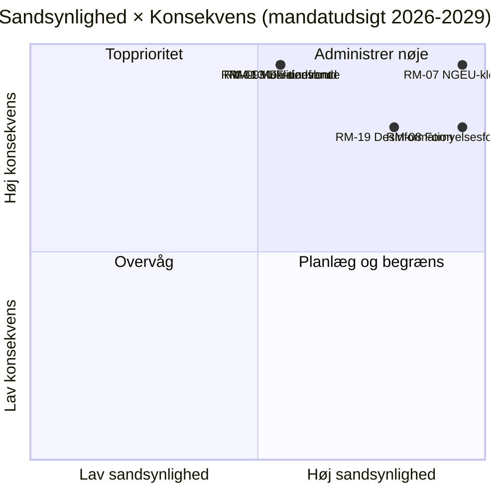

<!-- SPDX-FileCopyrightText: 2026 Hack23 AB -->
<!-- SPDX-License-Identifier: Apache-2.0 -->

# Udøvende Efterretningsbriefing — EP10 Mandatudsigt til 2029 | 2026-05-11

**Klassifikation:** OSINT — Offentlig parlamentarisk bestand
**Konfidens:** 🟡 Moderat (3-årig leveringshorisont; finanspolitiske klippekantsdrivere er A1, adfærdsrisici er A2/B3)
**Kørsel:** `analysis/daily/2026-05-11/term-outlook/`
**Horisont:** 2026-05-11 → 2029-06-06 (37-måneders fuld mandatleveringsvindue)
**Genereret:** 2026-05-16 (retrospektiv briefing, ingen nye MCP-kald)
**Primære kilder:** EP MCP `generate_political_landscape`, `analyze_coalition_dynamics`, `early_warning_system`, `monitor_legislative_pipeline`, `compare_political_groups`, `get_all_generated_stats`; IMF WEO (EA-makroenvelop); Kommissionens arbejdsprogram 2026.

---

## 🎯 BLUF

**EP10 vil levere en delvis, flerkoalitionsbaseret lovgivningsmæssig rekord frem til valget i 2029** — mandatets strategiske ramme er **strukturelt finanspres**, ikke en akut politisk krise. Gruppesammensætningen (EPP 188 / S&D 136 / Renew 77 / Greens 53 / PfE 84 / ECR 78 / The Left 46 / ESN 25 / NI 30) placerer top-2-andelen på **44,5 %** — langt under 376-sæders flertal — så **enhver flagskibsafstemning kræver mindst tre grupper**, og EPP+S&D+Renew "Grand Centre" (56,2 %) forbliver den modale koalition. Det afgørende lovgivningsvindue er **2027-K1 til 2028-K4** — perioden, hvor MFF-revisionen skal afsluttes, **NGEU-tilbagebetaling aktiveres (2028)**, og Kommissionens fornyelsesinterregnum endnu ikke har komprimeret gennemstrømningen. To risici dominerer registret: **RM-07 NGEU-tilbagebetalings­finansklemme (Næsten sikker, L5×I5 = 25)** og **RM-08 Kommissionsfornyelsesinterregnum (Næsten sikker, L5×I4 = 20)** — begge er indlejrede strukturelle hændelser, ikke politiske valg. Valget i 2029 vil **blive afgjort på baggrund af finansklemme-narrativet** udløst af NGEU-tilbagebetalingsaktiveringen; det modale sædeprognoseresultat ("muddling-through", ~50 %) viser EPP −5 / S&D −5 / PfE +10 deltaer, og efterlader den centristiske koalition netop intakt for EP11.

---

## 🧭 3 Beslutninger Denne Briefing Understøtter

| # | Beslutning | Hvem beslutter | Frist | Dokumentation |
|:-:|----------|-------------|:--------:|----------|
| 1 | **Frem­skynd flagskibsafstemninger til 2027-K3 → 2028-K4** inden gennemstrømningen falder ~40 % under Kommissionens fornyelsesinterregnum K1-K2 2029 | Formandskabskonferencen; udvalgsformænd | kalender for 2027 plenarmøder | RM-08 (Næsten sikker × I4 = 20); fund nr. 7 i `intelligence/synthesis-summary.md` |
| 2 | **Lås MFF-revision + NGEU-tilbagebetalingsramme senest K4 2027** — de to højest scorende risici (RM-01 dødvande + RM-07 klemme) kolliderer, hvis dette glider | BUDG, ECON, Rådet, Kommissionens VP'er | hård deadline 2027-K4 | RM-07 (score 25), RM-01 (score 15); `intelligence/economic-context.md` (IMF WEO EA BNP 0,9–1,2 % til 2030, gen-gov nettoudlån −2,8 % til −3,4 % → intet finansrum) |
| 3 | **Koalitionsberedskabsplanlægning for blokeringsminoritet på ~33–35 %** hvis PfE+ECR+ESN (26,4 %) tiltrækker EPP-afhoppere på migrations-/klimatrollback-sager | EPP-whip + S&D-whip + Renew skyggeordførere | løbende, 12-måneders overvågning | RM-09 (Omtrent lige × I5 = 15), RM-11 (Sandsynligt × I4 = 12); fund nr. 8 |

Hvert beslutningspunkt er knyttet til en risikorække og et nøglefund i kørslens egen syntese; briefingen introducerer ingen vurderinger uden for denne kæde.

---

## 📰 60-Sekunders Læsning

- 🔴 **MULTI_COALITION_REQUIRED er basislinje:** top-2 (EPP + S&D) når kun **44,5 %**; enhver plenarsejr kræver ≥3 grupper (typisk Grand Centre på 56,2 %).
- 🟠 **To strukturelle sikkerhedspunkter:** **NGEU-tilbagebetaling aktiveres 2028** (RM-07, L5×I5=25 — den eneste score-25-risiko); **Kommissionsfornyelsesinterregnum** reducerer lovgivningsgennemstrømningen ~40 % K1-K2 2029 (RM-08, L5×I4=20).
- 🟢 **Pipeline er sund i dag:** `monitor_legislative_pipeline` matcher EP9-basislinje — **ingen akut flaskehals endnu**, men trialogkapaciteten strammes 2027–2028 (RM-12).
- 🟡 **Fragmentering 6,59 (HØJ)** ifølge `early_warning_system`; effektivt antal partier ≈ 4,7; `DOMINANT_GROUP_RISK` på EPP på MEDIUM.
- 🔵 **Makro er ikke-permissiv:** IMF WEO EA real BNP **0,9–1,2 % til 2030**, inflation 1,6–2,2 %, **gen-gov nettoudlån −2,8 % til −3,4 % af BNP** — intet finansrum til nye udgifter uden indtægtsforanstaltninger.
- 🟣 **Højrekonvergensgrænse:** PfE + ECR + ESN = **26,4 %** i dag; med EPP-afhoppere ved rollback-afstemninger er dette en **blokeringsminoritet på ~33–35 %**, ikke et vindende flertal — men nok til at nedlægge veto mod ambitiøse centristiske sager (RM-11).
- 🩷 **Lakmustest 2029:** valget afgøres af, om MFF-revision + det indre marked 2.0 + AI Act-håndhævelse lykkes; fiasko på ét punkt skifter kampagneterræn til PfE/ECR finansklemme.
- ⚪ **Modalt scenario:** "muddling-through" — Omtrent lige (~50 %). EPP −5 / S&D −5 / PfE +10 deltaer i 2029; koalitionsopskrift overlever, puden tyndes yderligere.

---

## 🏛️ Trepilar-Leveringstest (definerer om mandatet lykkes)

Fra kørslens strategiske linseramme: **alle tre** af følgende skal lykkes for, at den centristiske majoritet kan forsvare sin rekord ind i 2029.

1. **MFF-revision med eksplicitte forsvars- og klimatenveloper** — fiasko her er den enkelt største politiske risiko (RM-01 × RM-07 sammenflow).
2. **Det indre marked 2.0-pakke med målbare produktivitetsmål** — RM-04 trialogkollaps er *Usandsynlig* men høj-konsekvens; kørslen identificerer det som den mest plausible utilsigtede fiasko.
3. **Dokumenterbar AI Act-håndhævelse på tværs af medlemsstaterne** — RM-03 *Højst sandsynlig* ujævn håndhævelse; spørgsmålet er, om DG-CNECT + nationale myndigheder kan producere tre til fem højprofilerede overholdelsesgevinster inden midten af 2028.

Hvis én enkelt pille svigter, føres 2029-kampagnen på PfE-ECR finansdisciplin-narrativer; svigter to, oplever EP11 en meningsfuld omfordeling.

---

## ⚠️ Risikooversigt (Top 6 af 20)

| ID | Risiko | S | K | Score | WEP-band | Operativ betydning |
|:--:|------|:-:|:-:|:-----:|----------|---------------------|
| **RM-07** | NGEU-tilbagebetalings­finansklemme | 5 | 5 | **25** | Næsten sikker | Strukturel — kalenderbundet til 2028, ikke politikstyret |
| **RM-08** | Kommissionsfornyelsesinterregnum | 5 | 4 | **20** | Næsten sikker | K1-K2 2029 gennemstrømning ≈ −40 % vs. EP9-baslinje |
| **RM-19** | Desinformation om 2029-valget | 4 | 4 | **16** | Højst sandsynlig | DSA-håndhævelseskapacitetstest |
| **RM-01** | MFF-revisionsdødvande efter 2027-K4 | 3 | 5 | **15** | Omtrent lige | Beslutning-1-deadline; kaskader ind i RM-07 |
| **RM-09** | Koalitionsaritmeti­kbrud (top-2 < 44 %) | 3 | 5 | **15** | Omtrent lige | Eksistentiel for centristisk koalitionsopskrift |
| **RM-13** | Rusland/Ukraine-frontoptrapning | 3 | 5 | **15** | Omtrent lige | Omkalfatrer kalenderen med 3–6 måneder pr. enkelt chok |

De to **score-25/20-risici (RM-07, RM-08) er kalenderbundne sikkerhedspunkter**, ikke politiske valg — de begrænser alt andet. De tre **score-15-risici er politiske fiaskoer**, som den centristiske koalition stadig kan afværge. Briefingen læser RM-07 + RM-01-sammenflow som mandatets enkelt mest løftestangs­kraftfulde beslutningspunkt.

---

## 🔮 Top Fremadrettede Udløsere (12-måneders overvågning)

Fra `extended/forward-indicators.md`:

1. **K4 2026 — MFF-forhandlingsmandatafstemning i BUDG.** Hvis den centristiske koalition ikke kan enes om et mandat inklusive forsvars- og klimatenveloper senest K1 2027, avancerer RM-01 fra Omtrent lige til Sandsynlig og tvinger en Scenario 6 (Grand Coalition Re-Sealing)-forhandling.
2. **2027-K1 → K3 — Bureauvalg + Formandskabsrotation.** Krydshenvis til valgcyklus-kørslen (`analysis/daily/2026-05-11/election-cycle/`) for EPP-Formandskabets støtteprisspørgsmål; resultatet former Beslutning-1-deadline-arkitekturen.
3. **2027-K2 — AI Act-håndhævelsesrapportering.** Tre til fem DG-CNECT + nationale myndigheders efterlevelseshandlinger inden midten af 2028 er falsifikatoren for den tredje pille; fravær avancerer RM-03.
4. **2028-K1 — NGEU-tilbagebetalingsaktivering.** Dette er **ikke en prognosehændelse, det er en planlagt finansiel klippekant** — RM-07 overgår fra Næsten sikker (fremtid) til Aktiv (nutid). Beslutning-2-budgetrammerne skal lukkes inden dette tidspunkt.
5. **2029 kalender K1 — før-valgsplenariblok.** Sidste mulighed for at lande flagskibsafstemninger inden fornyelsesinterregnummets gennemstrømningsfald; trialogkapacitet (RM-12) bliver bindende.

---

## 🌍 Makro-/Geopolitisk Envelop

- **IMF WEO (`intelligence/economic-context.md`)**: EA real BNP **0,9–1,2 % til 2030**; HICP-inflation 1,6–2,2 %; generel statsforvaltning nettoudlån **−2,8 % til −3,4 % af BNP**. Intet finansrum til nye udgifter uden indtægtsforanstaltninger — makrorammen er det, der giver RM-07 en score på 25.
- **Geopolitiske chok over basislinje:** Rusland-Ukraine-fronten (RM-13 score 15), Mellemøsten-volatilitet, Indo-Stillehavs-friktion, EU-USA-forbindelsesbrudsrisiko (RM-14 score 12). Kørslens holdning: **ethvert enkelt chok omkalfatrer den lovgivningsmæssige kalender med 3–6 måneder**; kumulativ eksponering over mandatperioden er høj.
- **DSA-test:** RM-19 desinformationskampagne om 2029-valget (Højst sandsynlig × I4 = 16) er den operationelle stresstest af den reguleringsarkitektur, som EP selv byggede i EP9.

---

## 🛡️ Kildekvali­tetsvurdering

- **A1/A2-ankre:** gruppesammensætning, fragmentering, pipelinegennemstrømning, plenarkalender — EP Open Data Portal, strukturelt fundament for briefingen.
- **`monitor_legislative_pipeline`** er *sund* i denne kørsel (matcher EP9-basislinje) — kontrasterer med den ledsagende valgcyklus-kørsel, hvor det samme kald returnerede 0 procedurer (A6). De to kørsler deler dato, men kørte på forskellige tidspunkter af dagen; mandatudsigternes optagelse er den operativt mest nyttige.
- **IMF WEO (B-karakter)** forankrer makroenvelopen; dette er briefingens vigtigste ikke-EP-input og er afgørende for scoring af RM-07/RM-01.
- **Adfærdsvurderinger (RM-09 koalitionsbrud, RM-11 højrekonvergens)** hviler på sædeandels­proxier og 2024-25 afstemnings­mønstre; per-MEP kohæsionsdata er endnu ikke eksponeret af EP API'et, så konfidens her er Moderat.
- **Nettokonfidens:** Høj på strukturelle sikkerhedspunkter (RM-07, RM-08), Moderat på politiske risici (RM-01, RM-09, RM-11), Moderat på makroenvelop.

---

## 🧭 ACH — Tre Konkurrerende Mandatfortolkninger

`extended/historical-parallels.md` og `intelligence/scenario-forecast.md` sporer tre konkurrerende fortolkninger af den samme aritmetik:

- **H1 — "Muddling-through"** (Omtrent lige, ~50 %): alle tre pillarer lykkes, koalitionen holder, 2029 producerer EP10-minus-5 %. Kørslens modale scenario.
- **H2 — "Delvis fiasko / finansnarrativtab"** (Sandsynlig, ~30 %): én pille svigter, 2029-kampagnen bevæger sig til PfE-ECR-terræn, centristisk koalition opstår tyndere men stadig aritmetisk funktionel.
- **H3 — "Strukturbrud"** (Usandsynlig, ~10 %): traktatkrise / Artikel 7-optrapning / midtvejsvalg fra Råddødvande. Lang hale; spores fordi 37-månedershorisonten kræver det.

Resterende ~10 % fordeles over sammensatte chokscenarier. Briefingen forsvarer H1 som planlægsbasislinje, mens H2 holdes som den **operationelle** stresscase — det er det hul, Beslutning-3 er beregnet til at lukke.

---

## 📎 Kørselsar­tefakter (Læs-Før-Beslut)

| Lag | Artefakt | Hvorfor |
|-------|----------|-----|
| Artikel | `article.md` | Fuldt mandatudsigtnarrativ |
| Syntese | `intelligence/synthesis-summary.md` | Hoved­vurdering + 10 nøglefund (autoritativ) |
| Koalition | `intelligence/coalition-dynamics.md` | Grand-Centre / Venezuela / blokeringsminoritet-aritmetik |
| Risikoregister | `risk-scoring/risk-matrix.md` | RM-01 → RM-20 med S × K × Score og WEP-band |
| Kvantitativ SWOT | `risk-scoring/quantitative-swot.md` | Pillarer vs. begrænsninger |
| Pipeline | `intelligence/forward-projection.md`, `commission-wp-alignment.md` | Gennemstrømningsprognose til 2029 |
| Makro | `intelligence/economic-context.md` | IMF WEO + NGEU-envelop |
| Mandatbue | `intelligence/term-arc.md`, `presidency-trio-context.md`, `mandate-fulfilment-scorecard.md` | Fornyelsesinterregnum-sekvensering |
| Sædeprognose | `intelligence/seat-projection.md` | 2029 deltaer under H1/H2 |
| Indikatorer | `extended/forward-indicators.md` | 12-måneders tripwire-kalender |
| Pålidelighed | `intelligence/mcp-reliability-audit.md` | A1/A2/B3-ankre dokumenteret |
| Selvrevision | `intelligence/methodology-reflection.md` | Trin 10.5-afslutning |

**Ledsager:** `analysis/daily/2026-05-11/election-cycle/executive-brief.md` dækker 60-månedersvaloverlejringen; de to briefinger er designet til at læses samlet.

---

**Dokumentkontrol**
- **Skabelonreference:** `analysis/templates/executive-brief.md`
- **Artefaktsti:** `analysis/daily/2026-05-11/term-outlook/executive-brief.md`
- **Klassifikation:** Offentlig
- **Retrospektiv:** Briefing skrevet 2026-05-16 fra kørslens committede artefakter; **ingen nye MCP-kald blev foretaget**. Alle vurderinger gen­giver, destillerer og ACH-krydstjekker, hvad kørslen selv committede; ingen nye påstande introduceres.
