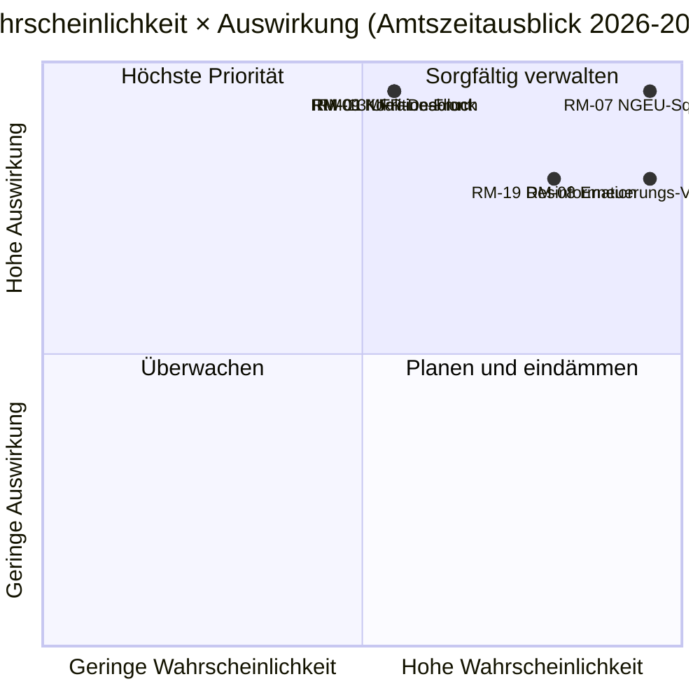

<!-- SPDX-FileCopyrightText: 2026 Hack23 AB -->
<!-- SPDX-License-Identifier: Apache-2.0 -->

# Exekutive Nachrichtenzusammenfassung — EP10 Amtszeitausblick bis 2029 | 2026-05-11

**Klassifizierung:** OSINT — Öffentliche parlamentarische Aufzeichnung
**Konfidenz:** 🟡 Mäßig (3-jähriges Lieferfenster; fiskalische Klippenrandtreiber sind A1, Verhaltensrisiken sind A2/B3)
**Lauf:** `analysis/daily/2026-05-11/term-outlook/`
**Horizont:** 2026-05-11 → 2029-06-06 (37-monatiges Vollmandat-Lieferfenster)
**Erstellt:** 2026-05-16 (retrospektive Zusammenfassung, keine neuen MCP-Aufrufe)
**Primärquellen:** EP MCP `generate_political_landscape`, `analyze_coalition_dynamics`, `early_warning_system`, `monitor_legislative_pipeline`, `compare_political_groups`, `get_all_generated_stats`; IMF WEO (EA-Makrohülle); Arbeitsprogramm der Kommission 2026.

---

## 🎯 BLUF

**Das EP10 wird bis zur Wahl 2029 ein partielles, mehrkoalitionäres Gesetzgebungsprotokoll vorlegen** — der strategische Rahmen des Mandats ist **struktureller Finanzierungsdruck**, keine akute politische Krise. Die Fraktionszusammensetzung (EPP 188 / S&D 136 / Renew 77 / Greens 53 / PfE 84 / ECR 78 / The Left 46 / ESN 25 / NI 30) platziert den Anteil der zwei größten Fraktionen bei **44,5 %** — weit unter der 376-Sitze-Mehrheit — sodass **jede Abstimmung über wichtige Vorhaben mindestens drei Fraktionen erfordert**, und das EPP+S&D+Renew „Grand Centre" (56,2 %) die modale Koalition bleibt. Das entscheidende Gesetzgebungsfenster ist **2027-Q1 bis 2028-Q4** — der Zeitraum, in dem die MFR-Revision abgeschlossen sein muss, die **NGEU-Rückzahlung aktiviert wird (2028)** und das Interregnum der Kommissionserneuerung den Durchsatz noch nicht komprimiert hat. Zwei Risiken dominieren das Register: **RM-07 NGEU-Rückzahlungs-Finanzierungssqueeze (Fast sicher, L5×I5 = 25)** und **RM-08 Interregnum der Kommissionserneuerung (Fast sicher, L5×I4 = 20)** — beide sind eingebettete strukturelle Ereignisse, keine politischen Entscheidungen. Die Wahl 2029 wird **am Narrativ des durch die NGEU-Rückzahlungsaktivierung ausgelösten Finanzierungsdrucks entschieden**; das modale Sitzprognoseergebnis („Durchwursteln", ~50 %) zeigt EPP −5 / S&D −5 / PfE +10 Deltas und lässt die zentristische Koalition gerade noch intakt für EP11.

---

## 🧭 3 Entscheidungen, die diese Zusammenfassung unterstützt

| # | Entscheidung | Wer entscheidet | Frist | Belege |
|:-:|----------|-------------|:--------:|----------|
| 1 | **Wichtige Abstimmungen auf 2027-Q3 → 2028-Q4 vorziehen**, bevor der Durchsatz in Q1–Q2 2029 unter dem Kommissions-Erneuerungsinterregnum um ~40 % fällt | Konferenz der Präsidenten; Ausschussvorsitzende | Kalender der Plenarsitzungen 2027 | RM-08 (Fast sicher × I4 = 20); Befund Nr. 7 in `intelligence/synthesis-summary.md` |
| 2 | **MFR-Revision + NGEU-Rückzahlungsrahmen bis Ende Q4 2027 festlegen** — die zwei am höchsten bewerteten Risiken (RM-01 Deadlock + RM-07 Squeeze) kollidieren, wenn dies gleitet | BUDG, ECON, Rat, Kommissions-VPs | harte Frist 2027-Q4 | RM-07 (Punktzahl 25), RM-01 (Punktzahl 15); `intelligence/economic-context.md` (IMF WEO EA-BIP 0,9–1,2 % bis 2030, Gesamtstaat Nettokreditvergabe −2,8 % bis −3,4 % → kein Fiskalspielraum) |
| 3 | **Koalitions-Notfallplanung für Sperrminorität von ~33–35 %**, falls PfE+ECR+ESN (26,4 %) EPP-Abtrünnige bei Migrations-/Klimarollback-Dateien gewinnen | EPP-Fraktionsdisziplinarbeauftragter + S&D + Renew-Schattenberichterstatter | laufend, 12-Monats-Beobachtung | RM-09 (Ungefähr gleich × I5 = 15), RM-11 (Wahrscheinlich × I4 = 12); Befund Nr. 8 |

Jede Entscheidung ist an eine Risikozeile und einen Schlüsselbefund in der eigenen Synthese des Laufs gebunden; die Zusammenfassung führt keine Beurteilungen außerhalb dieser Kette ein.

---

## 📰 60-Sekunden-Überblick

- 🔴 **MULTI_COALITION_REQUIRED ist die Basislinie:** die zwei größten (EPP + S&D) erreichen nur **44,5 %**; jeder Plenumserfolg erfordert ≥3 Fraktionen (typischerweise das Grand Centre mit 56,2 %).
- 🟠 **Zwei strukturelle Gewissheiten:** **NGEU-Rückzahlung aktiviert 2028** (RM-07, L5×I5=25 — das einzige Risiko mit Punktzahl 25); **Interregnum der Kommissionserneuerung** senkt den Gesetzgebungsdurchsatz in Q1–Q2 2029 um ~40 % (RM-08, L5×I4=20).
- 🟢 **Pipeline heute gesund:** `monitor_legislative_pipeline` entspricht EP9-Basislinie — **noch kein akuter Engpass**, aber die Trilogs-Kapazität wird 2027–2028 knapper (RM-12).
- 🟡 **Fragmentierung 6,59 (HOCH)** per `early_warning_system`; effektive Anzahl der Parteien ≈ 4,7; `DOMINANT_GROUP_RISK` bei EPP auf MEDIUM.
- 🔵 **Makro ist nicht permissiv:** IMF WEO EA-Real-BIP **0,9–1,2 % bis 2030**, Inflation 1,6–2,2 %, **Gesamtstaat Nettokreditvergabe −2,8 % bis −3,4 % des BIP** — kein Fiskalspielraum für neue Ausgaben ohne Einnahmenmaßnahmen.
- 🟣 **Rechtskonvergenz-Obergrenze:** PfE + ECR + ESN = **26,4 %** heute; mit EPP-Abtrünnigen bei Rollback-Abstimmungen ist dies eine **Sperrminorität von ~33–35 %**, keine Gewinnmehrheit — aber genug, um anspruchsvolle zentristische Dateien zu besiegen (RM-11).
- 🩷 **Lackmustest 2029:** Wahl entscheidet sich daran, ob MFR-Revision + Binnenmarkt 2.0 + KI-Gesetz-Durchsetzung landen; Scheitern bei einem Punkt verlagert den Wahlkampf auf PfE/ECR-Finanzierungs­druck-Terrain.
- ⚪ **Modalszenario:** „Durchwursteln" — Ungefähr gleich (~50 %). EPP −5 / S&D −5 / PfE +10 Deltas in 2029; Koalitionsrezept überlebt, Puffer dünnt weiter aus.

---

## 🏛️ Drei-Säulen-Liefertest (definiert, ob das Mandat gelingt)

Aus dem strategischen Linsenrahmen des Laufs: **alle drei** der folgenden müssen gelingen, damit die zentristische Mehrheit ihre Bilanz bis 2029 verteidigen kann.

1. **MFR-Revision mit expliziten Verteidigungs- und Klimahüllen** — Scheitern hier ist das einzeln größte politische Risiko (RM-01 × RM-07-Zusammenfluss).
2. **Binnenmarkt 2.0-Paket mit messbaren Produktivitätszielen** — RM-04 Trilog-Kollaps ist *Unwahrscheinlich*, aber hohe Auswirkungen; der Lauf identifiziert es als das plausibelste unbeabsichtigte Scheitern.
3. **Nachweisbare KI-Gesetz-Durchsetzung in allen Mitgliedstaaten** — RM-03 *Sehr wahrscheinlich* ungleichmäßige Durchsetzung; die Frage ist, ob DG-CNECT + nationale Behörden drei bis fünf hochkarätige Compliance-Gewinne bis Mitte 2028 erzielen können.

Wenn eine einzige Säule versagt, wird der Wahlkampf 2029 auf PfE-ECR-Haushaltsdisziplin-Narrativen geführt; versagen zwei, erlebt EP11 eine substanzielle Neuausrichtung.

---

## ⚠️ Risiko-Schnappschuss (Top 6 von 20)

| ID | Risiko | W | A | Punkte | WEP-Band | Operative Bedeutung |
|:--:|------|:-:|:-:|:-----:|----------|---------------------|
| **RM-07** | NGEU-Rückzahlungs-Finanzsqueeze | 5 | 5 | **25** | Fast sicher | Strukturell — kalendergebunden auf 2028, nicht politikgesteuert |
| **RM-08** | Kommissions-Erneuerungsinterregnum | 5 | 4 | **20** | Fast sicher | Q1–Q2 2029 Durchsatz ≈ −40 % vs. EP9-Basislinie |
| **RM-19** | Desinformation zur Wahl 2029 | 4 | 4 | **16** | Sehr wahrscheinlich | DSA-Durchsetzungskapazitätstest |
| **RM-01** | MFR-Revisions-Deadlock nach 2027-Q4 | 3 | 5 | **15** | Ungefähr gleich | Entscheidungs-1-Frist; kaskadiert in RM-07 |
| **RM-09** | Koalitionsarithmetik-Bruch (Top-2 < 44 %) | 3 | 5 | **15** | Ungefähr gleich | Existenziell für das zentristische Koalitionsrezept |
| **RM-13** | Russland/Ukraine-Front-Eskalation | 3 | 5 | **15** | Ungefähr gleich | Verschiebt Kalender um 3–6 Monate pro Einzelschock |

Die beiden **Risiken mit Punktzahl 25/20 (RM-07, RM-08) sind kalendergebundene Gewissheiten**, keine politischen Entscheidungen — sie schränken alles andere ein. Die drei **Risiken mit Punktzahl 15 sind politische Versäumnisse**, die die zentristische Koalition noch abwenden kann. Die Zusammenfassung liest den RM-07 + RM-01-Zusammenfluss als den einzelnen Entscheidungspunkt mit dem größten Hebel in der Amtszeit.

---

## 🔮 Top-Vorwärts-Auslöser (12-Monats-Beobachtung)

Aus `extended/forward-indicators.md`:

1. **Q4 2026 — MFR-Verhandlungsmandat-Abstimmung im BUDG.** Wenn die zentristische Koalition nicht bis Q1 2027 ein Mandat mit Verteidigungs- und Klimahüllen vereinbaren kann, rückt RM-01 von Ungefähr gleich zu Wahrscheinlich vor und erzwingt eine Szenario-6-(Grand-Coalition-Re-Sealing)-Verhandlung.
2. **2027-Q1 → Q3 — Bürowahl + Präsidentschaftsrotation.** Quervergleich mit dem Wahlzyklus-Lauf (`analysis/daily/2026-05-11/election-cycle/`) zur EPP-Präsidentschafts-Unterstützungspreis-Frage; Ergebnis formt die Entscheidungs-1-Frist-Architektur.
3. **2027-Q2 — KI-Gesetz-Durchsetzungsberichterstattung.** Drei bis fünf DG-CNECT + nationale Behörden-Compliance-Maßnahmen bis Mitte 2028 sind der Falsifikator für die dritte Säule; Ausbleiben fördert RM-03.
4. **2028-Q1 — NGEU-Rückzahlungsaktivierung.** Dies ist **kein Prognoseereignis, es ist eine geplante Finanzierungsklippe** — RM-07 wechselt von Fast sicher (Zukunft) zu Aktiv (Gegenwart). Der Entscheidungs-2-Budgetrahmen muss vor diesem Punkt geschlossen sein.
5. **2029 Kalender Q1 — Vor-Wahlplenum-Block.** Letzte Möglichkeit, wichtige Abstimmungen vor dem Durchsatzrückgang des Erneuerungsinterregnums zu landen; Trilog-Kapazität (RM-12) wird bindend.

---

## 🌍 Makro-/Geopolitische Hülle

- **IMF WEO (`intelligence/economic-context.md`)**: EA-Real-BIP **0,9–1,2 % bis 2030**; HVPI-Inflation 1,6–2,2 %; Gesamtstaat Nettokreditvergabe **−2,8 % bis −3,4 % des BIP**. Kein Fiskalspielraum für neue Ausgaben ohne Einnahmenmaßnahmen — der Makrorahmen ist es, der RM-07 eine Punktzahl von 25 gibt.
- **Geopolitische Schocks über der Basislinie:** Russland-Ukraine-Front (RM-13 Punktzahl 15), Nahost-Volatilität, Indo-Pazifik-Friktion, EU-USA-Beziehungsbruchrisiko (RM-14 Punktzahl 12). Haltung des Laufs: **jeder einzelne Schock verschiebt den Gesetzgebungskalender um 3–6 Monate**; kumulative Exposition über die Amtszeit ist hoch.
- **DSA-Test:** RM-19 Desinformationskampagne zur Wahl 2029 (Sehr wahrscheinlich × I4 = 16) ist der operative Stresstest der regulatorischen Architektur, die das EP selbst in EP9 aufgebaut hat.

---

## 🛡️ Quellenqualitätsbewertung

- **A1/A2-Anker:** Fraktionszusammensetzung, Fragmentierung, Pipeline-Durchsatz, Plenarkalender — EP Open Data Portal, strukturelles Fundament der Zusammenfassung.
- **`monitor_legislative_pipeline`** ist in diesem Lauf *gesund* (entspricht EP9-Basislinie) — im Gegensatz zum begleitenden Wahlzyklus-Lauf, wo derselbe Aufruf 0 Verfahren zurückgab (A6). Die beiden Läufe teilen das Datum, liefen aber zu verschiedenen Tageszeiten; das Term-Outlook-Capture ist operativ nützlicher.
- **IMF WEO (B-Klasse)** verankert die Makrohülle; dies ist der wichtigste Nicht-EP-Input der Zusammenfassung und wesentlich für die Bewertung von RM-07/RM-01.
- **Verhaltensurteile (RM-09 Koalitionsbruch, RM-11 Rechtskonvergenz)** beruhen auf Sitzanteils-Proxys und Abstimmungsmustern 2024–25; per-MEP-Kohäsionsdaten werden noch nicht von der EP-API offengelegt, daher ist die Konfidenz hier Mäßig.
- **Netto-Konfidenz:** Hoch bei strukturellen Gewissheiten (RM-07, RM-08), Mäßig bei politischen Risiken (RM-01, RM-09, RM-11), Mäßig bei Makrohülle.

---

## 🧭 ACH — Drei konkurrierende Mandatslesarten

`extended/historical-parallels.md` und `intelligence/scenario-forecast.md` verfolgen drei konkurrierende Lesarten derselben Arithmetik:

- **H1 — „Durchwursteln"** (Ungefähr gleich, ~50 %): alle drei Säulen gelingen, Koalition hält, 2029 produziert EP10-minus-5 %. Das Modalszenario des Laufs.
- **H2 — „Partielles Scheitern / Finanznarrativ-Verlust"** (Wahrscheinlich, ~30 %): eine Säule scheitert, der Wahlkampf 2029 bewegt sich auf PfE-ECR-Terrain, zentristische Koalition entsteht dünner, aber noch arithmetisch funktionsfähig.
- **H3 — „Strukturbruch"** (Unwahrscheinlich, ~10 %): Vertragskrise / Artikel-7-Eskalation / vorgezogene Wahl aus Ratsstillstand. Langer Schwanz; wird verfolgt, weil der 37-Monats-Horizont es erfordert.

Die verbleibenden ~10 % verteilen sich auf zusammengesetzte Schockszenarien. Die Zusammenfassung verteidigt H1 als Planungsbasislinie, während H2 als **operativer** Stressfall gehalten wird — das ist die Lücke, die Entscheidung-3 schließen soll.

---

## 📎 Lauf-Artefakte (Lesen-Vor-Entscheiden)

| Ebene | Artefakt | Warum |
|-------|----------|-----|
| Artikel | `article.md` | Vollständiges Amtszeitausblick-Narrativ |
| Synthese | `intelligence/synthesis-summary.md` | Hauptbeurteilung + 10 Schlüsselbefunde (maßgeblich) |
| Koalition | `intelligence/coalition-dynamics.md` | Grand-Centre / Venezuela / Sperrminorität-Arithmetik |
| Risikoregister | `risk-scoring/risk-matrix.md` | RM-01 → RM-20 mit W × A × Punkte und WEP-Bänder |
| Quantitative SWOT | `risk-scoring/quantitative-swot.md` | Säulen vs. Einschränkungen |
| Pipeline | `intelligence/forward-projection.md`, `commission-wp-alignment.md` | Durchsatzprognose bis 2029 |
| Makro | `intelligence/economic-context.md` | IMF WEO + NGEU-Hülle |
| Amtszeitbogen | `intelligence/term-arc.md`, `presidency-trio-context.md`, `mandate-fulfilment-scorecard.md` | Erneuerungsinterregnum-Sequenzierung |
| Sitzprojektion | `intelligence/seat-projection.md` | 2029 Deltas unter H1/H2 |
| Indikatoren | `extended/forward-indicators.md` | 12-Monats-Tripwire-Kalender |
| Zuverlässigkeit | `intelligence/mcp-reliability-audit.md` | A1/A2/B3-Anker dokumentiert |
| Selbstüberprüfung | `intelligence/methodology-reflection.md` | Schritt-10.5-Abschluss |

**Begleitung:** `analysis/daily/2026-05-11/election-cycle/executive-brief.md` deckt das 60-Monats-Wahlüberlagerungs-Szenario ab; die beiden Zusammenfassungen sind für die gemeinsame Lektüre konzipiert.

---

**Dokumentenkontrolle**
- **Vorlagenreferenz:** `analysis/templates/executive-brief.md`
- **Artefaktpfad:** `analysis/daily/2026-05-11/term-outlook/executive-brief.md`
- **Klassifizierung:** Öffentlich
- **Retrospektiv:** Zusammenfassung am 2026-05-16 aus den committierten Artefakten des Laufs erstellt; **es wurden keine neuen MCP-Aufrufe gemacht**. Alle Beurteilungen wiederholen, destillieren und ACH-kreuztesten, was der Lauf selbst committet hat; es werden keine neuen Behauptungen eingeführt.
