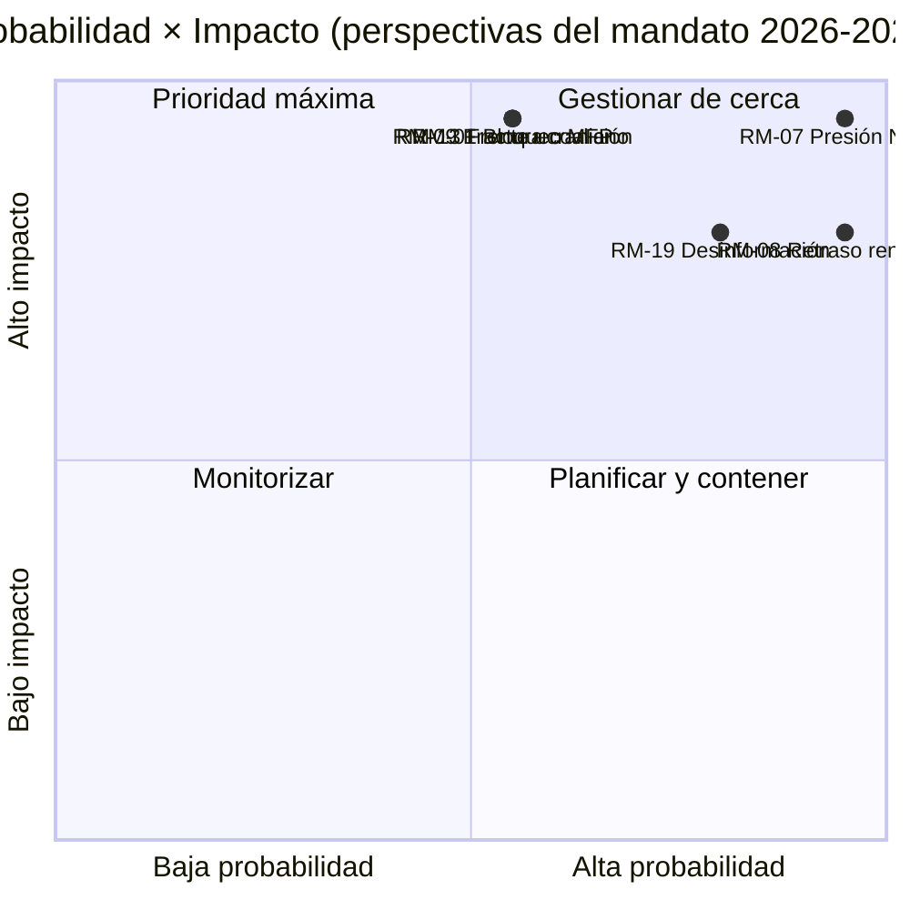

<!-- SPDX-FileCopyrightText: 2026 Hack23 AB -->
<!-- SPDX-License-Identifier: Apache-2.0 -->

# Nota de Síntesis Ejecutiva — Perspectivas del Mandato EP10 hasta 2029 | 2026-05-11

**Clasificación:** OSINT — Registro parlamentario público
**Confianza:** 🟡 Moderada (ventana de entrega de 3 años; los impulsores del precipicio fiscal son A1, los riesgos conductuales son A2/B3)
**Ejecución:** `analysis/daily/2026-05-11/term-outlook/`
**Horizonte:** 2026-05-11 → 2029-06-06 (ventana de entrega del mandato completo de 37 meses)
**Generada:** 2026-05-16 (nota retrospectiva, sin nuevas llamadas MCP)
**Fuentes principales:** EP MCP `generate_political_landscape`, `analyze_coalition_dynamics`, `early_warning_system`, `monitor_legislative_pipeline`, `compare_political_groups`, `get_all_generated_stats`; IMF WEO (envoltura macro EA); Programa de Trabajo de la Comisión 2026.

---

## 🎯 BLUF

**El PE10 entregará un historial legislativo parcial de coalición múltiple antes de las elecciones de 2029** — el marco estratégico del mandato es la **presión fiscal estructural**, no una crisis política aguda. La composición de los grupos (PPE 188 / S&D 136 / Renew 77 / Verdes 53 / PfE 84 / ECR 78 / La Izquierda 46 / ESN 25 / NI 30) sitúa la cuota de los dos primeros en el **44,5 %** — muy por debajo de la mayoría de 376 escaños — por lo que **cada votación insignia requiere al menos tres grupos**, y la "Grand Centre" PPE+S&D+Renew (56,2 %) sigue siendo la coalición modal. La ventana legislativa crítica es **2027-T1 a 2028-T4** — el período en que la revisión del MFP debe cerrarse, el **reembolso de la NGEU se activa (2028)** y el interregno de renovación de la Comisión aún no ha comprimido el rendimiento. Dos riesgos dominan el registro: **RM-07 Presión fiscal de reembolso NGEU (Casi seguro, L5×I5 = 25)** y **RM-08 Interregno de renovación de la Comisión (Casi seguro, L5×I4 = 20)** — ambos son eventos estructurales integrados, no decisiones políticas. Las elecciones de 2029 se **dirimirán sobre el narrativo de la presión fiscal** provocado por la activación del reembolso NGEU; el resultado modal de proyección de escaños ("avance dificultoso", ~50 %) muestra PPE −5 / S&D −5 / PfE +10 deltas, dejando la coalición centrista justo intacta para EP11.

---

## 🧭 3 Decisiones que respalda esta Nota de Síntesis

| # | Decisión | Quién decide | Plazo | Evidencia |
|:-:|----------|-------------|:--------:|----------|
| 1 | **Adelantar las votaciones insignia al período 2027-T3 → 2028-T4** antes de que el rendimiento caiga ~40 % bajo el interregno de renovación de la Comisión en T1–T2 2029 | Conferencia de Presidentes; presidentes de comisión | calendario de sesiones plenarias 2027 | RM-08 (Casi seguro × I4 = 20); hallazgo n.º 7 en `intelligence/synthesis-summary.md` |
| 2 | **Cerrar la revisión del MFP + el marco de reembolso NGEU antes de finales de T4 2027** — los dos riesgos con mayor puntuación (RM-01 punto muerto + RM-07 presión) colisionan si se retrasa | BUDG, ECON, Consejo, Vicepresidentes de la Comisión | plazo firme 2027-T4 | RM-07 (puntuación 25), RM-01 (puntuación 15); `intelligence/economic-context.md` (IMF WEO PIB real ZE 0,9–1,2 % hasta 2030, préstamo neto admón. gral. −2,8 % a −3,4 % → sin margen fiscal) |
| 3 | **Planificación de contingencia de coalición para una minoría de bloqueo de ~33–35 %** si PfE+ECR+ESN (26,4 %) atrae desertores del PPE en archivos de retroceso migratorio/climático | Delegado PPE + delegado S&D + ponentes en la sombra de Renew | continuo, vigilancia de 12 meses | RM-09 (Aproximadamente igual × I5 = 15), RM-11 (Probable × I4 = 12); hallazgo n.º 8 |

Cada decisión está vinculada a una fila de riesgo y a un hallazgo clave en la síntesis propia de la ejecución; la nota no introduce juicios fuera de esa cadena.

---

## 📰 Lectura en 60 segundos

- 🔴 **MULTI_COALITION_REQUIRED es la línea de base:** los dos primeros (PPE + S&D) solo alcanzan el **44,5 %**; cada éxito en sesión plenaria requiere ≥3 grupos (típicamente el Grand Centre al 56,2 %).
- 🟠 **Dos certezas estructurales:** **el reembolso NGEU se activa en 2028** (RM-07, L5×I5=25 — el único riesgo con puntuación 25); el **interregno de renovación de la Comisión** reduce el rendimiento legislativo en ~40 % en T1–T2 2029 (RM-08, L5×I4=20).
- 🟢 **Pipeline saludable hoy:** `monitor_legislative_pipeline` coincide con la línea base EP9 — **ningún cuello de botella agudo aún**, pero la capacidad de los trílogos se comprime en 2027–2028 (RM-12).
- 🟡 **Fragmentación 6,59 (ALTA)** según `early_warning_system`; número efectivo de partidos ≈ 4,7; `DOMINANT_GROUP_RISK` en PPE a MEDIUM.
- 🔵 **Macro no permisiva:** IMF WEO PIB real ZE **0,9–1,2 % hasta 2030**, inflación 1,6–2,2 %, **préstamo neto admón. gral. −2,8 % a −3,4 % del PIB** — sin margen fiscal para nuevos gastos sin medidas de ingresos.
- 🟣 **Techo de convergencia derechista:** PfE + ECR + ESN = **26,4 %** hoy; con desertores del PPE en votaciones de retroceso, esto es una **minoría de bloqueo de ~33–35 %**, no una mayoría ganadora — pero suficiente para derrotar archivos centristas ambiciosos (RM-11).
- 🩷 **Test de fuego 2029:** las elecciones se decidirán por si aterrizan la revisión del MFP + mercado único 2.0 + aplicación de la Ley de IA; el fracaso en cualquiera desplaza la campaña al terreno de presión fiscal de PfE/ECR.
- ⚪ **Escenario modal:** "avance dificultoso" — Aproximadamente igual (~50 %). PPE −5 / S&D −5 / PfE +10 deltas en 2029; la receta de coalición sobrevive, el margen se adelgaza aún más.

---

## 🏛️ Test de entrega de los tres pilares (define si el mandato tiene éxito)

A partir del marco de análisis estratégico de la ejecución: **los tres** elementos siguientes deben cumplirse para que la mayoría centrista defienda su historial de cara a 2029.

1. **Revisión del MFP con envoltorios explícitos de defensa y clima** — el fracaso aquí es el mayor riesgo político individual (confluencia RM-01 × RM-07).
2. **Paquete Mercado único 2.0 con objetivos de productividad medibles** — el colapso del trílogo RM-04 es *Improbable* pero de alto impacto; la ejecución lo identifica como el fracaso accidental más plausible.
3. **Aplicación demostrable de la Ley de IA en todos los Estados miembros** — RM-03 aplicación irregular *Muy probable*; la cuestión es si DG-CNECT + autoridades nacionales pueden producir de tres a cinco victorias de cumplimiento de alto perfil para mediados de 2028.

Si un solo pilar falla, la campaña de 2029 se libra sobre los narrativos de disciplina fiscal de PfE-ECR; si fallan dos, EP11 experimenta una realineación significativa.

---

## ⚠️ Panorama de riesgos (Top 6 de 20)

| ID | Riesgo | P | I | Puntos | Banda WEP | Significado operativo |
|:--:|------|:-:|:-:|:-----:|----------|---------------------|
| **RM-07** | Presión fiscal de reembolso NGEU | 5 | 5 | **25** | Casi seguro | Estructural — ligado al calendario de 2028, no impulsado por la política |
| **RM-08** | Interregno de renovación de la Comisión | 5 | 4 | **20** | Casi seguro | T1–T2 2029 rendimiento ≈ −40 % vs. línea base EP9 |
| **RM-19** | Desinformación sobre las elecciones de 2029 | 4 | 4 | **16** | Muy probable | Test de capacidad de aplicación del DSA |
| **RM-01** | Punto muerto en la revisión del MFP tras 2027-T4 | 3 | 5 | **15** | Aproximadamente igual | Plazo decisión 1; se encadena en RM-07 |
| **RM-09** | Fractura aritmética de coalición (top-2 < 44 %) | 3 | 5 | **15** | Aproximadamente igual | Existencial para la receta de coalición centrista |
| **RM-13** | Escalada del frente Rusia/Ucrania | 3 | 5 | **15** | Aproximadamente igual | Reorganiza el calendario 3–6 meses por cada choque singular |

Los dos **riesgos con puntuación 25/20 (RM-07, RM-08) son certezas ligadas al calendario**, no decisiones políticas — limitan todo lo demás. Los tres **riesgos con puntuación 15 son fracasos políticos** que la coalición centrista todavía puede evitar. La nota lee la confluencia RM-07 + RM-01 como el punto de decisión con mayor apalancamiento del mandato.

---

## 🔮 Principales desencadenantes prospectivos (vigilancia a 12 meses)

De `extended/forward-indicators.md`:

1. **T4 2026 — Votación del mandato de negociación del MFP en BUDG.** Si la coalición centrista no puede acordar un mandato que incluya envoltorios de defensa y clima antes de T1 2027, RM-01 avanza de Aproximadamente igual a Probable y fuerza una negociación del Escenario 6 (Grand Coalition Re-Sealing).
2. **2027-T1 → T3 — Elección de la Mesa + Rotación de la presidencia.** Referencias cruzadas con la ejecución del ciclo electoral (`analysis/daily/2026-05-11/election-cycle/`) sobre la cuestión del precio de apoyo de la Presidencia PPE; el resultado da forma a la arquitectura del plazo de la Decisión 1.
3. **2027-T2 — Informes de aplicación de la Ley de IA.** De tres a cinco acciones de cumplimiento de DG-CNECT + autoridades nacionales para mediados de 2028 son el falsificador del tercer pilar; la ausencia hace avanzar RM-03.
4. **2028-T1 — Activación del reembolso NGEU.** Esto **no es un evento de previsión, es un precipicio fiscal programado** — RM-07 pasa de Casi seguro (futuro) a Activo (presente). El marco presupuestario de la Decisión 2 debe cerrarse antes de este punto.
5. **2029 calendario T1 — Bloque plenario preelectoral.** Última oportunidad para aterrizar votaciones insignia antes de la caída de rendimiento del interregno de renovación; la capacidad de los trílogos (RM-12) se vuelve vinculante.

---

## 🌍 Envoltura macro/geopolítica

- **IMF WEO (`intelligence/economic-context.md`)**: PIB real ZE **0,9–1,2 % hasta 2030**; inflación IPCA 1,6–2,2 %; préstamo neto admón. gral. **−2,8 % a −3,4 % del PIB**. Sin margen fiscal para nuevos gastos sin medidas de ingresos — el marco macro es lo que da a RM-07 una puntuación de 25.
- **Choques geopolíticos sobre la línea base:** frente Rusia-Ucrania (RM-13 puntuación 15), volatilidad en Oriente Medio, fricción Indo-Pacífico, riesgo de ruptura de la relación UE-EE. UU. (RM-14 puntuación 12). Postura de la ejecución: **cada choque singular reorganiza el calendario legislativo 3–6 meses**; la exposición acumulada a lo largo del mandato es alta.
- **Test DSA:** RM-19 campaña de desinformación sobre las elecciones de 2029 (Muy probable × I4 = 16) es el test de estrés operativo de la arquitectura regulatoria que el PE construyó en EP9.

---

## 🛡️ Evaluación de la calidad de las fuentes

- **Anclas A1/A2:** composición de grupos, fragmentación, rendimiento del pipeline, calendario plenario — Portal Open Data PE, columna vertebral estructural de la nota.
- **`monitor_legislative_pipeline`** está *sano* en esta ejecución (coincide con la línea base EP9) — contrasta con la ejecución del ciclo electoral complementaria, donde la misma llamada devolvió 0 procedimientos (A6). Las dos ejecuciones comparten fecha pero se realizaron en momentos diferentes del día; la captura de las perspectivas del mandato es la operativamente más útil.
- **IMF WEO (grado B)** ancla la envoltura macro; esta es la entrada no-PE más importante de la nota y es esencial para la puntuación de RM-07/RM-01.
- **Juicios conductuales (RM-09 fractura de coalición, RM-11 convergencia derechista)** se basan en proxis de cuotas de escaños y patrones de voto 2024–25; los datos de cohesión por eurodiputado aún no están expuestos por la API del PE, por lo que la confianza aquí es Moderada.
- **Confianza neta:** Alta en certezas estructurales (RM-07, RM-08), Moderada en riesgos políticos (RM-01, RM-09, RM-11), Moderada en envoltura macro.

---

## 🧭 ACH — Tres lecturas concurrentes del mandato

`extended/historical-parallels.md` e `intelligence/scenario-forecast.md` rastrean tres lecturas concurrentes de la misma aritmética:

- **H1 — "Avance dificultoso"** (Aproximadamente igual, ~50 %): los tres pilares se cumplen, la coalición aguanta, 2029 produce EP10-menos-5 %. El escenario modal de la ejecución.
- **H2 — "Fracaso parcial / pérdida del narrativo fiscal"** (Probable, ~30 %): un pilar falla, la campaña de 2029 se traslada al terreno PfE-ECR, la coalición centrista emerge más delgada pero aún aritméticamente funcional.
- **H3 — "Ruptura estructural"** (Improbable, ~10 %): crisis de tratados / escalada del Artículo 7 / elecciones anticipadas por bloqueo del Consejo. Cola larga; seguida porque el horizonte de 37 meses lo exige.

El ~10 % restante se distribuye entre escenarios de choque compuesto. La nota defiende H1 como línea base de planificación mientras mantiene H2 como el caso de estrés **operativo** — esa es la brecha que la Decisión 3 pretende cerrar.

---

## 📎 Artefactos de ejecución (Leer-Antes-De-Decidir)

| Capa | Artefacto | Por qué |
|-------|----------|-----|
| Artículo | `article.md` | Narrativo completo de perspectivas del mandato |
| Síntesis | `intelligence/synthesis-summary.md` | Juicio principal + 10 hallazgos clave (autoritativo) |
| Coalición | `intelligence/coalition-dynamics.md` | Aritmética Grand Centre / Venezuela / minoría de bloqueo |
| Registro de riesgos | `risk-scoring/risk-matrix.md` | RM-01 → RM-20 con P × I × Puntos y bandas WEP |
| SWOT cuantitativo | `risk-scoring/quantitative-swot.md` | Pilares vs. restricciones |
| Pipeline | `intelligence/forward-projection.md`, `commission-wp-alignment.md` | Previsión de rendimiento hasta 2029 |
| Macro | `intelligence/economic-context.md` | IMF WEO + envoltura NGEU |
| Arco del mandato | `intelligence/term-arc.md`, `presidency-trio-context.md`, `mandate-fulfilment-scorecard.md` | Secuenciación del interregno de renovación |
| Proyección de escaños | `intelligence/seat-projection.md` | Deltas de 2029 bajo H1/H2 |
| Indicadores | `extended/forward-indicators.md` | Calendario de disparadores de 12 meses |
| Fiabilidad | `intelligence/mcp-reliability-audit.md` | Anclas A1/A2/B3 documentadas |
| Autoauditoría | `intelligence/methodology-reflection.md` | Cierre del Paso 10.5 |

**Complementaria:** `analysis/daily/2026-05-11/election-cycle/executive-brief.md` cubre la superposición electoral de 60 meses; las dos notas están diseñadas para leerse juntas.

---

**Control del documento**
- **Referencia de plantilla:** `analysis/templates/executive-brief.md`
- **Ruta del artefacto:** `analysis/daily/2026-05-11/term-outlook/executive-brief.md`
- **Clasificación:** Público
- **Retrospectivo:** Nota redactada el 2026-05-16 a partir de los artefactos confirmados de la ejecución; **no se realizaron nuevas llamadas MCP**. Todos los juicios reafirman, destilan y comprueban mediante ACH lo que la propia ejecución confirmó; no se introducen nuevas afirmaciones.
