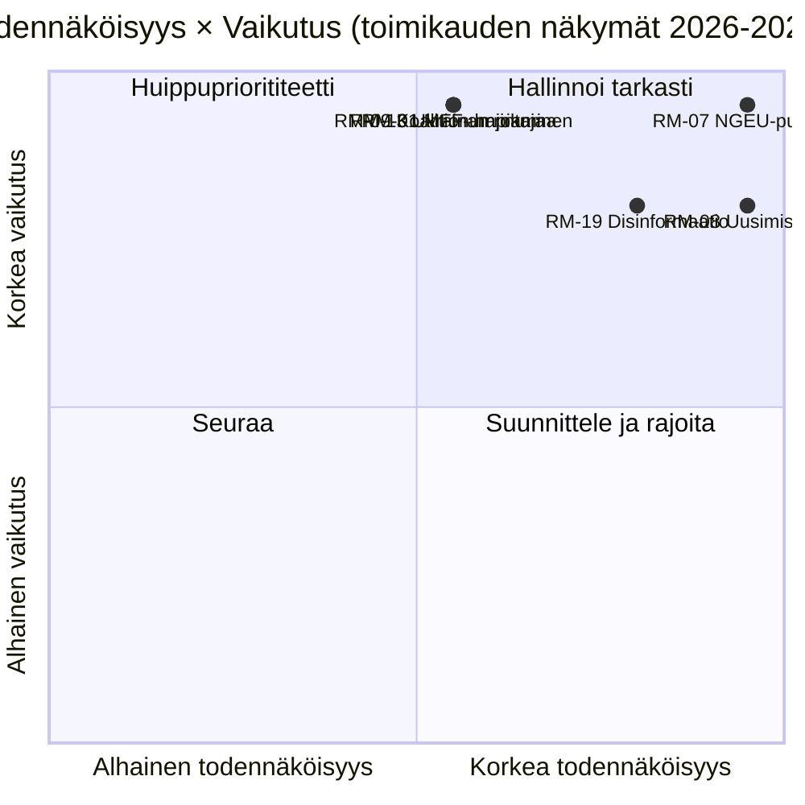

<!-- SPDX-FileCopyrightText: 2026 Hack23 AB -->
<!-- SPDX-License-Identifier: Apache-2.0 -->

# Johdon Tiedustelutiedote — EP10 Toimikauden Näkymät vuoteen 2029 | 2026-05-11

**Luokittelu:** OSINT — Julkinen parlamentaarinen asiakirja
**Luotettavuus:** 🟡 Kohtalainen (3 vuoden toimitusikkuna; finanssipoliittiset jyrkkien muutosten ajurit ovat A1, käyttäytymisriskit ovat A2/B3)
**Ajo:** `analysis/daily/2026-05-11/term-outlook/`
**Horisontti:** 2026-05-11 → 2029-06-06 (37 kuukauden koko toimikauden toimitusikkuna)
**Luotu:** 2026-05-16 (taannehtiva tiedote, ei uusia MCP-kutsuja)
**Ensisijaiset lähteet:** EP MCP `generate_political_landscape`, `analyze_coalition_dynamics`, `early_warning_system`, `monitor_legislative_pipeline`, `compare_political_groups`, `get_all_generated_stats`; IMF WEO (EA-makrokuori); Komission työohjelma 2026.

---

## 🎯 BLUF

**EP10 tuottaa osittaisen, moniliittolaisen lainsäädännöllisen kirjauksen ennen vuoden 2029 vaalia** — toimikauden strateginen kehys on **rakenteellinen finanssipoliittinen paine**, ei akuutti poliittinen kriisi. Ryhmäkokoonpano (EPP 188 / S&D 136 / Renew 77 / Greens 53 / PfE 84 / ECR 78 / The Left 46 / ESN 25 / NI 30) asettaa kahden suurimman osuuden **44,5 prosenttiin** — selvästi alle 376 paikan enemmistön — joten **jokainen lippulaivaäänestys vaatii vähintään kolme ryhmää**, ja EPP+S&D+Renew "Grand Centre" (56,2 %) pysyy modaalikoalitiona. Ratkaiseva lainsäädäntöikkuna on **2027-K1 – 2028-K4** — ajanjakso, jolloin MFF-tarkistus on saatettava päätökseen, **NGEU-takaisinmaksu aktivoituu (2028)** ja komission uusimisinterregnum ei ole vielä rajoittanut läpivirtausta. Kaksi riskiä hallitsee rekisteriä: **RM-07 NGEU-takaisinmaksun finanssipuristus (Lähes varma, L5×I5 = 25)** ja **RM-08 Komission uusimisinterregnum (Lähes varma, L5×I4 = 20)** — molemmat ovat sisäänrakennettuja rakenteellisia tapahtumia, eivät poliittisia valintoja. Vuoden 2029 vaali **käydään NGEU-takaisinmaksun aktivoinnin laukaisemasta finanssipuristus-narratiivista**; modaalinen paikkaerojennuste ("selviytyminen", ~50 %) osoittaa EPP −5 / S&D −5 / PfE +10 deltat, ja centristinen koalitio pysyy juuri ehjänä EP11:n käyttöön.

---

## 🧭 3 Päätöstä, Joita Tämä Tiedote Tukee

| # | Päätös | Kuka päättää | Määräaika | Näyttö |
|:-:|----------|-------------|:--------:|----------|
| 1 | **Priorisoi lippulaivaäänestykset 2027-K3 → 2028-K4** ennen kuin läpivirtaus laskee ~40 % komission uusimisinterregnumin aikana K1–K2 2029 | Puheenjohtajakokous; valiokunnan puheenjohtajat | 2027 täysistuntojen kalenteri | RM-08 (Lähes varma × I4 = 20); löydös nro 7 tiedostossa `intelligence/synthesis-summary.md` |
| 2 | **Lukitse MFF-tarkistus + NGEU-takaisinmaksukehys viimeistään K4 2027** — kaksi korkeimman pisteytetyn riskin (RM-01 umpikuja + RM-07 puristus) törmäävät, jos tämä viivästyy | BUDG, ECON, neuvosto, komission varapuheenjohtajat | kova määräaika 2027-K4 | RM-07 (pisteet 25), RM-01 (pisteet 15); `intelligence/economic-context.md` (IMF WEO EA BKT 0,9–1,2 % vuoteen 2030, gen-gov nettoluotonanto −2,8 % – −3,4 % → ei finanssipoliittista pelivaraa) |
| 3 | **Koalition varautumissuunnittelu ~33–35 %:n estävää vähemmistöä varten** jos PfE+ECR+ESN (26,4 %) houkuttelee EPP:n loikkareita maahanmuutto-/ilmastorollback-tiedostoissa | EPP-whip + S&D-whip + Renew varjoesittelijät | jatkuva, 12 kuukauden seuranta | RM-09 (Suunnilleen tasan × I5 = 15), RM-11 (Todennäköinen × I4 = 12); löydös nro 8 |

Jokainen päätös on sidottu riskirivin ja avainlöydöksen oman ajon synteesiin; tiedote ei esitä arvioita kyseisen ketjun ulkopuolelta.

---

## 📰 60-Sekunnin Luento

- 🔴 **MULTI_COALITION_REQUIRED on perustaso:** kahden suurimman (EPP + S&D) osuus yltää vain **44,5 prosenttiin**; jokainen täysistuntovoitto vaatii ≥3 ryhmää (tyypillisesti Grand Centre 56,2 prosentilla).
- 🟠 **Kaksi rakenteellista varmuutta:** **NGEU-takaisinmaksu aktivoituu 2028** (RM-07, L5×I5=25 — ainoa pisteet-25-riski); **komission uusimisinterregnum** laskee lainsäädäntöläpivirtausta ~40 % K1–K2 2029 (RM-08, L5×I4=20).
- 🟢 **Putkilinja on tänään terve:** `monitor_legislative_pipeline` vastaa EP9-perustasoa — **ei akuuttia pullonkaulaa vielä**, mutta trialogikapasiteetti kiristyy 2027–2028 (RM-12).
- 🟡 **Pirstoutuminen 6,59 (KORKEA)** `early_warning_system`-mukaan; puolueiden efektiivinen lukumäärä ≈ 4,7; `DOMINANT_GROUP_RISK` EPP:lle MEDIUM-tasolla.
- 🔵 **Makro ei salli:** IMF WEO EA reaalinen BKT **0,9–1,2 % vuoteen 2030**, inflaatio 1,6–2,2 %, **gen-gov nettoluotonanto −2,8 % – −3,4 % BKT:sta** — ei finanssipoliittista pelivaraa uusiin menoihin ilman tulotoimenpiteitä.
- 🟣 **Oikeistokuperteeman katto:** PfE + ECR + ESN = **26,4 %** tänään; EPP:n loikkareiden kanssa rollback-äänestyksissä tämä on **estävä vähemmistö ~33–35 %**, ei voittava enemmistö — mutta riittää kunnianhimoisten centrististen tiedostojen torjumiseen (RM-11).
- 🩷 **Lakmuskoetesti 2029:** vaali ratkaistaan sen perusteella, onnistuuko MFF-tarkistus + sisämarkkinat 2.0 + tekoälylain täytäntöönpano; epäonnistuminen millä tahansa osa-alueella siirtää kampanjan PfE/ECR finanssipuristusterreinille.
- ⚪ **Modaaliskenaario:** "selviytyminen" — Suunnilleen tasan (~50 %). EPP −5 / S&D −5 / PfE +10 deltat vuonna 2029; koalitiorakenne säilyy, pelivara kapenee entisestään.

---

## 🏛️ Kolmen Pilarin Toimitustesti (määrittelee, onnistuuko toimikausi)

Ajon strategisesta linsikehyksestä: **kaikkien kolmen** seuraavan on onnistuttava, jotta centristinen enemmistö puolustaisi asemaansa vuoteen 2029.

1. **MFF-tarkistus, johon sisältyvät eksplisiittiset puolustus- ja ilmastokehykset** — epäonnistuminen tässä on yksittäinen suurin poliittinen riski (RM-01 × RM-07 yhteen sulautuminen).
2. **Sisämarkkinat 2.0 -paketti mitattavilla tuottavuustavoitteilla** — RM-04 trialogin romahtaminen on *Epätodennäköinen* mutta vaikutuksiltaan suuri; ajo tunnistaa sen todennäköisimpänä vahingollisena epäonnistumisena.
3. **Osoitettavissa oleva tekoälylain täytäntöönpano kaikissa jäsenvaltioissa** — RM-03 *Erittäin todennäköinen* epätasainen täytäntöönpano; kysymys on, pystyvätkö DG-CNECT + kansalliset viranomaiset tuottamaan kolmesta viiteen profiloitua vaatimustenmukaisuusvoittoa vuoden 2028 puoliväliin mennessä.

Jos yksi pilari epäonnistuu, vuoden 2029 kampanja käydään PfE-ECR finanssikuri-narratiiveilla; jos kaksi epäonnistuu, EP11 näkee merkittävän uudelleensuuntautumisen.

---

## ⚠️ Riskikatsaus (Top 6/20)

| ID | Riski | T | V | Pisteet | WEP-vyöhyke | Operatiivinen merkitys |
|:--:|------|:-:|:-:|:-----:|----------|---------------------|
| **RM-07** | NGEU-takaisinmaksun finanssipuristus | 5 | 5 | **25** | Lähes varma | Rakenteellinen — kalenterisidonnainen vuoteen 2028, ei politiikkavetoinen |
| **RM-08** | Komission uusimisinterregnum | 5 | 4 | **20** | Lähes varma | K1–K2 2029 läpivirtaus ≈ −40 % vs. EP9-perustaso |
| **RM-19** | Disinformaatio vuoden 2029 vaalista | 4 | 4 | **16** | Erittäin todennäköinen | DSA-täytäntöönpanokapasiteettitesti |
| **RM-01** | MFF-tarkistuksen umpikuja 2027-K4 jälkeen | 3 | 5 | **15** | Suunnilleen tasan | Päätös-1-määräaika; kaskadoituu RM-07:ään |
| **RM-09** | Koalitioaritmetiikan hajoaminen (top-2 < 44 %) | 3 | 5 | **15** | Suunnilleen tasan | Eksistentiaalinen centristiselle koalitiorakenteelle |
| **RM-13** | Venäjä/Ukraina-rintaman eskaloituminen | 3 | 5 | **15** | Suunnilleen tasan | Muuttaa kalenteria 3–6 kuukautta yksittäistä šokkia kohden |

Kaksi **pisteet-25/20-riskiä (RM-07, RM-08) ovat kalenterisidonnaisia varmuuksia**, eivät poliittisia valintoja — ne rajoittavat kaikkea muuta. Kolme **pisteet-15-riskiä ovat poliittisia epäonnistumisia**, jotka centristinen koalitio voi vielä torjua. Tiedote lukee RM-07 + RM-01 yhteen sulautumisen toimikauden yksittäiseksi vaikutusvaltaisimmaksi päätöspisteeksi.

---

## 🔮 Tärkeimmät Eteenpäin Katsovat Laukaisijat (12 kuukauden seuranta)

Tiedostosta `extended/forward-indicators.md`:

1. **K4 2026 — MFF-neuvottelumandaatin äänestys BUDG:ssa.** Jos centristinen koalitio ei pysty sopimaan mandaatista, johon sisältyvät puolustus- ja ilmastokehykset, viimeistään K1 2027, RM-01 etenee Suunnilleen tasasta kohti Todennäköistä ja pakottaa Skenaario 6 (Grand Coalition Re-Sealing) -neuvottelun.
2. **2027-K1 → K3 — Puhemiehistövaali + Puheenjohtajakierto.** Ristiviittaa vaalikierrosajon (`analysis/daily/2026-05-11/election-cycle/`) kanssa EPP-puhemiehistön tukihinnan osalta; tulos muovaa Päätös-1-määräajan arkkitehtuuria.
3. **2027-K2 — Tekoälylain täytäntöönpanoraportointi.** Kolmesta viiteen DG-CNECT:n + kansallisten viranomaisten vaatimustenmukaisuustoimenpidettä vuoden 2028 puoliväliin mennessä on kolmannen pilarin falsifikaattori; poissaolo edistää RM-03:a.
4. **2028-K1 — NGEU-takaisinmaksun aktivointi.** Tämä ei ole **ennustettava tapahtuma, se on aikataulutettu finanssipoliittinen jyrkänteen reuna** — RM-07 siirtyy Lähes varmasta (tulevaisuus) Aktiiviseksi (nykyhetki). Päätös-2-budjettikehys on suljettava ennen tätä pistettä.
5. **2029 kalenteri K1 — vaalia edeltävä täysistuntolohko.** Viimeinen mahdollisuus saada lippulaivaäänestykset läpi ennen uusimisinterregnumin läpivirtausromahdusta; trialogikapasiteetti (RM-12) muuttuu sitovaksi.

---

## 🌍 Makro-/Geopoliittinen Kuori

- **IMF WEO (`intelligence/economic-context.md`)**: EA reaalinen BKT **0,9–1,2 % vuoteen 2030**; HICP-inflaatio 1,6–2,2 %; yleinen valtionhallinto nettoluotonanto **−2,8 % – −3,4 % BKT:sta**. Ei finanssipoliittista pelivaraa uusiin menoihin ilman tulotoimenpiteitä — makrokehys on se, mikä antaa RM-07:lle pistemäärän 25.
- **Geopoliittiset shokit yli perustasojen:** Venäjä-Ukraina-rintama (RM-13 pisteet 15), Lähi-idän volatiliteetti, Indo-Tyynenmeren kitka, EU-USA-suhteiden rikkoutumisriski (RM-14 pisteet 12). Ajon kanta: **jokainen yksittäinen shokki muuttaa lainsäädäntökalenteria 3–6 kuukautta**; kumulatiivinen altistus toimikauden aikana on korkea.
- **DSA-testi:** RM-19 disinformaatiokampanja vuoden 2029 vaalista (Erittäin todennäköinen × I4 = 16) on EP:n itse EP9:ssä rakentaman sääntelyarkkitehtuurin operatiivinen stressitesti.

---

## 🛡️ Lähteen Laadunarviointi

- **A1/A2-ankkurit:** ryhmäkokoonpano, pirstoutuminen, putkilinjaläpivirtaus, täysistuntokalenteri — EP Open Data Portal, tiedotteen rakenteellinen selkäranka.
- **`monitor_legislative_pipeline`** on *terve* tässä ajossa (vastaa EP9-perustasoa) — vastakohta täydentävälle vaalikierrosajalle, jossa sama kutsu palautti 0 menettelyä (A6). Kaksi ajoa jakavat päivämäärän, mutta ajoivat eri aikoina päivästä; toimikauden näkymien tallennus on operatiivisesti hyödyllisin.
- **IMF WEO (B-luokka)** ankkuroi makrokuoren; tämä on tiedotteen tärkein ei-EP-syöte ja on keskeinen RM-07/RM-01-pisteytykselle.
- **Käyttäytymisarvioinnit (RM-09 koalitiohajoaminen, RM-11 oikeistokonvergenssi)** perustuvat paikka-osuusproksyihin ja 2024–25 äänestyskaavioihin; MEP-kohtaista koheesiodataa ei vielä paljasta EP API, joten luottamus täällä on Kohtalainen.
- **Nettokonfidens:** Korkea rakenteellisille varmuuksille (RM-07, RM-08), Kohtalainen poliittisille riskeille (RM-01, RM-09, RM-11), Kohtalainen makrokuorelle.

---

## 🧭 ACH — Kolme Kilpailevaa Toimikauden Tulkintaa

`extended/historical-parallels.md` ja `intelligence/scenario-forecast.md` seuraavat kolmea kilpailevaa saman aritmetiikan tulkintaa:

- **H1 — "Selviytyminen"** (Suunnilleen tasan, ~50 %): kaikki kolme pilaria onnistuvat, koalitio pitää, 2029 tuottaa EP10-miinus-5 %. Ajon modaaliskenaario.
- **H2 — "Osittainen epäonnistuminen / finanssinarratiivin menettäminen"** (Todennäköinen, ~30 %): yksi pilari epäonnistuu, 2029-kampanja siirtyy PfE-ECR-terreinille, centristinen koalitio nousee ohuempana, mutta silti aritmeettisesti toimivana.
- **H3 — "Rakenteellinen murtuminen"** (Epätodennäköinen, ~10 %): perussopimuskriisi / Artikla 7:n eskaloituminen / välivaalit neuvoston umpikujasta. Pitkä häntä; seurataan, koska 37 kuukauden horisontti sitä vaatii.

Loput ~10 % jakaantuvat yhdistelmäshokki-skenaarioihin. Tiedote puolustaa H1:tä suunnittelun perustasona pitäen H2:a **operatiivisena** stressitapauksena — se on aukko, jonka Päätös-3 on tarkoitus sulkea.

---

## 📎 Ajoartefaktit (Lue-Ennen-Päätöstä)

| Kerros | Artefakti | Miksi |
|-------|----------|-----|
| Artikkeli | `article.md` | Täysi toimikauden näkymänarratiivi |
| Synteesi | `intelligence/synthesis-summary.md` | Pääarviointi + 10 avainlöydöstä (auktoritatiivinen) |
| Koalitio | `intelligence/coalition-dynamics.md` | Grand-Centre / Venezuela / estävä-vähemmistö-aritmetiikka |
| Riskikirjaus | `risk-scoring/risk-matrix.md` | RM-01 → RM-20 T × V × Pisteet ja WEP-vyöhyke |
| Kvantitatiivinen SWOT | `risk-scoring/quantitative-swot.md` | Pilarit vs. rajoitukset |
| Putkilinja | `intelligence/forward-projection.md`, `commission-wp-alignment.md` | Läpivirtausennuste vuoteen 2029 |
| Makro | `intelligence/economic-context.md` | IMF WEO + NGEU-kuori |
| Toimikaarikaarinen | `intelligence/term-arc.md`, `presidency-trio-context.md`, `mandate-fulfilment-scorecard.md` | Uusimisinterregnumin sekvensointi |
| Paikkamäärittely | `intelligence/seat-projection.md` | 2029 deltat H1/H2-alla |
| Indikaattorit | `extended/forward-indicators.md` | 12 kuukauden matkalaukaisijkalenteri |
| Luotettavuus | `intelligence/mcp-reliability-audit.md` | A1/A2/B3-ankkurit dokumentoitu |
| Itserevisio | `intelligence/methodology-reflection.md` | Vaihe 10.5 -päätös |

**Kumppani:** `analysis/daily/2026-05-11/election-cycle/executive-brief.md` kattaa 60 kuukauden vaalikerrostuman; nämä kaksi tiedotetta on suunniteltu luettavaksi yhdessä.

---

**Asiakirjan hallinta**
- **Malliviite:** `analysis/templates/executive-brief.md`
- **Artefakttipolku:** `analysis/daily/2026-05-11/term-outlook/executive-brief.md`
- **Luokittelu:** Julkinen
- **Taannehtiva:** Tiedote kirjoitettu 2026-05-16 ajon committatuista artefakteista; **uusia MCP-kutsuja ei tehty**. Kaikki arvioinnit toistavat, tiivistävät ja ACH-ristisähköttävät sen, mitä ajo itse committasi; uusia väitteitä ei esitetä.
