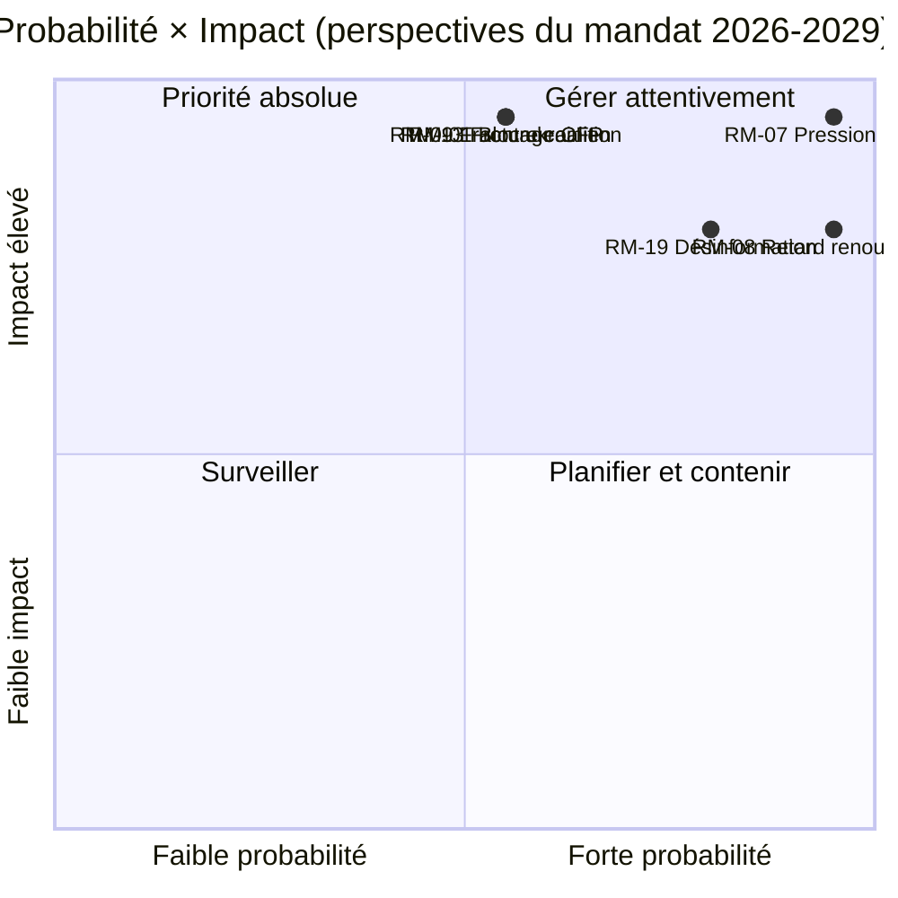

<!-- SPDX-FileCopyrightText: 2026 Hack23 AB -->
<!-- SPDX-License-Identifier: Apache-2.0 -->

# Note de Synthèse — Perspectives du Mandat EP10 jusqu'en 2029 | 2026-05-11

**Classification :** OSINT — Enregistrement parlementaire public
**Confiance :** 🟡 Modérée (fenêtre de livraison de 3 ans ; les moteurs de la falaise budgétaire sont A1, les risques comportementaux sont A2/B3)
**Exécution :** `analysis/daily/2026-05-11/term-outlook/`
**Horizon :** 2026-05-11 → 2029-06-06 (fenêtre de livraison du mandat complet de 37 mois)
**Générée :** 2026-05-16 (note rétrospective, aucun nouvel appel MCP)
**Sources principales :** EP MCP `generate_political_landscape`, `analyze_coalition_dynamics`, `early_warning_system`, `monitor_legislative_pipeline`, `compare_political_groups`, `get_all_generated_stats` ; IMF WEO (enveloppe macro EA) ; Programme de travail de la Commission 2026.

---

## 🎯 BLUF

**L'EP10 produira un bilan législatif partiel à coalition multiple d'ici les élections de 2029** — le cadre stratégique du mandat est la **pression budgétaire structurelle**, non une crise politique aiguë. La composition des groupes (PPE 188 / S&D 136 / Renew 77 / Verts 53 / PfE 84 / CRE 78 / La Gauche 46 / ESN 25 / NI 30) place la part des deux premiers à **44,5 %** — bien en deçà de la majorité de 376 sièges — de sorte que **chaque vote phare exige au moins trois groupes**, et que le « Grand Centre » PPE+S&D+Renew (56,2 %) reste la coalition modale. La fenêtre législative décisive est **2027-T1 à 2028-T4** — la période où la révision du CFP doit se conclure, le **remboursement de la NGEU s'active (2028)** et l'interrègne de renouvellement de la Commission n'a pas encore comprimé le débit. Deux risques dominent le registre : **RM-07 Pression budgétaire de remboursement NGEU (Quasi-certain, L5×I5 = 25)** et **RM-08 Interrègne de renouvellement de la Commission (Quasi-certain, L5×I4 = 20)** — tous deux sont des événements structurels intégrés, non des choix politiques. L'élection de 2029 sera **arbitrée sur le narratif de la contrainte budgétaire** déclenché par l'activation du remboursement NGEU ; le résultat modal de projection de sièges (« bricolage », ~50 %) montre EPP −5 / S&D −5 / PfE +10 deltas, laissant la coalition centriste tout juste intacte pour EP11.

---

## 🧭 3 Décisions que cette Note de Synthèse éclaire

| # | Décision | Qui décide | Échéance | Preuves |
|:-:|----------|-------------|:--------:|----------|
| 1 | **Avancer les votes phares sur 2027-T3 → 2028-T4** avant que le débit ne chute d'environ 40 % sous l'interrègne de renouvellement de la Commission en T1–T2 2029 | Conférence des présidents ; présidents de commission | calendrier des plénières 2027 | RM-08 (Quasi-certain × I4 = 20) ; constat n° 7 dans `intelligence/synthesis-summary.md` |
| 2 | **Verrouiller révision CFP + enveloppe de remboursement NGEU d'ici fin T4 2027** — les deux risques les mieux cotés (RM-01 blocage + RM-07 pression) entrent en collision si cela glisse | BUDG, ECON, Conseil, VPs de la Commission | échéance ferme 2027-T4 | RM-07 (score 25), RM-01 (score 15) ; `intelligence/economic-context.md` (IMF WEO PIB réel ZE 0,9–1,2 % jusqu'en 2030, prêt net de l'administration publique −2,8 % à −3,4 % → aucune marge budgétaire) |
| 3 | **Planification d'urgence des coalitions pour minorité de blocage de ~33–35 %** si PfE+ECR+ESN (26,4 %) attire des défections PPE sur les dossiers de recul migratoire/climatique | Délégué PPE + délégué S&D + rapporteurs fictifs Renew | continu, veille à 12 mois | RM-09 (À peu près égal × I5 = 15), RM-11 (Probable × I4 = 12) ; constat n° 8 |

Chaque décision est liée à une ligne de risque et à un résultat clé de la synthèse propre à l'exécution ; la note ne présente pas de jugements en dehors de cette chaîne.

---

## 📰 Lecture en 60 secondes

- 🔴 **MULTI_COALITION_REQUIRED est la ligne de base :** les deux premiers (PPE + S&D) n'atteignent que **44,5 %** ; chaque succès en plénière exige ≥3 groupes (typiquement le Grand Centre à 56,2 %).
- 🟠 **Deux certitudes structurelles :** **remboursement NGEU s'active en 2028** (RM-07, L5×I5=25 — le seul risque à score 25) ; **interrègne de renouvellement de la Commission** fait chuter le débit législatif d'environ 40 % en T1–T2 2029 (RM-08, L5×I4=20).
- 🟢 **Pipeline sain aujourd'hui :** `monitor_legislative_pipeline` correspond à la ligne de base EP9 — **pas de goulot d'étranglement aigu pour l'instant**, mais la capacité des trilogues se resserre en 2027–2028 (RM-12).
- 🟡 **Fragmentation 6,59 (ÉLEVÉE)** selon `early_warning_system` ; nombre effectif de partis ≈ 4,7 ; `DOMINANT_GROUP_RISK` sur PPE à MEDIUM.
- 🔵 **Macro non permissive :** IMF WEO PIB réel ZE **0,9–1,2 % jusqu'en 2030**, inflation 1,6–2,2 %, **prêt net de l'administration publique −2,8 % à −3,4 % du PIB** — aucune marge budgétaire pour de nouvelles dépenses sans mesures de recettes.
- 🟣 **Plafond de convergence droitière :** PfE + ECR + ESN = **26,4 %** aujourd'hui ; avec les défections PPE lors de votes de recul, il s'agit d'une **minorité de blocage de ~33–35 %**, non d'une majorité victorieuse — mais suffisant pour défaire des dossiers centristes ambitieux (RM-11).
- 🩷 **Test décisif 2029 :** l'élection se jouera sur la livraison ou non de la révision CFP + marché unique 2.0 + application de l'IA Act ; l'échec sur l'un d'eux déplace la campagne sur le terrain PfE/ECR de la contrainte budgétaire.
- ⚪ **Scénario modal :** « bricolage » — À peu près égal (~50 %). EPP −5 / S&D −5 / PfE +10 deltas en 2029 ; la recette de coalition survit, l'amortisseur s'amincit davantage.

---

## 🏛️ Test de livraison à trois piliers (définit si le mandat réussit)

D'après le cadre d'analyse stratégique de l'exécution : **les trois** éléments suivants doivent aboutir pour que la majorité centriste défende son bilan jusqu'en 2029.

1. **Révision du CFP avec des enveloppes explicites de défense et de climat** — l'échec ici est le risque politique le plus important (confluence RM-01 × RM-07).
2. **Paquet Marché unique 2.0 avec des objectifs de productivité mesurables** — l'effondrement du trilogue RM-04 est *Improbable* mais à impact élevé ; l'exécution l'identifie comme l'échec accidentel le plus plausible.
3. **Application démontrable de l'IA Act dans tous les États membres** — RM-03 *Très probable* application inégale ; la question est de savoir si DG-CNECT + autorités nationales peuvent produire de trois à cinq victoires de conformité à haute visibilité d'ici mi-2028.

Si un seul pilier échoue, la campagne de 2029 est menée sur les narratifs de discipline budgétaire PfE-ECR ; si deux échouent, EP11 connaît un réalignement substantiel.

---

## ⚠️ Panorama des risques (Top 6 sur 20)

| ID | Risque | P | I | Score | Bande WEP | Signification opérationnelle |
|:--:|------|:-:|:-:|:-----:|----------|---------------------|
| **RM-07** | Pression budgétaire de remboursement NGEU | 5 | 5 | **25** | Quasi-certain | Structurel — lié au calendrier 2028, non piloté par la politique |
| **RM-08** | Interrègne de renouvellement de la Commission | 5 | 4 | **20** | Quasi-certain | T1–T2 2029 débit ≈ −40 % vs. ligne de base EP9 |
| **RM-19** | Désinformation sur les élections 2029 | 4 | 4 | **16** | Très probable | Test de capacité d'application du RSN |
| **RM-01** | Blocage révision CFP au-delà de 2027-T4 | 3 | 5 | **15** | À peu près égal | Échéance décision 1 ; cascade dans RM-07 |
| **RM-09** | Fracture arithmétique de coalition (top-2 < 44 %) | 3 | 5 | **15** | À peu près égal | Existentielle pour la recette de coalition centriste |
| **RM-13** | Escalade du front Russie/Ukraine | 3 | 5 | **15** | À peu près égal | Réorganise le calendrier de 3 à 6 mois par choc unique |

Les deux **risques à score 25/20 (RM-07, RM-08) sont des certitudes liées au calendrier**, non des choix politiques — ils contraignent tout le reste. Les trois **risques à score 15 sont des échecs politiques** que la coalition centriste peut encore éviter. La note lit la confluence RM-07 + RM-01 comme le point de décision à plus fort levier du mandat.

---

## 🔮 Principaux déclencheurs prospectifs (veille à 12 mois)

D'après `extended/forward-indicators.md` :

1. **T4 2026 — Vote du mandat de négociation CFP au BUDG.** Si la coalition centriste ne peut pas s'accorder sur un mandat incluant les enveloppes défense et climat d'ici T1 2027, RM-01 passe de À peu près égal à Probable et force une négociation Scénario 6 (Grand Coalition Re-Sealing).
2. **2027-T1 → T3 — Élection du Bureau + Rotation de la présidence.** Référence croisée avec l'exécution du cycle électoral (`analysis/daily/2026-05-11/election-cycle/`) sur la question du prix de soutien de la Présidence PPE ; le résultat forme l'architecture de l'échéance Décision 1.
3. **2027-T2 — Rapport d'application de l'IA Act.** Trois à cinq actions de conformité DG-CNECT + autorités nationales d'ici mi-2028 sont le falsificateur du troisième pilier ; l'absence fait avancer RM-03.
4. **2028-T1 — Activation du remboursement NGEU.** Ceci n'est **pas un événement prévisionnel, c'est une falaise budgétaire planifiée** — RM-07 passe de Quasi-certain (futur) à Actif (présent). L'enveloppe budgétaire Décision 2 doit être clôturée avant ce point.
5. **2029 calendrier T1 — Bloc plénaire pré-électoral.** Dernière occasion de faire aboutir les votes phares avant la chute de débit de l'interrègne de renouvellement ; la capacité des trilogues (RM-12) devient contraignante.

---

## 🌍 Enveloppe macro/géopolitique

- **IMF WEO (`intelligence/economic-context.md`)** : PIB réel ZE **0,9–1,2 % jusqu'en 2030** ; inflation IPCH 1,6–2,2 % ; prêt net de l'administration publique **−2,8 % à −3,4 % du PIB**. Aucune marge budgétaire pour de nouvelles dépenses sans mesures de recettes — c'est le cadre macro qui donne à RM-07 un score de 25.
- **Chocs géopolitiques au-dessus de la ligne de base :** front Russie-Ukraine (RM-13 score 15), volatilité au Moyen-Orient, frictions Indo-Pacifique, risque de rupture de la relation UE-États-Unis (RM-14 score 12). Position de l'exécution : **chaque choc unique réorganise le calendrier législatif de 3 à 6 mois** ; l'exposition cumulée sur le mandat est élevée.
- **Test RSN :** RM-19 campagne de désinformation sur les élections 2029 (Très probable × I4 = 16) est le test de résistance opérationnel de l'architecture réglementaire que l'EP lui-même a construite lors de l'EP9.

---

## 🛡️ Évaluation de la qualité des sources

- **Ancres A1/A2 :** composition des groupes, fragmentation, débit pipeline, calendrier des plénières — Portail Open Data PE, épine dorsale structurelle de la note.
- **`monitor_legislative_pipeline`** est *sain* dans cette exécution (correspond à la ligne de base EP9) — contraste avec l'exécution de cycle électoral compagnon où le même appel a renvoyé 0 procédure (A6). Les deux exécutions partagent la même date mais ont été réalisées à des moments différents de la journée ; la capture des perspectives du mandat est la plus utile sur le plan opérationnel.
- **IMF WEO (note B)** ancre l'enveloppe macro ; c'est l'input non-PE le plus important de la note et essentiel pour la cotation de RM-07/RM-01.
- **Jugements comportementaux (RM-09 fracture de coalition, RM-11 convergence droitière)** reposent sur des proxys de parts de sièges et des modèles de vote 2024–25 ; les données de cohésion par député ne sont pas encore exposées par l'API PE, donc la confiance ici est Modérée.
- **Confiance nette :** Élevée pour les certitudes structurelles (RM-07, RM-08), Modérée pour les risques politiques (RM-01, RM-09, RM-11), Modérée pour l'enveloppe macro.

---

## 🧭 ACH — Trois lectures concurrentes du mandat

`extended/historical-parallels.md` et `intelligence/scenario-forecast.md` suivent trois lectures concurrentes de la même arithmétique :

- **H1 — « Bricolage »** (À peu près égal, ~50 %) : les trois piliers aboutissent, la coalition tient, 2029 produit EP10-moins-5 %. Le scénario modal de l'exécution.
- **H2 — « Échec partiel / perte du narratif budgétaire »** (Probable, ~30 %) : un pilier échoue, la campagne 2029 bascule sur le terrain PfE-ECR, la coalition centriste émerge plus mince mais encore arithmétiquement fonctionnelle.
- **H3 — « Rupture structurelle »** (Improbable, ~10 %) : crise des traités / escalade Article 7 / élections anticipées à la suite d'une impasse au Conseil. Longue traîne ; suivie parce que l'horizon de 37 mois l'exige.

Les ~10 % restants se répartissent sur des scénarios de choc composés. La note défend H1 comme ligne de base de planification tout en maintenant H2 comme cas de stress **opérationnel** — c'est l'écart que la Décision 3 est censée combler.

---

## 📎 Artefacts d'exécution (Lire-Avant-De-Décider)

| Couche | Artefact | Pourquoi |
|-------|----------|-----|
| Article | `article.md` | Récit complet des perspectives du mandat |
| Synthèse | `intelligence/synthesis-summary.md` | Jugement principal + 10 constats clés (faisant autorité) |
| Coalition | `intelligence/coalition-dynamics.md` | Arithmétique Grand Centre / Venezuela / minorité de blocage |
| Registre des risques | `risk-scoring/risk-matrix.md` | RM-01 → RM-20 avec P × I × Score et bandes WEP |
| SWOT quantitative | `risk-scoring/quantitative-swot.md` | Piliers vs. contraintes |
| Pipeline | `intelligence/forward-projection.md`, `commission-wp-alignment.md` | Prévision de débit jusqu'en 2029 |
| Macro | `intelligence/economic-context.md` | IMF WEO + enveloppe NGEU |
| Arc du mandat | `intelligence/term-arc.md`, `presidency-trio-context.md`, `mandate-fulfilment-scorecard.md` | Séquençage de l'interrègne de renouvellement |
| Projection des sièges | `intelligence/seat-projection.md` | Deltas 2029 selon H1/H2 |
| Indicateurs | `extended/forward-indicators.md` | Calendrier de déclencheurs à 12 mois |
| Fiabilité | `intelligence/mcp-reliability-audit.md` | Ancres A1/A2/B3 documentées |
| Auto-audit | `intelligence/methodology-reflection.md` | Clôture Étape 10.5 |

**Compagnon :** `analysis/daily/2026-05-11/election-cycle/executive-brief.md` couvre la superposition électorale à 60 mois ; les deux notes sont conçues pour être lues ensemble.

---

**Contrôle du document**
- **Référence du modèle :** `analysis/templates/executive-brief.md`
- **Chemin de l'artefact :** `analysis/daily/2026-05-11/term-outlook/executive-brief.md`
- **Classification :** Public
- **Rétrospectif :** Note rédigée le 2026-05-16 à partir des artefacts engagés par l'exécution ; **aucun nouvel appel MCP n'a été effectué**. Tous les jugements re-formulent, distillent et croisent-ACH ce que l'exécution elle-même a engagé ; aucune nouvelle affirmation n'est introduite.
