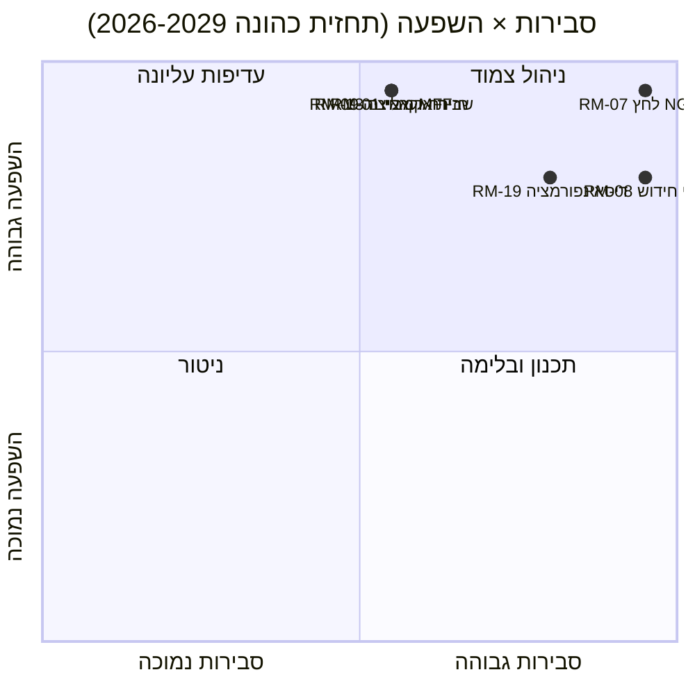

<!-- SPDX-FileCopyrightText: 2026 Hack23 AB -->
<!-- SPDX-License-Identifier: Apache-2.0 -->

# סיכום מודיעין מנהלי — תחזית כהונת EP10 עד 2029 | 2026-05-11

**סיווג:** מקורות פתוחים — רשומות פרלמנטריות ציבוריות
**אמינות:** 🟡 בינונית (חלון מסירה של 3 שנים; גורמי מצוק תקציבי A1, סיכוני התנהגות A2/B3)
**ביצוע:** `analysis/daily/2026-05-11/term-outlook/`
**אופק:** 2026-05-11 → 2029-06-06 (חלון מסירה של 37 חודשי כהונה מלאה)
**תאריך:** 2026-05-16 (סיכום רטרואקטיבי, ללא קריאות MCP חדשות)
**מקורות ראשיים:** EP MCP `generate_political_landscape`, `analyze_coalition_dynamics`, `early_warning_system`, `monitor_legislative_pipeline`, `compare_political_groups`, `get_all_generated_stats`; IMF WEO (מעטפת מאקרו של אזור האירו); תוכנית העבודה של הנציבות 2026.

---

## 🎯 תמצית

**EP10 יספק אג'נדה חקיקתית חלקית, רב-קואליציונית לפני בחירות 2029** — המסגרת האסטרטגית של הכהונה היא **לחץ תקציבי מבני**, לא משבר פוליטי חריף. הרכב הסיעות (EVP 188 / S&D 136 / Renew 77 / Greens 53 / PfE 84 / ECR 78 / The Left 46 / ESN 25 / NI 30) מציב את נתח שתי הסיעות הגדולות על **44.5%** — הרבה מתחת לרוב של 376 מושבים — כך שכל **הצבעת עדיפות דורשת לפחות שלוש סיעות**, ו-EVP+S&D+Renew "grand centre" (56.2%) נותרת הקואליציה המודאלית. חלון החקיקה המכריע הוא **K1 2027 עד K4 2028** — התקופה שבה יש לסיים את סקירת MFF, **תשלומי ההחזר של NGEU מופעלים (2028)**, ואינטרמצו חידוש הנציבות לא לחץ עדיין על התפוקה. שני סיכונים שולטים ברישום: **RM-07 לחץ תקציב החזר NGEU (כמעט ודאי, L5×I5=25)** ו-**RM-08 אינטרמצו חידוש הנציבות (כמעט ודאי, L5×I4=20)** — שניהם אירועים מבניים מוטמעים, לא בחירות מדיניות. בחירות 2029 **תיאבקנה על הנרטיב של לחץ התקציב** שנוצר מהפעלת החזר NGEU; התחזית המודאלית למושבים ("התמדה", ~50%) מציגה דלתות EVP-5 / S&D-5 / PfE+10 ב-2029, כשהקואליציה המרכזית שורדת עם שוליים דקים יותר עבור EP11.

---

## 🧭 3 החלטות שמסמך זה תומך בהן

| # | החלטה | מקבל ההחלטה | מועד אחרון | ראיות |
|:-:|----------|-------------|:--------:|----------|
| 1 | **להקדים הצבעות עדיפות ל-K3 2027 → K4 2028** לפני שהתפוקה תרד ~40% ב-K1-K2 2029 במהלך אינטרמצו חידוש הנציבות | ועידת יושבי-ראש; יו"ר ועדות | לוח מושב מליאה 2027 | RM-08 (כמעט ודאי × I4=20); ממצא #7 ב-`intelligence/synthesis-summary.md` |
| 2 | **לנעול סקירת MFF + מסגרת החזר NGEU לפני סוף K4 2027** — שני הסיכונים הגבוהים ביותר (RM-01 מבוי סתום + RM-07 לחץ) מתנגשים אם זה יתעכב | BUDG, ECON, המועצה, סגני נשיא הנציבות | מועד אחרון קשיח K4 2027 | RM-07 (ציון 25), RM-01 (ציון 15); `intelligence/economic-context.md` (IMF WEO תמ"ג ריאלי אזור האירו 0.9-1.2% עד 2030, הלוואה נטו לממשלה -2.8% עד -3.4% → אין מרחב תקציבי להוצאות חדשות) |
| 3 | **תכנון קואליציה לשעת חירום עבור מיעוט חוסם ~33-35%** אם PfE+ECR+ESN (26.4%) ימשכו עוברי-צד מ-EVP בקובצי נסיגה מהגירה/אקלים | משמעת פנימית EVP + צל-מדווחים S&D + Renew | שוטף, ניטור 12 חודשים | RM-09 (שקול × I5=15), RM-11 (סביר × I4=12); ממצא #8 |

כל החלטה מקושרת לשורת סיכון וממצא מרכזי בביצוע המסמך עצמו; הסיכום אינו מכניס שיפוטים מחוץ לאותה שרשרת.

---

## 📰 קריאת 60 שניות

- 🔴 **MULTI_COALITION_REQUIRED הוא הבסיס:** שתי הסיעות הגדולות (EVP+S&D) מגיעות רק ל-**44.5%**; כל הצלחה במליאה דורשת ≥3 סיעות (בדרך כלל grand centre ב-56.2%).
- 🟠 **שני ודאויות מבניות:** **הפעלת החזר NGEU 2028** (RM-07, L5×I5=25 — הסיכון היחיד עם ציון 25); **אינטרמצו חידוש הנציבות** מוריד תפוקת חקיקה ~40% ב-K1-K2 2029 (RM-08, L5×I4=20).
- 🟢 **הצינור בריא כיום:** `monitor_legislative_pipeline` מתאים לבסיס EP9 — **אין צוואר בקבוק חריף עדיין**, אך עומס הטרילוג מתהדק ב-2027-2028 (RM-12).
- 🟡 **פיצול 6.59 (גבוה)** לפי `early_warning_system`; מספר מפלגות אפקטיבי ≈4.7; `DOMINANT_GROUP_RISK` ל-EVP ב-MEDIUM.
- 🔵 **המאקרו אינו מאפשר:** IMF WEO תמ"ג ריאלי אזור האירו **0.9-1.2% עד 2030**, אינפלציה 1.6-2.2%, **הלוואה נטו לממשלה -2.8% עד -3.4% מהתמ"ג** — אין מרחב תקציבי להוצאות חדשות ללא אמצעי הכנסה.
- 🟣 **תקרת כינוס ימני:** PfE+ECR+ESN=**26.4%** כיום; עם עוברי-צד מ-EVP בהצבעות נסיגה זהו **מיעוט חוסם ~33-35%**, לא רוב מנצח — אך מספיק להביס קובצי מרכז שאפתניים (RM-11).
- 🩷 **מבחן הלקמוס 2029:** הבחירות נחתכות לפי אספקת סקירת MFF + שוק פנימי 2.0 + אכיפת חוק הבינה המלאכותית; כישלון בכל אחד מהם יחליף את הקמפיין לטריטוריית נרטיב התקציב של PfE/ECR.
- ⚪ **תרחיש מודאלי:** "התמדה" — שקול (~50%). דלתות EVP-5 / S&D-5 / PfE+10 ב-2029; מתכון הקואליציה שורד, מאגר נדלל.

---

## 🏛️ מבחן מסירה תלת-עמודי (קובע אם הכהונה מצליחה)

ממסגרת עדשת האסטרטגיה של הביצוע: **שלושת הבאים חייבים להתממש** כדי שהרוב המרכזי יגן על אג'נדתו עד 2029.

1. **סקירת MFF עם מעטפות ביטחון ואקלים מפורשות** — כישלון כאן הוא הסיכון הפוליטי היחיד הגדול ביותר (צומת RM-01 × RM-07).
2. **חבילת שוק פנימי 2.0 עם יעדי פריון מדידים** — קריסת טרילוג RM-04 *לא סביר* אך בעל השפעה גבוהה; הביצוע מזהה אותו כהכשלה המקרית הסבירה ביותר.
3. **אכיפת חוק בינה מלאכותית ניסיונית מוכחת בכל המדינות החברות** — יישום לא-אחיד RM-03 *סביר מאוד*; השאלה היא אם DG-CNECT + רשויות לאומיות יוכלו לייצר שלוש עד חמש ניצחונות ציות בולטות עד אמצע 2028.

אם עמוד אחד נכשל, קמפיין 2029 יתנהל על נרטיב המשמעת התקציבית של PfE-ECR; אם שניים נכשלים, EP11 יראה ארגון מחדש מהותי.

---

## ⚠️ תמונת מצב סיכונים (6 מובילים מתוך 20)

| מזהה | סיכון | S | H | ציון | טווח WEP | משמעות מבצעית |
|:--:|------|:-:|:-:|:-----:|----------|---------------------|
| **RM-07** | לחץ תקציב החזר NGEU | 5 | 5 | **25** | כמעט ודאי | מבני — מחויב ליומן 2028, לא מדיניות |
| **RM-08** | אינטרמצו חידוש הנציבות | 5 | 4 | **20** | כמעט ודאי | K1-K2 2029 תפוקה ≈-40% לעומת בסיס EP9 |
| **RM-19** | דיסאינפורמציה בחירות 2029 | 4 | 4 | **16** | סביר מאוד | בחינת יכולת אכיפת DSA |
| **RM-01** | מבוי סתום בסקירת MFF לאחר K4 2027 | 3 | 5 | **15** | שקול | מועד אחרון להחלטה 1; מדרון גלישה ל-RM-07 |
| **RM-09** | שבירת חשבון קואליציה (שני גדולים < 44%) | 3 | 5 | **15** | שקול | קיומי למתכון הקואליציה המרכזי |
| **RM-13** | הסלמת חזית רוסיה/אוקראינה | 3 | 5 | **15** | שקול | מסדר מחדש את האג'נדה 3-6 חודשים לכל הלם בודד |

**הסיכונים בציון 25/20 (RM-07, RM-08) הם ודאויות הקשורות ליומן**, לא בחירות מדיניות — הם מגבילים הכל. שלושת **הסיכונים בציון 15 הם כישלונות פוליטיים** שהקואליציה המרכזית עדיין יכולה למנוע. הסיכום קורא לצומת RM-07+RM-01 כנקודת המינוף הגבוהה ביותר בכהונה.

---

## 🔮 טריגרים מרכזיים קדימה (ניטור 12 חודשים)

מ-`extended/forward-indicators.md`:

1. **K4 2026 — הצבעת תפקיד MFF של BUDG.** אם הקואליציה המרכזית לא תסכים על תפקיד הכולל מעטפות ביטחון ואקלים לפני K1 2027, RM-01 מתקדמת משקול לסביר ומאלצת משא ומתן תרחיש 6 (אטימת קואליציה גדולה מחדש).
2. **K1 2027 → K3 2027 — בחירת משרד + רוטציית נשיאות.** הפניה צולבת לביצוע מחזור הבחירות (`analysis/daily/2026-05-11/election-cycle/`) בשאלת מחיר תמיכת נשיאות EVP; התוצאה מעצבת את ארכיטקטורת המועד האחרון של החלטה 1.
3. **K2 2027 — דיווחי אכיפת חוק בינה מלאכותית.** שלושה עד חמישה צעדי ציות DG-CNECT + רשויות לאומיות לפני אמצע 2028 הם המפריך של העמוד השלישי; היעדרם מעלה את RM-03.
4. **K1 2028 — הפעלת החזר NGEU.** זהו **לא אירוע חיזוי, הוא מצוק תקציב מתוכנן** — RM-07 עובר מכמעט ודאי (עתיד) לפעיל (הווה). יש לסגור את מסגרת התקציב של החלטה 2 לפני נקודה זו.
5. **K1 2029 — גוש מליאה טרום-בחירות.** הזדמנות אחרונה לנחות הצבעות עדיפות לפני ירידת תפוקת אינטרמצו החידוש; עומס הטרילוג (RM-12) הופך להגבלה.

---

## 🌍 מעטפת מאקרו-גיאופוליטית

- **IMF WEO (`intelligence/economic-context.md`):** תמ"ג ריאלי אזור האירו **0.9-1.2% עד 2030**; אינפלציית HICP 1.6-2.2%; הלוואה נטו לממשלה **-2.8% עד -3.4% מהתמ"ג**. אין מרחב תקציבי להוצאות חדשות ללא אמצעי הכנסה — המסגרת המאקרו-כלכלית היא מה שנותנת ל-RM-07 ציון 25.
- **זעזועים גיאופוליטיים מעל הבסיס:** חזית רוסיה-אוקראינה (RM-13 ציון 15), תנודתיות המזרח התיכון, חיכוך אינדו-פסיפי, סיכון לשבר ביחסי אירופה-ארה"ב (RM-14 ציון 12). עמדת הביצוע: **כל הלם בודד מסדר מחדש את האג'נדה החקיקתית 3-6 חודשים**; החשיפה המצטברת לאורך הכהונה גבוהה.
- **מבחן DSA:** קמפיין דיסאינפורמציה טרום בחירות 2029 RM-19 (סביר מאוד × I4=16) הוא מבחן הלחץ המבצעי של ארכיטקטורת הרגולציה שה-EP עצמו בנה ב-EP9.

---

## 🛡️ הערכת איכות מקורות

- **עוגנים A1/A2:** הרכב סיעות, פיצול, תפוקת צינור, אג'נדת מליאה — שער הנתונים הפתוחים של EP, הבסיס המבני של הסיכום.
- **`monitor_legislative_pipeline`** בביצוע זה *בריא* (מתאים לבסיס EP9) — מנוגד לביצוע מחזור הבחירות המלווה שבו אותן הקריאות החזירו 0 נהלים (A6). שני הביצועים חולקים את אותו תאריך אך הופעלו בשעות שונות של היום; תמונת המצב של תחזיות הכהונה היא המבצעית הביותר.
- **IMF WEO (דרגה B)** עוגן המעטפת המאקרו; זה הקלט הלא-EP החשוב ביותר בסיכום ובר מהותי לדירוג RM-07/RM-01.
- **שיפוטים התנהגותיים (RM-09 שבירת קואליציה, RM-11 כינוס ימני)** מסתמכים על פרוקסי נתח מושבים ודפוסי הצבעה 2024-25; נתוני לכידות לכל חבר טרם נחשפו על ידי ה-EP API, לכן האמינות כאן היא בינונית.
- **אמינות נטו:** גבוהה עבור מיקומים מבניים (RM-07, RM-08), בינונית עבור סיכונים פוליטיים (RM-01, RM-09, RM-11), בינונית עבור המעטפת המאקרו.

---

## 🧭 ACH — שלוש קריאות מתחרות לכהונה

`extended/historical-parallels.md` ו-`intelligence/scenario-forecast.md` עוקבים אחר שלוש קריאות מתחרות לאותה חשבונאות:

- **H1 — "התמדה"** (שקול, ~50%): שלושת העמודות מתממשות, הקואליציה מחזיקה, 2029 מייצרת EP10-מינוס-5%. התרחיש המודאלי של הביצוע.
- **H2 — "כישלון חלקי / אובדן נרטיב תקציבי"** (סביר, ~30%): עמוד אחד נכשל, קמפיין 2029 עובר לטריטוריה של PfE-ECR, הקואליציה המרכזית נותרת חלשה יותר אך עדיין פונקציונלית חשבונית.
- **H3 — "שבירה מבנית"** (לא סביר, ~10%): משבר אמנה / הסלמת סעיף 7 / בחירות מוקדמות עקב מבוי סתום במועצה. זנב ארוך; נעקב כי אופק 37 חודשים דורש זאת.

ה-~10% הנותרים מתחלקים בין תרחישי הלמות מורכבים. הסיכום מגן על H1 כבסיס תכנוני בשמירה על H2 כ**מקרה הלחץ המבצעי** — זו הפער שהחלטה 3 חייבת לסגור.

---

## 📎 תוצרי ביצוע (קרא לפני החלטה)

| שכבה | תוצר | מדוע |
|-------|----------|-----|
| מאמר | `article.md` | נרטיב מלא של תחזיות הכהונה |
| סינתזה | `intelligence/synthesis-summary.md` | שיפוט ראשי + 10 ממצאים מרכזיים (סמכותי) |
| קואליציה | `intelligence/coalition-dynamics.md` | חשבוניות grand centre / ונצואלה / מיעוט חוסם |
| רישום סיכונים | `risk-scoring/risk-matrix.md` | RM-01 → RM-20 עם S × H × ציון וטווחי WEP |
| SWOT כמותי | `risk-scoring/quantitative-swot.md` | עמודות מול מגבלות |
| צינור | `intelligence/forward-projection.md`, `commission-wp-alignment.md` | תחזית תפוקה עד 2029 |
| מאקרו | `intelligence/economic-context.md` | IMF WEO + מעטפת NGEU |
| קשת כהונה | `intelligence/term-arc.md`, `presidency-trio-context.md`, `mandate-fulfilment-scorecard.md` | רצף אינטרמצו חידוש הנציבות |
| תחזית מושבים | `intelligence/seat-projection.md` | דלתות 2029 תחת H1/H2 |
| אינדיקטורים | `extended/forward-indicators.md` | אג'נדת נסיעת 12 חודשים |
| אמינות | `intelligence/mcp-reliability-audit.md` | עוגנים A1/A2/B3 מתועדים |
| רפלקציה עצמית | `intelligence/methodology-reflection.md` | סגירת שלב 10.5 |

**מלווה:** `analysis/daily/2026-05-11/election-cycle/executive-brief.md` מכסה את שכבת-העל הבחירותית של 60 חודשים; שני הסיכומים מתוכננים להיקרא יחד.

---

**בקרת מסמך**
- **הפניית תבנית:** `analysis/templates/executive-brief.md`
- **נתיב תוצר:** `analysis/daily/2026-05-11/term-outlook/executive-brief.md`
- **סיווג:** ציבורי
- **רטרואקטיבי:** הסיכום נכתב ב-2026-05-16 בהתבסס על תוצרי הביצוע שנשמרו; **לא בוצעו קריאות MCP חדשות**. כל השיפוטים חוזרים, מזקקים ובוחנים בצולב ב-ACH את מה שהביצוע עצמו שמר; לא מוכנסות טענות חדשות.
