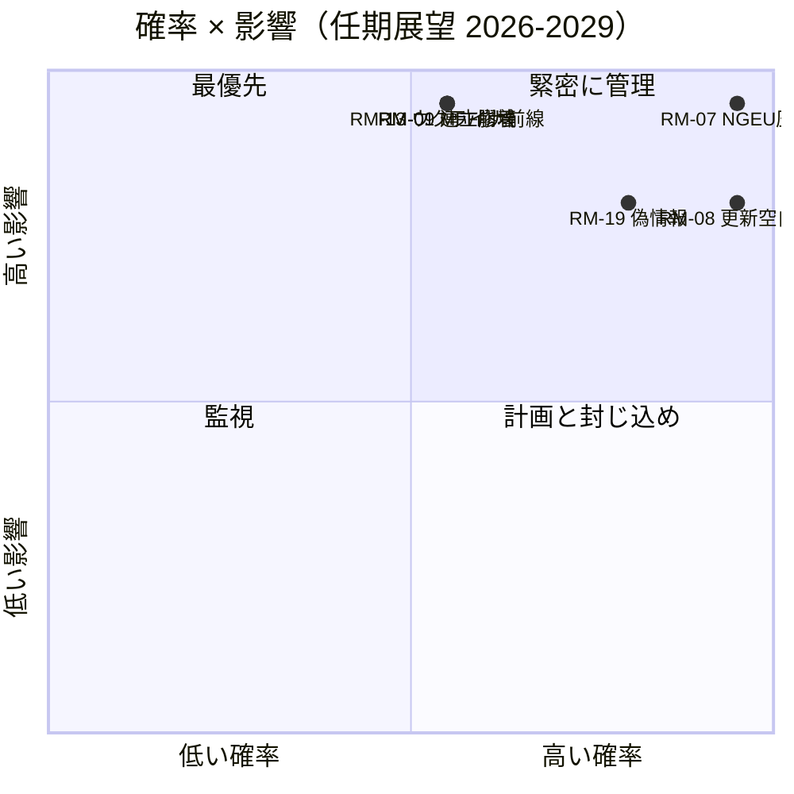

<!-- SPDX-FileCopyrightText: 2026 Hack23 AB -->
<!-- SPDX-License-Identifier: Apache-2.0 -->

# エグゼクティブ・インテリジェンス・ブリーフィング — EP10 第10期展望（2029年まで）| 2026-05-11

**分類:** オープンソース — 公開議会記録
**信頼度:** 🟡 中程度（3年間の納期ウィンドウ；予算断崖推進要因はA1、行動リスクはA2/B3）
**実行:** `analysis/daily/2026-05-11/term-outlook/`
**水平線:** 2026-05-11 → 2029-06-06（37ヶ月間の完全任期納期ウィンドウ）
**作成日:** 2026-05-16（遡及的要約、新規MCPコールなし）
**主要情報源:** EP MCP `generate_political_landscape`、`analyze_coalition_dynamics`、`early_warning_system`、`monitor_legislative_pipeline`、`compare_political_groups`、`get_all_generated_stats`；IMF WEO（ユーロ圏マクロ外枠）；欧州委員会2026年作業計画。

---

## 🎯 要点（BLUF）

**EP10は2029年選挙前に部分的な多数連立立法議題を成立させる見込みです** — 任期の戦略的枠組みは**構造的財政圧力**であり、急性の政治危機ではありません。会派構成（EPP 188 / S&D 136 / Renew 77 / Greens 53 / PfE 84 / ECR 78 / The Left 46 / ESN 25 / NI 30）は、上位2会派の議席シェアを**44.5%**に設定しており、これは376議席の過半数を大幅に下回ります。そのため**すべての優先票決には少なくとも3会派が必要**であり、EVP+S&D+Renew「grand centre」（56.2%）が標準連立として維持されています。決定的な立法ウィンドウは**2027年第1四半期〜2028年第4四半期**です — この期間内にMFF見直しを完了し、**NGEUの返済（2028年）**が開始され、委員会刷新の移行期間はまだ生産量を圧迫していません。2つのリスクが登録を支配しています：**RM-07 NGEU返済予算圧力（ほぼ確実、L5×I5=25）**と**RM-08 委員会刷新移行期間（ほぼ確実、L5×I4=20）** — どちらも内蔵された構造的事象であり、政策的選択ではありません。2029年選挙は**NGEU返済開始による予算圧力の物語をめぐって争われます**；標準的な議席予測（「現状維持」、〜50%）は2029年にEPP-5 / S&D-5 / PfE+10のデルタを示しており、EP11に向けて中央連立がやや薄いながらも維持されます。

---

## 🧭 本ブリーフィングが支援する3つの決定

| # | 決定 | 決定者 | 期限 | 根拠 |
|:-:|----------|-------------|:--------:|----------|
| 1 | **2027年第3四半期→第4四半期への優先票決の前倒し** — 委員会刷新移行期間中の2029年第1〜2四半期に生産量が〜40%低下する前に | 議長会議；委員会委員長 | 2027年本会議日程 | RM-08（ほぼ確実×I4=20）；`intelligence/synthesis-summary.md`の調査結果#7 |
| 2 | **2027年第4四半期末までにMFF見直し＋NGEU返済枠組みを確定** — 最高スコアの2つのリスク（RM-01 膠着＋RM-07 圧力）が遅延した場合に衝突 | BUDG、ECON、理事会、委員会副委員長 | 2027年第4四半期厳格期限 | RM-07（スコア25）、RM-01（スコア15）；`intelligence/economic-context.md`（IMF WEO ユーロ圏実質GDP 0.9-1.2%（2030年まで）、純政府貸付 -2.8%〜-3.4% → 新規支出の財政余力なし） |
| 3 | **PfE+ECR+ESN（26.4%）が移民・気候後退案件でEPPの離反者を引きつけた場合の〜33-35%阻止少数派への連立緊急計画** | EPP会派規律＋S&D＋Renew影響報告者 | 継続中、12ヶ月監視 | RM-09（五分五分×I5=15）、RM-11（可能性あり×I4=12）；調査結果#8 |

各決定は実行文書自体のリスク行と主要調査結果に関連付けられています；サマリーはその連鎖の外に判断を導入しません。

---

## 📰 60秒リード

- 🔴 **MULTI_COALITION_REQUIREDがベースライン：** 上位2会派（EVP+S&D）は**44.5%**にしか達しない；本会議のすべての成功には≥3会派が必要（通常grand centreで56.2%）。
- 🟠 **2つの構造的確実性：** **NGEU返済開始2028年**（RM-07、L5×I5=25 — スコア25の唯一のリスク）；**委員会刷新移行期間**が2029年第1〜2四半期の立法生産量を〜40%低下（RM-08、L5×I4=20）。
- 🟢 **パイプラインは今日健全：** `monitor_legislative_pipeline`はEP9ベースラインと一致 — **急性のボトルネックはまだなし**、しかし2027〜2028年にトリローグ容量が逼迫（RM-12）。
- 🟡 **断片化6.59（高）** `early_warning_system`による；有効政党数≈4.7；EPPの`DOMINANT_GROUP_RISK`はMEDIUM。
- 🔵 **マクロは許容的でない：** IMF WEO ユーロ圏実質GDP **0.9-1.2%（2030年まで）**、インフレ1.6-2.2%、**純政府貸付 -2.8%〜-3.4% GDP** — 収入措置なしに新規支出の財政余力なし。
- 🟣 **右翼収斂の上限：** PfE+ECR+ESN=**26.4%**（現在）；後退票決でのEPP離反者と合わせると**〜33-35%の阻止少数派**であり、勝利多数派ではないが野心的な中央派議案を破ることは可能（RM-11）。
- 🩷 **2029年リトマス試験：** 選挙はMFF見直し＋域内市場2.0＋AI法執行の成果によって決まる；いずれかの失敗でキャンペーンがPfE/ECRの予算物語の領域に移行。
- ⚪ **標準シナリオ：** 「現状維持」— 五分五分（〜50%）。2029年にEPP-5 / S&D-5 / PfE+10のデルタ；連立の方程式は維持されるがバッファはより薄く。

---

## 🏛️ 3本柱の成果試験（任期が成功するかどうかを決定する）

実行の戦略的レンズ枠組みより：中央多数派が2029年まで議題を守るために**以下の3つすべてを実現**しなければなりません。

1. **防衛・気候の明示的外枠を含むMFF見直し** — ここでの失敗が最大の単一政治リスク（RM-01×RM-07の交差点）。
2. **測定可能な生産性目標を含む域内市場2.0パッケージ** — トリローグ崩壊RM-04は*ありそうもない*が高影響；実行はこれを最も可能性のある偶発的失敗として特定している。
3. **全加盟国での実証的AI法執行** — RM-03不均一実施は*非常にありそう*；問題はDG-CNECT＋国内当局が2028年半ばまでに3〜5件の注目すべきコンプライアンス成果を生み出せるかどうか。

1本柱が失敗すれば、2029年のキャンペーンはPfE-ECRの財政規律の物語で行われる；2本が失敗すれば、EP11は実質的な再編を見ることになる。

---

## ⚠️ リスクスナップショット（20件中トップ6）

| ID | リスク | 確率 | 影響 | スコア | WEP帯 | 運用上の意味 |
|:--:|------|:-:|:-:|:-----:|----------|---------------------|
| **RM-07** | NGEU返済予算圧力 | 5 | 5 | **25** | ほぼ確実 | 構造的 — 2028年のカレンダーに拘束、政策的選択ではない |
| **RM-08** | 委員会刷新移行期間 | 5 | 4 | **20** | ほぼ確実 | 2029年第1〜2四半期の生産量≈EP9ベースライン比-40% |
| **RM-19** | 2029年選挙偽情報 | 4 | 4 | **16** | 非常にありそう | DSA執行能力試験 |
| **RM-01** | 2027年第4四半期以降のMFF見直し膠着 | 3 | 5 | **15** | 五分五分 | 決定1の期限；RM-07へのカスケード |
| **RM-09** | 連立算術崩壊（上位2会派<44%） | 3 | 5 | **15** | 五分五分 | 中央連立の方程式に対して実存的 |
| **RM-13** | ロシア/ウクライナ前線のエスカレーション | 3 | 5 | **15** | 五分五分 | 単一ショックごとに議題を3〜6ヶ月再編 |

**スコア25/20のリスク（RM-07、RM-08）はカレンダーに拘束された確実性**であり、政策的選択ではない — すべてを制約する。**スコア15の3つのリスクは政治的失敗**であり、中央連立がまだ回避できる。サマリーはRM-07+RM-01の交差点を任期の最高レバレッジポイントとして読む。

---

## 🔮 主要な前向きトリガー（12ヶ月監視）

`extended/forward-indicators.md`より：

1. **2026年第4四半期 — BUDGのMFF交渉マンデート票決。** 2027年第1四半期前に防衛・気候外枠を含むマンデートについて中央連立が合意できない場合、RM-01は五分五分から可能性ありに進み、シナリオ6（大連立再封印）の交渉を強いる。
2. **2027年第1〜3四半期 — 議長団選挙＋議長職ローテーション。** EPP議長職支援価格の問題について選挙サイクル実行（`analysis/daily/2026-05-11/election-cycle/`）と相互参照；結果が決定1の期限のアーキテクチャを形成する。
3. **2027年第2四半期 — AI法執行報告。** 2028年半ば前のDG-CNECT＋国内当局3〜5件のコンプライアンス措置が第3の柱の反証者；その不在がRM-03を高める。
4. **2028年第1四半期 — NGEU返済開始。** これは**予測イベントではなく、予定された予算断崖** — RM-07はほぼ確実（未来）から活性（現在）に移行。この時点前に決定2の財政枠組みを閉じなければならない。
5. **2029年第1四半期 — 選挙前本会議ブロック。** 刷新移行期間の生産量低下前に優先票決を着地させる最後の機会；トリローグ容量（RM-12）が拘束的になる。

---

## 🌍 マクロ・地政学的外枠

- **IMF WEO (`intelligence/economic-context.md`):** ユーロ圏実質GDP **0.9-1.2%（2030年まで）**；HICP インフレ 1.6-2.2%；純政府貸付 **-2.8%〜-3.4% GDP**。収入措置なしに新規支出の財政余力なし — このマクロ枠組みがRM-07にスコア25を与えるものです。
- **ベースライン超の地政学的ショック：** ロシア・ウクライナ前線（RM-13 スコア15）、中東不安定性、インド太平洋摩擦、EU・米国関係断裂リスク（RM-14 スコア12）。実行の見解：**単一ショックごとに立法議題を3〜6ヶ月再編；**任期を通じた累積露出は高い。
- **DSA試験：** 2029年選挙前の偽情報キャンペーンRM-19（非常にありそう×I4=16）は、EP自体がEP9で構築した規制アーキテクチャの運用ストレステストです。

---

## 🛡️ ソース品質評価

- **A1/A2のアンカー：** 会派構成、断片化、パイプライン生産量、本会議議題 — EP Open Data Portal、サマリーの構造的基盤。
- **`monitor_legislative_pipeline`**はこの実行では*健全*（EP9ベースラインと一致） — 同じコールが0件の手続きを返した付随する選挙サイクル実行（A6）と対照的。2つの実行は同じ日付を共有するが、1日の異なる時間に実行された；任期展望のスナップショットが最も運用上有用。
- **IMF WEO（Bクラス）**はマクロ外枠のアンカー；これはサマリーにおける最も重要な非EP入力であり、RM-07/RM-01のスコアリングに不可欠。
- **行動的判断（RM-09 連立崩壊、RM-11 右翼収斂）**は議席シェアプロキシと2024-25年投票パターンに依存；EP APIはまだMEPごとのまとまりデータを公開していないため、ここでの信頼度は中程度。
- **正味信頼度：** 構造的確実性（RM-07、RM-08）は高、政治的リスク（RM-01、RM-09、RM-11）は中程度、マクロ外枠は中程度。

---

## 🧭 ACH — 任期の3つの競合する読み

`extended/historical-parallels.md`と`intelligence/scenario-forecast.md`は同じ算術に対する3つの競合する読みを追跡します：

- **H1 — 「現状維持」**（五分五分、〜50%）：3本柱がすべて実現し、連立が維持され、2029年がEP10マイナス5%を生成。実行の標準シナリオ。
- **H2 — 「部分的失敗 / 財政物語の喪失」**（可能性あり、〜30%）：1本柱が失敗し、2029年のキャンペーンがPfE-ECR領域に移行し、中央連立はより弱いが算術的にはまだ機能的。
- **H3 — 「構造的断裂」**（ありそうもない、〜10%）：条約危機 / 第7条エスカレーション / 理事会膠着による早期選挙。長いテール；37ヶ月の水平線がそれを要求するため追跡。

残りの〜10%は複合ショックシナリオに分散。サマリーはH2を**運用ストレスケース**として保持しながらH1を計画ベースラインとして擁護します — 決定3が埋めなければならないのはその差です。

---

## 📎 実行アーティファクト（決定前に読む）

| レイヤー | アーティファクト | 理由 |
|-------|----------|-----|
| 記事 | `article.md` | 完全な任期展望の物語 |
| 合成 | `intelligence/synthesis-summary.md` | 主要判断＋10件の主要調査結果（権威的） |
| 連立 | `intelligence/coalition-dynamics.md` | grand centre / ベネズエラ / 阻止少数派の算術 |
| リスク登録 | `risk-scoring/risk-matrix.md` | RM-01→RM-20、確率×影響×スコアとWEP帯 |
| 定量的SWOT | `risk-scoring/quantitative-swot.md` | 柱と制約 |
| パイプライン | `intelligence/forward-projection.md`、`commission-wp-alignment.md` | 2029年までの生産量予測 |
| マクロ | `intelligence/economic-context.md` | IMF WEO＋NGEU外枠 |
| 任期弧 | `intelligence/term-arc.md`、`presidency-trio-context.md`、`mandate-fulfilment-scorecard.md` | 委員会刷新移行期間の順序付け |
| 議席予測 | `intelligence/seat-projection.md` | H1/H2下での2029年デルタ |
| 指標 | `extended/forward-indicators.md` | 12ヶ月のトリップワイヤー議題 |
| 信頼性 | `intelligence/mcp-reliability-audit.md` | A1/A2/B3のアンカーを文書化 |
| 自己反省 | `intelligence/methodology-reflection.md` | ステップ10.5のクロージング |

**付随文書：** `analysis/daily/2026-05-11/election-cycle/executive-brief.md`は60ヶ月の選挙オーバーレイをカバー；両サマリーは一緒に読まれるよう設計されています。

---

**文書管理**
- **テンプレート参照:** `analysis/templates/executive-brief.md`
- **アーティファクトパス:** `analysis/daily/2026-05-11/term-outlook/executive-brief.md`
- **分類:** 公開
- **遡及的:** サマリーは2026-05-16にコミットされた実行アーティファクトに基づいて記述；**新規MCPコールは行われていません**。すべての判断は実行自体がコミットしたものを繰り返し、蒸留し、ACH相互確認します；新しい主張は導入されません。
