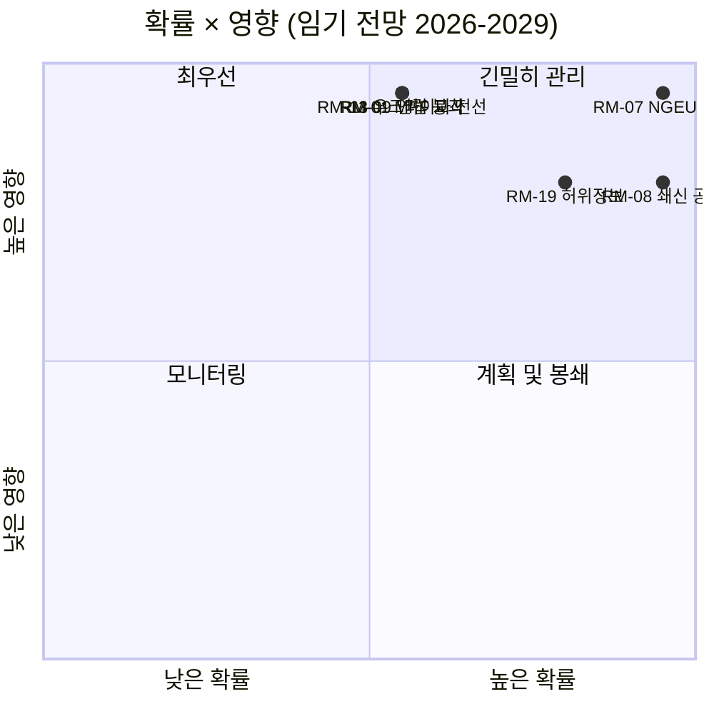

<!-- SPDX-FileCopyrightText: 2026 Hack23 AB -->
<!-- SPDX-License-Identifier: Apache-2.0 -->

# 집행 정보 브리핑 — EP10 제10기 의정 전망 (2029년까지) | 2026-05-11

**분류:** 오픈소스 — 공개 의회 기록
**신뢰도:** 🟡 보통 (3년간 납기 창; 예산 절벽 동인 A1, 행동 위험 A2/B3)
**실행:** `analysis/daily/2026-05-11/term-outlook/`
**시계:** 2026-05-11 → 2029-06-06 (37개월 완전 임기 납기 창)
**생성일:** 2026-05-16 (소급 요약, 신규 MCP 호출 없음)
**주요 출처:** EP MCP `generate_political_landscape`, `analyze_coalition_dynamics`, `early_warning_system`, `monitor_legislative_pipeline`, `compare_political_groups`, `get_all_generated_stats`; IMF WEO (유로존 거시 외피); 유럽위원회 2026년 업무 프로그램.

---

## 🎯 핵심 요약

**EP10은 2029년 선거 전에 부분적인 다수 연립 입법 의제를 전달할 것입니다** — 임기의 전략적 틀은 **구조적 재정 압박**이지 급성 정치 위기가 아닙니다. 교섭단체 구성 (EPP 188 / S&D 136 / Renew 77 / Greens 53 / PfE 84 / ECR 78 / The Left 46 / ESN 25 / NI 30)은 상위 2개 교섭단체의 의석 점유율을 **44.5%**로 설정하며, 이는 376석 과반수를 크게 밑돕니다. 따라서 **모든 우선 표결에는 최소 3개 교섭단체가 필요**하며, EVP+S&D+Renew "grand centre" (56.2%)가 기본 연립으로 유지됩니다. 결정적인 입법 창은 **2027년 1분기~2028년 4분기**입니다 — MFF 검토를 완료해야 하고, **NGEU 상환(2028년)이 개시**되며, 위원회 쇄신의 막간기가 아직 생산량을 압박하지 않는 기간입니다. 두 가지 위험이 기록을 지배합니다: **RM-07 NGEU 상환 예산 압박 (거의 확실, L5×I5=25)**과 **RM-08 위원회 쇄신 막간기 (거의 확실, L5×I4=20)** — 둘 다 내재된 구조적 사건이지 정책적 선택이 아닙니다. 2029년 선거는 **NGEU 상환 개시로 인한 예산 압박의 서사를 놓고 다투게 됩니다**; 기본 의석 예측("현상 유지", ~50%)은 2029년에 EPP-5 / S&D-5 / PfE+10 델타를 보여주며, EP11을 향해 중앙 연립이 다소 얇은 여백으로 유지됩니다.

---

## 🧭 이 브리핑이 지원하는 3가지 결정

| # | 결정 | 결정자 | 기한 | 근거 |
|:-:|----------|-------------|:--------:|----------|
| 1 | **우선 표결을 2027년 3분기→4분기로 앞당기기** — 위원회 쇄신 막간기 동안 2029년 1~2분기에 생산량이 ~40% 감소하기 전에 | 의장 회의; 위원회 의장 | 2027년 본회의 일정 | RM-08 (거의 확실×I4=20); `intelligence/synthesis-summary.md`의 결과 #7 |
| 2 | **2027년 4분기 말까지 MFF 검토 + NGEU 상환 프레임워크 확정** — 최고 점수 두 위험 (RM-01 교착 + RM-07 압박)이 지연되면 충돌 | BUDG, ECON, 이사회, 위원회 부의장 | 2027년 4분기 엄격한 기한 | RM-07 (점수 25), RM-01 (점수 15); `intelligence/economic-context.md` (IMF WEO 유로존 실질 GDP 0.9-1.2% (2030년까지), 순 정부 대출 -2.8%~-3.4% → 신규 지출을 위한 재정 여력 없음) |
| 3 | **PfE+ECR+ESN (26.4%)이 이민/기후 후퇴 파일에서 EPP 이탈자를 유인할 경우 ~33-35% 저지 소수파에 대한 연립 비상 계획** | EPP 교섭단체 규율 + S&D + Renew 그림자 보고관 | 지속, 12개월 모니터링 | RM-09 (반반×I5=15), RM-11 (가능성 있음×I4=12); 결과 #8 |

각 결정은 실행 문서 자체의 위험 행과 핵심 결과에 연결됩니다; 요약은 그 사슬 밖의 판단을 도입하지 않습니다.

---

## 📰 60초 읽기

- 🔴 **MULTI_COALITION_REQUIRED가 기준선:** 상위 2개 교섭단체 (EPP+S&D)는 **44.5%**에 불과; 모든 본회의 성공에는 ≥3개 교섭단체 필요 (일반적으로 grand centre 56.2%).
- 🟠 **두 가지 구조적 확실성:** **NGEU 상환 개시 2028년** (RM-07, L5×I5=25 — 점수 25의 유일한 위험); **위원회 쇄신 막간기**가 2029년 1~2분기 입법 생산량을 ~40% 감소 (RM-08, L5×I4=20).
- 🟢 **오늘 파이프라인은 건강함:** `monitor_legislative_pipeline`이 EP9 기준선과 일치 — **급성 병목 아직 없음**, 그러나 2027~2028년에 삼자 회담 용량이 좁아짐 (RM-12).
- 🟡 **단편화 6.59 (높음)** `early_warning_system` 기준; 유효 정당 수 ≈4.7; EPP의 `DOMINANT_GROUP_RISK`는 MEDIUM.
- 🔵 **거시경제는 허용적이지 않음:** IMF WEO 유로존 실질 GDP **0.9-1.2% (2030년까지)**, 인플레이션 1.6-2.2%, **순 정부 대출 -2.8%~-3.4% GDP** — 수입 조치 없이 신규 지출을 위한 재정 여력 없음.
- 🟣 **우익 수렴 상한:** PfE+ECR+ESN=**26.4%** (현재); 후퇴 표결에서 EPP 이탈자와 함께 이는 **~33-35% 저지 소수파**이며, 승리 다수파가 아닌 — 그러나 야심찬 중도파 파일을 패배시키기에는 충분 (RM-11).
- 🩷 **2029년 리트머스 시험:** 선거는 MFF 검토 + 단일시장 2.0 + AI법 집행 성과에 따라 결정됨; 어느 하나라도 실패하면 캠페인이 PfE/ECR의 예산 서사 영역으로 이동.
- ⚪ **기본 시나리오:** "현상 유지" — 반반 (~50%). 2029년에 EPP-5 / S&D-5 / PfE+10 델타; 연립 방정식은 유지되지만 버퍼는 더 얇아짐.

---

## 🏛️ 3개 기둥 성과 시험 (임기 성공 여부를 결정함)

실행의 전략적 렌즈 프레임워크에서: 중앙 다수파가 2029년까지 의제를 방어하려면 **다음 세 가지 모두를 실현**해야 합니다.

1. **방위 및 기후 명시적 외피를 포함한 MFF 검토** — 여기서의 실패가 최대 단일 정치적 위험 (RM-01×RM-07 교차점).
2. **측정 가능한 생산성 목표를 가진 단일시장 2.0 패키지** — 삼자 회담 붕괴 RM-04는 *가능성 없음*이지만 고영향; 실행은 이를 가장 가능성 있는 우발적 실패로 식별.
3. **모든 회원국에서의 입증된 AI법 집행** — 불균일 집행 RM-03은 *매우 가능성 있음*; 문제는 DG-CNECT + 국내 당국이 2028년 중반까지 3~5건의 주목할 만한 컴플라이언스 성과를 낼 수 있는지 여부.

한 기둥이 실패하면 2029년 캠페인이 PfE-ECR의 재정 규율 서사로 진행됨; 두 기둥이 실패하면 EP11은 실질적인 재편을 목격하게 됨.

---

## ⚠️ 위험 스냅샷 (20개 중 상위 6개)

| ID | 위험 | 확률 | 영향 | 점수 | WEP 대역 | 운영상 의미 |
|:--:|------|:-:|:-:|:-----:|----------|---------------------|
| **RM-07** | NGEU 상환 예산 압박 | 5 | 5 | **25** | 거의 확실 | 구조적 — 2028년 달력에 묶임, 정책적 선택 아님 |
| **RM-08** | 위원회 쇄신 막간기 | 5 | 4 | **20** | 거의 확실 | 2029년 1~2분기 생산량 ≈EP9 기준선 대비 -40% |
| **RM-19** | 2029년 선거 허위정보 | 4 | 4 | **16** | 매우 가능성 있음 | DSA 집행 역량 시험 |
| **RM-01** | 2027년 4분기 이후 MFF 검토 교착 | 3 | 5 | **15** | 반반 | 결정 1 기한; RM-07로 연쇄 |
| **RM-09** | 연립 산술 붕괴 (상위 2개 < 44%) | 3 | 5 | **15** | 반반 | 중앙 연립 방정식에 대해 실존적 |
| **RM-13** | 러시아/우크라이나 전선 확대 | 3 | 5 | **15** | 반반 | 단일 충격마다 의제를 3~6개월 재편 |

**점수 25/20 위험 (RM-07, RM-08)은 달력에 묶인 확실성**이지 정책적 선택이 아님 — 모든 것을 제약. **점수 15의 세 위험은 정치적 실패**이며 중앙 연립이 여전히 피할 수 있음. 요약은 RM-07+RM-01 교차점을 임기의 가장 높은 레버리지 포인트로 읽음.

---

## 🔮 주요 미래 트리거 (12개월 모니터링)

`extended/forward-indicators.md`에서:

1. **2026년 4분기 — BUDG의 MFF 협상 위임 표결.** 2027년 1분기 전에 중앙 연립이 방위·기후 외피를 포함한 위임에 합의하지 못하면, RM-01이 반반에서 가능성 있음으로 진행되고 시나리오 6(대연정 재봉인) 협상을 강제.
2. **2027년 1~3분기 — 의장단 선거 + 의장직 순환.** EPP 의장직 지원 가격 문제에 대해 선거 주기 실행(`analysis/daily/2026-05-11/election-cycle/`)과 교차 참조; 결과가 결정 1 기한의 아키텍처를 형성.
3. **2027년 2분기 — AI법 집행 보고.** 2028년 중반 전 DG-CNECT + 국내 당국 3~5건의 컴플라이언스 조치가 세 번째 기둥의 반증자; 부재가 RM-03을 높임.
4. **2028년 1분기 — NGEU 상환 개시.** 이는 **예측 사건이 아니라 예정된 예산 절벽** — RM-07이 거의 확실(미래)에서 활성(현재)으로 이동. 이 시점 전에 결정 2의 재정 프레임워크를 마감해야 함.
5. **2029년 1분기 — 선거 전 본회의 블록.** 쇄신 막간기 생산량 감소 전에 우선 표결을 착지시킬 마지막 기회; 삼자 회담 용량 (RM-12)이 구속적이 됨.

---

## 🌍 거시·지정학적 외피

- **IMF WEO (`intelligence/economic-context.md`):** 유로존 실질 GDP **0.9-1.2% (2030년까지)**; HICP 인플레이션 1.6-2.2%; 순 정부 대출 **-2.8%~-3.4% GDP**. 수입 조치 없이 신규 지출을 위한 재정 여력 없음 — 이 거시 프레임워크가 RM-07에 점수 25를 부여하는 것.
- **기준선 초과 지정학적 충격:** 러시아-우크라이나 전선 (RM-13 점수 15), 중동 불안정, 인도-태평양 마찰, EU-미국 관계 파열 위험 (RM-14 점수 12). 실행의 입장: **단일 충격마다 입법 의제를 3~6개월 재편;** 임기에 걸친 누적 노출은 높음.
- **DSA 시험:** 2029년 선거 전 허위정보 캠페인 RM-19 (매우 가능성 있음×I4=16)는 EP 자체가 EP9에서 구축한 규제 아키텍처의 운영 스트레스 테스트.

---

## 🛡️ 출처 품질 평가

- **A1/A2 앵커:** 교섭단체 구성, 단편화, 파이프라인 생산량, 본회의 의제 — EP 오픈 데이터 포털, 요약의 구조적 기초.
- **`monitor_legislative_pipeline`**은 이 실행에서 *건강함* (EP9 기준선과 일치) — 동일한 호출이 0개 절차를 반환한 동반 선거 주기 실행 (A6)과 대조적. 두 실행은 같은 날짜를 공유하지만 하루 중 다른 시간에 실행됨; 임기 전망 스냅샷이 가장 운영상 유용.
- **IMF WEO (B급)**이 거시 외피를 고정; 이는 요약에서 가장 중요한 비EP 입력이며 RM-07/RM-01 점수 산정에 필수적.
- **행동적 판단 (RM-09 연립 붕괴, RM-11 우익 수렴)**은 의석 점유율 프록시와 2024-25년 투표 패턴에 의존; EP API가 아직 MEP별 결속 데이터를 공개하지 않아 여기서 신뢰도는 보통.
- **순 신뢰도:** 구조적 확실성 (RM-07, RM-08)은 높음, 정치적 위험 (RM-01, RM-09, RM-11)은 보통, 거시 외피는 보통.

---

## 🧭 ACH — 임기의 세 가지 경쟁하는 읽기

`extended/historical-parallels.md`와 `intelligence/scenario-forecast.md`는 동일한 산술에 대한 세 가지 경쟁하는 읽기를 추적합니다:

- **H1 — "현상 유지"** (반반, ~50%): 세 기둥 모두 실현되고, 연립이 유지되며, 2029년이 EP10 마이너스 5%를 생성. 실행의 기본 시나리오.
- **H2 — "부분적 실패 / 예산 서사 손실"** (가능성 있음, ~30%): 한 기둥이 실패하고, 2029년 캠페인이 PfE-ECR 영역으로 이동하며, 중앙 연립은 더 약하지만 산술적으로는 여전히 기능.
- **H3 — "구조적 단절"** (가능성 없음, ~10%): 조약 위기 / 제7조 확대 / 이사회 교착으로 인한 조기 선거. 긴 꼬리; 37개월 시계가 이를 요구하기 때문에 추적.

나머지 ~10%는 복합 충격 시나리오에 분산. 요약은 H2를 **운영 스트레스 케이스**로 유지하면서 H1을 계획 기준선으로 지지합니다 — 결정 3이 채워야 하는 간격이 바로 그것.

---

## 📎 실행 아티팩트 (결정 전 읽기)

| 레이어 | 아티팩트 | 이유 |
|-------|----------|-----|
| 기사 | `article.md` | 완전한 임기 전망 서사 |
| 합성 | `intelligence/synthesis-summary.md` | 주요 판단 + 10가지 핵심 결과 (권위적) |
| 연립 | `intelligence/coalition-dynamics.md` | grand centre / 베네수엘라 / 저지 소수파 산술 |
| 위험 기록 | `risk-scoring/risk-matrix.md` | RM-01→RM-20, 확률×영향×점수와 WEP 대역 |
| 정량적 SWOT | `risk-scoring/quantitative-swot.md` | 기둥과 제약 |
| 파이프라인 | `intelligence/forward-projection.md`, `commission-wp-alignment.md` | 2029년까지 생산량 예측 |
| 거시 | `intelligence/economic-context.md` | IMF WEO + NGEU 외피 |
| 임기 호 | `intelligence/term-arc.md`, `presidency-trio-context.md`, `mandate-fulfilment-scorecard.md` | 위원회 쇄신 막간기 순서 |
| 의석 예측 | `intelligence/seat-projection.md` | H1/H2 하에서 2029년 델타 |
| 지표 | `extended/forward-indicators.md` | 12개월 트립와이어 의제 |
| 신뢰성 | `intelligence/mcp-reliability-audit.md` | A1/A2/B3 앵커 문서화 |
| 자기 반성 | `intelligence/methodology-reflection.md` | 단계 10.5 마감 |

**동반 문서:** `analysis/daily/2026-05-11/election-cycle/executive-brief.md`는 60개월 선거 오버레이를 포함; 두 요약은 함께 읽도록 설계됨.

---

**문서 관리**
- **템플릿 참조:** `analysis/templates/executive-brief.md`
- **아티팩트 경로:** `analysis/daily/2026-05-11/term-outlook/executive-brief.md`
- **분류:** 공개
- **소급적:** 요약은 2026-05-16에 커밋된 실행 아티팩트를 기반으로 작성됨; **신규 MCP 호출 없음**. 모든 판단은 실행 자체가 커밋한 것을 반복, 증류, ACH 교차 확인; 새로운 주장은 도입되지 않음.
