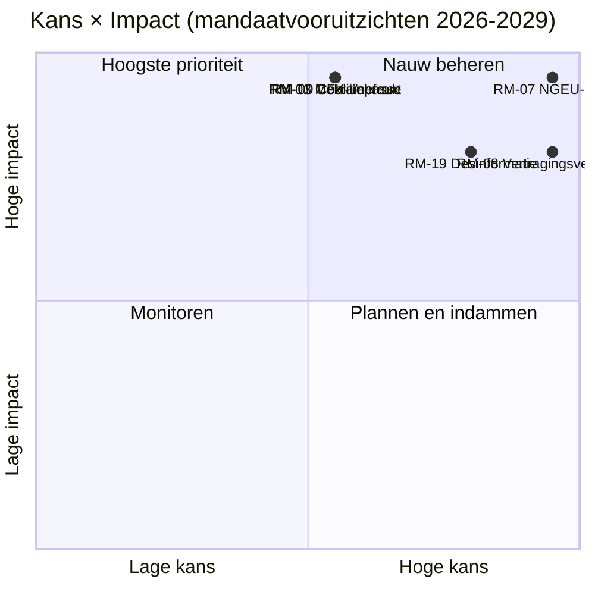

<!-- SPDX-FileCopyrightText: 2026 Hack23 AB -->
<!-- SPDX-License-Identifier: Apache-2.0 -->

# Uitvoerende Inlichtingensamenvatting — EP10 Mandaatvooruitzichten tot 2029 | 2026-05-11

**Classificatie:** OSINT — Openbare parlementaire registratie
**Vertrouwen:** 🟡 Matig (leveringsvenster van 3 jaar; begrotingsklif-aanjagers zijn A1, gedragsrisico's zijn A2/B3)
**Uitvoering:** `analysis/daily/2026-05-11/term-outlook/`
**Horizon:** 2026-05-11 → 2029-06-06 (leveringsvenster van 37 maanden volledig mandaat)
**Gegenereerd:** 2026-05-16 (retrospectieve samenvatting, geen nieuwe MCP-aanroepen)
**Primaire bronnen:** EP MCP `generate_political_landscape`, `analyze_coalition_dynamics`, `early_warning_system`, `monitor_legislative_pipeline`, `compare_political_groups`, `get_all_generated_stats`; IMF WEO (EA-macro-envelop); Werkprogramma van de Commissie 2026.

---

## 🎯 BLUF

**EP10 zal een gedeeltelijk, meervoudig-coalitie wetgevend dossier opleveren vóór de verkiezingen van 2029** — het strategische kader van het mandaat is **structurele begrotingsdruk**, geen acute politieke crisis. De fractieopstelling (EVP 188 / S&D 136 / Renew 77 / Groenen 53 / PfE 84 / ECR 78 / The Left 46 / ESN 25 / NI 30) plaatst het aandeel van de twee grootste op **44,5 %** — ruim onder de meerderheid van 376 zetels — zodat **elke prioriteitsstemming ten minste drie fracties vereist**, en EVP+S&D+Renew "Grand Centre" (56,2 %) de modale coalitie blijft. Het beslissende wetgevingsvenster is **2027-K1 tot 2028-K4** — de periode waarin de MFK-herziening moet worden afgerond, **NGEU-terugbetaling wordt geactiveerd (2028)** en het interregnum van de Commissievernieuwing de doorstroom nog niet heeft gecomprimeerd. Twee risico's domineren het register: **RM-07 NGEU-terugbetalings­begrotingsdruk (Nagenoeg zeker, L5×I5 = 25)** en **RM-08 Interregnum Commissievernieuwing (Nagenoeg zeker, L5×I4 = 20)** — beide zijn ingebedde structurele gebeurtenissen, geen politieke keuzes. De verkiezingen van 2029 zullen worden **uitgevochten op het narratief van de begrotingsdruk** veroorzaakt door de activering van de NGEU-terugbetaling; de modale zetelprognose ("doormodderen", ~50 %) toont EVP −5 / S&D −5 / PfE +10 delta's, waarmee de centristische coalitie net intact blijft voor EP11.

---

## 🧭 3 Beslissingen die deze Samenvatting ondersteunt

| # | Beslissing | Wie beslist | Deadline | Bewijs |
|:-:|----------|-------------|:--------:|----------|
| 1 | **Prioriteitsstemmen naar 2027-K3 → 2028-K4 vervroegen** voordat de doorstroom in K1–K2 2029 ~40 % daalt onder het interregnum van de Commissievernieuwing | Conferentie van Voorzitters; voorzitters van commissies | agenda plenaire vergaderingen 2027 | RM-08 (Nagenoeg zeker × I4 = 20); bevinding nr. 7 in `intelligence/synthesis-summary.md` |
| 2 | **MFK-herziening + NGEU-terugbetalingskader vergrendelen vóór einde K4 2027** — de twee hoogst gescoorde risico's (RM-01 impasse + RM-07 druk) botsen als dit uitloopt | BUDG, ECON, Raad, VP's van de Commissie | harde deadline 2027-K4 | RM-07 (score 25), RM-01 (score 15); `intelligence/economic-context.md` (IMF WEO EA-bbp 0,9–1,2 % t/m 2030, netto kredietverlening overheid −2,8 % tot −3,4 % → geen begrotingsruimte) |
| 3 | **Coalitienoodplanning voor blokkerende minderheid van ~33–35 %** als PfE+ECR+ESN (26,4 %) EVP-overlopen aantrekt op migratie-/klimaatterugrol-dossiers | EVP-fractiedisciplinaire + S&D + Renew schaduwrapporteurs | doorlopend, bewaking 12 maanden | RM-09 (Ongeveer gelijk × I5 = 15), RM-11 (Waarschijnlijk × I4 = 12); bevinding nr. 8 |

Elke beslissing is gekoppeld aan een risikorij en een sleutelbevinding in de eigen synthese van de uitvoering; de samenvatting introduceert geen oordelen buiten die keten.

---

## 📰 60-Secondenlecture

- 🔴 **MULTI_COALITION_REQUIRED is de basislijn:** de twee grootste (EVP + S&D) bereiken slechts **44,5 %**; elk plenair succes vereist ≥3 fracties (doorgaans Grand Centre op 56,2 %).
- 🟠 **Twee structurele zekerheden:** **NGEU-terugbetaling activeert 2028** (RM-07, L5×I5=25 — het enige risico met score 25); **interregnum Commissievernieuwing** verlaagt de wetgevingsdoorvoer met ~40 % in K1–K2 2029 (RM-08, L5×I4=20).
- 🟢 **Pipeline vandaag gezond:** `monitor_legislative_pipeline` stemt overeen met EP9-basislijn — **nog geen acuut knelpunt**, maar trilogcapaciteit wordt krapper in 2027–2028 (RM-12).
- 🟡 **Fragmentatie 6,59 (HOOG)** per `early_warning_system`; effectief aantal partijen ≈ 4,7; `DOMINANT_GROUP_RISK` bij EVP op MEDIUM.
- 🔵 **Macro is niet-permissief:** IMF WEO EA reëel bbp **0,9–1,2 % t/m 2030**, inflatie 1,6–2,2 %, **netto kredietverlening overheid −2,8 % tot −3,4 % van het bbp** — geen begrotingsruimte voor nieuwe uitgaven zonder inkomensmaatregelen.
- 🟣 **Rechtsconvergentieplafond:** PfE + ECR + ESN = **26,4 %** vandaag; met EVP-overlopen bij terugrol-stemmingen is dit een **blokkerende minderheid van ~33–35 %**, geen winnende meerderheid — maar genoeg om ambitieuze centristische dossiers te verslaan (RM-11).
- 🩷 **Lakmoesproef 2029:** verkiezingen worden beslist door of MFK-herziening + interne markt 2.0 + AI Act-handhaving worden geleverd; falen op één punt verschuift de campagne naar PfE/ECR-begrotingsdrukterrein.
- ⚪ **Modaal scenario:** "doormodderen" — Ongeveer gelijk (~50 %). EVP −5 / S&D −5 / PfE +10 delta's in 2029; coalitierecept overleeft, buffer dunner verder.

---

## 🏛️ Drie-pijler leveringstest (bepaalt of het mandaat slaagt)

Uit het strategisch lens-kader van de uitvoering: **alle drie** van het volgende moeten worden gerealiseerd opdat de centristische meerderheid haar dossier tot 2029 verdedigt.

1. **MFK-herziening met expliciete defensie- en klimaatenveloppen** — falen hier is het enkel grootste politieke risico (samenloop RM-01 × RM-07).
2. **Interne markt 2.0-pakket met meetbare productiviteitsdoelstellingen** — RM-04 trilog-ineenstorting is *Onwaarschijnlijk* maar hoog-impact; de uitvoering identificeert het als de meest plausibele toevallige mislukking.
3. **Aantoonbare AI Act-handhaving in alle lidstaten** — RM-03 *Zeer waarschijnlijk* ongelijkmatige handhaving; de vraag is of DG-CNECT + nationale autoriteiten drie tot vijf hoogprofileerde compliance-winsten kunnen produceren tegen medio 2028.

Als één enkele pijler faalt, wordt de campagne van 2029 gevoerd op PfE-ECR-begrotingsdisciplinenarratief; falen twee, dan ziet EP11 een substantiële herpositionering.

---

## ⚠️ Risicomomentopname (Top 6 van 20)

| ID | Risico | K | I | Score | WEP-band | Operationele betekenis |
|:--:|------|:-:|:-:|:-----:|----------|---------------------|
| **RM-07** | NGEU-terugbetalings­begrotingsdruk | 5 | 5 | **25** | Nagenoeg zeker | Structureel — kalendergebonden aan 2028, niet beleidgestuurd |
| **RM-08** | Interregnum Commissievernieuwing | 5 | 4 | **20** | Nagenoeg zeker | K1–K2 2029 doorvoer ≈ −40 % vs. EP9-basislijn |
| **RM-19** | Desinformatie over verkiezingen 2029 | 4 | 4 | **16** | Zeer waarschijnlijk | DSA-handhavingscapaciteitstest |
| **RM-01** | MFK-herzieningsimpasse na 2027-K4 | 3 | 5 | **15** | Ongeveer gelijk | Deadline beslissing 1; cascade in RM-07 |
| **RM-09** | Coalitie-arithmetica-breuk (top-2 < 44 %) | 3 | 5 | **15** | Ongeveer gelijk | Existentieel voor het centristische coalitierecept |
| **RM-13** | Rusland/Oekraïne-frontescalatie | 3 | 5 | **15** | Ongeveer gelijk | Verschuift agenda met 3–6 maanden per enkelvoudige schok |

De twee **risico's met score 25/20 (RM-07, RM-08) zijn kalendergebonden zekerheden**, geen politieke keuzes — ze beperken alles. De drie **risico's met score 15 zijn politieke mislukkingen** die de centristische coalitie nog kan afwenden. De samenvatting leest de samenloop RM-07 + RM-01 als het beslissende punt met het grootste hefboomeffect van het mandaat.

---

## 🔮 Top Voorwaartse Triggers (12-maanden bewaking)

Uit `extended/forward-indicators.md`:

1. **K4 2026 — MFK-onderhandelingsmandaatstimming in BUDG.** Als de centristische coalitie niet vóór K1 2027 overeenstemming kan bereiken over een mandaat inclusief defensie- en klimaatenveloppen, rückt RM-01 op van Ongeveer gelijk naar Waarschijnlijk en dwingt een Scenario 6 (Grand Coalition Re-Sealing)-onderhandeling.
2. **2027-K1 → K3 — Bureau-verkiezing + Voorzitterschapsrotatie.** Kruisverwijzing met de verkiezingscyclus-uitvoering (`analysis/daily/2026-05-11/election-cycle/`) over de vraag van de steunprijs van het EVP-Voorzitterschap; uitkomst vormt de architectuur van de deadline van Beslissing 1.
3. **2027-K2 — AI Act-handhavingsrapportage.** Drie tot vijf DG-CNECT + nationale autoriteiten complianceacties vóór medio 2028 zijn de falsificator voor de derde pijler; afwezigheid doet RM-03 oplopen.
4. **2028-K1 — Activering NGEU-terugbetaling.** Dit is **geen voorspellingsgebeurtenis, het is een gepland begrotingsklif** — RM-07 gaat over van Nagenoeg zeker (toekomst) naar Actief (heden). Het begrotingskader van Beslissing 2 moet worden afgesloten vóór dit punt.
5. **2029 kalender K1 — Pre-electorale plenaire blok.** Laatste kans om prioriteitsstemmingen te landen vóór de doorvoerdaling van het interregnum van de vernieuwing; trilogcapaciteit (RM-12) wordt bindend.

---

## 🌍 Macro-/Geopolitieke Envelop

- **IMF WEO (`intelligence/economic-context.md`)**: EA reëel bbp **0,9–1,2 % t/m 2030**; HICP-inflatie 1,6–2,2 %; netto kredietverlening overheid **−2,8 % tot −3,4 % van het bbp**. Geen begrotingsruimte voor nieuwe uitgaven zonder inkomensmaatregelen — het macrokader is wat RM-07 score 25 geeft.
- **Geopolitieke schokken boven basislijn:** Rusland-Oekraïne-front (RM-13 score 15), volatiliteit Midden-Oosten, Indo-Pacifische wrijving, risico op breuk EU-VS-relatie (RM-14 score 12). Standpunt uitvoering: **elke afzonderlijke schok herschikt de wetgevingsagenda met 3–6 maanden**; cumulatieve blootstelling over het mandaat is hoog.
- **DSA-test:** RM-19 desinformatiecampagne over verkiezingen 2029 (Zeer waarschijnlijk × I4 = 16) is de operationele stresstest van de regulerende architectuur die het EP zelf in EP9 heeft gebouwd.

---

## 🛡️ Bronkwaliteits­beoordeling

- **A1/A2-ankers:** fractieopstelling, fragmentatie, pipeline-doorvoer, plenaire agenda — EP Open Data Portal, structureel fundament van de samenvatting.
- **`monitor_legislative_pipeline`** is in deze uitvoering *gezond* (stemt overeen met EP9-basislijn) — contrasteert met de begeleidende verkiezingscyclus-uitvoering, waarbij dezelfde aanroep 0 procedures retourneerde (A6). De twee uitvoeringen delen dezelfde datum maar werden op verschillende tijdstippen van de dag uitgevoerd; de mandaatperspectiefopname is de operationeel nuttigste.
- **IMF WEO (B-klasse)** verankert de macro-envelop; dit is de belangrijkste niet-EP-input van de samenvatting en essentieel voor de scoring van RM-07/RM-01.
- **Gedragsoordelen (RM-09 coalitiebreuk, RM-11 rechtsconvergentie)** steunen op zetelaandeel-proxy's en stempatronen 2024–25; per-MEP cohesiedata zijn nog niet blootgelegd door de EP-API, dus het vertrouwen hier is Matig.
- **Nettovertrouwen:** Hoog bij structurele zekerheden (RM-07, RM-08), Matig bij politieke risico's (RM-01, RM-09, RM-11), Matig bij macro-envelop.

---

## 🧭 ACH — Drie concurrerende mandaatlezingen

`extended/historical-parallels.md` en `intelligence/scenario-forecast.md` volgen drie concurrerende lezingen van dezelfde rekenkunde:

- **H1 — "Doormodderen"** (Ongeveer gelijk, ~50 %): alle drie pijlers worden gerealiseerd, coalitie houdt stand, 2029 produceert EP10-minus-5 %. Het modale scenario van de uitvoering.
- **H2 — "Gedeeltelijke mislukking / verlies begrotingsnarratief"** (Waarschijnlijk, ~30 %): één pijler faalt, de campagne van 2029 verschuift naar PfE-ECR-terrein, de centristische coalitie blijft dunner maar nog steeds rekenkundig functioneel.
- **H3 — "Structurele breuk"** (Onwaarschijnlijk, ~10 %): verdragscrisis / Artikel 7-escalatie / vervroegde verkiezingen door Raadsimpasse. Lange staart; gevolgd omdat de 37-maandshorizon het vereist.

De resterende ~10 % verdeelt zich over samengestelde schokscenario's. De samenvatting verdedigt H1 als planningsbasislijn terwijl H2 wordt bewaard als de **operationele** stresscase — dat is de kloof die Beslissing 3 moet dichten.

---

## 📎 Uitvoeringsartefacten (Lees-Voor-Beslissen)

| Laag | Artefact | Waarom |
|-------|----------|-----|
| Artikel | `article.md` | Volledig mandaatperspectief-narratief |
| Synthese | `intelligence/synthesis-summary.md` | Hoofdoordeel + 10 sleutelbevindingen (gezaghebbend) |
| Coalitie | `intelligence/coalition-dynamics.md` | Grand Centre / Venezuela / blokkerende-minderheid-rekenkunde |
| Risicoregister | `risk-scoring/risk-matrix.md` | RM-01 → RM-20 met K × I × Score en WEP-banden |
| Kwantitatieve SWOT | `risk-scoring/quantitative-swot.md` | Pijlers vs. beperkingen |
| Pipeline | `intelligence/forward-projection.md`, `commission-wp-alignment.md` | Doorvoerprognose tot 2029 |
| Macro | `intelligence/economic-context.md` | IMF WEO + NGEU-envelop |
| Mandaatboog | `intelligence/term-arc.md`, `presidency-trio-context.md`, `mandate-fulfilment-scorecard.md` | Sequentiëring interregnum vernieuwing |
| Zetelprojectie | `intelligence/seat-projection.md` | 2029 delta's onder H1/H2 |
| Indicatoren | `extended/forward-indicators.md` | 12-maanden tripwire-agenda |
| Betrouwbaarheid | `intelligence/mcp-reliability-audit.md` | A1/A2/B3-ankers gedocumenteerd |
| Zelfrevisie | `intelligence/methodology-reflection.md` | Stap 10.5-afsluiting |

**Begeleider:** `analysis/daily/2026-05-11/election-cycle/executive-brief.md` dekt de 60-maanden electorale overlay; de twee samenvattingen zijn ontworpen om samen te worden gelezen.

---

**Documentcontrole**
- **Sjabloonreferentie:** `analysis/templates/executive-brief.md`
- **Artefactpad:** `analysis/daily/2026-05-11/term-outlook/executive-brief.md`
- **Classificatie:** Openbaar
- **Retrospectief:** Samenvatting geschreven op 2026-05-16 op basis van de gecommitteerde artefacten van de uitvoering; **er zijn geen nieuwe MCP-aanroepen gedaan**. Alle oordelen herhalen, destilleren en ACH-kruiscontroleren wat de uitvoering zelf heeft gecommitteerd; er worden geen nieuwe beweringen geïntroduceerd.
