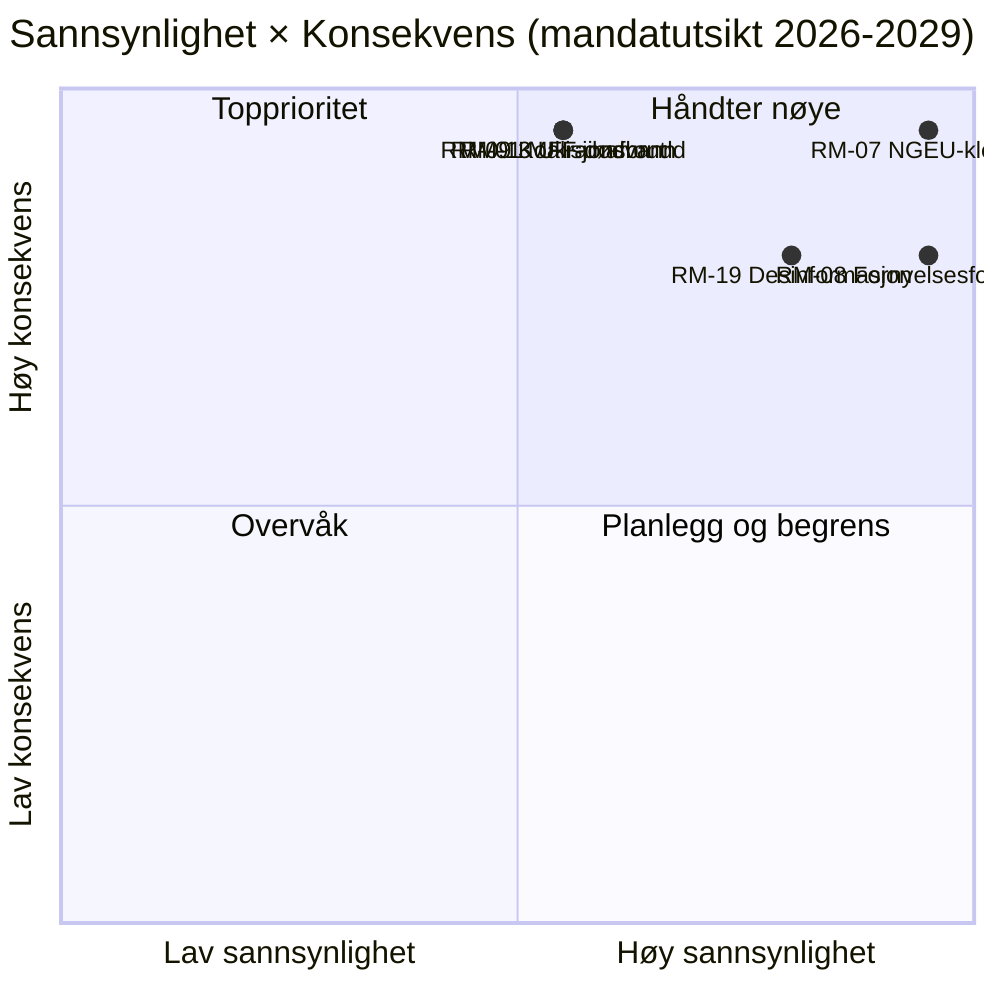

<!-- SPDX-FileCopyrightText: 2026 Hack23 AB -->
<!-- SPDX-License-Identifier: Apache-2.0 -->

# Utøvende Etterretningsbriefing — EP10 Mandatutsikt til 2029 | 2026-05-11

**Klassifisering:** OSINT — Offentlig parlamentarisk bestand
**Konfidens:** 🟡 Moderat (3-årig leveringshorisont; finanspolitiske klippe­kants­drivere er A1, atferdsrisici er A2/B3)
**Kjøring:** `analysis/daily/2026-05-11/term-outlook/`
**Horisont:** 2026-05-11 → 2029-06-06 (37-måneders fullt mandatleveringsvindu)
**Generert:** 2026-05-16 (retrospektiv briefing, ingen nye MCP-kall)
**Primære kilder:** EP MCP `generate_political_landscape`, `analyze_coalition_dynamics`, `early_warning_system`, `monitor_legislative_pipeline`, `compare_political_groups`, `get_all_generated_stats`; IMF WEO (EA-makroenvelop); Kommisjonens arbeidsprogram 2026.

---

## 🎯 BLUF

**EP10 vil levere et delvis, flerkoalisjonsbasert lovgivningsprotokoll frem til valget i 2029** — mandatets strategiske ramme er **strukturelt finanspress**, ikke en akutt politisk krise. Gruppesammensetningen (EPP 188 / S&D 136 / Renew 77 / Greens 53 / PfE 84 / ECR 78 / The Left 46 / ESN 25 / NI 30) plasserer topp-2-andelen på **44,5 %** — langt under 376-seteres flertall — slik at **hver flaggskips­votering krever minst tre grupper**, og EPP+S&D+Renew "Grand Centre" (56,2 %) forblir den modale koalisjonen. Det avgjørende lovgivningsvinduet er **2027-K1 til 2028-K4** — perioden der MFF-revisjonen må fullføres, **NGEU-tilbakebetaling aktiveres (2028)**, og Kommisjonens fornyelsesinterregnum ennå ikke har komprimert gjennomstrømmingen. To risikoer dominerer registeret: **RM-07 NGEU-tilbetalings­finansklemme (Nesten sikkert, L5×I5 = 25)** og **RM-08 Kommisjonsfornyelsesinterregnum (Nesten sikkert, L5×I4 = 20)** — begge er innebygde strukturelle hendelser, ikke politiske valg. Valget i 2029 vil **bli avgjort på grunnlag av finansklemme-narrativet** utløst av NGEU-tilbakebetalingsaktiveringen; det modale mandatprognoseutfallet ("gjennomkamping", ~50 %) viser EPP −5 / S&D −5 / PfE +10 deltaer, og etterlater den centristiske koalisjonen akkurat intakt for EP11.

---

## 🧭 3 Beslutninger Denne Briefing Støtter

| # | Beslutning | Hvem beslutter | Frist | Dokumentasjon |
|:-:|----------|-------------|:--------:|----------|
| 1 | **Prioriter flaggskipsvotering til 2027-K3 → 2028-K4** før gjennomstrømmingen faller ~40 % under Kommisjonens fornyelsesinterregnum K1-K2 2029 | Formannskapskonferansen; komitéledere | kalender for 2027 plenumsmoter | RM-08 (Nesten sikkert × I4 = 20); funn nr. 7 i `intelligence/synthesis-summary.md` |
| 2 | **Lås MFF-revisjon + NGEU-tilbakebetalingsramme innen K4 2027** — de to høyest scorende risikoene (RM-01 dødvann + RM-07 klemme) kolliderer hvis dette glir | BUDG, ECON, Rådet, Kommisjonens VP-er | hard frist 2027-K4 | RM-07 (score 25), RM-01 (score 15); `intelligence/economic-context.md` (IMF WEO EA BNP 0,9–1,2 % til 2030, gen-gov nettoutlån −2,8 % til −3,4 % → ingen finansrom) |
| 3 | **Koalisjons­beredskaps­planlegging for blokkerende minoritet på ~33–35 %** hvis PfE+ECR+ESN (26,4 %) tiltrekker seg EPP-avhoppere på migrasjons-/klimarollback-saker | EPP-whip + S&D-whip + Renew skygge­ordførere | løpende, 12-måneders overvåkning | RM-09 (Omtrent likt × I5 = 15), RM-11 (Sannsynlig × I4 = 12); funn nr. 8 |

Hvert beslutningspunkt er koblet til en risikorad og et nøkkelfunn i kjøringens egen syntese; briefingen introduserer ingen vurderinger utenfor den kjeden.

---

## 📰 60-Sekunders Lesing

- 🔴 **MULTI_COALITION_REQUIRED er basislinje:** topp-2 (EPP + S&D) når bare **44,5 %**; enhver plenarseier krever ≥3 grupper (typisk Grand Centre på 56,2 %).
- 🟠 **To strukturelle sikkerhetspunkter:** **NGEU-tilbakebetaling aktiveres 2028** (RM-07, L5×I5=25 — den eneste score-25-risikoen); **Kommisjonens fornyelsesinterregnum** reduserer lovgivningsgjennomstrømmingen ~40 % K1-K2 2029 (RM-08, L5×I4=20).
- 🟢 **Pipeline er frisk i dag:** `monitor_legislative_pipeline` matcher EP9-basislinje — **ingen akutt flaskehals ennå**, men trialogkapasiteten strammes 2027–2028 (RM-12).
- 🟡 **Fragmentering 6,59 (HØY)** per `early_warning_system`; effektivt antall partier ≈ 4,7; `DOMINANT_GROUP_RISK` på EPP på MEDIUM.
- 🔵 **Makro er ikke-permissiv:** IMF WEO EA real BNP **0,9–1,2 % til 2030**, inflasjon 1,6–2,2 %, **gen-gov nettoutlån −2,8 % til −3,4 % av BNP** — ingen finansrom for nye utgifter uten inntektstiltak.
- 🟣 **Høyrekonvergenstak:** PfE + ECR + ESN = **26,4 %** i dag; med EPP-avhoppere ved rollback-voteringer er dette en **blokkerende minoritet på ~33–35 %**, ikke et vinnende flertall — men nok til å avvise ambisiøse centristiske saker (RM-11).
- 🩷 **Lakmustest 2029:** valget avgjøres av om MFF-revisjon + det indre marked 2.0 + AI Act-håndhevelse lykkes; fiasko på ett punkt skifter kampanjeterreng til PfE/ECR finansklemme.
- ⚪ **Modalt scenario:** "gjennomkamping" — Omtrent likt (~50 %). EPP −5 / S&D −5 / PfE +10 deltaer i 2029; koalisjonsoppskrift overlever, pute tynnes ytterligere.

---

## 🏛️ Tresøylerleveringstest (definerer om mandatet lykkes)

Fra kjøringens strategiske linseramme: **alle tre** av følgende må lykkes for at den centristiske majoriteten skal forsvare sin rekord inn i 2029.

1. **MFF-revisjon med eksplisitte forsvars- og klimatenveloper** — fiasko her er den enkelt største politiske risikoen (RM-01 × RM-07 sammenflom).
2. **Det indre marked 2.0-pakke med målbare produktivitetsmål** — RM-04 trialogkollaps er *Usannsynlig* men høy-konsekvens; kjøringen identifiserer det som den mest plausible utilsiktede fiaskoen.
3. **Påvisbar AI Act-håndhevelse i alle medlemsstater** — RM-03 *Svært sannsynlig* ujevn håndhevelse; spørsmålet er om DG-CNECT + nasjonale myndigheter kan produsere tre til fem høyprofilerte etterlevelsesgevinster innen midten av 2028.

Hvis én enkelt søyle svikter, føres 2029-kampanjen på PfE-ECR finansdisiplin-narrativer; svikter to, opplever EP11 meningsfull omfordeling.

---

## ⚠️ Risikooversikt (Topp 6 av 20)

| ID | Risiko | S | K | Score | WEP-band | Operativ betydning |
|:--:|------|:-:|:-:|:-----:|----------|---------------------|
| **RM-07** | NGEU-tilbakebetalings­finansklemme | 5 | 5 | **25** | Nesten sikkert | Strukturell — kalenderbundet til 2028, ikke politikkstyrt |
| **RM-08** | Kommisjonsfornyelsesinterregnum | 5 | 4 | **20** | Nesten sikkert | K1-K2 2029 gjennomstrømming ≈ −40 % vs. EP9-basislinje |
| **RM-19** | Desinformasjon om 2029-valget | 4 | 4 | **16** | Svært sannsynlig | DSA-håndhevelseskapasitetstest |
| **RM-01** | MFF-revisjonsdødvann etter 2027-K4 | 3 | 5 | **15** | Omtrent likt | Beslutning-1-frist; kaskaderer inn i RM-07 |
| **RM-09** | Koalisjonsaritme­tikkbrudd (topp-2 < 44 %) | 3 | 5 | **15** | Omtrent likt | Eksistensiell for centristisk koalisjonsoppskrift |
| **RM-13** | Russland/Ukraina-frontopptrapping | 3 | 5 | **15** | Omtrent likt | Omformer kalenderen med 3–6 måneder per enkelt sjokk |

De to **score-25/20-risikoene (RM-07, RM-08) er kalenderbundne sikkerhetspunkter**, ikke politiske valg — de begrenser alt annet. De tre **score-15-risikoene er politiske fiaskoer** som den centristiske koalisjonen fortsatt kan avverge. Briefingen leser RM-07 + RM-01-sammenflom som mandatets enkelt mest innflytelsesrike beslutningspunkt.

---

## 🔮 Topp Fremoverpekende Utløsere (12-måneders overvåkning)

Fra `extended/forward-indicators.md`:

1. **K4 2026 — MFF-forhandlingsmandat­votering i BUDG.** Hvis den centristiske koalisjonen ikke kan bli enige om et mandat inklusive forsvars- og klimatenveloper innen K1 2027, avanserer RM-01 fra Omtrent likt mot Sannsynlig og tvinger en Scenario 6 (Grand Coalition Re-Sealing)-forhandling.
2. **2027-K1 → K3 — Bureauvalg + Formannskapsrotasjon.** Kryss­referanse med valgssyklus-kjøringen (`analysis/daily/2026-05-11/election-cycle/`) for EPP-Formannskapets støtteprissørgsmål; utfall former Beslutning-1-frist-arkitekturen.
3. **2027-K2 — AI Act-håndhevelsesrapportering.** Tre til fem DG-CNECT + nasjonale myndigheters etterlevelseshandlinger innen midten av 2028 er falsifikatoren for den tredje søylen; fravær avanserer RM-03.
4. **2028-K1 — NGEU-tilbakebetalingsaktivering.** Dette er **ikke en prognose­hendelse, det er en planlagt finansiell klippe­kant** — RM-07 overgår fra Nesten sikkert (fremtid) til Aktiv (nåtid). Beslutning-2-budsjettrammen må lukkes før dette punktet.
5. **2029 kalender K1 — forvalgsplenariblokk.** Siste mulighet til å lande flaggskipsvoteringer før fornyelsesinterregnumets gjennomstrømmingsfall; trialogkapasitet (RM-12) blir bindende.

---

## 🌍 Makro-/Geopolitisk Envelop

- **IMF WEO (`intelligence/economic-context.md`)**: EA real BNP **0,9–1,2 % til 2030**; HICP-inflasjon 1,6–2,2 %; generell statsforvaltning nettoutlån **−2,8 % til −3,4 % av BNP**. Ingen finansrom for nye utgifter uten inntektstiltak — makrorammen er det som gir RM-07 en score på 25.
- **Geopolitiske sjokk over basislinje:** Russland-Ukraina-fronten (RM-13 score 15), Midtøsten-volatilitet, Indo-Stillehavs-friksjon, EU-USA-forbindelsesbruddrisiko (RM-14 score 12). Kjøringens standpunkt: **ethvert enkelt sjokk omformer lovgivningskalenderen med 3–6 måneder**; kumulativ eksponering over mandatperioden er høy.
- **DSA-test:** RM-19 desinformasjonskampanje om 2029-valget (Svært sannsynlig × I4 = 16) er den operasjonelle stresstesten av reguleringsarkitekturen som EP selv bygde i EP9.

---

## 🛡️ Kilde­kvali­tets­vurdering

- **A1/A2-ankre:** gruppesammensetning, fragmentering, pipelinegjennomstrømming, plenarkalender — EP Open Data Portal, strukturelt fundament for briefingen.
- **`monitor_legislative_pipeline`** er *frisk* i denne kjøringen (matcher EP9-basislinje) — kontrasterer med den ledsagende valgssyklus-kjøringen, der det samme kallet returnerte 0 prosedyrer (A6). De to kjøringene deler dato, men kjørte på ulike tidspunkter av dagen; mandatutsiktenes opptak er det operativt mest nyttige.
- **IMF WEO (B-karakter)** forankrer makroenvelopen; dette er briefingens viktigste ikke-EP-input og er avgjørende for scoring av RM-07/RM-01.
- **Atferdsvurderinger (RM-09 koalisjonsbrudd, RM-11 høyrekonvergens)** hviler på mandatandels­prokser og 2024–25 stemme­mønstre; per-MEP kohesionsdata er ennå ikke eksponert av EP API-et, så konfidens her er Moderat.
- **Nettokonfidens:** Høy på strukturelle sikkerhetspunkter (RM-07, RM-08), Moderat på politiske risikoer (RM-01, RM-09, RM-11), Moderat på makroenvelop.

---

## 🧭 ACH — Tre Konkurrerende Mandatfortolkninger

`extended/historical-parallels.md` og `intelligence/scenario-forecast.md` sporer tre konkurrerende tolkninger av den samme aritmetikken:

- **H1 — "Gjennomkamping"** (Omtrent likt, ~50 %): alle tre søylene lykkes, koalisjonen holder, 2029 produserer EP10-minus-5 %. Kjøringens modale scenario.
- **H2 — "Delvis fiasko / finansnarrativtap"** (Sannsynlig, ~30 %): én søyle svikter, 2029-kampanjen beveger seg til PfE-ECR-terreng, centristisk koalisjon oppstår tynnere men fortsatt aritmetisk funksjonell.
- **H3 — "Strukturelt brudd"** (Usannsynlig, ~10 %): traktat­krise / Artikkel 7-opptrapping / midtvejsvalg fra Råddødvann. Lang hale; spores fordi 37-månedershorisonten krever det.

Gjenværende ~10 % fordeles over sammensatte sjokkscenarier. Briefingen forsvarer H1 som planleggingsbasislinje mens H2 holdes som den **operasjonelle** stresstesten — det er det gapet Beslutning-3 er ment å lukke.

---

## 📎 Kjørings­artefakter (Les-Før-Beslut)

| Lag | Artefakt | Hvorfor |
|-------|----------|-----|
| Artikkel | `article.md` | Fullstendig mandatutsiktsnarrativ |
| Syntese | `intelligence/synthesis-summary.md` | Hoved­vurdering + 10 nøkkelfunn (autoritativt) |
| Koalisjon | `intelligence/coalition-dynamics.md` | Grand-Centre / Venezuela / blokkerende-minoritet-aritmetikk |
| Risikoregister | `risk-scoring/risk-matrix.md` | RM-01 → RM-20 med S × K × Score og WEP-band |
| Kvantitativ SWOT | `risk-scoring/quantitative-swot.md` | Søyler vs. begrensninger |
| Pipeline | `intelligence/forward-projection.md`, `commission-wp-alignment.md` | Gjennomstrømmingsprognose til 2029 |
| Makro | `intelligence/economic-context.md` | IMF WEO + NGEU-envelop |
| Mandatbue | `intelligence/term-arc.md`, `presidency-trio-context.md`, `mandate-fulfilment-scorecard.md` | Fornyelsesinterregnum-sekvensering |
| Mandatprognose | `intelligence/seat-projection.md` | 2029 deltaer under H1/H2 |
| Indikatorer | `extended/forward-indicators.md` | 12-måneders tripwire-kalender |
| Pålitelighet | `intelligence/mcp-reliability-audit.md` | A1/A2/B3-ankre dokumentert |
| Selvrevisjon | `intelligence/methodology-reflection.md` | Steg 10.5-avslutning |

**Ledsager:** `analysis/daily/2026-05-11/election-cycle/executive-brief.md` dekker 60-månedersvaloverlegget; de to briefingene er utformet for å leses samlet.

---

**Dokumentkontroll**
- **Mallreferanse:** `analysis/templates/executive-brief.md`
- **Artefaktsti:** `analysis/daily/2026-05-11/term-outlook/executive-brief.md`
- **Klassifisering:** Offentlig
- **Retrospektiv:** Briefing skrevet 2026-05-16 fra kjøringens committede artefakter; **ingen nye MCP-kall ble foretatt**. Alle vurderinger gjen­gir, destillerer og ACH-krysssjekker hva kjøringen selv committede; ingen nye påstander introduseres.
