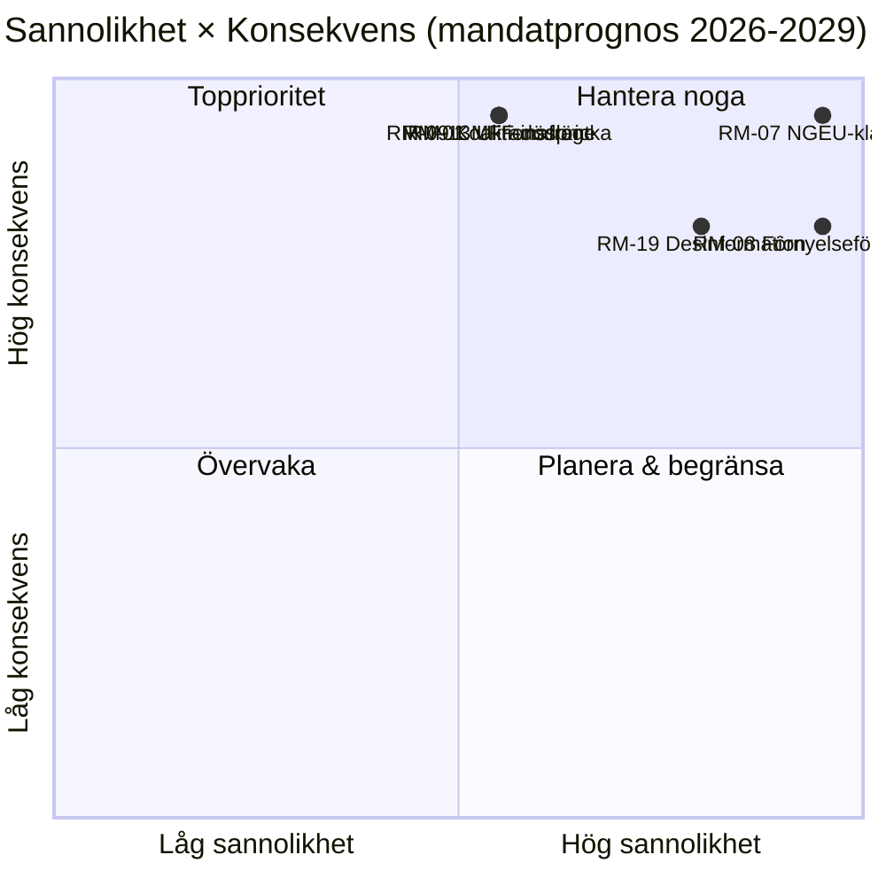

<!-- SPDX-FileCopyrightText: 2026 Hack23 AB -->
<!-- SPDX-License-Identifier: Apache-2.0 -->

# Sammanfattande underrättelsebriefing — EP10 Mandatprognos till 2029 | 2026-05-11

**Klassificering:** OSINT — Offentligt parlamentariskt protokoll
**Konfidens:** 🟡 Måttlig (3-årig leveransfönster; fiskala klippkantsdrivare är A1, beteenderisker är A2/B3)
**Körning:** `analysis/daily/2026-05-11/term-outlook/`
**Horisont:** 2026-05-11 → 2029-06-06 (37-månaders fullmaktsleveransfönster)
**Genererad:** 2026-05-16 (retrospektiv briefing, inga nya MCP-anrop)
**Primära källor:** EP MCP `generate_political_landscape`, `analyze_coalition_dynamics`, `early_warning_system`, `monitor_legislative_pipeline`, `compare_political_groups`, `get_all_generated_stats`; IMF WEO (EA-makroenvelop); Kommissionens arbetsprogram 2026.

---

## 🎯 BLUF

**EP10 kommer att leverera ett partiellt, flerkoalitionsbaserat lagstiftningsprotokoll fram till 2029 års val** — mandatets strategiska ram är **strukturellt finanstryck**, inte akut politisk kris. Gruppsammansättningen (EPP 188 / S&D 136 / Renew 77 / Greens 53 / PfE 84 / ECR 78 / The Left 46 / ESN 25 / NI 30) placerar de två störstas andel på **44,5 %** — långt under 376-platsers majoritet — vilket innebär att **varje flaggskepp­somröstning kräver minst tre grupper**, och EPP+S&D+Renew "Grand Centre" (56,2 %) förblir den modala koalitionen. Det avgörande lagstiftningsfönstret är **2027-K1 till 2028-K4** — den period då MFF-revisionerna måste avslutas, **NGEU-återbetalning aktiveras (2028)** och kommissionens förnyelseinterregnum inte ännu har komprimerat genomströmningen. Två risker dominerar registret: **RM-07 NGEU-återbetalningsfinansklämma (Nästan säkert, L5×I5 = 25)** och **RM-08 Kommissionsförnyelseinterregnum (Nästan säkert, L5×I4 = 20)** — båda är inbyggda strukturella händelser, inte politiska val. Valet 2029 kommer att **avgöras utifrån finansklämma-narrativet** utlöst av NGEU-återbetalningsaktiveringen; det modala mandatprojektionsresultatet ("genomkämpning", ~50 %) visar EPP −5 / S&D −5 / PfE +10 deltaer, vilket lämnar den centristiska koalitionen precis intakt för EP11.

---

## 🧭 3 Beslut Denna Briefing Stöder

| # | Beslut | Vem beslutar | Deadline | Belägg |
|:-:|----------|-------------|:--------:|----------|
| 1 | **Prioritera flaggskeppomröstningar till 2027-K3 → 2028-K4** innan genomströmningen faller ~40 % under kommissionsförnyelseinterregnumet K1-K2 2029 | Ordförandekonferensen; utskottsordföranden | kalender för 2027 plenarsessioner | RM-08 (Nästan säkert × I4 = 20); fynd nr 7 i `intelligence/synthesis-summary.md` |
| 2 | **Lås MFF-revision + NGEU-återbetalningsramverk senast K4 2027** — de två högst poängsatta riskerna (RM-01 dödläge + RM-07 klämma) kolliderar om detta skjuts upp | BUDG, ECON, rådet, kommissionsVP:er | hård deadline 2027-K4 | RM-07 (poäng 25), RM-01 (poäng 15); `intelligence/economic-context.md` (IMF WEO EA BNP 0,9–1,2 % till 2030, gen-gov nettoutlåning −2,8 % till −3,4 % → inget finansutrymme) |
| 3 | **Koalitionsplanering för blockerade minoriteter på ~33–35 %** om PfE+ECR+ESN (26,4 %) attraherar EPP-avhoppare på migrerings-/klimatrollback-filer | EPP-whip + S&D-whip + Renew skuggföredragande | löpande, 12-månaders bevakning | RM-09 (Ungefär lika × I5 = 15), RM-11 (Sannolikt × I4 = 12); fynd nr 8 |

Varje beslut är kopplat till en riskrad och ett nyckelresultat i körningens egen syntes; briefingen introducerar inga omdömen utanför den kedjan.

---

## 📰 60-Sekunders Läsning

- 🔴 **MULTI_COALITION_REQUIRED är baslinjen:** de två störstas andel (EPP + S&D) når bara **44,5 %**; varje plenar­seger kräver ≥3 grupper (typiskt Grand Centre på 56,2 %).
- 🟠 **Två strukturella säkerheter:** **NGEU-återbetalning aktiveras 2028** (RM-07, L5×I5=25 — den enda poäng-25-risken); **kommissionsförnyelseinterregnum** sänker lagstiftningsgenomströmningen ~40 % K1-K2 2029 (RM-08, L5×I4=20).
- 🟢 **Pipeline är frisk idag:** `monitor_legislative_pipeline` matchar EP9-baslinjen — **inget akut flaskhals ännu**, men trialogkapaciteten stramnar 2027–2028 (RM-12).
- 🟡 **Fragmentering 6,59 (HÖG)** per `early_warning_system`; effektivt antal partier ≈ 4,7; `DOMINANT_GROUP_RISK` på EPP på MEDIUM.
- 🔵 **Makro är icke-permissiv:** IMF WEO EA real BNP **0,9–1,2 % till 2030**, inflation 1,6–2,2 %, **gen-gov nettoutlåning −2,8 % till −3,4 % av BNP** — inget finansutrymme för nya utgifter utan intäktsåtgärder.
- 🟣 **Högerkonvergenstak:** PfE + ECR + ESN = **26,4 %** idag; med EPP-avhoppare på rollback-omröstningar är detta en **blockerad minoritet på ~33–35 %**, inte en vinnande majoritet — men tillräcklig för att besegra ambitiösa centristiska ärenden (RM-11).
- 🩷 **Teststen 2029:** valet avgörs av om MFF-revision + inre marknad 2.0 + AI Act-tillämpning lyckas; misslyckande på något av dessa skiftar kampanjen till PfE/ECR finansklämmaterrängen.
- ⚪ **Modalt scenario:** "genomkämpning" — Ungefär lika (~50 %). EPP −5 / S&D −5 / PfE +10 deltaer vid 2029; koalitionsrecept överlever, dyna tunnar ytterligare.

---

## 🏛️ Trepelartestleveransen (definierar om mandatet lyckas)

Från körningens strategisk-linse-inramning: **alla tre** av följande måste lyckas för att den centristiska majoriteten ska försvara sitt register inför 2029.

1. **MFF-revision med explicita försvars- och klimatenveloper** — misslyckande här är den enskilt största politiska risken (RM-01 × RM-07 sammanflöde).
2. **Inre marknad 2.0-paket med mätbara produktivitetsmål** — RM-04 trialogkollaps är *Osannolikt* men högt i konsekvens; körningen identifierar det som det mest troliga olycksfallsmisslyckandet.
3. **Påvisbar AI Act-tillämpning i alla medlemsstater** — RM-03 *Mycket sannolikt* ojämn tillämpning; frågan är om DG-CNECT + nationella myndigheter kan producera tre till fem högprofilerade efterlevnadsvinster till mitten av 2028.

Om en enda pelare misslyckas, förs 2029 kampanjen på PfE-ECR finansdisciplin-narrativ; om två misslyckas, ser EP11 meningsfull omriktning.

---

## ⚠️ Risköversikt (Topp 6 av 20)

| ID | Risk | S | K | Poäng | WEP-band | Operativ innebörd |
|:--:|------|:-:|:-:|:-----:|----------|---------------------|
| **RM-07** | NGEU-återbetalningsfinansklämma | 5 | 5 | **25** | Nästan säkert | Strukturell — kalender­bunden till 2028, inte politik­styrd |
| **RM-08** | Kommissionsförnyelseinterregnum | 5 | 4 | **20** | Nästan säkert | K1-K2 2029 genomströmning ≈ −40 % vs. EP9-baslinje |
| **RM-19** | Desinformation om 2029 val | 4 | 4 | **16** | Mycket sannolikt | DSA-tillämpningskapacitetstest |
| **RM-01** | MFF-revisionsdödläge efter 2027-K4 | 3 | 5 | **15** | Ungefär lika | Beslut-1-deadline; kaskaderar in i RM-07 |
| **RM-09** | Koalitionsaritmetikspricka (topp-2 < 44 %) | 3 | 5 | **15** | Ungefär lika | Existentiell för centristisk koalitionsrecept |
| **RM-13** | Ryssland/Ukraina-frontupptrappning | 3 | 5 | **15** | Ungefär lika | Omarrangerar kalendern med 3–6 månader per enskild chock |

De två **poäng-25/20-riskerna (RM-07, RM-08) är kalenderbundna säkerheter**, inte politiska val — de begränsar allt annat. De tre **poäng-15-riskerna är politiska misslyckanden** som den centristiska koalitionen fortfarande kan undvika. Briefingen läser RM-07 + RM-01-sammanflöde som den enskilt mest hävstångs­kraftfulla beslutspunkten under mandatet.

---

## 🔮 Toppframåtutlösare (12-månaders bevakning)

Från `extended/forward-indicators.md`:

1. **K4 2026 — MFF-förhandlingsmandat­omröstning i BUDG.** Om den centristiska koalitionen inte kan komma överens om ett mandat inklusive försvars- och klimatenveloper senast K1 2027, avancerar RM-01 från Ungefär lika mot Sannolikt och tvingar fram en Scenario 6 (Grand Coalition Re-Sealing)-förhandling.
2. **2027-K1 → K3 — Bureauval + Ordförandeskapsrotation.** Korsreferera val­cykel­körningen (`analysis/daily/2026-05-11/election-cycle/`) för EPP-Presidiums stödprisfrågan; resultatet formar Beslut-1-deadline-arkitekturen.
3. **2027-K2 — AI Act-tillämpningsrapportering.** Tre till fem DG-CNECT + nationella myndighets­efterlevnadsåtgärder till mitten av 2028 är falsifikator för den tredje pelaren; frånvaro avancerar RM-03.
4. **2028-K1 — NGEU-återbetalningsaktivering.** Detta är **inte en prognoshändelse, det är en schemalagd finansiell klippkant** — RM-07 övergår från Nästan säkert (framtid) till Aktiv (nutid). Beslut-2-budgetramverket måste stängas innan denna punkt.
5. **2029 kalender K1 — för-valsplenariblock.** Sista möjligheten att landa flaggskeppomröstningar innan förnyelseinterregnumets genomströmnings­nedgång; trialogkapacitet (RM-12) blir bindande.

---

## 🌍 Makro-/Geopolitisk Envelop

- **IMF WEO (`intelligence/economic-context.md`)**: EA real BNP **0,9–1,2 % till 2030**; HIKP-inflation 1,6–2,2 %; generell statsförvaltnings nettoutlåning **−2,8 % till −3,4 % av BNP**. Inget finansutrymme för nya utgifter utan intäktsåtgärder — makroramen är det som gör att RM-07 poängsätts till 25.
- **Geopolitiska chocker ovanför baslinjen:** Ryssland-Ukraina-fronten (RM-13 poäng 15), Mellanöstern-volatilitet, Indo-Stilla havet-friktion, EU-USA-relationsbrott­risk (RM-14 poäng 12). Körningens ståndpunkt: **varje enskild chock omarrangerar lagstiftningskalendern med 3–6 månader**; kumulativ exponering under mandatet är hög.
- **DSA-test:** RM-19 desinformationskampanj inför 2029 val (Mycket sannolikt × I4 = 16) är det operationella stresstestet av den regleringsarkitektur som EP självt byggde under EP9.

---

## 🛡️ Källkvalitetsbedömning

- **A1/A2-ankare:** gruppsammansättning, fragmentering, pipelinesgenomströmning, plenarikalendern — EP Open Data Portal, strukturell ryggrad för briefingen.
- **`monitor_legislative_pipeline`** är *frisk* i denna körning (matchar EP9-baslinjen) — kontrasterar med följeslagande val­cykel­körning, där samma anrop returnerade 0 procedurer (A6). De två körningarna delar datum men kördes vid olika tider på dagen; term­utsiktskapturen är operativt den mest användbara.
- **IMF WEO (B-betyg)** ankrar makro­envelopen; detta är briefingens viktigaste icke-EP-indata och är avgörande för poängsättningen av RM-07/RM-01.
- **Beteendeomdömen (RM-09 koalitionsspricka, RM-11 högerkonvergens)** vilar på mandatandelsproxies och 2024–25 röstmönster; per MEP-sammanhållnings­data exponeras ännu inte av EP API:et, så konfidens är Måttlig.
- **Nettokonfidens:** Hög på strukturella säkerheter (RM-07, RM-08), Måttlig på politiska risker (RM-01, RM-09, RM-11), Måttlig på makroenvelop.

---

## 🧭 ACH — Tre Konkurrerande Mandatläsningar

`extended/historical-parallels.md` och `intelligence/scenario-forecast.md` spårar tre konkurrerande tolkningar av samma aritmetik:

- **H1 — "Genomkämpning"** (Ungefär lika, ~50 %): alla tre pelarerna lyckas, koalitionen håller, 2029 producerar EP10-minus-5 %. Körningens modala scenario.
- **H2 — "Partiellt misslyckande / finansnarrativförlust"** (Sannolikt, ~30 %): en pelare misslyckas, 2029-kampanjen rör sig till PfE-ECR-terräng, centristisk koalition uppstår tunnare men fortfarande aritmetiskt funktionell.
- **H3 — "Strukturellt brott"** (Osannolikt, ~10 %): fördragskris / Artikel 7-upptrappning / mittenmalsval från råddödläge. Lång svans; spåras eftersom 37-månaders horisonten kräver det.

Återstående ~10 % fördelar sig över sammansatta chockscenarier. Briefingen försvarar H1 som planeringsbaslinje medan H2 hålls som det **operativa** stresstestet — det är det gap som Beslut-3 är avsett att stänga.

---

## 📎 Körningsartefakter (Läs-Före-Beslut)

| Lager | Artefakt | Varför |
|-------|----------|-----|
| Artikel | `article.md` | Fullständigt mandatprognos­narrativ |
| Syntes | `intelligence/synthesis-summary.md` | Huvud­omdöme + 10 nyckelresultat (auktoritativt) |
| Koalition | `intelligence/coalition-dynamics.md` | Grand-Centre / Venezuela / blockerad-minoritet-aritmetik |
| Riskregister | `risk-scoring/risk-matrix.md` | RM-01 → RM-20 med S × K × Poäng och WEP-band |
| Kvantitativ SWOT | `risk-scoring/quantitative-swot.md` | Pelare vs. begränsningar |
| Pipeline | `intelligence/forward-projection.md`, `commission-wp-alignment.md` | Genomströmningsprognos till 2029 |
| Makro | `intelligence/economic-context.md` | IMF WEO + NGEU-envelop |
| Mandatbåge | `intelligence/term-arc.md`, `presidency-trio-context.md`, `mandate-fulfilment-scorecard.md` | Förnyelseinterregnum-sekvensering |
| Mandatprojekt | `intelligence/seat-projection.md` | 2029 deltaer under H1/H2 |
| Indikatorer | `extended/forward-indicators.md` | 12-månaders tripwire-kalender |
| Tillförlitlighet | `intelligence/mcp-reliability-audit.md` | A1/A2/B3-ankare dokumenterade |
| Självrevision | `intelligence/methodology-reflection.md` | Steg 10.5-avslutning |

**Följeslagare:** `analysis/daily/2026-05-11/election-cycle/executive-brief.md` täcker 60-månaders valöverlagret; de två briefingarna är utformade för att läsas tillsammans.

---

**Dokumentkontroll**
- **Mallreferens:** `analysis/templates/executive-brief.md`
- **Artefaktväg:** `analysis/daily/2026-05-11/term-outlook/executive-brief.md`
- **Klassificering:** Offentlig
- **Retrospektiv:** Briefing skriven 2026-05-16 från körningens committade artefakter; **inga nya MCP-anrop gjordes**. Alla omdömen återger, destillerar och ACH-korskontrollerar vad körningen själv committade; inga nya påståenden introduceras.
