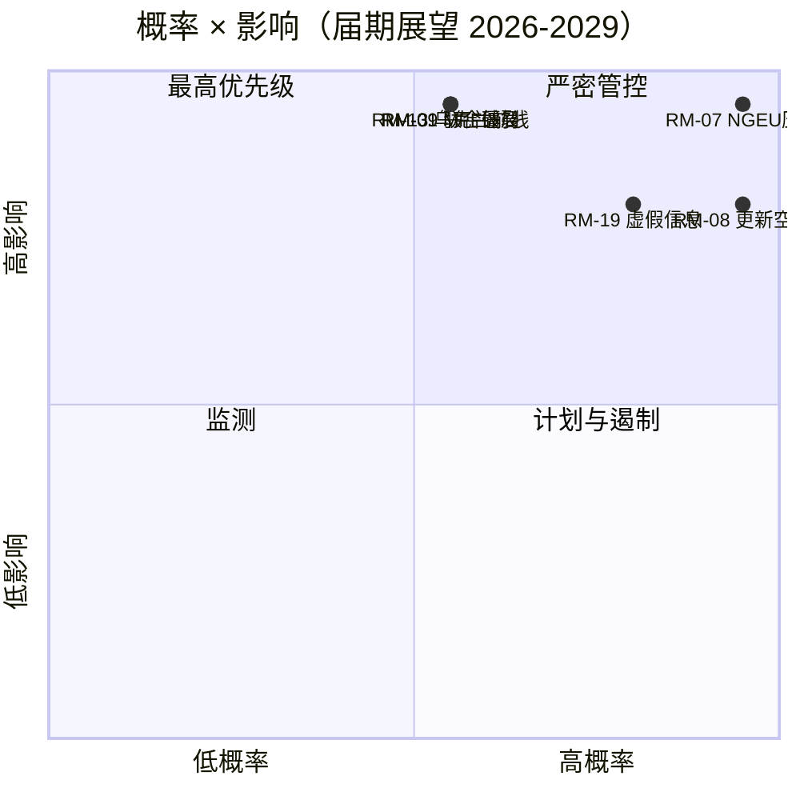

<!-- SPDX-FileCopyrightText: 2026 Hack23 AB -->
<!-- SPDX-License-Identifier: Apache-2.0 -->

# 执行情报简报 — EP10 第十届欧洲议会届期展望（至2029年）| 2026-05-11

**分类：** 开源情报 — 公开议会记录
**置信度：** 🟡 中等（3年交付窗口；预算悬崖驱动因素 A1，行为风险 A2/B3）
**执行目录：** `analysis/daily/2026-05-11/term-outlook/`
**时间跨度：** 2026-05-11 → 2029-06-06（完整届期37个月交付窗口）
**生成日期：** 2026-05-16（追溯摘要，无新增 MCP 调用）
**主要来源：** EP MCP `generate_political_landscape`、`analyze_coalition_dynamics`、`early_warning_system`、`monitor_legislative_pipeline`、`compare_political_groups`、`get_all_generated_stats`；IMF WEO（欧元区宏观外包络）；欧盟委员会2026年工作计划。

---

## 🎯 核心结论

**EP10 将在2029年选举前交付部分性的多数联合立法议程** — 届期战略框架是**结构性财政压力**，而非急性政治危机。议会党团构成（EPP 188 / S&D 136 / Renew 77 / Greens 53 / PfE 84 / ECR 78 / The Left 46 / ESN 25 / NI 30）将前两大党团议席占比定在 **44.5%** — 远低于376席多数门槛 — 因此**每次优先投票至少需要三个党团**，EPP+S&D+Renew "grand centre"（56.2%）维持标准联合格局。关键立法窗口为 **2027年第一季度至2028年第四季度** — 在此期间须完成 MFF 审查，**NGEU 偿还（2028年）启动**，委员会更新的过渡期尚未压缩产出。两大风险主导风险登记：**RM-07 NGEU 偿还预算压力（近乎确定，L5×I5=25）**和**RM-08 委员会更新过渡期（近乎确定，L5×I4=20）** — 两者均为嵌入式结构性事件，而非政策选择。2029年选举将**围绕 NGEU 偿还启动所带来的预算压力叙事展开角逐**；基准议席预测（"维持现状"，~50%）显示2029年 EPP-5 / S&D-5 / PfE+10 的变化量，中心联合在 EP11 届期以略薄的余地维持。

---

## 🧭 本简报支持的3项决策

| # | 决策 | 决策者 | 截止日期 | 依据 |
|:-:|----------|-------------|:--------:|----------|
| 1 | **将优先投票提前至2027年第三季度→第四季度**，以便在委员会更新过渡期（2029年第一至二季度）产出下降约40%之前完成 | 主席团会议；委员会主席 | 2027年全体会议日程 | RM-08（近乎确定×I4=20）；`intelligence/synthesis-summary.md` 发现#7 |
| 2 | **在2027年第四季度末前锁定 MFF 审查 + NGEU 偿还框架** — 最高评分的两项风险（RM-01 僵局 + RM-07 压力）若延误将产生碰撞 | BUDG、ECON、理事会、委员会副主席 | 2027年第四季度硬性截止日期 | RM-07（评分25）、RM-01（评分15）；`intelligence/economic-context.md`（IMF WEO 欧元区实际 GDP 0.9-1.2%（至2030年），政府净贷款 -2.8% 至 -3.4% → 无财政空间进行新增支出） |
| 3 | **针对约33-35%阻止性少数派制定联合应急计划** — 如 PfE+ECR+ESN（26.4%）在移民/气候回退议题上吸引 EPP 叛逃者 | EPP 党团纪律 + S&D + Renew 影子报告员 | 持续进行，12个月监测 | RM-09（五五开×I5=15）、RM-11（可能×I4=12）；发现#8 |

每项决策均与执行文件自身的风险行和关键发现挂钩；摘要不在该链条之外引入新判断。

---

## 📰 60秒摘要

- 🔴 **MULTI_COALITION_REQUIRED 是基准线：** 前两大党团（EPP+S&D）仅达到 **44.5%**；每次全体会议成功均需 ≥3 个党团（通常为 grand centre 56.2%）。
- 🟠 **两大结构性确定事项：** **NGEU 偿还启动2028年**（RM-07，L5×I5=25 — 唯一评分25的风险）；**委员会更新过渡期**使2029年第一至二季度立法产出减少约40%（RM-08，L5×I4=20）。
- 🟢 **流水线当前状态良好：** `monitor_legislative_pipeline` 与 EP9 基准线一致 — **尚无急性瓶颈**，但三方对话容量在2027-2028年趋紧（RM-12）。
- 🟡 **碎片化指数 6.59（高）**，据 `early_warning_system`；有效政党数量 ≈4.7；EPP 的 `DOMINANT_GROUP_RISK` 为 MEDIUM。
- 🔵 **宏观环境不宽裕：** IMF WEO 欧元区实际 GDP **0.9-1.2%（至2030年）**，通胀 1.6-2.2%，**政府净贷款 -2.8% 至 -3.4% GDP** — 无收入措施则无财政空间进行新增支出。
- 🟣 **右翼集聚上限：** PfE+ECR+ESN=**26.4%**（当前）；若在回退投票中结合 EPP 叛逃者，则构成 **约33-35%的阻止性少数派**，而非获胜多数 — 但足以击败雄心勃勃的中间派议题（RM-11）。
- 🩷 **2029年石蕊测试：** 选举结果取决于 MFF 审查 + 单一市场2.0 + AI法执行的成果；任一失败将使竞选转向 PfE/ECR 的预算叙事阵地。
- ⚪ **基准情景：** "维持现状" — 五五开（~50%）。2029年 EPP-5 / S&D-5 / PfE+10 变化量；联合方案维持但缓冲趋薄。

---

## 🏛️ 三支柱交付测试（决定届期是否成功）

来自执行的战略视角框架：为使中心多数派在2029年前捍卫其议程，**以下三项必须全部实现**。

1. **附有明确防务与气候包络的 MFF 审查** — 此处失败是最大单一政治风险（RM-01×RM-07 交叉点）。
2. **含可衡量生产力目标的单一市场2.0 一揽子方案** — 三方对话崩溃 RM-04 *不太可能*但高影响；执行将其识别为最可能发生的偶然性失败。
3. **所有成员国的 AI 法律执行取得可证明成果** — 不均衡执行 RM-03 *非常可能*；问题在于 DG-CNECT + 国家当局能否在2028年中期前产出3至5项引人注目的合规成果。

一个支柱失败，2029年竞选将在 PfE-ECR 财政纪律叙事上进行；两个支柱失败，EP11 将出现实质性重组。

---

## ⚠️ 风险快照（20项中前6名）

| ID | 风险 | 概率 | 影响 | 评分 | WEP 区间 | 运营含义 |
|:--:|------|:-:|:-:|:-----:|----------|---------------------|
| **RM-07** | NGEU 偿还预算压力 | 5 | 5 | **25** | 近乎确定 | 结构性 — 与2028年日历挂钩，非政策选择 |
| **RM-08** | 委员会更新过渡期 | 5 | 4 | **20** | 近乎确定 | 2029年第一至二季度产出 ≈ 比 EP9 基准低40% |
| **RM-19** | 2029年选举虚假信息 | 4 | 4 | **16** | 非常可能 | DSA 执法能力测试 |
| **RM-01** | 2027年第四季度后 MFF 审查僵局 | 3 | 5 | **15** | 五五开 | 决策1截止日期；向 RM-07 级联 |
| **RM-09** | 联合算术破裂（前两大党团 < 44%） | 3 | 5 | **15** | 五五开 | 对中心联合方案具有生存性影响 |
| **RM-13** | 俄乌前线升级 | 3 | 5 | **15** | 五五开 | 每次单一冲击使议程重组3至6个月 |

**评分25/20的风险（RM-07、RM-08）是与日历挂钩的确定性事件**，非政策选择 — 制约一切。**三项评分15的风险是政治性失败**，中心联合仍可避免。摘要将 RM-07+RM-01 交叉点视为届期最高杠杆点。

---

## 🔮 主要前瞻触发因素（12个月监测）

来自 `extended/forward-indicators.md`：

1. **2026年第四季度 — BUDG 的 MFF 谈判授权投票。** 若中心联合在2027年第一季度前无法就包含防务和气候包络的授权达成共识，RM-01 将从五五开升至可能，并迫使进行情景6（大联合重新封印）谈判。
2. **2027年第一季度→第三季度 — 主席团选举 + 轮值主席轮换。** 就 EPP 主席职位支持价格问题与选举周期执行（`analysis/daily/2026-05-11/election-cycle/`）交叉参照；结果形成决策1截止日期的架构。
3. **2027年第二季度 — AI 法律执法报告。** 2028年中期前 DG-CNECT + 国家当局的3至5项合规措施是第三支柱的证伪因素；其缺席使 RM-03 上升。
4. **2028年第一季度 — NGEU 偿还启动。** 这**不是预测性事件，而是预定的预算悬崖** — RM-07 从近乎确定（未来）转为活跃（当前）。必须在此时点前完成决策2的财政框架。
5. **2029年第一季度 — 选前全体会议区块。** 在更新过渡期产出下降前落地优先投票的最后机会；三方对话容量（RM-12）成为约束因素。

---

## 🌍 宏观与地缘政治外包络

- **IMF WEO (`intelligence/economic-context.md`)：** 欧元区实际 GDP **0.9-1.2%（至2030年）**；HICP 通胀 1.6-2.2%；政府净贷款 **-2.8% 至 -3.4% GDP**。无收入措施则无财政空间进行新增支出 — 这一宏观框架赋予 RM-07 评分25。
- **基准线以上的地缘政治冲击：** 俄乌前线（RM-13 评分15），中东动荡，印太摩擦，欧美关系破裂风险（RM-14 评分12）。执行立场：**每次单一冲击使立法议程重组3至6个月；**届期内累积暴露程度较高。
- **DSA 测试：** 2029年选举前虚假信息运动 RM-19（非常可能×I4=16）是欧洲议会自身在 EP9 届期构建的监管架构的运营压力测试。

---

## 🛡️ 信息来源质量评估

- **A1/A2 锚点：** 党团构成、碎片化程度、流水线产出、全体会议议程 — EP 开放数据门户，摘要的结构性基础。
- **`monitor_legislative_pipeline`** 在本次执行中*状态良好*（与 EP9 基准一致）— 与同期选举周期执行（同一调用返回0项程序，A6级）形成对比。两次执行共享同一日期但在不同时段运行；届期展望快照在运营上最有价值。
- **IMF WEO（B级）** 锚定宏观外包络；这是摘要中最重要的非EP输入，对 RM-07/RM-01 评分至关重要。
- **行为性判断（RM-09 联合破裂、RM-11 右翼集聚）** 依赖议席占比代理指标和2024-25年投票模式；EP API 尚未开放 MEP 级别的凝聚力数据，因此这里的置信度为中等。
- **综合置信度：** 结构性确定事项（RM-07、RM-08）高，政治风险（RM-01、RM-09、RM-11）中等，宏观外包络中等。

---

## 🧭 ACH — 届期的三种竞争性解读

`extended/historical-parallels.md` 和 `intelligence/scenario-forecast.md` 追踪对同一算术的三种竞争性解读：

- **H1 — "维持现状"**（五五开，~50%）：三个支柱全部实现，联合维持，2029年产出 EP10 减5%。执行的基准情景。
- **H2 — "局部失败/预算叙事丧失"**（可能，~30%）：一个支柱失败，2029年竞选转移至 PfE-ECR 阵地，中心联合更弱但算术上仍可运作。
- **H3 — "结构性断裂"**（不太可能，~10%）：条约危机/第七条升级/理事会僵局导致提前选举。长尾风险；37个月时间跨度要求追踪。

余下约10%分布于复合冲击情景。摘要将 H1 作为规划基准，同时保留 H2 作为**运营压力情景** — 决策3须填补的缺口正在于此。

---

## 📎 执行成果（决策前必读）

| 层级 | 成果 | 原因 |
|-------|----------|-----|
| 文章 | `article.md` | 完整届期展望叙事 |
| 综合 | `intelligence/synthesis-summary.md` | 主要判断 + 10项关键发现（权威性） |
| 联合 | `intelligence/coalition-dynamics.md` | grand centre / 委内瑞拉 / 阻止性少数派算术 |
| 风险登记 | `risk-scoring/risk-matrix.md` | RM-01→RM-20，概率×影响×评分与 WEP 区间 |
| 定量 SWOT | `risk-scoring/quantitative-swot.md` | 支柱与制约 |
| 流水线 | `intelligence/forward-projection.md`、`commission-wp-alignment.md` | 至2029年产出预测 |
| 宏观 | `intelligence/economic-context.md` | IMF WEO + NGEU 包络 |
| 届期弧线 | `intelligence/term-arc.md`、`presidency-trio-context.md`、`mandate-fulfilment-scorecard.md` | 委员会更新过渡期排序 |
| 议席预测 | `intelligence/seat-projection.md` | H1/H2 下2029年变化量 |
| 指标 | `extended/forward-indicators.md` | 12个月触发线议程 |
| 可靠性 | `intelligence/mcp-reliability-audit.md` | A1/A2/B3 锚点已记录 |
| 自我反思 | `intelligence/methodology-reflection.md` | 第10.5步收尾 |

**配套文件：** `analysis/daily/2026-05-11/election-cycle/executive-brief.md` 涵盖60个月选举叠加层；两份摘要设计为配套阅读。

---

**文档控制**
- **模板参考：** `analysis/templates/executive-brief.md`
- **成果路径：** `analysis/daily/2026-05-11/term-outlook/executive-brief.md`
- **分类：** 公开
- **追溯说明：** 摘要于2026-05-16基于已提交的执行成果撰写；**未进行新增 MCP 调用**。所有判断均重申、提炼并 ACH 交叉核验执行自身提交的内容；不引入新主张。
