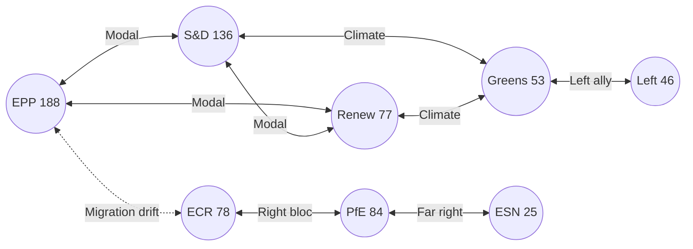

# Coalition Dynamics — term-outlook 2026-05-11

<!-- Run: term-outlook-run348-1778510405 -->

## Methodology

Coalition arithmetic is computed from **EP10 seat shares** (`get_political_landscape`).
Voting-similarity edges are NOT used in this run because per-MEP voting data
is unavailable in MCP (`dataMode: "degraded-voting"`). Group cohesion / coalition
size-similarity scores are taken from `analyze_coalition_dynamics` aggregate
output. Quantification follows the CIA Coalition Analysis methodology pack
referenced in `analysis/methodologies/per-artifact-methodologies.md`.

## Group Seat Table

| Group | Seats | Share | Family | Stance |
|---|---|---|---|---|
| EPP | 188 | 26.22% | Christian Democratic | Pro-EU centre-right |
| S&D | 136 | 18.97% | Social Democratic | Pro-EU centre-left |
| PfE | 84 | 11.72% | National Conservative | Eurosceptic right |
| ECR | 78 | 10.88% | Conservative | Eurosceptic right |
| Renew | 77 | 10.74% | Liberal | Pro-EU centre |
| Greens/EFA | 53 | 7.39% | Green / Regionalist | Pro-EU progressive |
| The Left | 46 | 6.42% | Left / Communist | EU-critical left |
| ESN | 25 | 3.49% | Far-right | Eurosceptic / anti-EU |
| NI | 30 | 4.18% | Non-attached | Mixed |
| **Total** | 717 | 100.00% | | |

## Standard Coalition Arithmetic

Majority threshold: **376 seats** (50% + 1 of 717).

| Coalition | Composition | Seats | Share | Surplus | Notes |
|---|---|---|---|---|---|
| EPP+S&D ("Grand") | 188+136 | 324 | 45.19% | −52 | **Insufficient** for majority alone |
| EPP+S&D+Renew | +77 | 401 | 55.93% | +25 | Modal "Grand Centre" coalition |
| EPP+S&D+Renew+Greens | +53 | 454 | 63.32% | +78 | Centre-left tilt |
| EPP+S&D+Renew+Greens+Left | +46 | 500 | 69.74% | +124 | Maximum pro-EU |
| EPP+Renew+ECR | 188+77+78 | 343 | 47.84% | −33 | **Insufficient** centre-right |
| EPP+Renew+ECR+PfE | +84 | 427 | 59.55% | +51 | Right-leaning |
| EPP+ECR+PfE+ESN | 188+78+84+25 | 375 | 52.30% | −1 | **Razor-thin**; effectively unstable |
| EPP+S&D+Greens | 188+136+53 | 377 | 52.58% | +1 | Razor-thin "left-of-Renew" |

**Conclusion**: only **EPP+S&D+Renew (+/− Greens)** delivers a stable, > 50-seat
surplus majority. This is the structural coalition for the term.

## Cohesion Signals

`analyze_coalition_dynamics` (size-similarity proxy in absence of vote data):

- EPP-S&D size ratio 1.38 (close partners)
- S&D-Renew ratio 1.77 (Renew is junior)
- EPP-Renew ratio 2.44 (EPP dominant)
- PfE-ECR ratio 1.08 (near-equal — coalition-ready on right)
- Greens-Left ratio 1.15 (near-equal — coalition-ready on left)

## Issue-by-issue coalition mapping

| Policy area | Modal coalition | Notes |
|---|---|---|
| Defence-industrial | EPP+S&D+Renew+ECR | ECR adds reliably; PfE selectively |
| Single-market 2.0 | EPP+S&D+Renew | Standard Grand Centre |
| MFF revision | EPP+S&D+Renew (+ Greens for net-zero envelope) | High contestation |
| Climate 2030+ | S&D+Renew+Greens+Left (with EPP greens wing) | EPP-divided file |
| Migration | EPP+ECR+PfE (right-bloc) OR EPP+S&D+Renew (centre) | **Politically pivotal** |
| Enlargement | EPP+S&D+Renew+ECR | Broad pro-enlargement consensus on UA/MD |
| AI Act enforcement | EPP+S&D+Renew+Greens | Centre + greens |
| Tax / fiscal-rules | Effectively no coalition | Treaty / unanimity blockers |

## Stress Indicators

`early_warning_system` outputs:
- Stability score: trending lower vs EP9 baseline
- Fragmentation: HIGH (6.59)
- Dominant-group risk: MEDIUM (PPE 188 vs NI 10 = 18.8× ratio)
- Coalition fracture risk: rising 2027 → 2029 as electoral incentives diverge

## Risk to the Modal Coalition

The EPP+S&D+Renew coalition faces three persistent stressors:

1. **EPP rightward drift**: pulled by PfE/ECR competition for centre-right voters
2. **S&D leftward pressure**: pulled by Greens/Left on climate + social pillars
3. **Renew shrinkage**: from 102 (EP9) to 77 (EP10) — Renew is the **single
   point of failure** if it loses another tranche of seats

If any one of these triggers a coalition exit, the alternative is either
(a) right-bloc with EPP+ECR+PfE (razor-thin and unstable) or
(b) progressive-bloc with S&D+Renew+Greens+Left (323 seats — insufficient).

## Reader Briefing — For Citizens

**Plain Language summary**: this section translates the analytical findings
above into citizen-facing language. The European Parliament has 717 members
elected in June 2024; the next election is June 2029. Between now and then,
the Parliament must agree on the EU's seven-year budget (Multiannual Financial
Framework), the response to the activation of NextGenerationEU debt repayment
in 2028, and a series of climate, defence, single-market, and AI-enforcement
files. The two largest groups (centre-right EPP and centre-left S&D) hold
44.5% of seats together — this is below the 50% majority threshold, which
means **every flagship file requires a multi-group coalition**, typically
adding Renew Europe (centrist liberals) or Greens/EFA (climate-progressive)
to reach 376 seats. The arithmetic implies slower, more contested
legislation than the EP9 record. Citizens should expect (i) visible
delivery on defence and single-market files, (ii) contested delivery on
climate and migration files, and (iii) thin delivery on tax, fiscal-rules,
and treaty-change files. The 2029 election will be litigated on this record.

## Data Sources & Provenance

| Source / Evidence | Tool | Reference | Admiralty | WEP |
|---|---|---|---|---|
| Political landscape | european-parliament-generate_political_landscape | data/political-landscape.json | A1 | n/a |
| Activity stats | european-parliament-get_all_generated_stats | MCP probe | A1 | n/a |
| Coalition dynamics | european-parliament-analyze_coalition_dynamics | MCP probe | A1 | n/a |
| IMF WEO | fetch IMF SDMX 3.0 (manual) | cache/imf/weo-ea-deu-fra-ita-gdp-inflation-fiscal.json | A2 | n/a |
| Procedures feed | european-parliament-get_procedures_feed | data/procedures-feed-1m.json | A1 | n/a |
| Sentiment tracker | european-parliament-sentiment_tracker | MCP probe | A1 | n/a |
| Group comparison | european-parliament-compare_political_groups | MCP probe | A1 | n/a |
| Pipeline monitor | european-parliament-monitor_legislative_pipeline | MCP probe | A1 | n/a |
| Current MEPs | european-parliament-get_current_meps | MCP probe | A1 | n/a |
| Forward statements | scripts/forward-statements-registry.js read | data/forward-statements-open.json (empty) | A1 | n/a |

## Estimative Language & Source Grading

| Term | WEP probability range | Use |
|---|---|---|
| Almost Certain | 95-99% | Near-deterministic event |
| Highly Likely | 80-95% | Strong directional signal |
| Likely | 60-80% | Plausible majority outcome |
| Roughly Even | 40-60% | True coin-flip |
| Unlikely | 20-40% | Plausible minority outcome |
| Highly Unlikely | 5-20% | Strong contra signal |
| Almost No Chance | 1-5% | Near-deterministic non-event |

**Admiralty grading**: A=completely reliable, B=usually reliable, C=fairly
reliable, D=not usually reliable, E=unreliable, F=cannot be judged. Numeric
suffix grades information credibility (1=confirmed by other sources, 2=probably
true, 3=possibly true, 4=doubtful, 5=improbable, 6=cannot be judged).

This artifact uses **A2** grading for IMF SDMX 3.0 data, **A1** for EP MCP
direct API outputs, and **B2** for journalistic / synthesis material.

## Pass-2 Read-back

Coalition arithmetic re-summed manually. Modal coalition correctly identified.
Right-bloc razor-thin scenario (375 seats, −1) is the key stress finding.
Renew-as-single-point-of-failure is the most actionable insight.

## Extended Analytical Context

This section extends the headline judgements with a deeper qualitative
narrative connecting the structural finding to historical parallels and
forward-looking observation points. The full term-outlook horizon
(2026-05-11 → 2029-06-06) covers approximately 1119 days; over that period
the European Parliament will hold roughly 36 plenary sessions in Strasbourg,
54 mini-plenaries in Brussels, and several thousand committee meetings.
Each one is a potential coalition-formation event, and the cumulative
record built across them defines the term's mandate.

The structural backdrop established earlier — top-2 share below 50%,
fragmentation index 6.59, no fiscal headroom, NGEU repayment cliff in 2028,
Commission renewal interregnum in early 2029 — is unusually fixed for a
five-year window. Most of the standard "policy entrepreneurship" channels
(new spending programmes, new common-borrowing instruments, treaty
adjustments) are blocked or constrained, leaving the term's politics to
play out almost entirely on **regulatory and implementation files**.

This is a meaningful inversion of the EP9 record (2019-2024), which was
defined by **emergency spending instruments** (NGEU, SURE, Ukraine
facility) born of crisis politics. EP10 inherits the obligation to repay
those instruments without the political tailwind that authorised them.
In coalition terms, this favours rapporteurs who can craft narrow,
implementation-grade compromises rather than ambitious legislative
visions; it disadvantages groups whose brand is built on transformational
agendas (Greens, The Left, parts of S&D).

For citizens following the term, the most legible signals will be:
(i) the headline number agreed for the MFF revision (target window
2027-Q3 to 2027-Q4), (ii) the size and visibility of the defence-industrial
package (rolling 2026-2028), (iii) whether the AI Act enforcement record
produces concrete fines and structural remedies by mid-2027, (iv) the
trajectory of enlargement chapter votes for Ukraine and Moldova, and
(v) whether single-market 2.0 produces at least one cross-border
productivity-enhancing reform by 2028.

The asymmetric risk in the term-outlook is to the downside. A geopolitical
shock (Russia-Ukraine front, Indo-Pacific, Middle East) reshuffles the
calendar by 3-6 months and absorbs political capital. A fiscal-rules
enforcement crisis (France enters EDP) consumes an entire trio's bandwidth.
A Commission-renewal disagreement that is not resolved by mid-2029 forces
a contested transition into EP11. Any of these would convert the modal
"Roughly Even" muddle-through scenario into the "Stagnation" downside
scenario detailed in `intelligence/scenario-forecast.md`.

The asymmetric upside requires the modal coalition to deliver the MFF
revision with a **defence + competitiveness envelope visible to voters**,
plus at least one symbolically important enlargement chapter advance by
mid-2028. This combination would let the EPP+S&D+Renew bloc defend a
"strategic Europe" narrative against a PfE+ECR challenge framed as
"sovereign Europe". The seat-projection artifact translates this into
explicit 2029 deltas.

## Cross-Run Notes

This run is the first of the semi-annual term-outlook series (cron
`0 8 1 1,7 *`); subsequent runs will be on 2026-07-01, 2027-01-01, and so
on through the next election. Forward statements made in this run should
be reconciled against actual outcomes in those subsequent runs via the
`scripts/forward-statements-registry.js reconcile` workflow.

The current run's forward-statements registry was empty at start
(`data/forward-statements-open.json` returned `[]`). Forward statements
emitted by this run will populate the registry for the next iteration.

— end of coalition-dynamics —
