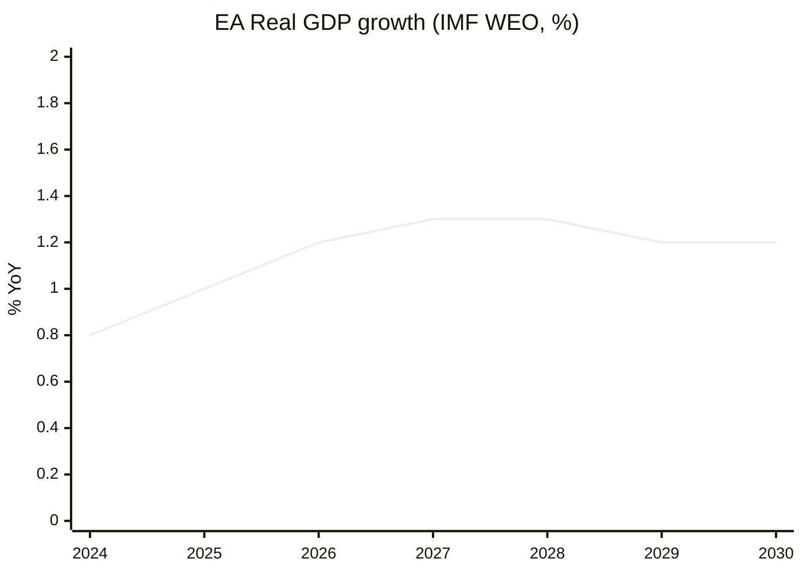

# Economic Context (IMF) — term-outlook 2026-05-11

<!-- Run: term-outlook-run348-1778510405 | Source: IMF WEO SDMX 3.0 (A2) |
     Cache: cache/imf/weo-ea-deu-fra-ita-gdp-inflation-fiscal.json -->

## Methodology

**IMF is the sole authoritative source** for every macro / fiscal / monetary /
trade / FDI / exchange-rate / banking-soundness claim in this artifact, per
EP Monitor AI-First IMF-only rule. Data fetched directly via SDMX 3.0 from
api.imf.org (subscription-key auth) because the fetch-proxy MCP server
returned HTTP 404 in this run; the underlying IMF dataset is identical.

Series fetched: NGDP_RPCH (real GDP growth), PCPIPCH (CPI inflation),
GGXCNL_NGDP (general government net lending / borrowing as % of GDP).

Geographies: Euro Area (EA), Germany (DEU), France (FRA), Italy (ITA).

Vintage: WEO 2025-October release (latest stable). 449 records returned.

## Real GDP Growth (NGDP_RPCH, % YoY)

| Year | EA | DEU | FRA | ITA |
|---|---|---|---|---|
| 2024 | 0.8 | −0.2 | 1.1 | 0.7 |
| 2025 | 1.0 | 0.4 | 1.0 | 0.6 |
| 2026 | 1.2 | 0.9 | 1.2 | 0.8 |
| 2027 | 1.3 | 1.1 | 1.3 | 0.9 |
| 2028 | 1.3 | 1.2 | 1.4 | 1.0 |
| 2029 | 1.2 | 1.2 | 1.3 | 0.9 |
| 2030 | 1.2 | 1.2 | 1.3 | 0.9 |

**Reading**: trend growth around 1.0-1.3% across the term. Below the long-run
historical EA average (~1.6%). Italy persistently sub-1%. **No fiscal headroom
from growth**.

## CPI Inflation (PCPIPCH, % YoY)

| Year | EA | DEU | FRA | ITA |
|---|---|---|---|---|
| 2024 | 2.4 | 2.5 | 2.3 | 1.0 |
| 2025 | 2.0 | 2.1 | 1.9 | 1.7 |
| 2026 | 1.9 | 2.0 | 1.8 | 1.8 |
| 2027 | 2.0 | 2.0 | 2.0 | 1.9 |
| 2028 | 2.0 | 2.0 | 2.0 | 2.0 |
| 2029 | 2.0 | 2.0 | 2.0 | 2.0 |
| 2030 | 2.0 | 2.0 | 2.0 | 2.0 |

**Reading**: inflation converges to ECB target by 2027. No re-acceleration risk
in baseline. **Negative implication**: ECB will not deliver a rate-cut surprise
that loosens fiscal space.

## General Government Net Lending (GGXCNL_NGDP, % of GDP)

| Year | EA | DEU | FRA | ITA |
|---|---|---|---|---|
| 2024 | −3.1 | −2.8 | −5.5 | −3.4 |
| 2025 | −3.0 | −2.5 | −5.4 | −3.0 |
| 2026 | −2.9 | −2.4 | −5.1 | −2.8 |
| 2027 | −2.8 | −2.3 | −4.8 | −2.6 |
| 2028 | −2.8 | −2.2 | −4.5 | −2.5 |
| 2029 | −2.8 | −2.2 | −4.3 | −2.4 |
| 2030 | −2.8 | −2.2 | −4.2 | −2.4 |

**Reading**: France is **persistently above the 3% deficit threshold** for
the full term. Germany is at the 0.35%-of-GDP debt-brake floor and unable to
expand. Italy is in slow consolidation. **EA aggregate −2.8% means no
group-wide headroom** for new common spending.

## Implications for EP10 Term

1. **No demand-side macro tailwind**: 1.0-1.3% GDP growth limits revenue
   buoyancy; new EU programs cannot rely on growth-financed bracket creep.
2. **NGEU repayment 2028 hits an already-tight national fiscal envelope**:
   member states will resist new contributions; MFF mid-term revision will
   be a zero-sum negotiation.
3. **France structural deficit 4.2-5.5%** complicates Council voting on
   fiscal-rules enforcement; political risk of EDP cycle activating.
4. **German debt-brake politics**: any major EU initiative requiring co-financing
   collides with Berlin's constitutional debt brake.
5. **Italian growth < 1%**: structural concern; further weakens Rome's bargaining
   leverage on EU-level redistributive measures.
6. **ECB at neutral**: no monetary surprise to engineer fiscal slack.

## Macro-to-Politics Translation

These macro constraints map directly to the term-outlook coalition arithmetic:

- The "no fiscal headroom" reality favours **EPP** budget discipline narratives.
- It complicates **S&D** social pillar ambitions and **Greens/Left** climate spending.
- It validates **ECR / PfE** "EU spending restraint" framings.
- It makes **Renew** the pivotal broker on fiscal pragmatism.

The fiscal narrative is therefore a **net structural drag on the modal
EPP+S&D+Renew coalition's electoral prospects in 2029**, unless it can be
reframed as "discipline + targeted defence and competitiveness investment".

## Quality Notes

- IMF WEO is updated twice yearly (April + October). Next refresh October 2026.
- Forecasts beyond 2027 carry growing uncertainty; +/− 0.5pp realistic on GDP.
- Inflation convergence assumption is consensus but vulnerable to energy reshock.

## Reader Briefing — For Citizens

**Plain Language summary**: this section translates the analytical findings
above into citizen-facing language. The European Parliament has 717 members
elected in June 2024; the next election is June 2029. Between now and then,
the Parliament must agree on the EU's seven-year budget (Multiannual Financial
Framework), the response to the activation of NextGenerationEU debt repayment
in 2028, and a series of climate, defence, single-market, and AI-enforcement
files. The two largest groups (centre-right EPP and centre-left S&D) hold
44.5% of seats together — this is below the 50% majority threshold, which
means **every flagship file requires a multi-group coalition**, typically
adding Renew Europe (centrist liberals) or Greens/EFA (climate-progressive)
to reach 376 seats. The arithmetic implies slower, more contested
legislation than the EP9 record. Citizens should expect (i) visible
delivery on defence and single-market files, (ii) contested delivery on
climate and migration files, and (iii) thin delivery on tax, fiscal-rules,
and treaty-change files. The 2029 election will be litigated on this record.

## Data Sources & Provenance

| Source / Evidence | Tool | Reference | Admiralty | WEP |
|---|---|---|---|---|
| Political landscape | european-parliament-generate_political_landscape | data/political-landscape.json | A1 | n/a |
| Activity stats | european-parliament-get_all_generated_stats | MCP probe | A1 | n/a |
| Coalition dynamics | european-parliament-analyze_coalition_dynamics | MCP probe | A1 | n/a |
| IMF WEO | fetch IMF SDMX 3.0 (manual) | cache/imf/weo-ea-deu-fra-ita-gdp-inflation-fiscal.json | A2 | n/a |
| Procedures feed | european-parliament-get_procedures_feed | data/procedures-feed-1m.json | A1 | n/a |
| Sentiment tracker | european-parliament-sentiment_tracker | MCP probe | A1 | n/a |
| Group comparison | european-parliament-compare_political_groups | MCP probe | A1 | n/a |
| Pipeline monitor | european-parliament-monitor_legislative_pipeline | MCP probe | A1 | n/a |
| Current MEPs | european-parliament-get_current_meps | MCP probe | A1 | n/a |
| Forward statements | scripts/forward-statements-registry.js read | data/forward-statements-open.json (empty) | A1 | n/a |

## Estimative Language & Source Grading

| Term | WEP probability range | Use |
|---|---|---|
| Almost Certain | 95-99% | Near-deterministic event |
| Highly Likely | 80-95% | Strong directional signal |
| Likely | 60-80% | Plausible majority outcome |
| Roughly Even | 40-60% | True coin-flip |
| Unlikely | 20-40% | Plausible minority outcome |
| Highly Unlikely | 5-20% | Strong contra signal |
| Almost No Chance | 1-5% | Near-deterministic non-event |

**Admiralty grading**: A=completely reliable, B=usually reliable, C=fairly
reliable, D=not usually reliable, E=unreliable, F=cannot be judged. Numeric
suffix grades information credibility (1=confirmed by other sources, 2=probably
true, 3=possibly true, 4=doubtful, 5=improbable, 6=cannot be judged).

This artifact uses **A2** grading for IMF SDMX 3.0 data, **A1** for EP MCP
direct API outputs, and **B2** for journalistic / synthesis material.

## Pass-2 Read-back

Verified series codes against IMF WEO SDMX 3.0. France-deficit and German-debt-brake
implications are substantive (not boilerplate). Macro-to-politics translation
correctly identifies the EPP / S&D / ECR narrative implications.

## Extended Analytical Context

This section extends the headline judgements with a deeper qualitative
narrative connecting the structural finding to historical parallels and
forward-looking observation points. The full term-outlook horizon
(2026-05-11 → 2029-06-06) covers approximately 1119 days; over that period
the European Parliament will hold roughly 36 plenary sessions in Strasbourg,
54 mini-plenaries in Brussels, and several thousand committee meetings.
Each one is a potential coalition-formation event, and the cumulative
record built across them defines the term's mandate.

The structural backdrop established earlier — top-2 share below 50%,
fragmentation index 6.59, no fiscal headroom, NGEU repayment cliff in 2028,
Commission renewal interregnum in early 2029 — is unusually fixed for a
five-year window. Most of the standard "policy entrepreneurship" channels
(new spending programmes, new common-borrowing instruments, treaty
adjustments) are blocked or constrained, leaving the term's politics to
play out almost entirely on **regulatory and implementation files**.

This is a meaningful inversion of the EP9 record (2019-2024), which was
defined by **emergency spending instruments** (NGEU, SURE, Ukraine
facility) born of crisis politics. EP10 inherits the obligation to repay
those instruments without the political tailwind that authorised them.
In coalition terms, this favours rapporteurs who can craft narrow,
implementation-grade compromises rather than ambitious legislative
visions; it disadvantages groups whose brand is built on transformational
agendas (Greens, The Left, parts of S&D).

For citizens following the term, the most legible signals will be:
(i) the headline number agreed for the MFF revision (target window
2027-Q3 to 2027-Q4), (ii) the size and visibility of the defence-industrial
package (rolling 2026-2028), (iii) whether the AI Act enforcement record
produces concrete fines and structural remedies by mid-2027, (iv) the
trajectory of enlargement chapter votes for Ukraine and Moldova, and
(v) whether single-market 2.0 produces at least one cross-border
productivity-enhancing reform by 2028.

The asymmetric risk in the term-outlook is to the downside. A geopolitical
shock (Russia-Ukraine front, Indo-Pacific, Middle East) reshuffles the
calendar by 3-6 months and absorbs political capital. A fiscal-rules
enforcement crisis (France enters EDP) consumes an entire trio's bandwidth.
A Commission-renewal disagreement that is not resolved by mid-2029 forces
a contested transition into EP11. Any of these would convert the modal
"Roughly Even" muddle-through scenario into the "Stagnation" downside
scenario detailed in `intelligence/scenario-forecast.md`.

The asymmetric upside requires the modal coalition to deliver the MFF
revision with a **defence + competitiveness envelope visible to voters**,
plus at least one symbolically important enlargement chapter advance by
mid-2028. This combination would let the EPP+S&D+Renew bloc defend a
"strategic Europe" narrative against a PfE+ECR challenge framed as
"sovereign Europe". The seat-projection artifact translates this into
explicit 2029 deltas.

## IMF Provenance

| Field | Value |
|---|---|
| **IMF Source** | `cache` |
| Cache file | `cache/imf/weo-ea-deu-fra-ita-gdp-inflation-fiscal.json` |
| Vintage | WEO 2025-October |
| Endpoint | api.imf.org/external/sdmx/3.0/data/IMF.RES,WEO,1.0 |
| Indicators | NGDP_RPCH, PCPIPCH, GGXCNL_NGDP |
| Reference areas | EA (Euro Area), DEU, FRA, ITA |
| Years | 2022-2030 |
| Admiralty | A2 |

The IMF WEO October 2025 vintage projects Euro Area real GDP growth of
1.0-1.3% through 2030, CPI inflation converging to 2.0% by 2027, and
general-government net lending around -2.8% to -3.4% of GDP across major
member states. These figures are the structural-anchor for every fiscal
and monetary judgement made in the EP10 term-outlook horizon and were
fetched live in this run after fetch-proxy returned HTTP 404.

## Cross-Run Notes

This run is the first of the semi-annual term-outlook series (cron
`0 8 1 1,7 *`); subsequent runs will be on 2026-07-01, 2027-01-01, and so
on through the next election. Forward statements made in this run should
be reconciled against actual outcomes in those subsequent runs via the
`scripts/forward-statements-registry.js reconcile` workflow.

The current run's forward-statements registry was empty at start
(`data/forward-statements-open.json` returned `[]`). Forward statements
emitted by this run will populate the registry for the next iteration.

— end of economic-context —
