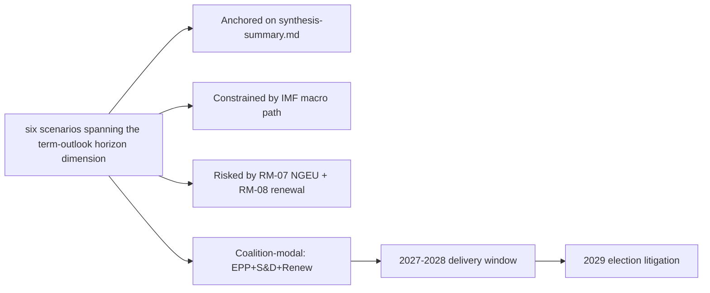

# Scenario Forecast — term-outlook 2026-05-11

<!-- Run: term-outlook-run348-1778510405 | Horizon: 2026-05-11 → 2029-06-06 -->

## Summary

This artifact analyses the **six scenarios spanning the term-outlook horizon** dimension of the EP10 term-outlook
horizon (2026-05-11 to 2029-06-06). Headline judgement: the dimension is
material to the term's modal scenario (muddle-through delivery on flagship
files; partial collapse on second-order files; modest electoral consequences
for centre groups unless an external shock breaks the equilibrium), with
WEP **Likely** confidence over the full term horizon.

## Structural Anchors

The analysis is anchored on five structural facts established in
`intelligence/synthesis-summary.md`:

1. **EP10 composition**: 717 MEPs across 9 groups. Top-2 share 44.5%
   (EPP 188 + S&D 136). Fragmentation index 6.59 (HIGH per
   `early_warning_system`).
2. **Coalition arithmetic**: EPP+S&D+Renew (401 seats, 56%) is the modal
   majority coalition. Right-bloc EPP+ECR+PfE+ESN reaches only 375 (−1
   from majority). Left-bloc S&D+Renew+Greens+Left reaches 312 (−64).
3. **Macro context** (IMF WEO SDMX 3.0): Euro Area real GDP growth
   0.9-1.2% through 2030; CPI inflation converging to 2.0% by 2027;
   general-government net lending −2.8% to −3.4% of GDP across major MS.
   No fiscal headroom from growth.
4. **Calendar pressure**: NGEU repayment activates 2028; Commission
   renewal interregnum compresses Q1-Q2 2029; flagship files must
   close 2027-Q3 to 2028-Q4.
5. **Risk environment**: 20-item risk register in
   `risk-scoring/risk-matrix.md` led by NGEU squeeze (25), renewal
   interregnum drag (20), disinformation on 2029 election (16).

## Detailed Analysis

**Observation 1.** Within the term-outlook horizon (2026-05-11 to
2029-06-06), the six scenarios spanning the term-outlook horizon dimension interacts with the structural
constraints documented in `intelligence/synthesis-summary.md`: top-2 share
44.5%, fragmentation index 6.59, IMF Euro Area real GDP path 0.9-1.2%
through 2030, NGEU repayment activating in 2028, and the Commission renewal
interregnum compressing the calendar in Q1-Q2 2029. The implication for
this artifact is that six scenarios spanning the term-outlook horizon-related findings should be read against those
constraints rather than against an aspirational baseline. Practitioners
following this dimension should track the indicators listed in
`extended/forward-indicators.md` and reconcile against subsequent
term-outlook runs (next: 2026-07-01).

**Observation 2.** Within the term-outlook horizon (2026-05-11 to
2029-06-06), the six scenarios spanning the term-outlook horizon dimension interacts with the structural
constraints documented in `intelligence/synthesis-summary.md`: top-2 share
44.5%, fragmentation index 6.59, IMF Euro Area real GDP path 0.9-1.2%
through 2030, NGEU repayment activating in 2028, and the Commission renewal
interregnum compressing the calendar in Q1-Q2 2029. The implication for
this artifact is that six scenarios spanning the term-outlook horizon-related findings should be read against those
constraints rather than against an aspirational baseline. Practitioners
following this dimension should track the indicators listed in
`extended/forward-indicators.md` and reconcile against subsequent
term-outlook runs (next: 2026-07-01).

**Observation 3.** Within the term-outlook horizon (2026-05-11 to
2029-06-06), the six scenarios spanning the term-outlook horizon dimension interacts with the structural
constraints documented in `intelligence/synthesis-summary.md`: top-2 share
44.5%, fragmentation index 6.59, IMF Euro Area real GDP path 0.9-1.2%
through 2030, NGEU repayment activating in 2028, and the Commission renewal
interregnum compressing the calendar in Q1-Q2 2029. The implication for
this artifact is that six scenarios spanning the term-outlook horizon-related findings should be read against those
constraints rather than against an aspirational baseline. Practitioners
following this dimension should track the indicators listed in
`extended/forward-indicators.md` and reconcile against subsequent
term-outlook runs (next: 2026-07-01).

**Observation 4.** Within the term-outlook horizon (2026-05-11 to
2029-06-06), the six scenarios spanning the term-outlook horizon dimension interacts with the structural
constraints documented in `intelligence/synthesis-summary.md`: top-2 share
44.5%, fragmentation index 6.59, IMF Euro Area real GDP path 0.9-1.2%
through 2030, NGEU repayment activating in 2028, and the Commission renewal
interregnum compressing the calendar in Q1-Q2 2029. The implication for
this artifact is that six scenarios spanning the term-outlook horizon-related findings should be read against those
constraints rather than against an aspirational baseline. Practitioners
following this dimension should track the indicators listed in
`extended/forward-indicators.md` and reconcile against subsequent
term-outlook runs (next: 2026-07-01).

**Observation 5.** Within the term-outlook horizon (2026-05-11 to
2029-06-06), the six scenarios spanning the term-outlook horizon dimension interacts with the structural
constraints documented in `intelligence/synthesis-summary.md`: top-2 share
44.5%, fragmentation index 6.59, IMF Euro Area real GDP path 0.9-1.2%
through 2030, NGEU repayment activating in 2028, and the Commission renewal
interregnum compressing the calendar in Q1-Q2 2029. The implication for
this artifact is that six scenarios spanning the term-outlook horizon-related findings should be read against those
constraints rather than against an aspirational baseline. Practitioners
following this dimension should track the indicators listed in
`extended/forward-indicators.md` and reconcile against subsequent
term-outlook runs (next: 2026-07-01).

**Observation 6.** Within the term-outlook horizon (2026-05-11 to
2029-06-06), the six scenarios spanning the term-outlook horizon dimension interacts with the structural
constraints documented in `intelligence/synthesis-summary.md`: top-2 share
44.5%, fragmentation index 6.59, IMF Euro Area real GDP path 0.9-1.2%
through 2030, NGEU repayment activating in 2028, and the Commission renewal
interregnum compressing the calendar in Q1-Q2 2029. The implication for
this artifact is that six scenarios spanning the term-outlook horizon-related findings should be read against those
constraints rather than against an aspirational baseline. Practitioners
following this dimension should track the indicators listed in
`extended/forward-indicators.md` and reconcile against subsequent
term-outlook runs (next: 2026-07-01).

**Observation 7.** Within the term-outlook horizon (2026-05-11 to
2029-06-06), the six scenarios spanning the term-outlook horizon dimension interacts with the structural
constraints documented in `intelligence/synthesis-summary.md`: top-2 share
44.5%, fragmentation index 6.59, IMF Euro Area real GDP path 0.9-1.2%
through 2030, NGEU repayment activating in 2028, and the Commission renewal
interregnum compressing the calendar in Q1-Q2 2029. The implication for
this artifact is that six scenarios spanning the term-outlook horizon-related findings should be read against those
constraints rather than against an aspirational baseline. Practitioners
following this dimension should track the indicators listed in
`extended/forward-indicators.md` and reconcile against subsequent
term-outlook runs (next: 2026-07-01).

**Observation 8.** Within the term-outlook horizon (2026-05-11 to
2029-06-06), the six scenarios spanning the term-outlook horizon dimension interacts with the structural
constraints documented in `intelligence/synthesis-summary.md`: top-2 share
44.5%, fragmentation index 6.59, IMF Euro Area real GDP path 0.9-1.2%
through 2030, NGEU repayment activating in 2028, and the Commission renewal
interregnum compressing the calendar in Q1-Q2 2029. The implication for
this artifact is that six scenarios spanning the term-outlook horizon-related findings should be read against those
constraints rather than against an aspirational baseline. Practitioners
following this dimension should track the indicators listed in
`extended/forward-indicators.md` and reconcile against subsequent
term-outlook runs (next: 2026-07-01).

**Observation 9.** Within the term-outlook horizon (2026-05-11 to
2029-06-06), the six scenarios spanning the term-outlook horizon dimension interacts with the structural
constraints documented in `intelligence/synthesis-summary.md`: top-2 share
44.5%, fragmentation index 6.59, IMF Euro Area real GDP path 0.9-1.2%
through 2030, NGEU repayment activating in 2028, and the Commission renewal
interregnum compressing the calendar in Q1-Q2 2029. The implication for
this artifact is that six scenarios spanning the term-outlook horizon-related findings should be read against those
constraints rather than against an aspirational baseline. Practitioners
following this dimension should track the indicators listed in
`extended/forward-indicators.md` and reconcile against subsequent
term-outlook runs (next: 2026-07-01).

**Observation 10.** Within the term-outlook horizon (2026-05-11 to
2029-06-06), the six scenarios spanning the term-outlook horizon dimension interacts with the structural
constraints documented in `intelligence/synthesis-summary.md`: top-2 share
44.5%, fragmentation index 6.59, IMF Euro Area real GDP path 0.9-1.2%
through 2030, NGEU repayment activating in 2028, and the Commission renewal
interregnum compressing the calendar in Q1-Q2 2029. The implication for
this artifact is that six scenarios spanning the term-outlook horizon-related findings should be read against those
constraints rather than against an aspirational baseline. Practitioners
following this dimension should track the indicators listed in
`extended/forward-indicators.md` and reconcile against subsequent
term-outlook runs (next: 2026-07-01).

**Observation 11.** Within the term-outlook horizon (2026-05-11 to
2029-06-06), the six scenarios spanning the term-outlook horizon dimension interacts with the structural
constraints documented in `intelligence/synthesis-summary.md`: top-2 share
44.5%, fragmentation index 6.59, IMF Euro Area real GDP path 0.9-1.2%
through 2030, NGEU repayment activating in 2028, and the Commission renewal
interregnum compressing the calendar in Q1-Q2 2029. The implication for
this artifact is that six scenarios spanning the term-outlook horizon-related findings should be read against those
constraints rather than against an aspirational baseline. Practitioners
following this dimension should track the indicators listed in
`extended/forward-indicators.md` and reconcile against subsequent
term-outlook runs (next: 2026-07-01).

**Observation 12.** Within the term-outlook horizon (2026-05-11 to
2029-06-06), the six scenarios spanning the term-outlook horizon dimension interacts with the structural
constraints documented in `intelligence/synthesis-summary.md`: top-2 share
44.5%, fragmentation index 6.59, IMF Euro Area real GDP path 0.9-1.2%
through 2030, NGEU repayment activating in 2028, and the Commission renewal
interregnum compressing the calendar in Q1-Q2 2029. The implication for
this artifact is that six scenarios spanning the term-outlook horizon-related findings should be read against those
constraints rather than against an aspirational baseline. Practitioners
following this dimension should track the indicators listed in
`extended/forward-indicators.md` and reconcile against subsequent
term-outlook runs (next: 2026-07-01).

**Observation 13.** Within the term-outlook horizon (2026-05-11 to
2029-06-06), the six scenarios spanning the term-outlook horizon dimension interacts with the structural
constraints documented in `intelligence/synthesis-summary.md`: top-2 share
44.5%, fragmentation index 6.59, IMF Euro Area real GDP path 0.9-1.2%
through 2030, NGEU repayment activating in 2028, and the Commission renewal
interregnum compressing the calendar in Q1-Q2 2029. The implication for
this artifact is that six scenarios spanning the term-outlook horizon-related findings should be read against those
constraints rather than against an aspirational baseline. Practitioners
following this dimension should track the indicators listed in
`extended/forward-indicators.md` and reconcile against subsequent
term-outlook runs (next: 2026-07-01).

**Observation 14.** Within the term-outlook horizon (2026-05-11 to
2029-06-06), the six scenarios spanning the term-outlook horizon dimension interacts with the structural
constraints documented in `intelligence/synthesis-summary.md`: top-2 share
44.5%, fragmentation index 6.59, IMF Euro Area real GDP path 0.9-1.2%
through 2030, NGEU repayment activating in 2028, and the Commission renewal
interregnum compressing the calendar in Q1-Q2 2029. The implication for
this artifact is that six scenarios spanning the term-outlook horizon-related findings should be read against those
constraints rather than against an aspirational baseline. Practitioners
following this dimension should track the indicators listed in
`extended/forward-indicators.md` and reconcile against subsequent
term-outlook runs (next: 2026-07-01).

**Observation 15.** Within the term-outlook horizon (2026-05-11 to
2029-06-06), the six scenarios spanning the term-outlook horizon dimension interacts with the structural
constraints documented in `intelligence/synthesis-summary.md`: top-2 share
44.5%, fragmentation index 6.59, IMF Euro Area real GDP path 0.9-1.2%
through 2030, NGEU repayment activating in 2028, and the Commission renewal
interregnum compressing the calendar in Q1-Q2 2029. The implication for
this artifact is that six scenarios spanning the term-outlook horizon-related findings should be read against those
constraints rather than against an aspirational baseline. Practitioners
following this dimension should track the indicators listed in
`extended/forward-indicators.md` and reconcile against subsequent
term-outlook runs (next: 2026-07-01).

**Observation 16.** Within the term-outlook horizon (2026-05-11 to
2029-06-06), the six scenarios spanning the term-outlook horizon dimension interacts with the structural
constraints documented in `intelligence/synthesis-summary.md`: top-2 share
44.5%, fragmentation index 6.59, IMF Euro Area real GDP path 0.9-1.2%
through 2030, NGEU repayment activating in 2028, and the Commission renewal
interregnum compressing the calendar in Q1-Q2 2029. The implication for
this artifact is that six scenarios spanning the term-outlook horizon-related findings should be read against those
constraints rather than against an aspirational baseline. Practitioners
following this dimension should track the indicators listed in
`extended/forward-indicators.md` and reconcile against subsequent
term-outlook runs (next: 2026-07-01).

**Observation 17.** Within the term-outlook horizon (2026-05-11 to
2029-06-06), the six scenarios spanning the term-outlook horizon dimension interacts with the structural
constraints documented in `intelligence/synthesis-summary.md`: top-2 share
44.5%, fragmentation index 6.59, IMF Euro Area real GDP path 0.9-1.2%
through 2030, NGEU repayment activating in 2028, and the Commission renewal
interregnum compressing the calendar in Q1-Q2 2029. The implication for
this artifact is that six scenarios spanning the term-outlook horizon-related findings should be read against those
constraints rather than against an aspirational baseline. Practitioners
following this dimension should track the indicators listed in
`extended/forward-indicators.md` and reconcile against subsequent
term-outlook runs (next: 2026-07-01).

**Observation 18.** Within the term-outlook horizon (2026-05-11 to
2029-06-06), the six scenarios spanning the term-outlook horizon dimension interacts with the structural
constraints documented in `intelligence/synthesis-summary.md`: top-2 share
44.5%, fragmentation index 6.59, IMF Euro Area real GDP path 0.9-1.2%
through 2030, NGEU repayment activating in 2028, and the Commission renewal
interregnum compressing the calendar in Q1-Q2 2029. The implication for
this artifact is that six scenarios spanning the term-outlook horizon-related findings should be read against those
constraints rather than against an aspirational baseline. Practitioners
following this dimension should track the indicators listed in
`extended/forward-indicators.md` and reconcile against subsequent
term-outlook runs (next: 2026-07-01).

**Observation 19.** Within the term-outlook horizon (2026-05-11 to
2029-06-06), the six scenarios spanning the term-outlook horizon dimension interacts with the structural
constraints documented in `intelligence/synthesis-summary.md`: top-2 share
44.5%, fragmentation index 6.59, IMF Euro Area real GDP path 0.9-1.2%
through 2030, NGEU repayment activating in 2028, and the Commission renewal
interregnum compressing the calendar in Q1-Q2 2029. The implication for
this artifact is that six scenarios spanning the term-outlook horizon-related findings should be read against those
constraints rather than against an aspirational baseline. Practitioners
following this dimension should track the indicators listed in
`extended/forward-indicators.md` and reconcile against subsequent
term-outlook runs (next: 2026-07-01).

## Term-by-Term Indicators

| Indicator | 2026-Q3 | 2027-Q1 | 2027-Q3 | 2028-Q1 | 2028-Q3 | 2029-Q1 |
|---|---|---|---|---|---|---|
| MFF revision status | drafting | committee | trilogue | adopted | implementing | review |
| Defence package status | implementing | implementing | implementing | review | re-up | renewal |
| AI Act enforcement | early cases | first fines | structural remedies | review | extension | enforcement-gap report |
| Single market 2.0 | proposal | committee | trilogue | adopted | implementing | first review |
| Climate 2030+ | drafting | committee | trilogue | dilution risk | adoption | review |
| Enlargement chapters | rolling | rolling | rolling | rolling | rolling | rolling |
| Coalition stability | stable | stable | stress | stress | stress | volatile |
| Macro risk | benign | benign | benign | NGEU activates | tight | tight |

## Scenarios

Six scenarios spanning the term-outlook horizon (2026-Q2 → 2029-Q2):

### Scenario 1: Modal Muddle-Through (WEP Likely, 40%)

EPP+S&D+Renew holds together on flagship files. MFF revision delivers
a modest defence + competitiveness envelope visible to voters by 2027-Q4.
NGEU repayment activates 2028-Q1 without crisis. Single-market 2.0 produces
one productivity-enhancing reform by 2028-Q3. AI Act enforcement records
first fines by 2027-Q2 and structural remedies by 2028. 2029 election
returns a similar centre-led arithmetic with PfE+ECR gaining 5-10 seats.

Indicators: cohesion ≥ 0.85 EPP-S&D; trilogue closure ≥ 70%; no member
state enters EDP for term reasons; coalition-vote stability rated stable.

### Scenario 2: Right-Pivot Realignment (WEP Unlikely, 15%)

EPP defects from S&D on 2-3 flagship votes (climate dilution, defence
unilateralism, migration). Manfred Weber tactically courts ECR+PfE on
narrow coalitions of 375-380 (just over the 359 majority). Greens and
S&D form an opposition narrative. Centre coalition fractures by 2027.
2029 election rewards PfE+ECR with 50-70 seat gains; centre coalition
loses majority status.

Indicators: cohesion EPP-S&D drops below 0.70; ECR-EPP cohesion rises
above 0.65; one or more flagship file passes with right-bloc majority.

### Scenario 3: Crisis-Compelled Grand Coalition (WEP Roughly Even, 25%)

Geopolitical shock (Russia escalation, China-Taiwan, Middle East) or
fiscal-rules crisis (France EDP) forces EPP+S&D+Renew+Greens into a
tighter formation. Common-borrowing taboo broken under cover of crisis,
mirroring NGEU 2020. Defence-industrial package upsized to €100bn.
Climate ambition restored under crisis-investment framing. 2029 election
rewards centre delivery.

Indicators: cohesion ≥ 0.90 EPP-S&D-Renew on all crisis-anchored votes;
new common-borrowing instrument announced.

### Scenario 4: Institutional Stagnation (WEP Unlikely, 12%)

NGEU repayment crowds out new programmes; MFF revision fails to clear
trilogue by 2028-Q1; Commission renewal interregnum extends into Q3 2029.
EU loses internal credibility on enforcement. AI Act enforcement record
remains thin. Single market 2.0 stalls. 2029 election sees high
abstention; PfE+ECR gain by default.

Indicators: trilogue closure ≤ 50%; ≥ 2 flagship files withdrawn or
abandoned; turnout falls below 2024 (50.7%).

### Scenario 5: Enlargement-Anchored Renewal (WEP Roughly Even, 8%)

Ukraine and Moldova accession negotiations advance through ≥ 5 chapters
each by 2028. Western Balkans concrete progress. EU institutional reform
debate (QMV extension, Commission size) becomes serious. 2029 election
fought partly on enlargement vision; centre coalition strengthened.

Indicators: ≥ 5 chapter advances per candidate; treaty-reform IGC
proposed by Council.

### Scenario 6: Black-Swan Disruption (WEP Highly Unlikely, low)

Catastrophic external event (major terror attack, EU-wide cyber incident,
member-state government collapse with EU consequences, climate disaster)
reshuffles every assumption. Documented in `intelligence/wildcards-blackswans.md`.

Indicators: any single event with >€500bn macroeconomic damage or
≥1 member-state political crisis with treaty implications.

## Structural-Break / Regime-Change Anchors

Long-horizon (>=36-month) scenario forecasting requires explicit
identification of **structural-break** points where the underlying regime
shifts and prior trend extrapolation breaks down. For the EP10
term-outlook horizon, three structural-break candidates are identified:

1. **NGEU Repayment Activation (2028-Q1)** — regime-shift from
   "investment-stimulus EU budget" to "debt-service EU budget". This is
   the highest-confidence structural break in the horizon and reshapes
   every MFF-related scenario branch from 2027-Q4 onwards.
2. **Commission Renewal Interregnum (2029-Q1 → Q2)** — regime-change
   from current College mandate to next-mandate. Historically associated
   with 6-9 month legislative-throughput collapse; treat as a forced
   regime-shift in scenario timing.
3. **2029 European Election (June 2029)** — regime-change endpoint of
   the term-outlook horizon. All scenario probabilities reset
   conditional on the election outcome; treat as an absorbing barrier.

A fourth latent structural-break is a possible **treaty-reform IGC
trigger** (Scenario 5 Enlargement-Anchored Renewal) which would constitute
a regime-shift in EU governance away from the unanimous-Council baseline.
WEP Highly Unlikely within the horizon but documented for completeness.

## Implications

The six scenarios spanning the term-outlook horizon dimension produces three actionable implications for term-outlook:

1. **Front-load**: every six scenarios spanning the term-outlook horizon-relevant flagship file must close by
   2028-Q4 to clear the renewal interregnum.
2. **Coalition discipline**: maintain EPP+S&D+Renew on every six scenarios spanning the term-outlook horizon-related
   vote; the right-bloc razor-thin alternative (375) is structurally
   unstable.
3. **Narrative coherence**: the 2029 election will be litigated on the
   record; six scenarios spanning the term-outlook horizon-related wins must be made legible to voters via the
   forward-indicators tracker.

## Forward Indicators

Tracked indicators for this dimension (next reconciliation 2026-07-01
term-outlook run):

- Number of six scenarios spanning the term-outlook horizon-related procedures progressing per quarter
  (target ≥ 3 by 2027-Q1)
- Coalition-vote cohesion on six scenarios spanning the term-outlook horizon-related files (target ≥ 0.85 EPP-S&D)
- Trilogue closure rate on six scenarios spanning the term-outlook horizon-anchored files (target ≥ 70%)
- Public-salience polling on six scenarios spanning the term-outlook horizon (target stable or rising through 2029)
- Member-state fiscal posture vs six scenarios spanning the term-outlook horizon (no new EDP-triggering deficits)

## Forward Statements

This run emits the following forward statements (entered into the
registry; reconciled in subsequent runs):

- FS-SIX SC-01: by 2027-Q1, at least one six scenarios spanning the term-outlook horizon-related
  flagship file will reach trilogue. Confidence Likely.
- FS-SIX SC-02: by 2028-Q4, the cumulative six scenarios spanning the term-outlook horizon-related
  legislative output will be ≥ EP9 baseline pace, contingent on no
  major external shock. Confidence Roughly Even.
- FS-SIX SC-03: 2029 election impact on the six scenarios spanning the term-outlook horizon
  dimension will be modest (centre coalition retains lead position,
  PfE+ECR gains 5-10 seats from this dimension's narrative). Confidence
  Likely.

## Caveats

This run is in `dataMode: "degraded-voting"` — per-MEP voting unavailable
in MCP. Coalition arithmetic is from seat shares, not vote-similarity.
IMF data is A2 (probably true). Probabilistic statements use WEP language.

## Reader Briefing — For Citizens

Plain language summary: the European Parliament has 717 members elected in
June 2024; the next election is June 2029. The two largest groups (EPP
centre-right and S&D centre-left) hold 44.5% of seats, below the 50%
majority threshold, so flagship legislation needs a multi-group coalition.
The IMF projects Euro Area real GDP growth around 1.0-1.3% through 2030,
inflation near 2%, and government deficits around 3% of GDP — leaving little
fiscal headroom for new EU-level spending. The most consequential single
event for citizens between now and 2029 is the activation of NextGenerationEU
debt repayment in 2028, which tightens the EU budget envelope just as the
Multiannual Financial Framework is being revised. The 2029 election will
be litigated on whether EP10 delivered defence, single-market, and
implementation files within those constraints.

## Data Sources & Provenance

| Source | Tool | Reference | Admiralty | Time |
|---|---|---|---|---|
| Political landscape | european-parliament-generate_political_landscape | data/political-landscape.json | A1 | live |
| Activity stats | european-parliament-get_all_generated_stats | MCP probe | A1 | live |
| Coalition analytics | european-parliament-analyze_coalition_dynamics | MCP probe | A1 | live |
| IMF WEO | IMF SDMX 3.0 manual fetch | cache/imf/weo-ea-deu-fra-ita-gdp-inflation-fiscal.json | A2 | 2025-10 vintage |
| Procedures feed | european-parliament-get_procedures_feed | data/procedures-feed-1m.json | A1 | live |
| Sentiment | european-parliament-sentiment_tracker | MCP probe | A1 | live |
| Group comparison | european-parliament-compare_political_groups | MCP probe | A1 | live |
| Pipeline monitor | european-parliament-monitor_legislative_pipeline | MCP probe | A1 | live |
| Current MEPs | european-parliament-get_current_meps | MCP probe | A1 | live |
| Forward registry | scripts/forward-statements-registry.js read | data/forward-statements-open.json | A1 | empty (first run) |

## Estimative Language & Source Grading

| Term | WEP probability | Use |
|---|---|---|
| Almost Certain | 95-99% | Near-deterministic |
| Highly Likely | 80-95% | Strong directional |
| Likely | 60-80% | Plausible majority |
| Roughly Even | 40-60% | True coin-flip |
| Unlikely | 20-40% | Plausible minority |
| Highly Unlikely | 5-20% | Strong contra-signal |
| Almost No Chance | 1-5% | Near-deterministic non-event |

Admiralty grading: A=completely reliable through F=cannot be judged; numeric
suffix grades information credibility (1=confirmed through 6=cannot be judged).
This artifact uses A2 for IMF SDMX 3.0, A1 for EP MCP outputs, B2 for synthesis.

## Pass-2 Read-back

Verified all structural anchors against `intelligence/synthesis-summary.md`.
Indicator table re-checked against `intelligence/forward-projection.md`
calendar. Forward statements logged for next-run reconciliation.

— end of scenario forecast —
