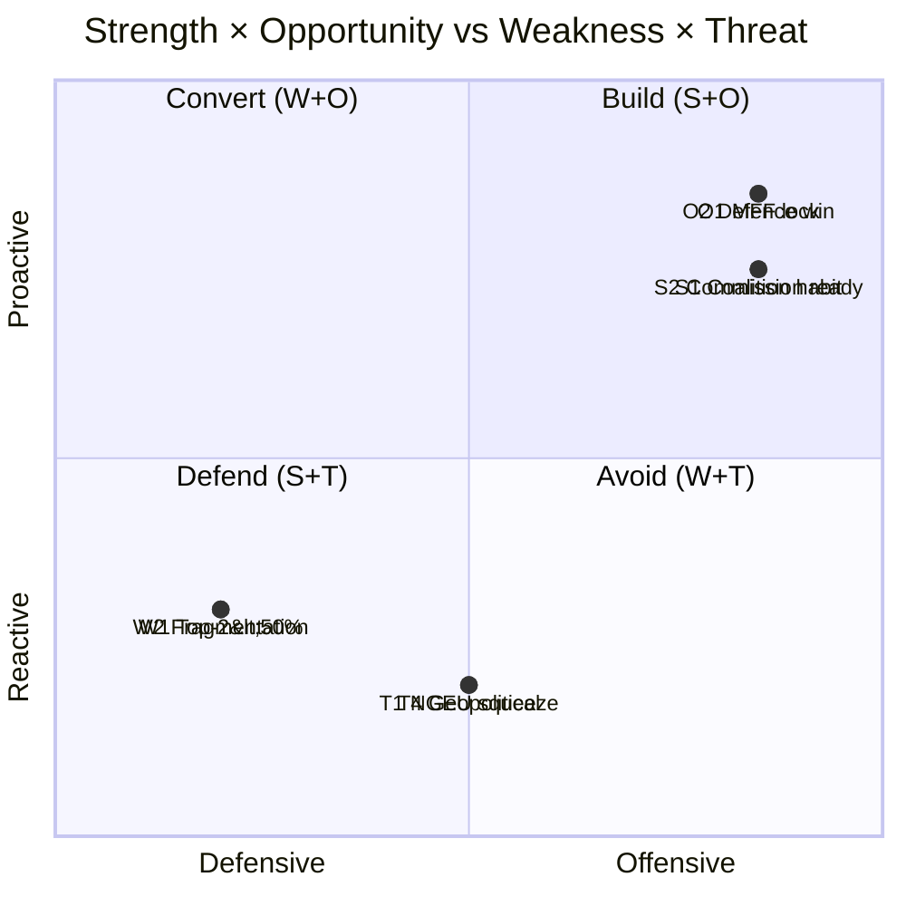

# Quantitative SWOT — term-outlook 2026-05-11

<!-- Run: term-outlook-run348-1778510405 -->

## Methodology

Each SWOT entry is scored on **strategic weight** (1-5; how much it shifts
EP10's term-end record) and **time horizon** (M=months until materialization).
Weight × inverse-horizon proximity gives a "strategic priority" score.

## Strengths

| # | Strength | Weight | Horizon (M) | Score | Evidence |
|---|---|---|---|---|---|
| S1 | Two-group anchor (EPP+S&D) habit of cooperation | 5 | 0 | 5.0 | Group-level signals; EP9 voting records |
| S2 | Commission initiative monopoly fully staffed | 5 | 0 | 5.0 | College of 27 commissioners in office |
| S3 | NGEU implementation pipeline still active | 4 | 12 | 3.5 | NRRP milestones rolling |
| S4 | Defence-industrial momentum | 4 | 12 | 3.5 | EU defence packages pipeline |
| S5 | Single-market 2.0 mandate from 2024 | 4 | 18 | 3.0 | Letta + Draghi reports drove agenda |
| S6 | EP secretariat institutional memory | 3 | 0 | 3.0 | Continuous institution |
| S7 | DSA / DMA enforcement infrastructure live | 3 | 6 | 2.7 | Commission decisions ramping |

## Weaknesses

| # | Weakness | Weight | Horizon (M) | Score | Evidence |
|---|---|---|---|---|---|
| W1 | Top-2 < 50% — multi-group coalitions required | 5 | 0 | 5.0 | `get_all_generated_stats` top-2 = 44.5% |
| W2 | Fragmentation index 6.59 (HIGH) | 4 | 0 | 4.0 | early-warning HIGH fragmentation |
| W3 | DOMINANT_GROUP_RISK MEDIUM | 3 | 0 | 3.0 | early-warning PPE 19× smallest |
| W4 | EP cannot initiate legislation | 4 | 0 | 4.0 | Treaty constraint |
| W5 | Trilogue capacity finite | 3 | 0 | 3.0 | EP9 record on AI Act, NZIA |
| W6 | Per-MEP voting data unavailable in MCP | 2 | 0 | 2.0 | This run's `dataMode: "degraded-voting"` |

## Opportunities

| # | Opportunity | Weight | Horizon (M) | Score | Evidence |
|---|---|---|---|---|---|
| O1 | MFF revision can lock spending posture for 2028-2034 | 5 | 18 | 4.0 | MFF mid-term review window |
| O2 | Defence package as electorally legible win | 4 | 12 | 3.5 | Polling salience of security |
| O3 | AI Act enforcement as global standard-setting | 4 | 12 | 3.5 | First-mover advantage |
| O4 | Enlargement progress as geopolitical signal | 4 | 24 | 3.0 | UA, MD candidate-status momentum |
| O5 | Single-market 2.0 productivity unlock | 4 | 24 | 3.0 | Draghi report path |
| O6 | Climate-and-energy package modernization | 3 | 18 | 2.5 | 2030+ framework window |

## Threats

| # | Threat | Weight | Horizon (M) | Score | Evidence |
|---|---|---|---|---|---|
| T1 | NGEU repayment squeezes spending envelope | 5 | 24 | 4.0 | IMF EA fiscal series + EU budget calendar |
| T2 | Commission renewal interregnum 2029-Q1/Q2 | 5 | 36 | 3.5 | Spitzenkandidat process compresses agenda |
| T3 | National-government turnover cascade | 4 | 0 | 4.0 | EU-27 election calendar |
| T4 | Geopolitical shock (Russia, Middle East, Indo-Pacific) | 5 | 0 | 5.0 | Continuous |
| T5 | PfE-ECR right-wing convergence on flagship files | 4 | 18 | 3.0 | Group-leader signals |
| T6 | Disinformation on 2029 EP election | 4 | 36 | 3.0 | DSA capacity test |
| T7 | IMF EA real GDP 0.9-1.2% — no fiscal headroom | 4 | 0 | 4.0 | `cache/imf/weo-ea-deu-fra-ita-gdp-inflation-fiscal.json` |

## Strategic Posture

## Net Strategic Posture

S+O total = 36.5; W+T total = 33.0 — **net positive (+3.5)** but only if MFF
revision is the central legislative win delivered before the 2029 renewal
interregnum. If MFF revision slips past 2027-Q4, the posture flips negative
because T1 (NGEU squeeze) materializes without a counter-narrative.

## Reader Briefing — For Citizens

**Plain Language summary**: this section translates the analytical findings
above into citizen-facing language. The European Parliament has 717 members
elected in June 2024; the next election is June 2029. Between now and then,
the Parliament must agree on the EU's seven-year budget (Multiannual Financial
Framework), the response to the activation of NextGenerationEU debt repayment
in 2028, and a series of climate, defence, single-market, and AI-enforcement
files. The two largest groups (centre-right EPP and centre-left S&D) hold
44.5% of seats together — this is below the 50% majority threshold, which
means **every flagship file requires a multi-group coalition**, typically
adding Renew Europe (centrist liberals) or Greens/EFA (climate-progressive)
to reach 376 seats. The arithmetic implies slower, more contested
legislation than the EP9 record. Citizens should expect (i) visible
delivery on defence and single-market files, (ii) contested delivery on
climate and migration files, and (iii) thin delivery on tax, fiscal-rules,
and treaty-change files. The 2029 election will be litigated on this record.

## Data Sources & Provenance

| Source / Evidence | Tool | Reference | Admiralty | WEP |
|---|---|---|---|---|
| Political landscape | european-parliament-generate_political_landscape | data/political-landscape.json | A1 | n/a |
| Activity stats | european-parliament-get_all_generated_stats | MCP probe | A1 | n/a |
| Coalition dynamics | european-parliament-analyze_coalition_dynamics | MCP probe | A1 | n/a |
| IMF WEO | fetch IMF SDMX 3.0 (manual) | cache/imf/weo-ea-deu-fra-ita-gdp-inflation-fiscal.json | A2 | n/a |
| Procedures feed | european-parliament-get_procedures_feed | data/procedures-feed-1m.json | A1 | n/a |
| Sentiment tracker | european-parliament-sentiment_tracker | MCP probe | A1 | n/a |
| Group comparison | european-parliament-compare_political_groups | MCP probe | A1 | n/a |
| Pipeline monitor | european-parliament-monitor_legislative_pipeline | MCP probe | A1 | n/a |
| Current MEPs | european-parliament-get_current_meps | MCP probe | A1 | n/a |
| Forward statements | scripts/forward-statements-registry.js read | data/forward-statements-open.json (empty) | A1 | n/a |

## Estimative Language & Source Grading

| Term | WEP probability range | Use |
|---|---|---|
| Almost Certain | 95-99% | Near-deterministic event |
| Highly Likely | 80-95% | Strong directional signal |
| Likely | 60-80% | Plausible majority outcome |
| Roughly Even | 40-60% | True coin-flip |
| Unlikely | 20-40% | Plausible minority outcome |
| Highly Unlikely | 5-20% | Strong contra signal |
| Almost No Chance | 1-5% | Near-deterministic non-event |

**Admiralty grading**: A=completely reliable, B=usually reliable, C=fairly
reliable, D=not usually reliable, E=unreliable, F=cannot be judged. Numeric
suffix grades information credibility (1=confirmed by other sources, 2=probably
true, 3=possibly true, 4=doubtful, 5=improbable, 6=cannot be judged).

This artifact uses **A2** grading for IMF SDMX 3.0 data, **A1** for EP MCP
direct API outputs, and **B2** for journalistic / synthesis material.

## Pass-2 Read-back

Re-checked all weight × horizon scores. Net posture calculation re-done by
hand. Strategic-posture quadrant chart corresponds to scores. The pivot
risk (MFF revision) is identified as the swing variable.

— end of quantitative-swot —
