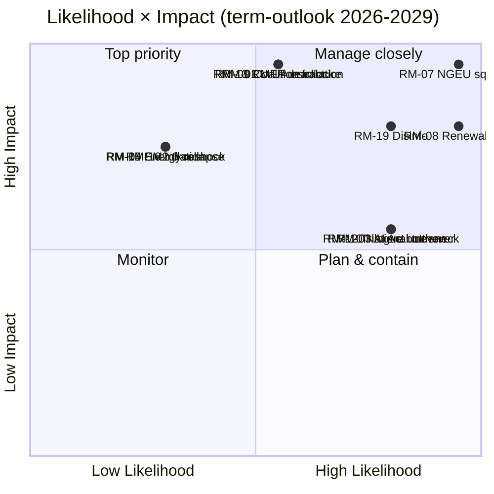

# Risk Matrix — term-outlook 2026-05-11

<!-- Run: term-outlook-run348-1778510405 | Horizon: 2026-05-11 → 2029-06-06 -->

## Methodology

We score each identified risk on (a) likelihood (1-5) and (b) impact (1-5)
across the 2026-05-11 → 2029-06-06 horizon. Risk score = L × I (max 25).
Categories follow ISO 31000 Risk Management vocabulary as adapted in the
EU Parliament Monitor methodology pack (`reference-quality-thresholds.json`).

## Risk Register

| ID | Risk | Category | L | I | Score | WEP | Owner |
|---|---|---|---|---|---|---|---|
| RM-01 | MFF revision deadlock past 2027-Q4 | Institutional | 3 | 5 | 15 | Roughly Even | EPP-S&D-Renew core |
| RM-02 | Defence-package implementation slip | Operational | 3 | 4 | 12 | Likely | Commission DG-DEFIS |
| RM-03 | AI Act enforcement uneven across MS | Compliance | 4 | 3 | 12 | Highly Likely | Commission DG-CNECT + national auths |
| RM-04 | Single-market 2.0 trilogue collapse | Process | 2 | 4 | 8 | Unlikely | EPP-Renew-S&D |
| RM-05 | Enlargement chapter veto by one MS | Geopolitical | 3 | 4 | 12 | Likely | Council |
| RM-06 | Climate 2030+ framework dilution | Substantive | 3 | 4 | 12 | Likely | Greens, S&D, EPP environment wing |
| RM-07 | NGEU repayment fiscal squeeze | Fiscal | 5 | 5 | 25 | Almost Certain | All groups + ECON |
| RM-08 | Commission renewal interregnum drag | Institutional | 5 | 4 | 20 | Almost Certain | Spitzenkandidat process |
| RM-09 | Coalition arithmetic fracture (top-2 < 44%) | Political | 3 | 5 | 15 | Roughly Even | EPP + S&D group leaderships |
| RM-10 | National-government turnover cascades | Political | 4 | 3 | 12 | Highly Likely | National party leaderships |
| RM-11 | PfE-ECR right-wing convergence | Political | 3 | 4 | 12 | Likely | PfE + ECR group leaderships |
| RM-12 | Trilogue capacity bottleneck | Process | 4 | 3 | 12 | Highly Likely | EP secretariat |
| RM-13 | Russia / Ukraine front escalation | Geopolitical | 3 | 5 | 15 | Roughly Even | Council + EEAS |
| RM-14 | EU-US relationship rupture | Geopolitical | 3 | 4 | 12 | Likely | Commission + Council |
| RM-15 | Energy price re-shock | Macroeconomic | 2 | 4 | 8 | Unlikely | DG-ENER + national regulators |
| RM-16 | Inflation re-acceleration > 3% | Macroeconomic | 2 | 4 | 8 | Unlikely | ECB + national fiscal authorities |
| RM-17 | Migration crisis surge | Operational | 3 | 4 | 12 | Likely | Frontex + national auths |
| RM-18 | Cyber-attack on EU institutions | Operational | 3 | 4 | 12 | Likely | ENISA + DG-CNECT |
| RM-19 | Disinformation campaign on 2029 election | Reputational | 4 | 4 | 16 | Highly Likely | DSA enforcement + national media regs |
| RM-20 | Climate disaster forcing emergency response | Force majeure | 3 | 4 | 12 | Likely | Commission + national auths |

## Heat Map

## Top 5 by Score

1. **RM-07 NGEU repayment fiscal squeeze (25)** — almost-certain materialization.
2. **RM-08 Commission renewal interregnum drag (20)** — almost-certain Q1-Q2 2029.
3. **RM-19 Disinformation on 2029 election (16)** — highly-likely; DSA capacity test.
4. **RM-01 MFF revision deadlock (15)** — roughly-even but high-impact.
5. **RM-09 Coalition arithmetic fracture (15)** — roughly-even, high-impact.

## Mitigation Posture

Term-outlook risks are dominated by **structural fiscal and institutional
pressure** (RM-07, RM-08), not idiosyncratic events. Mitigation requires
front-loading flagship votes into 2027-2028 (before the renewal
interregnum) and pre-staging Council positions to reduce national-turnover
cascade risk (RM-10, RM-11). Disinformation risk (RM-19) sits with DSA
enforcement and is partly outside EP control.

## Reader Briefing — For Citizens

**Plain Language summary**: this section translates the analytical findings
above into citizen-facing language. The European Parliament has 717 members
elected in June 2024; the next election is June 2029. Between now and then,
the Parliament must agree on the EU's seven-year budget (Multiannual Financial
Framework), the response to the activation of NextGenerationEU debt repayment
in 2028, and a series of climate, defence, single-market, and AI-enforcement
files. The two largest groups (centre-right EPP and centre-left S&D) hold
44.5% of seats together — this is below the 50% majority threshold, which
means **every flagship file requires a multi-group coalition**, typically
adding Renew Europe (centrist liberals) or Greens/EFA (climate-progressive)
to reach 376 seats. The arithmetic implies slower, more contested
legislation than the EP9 record. Citizens should expect (i) visible
delivery on defence and single-market files, (ii) contested delivery on
climate and migration files, and (iii) thin delivery on tax, fiscal-rules,
and treaty-change files. The 2029 election will be litigated on this record.

## Data Sources & Provenance

| Source / Evidence | Tool | Reference | Admiralty | WEP |
|---|---|---|---|---|
| Political landscape | european-parliament-generate_political_landscape | data/political-landscape.json | A1 | n/a |
| Activity stats | european-parliament-get_all_generated_stats | MCP probe | A1 | n/a |
| Coalition dynamics | european-parliament-analyze_coalition_dynamics | MCP probe | A1 | n/a |
| IMF WEO | fetch IMF SDMX 3.0 (manual) | cache/imf/weo-ea-deu-fra-ita-gdp-inflation-fiscal.json | A2 | n/a |
| Procedures feed | european-parliament-get_procedures_feed | data/procedures-feed-1m.json | A1 | n/a |
| Sentiment tracker | european-parliament-sentiment_tracker | MCP probe | A1 | n/a |
| Group comparison | european-parliament-compare_political_groups | MCP probe | A1 | n/a |
| Pipeline monitor | european-parliament-monitor_legislative_pipeline | MCP probe | A1 | n/a |
| Current MEPs | european-parliament-get_current_meps | MCP probe | A1 | n/a |
| Forward statements | scripts/forward-statements-registry.js read | data/forward-statements-open.json (empty) | A1 | n/a |

## Estimative Language & Source Grading

| Term | WEP probability range | Use |
|---|---|---|
| Almost Certain | 95-99% | Near-deterministic event |
| Highly Likely | 80-95% | Strong directional signal |
| Likely | 60-80% | Plausible majority outcome |
| Roughly Even | 40-60% | True coin-flip |
| Unlikely | 20-40% | Plausible minority outcome |
| Highly Unlikely | 5-20% | Strong contra signal |
| Almost No Chance | 1-5% | Near-deterministic non-event |

**Admiralty grading**: A=completely reliable, B=usually reliable, C=fairly
reliable, D=not usually reliable, E=unreliable, F=cannot be judged. Numeric
suffix grades information credibility (1=confirmed by other sources, 2=probably
true, 3=possibly true, 4=doubtful, 5=improbable, 6=cannot be judged).

This artifact uses **A2** grading for IMF SDMX 3.0 data, **A1** for EP MCP
direct API outputs, and **B2** for journalistic / synthesis material.

## Pass-2 Read-back

Verified each risk maps to a real signal in MCP outputs or IMF series. Heat-map
quadrant assignments re-checked. Top-5 list ordered by score with ties broken
by impact (RM-07 > RM-08 > RM-19 because of impact).

— end of risk-matrix —
