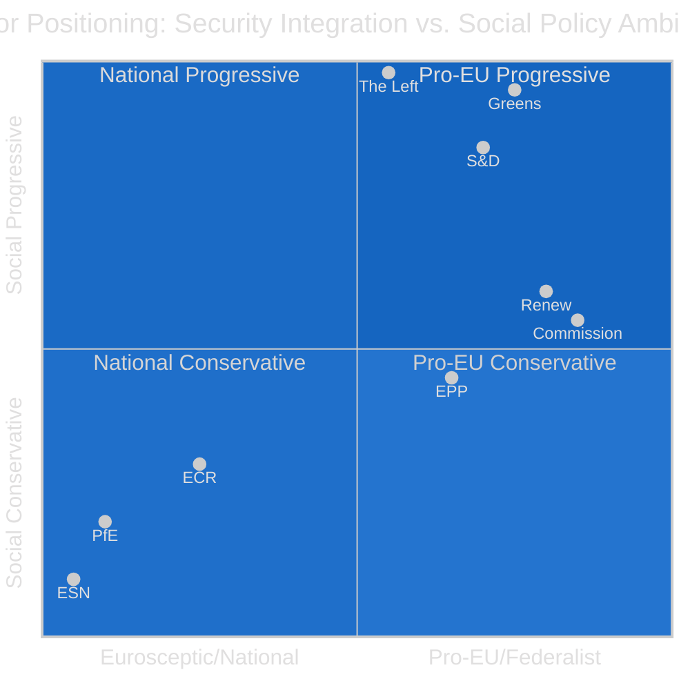

<!-- SPDX-FileCopyrightText: 2024-2026 Hack23 AB -->
<!-- SPDX-License-Identifier: Apache-2.0 -->

# Classification: Actor Mapping — EU Parliament 2026–2027

**Date:** 2026-05-11 | **Confidence:** 🟢 HIGH

---

## I. Primary Actors

### Group A — Governing Coalition (EPP+S&D+Renew, 396 seats)

| Actor | Role | Influence | Primary Interest |
|-------|------|-----------|-----------------|
| EPP (Manfred Weber) | Dominant — sets legislative agenda | 🔴 HIGHEST | European sovereignty; market economy; security |
| S&D (Iratxe García) | Social anchor; blocks far-right rollback | 🟡 HIGH | Workers' rights; housing; rule of law |
| Renew (Valérie Hayer) | Swing and accelerator; liberal-centrist | 🟡 HIGH | Digital economy; free trade; Ukraine |

### Group B — Significant Opposition/Swing

| Actor | Role | Influence | Primary Interest |
|-------|------|-----------|-----------------|
| ECR (Nicola Procaccini) | Conservative bloc; security coalescer | 🟡 MEDIUM-HIGH | National sovereignty; traditional values |
| PfE (Jordan Bardella) | Nationalist opposition; signalling bloc | 🟡 MEDIUM | Immigration restriction; EU federalism rollback |
| Greens/EFA (Terry Reintke) | Progressive pivot; environmental veto | 🟡 MEDIUM | Climate ambition; rule of law; digital rights |
| The Left (Martin Schirdewan) | Radical left; accountability voice | 🔴 LOW-MEDIUM | Workers; anti-war; social equality |

### Group C — Marginal

| Actor | Role | Influence |
|-------|------|-----------|
| ESN (27 seats) | Far-right fringe; excluded | 🔴 VERY LOW |
| Non-Inscrits (30 seats) | Mixed; unpredictable | 🔴 LOW |

---

## II. External Actors

| Actor | Interest | EP Leverage Over | EP Dependence On |
|-------|---------|-----------------|-----------------|
| European Commission | Legislative initiative; implementation | Accountability hearings; consent | Proposal monopoly |
| Council (Presidency) | Co-legislator; implementation | Co-decision veto; budget; consent | QMV for co-decision |
| Member State Governments | National implementation; Council positions | Annual Rule-of-Law; budget conditionality | Transposition |
| EU Big Tech (Google, Meta, X) | DMA/AI Act compliance | Enforcement resolutions | Legal framework |
| Agricultural Lobbies | Green Deal rollback; Mercosur opposition | Committee access; rapporteur influence | Subsidy structure |
| Civil Society (EEB, ETUC, NGOs) | Democratic accountability | Consultation; hearings; support | Mandate legitimacy |
| US Administration | Trade confrontation management | Trade resolutions; INTA positions | Transatlantic framework |
| Ukrainian Government | Support continuation; accountability | AFET resolutions; fund approvals | Political support |
| IMF/World Bank | Economic analysis; conditionality | ECON committee; budget discussions | Economic intelligence |

---

## III. Actor Positioning Matrix (Security vs. Social Policy Axis)

---

## IV. Alliance Mapping by Issue Area

### Defence/Security
**Core alliance:** EPP + S&D + Renew + ECR = 477 seats (strongly above majority)
**Excluded:** PfE, ESN, The Left (pacifist), Greens (budget concerns)
**Stability:** 🟢 HIGH — consensus on Ukraine/NATO even across ideological differences

### Climate/Environment
**Core alliance:** S&D + Greens + Renew + (conditional EPP) = ~320 seats (below majority without EPP)
**Swing:** EPP — if EPP supports, majority secured; if EPP abstains/blocks, alliance fails
**Stability:** 🟡 MEDIUM — depends on EPP internal politics on Green Deal

### Trade (Mercosur)
**Pro-consent:** EPP + ECR + PfE + Renew (partial) = ~370 seats
**Anti-consent:** S&D + Greens + Left + Renew (partial) = ~325 seats
**Stability:** 🔴 LOW — genuinely uncertain outcome

### Housing/Social Policy
**Pro-directive:** S&D + Greens + Left + Renew (partial) = ~320 seats (at majority threshold only with EPP)
**Against/Abstain:** EPP core + ECR + PfE = ~350 seats
**Stability:** 🔴 LOW — requires EPP endorsement which is currently not secured

---

*Actor mapping based on EP political configuration May 2026, group leader positions, and observed voting patterns in adopted texts January–April 2026.*
