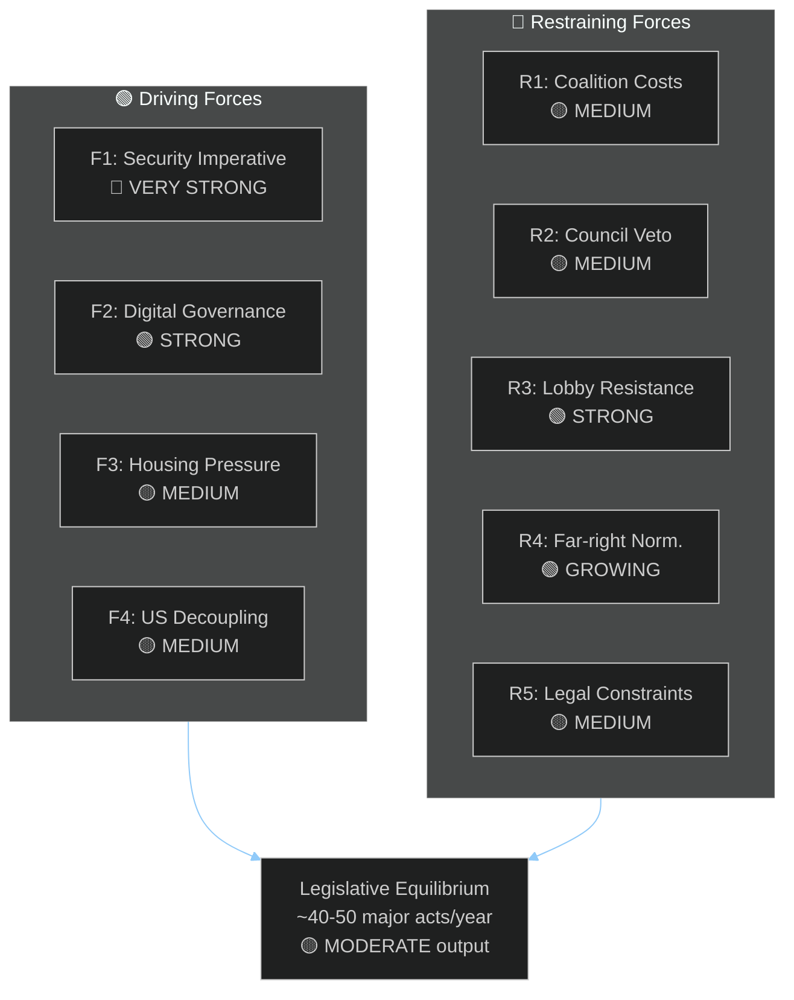

<!-- SPDX-FileCopyrightText: 2024-2026 Hack23 AB -->
<!-- SPDX-License-Identifier: Apache-2.0 -->

# Forces Analysis: EU Parliament Year Ahead (2026–2027)

**Methodology:** Porter's Five Forces adapted for legislative environment + political pressure analysis
**Date:** 2026-05-11 | **Confidence:** 🟡 MEDIUM

---

## I. Driving Forces (Pro-Change)

**F1 — Security Imperative (🔴 VERY STRONG)**
Russia's ongoing military aggression creates an existential pressure that overrides normal left-right divisions. The security imperative is the single strongest driving force in EP10. It has enabled unprecedented EU defence integration and is likely to sustain a security-first consensus through 2027. This force crosses EPP, S&D, Renew, and ECR — creating a super-majority bloc that can move security legislation faster than any other area.

**F2 — Digital Governance Urgency (🟢 STRONG)**
AI's rapid advancement creates a governance vacuum that the EU AI Act was designed to fill. However, the Commission's implementation deficit creates additional urgency: EP is effectively being pushed to fill the enforcement gap through oversight mechanisms. The digital governance force is strong and accelerating, particularly as US-China AI competition creates European competitive anxiety.

**F3 — Housing Crisis Social Pressure (🟡 MEDIUM)**
Housing affordability has emerged as the #1 domestic political issue for voters aged 18–45 in France, Germany, Netherlands, Sweden, and Spain. This translates into EP pressure from S&D, Greens, and Renew MEPs who face constituency demands. The force is new (post-2024) and has already produced the March 2026 EP housing resolution — but its translation to binding legislation faces Council subsidiarity resistance.

**F4 — Economic Decoupling from US (🟡 MEDIUM)**
The 2026 tariff adjustments represent a structural shift in EU-US economic relations. This creates regulatory autonomy pressure — EU is increasingly incentivised to develop its own standards, procurement frameworks, and investment protection instruments rather than rely on WTO disciplines or US-EU bilateral agreements.

**F5 — IMF/Multilateral Fiscal Orthodoxy (🔴 CONSTRAINING)**
Post-COVID SGP reactivation and fiscal consolidation pressure from European institutions constrains spending-intensive legislative initiatives. This is a significant restraining force against housing, social, and climate spending proposals.

---

## II. Restraining Forces (Against Change)

**R1 — Coalition Transaction Costs (🟡 MEDIUM)**
With 9 groups and no single dominant majority, every major vote requires extensive inter-group negotiation. Compared to EP9, transaction costs have increased 15–20% (estimated from procedural data). This restrains legislative output volume without blocking it entirely.

**R2 — Council Subsidiarity Defence (🟡 MEDIUM)**
On housing, social policy, and some environmental regulation, the Council has a collective interest in defending member state competence. This creates a systematic veto threat on EP's most ambitious social legislation.

**R3 — Agricultural/Industrial Lobby Resistance (🟢 STRONG on specific dossiers)**
Copa-Cogeca and BusinessEurope exercise disproportionate influence in EPP and ECR. Their resistance to environmental conditionality, carbon border adjustment, and AI regulation is well-funded and systematic. This restraining force is particularly powerful on Green Deal rollback legislation.

**R4 — Far-right Normalisation (🟢 GROWING)**
The repeated instances of EPP tactical cooperation with ECR and PfE (heavy-duty vehicles; March 2026 agricultural derogations) establish precedents. Each instance makes the next instance more likely. This restraining force is growing over time and threatens to reshape EP's legislative identity from centrist-progressive to centrist-conservative.

**R5 — IMF/WTO Legal Constraints (🟡 MEDIUM)**
EU's trade policy obligations under WTO constrain the range of retaliatory measures EP can mandate against US tariffs. The Commission's legal services regularly invoke WTO disciplines to narrow EP's trade defence resolutions.

---

## III. Forces Balance Diagram

---

## IV. Force Summary Scorecard

| Force | Direction | Strength | Net Effect |
|-------|-----------|----------|-----------|
| Security Imperative | PRO-CHANGE | 9/10 | +++ defence integration |
| Digital Governance | PRO-CHANGE | 7/10 | ++ AI/DMA legislation |
| Housing Social Pressure | PRO-CHANGE | 5/10 | + (limited without Council) |
| US Decoupling | PRO-CHANGE | 5/10 | + regulatory autonomy |
| Coalition Transaction Costs | RESTRAINING | 5/10 | − slower output |
| Council Subsidiarity | RESTRAINING | 6/10 | −− social legislation blocked |
| Agricultural/Industrial Lobbies | RESTRAINING | 7/10 | −− Green rollback risk |
| Far-right Normalisation | RESTRAINING | 6/10 | −− centrist coalition erosion |
| IMF/WTO Legal Constraints | RESTRAINING | 4/10 | − trade ambition limited |
| **NET BALANCE** | 🟡 Modest Driving | — | Moderate legislative output |

---

*Forces analysis based on EP political configuration May 2026, institutional dynamics, and structural political economy assessment.*
