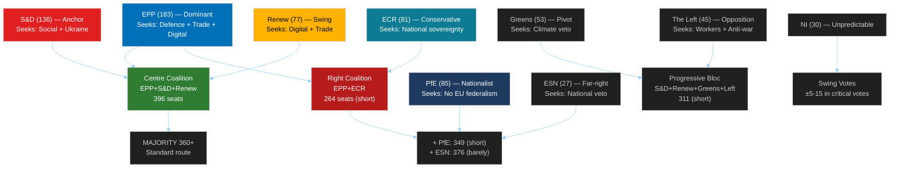

<!-- SPDX-FileCopyrightText: 2024-2026 Hack23 AB -->
<!-- SPDX-License-Identifier: Apache-2.0 -->

# Significance Classification: EU Parliament Year Ahead (2026–2027)

**Methodology:** EP10 Significance Scoring Framework
**Date:** 2026-05-11 | **Confidence:** 🟡 MEDIUM

---

## I. Classification Summary

| Classification | Value |
|----------------|-------|
| **Article Type** | Year Ahead — Forward Projection |
| **Significance Level** | TIER-1 STRATEGIC (Highest) |
| **Scope** | Pan-EU institutional; 9 political groups; 717 MEPs; 27 member states |
| **Legislative Impact** | MAJOR — multiple binding acts with multi-year MFF implications |
| **Political Urgency** | HIGH — US trade confrontation active; coalition fragmentation accelerating |
| **Confidence** | 🟡 MEDIUM — structural analysis high confidence; economic quantification low confidence (IMF unavailable) |

---

## II. Significance Scoring

### 2.1 Issue Clusters by Tier

**Tier 1 — Strategic (Immediate EP Agenda)**

| Issue | Significance Score | Justification |
|-------|-------------------|---------------|
| European Defence Industrial Strategy | 9.2/10 | First binding EU-level defence spending mechanism; historic precedent |
| US-EU Trade Confrontation Management | 9.0/10 | Active commercial conflict; largest EP trade dossier since TPP |
| AI Act Secondary Legislation | 8.5/10 | Global governance standard-setting; enforcement crisis emerging |
| 2027 Budget First Reading | 8.0/10 | Annual constitutional requirement; multi-year MFF structure affected |
| Mercosur Consent (conditional) | 7.5/10 | Largest EU trade agreement; constitutional procedure; food security |

**Tier 2 — High Impact**

| Issue | Significance Score | Justification |
|-------|-------------------|---------------|
| Housing Affordability Directive | 7.0/10 | Highest-salience domestic issue; binding directive would be historic |
| Rule of Law Monitoring (Georgia/Hungary) | 6.5/10 | EP's democratic credentials; enlargement implications |
| ECB/Banking Union Implementation | 6.5/10 | Financial stability; SRMR3 technical standards |
| Ukrainian Accountability Mechanisms | 6.0/10 | Ongoing conflict support; legal accountability framework |
| Workers' Rights/Subcontracting | 5.5/10 | Social policy evolution; platform economy |

**Tier 3 — Routine Significance**

| Issue | Significance Score | Justification |
|-------|-------------------|---------------|
| MEP Immunity Proceedings | 4.5/10 | Institutional housekeeping; individual cases |
| Agricultural policy adjustments | 5.0/10 | Ongoing farm lobby pressure; Green Deal rollback incremental |
| Welfare/animal policy (dogs/cats) | 3.5/10 | Consumer/welfare policy; low political salience |
| Convention/treaty accessions | 4.0/10 | Routine international legal framework maintenance |

---

## III. Actor Mapping Summary

---

## IV. Forces Analysis

### Driving Forces (Pro-Change)

**F1 — Security Imperative (🟢 STRONG):**
Russia's ongoing threat to European security creates a driving force for unprecedented EU-level defence integration. This force is strong enough to temporarily override normal coalition fragmentation — creating cross-group consensus on security spending that did not exist before 2022.

**F2 — Digital Governance Pressure (🟢 STRONG):**
US Big Tech dominance, AI competitive threats, and the DMA/AI Act implementation crisis create intense pressure for EP action on digital governance. This force drives both Renew (competitiveness) and S&D/Greens (rights protection) in the same direction — unusual convergence.

**F3 — Housing Crisis Salience (🟡 MEDIUM):**
Across EU member states, housing affordability ranks as the top domestic political issue for voters aged 18–45. EP cannot ignore this pressure without ceding political ground to national populist parties. This force is recent but accelerating.

**F4 — US Trade Confrontation Urgency (🔴 VOLATILE):**
The March 2026 tariff adjustment represents a departure from EU's traditional managed-trade posture. This creates volatile legislative demand as the trade confrontation escalates or de-escalates unpredictably.

### Restraining Forces (Against Change)

**R1 — Fiscal Consolidation Constraints (🔴 STRONG against new spending):**
SGP reactivation and national debt pressures (France, Italy) limit Council's ability to accept EP spending additions. This restraining force will cap EP's budget ambitions and any spending-intensive legislative initiatives.

**R2 — Coalition Transaction Costs (🟡 MEDIUM):**
Every major vote requires assembling 360+ votes from fragmented groups. The transaction cost (negotiation time, compromise quality) restrains legislative output volume.

**R3 — Renew Internal Divisions (🟡 MEDIUM):**
Renew's internal conflict between free-trade liberals and industrial policy interventionists creates systematic incoherence on economic legislation — slowing progress when Renew's swing vote is needed.

**R4 — Agricultural Lobby Resistance (🟢 STRONG on Green Deal rollback):**
Copa-Cogeca and national farm unions exercise disproportionate political influence in EPP and ECR. Their resistance to environmental conditionality on agricultural subsidies is a persistent restraining force on climate legislation.

---

## V. Impact Matrix

| Stakeholder | Short-term Impact (6 months) | Long-term Impact (12 months) | Net Assessment |
|-------------|------------------------------|------------------------------|----------------|
| EU Citizens | Moderate — routine legislative process | Significant — defence spending, housing, digital rights | 🟡 Mixed |
| EU Member States | Fiscal pressure (budget); defence obligation | Strategic autonomy gains; trade protection | 🟡 Mixed |
| Businesses (EU) | Regulatory uncertainty (AI, trade) | Strategic clarity post-legislation | 🟡 Mixed |
| US Companies | DMA/AI enforcement scrutiny | Potential market access restrictions | 🔴 Negative |
| Agricultural sector | Green rollback gains | Mercosur uncertainty on market access | 🟡 Mixed |
| Tech sector (EU) | AI regulation burden | Strategic autonomy opportunities | 🟡 Mixed |
| Ukraine | Continued support (high confidence) | Accountability mechanisms advancing | 🟢 Positive |
| Democratic NGOs | Rule of law monitoring | Limited enforcement capacity | 🟡 Mixed |

---

*Classification based on EP adopted texts profile January–April 2026, political landscape analysis May 2026, and institutional significance scoring framework.*
