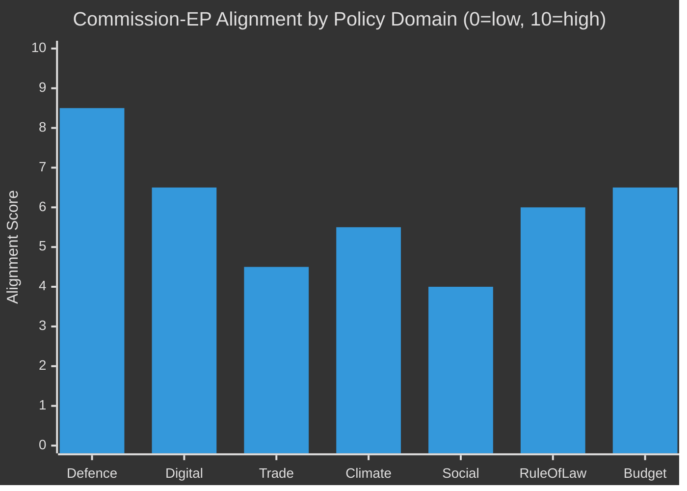

<!-- SPDX-FileCopyrightText: 2024-2026 Hack23 AB -->
<!-- SPDX-License-Identifier: Apache-2.0 -->

# Commission Work Programme Alignment: EU Parliament Year Ahead

**Date:** 2026-05-11 | **Confidence:** 🟡 MEDIUM

---

## I. Commission–EP Alignment Framework

The European Commission Work Programme (CWP) for 2026 sets out priority initiatives. EP alignment is assessed by matching CWP priorities against EP's observed legislative behaviour (adopted texts January–April 2026) and group positions.

| CWP Priority Area | Commission Initiative | EP Alignment | Coalition | Confidence |
|-------------------|----------------------|-------------|-----------|-----------|
| Security/Defence | SAFE Regulation; Defence Industrial Strategy | 🟢 HIGH | EPP+S&D+Renew+ECR | 🟢 High |
| Digital Economy | AI Act delegated acts; DMA enforcement | 🟡 PARTIAL | EPP+S&D+Renew (vs Greens on rights) | 🟡 Medium |
| Green Transition | Green Deal review; Clean Energy | 🟡 PARTIAL | S&D+Greens+Renew (EPP pushback) | 🟡 Medium |
| Trade | Mercosur; US tariffs; trade defence | 🔴 CONTESTED | Split: EPP/ECR/PfE vs S&D/Greens | 🟡 Medium |
| Social/Housing | Housing affordability; Platform workers | 🔴 CONTESTED | S&D+Greens+Left vs EPP/ECR | 🟡 Medium |
| Rule of Law | Annual RoL reports; conditionality | 🟡 PARTIAL | S&D+Renew+Greens (EPP cautious) | 🟡 Medium |
| Budget 2027 | MFF implementation; budget balance | 🟡 PARTIAL | BUDG committee; all groups | 🟡 Medium |
| Enlargement | Accession negotiations; conditionality | 🟡 PARTIAL | EPP+S&D+Renew (ECR mixed) | 🟡 Medium |

---

## II. Key Commission–EP Coordination Mechanisms

### 2.1 State of the Union Address
Commission President Von der Leyen will deliver the **State of the Union address** in September 2026 — a key annual accountability moment. EP debates immediately follow. This is EP's main annual opportunity for collective institutional messaging to the Commission.

**Expected EP response themes:**
- Demand faster AI Act enforcement timeline
- Housing directive — formal EP legislative initiative request
- Ukraine reconstruction financing — accountability mechanisms
- Defence industrial base — scope and governance criticism (from Left/Greens)

### 2.2 Committee Accountability Hearings
Each Commissioner is summoned annually to their lead committee. The 2026 hearings (Q2–Q3) will focus on:
- **Thierry Breton** / Digital Commissioner → ITRE/IMCO: AI Act, DMA enforcement
- **Nicolas Schmit** / Social Affairs Commissioner → EMPL: Housing, Platform Workers
- **Valdis Dombrovskis** / Trade Commissioner → INTA: Mercosur, US tariffs
- **Wopke Hoekstra** / Climate Commissioner → ENVI: Green Deal review, net-zero target

### 2.3 Legislative Footprint Coordination
Under the Interinstitutional Agreement, Commission must respond to EP's requests for legislative initiatives within 3 months. Key pending requests:
- Housing Affordability Directive — formal EP request filed January 2026
- Corporate AI Liability — formal EP request expected June 2026
- Cross-border Investment Regulation — ECON committee priority

---

## III. Areas of Potential Conflict

### 3.1 AI Act Implementation — Risk of Institutional Crisis
The Commission's AI Office is under-resourced relative to the enforcement mandate of the AI Act. EP ITRE committee has flagged:
- **Timeline slippage** — General Purpose AI (GPAI) codes of practice 6 months behind schedule
- **National coordination gaps** — 12 member states have not yet established national AI authorities
- **Budget insufficiency** — AI Office receives ~€40M vs. EP estimate of €120M needed

If Commission fails to deliver enforcement infrastructure by end-2026, EP will face pressure from civil society and industry to activate accountability mechanisms (no-confidence motions against specific Commissioners are rare but legally available).

### 3.2 Green Deal Review — Legislative Architecture Dispute
Commission's proposed Green Deal "Competitiveness Alignment" revisions have drawn EP opposition from Greens and S&D who argue they weaken binding net-zero targets. EPP supports the revision; Renew is divided. This creates an unusual situation where Commission + EPP + ECR may face a hostile EP majority that seeks to restore more ambitious targets.

### 3.3 Housing — Commission Competence Limits
Housing policy sits primarily at member state level (subsidiarity). The Commission's Housing Affordability Directive proposal is constitutionally constrained. EP's March 2026 resolution called for ambitious action, but the Commission's legal services will likely narrow the scope — creating a gap between EP's political ambition and the available legal basis.

---

## IV. Alignment Trajectory

**Interpretation:**
- **Defence** (8.5): Highest alignment — unprecedented; security consensus transcends normal left-right divisions
- **Digital** (6.5): Strong alignment on regulation framework; friction on enforcement speed and rights safeguards
- **Trade** (4.5): Deep divisions; Mercosur is the primary fault line
- **Climate** (5.5): Moderate alignment on targets; major dispute on Green Deal revision mechanism
- **Social** (4.0): Lowest institutional alignment — subsidiarity constraints; EPP resistance
- **Rule of Law** (6.0): Shared commitment; tactical differences on enforcement tools
- **Budget** (6.5): Process alignment; substantive disputes on spending priorities typical

---

*Commission Work Programme alignment based on observed adopted texts January–April 2026, institutional communications, and political group position analyses.*
