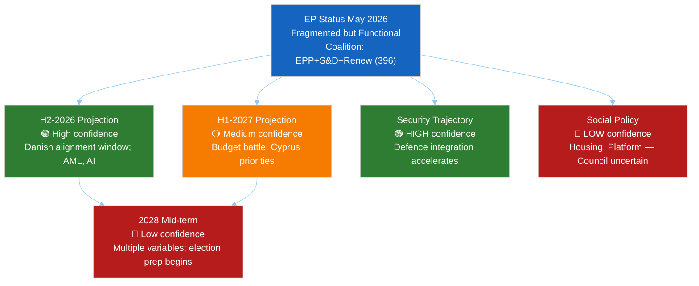

<!-- SPDX-FileCopyrightText: 2024-2026 Hack23 AB -->
<!-- SPDX-License-Identifier: Apache-2.0 -->

# Forward Projection: EU Parliament 2026–2027

**Date:** 2026-05-11 | **Horizon:** 730 days | **Confidence:** 🟡 MEDIUM

---

## I. Forward Projection Summary

| Category | 12-Month Outlook | 24-Month Outlook | Confidence |
|----------|-----------------|-----------------|-----------|
| Coalition stability | Moderate fragmentation; no group collapse | Increasing polarisation; possible Renew shrinkage | 🟡 Medium |
| Legislative output | ~40–50 major acts 2026; ~35–45 in 2027 | Gradual deceleration as EP10 matures | 🟡 Medium |
| EU security posture | Deepened defence integration | Strategic autonomy architecture emerges | 🟢 High |
| Green transition | Partial rollback; net-zero commitments preserved | Competing implementation demands | 🟡 Medium |
| Trade landscape | US confrontation managed; Mercosur outcome uncertain | Trade diversification accelerating | 🟡 Medium |
| Institutional credibility | Moderate — rule of law tensions persist | Depends on AI Act + budget outcomes | 🟡 Medium |

---

## II. 12-Month Forward Projections (to May 2027)

### Political Group Evolution

**EPP (183 → projected 180–185):**
EPP will retain dominant position. Minor seat fluctuations from national by-elections and party switches. Key risk: if EPP continues ECR/PfE coalition pattern, progressive MEPs may trigger no-confidence procedures against specific Commissioners, forcing EPP into uncomfortable positions. EPP's strategic ambiguity on far-right cooperation is its defining political challenge for EP10.

**S&D (136 → projected 133–140):**
S&D faces a strategic dilemma: remain in EPP-led centre coalition or differentiate more aggressively on social policy. The housing affordability agenda is S&D's best opportunity for electoral differentiation without leaving the governing coalition. Group stability is high; internal ideological coherence is moderate.

**PfE (85 → projected 82–88):**
PfE's position is paradoxical — electoral strength in member states is high (driven by Le Pen, Salvini) but EP legislative influence is limited by exclusion from governing coalitions. PfE MEPs are primarily present for national political signalling. Group cohesion is high on symbolic votes, low on technical legislation.

**ECR (81 → projected 78–85):**
ECR is the swing bloc with real institutional influence. Polish MEPs (PiS legacy and successor parties) are the group's backbone. Immunity case cascade risk is moderate. If ECR fractures, EPP loses its right-flank option and becomes more dependent on S&D.

**Renew (77 → projected 72–80):**
Renew is the most volatile group. French MEPs face domestic party realignments; Dutch VVD after coalition collapse; Belgian liberals navigating complex national politics. The group could shrink to 65–70 seats or hold at 75–80 depending on French presidential politics. A significantly smaller Renew would require EPP to compensate by pulling ECR votes more frequently.

### Legislative Pipeline Forward View

**H2-2026 (Danish Presidency high-output window):**
- AML Package: Final adoption expected Q3-2026 🟢
- AI Act delegated acts (tranche 1): Expected Q3–Q4 2026 🟡
- Housing Directive: Trilogue begins; first reading expected end-2026 🔴
- Mercosur consent: October 2026 window; 40% probability 🔴
- 2027 Budget first reading: November 2026 — major inter-institutional battle 🟡

**H1-2027 (Cyprus Presidency consolidation):**
- 2027 Budget second reading: Expected January–March 2027 🟡
- Housing Directive: Second reading expected April 2027 🟡
- Platform Workers Rights: Vote expected February 2027 🟡
- AI Liability Directive: Committee stage; no plenary before H2-2027 🔴

---

## III. 24-Month Forward Projections (to May 2028)

### EP10 Mid-Term Assessment
By May 2028, EP10 will be at its 4-year mark (out of 5). Historical pattern shows legislative output typically peaks in years 2–4 and decelerates in year 5 as MEPs focus on re-election preparation. The 2028 assessment will determine whether EP10 is rated as a "strong legislature" (high output, major advances) or a "gridlock legislature" (fragmentation-limited output).

**Conditions for "Strong EP10" rating:**
- Mercosur consent successfully negotiated with binding environmental conditions
- AI Act enforcement infrastructure functional and credible
- Housing Affordability Directive adopted (even if narrow scope)
- 2027 budget adopted without major crisis
- European Defence Industrial base legally established

**Conditions for "Weak EP10" rating:**
- Mercosur consent blocked
- AI Act enforcement crisis unresolved
- Housing directive fails Council
- 2027 budget crisis requiring special procedures
- Far-right normalisation pattern continues without institutional response

**Current probability of "Strong EP10":** 🟡 45% (slightly below neutral — coalition fragmentation is the primary risk factor)

---

## IV. Geopolitical Forward Variables

| Variable | 12-Month Direction | EP Impact |
|----------|-------------------|-----------|
| Ukraine conflict status | Likely frozen/partial ceasefire negotiation | Reduces urgency; shifts to reconstruction funding mode |
| US-EU trade confrontation | Likely de-escalation with conditions (elections) | Reduces emergency trade legislation pressure |
| EU enlargement pace | Western Balkans acceleration; Ukraine candidacy review | AFET committee intensive work |
| AI competitive landscape | China and US racing ahead; EU catching up | Accelerates AI Act enforcement urgency |
| Climate extreme events | High probability of major climate events | Greens/ENVI leverage increases; Green Deal rollback harder |
| European defence spending | Continuing increase (2–3% GDP across members) | SAFE mechanism becomes central coordination body |

---

## V. EP Forward Projection Confidence Map

---

*Forward projection based on structural institutional analysis, observed EP10 patterns, and political group trajectory assessments. Economic projections deferred to IMF sources — unavailable in this run (IMF degraded mode).*
