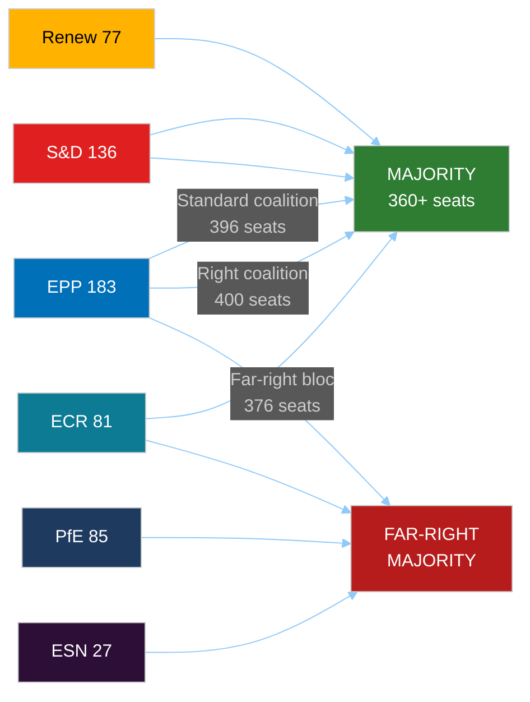

<!-- SPDX-FileCopyrightText: 2024-2026 Hack23 AB -->
<!-- SPDX-License-Identifier: Apache-2.0 -->

# Coalition Dynamics Analysis: EU Parliament Year Ahead (May 2026 – May 2027)

**Methodology:** Parliamentary Coalition Theory + CIA Coalition Analysis Framework
**Date:** 2026-05-11 | **Confidence:** 🟡 MEDIUM

---

## I. Structural Coalition Landscape

### 1.1 Current Parliament Architecture

| Group | Seats | Share | Bloc |
|-------|-------|-------|------|
| EPP | 183 | 25.52% | Centre-right |
| S&D | 136 | 18.97% | Centre-left |
| PfE | 85 | 11.85% | Far-right |
| ECR | 81 | 11.30% | Conservative-nationalist |
| Renew | 77 | 10.74% | Liberal-centrist |
| Greens/EFA | 53 | 7.39% | Green-progressive |
| The Left | 45 | 6.28% | Left |
| NI | 30 | 4.18% | Non-inscrits |
| ESN | 27 | 3.77% | Far-right |
| **TOTAL** | **717** | **100%** | **Majority: 360** |

### 1.2 Coalition Arithmetic — All Viable Combinations

**Two-group combinations (none viable):**
- EPP+S&D: 319 — SHORT by 41 ❌
- EPP+ECR: 264 — SHORT ❌
- EPP+PfE: 268 — SHORT ❌
- EPP+Renew: 260 — SHORT ❌

**Three-group combinations (viable):**
- EPP+S&D+Renew: **396** ✅ (+36) — "Centrist Supermajority"
- EPP+S&D+ECR: **400** ✅ (+40) — "Centre-Right Grand Coalition"
- EPP+ECR+PfE: 349 — SHORT by 11 ❌
- EPP+S&D+PfE: 404 ✅ (+44) — "Improbable Grand" (S&D+PfE ideologically incompatible)
- EPP+ECR+Renew: 341 — SHORT ❌
- EPP+Renew+Greens: 313 — SHORT ❌

**Four-group combinations (far-right option):**
- EPP+ECR+PfE+ESN: **376** ✅ (+16) — "Far-Right Bloc" (politically very costly for EPP)
- EPP+ECR+PfE+NI: 379 ✅ — Similar to above
- EPP+S&D+Renew+Greens: 449 ✅ — "Maximum Progressive" (EPP rarely joins)

---

## II. Governing Coalition Analysis

### 2.1 The Standard Governing Coalition: EPP+S&D+Renew (396 seats)

**Cohesion factors (🟢 High for core issues):**
- Ukraine solidarity and accountability
- Budget framework (centre-left investment + EPP fiscal prudence compromise)
- Digital internal market (with Renew leading)
- International trade (managed liberalisation)

**Fracture points (🔴 High fracture risk):**
- Immigration policy (S&D vs. ECR-aligned EPP hardliners)
- Agricultural exemptions from climate rules (EPP vs. Greens/EFA pressure)
- AI deregulation (Renew libertarians vs. S&D precautionary wing)
- Housing directive scope (Renew fiscal liberals vs. S&D interventionists)

**Year-ahead durability assessment:** 🟡 MEDIUM — Coalition will hold on budget and security but face multiple knife-edge votes on digital, trade, and environment.

### 2.2 The Occasional Right Coalition: EPP+S&D+ECR (400 seats)

**When it forms:**
- Immigration legislation with enforcement emphasis
- Anti-corruption legislation (March 2026 — the combating corruption resolution TA-10-2026-0094 likely passed with this coalition)
- Rule of law conditionality with member state compliance emphasis
- National security exceptions to digital/AI rules

**Durability:** 🟡 MEDIUM — ECR brings internal contradictions (Polish PiS under judicial pressure vs. Italian FdI wanting constructive governance role)

### 2.3 Far-Right Tactical Coalition: EPP+ECR+PfE (349) + ESN (376)

**When it forms:**
- Agricultural exemptions from Green Deal
- Emissions rollback (demonstrated: heavy-duty vehicle modification, March 2026)
- Migration externalisation mechanisms
- National champions protection in industrial policy

**Year-ahead risk assessment:** 🔴 HIGH RISK OF ACTIVATION — The March 2026 heavy-duty vehicle vote demonstrated that this coalition can be assembled for narrow issue-specific victories. If EPP calculates domestic political benefit from green rollback, this coalition will form 3–5 more times in the next twelve months.

**Consequences:** Each time this coalition forms, it signals to EU citizens that the EPP is willing to partner with far-right for policy wins. Cumulative erosion of EPP's democratic credibility is the long-term cost.

---

## III. Pivotal Vote Analysis — Upcoming Major Decisions

### 3.1 European Defence Fund Framework (Q3–Q4 2026)

**Expected coalition:** EPP+S&D+ECR (400) or EPP+S&D+Renew (396)
- S&D condition: EU-level procurement mechanism (not just bilateral grants)
- ECR condition: Member states retain national procurement preference
- EPP bridge: Mixed mechanism — EU framework + MS flexibility
- Renew: Supportive if defence industry competition rules maintained

**Outcome probability:** 🟢 75% passage under centrist supermajority with EPP+ECR tactical amendments

### 3.2 Mercosur Consent Vote (Q1 2027, conditional on CJEU)

**Expected coalition challenge:** EPP+S&D+Renew majority MINUS dissidents
- AGAINST: Greens/EFA (53) + The Left (45) + anti-Mercosur EPP members (~15–25) + ECR agriculture wing
- FOR: EPP majority + S&D majority + Renew + PfE (ambiguous)

**Mathematical challenge:**
If EPP loses 20 members, S&D loses 15, Renew loses 10 = standard coalition minus 45 = 351 (barely majority)
If Greens/EFA + Left + dissidents = 98 + 25 dissidents = 123 against
EPP+S&D+Renew baseline 396 minus 45 dissidents = 351 (majority barely holds)

**Outcome probability:** 🟡 45% narrow majority adoption (very sensitive to agricultural conditions and CJEU opinion framing)

### 3.3 AI Act High-Risk AI Systems Secondary Legislation

**Expected coalition:** EPP+S&D+Greens/EFA (272) PLUS either Renew (77) or ECR (81)
- Renew involvement: Likely if implementation flexibility preserved
- Greens/EFA support: Conditional on maximum precaution for biometric surveillance

**Outcome:** 🟢 70% — centrist coalition on digital governance is relatively stable; AI regulation enjoys broad societal support

### 3.4 2027 Budget First Reading

**Expected coalition:** EPP+S&D+Renew (standard) but with intense inter-group horse-trading
- EP will seek to add €5–10B above Commission proposal (consistent with EP10 budget practice)
- Council will resist; Commission will play mediator
- Result: Second reading concessions from Council, eventual agreement

**Outcome:** 🟢 85% — budget adoption is constitutionally required; the question is margin of victory and final quantum

---

## IV. Coalition Stability Indicators (Monitoring Dashboard)

---

## V. Group Stress Indicators (Structural Assessment)

| Group | Fragmentation Risk | External Pressure | Estimated Cohesion |
|-------|-------------------|------------------|-------------------|
| EPP | 🟡 Medium (East/West split) | National election cycles | 🟢 High on core agenda |
| S&D | 🟡 Medium (North/South fiscal) | Labour movement expectations | 🟢 High on social policy |
| PfE | 🟡 Medium (Orbán vs. others) | EU sanctions/rule of law | 🟡 Medium |
| ECR | 🔴 High (Poland immunity crisis) | National judicial pressure | 🟡 Medium |
| Renew | 🔴 High (Macron weakness) | French domestic collapse | 🟡 Medium |
| Greens/EFA | 🟡 Medium (electoral decline pressure) | Climate rollback anger | 🟢 High on environment |
| The Left | 🟢 Low | Ukraine war anti-militarism tension | 🟢 High |
| ESN | 🟢 Low (small, committed) | AfD Germany domestic turbulence | 🟢 High |

---

## VI. Parliamentary Fragmentation Index Trend

**EP10 Effective Number of Parties: 6.58** (HIGH fragmentation)

Compared to historical EP terms:
- EP9 (2019–2024): ~5.2 effective parties
- EP8 (2014–2019): ~4.8 effective parties
- EP7 (2009–2014): ~4.1 effective parties

The trend is unmistakable: each European Parliament since 2009 has been more fragmented than the last. EP10's 6.58 effective parties represents a structural break that makes every majority more expensive to assemble and every minority more powerful as a blocking actor.

**Implication for year-ahead:** Expect 8–12 major votes where the outcome is uncertain within 48 hours of the session. The parliamentary year will be punctuated by last-minute coalition negotiations at leadership level (Manfred Weber + Iratxe García + Valérie Hayer as the inner triangle of the standard governing coalition).

---

*Sources: EP Open Data Portal — group compositions May 2026, adopted texts 2026, coalition dynamics analysis. All seat counts from EP Open Data Portal MEP records as of May 2026.*
