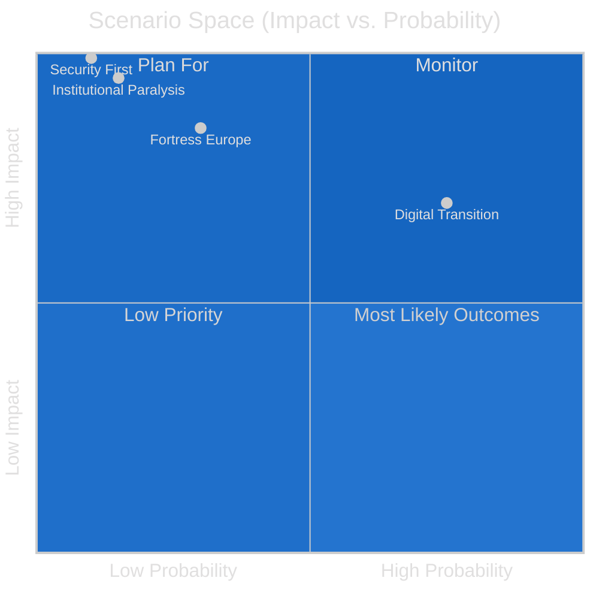

<!-- SPDX-FileCopyrightText: 2024-2026 Hack23 AB -->
<!-- SPDX-License-Identifier: Apache-2.0 -->

# Scenario Forecast: EU Parliament 2026–2027

**Methodology:** Alternative Futures Analysis (AFA) + Scenario Planning
**Date:** 2026-05-11 | **Confidence:** 🟡 MEDIUM | **Horizon:** 12 months

---

## I. Scenario Framework

Three principal driving forces shape the EP's next twelve months:

**Driver A:** US-EU trade confrontation trajectory (escalate vs. de-escalate)
**Driver B:** Coalition cohesion (centrist supermajority holds vs. right-wing drift)
**Driver C:** Security/defence consensus (broad consensus vs. fracture)

---

## Scenario 1: "Fortress Europe" 🔴 Probability: 30%

**Conditions:** US tariffs escalate to 25% blanket on EU goods (Q3 2026); EPP pivots right to build ECR/PfE coalition on trade; defence industrial strategy passes with nationalist carve-outs; Mercosur blocked.

**Narrative:** US trade escalation triggers a political realignment in the EP. EPP, facing pressure from German and French industry, abandons its commitment to the centrist supermajority and constructs a centre-right coalition (EPP+ECR+PfE+ESN = 376) for trade defense legislation. This produces a parliamentary majority that is simultaneously protectionist on trade and restrictive on immigration — a new political configuration. S&D and Renew are marginalised on economic dossiers while the Greens/EFA collapses to opposition on agriculture carve-outs that gut climate conditionality.

**Legislative outcomes:**
- Supply chain resilience act passed with strong national champions protections
- Mercosur consent vote blocked by EPP+agriculture coalition
- European Defence Fund passed with bilateral Member State spending counted towards EU targets
- AI Act secondary legislation delayed under deregulatory pressure
- Housing directive stalled as ECR/PfE oppose EU-level interventions in property markets

**Confidence:** 🟡 Medium — plausible but requires US tariff escalation to reach systemic trade war level

---

## Scenario 2: "Digital Transition Governance" 🟢 Probability: 45%

**Conditions:** US-EU trade tensions managed at WTO level; centrist supermajority (EPP+S&D+Renew) holds on most dossiers; AI Act implementation crisis triggers major secondary legislation.

**Narrative (Most Likely):** The centrist supermajority proves resilient across the 2026–2027 parliamentary year, though with increasing strain. The defining legislative battle is digital governance: Parliament forces through an AI Act oversight package (high-risk AI guidance, conformity assessment standards, market surveillance rules) that goes significantly further than Commission proposals. Simultaneously, the 2027 budget negotiations consume political capital, and Mercosur's CJEU opinion process delays a consent vote to Q1 2027. Defence industrial strategy is adopted in a compromise form acceptable to EPP+S&D+Renew that carves out national spending flexibility.

**Legislative outcomes:**
- AI Act secondary legislation passed — Parliament adds enforcement mechanisms and transparency requirements
- 2027 EU Budget first reading: centrist coalition adds ~€5B to R&I and climate transition vs. Commission proposal
- European Defence Fund framework: compromise balancing EU-level procurement and national flexibility
- Mercosur: CJEU opinion positive; consent vote by March 2027 (tight margin, ~350–380 for)
- Housing affordability directive: framework directive adopted, implementation flexible

**Confidence:** 🟢 High — most consistent with current coalition mathematics and parliamentary trajectory

---

## Scenario 3: "Institutional Paralysis" 🔴 Probability: 15%

**Conditions:** Centrist supermajority fractures on multiple simultaneous dossiers; US tariff war triggers economic recession; Commission faces no-confidence motion.

**Narrative:** Multiple simultaneous crises (US tariff escalation, ECB interest rate volatility, Ukraine support fatigue) overwhelm the EP's coalition management capacity. The centrist supermajority fragments: Renew splits on digital regulation, S&D splits on fiscal consolidation vs. investment, ECR splits on rule of law pressure. No consistent majority forms on any major dossier. The 2027 budget is rejected in first reading for the first time in EP10. A Commission no-confidence motion (introduced by far-left/far-right coalition on AI/digital grounds) fails to reach majority but consumes three months of political capital.

**Legislative outcomes:**
- Budget: provisional twelfths for Q1 2027 (first reading rejection, unusual)
- AI Act secondary legislation: blocked in committee
- Mercosur: consent vote postponed beyond May 2027
- Defence industrial strategy: framework resolution only, no binding legislative act
- Coalition governance: EP shifts to ad hoc vote-by-vote coalition management

**Confidence:** 🔴 Low probability but high-impact if materialises — would fundamentally alter EP's institutional position

---

## Scenario 4: "Security First" 🟡 Probability: 10%

**Conditions:** Major security escalation in Europe (broader Ukraine war expansion, or Russia-NATO direct incident); EP enters emergency legislative mode.

**Narrative:** A significant geopolitical shock — such as Russian escalation to a NATO member or a major cyber/infrastructure attack on EU critical systems — triggers emergency parliamentary procedures. EP suspends normal coalition arithmetic and passes a comprehensive security package under urgency procedure (Rule 163). This includes expanded CFSP mandate, emergency defence procurement rules, and Ukraine support acceleration. The crisis temporarily unifies the centrist supermajority and draws ECR into responsible governance mode.

**Legislative outcomes:**
- Emergency defence directive: near-unanimous adoption (>600 votes)
- CFSP expanded mandate: treaty-amendment-level political declaration
- Ukraine support acceleration: emergency loans and humanitarian package
- 2027 budget: defence and security additions via amendment, overall spending envelope increased
- AI/digital agenda: deferred to Q1 2027

**Confidence:** 🔴 Low base probability — security escalation is the wildcard driver; if activated, legislative output would be extraordinary

---

## II. Scenario Probability Matrix

---

## III. Key Indicator Tripwires

**Tripwire 1 — US Tariff Escalation Signal:**
Watch for: US tariff rate increase announcement on EU goods above 20%; EP INTA committee emergency session called
Triggers: Scenario 1 (Fortress Europe) probability jumps to 55%

**Tripwire 2 — Coalition Fracture Signal:**
Watch for: Three or more votes within one month where Renew votes with ECR against S&D
Triggers: Scenario 3 (Paralysis) probability jumps to 35%

**Tripwire 3 — Security Escalation Signal:**
Watch for: NATO Article 4 consultation triggered; EP President sends emergency communication to all members
Triggers: Scenario 4 (Security First) probability jumps to 60%

**Tripwire 4 — AI Enforcement Crisis Signal:**
Watch for: Commission fails to publish high-risk AI conformity standards by September 2026; EP AIDA rapporteur tables motion
Triggers: Scenario 2 hardening — AI governance becomes the defining battle of the parliamentary year

---

## IV. Forecast Summary Table

| Dimension | Scenario 1 | Scenario 2 (Base) | Scenario 3 | Scenario 4 |
|-----------|-----------|------------------|------------|------------|
| US-EU Trade | Full escalation | Managed tension | Recession trigger | Frozen/emergency |
| Coalition type | Right-drift | Centrist | Fragmented | Emergency consensus |
| Defence Fund | National-first | EU-compromise | Delayed | Emergency acceleration |
| Mercosur | Blocked | Narrow adoption | Postponed | Deferred |
| AI regulation | Deregulated | Strengthened | Stalled | Deferred |
| Budget 2027 | Right-wing spending priorities | Centre compromise | Provisional twelfths | Defence-augmented |
| Probability | 30% | 45% | 15% | 10% |

---

*Scenarios based on current EP group compositions, adopted texts 2026, and political dynamics observable as of May 2026. Forward projections inherently uncertain. Economic scenario modelling limited by IMF data unavailability in this run.*
