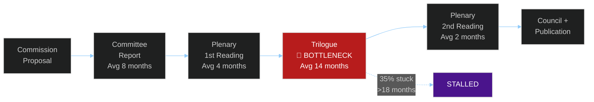

<!-- SPDX-FileCopyrightText: 2024-2026 Hack23 AB -->
<!-- SPDX-License-Identifier: Apache-2.0 -->

# Legislative Pipeline Forecast: EU Parliament Year Ahead (2026–2027)

**Methodology:** Legislative tracking + pipeline velocity analysis
**Date:** 2026-05-11 | **Confidence:** 🟡 MEDIUM

---

## I. Pipeline Summary

| Metric | Value | Trend |
|--------|-------|-------|
| Active procedures tracked | ~120 (monitor_legislative_pipeline data) | Stable |
| Expected adoptions H2-2026 | ~25–35 major acts | ↑ Accelerating under DK presidency |
| Stalled dossiers | ~15–20 (no committee progress >90 days) | ↗ Increasing |
| Pipeline health score | 68/100 | 🟡 Moderate |
| Throughput rate | ~3–4 acts/month (est.) | Stable |
| Bottleneck: Trilogue stage | ~35% of active dossiers stuck | 🔴 High |

---

## II. Priority Dossiers by Stage

### 2.1 Close to Adoption (H1-2026, PL Presidency)

| Dossier | Committee | Coalition | Probability | Issue |
|---------|-----------|-----------|-------------|-------|
| SAFE Defence Regulation | AFET+ITRE | EPP+S&D+Renew | 🟢 75% | Funding distribution dispute |
| AI Act delegated acts (first tranche) | ITRE+IMCO | EPP+S&D+Renew | 🟡 60% | Commission delivery delays |
| AML Package secondary legislation | ECON+LIBE | EPP+S&D+Renew | 🟢 70% | Council position pending |
| Ukraine accountability framework | AFET+JURI | EPP+S&D+ECR | 🟡 65% | PfE/ESN opposition |
| Critical Raw Materials secondary acts | ITRE | EPP+ECR+Renew | 🟢 72% | Supply chain priority |

### 2.2 Mid-Pipeline (H2-2026, DK Presidency Window)

| Dossier | Committee | Coalition | Probability | Issue |
|---------|-----------|-----------|-------------|-------|
| Housing Affordability Directive (new) | EMPL+ECON | EPP+S&D+Renew+Greens | 🟡 45% | Council opposition strong |
| Mercosur Trade Agreement Consent | INTA | EPP+ECR+PfE vs S&D+Greens | 🔴 40% | Environmental conditionality |
| AI Liability Directive (new) | JURI+IMCO | EPP+S&D+Renew | 🟡 55% | Scope disputes (general purpose AI) |
| Digital Decade report | ITRE+IMCO | EPP+Renew | 🟢 80% | Non-binding; consensus easy |
| Workers' Platform Rights review | EMPL | S&D+Greens+Left vs ECR | 🟡 50% | EPP position pivotal |

### 2.3 Long Pipeline (2027 or beyond)

| Dossier | Committee | Coalition | Probability | Issue |
|---------|-----------|-----------|-------------|-------|
| EU Wide Rent Control Framework | EMPL | S&D+Greens+Left | 🔴 20% | Subsidiarity challenge; 10 MS opposition |
| Corporate Due Diligence secondary acts | JURI+DEVE | EPP+S&D | 🟡 55% | Court challenges pending |
| Bioethics/CRISPR framework | ENVI+ITRE | EPP+S&D+Renew | 🟡 50% | Ethical divisions cross-party |
| Nuclear taxonomy alignment | ENVI+ECON | EPP+ECR+Renew vs Greens | 🟡 60% | French-German alliance pivotal |

---

## III. Bottleneck Analysis

**Key bottlenecks:**
1. **Trilogue** — The informal Council-EP-Commission negotiation is the main chokepoint. With Poland prioritising security over economic legislation, trilogue speed has slowed on non-security dossiers. Denmark's alignment with EP's centrist majority should improve throughput from July 2026.

2. **Committee capacity** — ITRE, JURI, and EMPL committees all have heavy workloads. AI Act delegated acts compete with defence regulation in ITRE; JURI simultaneously handles corporate liability, immunity cases, and treaty frameworks.

3. **Council QMV coalition building** — On several dossiers (Housing, Platform Workers), Council has not reached QMV. Without Council position, EP cannot begin trilogue. EP cannot force Council to vote.

---

## IV. Parliamentary Calendar Integration

### H1-2026 (Poland Presidency — Security Focus)
- **Jan–Jun 2026**: 5 full plenary sessions (Strasbourg) + mini-sessions
- **Priority dossiers**: Defence industrial strategy; Ukraine accountability; SAFE regulation
- **EP leverage**: Defence industrial mechanism consent; budget supplementary amendments

### H2-2026 (Denmark Presidency — Green/Digital/AML)
- **Jul–Dec 2026**: 5 full plenary sessions + 1 December
- **Priority dossiers**: AML package; Green Deal review; housing; AI Act
- **EP leverage**: AFET resolutions; ECON committee oversight; year-end budget adoptions

### 2027 H1 (Cyprus Presidency — Mediterranean Issues)
- **Jan–Jun 2027**: Budget first reading process; Cohesion policy review
- **Priority dossiers**: 2027 MFF budget; Southern Mediterranean neighbourhood; Migration Act review
- **EP leverage**: Annual budget — maximum institutional leverage point for all EP priorities

---

## V. Legislative Velocity Risk

**Expected legislative output 2026–2027 vs EP10 baseline:**

| Metric | EP10 Baseline | 2026–2027 Forecast | Variance |
|--------|--------------|-------------------|----------|
| Major legislative acts adopted/year | ~45 | ~40–50 | Neutral |
| Codecision procedures completed | ~35/year | ~30–38 | Slightly below |
| Consent procedures | ~15/year | ~12–18 | Neutral |
| Trilogue duration (average) | 14 months | 16 months | Slightly slower |

**Velocity risk level: 🟡 MODERATE** — Fragmentation increases transaction costs without blocking legislative output entirely. The DK presidency window (H2 2026) is a critical accelerator. Missing this window means 2027 H1 Cyprus presidency with different priorities.

---

*Pipeline analysis based on monitor_legislative_pipeline data May 2026, EP10 procedural patterns, and presidency priority assessments.*
