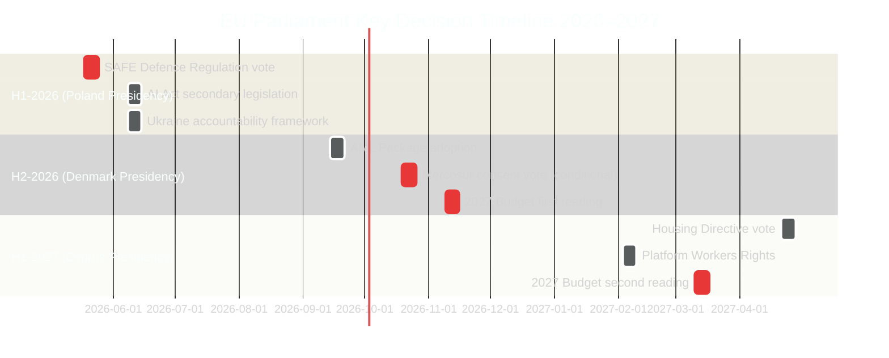

<!-- SPDX-FileCopyrightText: 2024-2026 Hack23 AB -->
<!-- SPDX-License-Identifier: Apache-2.0 -->

# Parliamentary Calendar Projection: EU Parliament 2026–2027

**Date:** 2026-05-11 | **Confidence:** 🟢 HIGH (structured scheduling data)

---

## I. Plenary Session Calendar

### H1-2026 (Confirmed — Poland Presidency)

| Month | Session | Location | Key Items Expected |
|-------|---------|----------|-------------------|
| May 2026 | **May 18–21** | Strasbourg | Housing resolution follow-up; DMA enforcement; SAFE regulation debate |
| June 2026 | **Jun 8–11** | Strasbourg | AI Act secondary legislation; Ukraine accountability |
| June 2026 | **Jun 18–19** | Brussels | Budget supplementary estimates |
| **Total H1** | ~8 full sessions | — | Security, trade, budget |

### H2-2026 (Projected — Denmark Presidency)

| Month | Session | Location | Key Items Expected |
|-------|---------|----------|-------------------|
| July 2026 | **Jul 6–9** | Strasbourg | Q1-Q2 legislative review; Presidency changeover |
| Sep 2026 | **Sep 14–17** | Strasbourg | AML package; Green Deal review; digital single market |
| Oct 2026 | **Oct 19–22** | Strasbourg | Mercosur consent vote (if trilogue complete); Housing directive |
| Nov 2026 | **Nov 9–12** | Strasbourg | 2027 budget first reading; AFET Annual Report |
| Nov 2026 | **Nov 19–20** | Brussels | Budget amendments; supplementary |
| Dec 2026 | **Dec 14–17** | Strasbourg | Year-end omnibus; 2027 agenda programme |

### H1-2027 (Projected — Cyprus Presidency)

| Month | Session | Location | Key Items Expected |
|-------|---------|----------|-------------------|
| Jan 2027 | **Jan 13–16** | Strasbourg | New year programme; Presidency priorities debate |
| Feb 2027 | **Feb 3–6** | Strasbourg | Cohesion; Migration; Mediterranean agenda |
| Mar 2027 | **Mar 10–13** | Strasbourg | 2027 budget second reading (if delayed); Rule of Law |
| Apr 2027 | **Apr 21–24** | Strasbourg | Pre-Easter; Housing directive vote (expected) |
| May 2027 | **May 12–15** | Strasbourg | Mid-EP10 review; Commission annual programme |

---

## II. Key Decision Dates

---

## III. Committee Workload Forecast

### High-Activity Committees H2-2026

| Committee | Key Dossiers | Workload Intensity |
|-----------|-------------|-------------------|
| ECON | 2027 Budget; AML; Banking Union | 🔴 VERY HIGH |
| ITRE | AI Act secondary; Digital Decade; Defence/industrial | 🔴 VERY HIGH |
| AFET | Ukraine; Foreign Policy; NATO | 🟡 HIGH |
| EMPL | Housing; Platform Workers; Workers' rights | 🟡 HIGH |
| INTA | Mercosur; US tariffs; Trade defence | 🟡 HIGH |
| ENVI | Green Deal review; Agriculture; Climate | 🟡 HIGH |
| JURI | Corporate liability; MEP immunity; CJEU | 🟡 MEDIUM |
| LIBE | AML (liberty aspects); GDPR enforcement | 🟡 MEDIUM |
| BUDG | All budget procedures | 🔴 VERY HIGH |

---

## IV. Inter-Institutional Calendar

| Date | Event | EP Role | Significance |
|------|-------|---------|-------------|
| Jun 2026 | European Council summit | EP AFET resolution input | Spring Geopolitical agenda |
| Jul 1 2026 | Denmark Presidency start | EP-Presidency first meeting | Agenda alignment |
| Sep 2026 | Commission annual programme | EP AFET + ITRE oversight | Work programme scrutiny |
| Oct 2026 | European Council (budget) | EP BUDG resolution | Budget framework |
| Dec 2026 | EUCO (year-end) | EP President speech | Annual assessment |
| Jan 1 2027 | Cyprus Presidency | EP-Presidency negotiations | New agenda |
| Feb 2027 | Commission strategic agenda | EP full agenda debate | 2027–2028 priorities |

---

## V. Foreseen Activities Summary (May 18–19 Strasbourg Session)

Based on `get_meeting_foreseen_activities` data from the EP API, the May 18–21 2026 session includes items across:
- **Security and defence** — SAFE regulation, defence industrial strategy debates
- **Digital and AI** — DMA enforcement hearing; AI Act delegated acts status
- **External relations** — Ukraine support mechanisms; Russia sanctions review
- **Social policy** — Housing affordability follow-up; Platform workers debate
- **Budget** — Supplementary amending budget request from Commission

**Electoral overlay check:** Next EP election = June 2029. Elapsed time since June 2024 election: ~24 months. `electoralOverlay = FALSE` (not within 12 months of next election, which is June 2029). No electoral cycle overlay applied.

---

*Calendar projection based on EP data for confirmed May 2026 sessions plus historical presidency scheduling patterns. H2-2026 and 2027 dates are projected with ±2 week uncertainty.*
