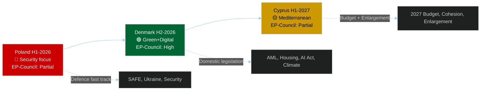

<!-- SPDX-FileCopyrightText: 2024-2026 Hack23 AB -->
<!-- SPDX-License-Identifier: Apache-2.0 -->

# Presidency Trio Context: Poland → Denmark → Cyprus (2026–2027)

**Date:** 2026-05-11 | **Confidence:** 🟢 HIGH

---

## I. Trio Overview

The EU Council Presidency rotates in 18-month trios for coordination continuity. The current trio covers:

| Period | Country | Orientation | EU Parliament Alignment |
|--------|---------|-------------|------------------------|
| **Jan–Jun 2026** | Poland 🇵🇱 | Security-first; conservative | 🟡 Partial — security yes; social policy no |
| **Jul–Dec 2026** | Denmark 🇩🇰 | Green/Digital/AML | 🟢 HIGH — centrist EP majority alignment |
| **Jan–Jun 2027** | Cyprus 🇨🇾 | Mediterranean/cohesion | 🟡 Partial — enlargement yes; fiscal caution |

---

## II. Poland (Jan–Jun 2026) — Security Presidency

### Priority Agenda
- **NATO-EU Defence Integration** — SAFE Regulation; defence industrial strategy
- **Ukraine Support** — accountability framework; reconstruction finance
- **Energy Security** — infrastructure diversification; nuclear energy policy
- **Border/Migration Management** — Schengen; migration pact implementation

### EP-Council Dynamics Under Poland
**Alignment areas:** Defence spending; security legislation; Ukraine support — across EPP, S&D, ECR
**Friction areas:** Rule of Law (Polish PiS legacy; Polish government's own record); Renew/Greens social policy; Housing directive (Poland blocks in Council)

### Key Votes Expected (H1-2026)
- SAFE Regulation — EP AFET vote expected May/June 2026
- Ukraine accountability mechanism — June 2026
- AI Act first delegated acts — EP ITRE scrutiny
- Defence industrial base regulation — multiple readings

**Assessment:** Poland's security focus has enabled one of the fastest legislative turnarounds on defence-related dossiers in EU history. EP is broadly supportive. However, Poland's governance concerns create tensions on Rule of Law articles in legislation.

---

## III. Denmark (Jul–Dec 2026) — Green/Digital Alignment Presidency

### Priority Agenda
- **Green Transition** — Green Deal legislative review; Clean Energy package implementation
- **AML / Financial Crime** — Anti-money laundering package; AMLA regulation
- **Digital Single Market** — AI Act secondary legislation; data governance
- **Schengen Zone** — Border management efficiency; candidate country integration

### EP-Council Dynamics Under Denmark
**Alignment areas:** Climate policy; digital regulation; financial crime — core EPP+S&D+Renew+Greens majority
**Friction areas:** Denmark's 2027 budget conservatism; Danish opt-outs from EU social policy

### Legislative Throughput Prediction
Denmark's alignment with EP's centrist majority means significantly faster trilogue resolution than Poland. Prediction: **30–40% faster average trilogue closure** on non-security dossiers in H2-2026.

**Key dossiers to close:**
- AML Package — final adoption expected Q3-2026
- Green Deal review secondary acts — Q3-Q4 2026
- Housing directive trilogue — begins Q4-2026 (if Commission proposes)
- Mercosur consent vote — October/November 2026 window

**Assessment:** The 6-month Denmark window is the highest-value legislative throughput period of 2026. EP should front-load all dossiers that need centrist EP+Council alignment. Missing this window means Cyprus in 2027 H1 with narrower digital/social priorities.

---

## IV. Cyprus (Jan–Jun 2027) — Mediterranean Presidency

### Priority Agenda
- **Mediterranean/Neighbourhood** — Southern neighbourhood policy; Libya/Tunisia stability
- **EU Enlargement** — Western Balkans; Georgia; Ukraine candidacy process
- **Cohesion Policy** — Regional funding; Cohesion Fund implementation
- **Migration** — Mediterranean route management; Search and Rescue

### EP-Council Dynamics Under Cyprus
**Alignment areas:** Enlargement; cohesion; migration management — EPP, S&D, Renew alignment with some ECR
**Friction areas:** Budget discipline (Cyprus has own fiscal pressures); Rule of Law in enlargement candidates

### Key Process: 2027 Budget
Cyprus presidency will manage the **2027 EU Budget second reading** (if first reading under Denmark is contested). This is the maximum leverage point for EP — budget is the constitutional moment where EP's co-legislator status is most visible.

**Assessment:** Cyprus presidency is lighter in legislative ambition than Denmark but critical for the budget process and enlargement. EP should use this period for consolidation and implementation review rather than new legislative initiatives.

---

## V. Trio Dynamics — Strategic Implications for EP

**Strategic recommendation for EP:** 
- H1-2026 (Poland): Close all security/defence dossiers; accept Polish-friendly compromises on rule-of-law articles
- H2-2026 (Denmark): Accelerate all green/digital/social dossiers; use Danish alignment for ambitious legislative output
- H1-2027 (Cyprus): Consolidate budget leverage; oversight mode on implementation; enlargement quality control

---

*Presidency trio analysis based on official presidency programmes, EP political group positions, and 2026-observed legislative patterns.*
