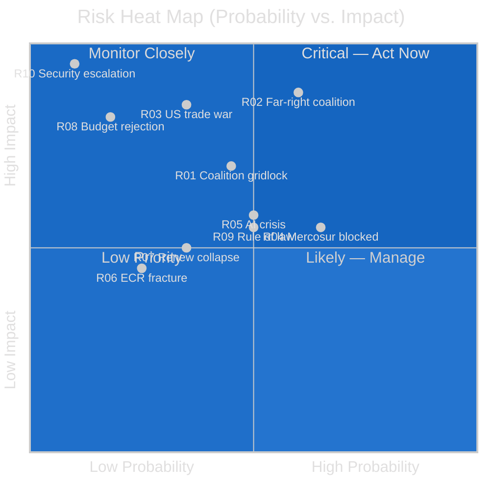

<!-- SPDX-FileCopyrightText: 2024-2026 Hack23 AB -->
<!-- SPDX-License-Identifier: Apache-2.0 -->

# Risk Matrix: EU Parliament Year Ahead (2026–2027)

**Methodology:** Political Risk Assessment Framework + Quantitative SWOT
**Date:** 2026-05-11 | **Confidence:** 🟡 MEDIUM

---

## I. Risk Registry

| ID | Risk | Probability | Impact | Risk Score | Owner Group | Mitigation |
|----|------|-------------|--------|-----------|-------------|-----------|
| R01 | Coalition fragmentation leads to legislative gridlock on key dossiers | 🟡 25% | 🔴 HIGH | 7.5 | All groups | Continuous inter-group dialogue; compromise mandate flexibility |
| R02 | Far-right tactical coalition systematically rolls back Green Deal legislation | 🟡 35% | 🔴 HIGH | 8.5 | EPP, ECR, PfE | S&D/Greens blocking minority activation; committee management |
| R03 | US-EU trade war escalates to full tariff confrontation | 🟡 20% | 🔴 HIGH | 8.0 | Renew, EPP, ECR | WTO dispute escalation; retaliatory framework activation |
| R04 | Mercosur consent vote blocked — EP loses trade credibility | 🟡 40% | 🟡 MEDIUM | 6.0 | EPP, Greens, S&D | CJEU opinion framing; agricultural conditions binding |
| R05 | AI Act implementation crisis — Commission fails delivery | 🟡 30% | 🟡 MEDIUM | 6.0 | Renew, EPP, S&D | EP oversight letters; formal Committee hearings |
| R06 | ECR group fracture — Polish delegation exits following immunity cascade | 🔴 15% | 🟡 MEDIUM | 4.5 | ECR | Monitor EPPO; JURI committee management |
| R07 | Renew cohesion collapse — French MEP defections | 🔴 20% | 🟡 MEDIUM | 5.0 | Renew | Group leadership consolidation; French internal politics |
| R08 | 2027 budget first reading rejected — first in EP10 | 🔴 10% | 🔴 HIGH | 5.0 | All groups (BUDG) | Early tripartite dialogue; Commission bridge proposals |
| R09 | Rule of Law deterioration in candidate countries — EP credibility | 🟡 30% | 🟡 MEDIUM | 5.5 | All groups | Annual rule-of-law reports; conditionality enforcement |
| R10 | Security escalation (Ukraine/NATO) — parliamentary disruption | 🔴 5% | 🔴 VERY HIGH | 5.0 | All groups | Emergency procedures activated; crisis management protocol |

---

## II. SWOT Analysis — European Parliament Institutional Position

### Strengths

**S1 — Legislative Co-decision Authority** (🟢 High confidence)
EP holds co-decision powers on ~80% of EU legislation. No major act can pass without EP consent. This structural veto power is the foundation of EP's institutional leverage in all coalition negotiations.

**S2 — Budgetary Veto** (🟢 High confidence)
EP must approve the annual EU budget. The 2027 budget process gives EP maximum leverage to shape spending priorities for R&I, climate transition, housing, defence, and digital infrastructure simultaneously.

**S3 — Commission Accountability Role** (🟢 High confidence)
EP can call Commissioners to accountability hearings, conduct committee investigations, and in extremis vote no-confidence in the Commission. The DMA enforcement and AI Act implementation resolutions (2026) demonstrate active use of this oversight function.

**S4 — High Institutional Legitimacy** (🟡 Medium confidence)
Despite challenges, EP remains the only directly elected supranational legislature in the world. Its democratic mandate provides legitimacy that Council and Commission lack on politically sensitive issues (AI rights, workers' rights, climate justice).

**S5 — Multi-issue Coalition Flexibility** (🟡 Medium confidence)
The fragmented chamber enables differentiated coalition construction by issue area. The same plenary session can produce EPP+S&D+Renew majority on budget and EPP+ECR+PfE majority on agriculture — maximising the range of achievable legislative outcomes.

---

### Weaknesses

**W1 — No Self-Initiative Right** (🔴 Critical)
EP cannot formally propose legislation — only the Commission has formal initiative right. EP must use non-legislative resolutions, own-initiative reports, and informal pressure to shape Commission proposals. This creates systematic asymmetry where the Commission can ignore EP priorities.

**W2 — Coalition Transaction Costs** (🔴 High)
With 9 groups and 717 MEPs, assembling a majority for any major vote requires extensive inter-group negotiation. Each vote is a mini-coalition-building exercise. Transaction costs (time, compromise quality) increase with fragmentation.

**W3 — Attendance Data Gap** (🟡 Medium)
EP Open Data Portal reports zero attendance data — meaning EP Monitor cannot verify whether MEPs are actually present for critical votes. Empty seats in plenary can swing narrow votes unpredictably.

**W4 — Trilogue Opacity** (🟡 Medium)
Major legislation is negotiated in informal trilogues that are not fully transparent to the broader plenary. This creates accountability gaps and opportunities for corporate capture.

**W5 — Limited Enforcement Capacity** (🟡 Medium)
EP can pass resolutions and adopt texts but cannot directly enforce them. DMA enforcement depends on Commission; Rule of Law conditionality depends on Council; MEP immunity enforcement depends on national courts. EP's bark is often louder than its bite.

---

### Opportunities

**O1 — Defence Industrial Strategy** (🟢 Near-term)
The unprecedented scale of European defence spending (driven by Ukraine war and US transatlantic uncertainty) gives EP a historic opportunity to shape EU strategic autonomy architecture. Getting the EU procurement mechanism right could lock in European-level coordination for a decade.

**O2 — AI Governance Leadership** (🟢 Near-term)
The EU AI Act is the world's first comprehensive AI regulation. If EP successfully ensures enforcement, the EU becomes the global standard-setter for AI governance — replicating the GDPR effect in a domain that will define the next decade of economic and social development.

**O3 — Housing Affordability Mandate** (🟢 Near-term)
The March 2026 housing resolution gives EP a strong public mandate on the highest-salience domestic political issue in most EU member states. Converting this resolution into binding legislation would be EP's highest-profile social policy achievement in EP10.

**O4 — Danish Presidency Alignment** (🟡 Medium-term)
Denmark's Q3–Q4 2026 presidency priorities (green transition, AML, Schengen) align closely with EP's centrist majority preferences. This 6-month window offers faster legislative throughput than the Poland security-focused presidency.

**O5 — Mercosur Environmental Conditionality Leverage** (🟡 Conditional)
If CJEU opinion is positive, EP has a unique window to attach binding environmental conditions to Mercosur consent — establishing a precedent for climate conditionality in all future trade agreements.

---

### Threats

**T1 — Far-Right Tactical Coalition Normalisation** (🔴 High)
The March 2026 heavy-duty vehicle vote demonstrated that EPP+ECR+PfE can assemble majorities. If this becomes routine, the normative architecture of EP's democratic governance is undermined. Progressive legislation becomes systematically vulnerable.

**T2 — US-EU Trade War Escalation** (🟡 Medium)
Full tariff escalation would destabilise EU economic base, reduce budget contributions, and create emergency legislative demands that crowd out EP's planned agenda. Recession would strengthen far-right parties domestically — feeding back into EP's coalition environment.

**T3 — AI Implementation Failure** (🟡 Medium)
If AI Act enforcement fails — through Commission underfunding, corporate legal challenges, or technical gaps — EP will have created the world's first comprehensive AI regulation that has no teeth. This would be institutionally devastating for EP's ambition to be a regulatory superpower.

**T4 — Rule of Law Credibility Erosion** (🟡 Medium)
Multiple simultaneous Rule of Law failures (Hungary ongoing, Georgia backsliding, Polish legacy cases) risk making EP resolutions look performative. If rule-of-law conditionality mechanisms have no practical effect, EP's most important democratic governance instrument becomes toothless.

**T5 — Member State Fiscal Crisis** (🔴 Low probability, HIGH impact)
A sovereign debt crisis in France or Italy (the two highest-debt large economies) would consume all EU political bandwidth, derail the budget process, and force EP into emergency fiscal governance mode indefinitely.

---

## III. Risk Heat Map

---

## IV. Political Capital Risk

| Group | Political Capital At Risk | Primary Risk | Exposure Level |
|-------|--------------------------|-------------|----------------|
| EPP | Credibility as European values anchor | Repeated ECR/PfE coalition participation | 🔴 HIGH |
| S&D | Relevance to progressive constituents | Insufficient differentiation from EPP compromises | 🟡 MEDIUM |
| Renew | Governing coalition credibility | French domestic collapse → MEP defections | 🟡 MEDIUM |
| Greens/EFA | Electoral survival post-EP10 | Legislative losses on climate/environment | 🔴 HIGH |
| ECR | Institutional credibility | Polish Rule of Law cascade | 🟡 MEDIUM |
| PfE | Governing relevance | Exclusion from all majority coalitions | 🟡 MEDIUM |

---

*Risk assessment based on EP political configuration May 2026, observed patterns from EP10 adopted texts January–April 2026, and structural institutional analysis.*
