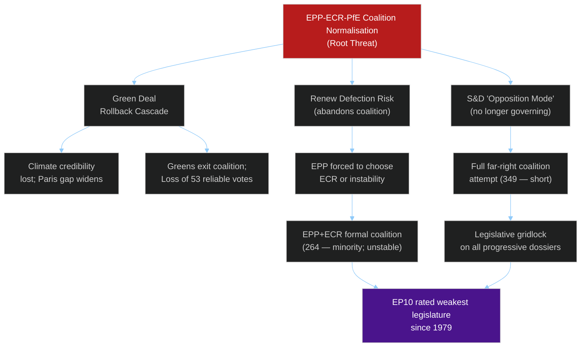

<!-- SPDX-FileCopyrightText: 2024-2026 Hack23 AB -->
<!-- SPDX-License-Identifier: Apache-2.0 -->

# Threat Assessment: Actor Threat Profiles — EU Parliament 2026–2027

**Date:** 2026-05-11 | **Confidence:** 🟡 MEDIUM

---

## I. Profile 1: EPP Internal Right Wing

**Threat Level:** 🟡 MEDIUM
**Actor:** EPP MEPs aligned with Fidesz-legacy, Polish PiS successor parties, and Italian FdI allies within the EPP family
**Motivation:** Shift EPP's centre of gravity rightward; normalise ECR/PfE cooperation; weaken Green Deal and rule-of-law conditionality
**Capability:** ~40–50 EPP votes that can break governing coalition discipline on targeted votes
**Recent Evidence:** March 2026 heavy-duty vehicle vote (EPP+ECR majority reversed EU emission standard); agricultural derogation votes
**Impact Pathway:** If EPP right-wing successfully normalises tactical far-right cooperation, the standard governing coalition becomes unreliable on 15–20% of contested dossiers

**Monitoring Indicators:**
- Repeated EPP+ECR+PfE coalition victories in ENVI or ITRE committee
- EPP group disciplinary procedures bypassed
- Weber public statements legitimising PfE cooperation

---

## II. Profile 2: PfE Disruption Strategy

**Threat Level:** 🟡 MEDIUM
**Actor:** Patriotes pour l'Europe (PfE, 85 seats) — Jordan Bardella (FN France), Giorgia Meloni allies, Viktor Orbán delegations
**Motivation:** Signal opposition to EU federalism; amplify national political messages; obstruct progressive legislation
**Capability:** 85 votes — insufficient alone for majority but pivotal in EPP+ECR+PfE arithmetic
**Tactical Pattern:** Vote with ECR+EPP on deregulation/agricultural dossiers; vote with The Left on procedural anti-institution motions; use committee hearings for media disruption
**Impact Pathway:** PfE cannot block legislation alone but can tip narrow votes (350–380 seat range) against S&D+Renew+Greens positions

**Monitoring Indicators:**
- PfE voting alongside EPP+ECR to reach 360-seat threshold on contested dossiers
- PfE procedural obstruction (amendments storms, quorum calls, committee disruptions)

---

## III. Profile 3: US Extraterritorial Regulatory Pressure

**Threat Level:** 🟡 MEDIUM
**Actor:** US executive branch + US tech companies (collective institutional)
**Motivation:** Limit EU AI Act and DMA enforcement scope; protect US market access; maintain dollar/tech hegemony
**Capability:** US Treasury Department DMA interpretations; WTO filings; lobbying via BusinessEurope; political pressure through bilateral summits
**Impact Pathway:** If US-EU tensions escalate, EP faces pressure (from Renew, EPP trade wing) to soften AI Act and DMA implementation to avoid trade retaliation

**Monitoring Indicators:**
- US government statements on EU AI Act as trade barrier
- BusinessEurope position papers citing US competitiveness gap
- EPP/Renew legislative requests to delay AI Act GPAI provisions

---

## IV. Profile 4: Russian Information Operations

**Threat Level:** 🟡 MEDIUM (structural; long-term)
**Actor:** Russian state-adjacent disinformation networks
**Motivation:** Weaken EU unity on Ukraine; amplify far-right narratives; destabilise EP's democratic legitimacy
**Capability:** Social media amplification networks; allied domestic actors (Hungarian Fidesz media); targeted MEP influence operations
**Impact Pathway:** Gradual erosion of pro-Ukraine consensus in EP; amplification of far-right Coalition narrative; suppression of centrist MEP communications

**Monitoring Indicators:**
- Coordinated far-right MEP communications on Ukraine using similar non-attributed talking points
- Social media amplification of "EU superstate" narratives correlated with Russian state media
- MEP interviews with RT or Russia-adjacent media outlets

---

## V. Consequence Trees

---

## VI. Legislative Disruption Risk

| Dossier | Disruption Actor | Mechanism | Risk Level |
|---------|-----------------|-----------|-----------|
| AI Act secondary legislation | US lobbying + EPP trade wing | Delay requests; amendment storms | 🟡 MEDIUM |
| Housing Directive | Council subsidiarity + ECR | Council blocking; legal challenge | 🔴 HIGH |
| Mercosur consent | S&D+Greens+Left | Environmental condition demands | 🟡 MEDIUM (feature, not bug) |
| 2027 Budget | EPP right wing | Social condition strikes | 🟡 MEDIUM |
| Green Deal review | EPP+ECR+PfE | Rollback amendments exceeding Commission proposal | 🔴 HIGH |
| Ukraine accountability | PfE+ESN | Obstruction votes; procedural delays | 🟡 LOW-MEDIUM |

---

*Threat profile assessment based on EP10 voting patterns January–April 2026, institutional dynamics analysis, and political group behaviour modelling. Classified: INTERNAL USE.*
