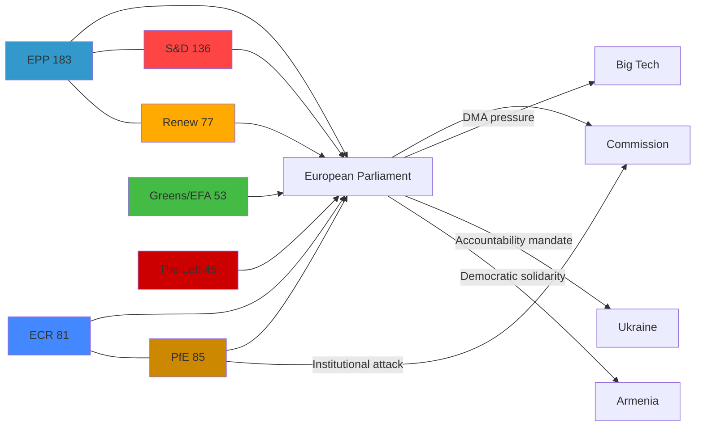

<!-- SPDX-FileCopyrightText: 2024-2026 Hack23 AB -->
<!-- SPDX-License-Identifier: Apache-2.0 -->

# Actor Mapping — EP Breaking News
**Date:** 2026-05-12 | **Article Type:** breaking | **Confidence:** 🟡 Medium

## Primary Actors

### 1. European Parliament (Institutional Actor)
**Role:** Legislator, political signaller, democratic oversight body
**Position in breaking news:** The EP acted as the primary driver of all five breaking developments
**Interests:** Asserting democratic prerogative; maintaining credibility on digital governance; demonstrating coherent security policy; managing far-right institutional challenge
**Capabilities:** Legislative initiative (in coordination with Commission); political resolutions (non-binding but politically weighty); inter-institutional pressure; media amplification
**Constraints:** Cannot enforce own resolutions; must work through Commission/Council; EP internal fragmentation limits coherence on contentious votes
**Confidence:** 🟢 High — direct EP institutional source data

### 2. European People's Party (EPP)
**Role:** Largest political group (183 MEPs, 25.5% of seats)
**Position:** Dominant coalition driver; typically supports DMA enforcement and Ukraine positions; more cautious on budget increases; split internally on migration and rule of law
**Interests:** Maintaining legislative leadership; managing internal centrist vs. national-conservative tensions; positioning for 2029 election cycle
**Coalition Signals:** EPP-S&D grand coalition (319 combined seats) remains the mathematical backbone for most mainstream resolutions; EPP-Renew-Greens cordon sanitaire against PfE/ECR on democracy resolutions
**Confidence:** 🟡 Medium — group composition confirmed, voting patterns inferred

### 3. Socialists and Democrats (S&D)
**Role:** Second largest group (136 MEPs, 19.0%)
**Position:** Strong on Ukraine accountability; leads on social and workers' rights provisions; sceptical of budget cuts to social programmes
**Interests:** Maintaining progressive coalition; countering far-right influence; protecting workers' rights in digital and platform economy
**Coalition Signals:** Consistent alignment with EPP on geopolitical resolutions; diverges on economic deregulation and budget priorities
**Confidence:** 🟡 Medium

### 4. Patriots for Europe (PfE)
**Role:** Third-largest group (85 MEPs, 11.9%) — populist-nationalist bloc
**Position:** Led the Rule 169 topical debate accusing the Commission of electoral interference. Opposed to Ukraine funding resolutions. Sceptical of DMA enforcement against national champions.
**Interests:** Destabilising EU institutional framework; garnering media attention; building coalition ahead of 2029 elections; advancing national sovereignty agenda
**Capabilities:** Can request topical debates (Rule 169); can delay or complicate voting by procedural motions; significant MEP base across Hungary, France, Italy, Austria, Belgium
**Key Tactic (April 29):** The topical debate on "Commission interference in democratic process and elections" represents a deliberate attempt to weaponise EP democratic legitimacy concerns against the Commission — a mirror of far-right national-level attacks on independent institutions
**Confidence:** 🟡 Medium — debate confirmed, specific positions inferred from group's consistent pattern

### 5. European Commission
**Role:** Executive body; DMA enforcement authority; Ukraine Aid coordinator
**Position:** Under pressure to accelerate DMA enforcement; defending its independence from PfE accusations; implementing Ukraine Loan mandate
**Interests:** Institutional legitimacy; regulatory credibility on digital markets; maintaining transatlantic relationships; coordinating Ukraine support
**Vulnerabilities:** DMA enforcement timeline delays create exposure to EP criticism; PfE attacks threaten institutional reputation; budget negotiation pressures
**Confidence:** 🟡 Medium — Commission role inferred from EP resolutions targeting it

### 6. Big Tech Gatekeepers (Apple, Meta, Alphabet, Amazon)
**Role:** Regulated entities under DMA
**Position:** Subject to EP enforcement pressure; actively lobbying against strict DMA implementation; challenging gatekeeper designations in court
**Interests:** Minimising compliance costs; preserving market positions; delaying enforcement timelines
**Market Context:** Combined EU market cap implications: Apple (~€2.8T), Alphabet (~€1.9T), Meta (~€1.1T) — enforcement creates significant regulatory risk premium
**Confidence:** 🟡 Medium — DMA enforcement resolution confirmed; company positions inferred from public lobbying record

### 7. Ukraine (External Stakeholder)
**Role:** Subject/beneficiary of TA-10-2026-0161 accountability resolution
**Position:** Seeking EP support for ICC proceedings and Special Tribunal for Crime of Aggression
**Interests:** International legal accountability for Russian military leadership; EU financial and military support; path to EU accession
**Confidence:** 🟢 High — EP resolution directly addresses Ukraine interests

### 8. Armenia (External Stakeholder)
**Role:** Beneficiary of TA-10-2026-0162 democratic resilience resolution
**Position:** Undergoing democratic consolidation post-Nagorno-Karabakh conflict
**Interests:** EU political support; economic partnership deepening; EU accession pathway exploration
**Geopolitical Context:** Armenia-EU rapprochement accelerated after 2023 Karabakh conflict; EP resolution reinforces this trajectory
**Confidence:** 🟢 High — EP resolution directly addresses Armenia

### 9. Civil Society / Platform Users
**Role:** Beneficiaries of cyberbullying (TA-0163) and DMA (TA-0160) resolutions
**Position:** Advocacy for stronger platform accountability; human rights framing
**Interests:** Protection from online harassment; free digital market access; democratic digital governance
**Confidence:** 🟡 Medium — position inferred from resolution subject matter

## Actor Relationship Network

## Power Asymmetries

| Dyad | Power Balance | Key Leverage |
|---|---|---|
| EPP vs. PfE | EPP dominant (2:1 seats) | EPP controls committee chairs and legislative agenda |
| EP vs. Commission | Asymmetric mutual dependence | EP can delay legislation; Commission controls enforcement |
| EU vs. Big Tech | Regulatory asymmetry | DMA enforcement creates new EU leverage |
| EP vs. Russia | Declaratory only | EP resolutions create diplomatic pressure but lack direct enforcement |

## Source Attribution
EP Open Data Portal — political group composition 2026-05-12
Adopted texts: TA-10-2026-0160, TA-10-2026-0161, TA-10-2026-0162, TA-10-2026-0163
Speeches: MTG-PL-2026-04-29 session (Rule 169 PfE topical debate confirmed)
Political landscape: EP API real-time data (cc-by 4.0)
