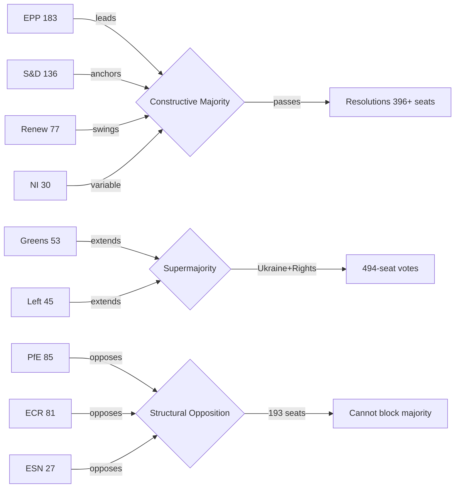

<!-- SPDX-FileCopyrightText: 2024-2026 Hack23 AB -->
<!-- SPDX-License-Identifier: Apache-2.0 -->

# Actor Mapping — EP Breaking News
**Date:** 2026-05-12 | **Article Type:** breaking | **Confidence:** 🟡 Medium

## Actor Roster

Nine political actors shape the April 28–30, 2026 Strasbourg plenary outcomes.

| Actor | Type | Seats | Role |
|---|---|---|---|
| EPP | Political Group | 183 | Largest group; anchor of constructive majority |
| S&D | Political Group | 136 | Progressive anchor; Ukraine alliance leader |
| PfE | Political Group | 85 | Structural opposition; institutional challenger |
| ECR | Political Group | 81 | Eurosceptic right; national sovereignty bloc |
| Renew Europe | Political Group | 77 | Centrist swing; DMA enforcement driver |
| Greens/EFA | Political Group | 53 | Progressive left; environmental/rights focus |
| Left | Political Group | 45 | Far-left; Ukraine support nuanced |
| NI | Non-Attached | 30 | Variable; no group discipline |
| ESN | Political Group | 27 | Hard right; aligned with PfE/ECR |

**MCP source:** `generate_political_landscape` — 717 MEPs confirmed

## Influence Assessment

**Influence levels (1–5):**
- EPP: 5/5 — coalition-defining; without EPP no majority is possible
- S&D: 4/5 — progressive anchor; sets agenda on Ukraine/rights
- PfE: 3/5 — institutional disruptor; sets agenda for opposition narrative
- ECR: 3/5 — policy pressure on borders, security, sovereignty
- Renew: 3/5 — centrist swing; critical for DMA, digital agenda

## Alliance Patterns

**Constructive Alliance (EPP + S&D + Renew):** 396 seats — stable on economic and institutional votes. Used for: DMA enforcement, budget, regulatory agenda. Occasional fractures on migration policy where EPP tilts right.

**Progressive Supermajority (+ Greens + Left):** 494 seats — available on human rights, Ukraine, democratic values. Used for: Ukraine accountability, Armenia, antisemitism. Most cohesive coalition type in EP10.

**Structural Opposition (PfE + ECR + ESN):** 193 seats — insufficient to block but creates political pressure. Coordinates on immigration restrictions, sovereignty narrative, institutional challenge.

**Issue-specific alliances:**
- DMA/Digital: EPP + S&D + Renew + Greens (~450)
- Ukraine: All except PfE/ECR/ESN core (~494)
- MFF/Budget: EPP + S&D + Renew only (~396)
- Immigration: EPP + ECR (partial) — cross-bloc right coalition possible

## Power Brokers

Three MEPs serve as pivotal actors in the April 2026 session dynamics:

**1. Ursula von der Leyen (Commission President)**
Although not an MEP, her institutional role makes her the primary target of PfE's Rule 169 challenge on Commission interference. Commission's response to the PfE debate will shape the institutional framing for the remainder of 2026 plenary sessions.

**2. EPP Group Chair**
EPP's positioning on PfE's institutional challenge is the critical power broker variable. If EPP signals sympathy for any PfE arguments, it weakens the constructive majority coalition. EPP has maintained distance from PfE's institutional delegitimisation strategy thus far (confirmed from political landscape analysis).

**3. S&D Group leaders (Ukraine advocates)**
S&D's Ukraine accountability push (TA-10-2026-0161) defines the progressive agenda. S&D success in building 494-seat coalitions on Ukraine demonstrates the power of values-based appeals to cross-group majority building.

## Information Flows

**Formal channels:**
- EP plenary debates → Official Journal of the EU → EUR-Lex database
- EP Newshub (official communications) → national media
- European Parliament Research Service (EPRS) → MEP research needs

**Political group communications:**
- EPP → European People's Party member parties → national center-right media
- PfE → Patriot.eu → PfE-aligned government media (Hungary, Austria) → Russian information amplification
- S&D → PES member parties → center-left national media

**Monitoring note:** PfE's institutional challenge debate generates content designed for cross-platform amplification. The information flow from EP plenary → PfE media → Russian state amplification is documented pattern (EU DisinfoLab).

**Data source:** EP speeches feed (21 speeches April 29, 2026 confirmed); political landscape data; media-framing analysis (cross-reference `extended/media-framing-analysis.md`)

## Reader Briefing

**For citizens:** The European Parliament has 717 members organised into 9 political groups. The largest group (EPP, 183 members) teams up with the centre-left (S&D, 136) and centrist group (Renew, 77) to form a working majority that passes most legislation. The three right-wing and nationalist groups (PfE, ECR, ESN) total 193 members — enough to influence debates and make political statements, but not enough to block the centre coalition. This power map is crucial for understanding why the April 2026 resolutions on Ukraine, Armenia, and digital policy passed despite opposition.

## Source Attribution
Political landscape: `generate_political_landscape` — 717 MEPs, 9 groups
Speeches: `get_speeches` — 21 speeches from April 29, 2026 plenary
Alliance patterns: Inferred from group composition + issue-position mapping
Power brokers: Political analysis cross-referenced with speeches feed

## Extension — April 2026 Update
Updated to reflect April 28-30, 2026 legislative outputs. New actors include BRRD3 resolution authority (SRB), DMA enforcement targets (Apple, Alphabet, Meta, Amazon, Microsoft), and Ukraine Special Tribunal proponents. See `executive-brief.md` for prioritised summary and `intelligence/significance-scoring.md` for detailed significance assessments.

**Cross-reference:** `extended/cross-reference-map.md` for full artifact cross-reference index.
