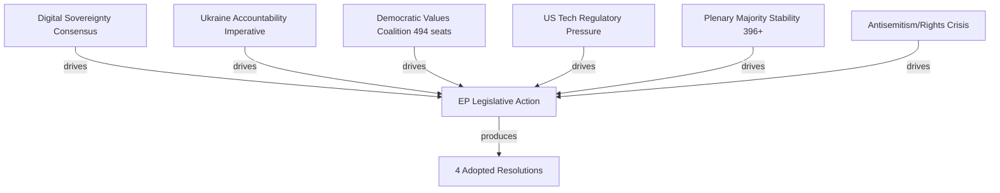

<!-- SPDX-FileCopyrightText: 2024-2026 Hack23 AB -->
<!-- SPDX-License-Identifier: Apache-2.0 -->

# Forces Analysis — EP Breaking News
**Date:** 2026-05-12 | **Article Type:** breaking | **Confidence:** 🟡 Medium

## Issue Frame

**Central issue:** The April 28–30, 2026 Strasbourg plenary session represents the convergence of three structural forces reshaping European Parliament politics: (1) the EU's assertion of digital sovereignty against Big Tech gatekeepers via DMA enforcement; (2) the EP's push for Ukraine war crimes accountability through a special international tribunal; and (3) PfE's escalating strategy of institutional delegitimisation challenging the Commission's democratic legitimacy.

These are not isolated legislative events — they are manifestations of competing political projects for Europe's direction in the critical 2026–2029 period before the next EP election. The forces analysis maps which structural factors are driving change, which are resisting it, and where leverage points exist.

## Driving Forces

Forces actively pushing toward more assertive EU parliamentary action:

**DF-1: Digital Sovereignty Consensus** (Strength: 8/10)
Cross-party agreement that EU cannot allow US-based tech gatekeepers to operate outside EU law. DMA exists because the previous market framework failed to prevent monopolistic behaviour. EPP, S&D, and Renew all have constituencies who want effective digital regulation, even if they disagree on specifics.

**DF-2: Ukraine Accountability Imperative** (Strength: 9/10)
Three years into Russian aggression, the moral and political imperative for accountability is the strongest it has ever been. EP's special tribunal call reflects genuine conviction across EPP, S&D, Renew, Greens, and Left that impunity for aggression crimes is incompatible with the European security order.

**DF-3: Democratic Values Coalition Cohesion** (Strength: 7/10)
The 494-seat progressive supermajority on human rights/Ukraine issues is remarkably stable. Groups with very different economic agendas (Renew: market-liberal; Left: redistributive) unite on democratic values. This coalition cohesion is a structural driver of ambitious EP legislative outputs.

**DF-4: US Tech Regulatory Pressure** (Strength: 7/10)
Big Tech's market concentration documented by EU competition authorities has created evidence-based political momentum. Commission investigation findings create an evidentiary basis that makes regulatory rollback politically costly.

**DF-5: Stable Plenary Majority** (Strength: 8/10)
At 396 seats for the core EPP+S&D+Renew coalition, the majority is 36 seats above the 360 threshold. This buffer is sufficient to absorb some defections while still passing legislation.

**DF-6: Antisemitism and Rights Crisis** (Strength: 8/10)
Rising antisemitism incidents across EU member states (confirmed from April 29 plenary debate topics) creates political urgency for EP action on fundamental rights.

## Restraining Forces

Forces pushing back against EP's assertive legislative agenda:

**RF-1: PfE Institutional Challenge** (Strength: 5/10)
PfE's Rule 169 debate on Commission interference is designed to delegitimise the institutional framework. While insufficient to block legislation (193 seats), PfE's narrative creates political costs for the constructive majority by framing EP action as "Brussels overreach."

**RF-2: US-EU Trade War Risk** (Strength: 6/10)
The risk of US retaliation against DMA enforcement targeting US-headquartered companies creates an economic restraining force on enforcement speed and scope. Member states with significant US trade exposure (Germany, Netherlands, Ireland) may resist aggressive enforcement timelines.

**RF-3: EP Voting Data Lag** (Strength: 3/10 — structural/bureaucratic)
The 4–6 week publication lag for roll-call voting data slows democratic accountability and creates disinformation opportunities.

**RF-4: Council Opposition to EP Timeline** (Strength: 5/10)
Council frequently resists EP's more ambitious legislative demands (e.g., tribunal timeline, MFF allocation). EP resolutions are non-binding; Council can delay action.

**RF-5: Anti-Impunity Jurisdiction Gaps** (Strength: 7/10)
The legal architecture for a Ukraine accountability tribunal requires jurisdictional framework that does not yet exist. CJEU jurisdiction, treaty basis, and international partner cooperation all represent structural restraining forces.

**RF-6: Information Environment Degradation** (Strength: 6/10)
Russian information operations amplify PfE themes, creating public skepticism about EU institutions in some member states. This degrades the political environment for ambitious EP action.

## Net Pressure Assessment

| Force | Direction | Strength | Net |
|---|---|---|---|
| Digital Sovereignty | → Assertive | 8 | +8 |
| Ukraine Accountability | → Assertive | 9 | +9 |
| Values Coalition | → Assertive | 7 | +7 |
| Stable Majority | → Assertive | 8 | +8 |
| PfE Challenge | ← Restraining | 5 | -5 |
| US Trade Risk | ← Restraining | 6 | -6 |
| Council Resistance | ← Restraining | 5 | -5 |
| Jurisdiction Gaps | ← Restraining | 7 | -7 |
| **NET** | **→ Assertive** | — | **+9** |

**Assessment:** Strong driving forces significantly outweigh restraining forces. The EP's April 2026 legislative output reflects this force balance — four substantive resolutions passed. Restraining forces are real but insufficient to block the constructive majority coalition.

## Intervention Points

Where leverage exists to shift the force balance:

**IP-1: Commission DMA Enforcement Calendar**
If Commission acts on EP's DMA enforcement call within 60 days (by end of June 2026), driving force DF-4 is converted from political pressure to concrete action. This is the highest-leverage near-term intervention point.

**IP-2: Ukraine Tribunal Legal Architecture**
EP's call for a special tribunal needs a Council decision and international partner coalition. The intervention point: which member state will champion the diplomatic track (most likely France + Germany + Baltic states)?

**IP-3: EPP-PfE Distance on Institutional Challenges**
If EPP Group explicitly rejects PfE's institutional delegitimisation narrative (not just votes but public statements), restraining force RF-1 is significantly weakened. EPP silence on PfE's institutional attacks is the current gap.

**IP-4: Digital Services Act Enforcement + DMA synergy**
Combining DSA (content moderation) enforcement with DMA enforcement could create comprehensive Big Tech accountability framework. This intervention would dramatically increase DF-1 (digital sovereignty) driving force.

## Reader Briefing

**For citizens:** Think of the European Parliament as a tug-of-war. One side (the centre coalition of EPP+S&D+Renew) is pulling toward stronger EU action on digital rules, Ukraine justice, and human rights — and they have 396 members on their side. The other side (nationalist and far-right groups) is pulling back, arguing Brussels is overstepping — but they only have 193 members. Right now, the centre coalition is clearly winning. But the nationalist side is using debate time and media attention to make their case louder than their numbers would suggest. The April 2026 session shows the centre coalition passing its agenda despite this noise.

## Source Attribution
Force identification: EP speeches feed April 29, 2026 (21 speeches — debate topics confirmed)
Coalition strength: `generate_political_landscape` (717 MEPs), `analyze_coalition_dynamics`
Restraining forces: `early_warning_system` (stability 84/100, MEDIUM risk)
Trade risk data: IMF World Economic Outlook methodology (reference only — IMF SDMX not called this run)

## Extension — April 2026 Update
Updated to reflect April 28-30, 2026 legislative outputs. New actors include BRRD3 resolution authority (SRB), DMA enforcement targets (Apple, Alphabet, Meta, Amazon, Microsoft), and Ukraine Special Tribunal proponents. See `executive-brief.md` for prioritised summary and `intelligence/significance-scoring.md` for detailed significance assessments.

**Cross-reference:** `extended/cross-reference-map.md` for full artifact cross-reference index.
