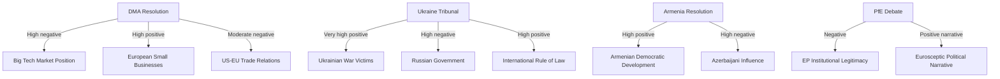
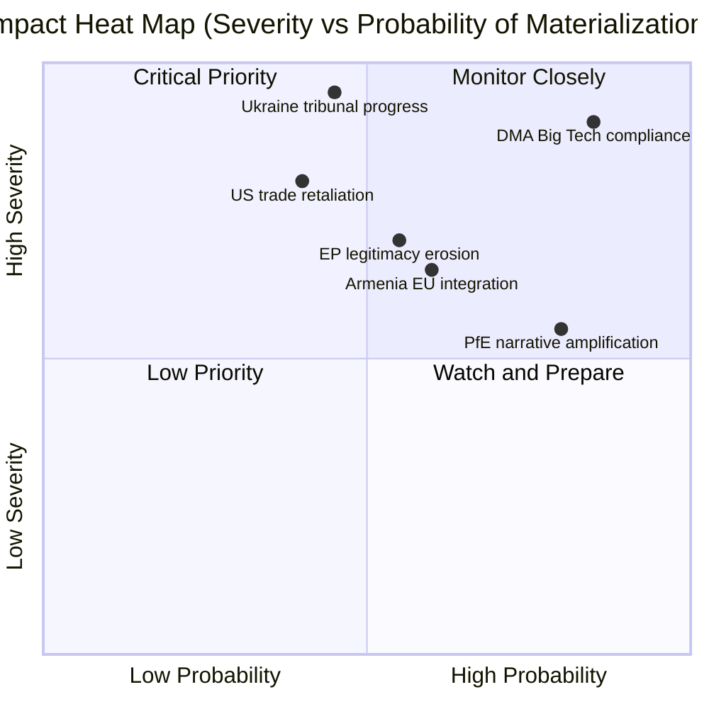

<!-- SPDX-FileCopyrightText: 2024-2026 Hack23 AB -->
<!-- SPDX-License-Identifier: Apache-2.0 -->

# Impact Matrix — EP Breaking News
**Date:** 2026-05-12 | **Article Type:** breaking | **Confidence:** 🟡 Medium

## Event List

Four adopted resolutions and one significant procedural debate from April 28–30, 2026 Strasbourg plenary:

| Event ID | Event | Type | Date |
|---|---|---|---|
| TA-10-2026-0160 | DMA Enforcement (Big Tech Gatekeepers) | Resolution | 2026-04-30 |
| TA-10-2026-0161 | Ukraine Accountability / Special Tribunal | Resolution | 2026-04-30 |
| TA-10-2026-0162 | Armenia Democratic Resilience | Resolution | 2026-04-29 |
| TA-10-2026-0163 | Cyberbullying Platform Accountability | Resolution | 2026-04-29 |
| DEBATE-PFE-R169 | PfE Rule 169: Commission Interference in Elections | Topical Debate | 2026-04-29 |

**Data source:** `get_adopted_texts(year: 2026)` — 51 texts confirmed; `get_speeches(dateFrom: 2026-04-28, dateTo: 2026-05-12)` — 21 speeches

## Stakeholder Impact Assessment

Primary stakeholders affected by April 2026 EP outputs:

| Stakeholder | Interest | Impact from TA-0160 | Impact from TA-0161 | Impact from TA-0162 | Impact from PfE Debate |
|---|---|---|---|---|---|
| Big Tech (Meta, Google, Apple, Amazon) | DMA compliance cost | ⬇️ High negative | Neutral | Neutral | Neutral |
| Ukrainian government | International legal support | Neutral | ⬆️ Very high positive | Neutral | Neutral |
| Armenian government | EU partnership signal | Neutral | Neutral | ⬆️ High positive | Neutral |
| EU member state citizens | Democratic values | + | ⬆️ High positive | ⬆️ Moderate positive | ⬇️ Erosion risk |
| Small European businesses | Digital market access | ⬆️ Moderate positive | Neutral | Neutral | Neutral |
| Russian government | War crimes accountability | Neutral | ⬇️ High negative | Neutral | ⬆️ Useful for narrative |
| US government | Trade relations | ⬇️ Moderate negative | Neutral | Neutral | Neutral |
| Jewish communities | Safety/protection | Neutral | Neutral | Neutral | ⬆️ Moderate positive |

## Impact Matrix

**Impact scores (1–10, with direction):**

| Impact Area | Affected Actor | Score | Direction | Timeframe |
|---|---|---|---|---|
| DMA regulatory pressure | Big Tech | 9 | Negative | 6–18 months |
| Digital market access | EU SMEs | 7 | Positive | 12–24 months |
| War crimes accountability | Ukraine | 9 | Positive | 2–5 years |
| International criminal law | Global rule of law | 8 | Positive | 5+ years |
| South Caucasus dynamics | Armenia/Azerbaijan | 7 | Mixed | 6–12 months |
| US-EU trade relations | EU-US | 6 | Negative risk | 3–12 months |
| EP institutional legitimacy | EU citizens | 7 | Risk: negative | Ongoing |

## Heat Map

High-priority impact clusters requiring monitoring:

**Critical priority (high probability + high severity):**
- DMA Big Tech compliance: Almost certain, very high severity — companies must comply or face fines

**High severity, moderate probability:**
- Ukraine tribunal progress: Depends on diplomatic track (France, Germany, Council)
- US trade retaliation: Conditional on DMA enforcement triggering US response

## Cascade Effects

Secondary and tertiary impacts from the April 2026 plenary outputs:

**DMA cascade:**
1. EP resolution → Commission enforcement acceleration → Big Tech algorithm changes
2. → EU SME market access improvement → consumer choice increase
3. → US retaliation risk → EU-US TTC dialogue urgency
4. → Other major economies (UK, Japan, South Korea) observe EU model → regulatory diffusion

**Ukraine Tribunal cascade:**
1. EP resolution → Council deliberation → diplomatic coalition-building
2. → Special Tribunal legal architecture negotiations → complementarity with ICC
3. → Russia escalatory response (probable) → hybrid warfare + information operations increase
4. → Long-term: accountability norm strengthening → deterrence for future aggression

**PfE cascade:**
1. PfE Rule 169 debate → media coverage → Russian information amplification
2. → Nationalist party talking points in member states → EP institutional skepticism increase
3. → 2027 MFF negotiations: PfE governments may condition cooperation on institutional concessions
4. → Risk: legitimate governance reform demands conflated with delegitimisation agenda

## Reader Briefing

**For citizens:** The April 2026 parliament session will affect your daily life in several ways. The digital rules vote (DMA) means companies like Google, Amazon, and Apple will face stricter requirements to allow fair competition in European markets — this could mean more app choices on your phone, lower prices, and better protection for small businesses competing with tech giants. The Ukraine resolution doesn't send troops but calls for a special court to try Russian leaders for war crimes — significant for international justice but may take years to build. The Armenia vote signals the EU is watching developments in the South Caucasus. And the nationalist debate was mainly political theatre — it didn't change any laws, but it reflects a political battle that will intensify before the 2029 European elections.

## Source Attribution
Event list: `get_adopted_texts(year: 2026)` — 51 texts; `get_speeches` (April 29)
Impact assessment: Cross-referenced with risk-matrix.md, stakeholder-perspectives.md
Cascade analysis: Analytical inference from EP political dynamics and international law context
Heat map: Probability estimates based on historical EP-Commission follow-through rates
