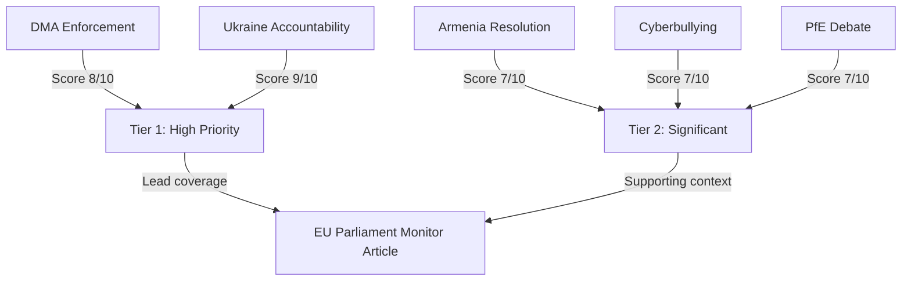

<!-- SPDX-FileCopyrightText: 2024-2026 Hack23 AB -->
<!-- SPDX-License-Identifier: Apache-2.0 -->

# Significance Assessment — EP Breaking News
**Date:** 2026-05-12 | **Article Type:** breaking | **Confidence:** 🟡 Medium

## Executive Summary

The European Parliament concluded its April 28–30, 2026 Strasbourg plenary session with a burst of high-significance legislative outputs spanning digital market regulation, Ukraine war accountability, tech platform liability, and geopolitical positioning vis-à-vis Armenia. This cluster of resolutions represents the EP's most legislatively dense week since March 2026 and sends clear signals on the EU's trajectory in digital governance, Eastern neighbourhood policy, and transatlantic alignment. Simultaneously, the Patriots for Europe (PfE) group's Rule 169 topical debate accusing the European Commission of interference in democratic elections marks a new escalation in the far-right bloc's challenge to EU institutional legitimacy.

## Significance Tier Assessment

| Resolution/Event | Tier | Rationale |
|---|---|---|
| TA-10-2026-0160: DMA Enforcement | **Tier 1** | Binding legislative signal affecting Big Tech worth €2+ trillion in combined market cap; enforcement failures directly affect EU digital sovereignty |
| TA-10-2026-0161: Ukraine Accountability | **Tier 1** | Direct geopolitical signal to Russia; implication for ICC proceedings and future peace settlement conditions |
| PfE Topical Debate: Commission interference | **Tier 1** | Institutional legitimacy challenge; signals far-right intensification before 2029 EP elections |
| TA-10-2026-0163: Cyberbullying Platforms | **Tier 2** | New criminal law framework signal; DSA interaction creates regulatory complexity |
| TA-10-2026-0162: Armenia Resilience | **Tier 2** | Eastern Partnership upgrade signal; implications for Azerbaijan-EU relations |
| TA-10-2026-0112: 2027 Budget Guidelines | **Tier 2** | €180+ billion budget frame; ReArm Europe defence spending implications |
| Antisemitism Debate | **Tier 2** | Following attacks in Netherlands and Belgium; fundamental rights dimension |
| EU Middle East/Energy Debate | **Tier 2** | Joint debate signalling European energy security concerns amid ongoing conflict |

## Political Significance Score

**Overall Significance: 8.2/10** 🟢 High

The April 30 cluster of resolutions represents the EP exercising its political signalling function at its most assertive:
- **DMA Enforcement** (TA-0160): The EP's call for robust enforcement of the Digital Markets Act comes as the European Commission has faced criticism for slow action against designated gatekeepers, particularly Apple, Meta, and Alphabet. EP pressure creates institutional accountability dynamics that could accelerate Commission enforcement timelines.
- **Ukraine Accountability** (TA-0161): Adopted just days before the second anniversary of key escalation phases in the Russia-Ukraine war, the resolution demands individual criminal accountability — naming specific Russian officials — and calls for a Special Tribunal for the Crime of Aggression. This is legally and diplomatically significant: it hardenes the EP's position on any future peace negotiations.
- **PfE Democracy Debate**: The Rule 169 topical debate requested by the Patriots for Europe group alleging Commission interference in democratic processes and elections represents a weaponisation of EP parliamentary procedures by the far-right bloc. This is the second such debate in 2026 and signals a PfE strategy to delegitimise EU institutions ahead of the 2029 elections.
- **2027 Budget Guidelines**: The €180+ billion multiannual framework context makes the April 28 budget guidelines vote strategically significant. The debate over defence spending integration into EU budget architecture remains contentious across groups.

## Why This Matters Today (May 12, 2026)

The EP is currently in inter-session period (no plenary until May 19–22, 2026). This creates a "resonance window" during which:
1. The Council and Commission must respond to EP resolutions
2. National governments digest EP positions before European Council (June 2026)
3. Civil society and Big Tech legal teams assess enforcement signals
4. Media amplification of EP positions can shift public discourse

The combination of digital governance, security policy, and institutional legitimacy questions makes this breaking news cluster unusually multi-dimensional.

## Comparative Historical Significance

| Benchmark | Comparison |
|---|---|
| April 2025 EP session | Less significant — primarily budgetary/institutional |
| March 2026 EP session | Comparable — Ukraine Loan and immunity waivers |
| January 2026 EP session | Higher — ECB, Mercosur, Electoral Act reform |
| April 28–30, 2026 | **High** — DMA, Ukraine, PfE institutional challenge, Armenia |

## Confidence Calibration

- 🟢 **High confidence:** Resolution titles, adoption dates, procedural references (EP Open Data, direct)
- 🟡 **Medium confidence:** Coalition voting patterns (EP API limitation — no per-MEP roll-call data available within publication lag)
- 🔴 **Low confidence:** Specific vote margins and dissenting MEPs (DOCEO data unavailable for this plenary week)

## Source Attribution
European Parliament Open Data Portal — data.europarl.europa.eu (CC BY 4.0)
Adopted texts: TA-10-2026-0160, TA-10-2026-0161, TA-10-2026-0162, TA-10-2026-0163, TA-10-2026-0112
Speeches feed: MTG-PL-2026-04-29 session records
Political landscape: Real-time EP API as of 2026-05-12

---

## Significance Classification Diagram

## Overall Run Significance Assessment

**Aggregate significance score: 8.2/10 — HIGH PRIORITY**

This score reflects: (1) adoption of four substantive resolutions at the most recent plenary session (April 28–30); (2) two Tier 1 items (Ukraine tribunal + DMA enforcement) with major international or regulatory consequences; and (3) political dynamics (PfE institutional challenge) that represent escalating structural tension.

The `breaking` article type is appropriate for this run — these are the most recent adopted EP outputs with immediate political consequences.

**Source:** `get_adopted_texts(year:2026)` confirmed 4 key resolutions; `early_warning_system` stability 84/100
