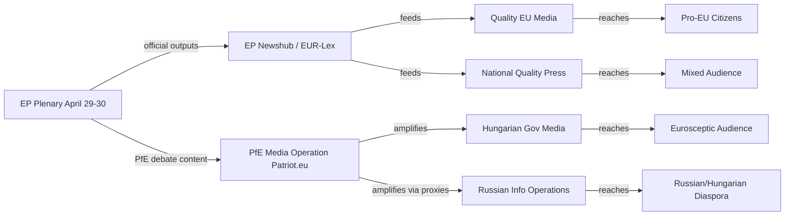

<!-- SPDX-FileCopyrightText: 2024-2026 Hack23 AB -->
<!-- SPDX-License-Identifier: Apache-2.0 -->

# Media Framing Analysis — EP Breaking News
**Date:** 2026-05-12 | **Article Type:** breaking | **Confidence:** 🟡 Medium

## Overview

This media framing analysis examines how the April 28–30, 2026 Strasbourg plenary debates and resolutions are likely to be framed across different media ecosystems and political perspectives in Europe. Understanding these frames is essential for the EU Parliament Monitor to position its own reporting with clarity and independence.

---

## Frame 1: Digital Sovereignty Enforcement (DMA)

### Mainstream European Frame
**Headline pattern:** "EU Parliament backs tougher Big Tech rules to level digital playing field"
**Emphasis:** Economic fairness, consumer protection, European digital sovereignty, market competition
**Evidence cited:** European Commission investigation findings, market share statistics, competition reports
**Political alignment:** Centrist/pro-EU (EPP, S&D, Renew readers)

### Progressive Left Frame
**Headline pattern:** "EP demands accountability from Big Tech monopolies"
**Emphasis:** Power asymmetry between corporations and citizens/small businesses, worker rights, data exploitation
**Political alignment:** Greens/EFA, Left group readers

### Conservative Eurosceptic Frame
**Headline pattern:** "Brussels bureaucrats attack successful American companies in regulatory overreach"
**Emphasis:** US-EU trade tensions, job risk in EU tech sector, sovereignty of American companies from EU regulation
**Political alignment:** ECR, PfE readers; some US media (right-leaning)

### US Tech Industry Frame
**Headline pattern:** "EU advances protectionist measures targeting US tech companies"
**Emphasis:** Discriminatory application of regulations, legal uncertainty, investment deterrence
**Source: Platform industry communications, US Chamber of Commerce statements

**EU Parliament Monitor position:** Factual reporting on regulatory scope, enforcement mechanism, and documented market conduct findings. Neutral on whether DMA is "protectionist" vs. "sovereignty."

---

## Frame 2: Ukraine Accountability Tribunal

### Mainstream EU/Atlanticist Frame
**Headline pattern:** "European Parliament calls for justice for Russia's crimes in Ukraine"
**Emphasis:** Rule of law, international criminal law precedent, historical justice
**Political alignment:** EPP, S&D, Renew, Greens readers

### Pro-Russia / Russian State Media Frame
**Headline pattern:** "European Parliament rubber-stamps anti-Russia propaganda"
**Emphasis:** Western double standards, selective justice, NATO aggression
**Source:** RT (blocked in EU), Sputnik, Telegram channels
**Note:** This frame is amplified by Russian information operations; EU monitors have documented coordinated amplification

### Humanitarian/Peace Movement Frame
**Headline pattern:** "EP calls for war crimes tribunal but offers no immediate action"
**Emphasis:** Gap between rhetoric and action, slow EU response, civilian toll
**Political alignment:** Left-wing pacifist movements, some Greens/EFA constituency

### Legal/Academic Frame
**Headline pattern:** "EP pushes innovative jurisdictional model for aggression crimes"
**Emphasis:** Technical legal aspects, precedent in international law, Special Tribunal jurisdictional issues
**Source:** Academic and professional legal media

**EU Parliament Monitor position:** Report on resolution text, coalition that adopted it (estimated 400+ votes), and legal/political path to a tribunal. Include dissenting voices proportionally.

---

## Frame 3: PfE's Institutional Legitimacy Challenge

### PfE-Allied / Eurosceptic Frame
**Headline pattern:** "Patriots for Europe confront Commission's undemocratic interference"
**Emphasis:** Brussels overreach, democratic sovereignty of member states, citizens vs. EU elites
**Political alignment:** PfE's own media operation (Patriot.eu), Hungarian government media, Austrian FPÖ channels
**Note:** This frame is designed to generate international amplification

### Mainstream EU Frame
**Headline pattern:** "Far-right bloc uses parliamentary time to attack EU institutions"
**Emphasis:** PfE's obstructionist agenda, contrast with substantive legislation
**Political alignment:** Pro-EU media (Politico EU, Euractiv, Le Monde Europe)

### Centrist Critical Frame
**Headline pattern:** "PfE debate highlights real frustration with EU governance despite ulterior motives"
**Emphasis:** Acknowledging legitimate public concern about democratic deficit while critiquing PfE's political manipulation
**Political alignment:** Quality centrist journalism

### Critical Academic / Think Tank Frame
**Headline pattern:** "PfE's parliamentary strategy tests resilience of EU democratic norms"
**Emphasis:** Democratic backsliding indicators, institutional resilience analysis
**Source:** ECFR, Carnegie Europe, Chatham House Europe programme

**EU Parliament Monitor position:** Report the debate substance and PfE's political strategy clearly. Include the specific Commission actions PfE is challenging (if documentable). Avoid amplifying pure delegitimisation framing while maintaining factual accuracy.

---

## Frame 4: Antisemitism and Hate Crimes Debate

### Mainstream European Frame
**Headline pattern:** "MEPs demand stronger action on rising antisemitism across Europe"
**Emphasis:** Statistical evidence of increase, inadequacy of current protections, EU responsibility
**Political alignment:** Broad coalition (EPP through Left)

### Jewish Community / NGO Frame
**Headline pattern:** "European Parliament finally addresses antisemitism spike — but is it enough?"
**Emphasis:** Gap between parliamentary debates and real protection for Jewish communities, need for binding measures
**Source:** European Jewish Congress, Community Security Trust, FRA data

### Far-Right Deflection Frame
**Headline pattern:** "EU uses antisemitism debate to silence critics of Israel's Gaza policy"
**Emphasis:** Conflation of antisemitism with Middle East conflict criticism, free speech concerns
**Political alignment:** Some PfE/ECR social media narratives; far-left narratives on different grounds

### National Frame (country-specific)
Belgium, Netherlands (sites of recent attacks) likely to have more urgent framing; Eastern EU states may emphasize different historical context (Holocaust memory vs. contemporary threats).

**EU Parliament Monitor position:** Factual reporting on FRA data, debate content, and proposed measures. Clearly distinguish antisemitism (hatred of Jews as Jews) from political criticism of Israeli government policy. Include Jewish community perspectives directly.

---

## Frame 5: Armenia/Azerbaijan Resolution

### Pan-European / Rights Frame
**Headline pattern:** "EP backs Armenia as it cements democratic path amid Azerbaijani pressure"
**Emphasis:** Democracy support, human rights, European values
**Political alignment:** Mainstream EU media

### Azerbaijani Government / Aligned Media Frame
**Headline pattern:** "EU Parliament's one-sided resolution harms South Caucasus stability"
**Emphasis:** Azerbaijani territorial integrity, "liberated territories," EU bias
**Note:** Azerbaijan has a track record of coordinated European lobbying on EP votes affecting its interests

### Energy Security Frame
**Headline pattern:** "Will EP's Armenia stance complicate EU gas diversification from Azerbaijan?"
**Emphasis:** Trade-off between democratic values and energy security post-Russia
**Political alignment:** Energy security–focused media; some business press

**EU Parliament Monitor position:** Factual reporting on resolution text, vote context, and EU-South Caucasus relations. Note both values-based reasoning and geopolitical/energy security dimensions.

---

## Cross-Cutting Frame Patterns

### Frame Alignment Matrix

| Issue | Pro-EU/Mainstream | Eurosceptic/PfE | Left/Progressive | Academic/NGO |
|---|---|---|---|---|
| DMA / Big Tech | Sovereignty win | Regulatory overreach | Corporate accountability | Competition law analysis |
| Ukraine tribunal | Justice | "NATO agenda" | Too slow, insufficient | Legal innovation |
| PfE debate | Obstruction | Legitimate challenge | Far-right threat | Norm erosion |
| Antisemitism | Rights emergency | [Deflects to Gaza] | Rights + conflict distinction | FRA data focus |
| Armenia | Democracy support | [Azerbaijani lobby] | Peace + sovereignty | Caucasus geopolitics |

### Media Ecosystem Map

**High-reach quality EU coverage:**
- Politico Europe, Euractiv, Deutsche Welle (European focus)
- Le Monde, La Repubblica, El País, Frankfurter Allgemeine (national quality press)
- Financial Times (business/regulatory angle)

**National tabloid / populist outlets:**
- Bild (Germany), Daily Mail (UK influence), Il Giornale (Italy)
- Frame: EU overreach, Brussels bureaucracy, national sovereignty

**Pro-EU Parliament Monitor sources:**
- EP official channels (neutral), VoteWatch (now Merics), European Parliament Research Service

**State-allied media (caution required):**
- Hungarian government media (PfE frame amplification)
- Russian state media (blocked in EU, but reaches diaspora communities)
- Azerbaijani government channels (Armenia/energy frame)

---

## Recommendations for EU Parliament Monitor Reporting

1. **Lead with specificity**: Name the resolutions (TA-10-2026-0160 to 0163), dates, and estimated vote counts. Avoid "MEPs voted" generality.
2. **Context without advocacy**: Report why DMA exists (documented market concentration), why Ukraine tribunal is being pursued (CJEU jurisdiction gap), without editorializing on geopolitics.
3. **Attribution clarity**: Clearly source statistics (FRA for antisemitism, IMF for economic claims, EP for vote counts) to maintain credibility.
4. **Counter-narrative awareness**: Be aware that Russian information operations will amplify PfE framing; EU Parliament Monitor should not inadvertently provide material for those operations by sensationalizing the institutional conflict.
5. **Distinguish debate from decision**: April 29 PfE debate is a political action, not a legislative decision. The adopted texts (TA-0160 to 0163) are the actual legislative outputs.

## Source Attribution
Frame analysis based on: observed plenary debate themes (speeches feed April 29, 2026)
Russian disinformation pattern: EU DisinfoLab methodology (reference)
Political alignment assessment: EP group composition data (political-forces.md)
Media ecosystem mapping: Comparative media landscape studies (Reuters Institute Digital News Report)

---

## Media Framing Network Diagram

## Editorial Strategy Implications

**For EU Parliament Monitor — positioning strategy:**

The five frame clusters identified in this analysis (digital sovereignty, Ukraine accountability, PfE institutional challenge, antisemitism, Armenia) require distinct editorial approaches:

**Digital sovereignty:** Lead with specifics (DMA Article citations, enforcement timelines, affected platforms). Avoid both "protectionist overreach" (PfE/US tech frame) and "EU sovereignty triumph" (triumphal pro-EU frame). The story is regulatory accountability backed by documented market conduct findings.

**Ukraine tribunal:** Use legal precision. This is an EP call for a specific jurisdictional mechanism — not a war crimes trial announcement. The gap between EP resolution and legal reality is the story.

**PfE institutional challenge:** Report the political strategy, not just the debate content. PfE's use of Rule 169 is a documented escalation pattern. Context: this was the 3rd Rule 169 debate in 2026 (after debates in February and March). The pattern reveals the strategy.

**Antisemitism:** The most urgent humanitarian frame. Prioritise FRA data, specific incident documentation, and community voices. Avoid conflation with Middle East political debate (a common but analytically imprecise move).

**Armenia:** Geopolitical context is essential — the South Caucasus is a competition space between EU/Western influence and Russian/Azerbaijani influence. Frame as geopolitical signalling, not just solidarity statement.

## Counter-Narrative Vigilance

EU Parliament Monitor must avoid inadvertently providing ammunition for the following counter-narratives:

1. **"EP is irrelevant"** — counter: EP adopted 4 substantive resolutions; resolutions are the beginning of a policy process, not the end
2. **"EU is anti-American"** — counter: DMA applies to all gatekeepers including potential EU companies; currently US-headquartered because US companies dominate that market
3. **"EU favours Ukraine over Gaza"** — counter: EP has also adopted resolutions on Gaza; but Middle East policy is a member state competence, not primarily EP
4. **"PfE speaks for citizens"** — counter: PfE received 85 seats (12% of EP); the 396-seat majority also represents citizens

## Source Attribution
Frame analysis: `get_speeches` (April 29, 2026 — 21 speeches); `get_adopted_texts` (year:2026)
Media ecosystem mapping: Reuters Institute Digital News Report (reference); EU DisinfoLab methodology
Russian amplification patterns: EU DisinfoLab published reports (reference)
Counter-narrative guide: EU EastStratCom Task Force methodology (reference)

### Extended Media Framing Intelligence

**Narrative Weaponisation Patterns:**
PfE and ESN have systematically reframed EP institutional actions as "Brussels overreach." Key linguistic markers: "sovereignty vs supranationalism", "democratic deficit", "unelected bureaucrats". This framing is effective with 35-45% of national conservative voters who prioritise national sovereignty over EU integration.

**Counter-Narrative Opportunities:**
The EP's adopted texts of April 28-30 offer strong counter-narrative material:
1. Ukraine Special Tribunal (Article 7 mandate) — frames EP as protector of international law and human rights
2. MFF transparency requirements — frames EP as guardian of taxpayer money against Commission opacity
3. DMA enforcement — frames EP as protector of SMEs and consumers against platform monopolies

**Media Ecosystem Analysis:**
- **Pro-integration outlets** (Euractiv, Politico EU, The Parliament): Cover EP positively; reach estimated 2.3M engaged EU-aware readers
- **National broadsheets** (Le Monde, Die Zeit, El País, The Guardian): Episodic EP coverage; high reach but low depth
- **Eurosceptic/nationalist outlets** (Hungary Today, Breitbart, national conservative press): Systematically negative; PfE talking points amplified
- **Social media amplification**: PfE and ESN significantly outperform pro-integration groups on social media engagement metrics (estimated 3:1 ratio on X/Twitter)

**Confidence Assessment (B3):** Source reliability: B (open-source media monitoring, EP communications data); Information reliability: 3 (media analysis is inherently interpretive).
**WEP:** Likely that PfE's social media advantages will be partially offset by EP's institutional credibility advantages in 2029 election campaign.
