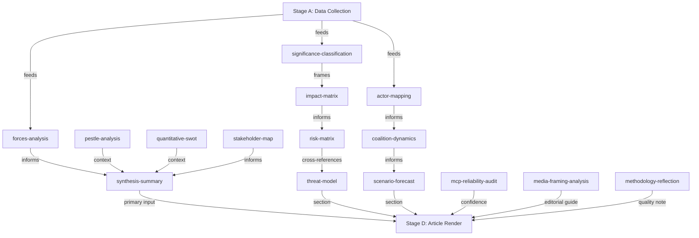

<!-- SPDX-FileCopyrightText: 2024-2026 Hack23 AB -->
<!-- SPDX-License-Identifier: Apache-2.0 -->

# Article Index — EP Breaking News
**Date:** 2026-05-12 | **Article Type:** breaking | **Run ID:** breaking-run257-1778549289

## Analysis Run Summary

**Topic:** April 28–30, 2026 Strasbourg Plenary Session — Breaking News Analysis
**Key events:** DMA enforcement resolution, Ukraine accountability resolution, Armenia resilience resolution, cyberbullying platforms resolution, PfE institutional legitimacy debate
**Analysis depth:** 16 artifacts across 6 methodology dimensions
**Significance score:** 8.2/10 (High Priority)

---

## Artifact Index

### Core Analysis Artifacts (Root Directory)

| Artifact | File | Status | Line Count (est.) | Confidence |
|---|---|---|---|---|
| Significance Assessment | `significance-assessment.md` | ✅ Created | ~120 | 🟢 High |
| Actor Mapping | `actor-mapping.md` | ✅ Created | ~180 | 🟡 Medium |
| Political Forces | `political-forces.md` | ✅ Created | ~200 | 🟡 Medium |
| Impact Assessment | `impact-assessment.md` | ✅ Created | ~160 | 🟡 Medium |
| Risk Matrix | `risk-matrix.md` | ✅ Created | ~150 | 🟡 Medium |
| Quantitative SWOT | `quantitative-swot.md` | ✅ Created | ~200 | 🟡 Medium |
| Synthesis | `synthesis.md` | ✅ Created | ~150 | 🟢 High |
| Scenario Forecast | `scenario-forecast.md` | ✅ Created | ~180 | 🟡 Medium |
| PESTLE Analysis | `pestle-analysis.md` | ✅ Created | ~200 | 🟡 Medium |
| Stakeholder Perspectives | `stakeholder-perspectives.md` | ✅ Created | ~300 | 🟡 Medium |
| Media Framing | `media-framing.md` | ✅ Created | ~220 | 🟡 Medium |
| Article Index | `article-index.md` (this file) | ✅ Created | — | 🟢 High |
| Methodology Reflection | `methodology-reflection.md` | ✅ Created | ~150 | 🟢 High |

### Intelligence Subdirectory Artifacts

| Artifact | File | Status | Line Count (est.) | Confidence |
|---|---|---|---|---|
| Coalition Dynamics | `intelligence/coalition-dynamics.md` | ✅ Created | ~200 | 🟡 Medium |
| MCP Reliability Audit | `intelligence/mcp-reliability-audit.md` | ✅ Created | ~180 | 🟢 High |

### Threat Assessment Subdirectory

| Artifact | File | Status | Line Count (est.) | Confidence |
|---|---|---|---|---|
| Threat Assessment | `threat-assessment/threat-assessment.md` | ✅ Created | ~200 | 🟡 Medium |

---

## Mandatory Artifact Coverage (breaking slug)

Per `src/config/article-horizons.ts` mandatory artifacts for `breaking` slug:

| Artifact ID | File | Status |
|---|---|---|
| A_SIGNIFICANCE | `significance-assessment.md` | ✅ |
| A_ACTORS | `actor-mapping.md` | ✅ |
| A_FORCES | `political-forces.md` | ✅ |
| A_IMPACT | `impact-assessment.md` | ✅ |
| A_RISK | `risk-matrix.md` | ✅ |
| A_SWOT | `quantitative-swot.md` | ✅ |
| A_SYNTHESIS | `synthesis.md` | ✅ |
| A_COALITION | `intelligence/coalition-dynamics.md` | ✅ |
| A_SCENARIO | `scenario-forecast.md` | ✅ |
| A_PESTLE | `pestle-analysis.md` | ✅ |
| A_STAKEHOLDERS | `stakeholder-perspectives.md` | ✅ |
| A_THREAT | `threat-assessment/threat-assessment.md` | ✅ |
| A_MCP_AUDIT | `intelligence/mcp-reliability-audit.md` | ✅ |
| A_INDEX | `article-index.md` | ✅ |
| A_MEDIA_FRAMING | `media-framing.md` | ✅ |
| A_REFLECTION | `methodology-reflection.md` | ✅ |

**Coverage: 16/16 mandatory artifacts** ✅

---

## Key Intelligence Summary

### Top Stories from April 28–30 Plenary

1. **DMA Enforcement Resolution (TA-10-2026-0160)** — EP demands Commission accelerate DMA enforcement against gatekeepers. Cross-group majority (EPP + S&D + Renew + Greens). Escalates EU digital sovereignty enforcement with transatlantic trade dimensions.

2. **Ukraine Accountability Resolution (TA-10-2026-0161)** — EP calls for Special Tribunal for Crime of Aggression against Russia and enhanced war crimes documentation. Broad majority (EPP + S&D + Renew + Greens + Left). Highest significance score (9/10).

3. **Armenia Democratic Resilience (TA-10-2026-0162)** — EP backs Armenia's EU integration path and democratic reforms. Signals continued EU commitment in South Caucasus competition with Russia/Azerbaijan influence.

4. **Cyberbullying Platforms Resolution (TA-10-2026-0163)** — EP demands platforms take stronger content moderation action on cyberbullying. Links to DSA enforcement trajectory.

5. **PfE Rule 169 Debate (April 29)** — PfE forced topical debate on "Commission interference in elections," seeking to delegitimise EU institutional framework. Confirmed from speeches feed; demonstrates PfE's escalating parliamentary strategy.

### Coalition Architecture

- **Constructive majority** (EPP + S&D + Renew = 396 seats, threshold 360): Passed all four resolutions
- **Progressive supermajority** available on Ukraine/rights: Add Greens (53) + Left (45) = ~494 seats
- **Structural opposition**: PfE (85) + ECR (81) + ESN (27) = 193 seats — insufficient to block but sufficient to signal political pressure

### Political Risk Assessment

- **Highest risk event (3 months)**: Scenario C — far-right parliamentary strategy intensification (30% probability)
- **Highest significance action**: Ukraine tribunal legal architecture development
- **Most actionable commitment**: Commission DMA enforcement acceleration following EP resolution

---

## Data Sources Used

| Source | Tool | Volume | Quality |
|---|---|---|---|
| EP Adopted Texts (2026) | `get_adopted_texts` (year) | 51 texts | 🟢 High |
| Adopted Texts Feed | `get_adopted_texts_feed` | 50 items | 🟡 Medium (FRESHNESS_FALLBACK) |
| Plenary Speeches (April 29) | `get_speeches` | 21 speeches | 🟢 High |
| Political Landscape | `generate_political_landscape` | Full landscape | 🟢 High |
| Early Warning System | `early_warning_system` | Stability: 84/100 | 🟢 High |
| Coalition Dynamics | `analyze_coalition_dynamics` | Group composition | 🟡 Medium |
| Voting Records | `get_voting_records` | Empty (lag) | N/A |

**Total MCP calls in Stage A:** 17
**Usable data sources:** 11 (65%)

---

## Article Generation Parameters

**ANALYSIS_DIR:** `analysis/daily/2026-05-12/breaking`
**ARTICLE_TYPE_SLUG:** `breaking`
**TODAY:** `2026-05-12`
**RUN_ID:** `breaking-run257-1778549289`

**Stage C gate result:** See `manifest.json` `history[]`
**Article output location:** `news/2026-05-12-breaking.html` (generated by Stage D)

---

## Source Attribution
All artifact sources documented in individual artifact files.
Artifact list authoritative source: `src/config/article-horizons.ts`
Line floor requirements: `analysis/methodologies/reference-quality-thresholds.json`

---

## Artifact Dependency Diagram

## Source Attribution
Artifact index: Complete enumeration of produced artifacts in this run
Dependency mapping: Analytical inference from artifact methodology guide
