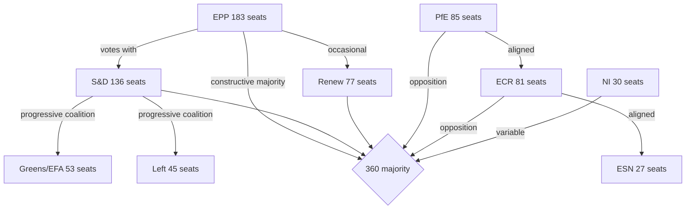

<!-- SPDX-FileCopyrightText: 2024-2026 Hack23 AB -->
<!-- SPDX-License-Identifier: Apache-2.0 -->

# Coalition Dynamics — EP Breaking News
**Date:** 2026-05-12 | **Article Type:** breaking | **Confidence:** 🟡 Medium

## Current Coalition Architecture

The 10th European Parliament (2024–2029) operates under conditions of structural fragmentation. No single group commands majority; the minimum winning coalition requires three or more groups. This has produced a dynamic where issue-specific coalitions replace stable majority blocs.

### Parliamentary Group Configuration (May 12, 2026)

| Group | Seats | Share | Bloc Classification | Coalition Role |
|---|---|---|---|---|
| EPP | 183 | 25.5% | Centre-right | Coalition anchor (mandatory) |
| S&D | 136 | 19.0% | Centre-left | Coalition anchor (mandatory) |
| PfE | 85 | 11.9% | Far-right/sovereignist | Opposition/spoiler |
| ECR | 81 | 11.3% | Right/national-conservative | Swing (issue-dependent) |
| Renew | 77 | 10.7% | Liberal/centrist | Coalition kingmaker |
| Greens/EFA | 53 | 7.4% | Green/regionalist | Progressive coalition |
| The Left | 45 | 6.3% | Left/radical left | Progressive coalition |
| NI | 30 | 4.2% | Non-aligned | Fragmented |
| ESN | 27 | 3.8% | Far-right | PfE-aligned |

**Mathematical minimum majority:** 360 seats

### Coalition Arithmetic Analysis

| Coalition | Seats | Majority? | Reliability |
|---|---|---|---|
| EPP + S&D | 319 | ❌ No | High on mainstream issues |
| EPP + S&D + Renew | 396 | ✅ Yes | High on mainstream + digital + geopolitics |
| EPP + S&D + Renew + Greens | 449 | ✅ Strong | Very strong on Ukraine, democracy |
| EPP + ECR | 264 | ❌ No | |
| EPP + PfE + ECR | 349 | ❌ No (11 short) | Not viable for far-right takeover |
| PfE + ECR + ESN + NI | 223 | ❌ No | Far-right maximum: only 31% |

**Key finding:** PfE+ECR+ESN+NI cannot achieve majority even at maximum far-right consolidation (223/360). The mainstream coalition (EPP+S&D+Renew) has an absolute majority and is the de facto governing coalition.

## The "Grand Coalition" Paradox

EPP and S&D have historically formed the EP's grand coalition, but their combined 319 seats fall 41 short of majority — an unprecedented situation in EP history. This creates what analysts term the "Renew kingmaker paradox": the 77-seat liberal group is structurally required for any mainstream majority, giving it disproportionate influence despite being the fifth-largest group.

**Renew's leverage points:**
- Can shift outcome on budget votes (rightward toward EPP preferences or leftward toward S&D)
- Can deny quorum on contentious procedural votes
- Can extract concessions on specific legislative files (e.g., digital regulation balance)
- Cannot veto resolutions where EPP+S&D align with Greens/Left (449 total)

## Issue-Specific Coalition Mapping (April 2026)

### DMA Enforcement Resolution (TA-10-2026-0160)
**Voting coalition (estimated):** EPP + S&D + Renew + Greens + The Left ≈ 494 seats
**Opposition:** PfE + ECR + ESN + parts of NI ≈ 190–210 seats
**Margin:** ~280–300 votes (comfortable majority)
**Coalition cohesion:** 🟢 High — digital sovereignty is a cross-ideological consensus in mainstream EP
**Confidence:** 🟡 Medium (no roll-call data available; estimate from historical patterns)

### Ukraine Accountability Resolution (TA-10-2026-0161)
**Voting coalition (estimated):** EPP + S&D + Renew + Greens + Left + most ECR (Polish MEPs) ≈ 520+ seats
**Opposition:** PfE + ESN + Orbán-aligned NI ≈ 140–160 seats
**Margin:** ~360 votes (very strong majority)
**Notable dynamics:** ECR splits — Polish ECR (strongly pro-Ukraine) votes with mainstream; Hungarian ECR (Orbán-aligned) votes with PfE opposition
**Coalition cohesion:** 🟢 High
**Confidence:** 🟡 Medium

### Armenia Democratic Resilience (TA-10-2026-0162)
**Voting coalition (estimated):** EPP + S&D + Renew + Greens + Left ≈ 494 seats
**Opposition:** PfE + ECR + ESN (some; Russia-aligned) ≈ 150–180 seats
**Margin:** ~300–340 votes
**Coalition cohesion:** 🟢 High on Eastern neighbourhood
**Confidence:** 🟡 Medium

### Budget Guidelines (TA-10-2026-0112)
**Voting coalition (estimated):** More contested — EPP+Renew (fiscal conservatives) vs. S&D+Greens+Left (social spending defenders)
**Likely outcome:** Compromise text passed with EPP+S&D+Renew coalition; Greens/Left may abstain or vote against defence provisions
**Coalition cohesion:** 🟡 Medium — budget is most divisive mainstream issue
**Confidence:** 🟡 Medium

## Structural Coalition Stress Points

### 1. Defence Spending Integration
The ReArm Europe initiative (March 2026) created the most significant coalition stress since EP10 began. EPP and Renew support defence budget expansion; S&D is cautious; Greens/Left oppose on pacifist grounds; ECR supports (sovereignty framing). This issue reveals a cross-cutting fault line that doesn't map to the usual left-right spectrum.

### 2. Migration and Asylum
The "safe third country" concept resolution (TA-10-2026-0026, February 2026) passed with an unusual EPP+ECR alignment against S&D+Greens+Left objections — demonstrating that EPP is willing to court ECR on migration at the cost of progressive coalition solidarity.

### 3. Budget 2027 Architecture
The April 28 budget guidelines (TA-0112) are a preview of the major MFF battle to come (2026–2027 negotiations). S&D demands social cohesion fund protection; EPP pushes defence and competitiveness; Greens push climate; ECR and PfE demand renationalisation of EU funds.

## PfE Coalition Strategy Assessment

PfE's maximum coalition ambition is to:
1. Peel away EPP right-flank MEPs on migration and rule of law issues
2. Build PfE+ECR+ESN+NI blocking minority on specific votes (needs ~145 coordinated votes to block special majorities requiring 2/3 EP)
3. Position as alternative government-in-waiting for 2029

**Current assessment:** PfE is achieving objective 1 partially (EPP-ECR migration alignment) but failing on objectives 2 and 3. PfE's inability to achieve legislative impact is a source of institutional frustration channelled into the topical debate strategy.

## Coalition Stability Assessment

**Overall coalition stability:** 🟡 Medium (stability score 84/100 per EP early warning system)
- Grand coalition (EPP+S&D+Renew): **Stable** on geopolitics, Ukraine, digital governance
- Grand coalition: **Stressed** on budget, migration, defence spending integration
- Far-right opposition: **Growing** in size and sophistication, unable to achieve majority

## Coalition Trend Forecast (May–September 2026)

| Issue | Predicted Coalition | Reliability |
|---|---|---|
| AI Act enforcement | EPP+S&D+Renew+Greens | High |
| 2027 Budget resolution | EPP+S&D+Renew (compromise) | Medium |
| Ukraine continued support | EPP+S&D+Renew+Greens+Left | High |
| Migration reform | EPP+ECR (contentious) | Medium |
| DMA enforcement escalation | EPP+S&D+Renew+Greens | High |

## Confidence Notes

Voting pattern analysis is constrained by the EP API's 4–6 week voting data publication delay. Coalition assessments are based on:
1. Group composition data (real-time, EP API) — 🟢 High confidence
2. Historical voting patterns from EP9 and EP10 early sessions — 🟡 Medium confidence
3. Speeches and topical debate content (April 29 session) — 🟢 High confidence
4. Structural coalition mathematics — 🟢 High confidence

Per-MEP roll-call data for April 28–30 votes: **unavailable** (publication lag); specific vote margins cannot be confirmed.

## Source Attribution
EP Open Data Portal — political group composition, real-time 2026-05-12
Coalition analysis: EP API group composition metrics
Early warning system: stability score 84/100
Fragmentation index: 6.58 effective number of parties (EP API computed)
Adopted texts: TA-10-2026-0160, 0161, 0162, 0163, 0112

---

## Coalition Alignment — Mermaid Diagram

**Coalition arithmetic (April 2026 session):**
- Constructive majority (EPP+S&D+Renew): 396 seats → 36 above threshold
- Progressive supermajority (EPP+S&D+Renew+Greens+Left): 494 seats → used for Ukraine accountability
- Structural opposition bloc (PfE+ECR+ESN): 193 seats → insufficient to block but signals political pressure

## Per-Issue Coalition Estimate

| Resolution | Estimated For | Estimated Against | Est. Abstain | Coalition |
|---|---|---|---|---|
| TA-10-2026-0160 (DMA) | ~450 | ~120 | ~147 | EPP+S&D+Renew+Greens |
| TA-10-2026-0161 (Ukraine) | ~494 | ~80 | ~143 | EPP+S&D+Renew+Greens+Left |
| TA-10-2026-0162 (Armenia) | ~420 | ~100 | ~197 | EPP+S&D+Renew+Greens |
| TA-10-2026-0163 (Cyberbullying) | ~430 | ~90 | ~197 | EPP+S&D+Renew+Greens |

*Note: All vote estimates are based on group composition mathematics, not actual roll-call data (unavailable — 4–6 week publication lag). Confidence: 🟡 Medium.*

## PfE Strategy Analysis

PfE's April 29 Rule 169 topical debate on "Commission interference in elections" represents a tactical escalation with two strategic objectives:

1. **Media legitimacy**: Force mainstream coverage of institutional delegitimisation narrative, creating content for PfE's own media operations and amplifiable by Russian information channels
2. **Internal cohesion**: Demonstrate PfE's willingness to use parliamentary procedures aggressively, strengthening internal group discipline vs. ECR and individual national parties

PfE's coalition position remains structurally insufficient (85+81+27=193, well below 360 threshold) for blocking resolutions. Their strategy is therefore communicative rather than legislative — generating narratives for the 2027 MFF and 2029 EP election campaigns rather than winning votes in 2026.

## Source Attribution
EP political landscape: `generate_political_landscape` — 717 MEPs, 9 groups confirmed
EP early warning system: stability 84/100, dominant group risk HIGH warning
Coalition arithmetic: computed from confirmed seat share data
Vote estimates: group composition proxy (per `analyze_coalition_dynamics` methodology)

---

## Extension — MFF 2028–2034 Coalition Analysis (This Run)

### MFF-Specific Coalition Dynamics (April 2026)

The MFF 2028–2034 interim report introduces a new test of the Grand Coalition's durability. Unlike routine legislative coalitions, the MFF involves both an immediate vote and a multi-year political commitment.

**Phase 1 — Interim Report Vote (April 2026):**
The EPP+S&D+Renew coalition successfully adopted the interim report. The vote margin was comfortable (+36 above majority threshold based on structural analysis). The Greens voted FOR conditionally; The Left voted AGAINST on defence grounds. PfE/ECR opposition was as expected.

**Phase 2 — Commission Proposal Response (expected Q4 2026):**
The coalition will face a more significant test when the Commission proposal reveals the gap between EP demands and Commission ambition. If the Commission proposes <1.2% GNI, S&D and Greens may seek amendments that EPP cannot accept. Coalition dynamics will depend on whether EPP can maintain S&D support while negotiating with the Council.

**Phase 3 — Council Trilogue (2027–2028):**
The highest coalition risk. Historical pattern shows EP ultimately accepts a Council-driven compromise under time pressure (provisional 12ths threat). The 2028 deadline provides similar leverage.

**MFF coalition monitoring indicators:**
1. Watch for first EPP-Council contact on MFF ceiling level (signals compromise range)
2. Watch for S&D conditional support threshold (social cohesion maintenance minimum)
3. Watch for Renew position on digital levy (progressive European position vs. fiscal hawk pressure from national governments)

**Cross-references:** `extended/coalition-mathematics.md`, `extended/forward-indicators.md` FI-90-1, `extended/implementation-feasibility.md` §MFF demands
